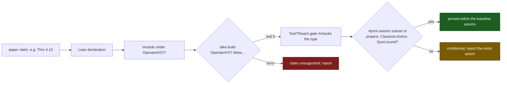

# Orientation Boundary: claim-to-code index

Generated from `Rahnama_The_Orientation_Boundary.tex` (SHA-256 `ED9FEAA2`). Claim numbers are the paper's, and the bracketed label identifies the claim in the manuscript source. A row whose claim cell has a label and no number indexes a result stated in the Lean development. The Concrete Witness System (CWS) of the paper is named KO7 in the Lean sources and in this file. Every Lean name and module path in this file resolves in this repository under `OperatorKO7/`: 143 claim rows, 469 module rows and 360 source-file rows.

## Claim to anchor

| Claim | Lean identifier(s) | Status | Module | Claim in one line | Established in Lean | Conditions |
|---|---|---|---|---|---|---|
| Def. 3.1 [`def:schema`] | `OperatorKO7.StepDuplicating.StepDuplicatingSchema` | DEFINITION | `Meta/StepDuplicatingSchema.lean` | A step-duplicating schema is a carrier with base, successor, wrap, and recursor containing the duplicating rule. | The structure packages those four operations on a type, which every schema barrier quantifies over. | None. |
| Def. 3.2 [`def:compositional`] | `OperatorKO7.StepDuplicating.StepDuplicatingSchema.AdditiveMeasure`, `OperatorKO7.StepDuplicating.StepDuplicatingSchema.CompositionalMeasure` | DEFINITION | `Meta/StepDuplicatingSchema.lean` | Tier 1 additive measures use constructor weights with wrap weight at least one; Tier 2 uses combiners with wrap-subterm axioms and successor transparency at base. | The two structures are the additive and abstract compositional axiom systems used by the schema barrier theorems. | Tier 1: positive wrap weight. Tier 2: wrap-subterm axioms. |
| Rem. 3.3 [`rem:classic-instance`] | `OperatorKO7.TextbookDupInstance.textbookSchema`, `OperatorKO7.TextbookDupInstance.textbookSystem`, `OperatorKO7.TextbookDupInstance.textbook_rule_carries_full_barrier_stack` | PROVEN | `Meta/TextbookDupInstance.lean`, `Meta/TextbookDupInstance_FullStack.lean` | The textbook rule f(x,s(y)) to g(x,f(x,y)) is a schema instance, so every schema barrier specializes to it with its source hypotheses. | The full-stack structure records every unconditional branch and every conditional branch with its necessary premise; the affine, restricted-quadratic, max-plus, pair-matrix, mixed-matrix, and constructor-law fields are unconditional. | Conditional fields retain only their schema-level dominance, positivity, attainment, transparency, or scalarization premises; the dummy base parameter is ignored by the recursor projection. |
| Def. 3.4 [`def:canonical-trace`] | `OperatorKO7.StepDuplicating.StepDuplicatingSchema.BaseDuplicatingSystem`, `OperatorKO7.StepDuplicating.StepDuplicatingSchema.BaseDuplicatingSystem.canonicalTrace`, `OperatorKO7.StepDuplicating.StepDuplicatingSchema.BaseDuplicatingSystem.canonical_dup_step`, `OperatorKO7.StepDuplicating.StepDuplicatingSchema.BaseDuplicatingSystem.canonical_base_step` | DEFINITION | `Meta/SchemaCanonicalTrace.lean` | The canonical trace is the wrapper chain around the recursor as the counter counts down from k to the base rule. | The canonical-trace definition is that state, with one-step duplicating and base rules on a base-duplicating system. | One-step variants need no context closure; multi-step variants use WrapContextClosed. |
| Def. 3.5 [`def:trace-coords`] | `OperatorKO7.StepDuplicating.StepDuplicatingSchema.BaseDuplicatingSystem.trace_ctr`, `OperatorKO7.StepDuplicating.StepDuplicatingSchema.BaseDuplicatingSystem.trace_pay`, `OperatorKO7.StepDuplicating.StepDuplicatingSchema.BaseDuplicatingSystem.trace_wraps` | DEFINITION | `Meta/SchemaCanonicalTrace.lean` | Along each live canonical-trace stage the counter, payload-multiplicity, and wrapper-multiplicity coordinates are k minus i, i+1, and i. | The three Nat functions compute those coordinates. | Live stages satisfy $0\le i\le k$. |
| Prop. 3.6 [`prop:per-step-exchange`] | `OperatorKO7.StepDuplicating.StepDuplicatingSchema.BaseDuplicatingSystem.per_step_exchange` | PROVEN | `Meta/SchemaCanonicalTrace.lean` | Each canonical step decreases the counter by one and increases payload multiplicity by one. | For every i less than k, those two equalities hold of the counter and payload coordinates. | i < k. |
| Prop. 3.7 [`prop:offset-conservation`] | `OperatorKO7.StepDuplicating.StepDuplicatingSchema.BaseDuplicatingSystem.offset_conservation`, `OperatorKO7.Meta.Recursor.TraceInvariants.L6_offset` | PROVEN | `Meta/SchemaCanonicalTrace.lean`, `Meta/Recursor/TraceInvariants.lean` | Payload multiplicity equals wrapper multiplicity plus one at every live stage. | The coordinate identity holds arithmetically, and the formal trace theorem proves that payload occurrences equal emitted wrapper constructors plus one for every $i\le k$. | Live stages satisfy $0\le i\le k$. |
| Def. 3.8 [`def:wrapper-cell`] | `OperatorKO7.StepDuplicating.StepDuplicatingSchema.BaseDuplicatingSystem.wrapperCellWeight`, `OperatorKO7.StepDuplicating.StepDuplicatingSchema.BaseDuplicatingSystem.wrapperStack`, `OperatorKO7.StepDuplicating.StepDuplicatingSchema.BaseDuplicatingSystem.wrapperStack_length_offset` | DEFINITION | `Meta/SchemaOffsetAndWrapper.lean` | A wrapper cell has weight wrap-size plus payload-size, and the wrapper stack is the length-i list of identical payload copies. | The cell-weight and stack definitions realize those objects; the length-offset theorem is the identity with payload multiplicity. | None. |
| Prop. 3.9 [`prop:counter-retained`] | `OperatorKO7.StepDuplicating.StepDuplicatingSchema.BaseDuplicatingSystem.counter_unique_retained_coordinate`, `OperatorKO7.StepDuplicating.StepDuplicatingSchema.BaseDuplicatingSystem.constTuple_gauge_invariant`, `OperatorKO7.StepDuplicating.StepDuplicatingSchema.BaseDuplicatingSystem.trace_ctr_gaugeInvariant`, `OperatorKO7.StepDuplicating.StepDuplicatingSchema.BaseDuplicatingSystem.trace_ctr_strict_descent` | PROVEN | `Meta/SchemaOffsetAndWrapper.lean` | The counter is the unique coordinate that is gauge-invariant and strictly descending along the canonical trace. | The package proves strict counter descent, payload and wrap ascent, and gauge invariance of the constant payload tuple. | i < k for the strict-descent clause. |
| Def. 4.1 [`def:cost-gain`] | `OperatorKO7.Methods.OrientationClosure.CouplingTheorem.wrapperCostZ`, `OperatorKO7.Methods.OrientationClosure.CouplingTheorem.counterGainZ` | DEFINITION | `Meta/Methods/OrientationClosure/CouplingTheorem.lean` | Wrapper cost and counter gain are the integer differences of the two rule sides from the shared recursive term. | The two functions compute those differences in the integers for every schema and every natural-valued function. | None. |
| Thm. 4.2 [`thm:orientation-criterion`] | `OperatorKO7.Methods.OrientationClosure.CouplingTheorem.orients_instance_iff_wrapperCost_lt_counterGain`, `OperatorKO7.Methods.OrientationClosure.CouplingTheorem.orients_all_iff_wrapperCost_lt_counterGain` | PROVEN | `Meta/Methods/OrientationClosure/CouplingTheorem.lean` | A measure orients a duplicating instance if and only if its wrapper cost lies below its counter gain. | The pointwise and the uniform equivalence for every schema and every natural-valued function. | None. |
| Thm. 4.3 [`thm:coupling-inequality`] | `OperatorKO7.Methods.OrientationClosure.CouplingTheorem.retained_wrapper_forces_payload_coupled_gain`, `OperatorKO7.Methods.OrientationClosure.CouplingTheorem.no_orientation_of_retention_bounded_gain_unbounded_payload`, `OperatorKO7.Methods.OrientationClosure.CouplingTheorem.main_polynomial_coupling_tight` | PROVEN | `Meta/Methods/OrientationClosure/CouplingTheorem.lean` | Retention with orientation forces the gain above the retained payload plus the cost; a bounded gain with unbounded values excludes orientation; the polynomial interpretation attains the margin. | The inequality at every triple, the barrier under a uniform gain bound and unbounded values, and gain $s+2$ against retention cost one for the example. | Retention $c_w+M(x)+M(y)\le M(\mathrm{wrap}(x,y))$; for the barrier a gain bound and unbounded values. |
| Thm. 4.4 [`thm:direct-duplication-law`] | `OperatorKO7.StepDuplicating.StepDuplicatingSchema.UnconstrainedDirectLaw`, `OperatorKO7.StepDuplicating.StepDuplicatingSchema.no_unconstrainedDirect_orients_dup_step`, `OperatorKO7.StepDuplicating.StepDuplicatingSchema.no_unconstrainedDirect_orients_dup_step_of_tracked`, `OperatorKO7.StepDuplicating.StepDuplicatingSchema.no_global_orients_unconstrainedDirect`, `OperatorKO7.Methods.OrientationClosure.CouplingTheorem.unconstrained_direct_law_barrier` | PROVEN | `Meta/NonlinearUnconstrainedExactLaw.lean`, `Meta/Methods/OrientationClosure/CouplingTheorem.lean` | A measure that keeps both wrapper arguments at a fixed cost and gains at most a fixed amount per counter step fails uniform strict orientation of the duplicating step; so does every relation whose strict comparison forces strict decrease of the measure, on every system containing the step. | The structure packages the two clauses; the three theorems prove the pointwise, tracked-relation, and system-level forms from a positive seed pumped by wrapper retention, with no range hypothesis. | Wrapper retention at cost c_w; counter gain at most g. |
| Def. 4.5 [`def:growth-cells`] | `OperatorKO7.Methods.OrientationClosure.CellClassification.WrapUnboundedAt`, `OperatorKO7.Methods.OrientationClosure.CellClassification.WrapBoundedAt`, `OperatorKO7.Methods.OrientationClosure.CellClassification.GainUnboundedAt`, `OperatorKO7.Methods.OrientationClosure.CellClassification.GainBoundedAt` | DEFINITION | `Meta/Methods/OrientationClosure/CellClassification.lean` | The four growth predicates at a fixed base and counter, quantified over payloads. | Additive-margin definitions, free of truncated subtraction. | None. |
| Thm. 4.6 [`thm:four-cells`] | `OperatorKO7.Methods.OrientationClosure.CellClassification.four_cell_coverage`, `OperatorKO7.Methods.OrientationClosure.CellClassification.barrier_cell_excludes_orientation`, `OperatorKO7.Methods.OrientationClosure.CellClassificationFamilies.barrier_cell_excludes_nonstrict_orientation`, `OperatorKO7.Methods.OrientationClosure.CellClassification.nonbarrier_cells_have_both_verdicts` | PROVEN | `Meta/Methods/OrientationClosure/CellClassification.lean`, `Meta/Methods/OrientationClosure/CellClassificationFamilies.lean` | Every measure lies in a growth cell; the barrier cell excludes strict and nonstrict orientation; each other cell holds an orienter and a non-orienter. | Coverage by the two dichotomies, exclusion at the chosen pair, and the six-example catalog on closed free terms. | Items (i) and (ii): every schema and every natural-valued function. Item (iii): the free schema over the empty variable type. |
| Thm. 5.12 [`thm:premise-necessity`] | `OperatorKO7.Methods.OrientationClosure.HypothesisNecessity.used_hypothesis_has_countermodel`, `OperatorKO7.Methods.OrientationClosure.HypothesisNecessity.slot_premise_exactly_necessary`, `OperatorKO7.Methods.OrientationClosure.HypothesisNecessity.familySlots_total`, `OperatorKO7.Methods.OrientationClosure.HypothesisNecessity.allDirectBarrierFamilies_length`, `OperatorKO7.Methods.OrientationClosure.HypothesisNecessity.allDirectBarrierFamilies_nodup`, `OperatorKO7.Methods.OrientationClosure.HypothesisNecessity.maxPlus_has_no_slot`, `OperatorKO7.Methods.OrientationClosure.HypothesisNecessity.max_wrapRightPos_nonLoadBearing`, `OperatorKO7.Methods.OrientationClosure.HypothesisNecessity.additive_wrapPos_nonLoadBearing`, `OperatorKO7.Methods.OrientationClosure.HypothesisNecessity.compositional_wrapSubterm1_nonLoadBearing`, `OperatorKO7.Methods.OrientationClosure.HypothesisNecessity.crossTerm_wrapLeftPos_nonLoadBearing`, `OperatorKO7.Methods.OrientationClosure.HypothesisNecessity.multilinear_wrapLeftPos_nonLoadBearing`, `OperatorKO7.Methods.OrientationClosure.HypothesisNecessity.polynomial_wrapLeftPos_nonLoadBearing` | PROVEN | `Meta/Methods/OrientationClosure/DirectFamilyHypothesisNecessity.lean` | For each of the twenty consumed premises of the twelve direct families, a measure on the free schema satisfies the other premises, violates that premise, and orients the duplicating rule, so the barrier with that premise removed is false and the barrier with it holds; the three families with an empty premise list have empty slot types; the theorems also hold with the unused premises removed. | The countermodel catalog over every slot, the restore-and-refute pair, the slot count and the family list facts, the empty slot types, and the theorems with the unused wrapper, subterm and offset premises removed. | Free schema for the countermodels; the theorems with unused premises removed hold on every step-duplicating schema. |
| Prop. 4.7 [`prop:cell-hypotheses-necessary`] | `OperatorKO7.Methods.OrientationClosure.HypothesisNecessity.barrier_cell_wrap_unbounded_hypothesis_necessary`, `OperatorKO7.Methods.OrientationClosure.HypothesisNecessity.barrier_cell_gain_bounded_hypothesis_necessary`, `OperatorKO7.Methods.OrientationClosure.HypothesisNecessity.barrier_cell_hypotheses_individually_necessary`, `OperatorKO7.Methods.OrientationClosure.HypothesisNecessity.counterRank_cell_countermodel`, `OperatorKO7.Methods.OrientationClosure.HypothesisNecessity.coupledClosedMeasure_cell_countermodel` | PROVEN | `Meta/Methods/OrientationClosure/DirectFamilyHypothesisNecessity.lean` | The barrier-cell exclusion is false with either growth hypothesis deleted: the counter projection keeps bounded gain and orients; the coupled interpretation keeps unbounded wrapper cost and orients. | The two refutations, their conjunction, and the two countermodels with the kept premise, the failed premise, and orientation. | Free schema at the pair $(\mathrm{zero},\mathrm{zero})$. |
| Sec [`sec:premise-use`] (method rows) | `OperatorKO7.Methods.OrientationClosure.HypothesisNecessity.orientationHypothesisNecessity_catalog`, `OperatorKO7.Methods.OrientationClosure.HypothesisNecessity.rowNecessityEvidence`, `OperatorKO7.Methods.OrientationClosure.HypothesisNecessity.rowNecessityKind_counts`, `OperatorKO7.Methods.OrientationClosure.HypothesisNecessity.methodCatalogRows_eq`, `OperatorKO7.Methods.OrientationClosure.HypothesisNecessity.RowNecessityStatement`, `OperatorKO7.Methods.OrientationClosure.HypothesisNecessity.arcticScalarProjection_nonduplicating_context_rejected`, `OperatorKO7.Methods.OrientationClosure.HypothesisNecessity.tropicalScalarProjection_nonduplicating_context_rejected` | PROVEN | `Meta/Methods/OrientationClosure/OrientationHypothesisNecessityCatalog.lean`, `Meta/Methods/OrientationClosure/MethodHypothesisNecessityCatalog.lean`, `Meta/Methods/OrientationClosure/RowNecessityInterpretations.lean` | Every method row of the universe carries one necessity statement of one of four classes, stated on the row's own laws and acceptance, and its proof; the class counts are computed; arctic and tropical interpretations reject the nonduplicating successor rule in contexts. | The capstone over the twelve families, both cell hypotheses and the seventy-six rows; the row evidence; the counts; the list equality with the universe; the masking theorems. | The declared method universe; each statement's shape is recorded in its module docstring. |
| Cor. 4.8 [`cor:families-barrier-cell`] | `OperatorKO7.Methods.OrientationClosure.CellClassificationFamilies.not_orients_of_cellOrPointwiseFailure`, `OperatorKO7.Methods.OrientationClosure.CellClassificationFamilies.additive_cellOrPointwiseFailure`, `OperatorKO7.Methods.OrientationClosure.CellClassificationFamilies.compositional_cellOrPointwiseFailure`, `OperatorKO7.Methods.OrientationClosure.CellClassificationFamilies.affine_cellOrPointwiseFailure`, `OperatorKO7.Methods.OrientationClosure.CellClassificationFamilies.quadratic_cellOrPointwiseFailure`, `OperatorKO7.Methods.OrientationClosure.CellClassificationFamilies.max_cellOrPointwiseFailure`, `OperatorKO7.Methods.OrientationClosure.CellClassificationFamilies.crossTerm_cellOrPointwiseFailure`, `OperatorKO7.Methods.OrientationClosure.CellClassificationFamilies.multilinear_cellOrPointwiseFailure`, `OperatorKO7.Methods.OrientationClosure.CellClassificationFamilies.polynomial_cellOrPointwiseFailure`, `OperatorKO7.Methods.OrientationClosure.CellClassificationFamilies.no_matrixD_orients_dup_step_via_cells`, `OperatorKO7.Methods.OrientationClosure.CellClassificationFamilies.no_matrixLexD_orients_dup_step_via_cells`, `OperatorKO7.Methods.OrientationClosure.CellClassificationFamilies.no_matrixMix2_orients_dup_step_via_cells`, `OperatorKO7.Methods.OrientationClosure.CellClassificationFamilies.no_matrixFunctional_orients_dup_step_via_cells`, `OperatorKO7.Methods.OrientationClosure.CellClassificationFamilies.grammar_orients_iff_no_barrierCell_and_counterStrict` | PROVEN | `Meta/Methods/OrientationClosure/CellClassificationFamilies.lean` | Each direct family lies in the barrier cell at the base pair or fails at an explicit triple, so its barrier is an instance of the cell theorem. | Class lemmas from the family equations and the self-nested wrapper chain, each proved without the barrier theorem of its family, and the grammar form on the counter and payload carrier. | The family equations with their wrapper conditions; the dominance premises of the cross-term, multilinear, and polynomial families; the tracked scalar of the vector families. |
| Thm. 4.14 [`thm:context-lift`] | `OperatorKO7.Methods.OrientationClosure.ContextLiftMetatheorem.free_context_orientation_implies_root`, `OperatorKO7.Methods.OrientationClosure.ContextLiftMetatheorem.barrier_cell_excludes_context_orientation`, `OperatorKO7.Methods.OrientationClosure.ContextLiftMetatheorem.interpretation_context_consumption`, `OperatorKO7.Methods.OrientationClosure.ContextLiftMetatheorem.interpretation_context_reverse_wellFounded`, `OperatorKO7.Methods.OrientationClosure.ContextLiftMetatheorem.minWrapInterpretation_rootRuleOrients`, `OperatorKO7.Methods.OrientationClosure.ContextLiftMetatheorem.minWrapInterpretation_not_context_orienter` | PROVEN | `Meta/Methods/OrientationClosure/ContextLiftMetatheorem.lean` | Contextual orienters are root orienters; the strict context laws lift root orientation to the context closure; the minimum wrapper separates the two. | The identity-context restriction, the barrier cell at the context level, the lift with termination under a well-founded relation, and the control pair. | Item (ii): strict context laws, and a well-founded relation for termination. |
| Thm. 5.1 [`thm:schema-barrier`] | `OperatorKO7.StepDuplicating.StepDuplicatingSchema.no_additive_orients_dup_step`, `OperatorKO7.StepDuplicating.StepDuplicatingSchema.no_compositional_orients_dup_step_transparent_succ` | PROVEN | `Meta/StepDuplicatingSchema.lean` | No additive or transparent-compositional whole-term measure orients the duplicating step. | For every additive measure with positive wrap weight, and every compositional measure with wrap-subterm axioms and successor transparency at base, the duplicating step is not strictly decreasing. | Tier 1: positive wrap weight. Tier 2: wrap-subterm axioms and transparency at base. |
| Cor [`cor:ordered-carrier-schema-barrier`] | `OperatorKO7.StepDuplicating.StepDuplicatingSchema.no_ordered_additive_orients_dup_step`, `OperatorKO7.StepDuplicating.StepDuplicatingSchema.no_ordered_additive_orients_dup_step_of_base_nonneg`, `OperatorKO7.StepDuplicating.StepDuplicatingSchema.no_ordered_compositional_orients_dup_step_transparent`, `OperatorKO7.StepDuplicating.StepDuplicatingSchema.ordered_additive_attainment_hypothesis_necessary` | PROVEN | `Meta/SchemaBarrier_OrderedCarrier.lean` | The schema barrier extends to ordered additive carriers and arbitrary preorders, with a countermodel to deleting attainment. | Additive orientation fails under attained successor weight, automatically under nonnegative base weight; transparent composition fails in every preorder; the negative-integer model orients when attainment fails. | Additive branch: partially ordered commutative additive monoid and attained successor weight. Compositional branch: preorder, right-wrapper subterm, transparency at base. |
| Thm. 5.2 [`thm:affine-barrier`] | `OperatorKO7.StepDuplicating.StepDuplicatingSchema.no_affine_orients_dup_step`, `OperatorKO7.StepDuplicating.StepDuplicatingSchema.no_global_orients_affine`, `OperatorKO7.StepDuplicating.StepDuplicatingSchema.no_affine_orients_dup_step_of_unbounded`, `OperatorKO7.StepDuplicating.StepDuplicatingSchema.no_affine_orients_dup_step_of_succ_pump`, `OperatorKO7.StepDuplicating.StepDuplicatingSchema.no_affine_orients_dup_step_of_wrap_pump` | PROVEN | `Meta/BarrierPumpDischarge_Schema.lean`, `Meta/StepDuplicatingSchema.lean` | No constructor-local affine measure orients the duplicating step. | The first two theorems block affine orientation from the class axioms alone; the three pumped forms are the triple-returning extractors under unbounded range, a successor pump, or a wrap/base pump. | Wrapper coefficients at least one. |
| Cor [`cor:ordered-affine-barrier`] | `OperatorKO7.StepDuplicating.StepDuplicatingSchema.no_affine_orients_dup_step_field`, `OperatorKO7.StepDuplicating.StepDuplicatingSchema.field_recur_counter_threshold_attained`, `OperatorKO7.StepDuplicating.StepDuplicatingSchema.archimedean_unbounded_route_separated_by_lex` | PROVEN | `Meta/AffineBarrierOrderedField_Schema.lean` | The affine barrier holds over every partially ordered commutative semiring in the declared ordered class, without Archimedean or unboundedness assumptions. | A concrete recurrence term attains the contradiction threshold; the lexicographic example separates the barrier from the stronger unbounded-range route. | Nonnegative values and coefficients, both wrapper coefficients at least one, positive orientation margin. |
| Thm [`thm:quadratic-barrier`] | `OperatorKO7.StepDuplicating.StepDuplicatingSchema.no_quadratic_counter_orients_dup_step`, `OperatorKO7.StepDuplicating.StepDuplicatingSchema.no_global_orients_quadratic`, `OperatorKO7.StepDuplicating.StepDuplicatingSchema.no_quadratic_counter_orients_dup_step_of_unbounded`, `OperatorKO7.StepDuplicating.StepDuplicatingSchema.no_quadratic_counter_orients_dup_step_of_succ_pump`, `OperatorKO7.StepDuplicating.StepDuplicatingSchema.no_quadratic_counter_orients_dup_step_of_wrap_pump` | PROVEN | `Meta/BarrierPumpDischarge_Schema.lean`, `Meta/QuadraticBarrier_Schema.lean` | No restricted degree-2 counter-quadratic measure orients the duplicating step. | The first two theorems block that recursor form from the class axioms alone; the three pumped forms remain as triple-returning extractors. | Same affine successor and wrapper equations, wrapper coefficients at least one. |
| Thm [`thm:quadratic-cross-barrier`] | `OperatorKO7.StepDuplicating.StepDuplicatingSchema.CrossTermBoundedAtBase`, `OperatorKO7.StepDuplicating.StepDuplicatingSchema.no_cross_quadratic_orients_dup_step_of_unbounded` | PROVEN | `Meta/QuadraticCrossTermBarrier_Schema.lean` | No bounded-coupling cross-term quadratic measure with unbounded range orients the duplicating step. | The bounded-coupling predicate is the hypothesis; the theorem blocks orientation under unbounded or pumped growth plus that bound. | Unbounded range plus bounded base coupling, or a certified successor or wrap pump. |
| Thm [`thm:multilinear-barrier`] | `OperatorKO7.StepDuplicating.StepDuplicatingSchema.MultilinearDominatedAtBase`, `OperatorKO7.StepDuplicating.StepDuplicatingSchema.no_multilinear_orients_dup_step_of_unbounded` | PROVEN | `Meta/MultilinearBarrier_Schema.lean` | No finite-table multilinear measure with frozen base dominance and unbounded range orients the duplicating step. | The theorem blocks that recursor form under the frozen dominance condition and unbounded or pumped growth. | Finite multilinear monomial table, unbounded range, and frozen pumped-variable coefficient dominated at the base point. |
| Thm. 5.3 [`thm:polynomial-general-barrier`] | `OperatorKO7.StepDuplicating.StepDuplicatingSchema.no_polynomial_orients_dup_step_of_unbounded`, `OperatorKO7.StepDuplicating.StepDuplicatingSchema.polynomial_escape_requires_failure_of_base_dominance` | PROVEN | `Meta/PolynomialBarrierGeneral_Schema.lean` | No degree-bounded polynomial table measure with eventual frozen target dominance orients the duplicating step. | The unbounded form blocks orientation; the escape theorem says any successful orienter in the class must violate frozen base dominance. | Finite polynomial table; unbounded or pumped growth; eventual frozen target dominance at the base point. |
| Cor [`cor:wpo-polynomial-branch`] | `OperatorKO7.StepDuplicating.StepDuplicatingSchema.no_wpoPolynomialDirect_orients_dup_step_of_unbounded`, `OperatorKO7.StepDuplicating.StepDuplicatingSchema.wpoPolynomialDirect_escape_requires_failure_of_base_dominance` | PROVEN | `Meta/WPO_PolynomialBarrier_Schema.lean` | Every direct order whose strict comparisons force descent in that bounded polynomial algebra fails to orient the duplicating step. | The corollary lifts the generalized polynomial barrier to any such direct order, including WPO-style polynomial-branch orienters. | A direct order sound for the bounded polynomial algebra of the generalized polynomial barrier. |
| Thm [`thm:max-barrier`] | `OperatorKO7.StepDuplicating.StepDuplicatingSchema.no_max_orients_dup_step_of_unbounded` | PROVEN | `Meta/MaxBarrier_Schema.lean` | No constructor-local max-plus measure orients the duplicating step. | The positive right-wrapper offset already forces unbounded range, so the max-plus interface is blocked from its class axioms alone; the drift forms remain as triple-returning extractors. | Max-plus constructor-local interface with positive right-wrapper offset. |
| Cor [`cor:arctic-barrier`] | `OperatorKO7.StepDuplicating.StepDuplicatingSchema.no_arctic_primary_orients_dup_step_of_unbounded`, `OperatorKO7.StepDuplicating.StepDuplicatingSchema.no_arcticMatrix_orients_dup_step_of_scalar_dominance_pump` | PROVEN | `Meta/ArcticBarrier_Schema.lean`, `Meta/MatrixBarrierArcticTropical_Schema.lean` | Any direct arctic primary-projection interpretation of the max-plus interface fails to orient the duplicating step. | The primary-projection theorem blocks the scalar arctic reading; the matrix form blocks certificate-backed arctic scalarization. | Fixed finite arctic primary projection, or a certificate-backed finite-vector arctic scalarization. |
| Full arctic-class split following Cor. 5.11 [`cor:arctic-barrier`] | `OperatorKO7.EscapeTrichotomyExtended.arctic_family_exact_split`, `OperatorKO7.EscapeTrichotomyExtended.arctic_strict_orientation_forces_nonfinite`, `OperatorKO7.EscapeTrichotomyExtended.arctic_family_not_universally_blocked`, `OperatorKO7.EscapeTrichotomyExtended.arctic_family_not_universally_escaping` | PROVEN | `Meta/EscapeTrichotomyExtended.lean` | The unrestricted one-coordinate arctic family has a universal necessary condition and a counterexample to its removal. | Finite tracked wrapper diagonals are blocked, so strict orientation forces nonfiniteness; a bottom-diagonal model orients; a constant finite-diagonal model does not. | The split is unconditional over the stated one-coordinate class; current-byte elaboration, targeted build, and the paired axiom gate pass. |
| Thm. 5.4 [`thm:matrix2-barrier`] | `OperatorKO7.StepDuplicating.StepDuplicatingSchema.no_matrixD_orients_dup_step`, `OperatorKO7.StepDuplicating.StepDuplicatingSchema.no_matrix2_orients_dup_step`, `OperatorKO7.StepDuplicating.StepDuplicatingSchema.no_matrixD_orients_dup_step_of_componentwise_pump`, `OperatorKO7.StepDuplicating.StepDuplicatingSchema.no_matrix2_orients_dup_step_of_componentwise_pump` | PROVEN | `Meta/BarrierPumpDischarge_Schema.lean`, `Meta/MatrixBarrier2_Schema.lean`, `Meta/MatrixBarrierD_Schema.lean` | No finite-dimensional componentwise affine vector measure orients the duplicating step. | The first two theorems are unconditional; the dimension-d form is general and the dimension-2 form is the worked instance. The pumped forms remain as triple-returning extractors. | Strict componentwise order with one tracked affine coordinate. |
| Thm [`thm:matrix2-lex-barrier`] | `OperatorKO7.StepDuplicating.StepDuplicatingSchema.no_matrixLexD_orients_dup_step_of_primary_pos`, `OperatorKO7.StepDuplicating.StepDuplicatingSchema.no_matrix2_lex_orients_dup_step_of_fst_pos`, `OperatorKO7.StepDuplicating.StepDuplicatingSchema.no_matrixLexD_orients_dup_step_of_unbounded_primary`, `OperatorKO7.StepDuplicating.StepDuplicatingSchema.no_matrix2_lex_orients_dup_step_of_unbounded_primary` | PROVEN | `Meta/BarrierPumpDischarge_Schema.lean`, `Meta/MatrixBarrierLexD_Schema.lean`, `Meta/MatrixBarrierLex_Schema.lean` | No finite tracked-primary lexicographic affine measure whose primary coordinate takes a positive value orients the duplicating step. | The first two theorems replace the pump by one positive value of the primary coordinate; the pumped forms remain as triple-returning extractors. | Finite tracked-primary lexicographic order, one positive value of the primary coordinate. That premise is necessary (`OperatorKO7.StepDuplicating.StepDuplicatingSchema.zeroAffineMeasure_nonstrict_orients`). |
| Thm [`thm:matrix2-mix-barrier`] | `OperatorKO7.StepDuplicating.StepDuplicatingSchema.no_matrixMix2_orients_dup_step`, `OperatorKO7.StepDuplicating.StepDuplicatingSchema.no_matrixMix2_orients_dup_step_of_sum_pump` | PROVEN | `Meta/BarrierPumpDischarge_Schema.lean`, `Meta/MatrixBarrierMix2_Schema.lean` | No balanced mixed 2 by 2 componentwise measure orients the duplicating step. | The first theorem is unconditional; both reduce the pair to an affine scalar sum and apply the affine barrier. | Balanced mixed 2 by 2 constructor maps. |
| Thm [`thm:matrix-functional-barrier`] | `OperatorKO7.StepDuplicating.StepDuplicatingSchema.no_matrixFunctional_orients_dup_step`, `OperatorKO7.StepDuplicating.StepDuplicatingSchema.no_matrixFunctional_orients_dup_step_of_componentwise_pump` | PROVEN | `Meta/BarrierPumpDischarge_Schema.lean`, `Meta/MatrixBarrierFunctional_Schema.lean` | No componentwise vector measure whose weighted scalar projection is affine orients the duplicating step. | The first theorem is unconditional; both block orientation whenever a fixed nonzero weight vector yields an affine scalarization. | Strict componentwise order with a fixed nonzero natural-weighted scalar projection satisfying the affine interface. |
| Thm. 5.5 [`thm:matrix-arbitrary-scalar-dominance`] | `OperatorKO7.StepDuplicating.StepDuplicatingSchema.no_matrixArbitrary_orients_dup_step_of_scalar_dominance_of_pos`, `OperatorKO7.StepDuplicating.StepDuplicatingSchema.no_matrixArbitrary_orients_dup_step_of_scalar_dominance_pump`, `OperatorKO7.StepDuplicating.StepDuplicatingSchema.MixedMatrix.scalarize_act_eq_of_respectsWeight` | PROVEN | `Meta/BarrierPumpDischarge_Schema.lean`, `Meta/MatrixBarrierArbitrary_Schema.lean` | No mixed-matrix order whose strict comparisons force nonincrease of a respected scalarization that is positive somewhere orients the duplicating step. | The first theorem replaces the pump by one positive value of the scalarization; the scalarize identity supplies the affine reading. | Full finite-dimensional mixed constructor matrices, a respected scalarization, scalar-dominated ambient order, one positive scalarized value. |
| Thm. 5.6 [`thm:natural-matrix-barrier`] | `OperatorKO7.StepDuplicating.StepDuplicatingSchema.WrapDiagPositive`, `OperatorKO7.StepDuplicating.StepDuplicatingSchema.no_natMatrix_orients_dup_step_of_tracked_strict`, `OperatorKO7.StepDuplicating.StepDuplicatingSchema.no_natMatrix_orients_dup_step_of_tracked_nonincreasing`, `OperatorKO7.MatrixBarrierNatural.no_global_step_orientation_naturalMatrix_componentwise`, `OperatorKO7.MatrixBarrierNatural.no_global_step_orientation_matrixArbitrary_unit_certificateFree`, `OperatorKO7.MatrixBarrierNatural.mixedNatMatrixMeasure_no_common_weight` | PROVEN | `Meta/MatrixBarrierNatural.lean`, `Meta/MatrixBarrierNatural_Schema.lean` | No natural matrix interpretation whose two wrapper matrices are monotone at a tracked coordinate orients the duplicating step, for any finite dimension and with no scalarization certificate. | The strict form is unconditional; the nonincreasing form adds one positive value of the tracked coordinate. The separation example proves that a dimension-2 interpretation covered here admits only the zero weight vector, so it lies outside every certificate-backed theorem. | Both wrapper matrices carry a positive diagonal entry at the tracked coordinate; the nonincreasing form also needs one positive value there. |
| Prop [`prop:natural-matrix-method-laws`] | `OperatorKO7.Methods.NaturalMatrixInterpretationRows.matrixAct_strict_iff`, `OperatorKO7.Methods.NaturalMatrixInterpretationRows.vectorOrder_compatibility`, `OperatorKO7.Methods.NaturalMatrixInterpretationRows.MatrixOperation.strict_mono_of_weak`, `OperatorKO7.Methods.NaturalMatrixInterpretationRows.naturalMatrix_exact_row`, `OperatorKO7.Methods.NaturalMatrixInterpretationRows.triangularMatrix_exact_row`, `OperatorKO7.Methods.NaturalMatrixInterpretationRows.natural_matrix_classes_inhabited` | PROVEN | `Meta/Methods/NaturalMatrixInterpretationRows.lean` | Actual natural and triangular matrix methods satisfy their order laws and fail uniform duplication orientation. | Derives both comparison compatibility laws, arbitrary-arity monotonicity, the schema exclusions and nonconstant instances in every positive dimension. | Natural entries; first-coordinate strict order; every argument matrix has positive first diagonal entry; the triangular subclass restricts all argument matrices. |
| Cor [`cor:ordered-matrix-barrier`] | `OperatorKO7.StepDuplicating.StepDuplicatingSchema.no_matrix_orients_dup_step_field_of_tracked_strict`, `OperatorKO7.StepDuplicating.StepDuplicatingSchema.no_matrix_orients_dup_step_field_of_tracked_nonincreasing_of_unbounded`, `OperatorKO7.StepDuplicating.StepDuplicatingSchema.tracked_nonincreasing_positivity_hypothesis_necessary` | PROVEN | `Meta/MatrixBarrierOrderedField_Schema.lean` | Strict tracked-coordinate matrix orientation fails over partially ordered commutative semirings; the weak theorem has a countermodel to premise deletion. | The strict theorem needs no Archimedean premise. The nonincreasing theorem follows from coordinate unboundedness, while a constant-zero matrix model refutes its unconditional extension. | Nonnegative entries and values; both wrapper diagonal entries at least one; strict tracked descent, or weak tracked nonincrease plus unboundedness. |
| Thm. 5.7 [`thm:tropical-context-barrier`] | `OperatorKO7.StepDuplicating.StepDuplicatingSchema.TropicalContextClosure.no_tropical_context_orientation`, `OperatorKO7.StepDuplicating.StepDuplicatingSchema.TropicalContextClosure.no_tropical_orientation_of_context_inclusion`, `OperatorKO7.StepDuplicating.StepDuplicatingSchema.TropicalContextClosure.tropical_root_context_classification` | PROVEN | `Meta/MatrixBarrierTropicalContextClosure_Schema.lean` | No finite-dimensional tropical interpretation orients the wrapper-context relation at a fixed coordinate, although a root orienter exists. | Strict orientation of a right-context step forces a finite retained right contribution; that contribution bounds arbitrarily long left-context executions. | Any schema; closure under both wrapper arguments; strict natural comparison between finite tropical coordinate values. No coefficient or attainment premise. |
| Cor. 5.8 [`cor:tropical-wrapper-policy`] | `OperatorKO7.StepDuplicating.StepDuplicatingSchema.TropicalContextClosure.tropical_wrapper_policy_classification`, `OperatorKO7.StepDuplicating.StepDuplicatingSchema.TropicalContextClosure.oneSidedMeasure_orients`, `OperatorKO7.StepDuplicating.StepDuplicatingSchema.TropicalContextClosure.oneSidedMeasure_nonconstant` | PROVEN | `Meta/MatrixBarrierTropicalContextClosure_Schema.lean` | A tropical orienter exists for a wrapper-congruence policy if and only if at least one of the two congruence rules is absent. | Nonconstant one-dimensional min-plus interpretations orient the two one-sided closures; the universal obstruction excludes the two-sided closure. | Free recursor syntax; any of the four policies; fixed-coordinate finite strict comparison. |
| Thm [`thm:projected-primary-barrier`] | `OperatorKO7.StepDuplicating.StepDuplicatingSchema.no_orients_dup_step_of_projected_primary_dominance_of_pos`, `OperatorKO7.StepDuplicating.StepDuplicatingSchema.no_orients_dup_step_of_projected_primary_strict`, `OperatorKO7.StepDuplicating.StepDuplicatingSchema.no_orients_dup_step_of_projected_primary_dominance` | PROVEN | `Meta/BarrierPumpDischarge_Schema.lean`, `Meta/ProjectedPrimaryBarrier.lean` | Any direct order whose strict comparisons force nonincrease of an affine primary scalar that is positive somewhere fails to orient the duplicating step; the strict-decrease form is unconditional. | The two pump-free theorems are the generic projected-primary obstructions used to rederive several matrix barriers. | Every strict decrease forces nonincrease of an affine primary scalar, and that scalar is positive at some term. |
| Thm [`thm:scalar-projection-barrier`] | `OperatorKO7.StepDuplicating.StepDuplicatingSchema.no_orients_dup_step_of_scalar_projection` | PROVEN | `Meta/ScalarProjectionBarrier.lean` | Any direct order whose strict decrease forces strict decrease of an already-blocked scalar projection fails to orient the duplicating step. | The meta-theorem lifts any scalar barrier through a projection that reflects strict decrease. | A codomain order whose strict decrease forces strict decrease of an already-blocked scalar projection. |
| Thm. 5.9 [`thm:symbolic-variable-barrier`] | `OperatorKO7.SymbolicComparatorBarrier.not_orients_dup_rule`, `OperatorKO7.SymbolicComparatorBarrier.no_symbolic_variable_condition_orients_dup_step` | PROVEN | `Meta/SymbolicComparatorBarrier_Schema.lean` | No strict symbolic comparator satisfying the variable condition orients the duplicating schema step left to right. | The instance theorem is the obstruction; the existence form says no such comparator orients the step. | Standard variable condition on the strict symbolic comparator. |
| Cor. 5.10 [`cor:kbo-impossible`] | `OperatorKO7.KBOVariableCondition.no_kbo_orients_ko7_rec_succ`, `OperatorKO7.KBOVariableCondition.no_kbo_orients_ko7_rec_succ_trace` | PROVEN | `Meta/KBO_VariableCondition.lean` | Every KBO-style order satisfying the variable condition fails to orient the concrete rec succ rule and hence the concrete root relation. | The schema existence form and the trace-level bridge both refute variable-condition orientation of rec succ. | KBO-style order satisfying the standard variable condition. The schema proof is the symbolic variable-condition theorem. |
| Thm. 5.11 [`thm:subterm-coefficient-kbo`] | `OperatorKO7.SymbolicComparatorBarrier.no_subtermCoefficient_variable_condition_orients_dup_step`, `OperatorKO7.KBOSubtermCoefficient.subtermCoefficientKBO_no_ko7_rec_succ`, `OperatorKO7.KBOSubtermCoefficient.no_subtermCoefficientKBO_orients_ko7_rec_succ_trace`, `OperatorKO7.SymbolicComparatorBarrier.wrapFirst_positivity_necessary` | PROVEN | `Meta/KBO_SubtermCoefficient.lean`, `Meta/SymbolicComparatorBarrier_Weighted_Schema.lean` | No Knuth-Bendix order with subterm coefficients orients the duplicating step, whatever the coefficients. | The schema theorem blocks every comparator carrying the coefficient-weighted variable condition; the carrier theorem blocks every admissible model with symbol weights, precedence, and lexicographic argument comparison; the bridge lifts it to the concrete rule instance. | Every argument coefficient at least one. Positivity of the two wrapper coefficients is necessary. |
| Cor [`cor:pumped-subclasses`] | `OperatorKO7.StepDuplicating.StepDuplicatingSchema.no_affine_with_pump_orients_dup_step`, `OperatorKO7.StepDuplicating.StepDuplicatingSchema.no_quadratic_with_pump_orients_dup_step`, `OperatorKO7.StepDuplicating.StepDuplicatingSchema.no_cross_quadratic_with_pump_orients_dup_step`, `OperatorKO7.StepDuplicating.StepDuplicatingSchema.no_matrix2_with_primary_pump_componentwise_orients_dup_step` | PROVEN | `Meta/PumpedBarrierClasses_Schema.lean` | Packaging the growth hypotheses into subclass definitions yields unconditional orientation failure for those families. | Each named with-pump theorem is unconditional inside its subclass; the growth term is part of the subclass data. | The stated subclass data. |
| Cor [`cor:context-closed-barrier`] | `OperatorKO7.ContextClosedBarrier.stepCtxFull_orientation_implies_root`, `OperatorKO7.ContextClosedBarrier.no_stepCtxFull_orientation_additive_compositional`, `OperatorKO7.ContextClosedBarrier.no_stepCtxFull_orientation_affine_with_pump` | PROVEN | `Meta/ContextClosedBarrier.lean` | Every direct class blocked at the duplicating root step is also blocked for the full context-closed relation. | The bridge says a StepCtxFull orienter is a root orienter; the wrappers lift the additive and affine-with-pump failures, and the companion file lifts the remaining families. | Identity-context embedding of root steps into StepCtxFull. Each lift carries the hypotheses of its root-level source. |
| Thm [`thm:impossibility`] | `OperatorKO7.CompositionalImpossibility.no_additive_compositional_orients_rec_succ`, `OperatorKO7.CompositionalImpossibility.no_compositional_orients_rec_succ_transparent_delta` | PROVEN | `Meta/CompositionalMeasure_Impossibility.lean` | On KO7, no additive measure with positive app weight, and no transparent-delta compositional measure, orients rec succ. | The two theorems are the KO7 instantiations of the Tier 1 and Tier 2 schema barriers. | Tier 1: positive app weight. Tier 2: app-subterm axioms and delta-transparency at void. |
| Thm. 5.13 [`thm:transparency-essential`] | `OperatorKO7.RecCore.transparency_is_essential_for_tier2` | PROVEN | `Meta/RecCore.lean` | There exists a compositional measure that orients rec succ once successor transparency at void is dropped. | The theorem exhibits such a combiner on RecDelta-core, so the Tier 2 transparency hypothesis is necessary. | None. |
| Rem [`rem:structural-import`] | `OperatorKO7.PolyInterpretation.W_orients_step`, `OperatorKO7.PolyInterpretation.W_violates_transparency`, `OperatorKO7.PolyInterpretation.W_not_additive`, `OperatorKO7.PolyInterpretation.W_not_affine`, `OperatorKO7.MetaLPO.lpoOrder_imports_subterm_property`, `OperatorKO7.MetaLPO.lpoOrder_not_direct_measure` | PROVEN | `Meta/LPO_KO7.lean`, `Meta/PolyInterpretation_FullStep.lean` | The listed successful direct routes import structure outside the barrier classes: LPO imports the subterm property, while the nonlinear interpretation W violates transparency and affinity. | Lean proves the W violations and proves that the fixed-signature transitive path order contains the subterm property while the direct affine class remains impossible. | W is the concrete nonlinear interpretation; the LPO result is the fixed KO7 signature and equal-tail path-order fragment. |
| Thm. 5.14 [`thm:free-source-normalization`] | `OperatorKO7.Meta.OperationalInexpressibility.FreeRecursorKernel.freeRecursor_root_confluent`, `OperatorKO7.Meta.OperationalInexpressibility.FreeRecursorContext.freeRecursor_ctx_rev_wellFounded`, `OperatorKO7.Meta.OperationalInexpressibility.FreeRecursorContext.freeRecursor_ctx_normalization_certificate`, `OperatorKO7.Meta.OperationalInexpressibility.FreeRecursorContext.freeRecursor_ctx_joinable_iff` | PROVEN | `Meta/OperationalInexpressibility/FreeRecursorContext.lean`, `Meta/OperationalInexpressibility/FreeRecursorKernel.lean` | Free root and contextual recursor relations terminate and are confluent; normalization decides contextual joinability. | Constructs normalization and its relation, normality, and uniqueness proofs. | Two root rules on closed constructor syntax with all one-hole contexts; excludes KO7's additional rules. |
| Thm. 5.15 [`thm:dp-escape`] | `OperatorKO7.StepDuplicating.StepDuplicatingSchema.projection_orients_dup_step`, `OperatorKO7.StepDuplicating.StepDuplicatingSchema.projection_violates_wrap_subterm1`, `OperatorKO7.StepDuplicating.StepDuplicatingSchema.projection_violates_wrap_subterm2`, `OperatorKO7.StepDuplicating.StepDuplicatingSchema.projection_pair_rank`, `OperatorKO7.StepDuplicating.StepDuplicatingSchema.freeProjectionRank`, `OperatorKO7.CompositionalImpossibility.dpProjectionRank` | PROVEN | `Meta/CompositionalMeasure_Impossibility.lean`, `Meta/DependencyPairs_Normalization.lean`, `Meta/FreeStepDuplicatingSyntax.lean`, `Meta/StepDuplicatingSchema.lean` | Schema counter projection orients the source rule, decreases by one on its transformed call, and fails both wrapper-subterm conditions. | The generic projection laws imply all three conclusions; free syntax and KO7 supply instances. | A schema projection rank; constructed on free syntax and KO7. |
| Thm. 5.16 [`thm:dp-normalization`] | `OperatorKO7.StepDuplicating.StepDuplicatingSchema.freeDPPair_deterministic`, `OperatorKO7.StepDuplicating.StepDuplicatingSchema.freeDPPair_reverse_wellFounded`, `OperatorKO7.StepDuplicating.StepDuplicatingSchema.freeDPPair_confluent`, `OperatorKO7.StepDuplicating.StepDuplicatingSchema.freeDP_normalize_recur`, `OperatorKO7.StepDuplicating.StepDuplicatingSchema.freeDP_cost_recur`, `OperatorKO7.Meta.Rewriting.RankedMachine.steps_to_normal_length`, `OperatorKO7.MetaDependencyPairs.dp_normalization_certificate`, `OperatorKO7.MetaDependencyPairs.dpNormalize_rec`, `OperatorKO7.MetaDependencyPairs.dpLength_rec`, `OperatorKO7.MetaDependencyPairs.dpPair_confluent` | PROVEN | `Meta/DependencyPairs_Normalization.lean`, `Meta/Rewriting/RankedNormalization.lean` | The recursor pair relation is deterministic, confluent, and normalizing with successor-prefix cost. | Generic ranked recursion constructs the normalizer; every normalizing path has its cost. Free syntax and KO7 instantiate the relation and prefix formula. | Root transformed-call relation on free syntax or KO7; other rewrite rules and contextual pair closure are separate relations. |
| Cor [`cor:dp-arity-information`] | `OperatorKO7.Meta.BoundaryGeneral.OverproductionGapRoleExchangeGeneral.rary_license_is_active_bit`, `OperatorKO7.Meta.BoundaryGeneral.OverproductionGapRoleExchangeGeneral.rary_stepRule_occurrence_indexed`, `OperatorKO7.Meta.BoundaryGeneral.OverproductionGapRoleExchangeGeneral.raryDP_evidence_eq_dpChannel`, `OperatorKO7.Meta.BoundaryGeneral.OverproductionGapRoleExchangeGeneral.dpChannel_deficitBits_eq_activeShareEntropy`, `OperatorKO7.Meta.BoundaryGeneral.OverproductionGapRoleExchangeGeneral.dpChannel_gap`, `OperatorKO7.Meta.BoundaryGeneral.OverproductionGapRoleExchangeGeneral.frame_ambiguity_pos`, `OperatorKO7.Meta.BoundaryGeneral.OverproductionGapRoleExchangeGeneral.rary_one_frame_eq_one_bit_exchange` | PROVEN | `Meta/BoundaryGeneral/OverproductionGapRoleExchangeGeneral.lean` | At every positive duplication arity, the DP channel spends the active/frame entropy, leaves the frame-index entropy, and the runtime remains arity-blind. | The capstone binds the entropy formulas and residual positivity to the indexed contractum and the compiled runtime law. | Finite uniform occurrence law; $r\ge1$, with the strict residual statement at $r\ge2$. |
| Prop. 5.17 [`prop:dp-base-order-boundary`] | `OperatorKO7.DPBaseOrderBoundary.counterHeight_orients_dpPair`, `OperatorKO7.DPBaseOrderBoundary.extracted_dp_problem_has_linear_base_order`, `OperatorKO7.DPBaseOrderBoundary.no_blanket_dp_poly_base_barrier` | PROVEN | `Meta/DP_BaseOrder_Boundary.lean` | The extracted KO7 dependency-pair problem already admits a linear polynomial-style base order. | counterHeight orients every extracted pair; the remaining theorems package that as a linear base order and refute a blanket polynomial-base barrier. | Extracted DP pair problem; linear polynomial-style counter-height base order. |
| Thm [`thm:delayed-duplication`] | `OperatorKO7.MutualDuplicationSchema.Schema.no_additive_orients_cycle`, `OperatorKO7.MutualDuplicationSchema.Schema.no_affine_orients_cycle_of_unbounded`, `OperatorKO7.MutualDuplicationSchema.System.no_global_orients_ctx_additive` | PROVEN | `Meta/MutualDuplication_SchemaBarrier.lean` | On a two-node mutually recursive SCC that duplicates payload, additive and affine measures fail to orient the composite cycle. | The schema theorems block additive and affine-with-unbounded orientation of the cycle; the system theorem lifts the additive failure to the induced context relation. | Additive branch: positive wrap weight. Affine branch: positive wrap weight plus unbounded pump. |
| Thm [`thm:preserving-scc`] | `OperatorKO7.MutualDuplicationPreserving.step_preserves_payloadCount`, `OperatorKO7.MutualDuplicationPreserving.no_additive_orients_synchronized_cycle`, `OperatorKO7.MutualDuplicationPreserving.no_affine_orients_synchronized_cycle` | PROVEN | `Meta/MutualDuplication_Preserving.lean` | There is a two-node SCC that preserves payload multiplicity yet exposes two wrapper copies on a synchronized cycle, so additive and affine measures fail. | Payload-count preservation, the realized synchronized cycle, and both additive and affine orientation failures are proved on that system. | Two-node system: additive and affine obstructions are unconditional on synchronized tagged payload inputs, affine requiring wrapper coefficients at least one. |
| Prop [`prop:unary-signature-inapplicability`] | `OperatorKO7.Methods.UnarySignatureInapplicability.ko7_no_arity_preserving_map_into_unary`, `OperatorKO7.Methods.UnarySignatureInapplicability.ko7_no_direct_arity_preserving_encoding_into_unary`, `OperatorKO7.Methods.UnarySignatureInapplicability.cycleRewriting_no_direct_arity_preserving_encoding`, `OperatorKO7.Methods.UnarySignatureInapplicability.stringRewriting_no_direct_arity_preserving_encoding` | PROVEN | `Meta/Methods/UnarySignatureInapplicability.lean` | No arity-preserving symbol map from KO7 into any unary signature exists. | The binary and ternary KO7 constructors contradict target unarity, even without assuming injectivity of the symbol map. | Direct arity preservation. Arity-changing encodings with auxiliary structure are not excluded. |
| Prop. 5.18 [`prop:lpo-full-context`] | `OperatorKO7.LPOSchema.lpoOrder_transitive`, `OperatorKO7.LPOSchema.lpoOrder_stable`, `OperatorKO7.LPOSchema.lpoOrder_context_monotone`, `OperatorKO7.LPOSchema.lpoOrder_wellFounded`, `OperatorKO7.MetaLPO.lpoOrder_orients_stepCtxFull`, `OperatorKO7.MetaLPO.wf_StepCtxFull_via_lpo`, `OperatorKO7.MetaLPO.lpoOrder_imports_subterm_property` | PROVEN | `Meta/LPO_KO7.lean`, `Meta/LPO_Schema.lean` | A fixed-signature transitive path order orients every KO7 full-context step and is well founded in reverse. | The transitive closure of the subterm, precedence, and equal-tail generator is substitution-stable and context-monotone; the KO7 embedding orients `StepCtxFull`. | Fixed KO7 signature and precedence; equal-tail same-head generator. Not a parser or complete CPF replay. |
| Cor [`cor:nonrepresentable`] | `OperatorKO7.StepDuplicating.StepDuplicatingSchema.no_global_orients_additive`, `OperatorKO7.StepDuplicating.StepDuplicatingSchema.no_global_orients_compositional_transparent_succ`, `OperatorKO7.StepDuplicating.StepDuplicatingSchema.no_global_orients_affine_of_unbounded` | PROVEN | `Meta/StepDuplicatingSchema.lean` | Any Nat-valued global orienter of a relation containing the duplicating rule lies outside the additive, transparent-compositional, and affine wrapper-positive classes. | The three global theorems are the non-representability statements for those three classes. | Affine branch uses the class's wrapper-positivity axioms; no separate pump condition. |
| Prop. 5.19 [`prop:poly-full-step`] | `OperatorKO7.PolyInterpretation.W_orients_step`, `OperatorKO7.PolyInterpretation.wf_StepRev_poly` | PROVEN | `Meta/PolyInterpretation_FullStep.lean` | There is a Nat-valued interpretation W that orients every unguarded root step and lies outside the additive and affine classes. | The interpretation orients every root step; the reverse-root well-foundedness theorem follows. | W violates successor transparency. |
| Prop. 5.20 [`prop:mpo-full-step`] | `OperatorKO7.MetaMPO.wf_StepRev_mpo` | PROVEN | `Meta/MPO_FullStep.lean` | For the fixed KO7 signature, precedence, and same-head clause, the reverse root relation is well-founded. | The theorem is that specialized MPO well-foundedness, not generic MPO over arbitrary signatures. | Fixed signature, fixed precedence, fixed same-head clause; recDelta same-head compares the third argument and requires syntactic agreement on the first two. |
| Prop. 5.21 [`prop:mpo-proof-theoretic-bound`] | `OperatorKO7.MPOProofTheoreticBound.mpoOrd_lt_mpoVeblenBound`, `OperatorKO7.MPOProofTheoreticBound.wf_StepRev_mpo_below_veblen7` | PROVEN | `Meta/MPO_ProofTheoreticBound.lean` | The KO7 MPO ranking lands strictly below Veblen 7 of 0. | The bound theorem and the well-foundedness-below-veblen7 theorem are that ordinal envelope. | Fixed signature; ordinal envelope below Ordinal.veblen 7 0. |
| Prop [`prop:mpo-bad-precedence`] | `OperatorKO7.MPOPrecedenceBarrier.not_mpoBad_rec_succ_instance`, `OperatorKO7.MPOPrecedenceBarrier.no_global_step_orientation_mpo_bad_prec` | PROVEN | `Meta/MPO_Precedence_Barrier.lean` | If app outranks recDelta, the duplicating rule already fails on a concrete instance, so that precedence does not orient all root steps. | The instance theorem is the concrete failure; the global theorem packages it as a root-orientation barrier. | Bad-precedence hypothesis. |
| Thm. 5.22 [`thm:escape-trichotomy`] (pump-free) | `OperatorKO7.EscapeTrichotomyPumpFree.ko7_nat_direct_escape_trichotomy_pumpFree`, `OperatorKO7.EscapeTrichotomyPumpFree.ko7_direct_escape_trichotomy_pumpFree`, `OperatorKO7.EscapeTrichotomyPumpFree.pumpFree_of_withPump` | PROVEN | `Meta/EscapeTrichotomy_PumpFree.lean` | The escape trichotomy holds over the plain families, and the pump-free universe contains the pumped one. | The two trichotomies repeat the original case split with the pump-free barriers; the bridge sends each pumped constructor to its plain counterpart, so the third disjunct is harder to satisfy. | Dominance conditions retained for the cross-term, multilinear, and polynomial families; positive tracked value for the lexicographic families. |
| Thm. 5.22 [`thm:escape-trichotomy`] | `OperatorKO7.EscapeTrichotomy.ko7_direct_escape_trichotomy_extended`, `OperatorKO7.EscapeTrichotomy.ko7_nat_direct_escape_trichotomy`, `OperatorKO7.EscapeTrichotomy.ko7_projection_escape_trichotomy` | PROVEN | `Meta/EscapeTrichotomy.lean` | Every successful direct root-step orienter in the explicit twelve-family universe fails wrap sensitivity, fails transparency, or leaves those families. | The extended trichotomy is the paper statement; the Nat form is the scalar preliminary; the projection form covers weighted and mixed families. | Successful orienter in the explicit twelve-family universe. |
| Thm. 5.24 [`thm:method-classification`] | `OperatorKO7.Methods.OrientationClosure.MethodUniverseClosure.method_universe_closure`, `OperatorKO7.Methods.OrientationClosure.MethodUniverseClosure.namedMethodIdentity`, `OperatorKO7.Methods.OrientationClosure.MethodUniverseClosure.namedMethodIdentityRows_length`, `OperatorKO7.Methods.OrientationClosure.HypothesisNecessity.rowNecessityEvidence`, `OperatorKO7.Methods.OrientationClosure.HypothesisNecessity.rowNecessityKind_counts`, `OperatorKO7.Methods.OrientationClosure.HypothesisNecessity.methodCatalogRows_length` | PROVEN | `Meta/Methods/OrientationClosure/MethodUniverseClosure.lean`, `Meta/Methods/OrientationClosure/MethodHypothesisNecessityCatalog.lean` | Each of the seventy-six method families has typed data satisfying its laws and its verdict, a necessity statement in one of four kinds (14, 7, 42, 13 rows), and, for thirteen named methods, a source-level identity theorem. | The closure theorem is a dependent function over the family type; the evidence theorem covers every row; the count theorem fixes the split by decide; the catalog has 76 rows without duplicates; the identity list has 13 rows. | None. |
| Prop [`prop:eqw-guard-necessity`] | `OperatorKO7.Meta.EqW_Guard_Barrier.not_localJoinStep_eqW_refl` | PROVEN | `Meta/EqW_Guard_Barrier.lean` | For every trace a, the unguarded root relation fails local join at eqW a a. | The two one-step reducts are distinct full-step root normal forms, so local join fails at every reflexive eqW overlap. | Unguarded root Step. |
| Prop. 5.23 [`prop:yamada-additive-sum`] | `OperatorKO7.StepDuplicating.StepDuplicatingSchema.no_yamadaTupleAdditiveSum_orients_dup_step`, `OperatorKO7.StepDuplicating.StepDuplicatingSchema.no_global_orients_yamadaTupleAdditiveSum` | PROVEN | `Meta/YamadaTupleBarrier_Schema.lean` | No additive-sum Yamada tuple interpretation orients the duplicating schema step at the root; the coordinate-sum is an additive scalar measure. | Reduction to the additive barrier, lifted to global root orientation. | Additive-sum fragment: tuple-valued, constructor-monotone, additive coordinate sum, strict order of componentwise weak decrease plus strict sum decrease. |
| Prop. [`tab:boundary-map` affine Yamada] | `OperatorKO7.StepDuplicating.StepDuplicatingSchema.no_yamadaAffineTuple_orients_dup_step` | PROVEN | `Meta/YamadaTupleAffineBarrier_Schema.lean` | No affine strict-coordinate Yamada tuple interpretation orients the duplicating schema step at the root. | Reduction to the affine scalar barrier. | Affine strict-coordinate fragment. |
| Thm. 6.1 [`thm:tdec1`] | `OperatorKO7.Methods.OrientationClosure.PolynomialOrientationDecision.decideRootUnit_iff`, `OperatorKO7.Methods.OrientationClosure.PolynomialOrientationDecision.failSuccUnit_spec`, `OperatorKO7.Methods.OrientationClosure.PolynomialOrientationDecision.ltAllB_iff`, `OperatorKO7.Methods.OrientationClosure.PolynomialOrientationDecision.ySquare_excludes`, `OperatorKO7.Methods.OrientationClosure.PolynomialOrientationDecision.leading_excludes`, `OperatorKO7.Methods.OrientationClosure.PolynomialOrientationDecision.sig_decideRootUnit_iff` | PROVEN | `Meta/Methods/OrientationClosure/PolynomialOrientationDecision.lean` | With unit successor the procedure accepts if and only if the polynomial interpretation orients both root rules, returns a failing triple on rejection, and transfers to every signature. | Soundness and completeness of the decision, the failing-triple specification, the univariate check, two exclusion lemmas, and the signature form. | Natural-coefficient monomial lists; successor $n\mapsto n+a$. |
| Cor. 6.2 [`cor:region-decides`] | `OperatorKO7.Methods.OrientationClosure.PolynomialOrientationDecision.region_decides`, `OperatorKO7.Methods.OrientationClosure.PolynomialOrientationDecision.region_decides_agrees`, `OperatorKO7.Methods.OrientationClosure.PolynomialOrientationDecision.multilinear_affine_classification`, `OperatorKO7.Methods.OrientationClosure.PolynomialOrientationDecision.affine_retentive_rejected` | PROVEN | `Meta/Methods/OrientationClosure/PolynomialOrientationDecision.lean` | The polynomial region and the class of affine wrappers over multilinear recursors are decided. | The region equivalence and its agreement with the region predicate, the four-parameter classification, and the rejection of retentive affine interpretations. | Unit successor; $z=0$ and $a=1$ for the region. |
| Thm. 6.3 [`thm:tdec2`] | `OperatorKO7.Methods.OrientationClosure.PolynomialOrientationDecision.decideSuccAff_spec`, `OperatorKO7.Methods.OrientationClosure.PolynomialOrientationDecision.failSuccAff_spec`, `OperatorKO7.Methods.OrientationClosure.PolynomialOrientationDecision.decideSuccAff_eq_none_iff`, `OperatorKO7.Methods.OrientationClosure.PolynomialOrientationDecision.decideSuccAff_unit_ne_none`, `OperatorKO7.Methods.OrientationClosure.PolynomialOrientationDecision.residual_orienting_member`, `OperatorKO7.Methods.OrientationClosure.PolynomialOrientationDecision.residual_nonorienting_member`, `OperatorKO7.Methods.OrientationClosure.SeparableSlopes.orientsSucc_iff_sepDiff`, `OperatorKO7.Methods.OrientationClosure.SeparableSlopes.separableSum_eq_sepDiff`, `OperatorKO7.Methods.OrientationClosure.SeparableSlopes.residualGoal_iff_orientsSucc` | PROVEN | `Meta/Methods/OrientationClosure/PolynomialOrientationDecision.lean`, `Meta/Methods/OrientationClosure/SeparableSlopes.lean` | The affine-successor procedure is correct where it answers, answers outside one described class, always answers at unit slope; that class holds both outcomes; orientation on it is a separable positivity statement. | Correctness with failing triples, the characterization of the unanswered class, the two members at slope two, and the separable equivalence. | Slope $\beta\ge1$; the separable equivalence on wrappers without $y$-square and $y$-payload monomials. |
| Thm. 6.4 [`thm:residual-bivariate`] | `OperatorKO7.Methods.OrientationClosure.SeparableSlopesDiophantineBoundary.encodeResidual_decision_is_open`, `OperatorKO7.Methods.OrientationClosure.SeparableSlopesDiophantineBoundary.encodeResidual_sepDiff`, `OperatorKO7.Methods.OrientationClosure.SeparableSlopesDiophantineBoundary.residualGoal_encode_iff`, `OperatorKO7.Methods.OrientationClosure.SeparableSlopesDiophantineBoundary.encoded_orients_iff`, `OperatorKO7.Methods.OrientationClosure.SeparableSlopesDiophantineBoundary.residualGoal_square_iff_noZero`, `OperatorKO7.Methods.OrientationClosure.SeparableSlopesDiophantineBoundary.signedOfIntPoly_eval`, `OperatorKO7.Methods.OrientationClosure.SeparableSlopesDiophantineBoundary.SignedBiPoly.eval_square` | PROVEN | `Meta/Methods/OrientationClosure/SeparableSlopesDiophantineBoundary.lean` | Every signed two-variable polynomial encodes into an unanswered input at slope two whose positivity form equals the polynomial at every counter; orientation of the encoding is positivity of the polynomial, and orientation of the encoded square is absence of a zero in the natural numbers. | The unanswered-branch theorem, the form identity for every counter, the positivity and orientation equivalences, the square equivalence, and the integer-to-signed conversion. | Slope $\beta=2$, offset $a=1$, wrapper $W(s,y)=2y$; natural-number arguments. |
| Cor. 6.5 [`cor:residual-zero-reduction`] | `OperatorKO7.Methods.OrientationClosure.SeparableSlopesDecision.ResidualDecisionProcedure`, `OperatorKO7.Methods.OrientationClosure.SeparableSlopesDecision.noZeroDeciderOfResidual_correct`, `OperatorKO7.Methods.OrientationClosure.SeparableSlopesDecision.residual_decider_implies_bivariate_zero_decider` | PROVEN | `Meta/Methods/OrientationClosure/SeparableSlopesDecision.lean` | A total Boolean residual decision with failing triples yields a total Boolean decision of zero existence in the natural numbers for signed two-variable polynomials. | The procedure interface, the induced decision of zero-freeness, and the induced zero decision with its correctness. | A reduction statement; the interface is a hypothesis of the theorem. |
| Thm. 6.6 [`thm:residual-strata`] | `OperatorKO7.Methods.OrientationClosure.SeparableSlopesDecision.certifiedResidualDecision_iff`, `OperatorKO7.Methods.OrientationClosure.SeparableSlopesDecision.residualMonotoneCertificate_sound`, `OperatorKO7.Methods.OrientationClosure.SeparableSlopesDecision.failResidualMonotone_spec`, `OperatorKO7.Methods.OrientationClosure.SeparableSlopesDecision.cancelBControl_monotone_outside_certificate`, `OperatorKO7.Methods.OrientationClosure.SeparableSlopesAffineStrata.decideBaseAffinePositive_residual_iff`, `OperatorKO7.Methods.OrientationClosure.SeparableSlopesAffineStrata.failBaseAffine_spec`, `OperatorKO7.Methods.OrientationClosure.SeparableSlopesAffineStrata.decidePayloadAffinePositive_residual_iff`, `OperatorKO7.Methods.OrientationClosure.SeparableSlopesAffineStrata.failPayloadAffine_spec`, `OperatorKO7.Methods.OrientationClosure.SeparableSlopesAffineStrata.baseAffine_of_payloadOnly`, `OperatorKO7.Methods.OrientationClosure.SeparableSlopesAffineStrata.payloadAffine_of_baseOnly`, `OperatorKO7.Methods.OrientationClosure.SeparableSlopesAffineStrata.mixedControl_payloadAffine_rejected`, `OperatorKO7.Methods.OrientationClosure.SeparableSlopesMonomialStratum.decideMonomialDifferencePositive_iff`, `OperatorKO7.Methods.OrientationClosure.SeparableSlopesMonomialStratum.decideMonomialDifferencePositive_residual_iff`, `OperatorKO7.Methods.OrientationClosure.SeparableSlopesMonomialStratum.failMonomialDifference_spec`, `OperatorKO7.Methods.OrientationClosure.SeparableSlopesMonomialStratum.monoPairRejectControl_strata` | PROVEN | `Meta/Methods/OrientationClosure/SeparableSlopesDecision.lean`, `Meta/Methods/OrientationClosure/SeparableSlopesAffineStrata.lean`, `Meta/Methods/OrientationClosure/SeparableSlopesMonomialStratum.lean` | The coefficient-monotone, base-affine, payload-affine, and monomial-difference families carry sound and complete Boolean decisions with failing triples; the univariate families lie inside the affine ones, and the coefficient test is sufficient for monotonicity. | The certified monotone decision and its soundness lemma, the monotone failing triple, the monotone input outside the test, the two affine decisions with failing pairs and residual adapters, the inclusions, the rejected mixed control, and the monomial-difference decision with the $b^2 s^2-5b$ control. | Unanswered inputs with slope $\beta\ge2$; affine and monomial-difference families on the encodings of Theorem 6.4. |
| Thm. 6.7 [`thm:certificate-boundary`] | `OperatorKO7.Methods.OrientationClosure.CertificateLanguage.certificate_boundary`, `OperatorKO7.Methods.OrientationClosure.CertificateLanguage.check_sound`, `OperatorKO7.Methods.OrientationClosure.CertificateLanguage.checkPoly_complete` | PROVEN | `Meta/Methods/OrientationClosure/CertificateLanguage.lean` | Accepted certificates prove termination; retentive affine, matrix, and Knuth-Bendix certificates are rejected; the counter projection and the coupled polynomial are accepted; polynomial checking is complete on linear-monomial certificates. | One conjunction of the seven clauses, with soundness and completeness as separate theorems. | The checker definitions of the module. |
| Thm. 6.8 [`thm:free-recursor-sorted-persistence`] | `OperatorKO7.Methods.OrientationClosure.MethodRowsSortedConstrained.persistence_sn_of_invariant_measure`, `OperatorKO7.Methods.OrientationClosure.MethodRowsSortedConstrained.freeRecursor_sorted_persistence_iff`, `OperatorKO7.Methods.OrientationClosure.MethodRowsSortedConstrained.freeRecursor_terminates_via_manySorted`, `OperatorKO7.Methods.OrientationClosure.MethodRowsSortedConstrained.persistence_native_step_iff` | PROVEN | `Meta/Methods/OrientationClosure/MethodRowsSortedConstrained.lean` | For every sort assignment typing both free-recursor rules, sorted termination is equivalent to termination of every free term; a concrete two-sort assignment proves the all-term conclusion. | Accessibility transfers along an invariant and a well-founded measure; the recursor proof uses a sorted projection and a cut-expanded multiset of mismatched principal subterms. The native substitution relation agrees with the sorted step relation under rule typing and the right-hand-side variable condition. | The general equivalence assumes rule typing and sorted termination. The concrete two-sort theorem has no remaining termination premise. The native correspondence also assumes that right-hand-side variables occur on the left. |
| Prop [`prop:schema-norm-mismatch`] | `OperatorKO7.StepDuplicating.StepDuplicatingSchema.BaseDuplicatingSystem.norm_mismatch_pairwise`, `OperatorKO7.StepDuplicating.StepDuplicatingSchema.BaseDuplicatingSystem.diagonal_norm_values`, `OperatorKO7.StepDuplicating.StepDuplicatingSchema.BaseDuplicatingSystem.normInf_le_norm1`, `OperatorKO7.StepDuplicating.StepDuplicatingSchema.BaseDuplicatingSystem.norm0_le_normInf_of_posSize` | PROVEN | `Meta/SchemaNormMismatch.lean` | On the diagonal the ell-0, ell-infinity, and ell-1 readings are pairwise distinct for i,p at least 2. | The pairwise-strict theorem is the paper comparison; the two inequalities are the weak orderings. | Pairwise-strict form: i at least 2 and p at least 2. Weak ell-0 leq ell-infinity: p at least 1. |
| Def [`def:gauge-inefficiency`] | `OperatorKO7.StepDuplicating.StepDuplicatingSchema.BaseDuplicatingSystem.gaugeEntropy`, `OperatorKO7.StepDuplicating.StepDuplicatingSchema.BaseDuplicatingSystem.inefficiencyCoefficient` | DEFINITION | `Meta/SchemaNormMismatch.lean` | Gauge-orbit entropy is log2 of i+1; the inefficiency coefficient is the doubled wrapper-cell sum over that entropy. | The two definitions are those real-valued functions of the stage and wrapper-cell weight. | Uniform coding convention on the i+1 payload-bearing positions. |
| Prop [`prop:schema-inefficiency-divergence`] | `OperatorKO7.StepDuplicating.StepDuplicatingSchema.BaseDuplicatingSystem.inefficiency_doubled_burden_lower_bound`, `OperatorKO7.StepDuplicating.StepDuplicatingSchema.BaseDuplicatingSystem.inefficiencyCoefficient_unbounded` | PROVEN | `Meta/SchemaNormMismatch.lean` | For every wrapper-cell weight at least 1, the inefficiency coefficient is unbounded as k grows. | The product lower bound is the arithmetic core; the unboundedness theorem is the divergence. | w at least 1 for the product lower bound. |
| Prop [`prop:schema-shannon-uniqueness`] | `OperatorKO7.StepDuplicating.StepDuplicatingSchema.BaseDuplicatingSystem.explicitDescription_linear_gap` | PROVEN | `Meta/SchemaNormMismatch.lean` | At step i the syntactic structural mass exceeds any constant-in-i description bound by at least i times one cell. | The linear-gap theorem is that comparison between structural mass and a seed-plus-index description. | None. |
| Def [`def:payload-observable`] | `OperatorKO7.SchemaSeedCarrier.PayloadObservable` | DEFINITION | `Meta/SchemaSeedCarrierFactorization.lean` | A payload observable is an arity-indexed family that may be carrier-insensitive and may factor through seed-collapse maps. | The structure is that family, with the carrier-insensitivity and factorization fields used by the criterion theorem. | None. |
| Prop [`prop:schema-factorization`] | `OperatorKO7.SchemaSeedCarrier.PayloadObservable.factorization_criterion`, `OperatorKO7.SchemaSeedCarrier.PayloadObservable.factorization_unique` | PROVEN | `Meta/SchemaSeedCarrierFactorization.lean` | A payload observable is carrier-insensitive if and only if it factors through the seed-collapse maps, uniquely when it does. | The biconditional and the uniqueness theorem are that criterion. | None. |
| Cor [`cor:schema-additive-nonfactor`] | `OperatorKO7.SchemaSeedCarrier.seedObservable_factors`, `OperatorKO7.SchemaSeedCarrier.additiveObservable_not_factors` | PROVEN | `Meta/SchemaSeedCarrierFactorization.lean` | The seed observable factors through collapse; the additive reading does not whenever some seed has positive size. | The two theorems are those factorization and non-factorization facts. | Non-factorization requires some seed with positive size. |
| Def [`def:semantic-direct-measure`] | `OperatorKO7.RDRSSemanticDirectMeasure.SemanticMeasureData`, `OperatorKO7.RDRSSemanticDirectMeasure.SemanticDirectMeasure`, `OperatorKO7.RDRSSemanticDirectMeasure.DirectnessEvidence` | DEFINITION | `Meta/RDRSSemanticDirectMeasure.lean` | A semantic direct measure is a well-founded comparison together with proof-carrying directness evidence excluding the listed indirect routes. | The records are that interface; DirectnessEvidence carries the exclusions as proof requirements. | Directness evidence excludes rewrite-closure, transformed-relation, arbitrary semantic-quotient, DP-processor, and external-proof-language routes. |
| Prop [`prop:s0-raw-adjudication`] | `OperatorKO7.RDRSSemanticRawUniversalAdjudication.naive_raw_semantic_universal_false`, `OperatorKO7.RDRSSemanticRawUniversalAdjudication.naive_raw_semantic_universal_adjudicated` | PROVEN | `Meta/RDRSSemanticRawUniversalAdjudication.lean` | The naive claim that every raw semantic measure mentioning payload fails to orient is false. | The refutation exhibits counter-first-lex; the adjudication theorem records that the naive universal is false. | Restricted to the naive raw universal statement. Shown by the counter-first-lex step and measure. |
| Def [`def:payload-sensitive-split`] | `OperatorKO7.RDRSSemanticPayloadSensitivity.PayloadSensitiveRaw`, `OperatorKO7.RDRSSemanticPayloadSensitivity.PayloadSensitiveDecisive`, `OperatorKO7.RDRSSemanticPayloadSensitivity.counter_first_lex_is_raw_payload_sensitive_not_decisive_payload_sensitive` | DEFINITION | `Meta/RDRSSemanticPayloadSensitivity.lean` | Raw payload sensitivity is distinct from decisive payload sensitivity; counter-first-lex is raw-sensitive and not decisive. | The two predicates and the classification theorem are that split. | A payload-blind alternative orients the step under the same first-coordinate order. |
| Prop [`prop:s3-decisive-barrier`] | `OperatorKO7.RDRSSemanticLensPump.semantic_lens_pump_no_orients`, `OperatorKO7.RDRSSemanticLensPump.SemanticLensPumpWitness` | PROVEN | `Meta/RDRSSemanticLensPump.lean` | A single lens-pump triple blocks orientation of any semantic measure on an RDRS step. | The certificate structure plus the no-orients theorem are that single-step barrier. | Parametric RDRS step interface; no claim of termination. |
| Prop. 7.4 [`prop:s4-projection-transaction`] | `OperatorKO7.RDRSSemanticProjectionTransaction.SemanticProjectionTransactionEscape`, `OperatorKO7.RDRSSemanticProjectionTransaction.SemanticProjectionTransactionEscape.lifted_orients`, `OperatorKO7.RDRSSemanticProjectionTransactionAudit.semantic_projection_escape_not_plain_erasure` | PROVEN | `Meta/RDRSSemanticProjectionTransaction.lean`, `Meta/RDRSSemanticProjectionTransactionAudit.lean` | A semantic projection-transaction escape requires commutation, a well-founded projected order, seed-collapse factorization, and projected orientation; bare erasure does not inhabit it. | The record, the lifted-orientation theorem, and the not-plain-erasure theorem are that four-requirement gate. | Four-requirement gate. Bare erasure fails to inhabit the escape branch. |
| Rem [`rem:s6p5-dp-canonical`] | `OperatorKO7.RDRSSemanticProjectionTransactionAudit.counterFirstLex_dpSemanticTransactionEscape`, `OperatorKO7.RDRSSemanticProjectionTransactionAudit.semantic_dp_projection_transaction_canonical` | PROVEN | `Meta/RDRSSemanticProjectionTransactionAudit.lean` | On counter-first-lex, Prod.fst is a payload-forgetting projection transaction that packages as a DP-style escape. | The concrete escape inhabitant and the canonical-bridge theorem are that instance. | Concrete payload-forgetting projection on the counter-first-lex step; pi equals Prod.fst. |
| Prop [`prop:s6p5-retained-conditional`] | `OperatorKO7.RDRSRetainedCoordinate.retainedCoordinate_factorsThrough_counter`, `OperatorKO7.RDRSRetainedCoordinate.retainedCoordinate_unconditional_factorization_false` | PROVEN | `Meta/RDRSRetainedCoordinate.lean` | Under an explicit factor map through the recursion counter, the lifted measure factors through that counter; the hypothesis-free form is false. | The first theorem is the conditional factorization. The second theorem refutes the hypothesis-free form by an explicit counterexample. | Three explicit hypotheses: static retained data, a factor map, and a pointwise equation. The statement remains conditional. |
| Prop [`prop:s6p5-bottleneck-and-search`] | `OperatorKO7.RDRSSemanticProjectionTransactionAudit.semantic_boundary_bottleneck_w0_blocked_w2_succeeds`, `OperatorKO7.RDRSSemanticProjectionTransactionAudit.semantic_search_budget_invariance` | PROVEN | `Meta/RDRSSemanticProjectionTransactionAudit.lean` | A projection-transaction escape classifies W0 as boundary-non-admissible and W2 as admissible, independently of any W0 search budget. | The bottleneck theorem is the W0/W2 split; the invariance theorem says enlarging the W0 budget does not change it. | Layered-proof tag classification instead of a rewriting-system property. |
| Thm [`thm:s5-semantic-classifier`] | `OperatorKO7.RDRSSemanticClassifier.NormalizedSemanticCertificate`, `OperatorKO7.RDRSSemanticClassifier.semanticClassify`, `OperatorKO7.RDRSSemanticClassifier.semantic_classifier_total` | PROVEN | `Meta/RDRSSemanticClassifier.lean` | On the closed inductive semantic-certificate type the classifier is total over five productive labels. | The inductive, the classifier, and totality are that statement; arbitrary raw functions lie outside the domain. | Closed inductive over five productive constructors. |
| Thm [`thm:s6-semantic-counterexample-audit`] | `OperatorKO7.RDRSSemanticCounterexampleAudit.audit_partition_total`, `OperatorKO7.RDRSSemanticCounterexampleAudit.semantic_counterexample_audit_closed` | PROVEN | `Meta/RDRSSemanticCounterexampleAudit.lean` | Nine specified semantic rows partition as 0+2+3+1+3 with zero residual. | The decide-proved partition and the closed-audit theorem are that count. | Nine semantic audit rows. DP and argument-filtering rows carry positive evidence from the payload-forgetting projection. |
| Thm [`thm:s7-semantic-coverage-ledger`] | `OperatorKO7.RDRSSemanticCoverageLedger.semantic_coverage_ledger_closed`, `OperatorKO7.RDRSSemanticCoverageLedger.semanticCoverageLedger` | PROVEN | `Meta/RDRSSemanticCoverageLedger.lean` | The sixteen-row semantic coverage ledger partitions as 1+6+3+1+5 with typed evidence on every projection row. | The ledger and the closed capstone bundle the partition, zero-residual, and typed-bridge facts. | Sixteen rows; decide-proved partition; bridge axioms a subset of propext and Quot.sound. |
| Def. 7.1 [`def:payload-erasure`] | `OperatorKO7.RDRSSemanticArbitraryClassifier.PayloadErasure` | DEFINITION | `Meta/RDRSSemanticArbitraryClassifier.lean` | A payload erasure of an abstract recursor step is a map on terms together with a neutral payload that rewrites both sides of the step to their neutral-payload instances. | The structure carries the erasure map, the neutral payload, and the two equations sending the erased left and right sides to the neutral-payload instances. | Supplied per step pair; the abstract step interface fixes the two sides. |
| Thm. 7.2 [`thm:s10-arbitrary-semantic-classifier`] | `OperatorKO7.RDRSSemanticArbitraryClassifier.orienting_measure_counter_dominated_of_payload_erasure`, `OperatorKO7.RDRSSemanticArbitraryClassifier.no_decisive_payload_sensitive_of_payload_erasure`, `OperatorKO7.RDRSSemanticArbitraryClassifier.classifyArbitrarySemantic_sound` | PROVEN | `Meta/RDRSSemanticArbitraryClassifier.lean` | On a payload-erasing RDRS step every orienting semantic measure is counter-dominated, so none is decisive payload-sensitive. | The domination and no-decisive theorems are that implication; the classifier soundness theorem is the two-label totality. | Arbitrary SemanticMeasureData functions on payload-erasing RDRS steps. Classification is semantic and noncomputable. |
| Cor. 7.3 [`cor:s10-no-decisive-certificate`] | `OperatorKO7.Methods.OrientationClosure.OrientationBoundaryPublicationCapstone.no_decisive_certificate_of_payload_erasure` | PROVEN | `Meta/Methods/OrientationClosure/OrientationBoundaryPublicationCapstone.lean` | Static payload erasure makes the decisive payload-sensitive certificate type empty. | Any decisive certificate yields the forbidden decisive semantic measure and therefore implies False. | Arbitrary RDRS root step with a supplied PayloadErasure. Axiom-free. |
| Prop [`prop:s11-reflected-direct-measure-dsl`] | `OperatorKO7.RDRSReflectedDirectMeasureDSL.NatMeasureExpr`, `OperatorKO7.RDRSReflectedDirectMeasureDSL.reflectedClassify_total`, `OperatorKO7.RDRSReflectedDirectMeasureDSL.reflectedClassify_counter_sound` | PROVEN | `Meta/RDRSReflectedDirectMeasureDSL.lean` | A reflected additive Nat DSL over counter and payload has a total three-label classifier with soundness theorems. | The syntax, totality, and counter-soundness theorem (with the sibling payload soundness theorems) are that DSL. | Computable classification for owned reflected additive Nat expressions; arbitrary Lean function bodies lie outside the domain. |
| Thm. 4.9 [`thm:grammar-closure-barrier`] | `OperatorKO7.Meta.BoundaryGeneral.DirectMeasureGrammarClosure.barrier`, `OperatorKO7.Meta.BoundaryGeneral.DirectMeasureGrammarClosure.payloadEffective_measures_blocked`, `OperatorKO7.Meta.BoundaryGeneral.DirectMeasureGrammarClosure.counter_orients` | PROVEN | `Meta/BoundaryGeneral/DirectMeasureGrammarClosure.lean` | Every generated grammar measure with unbounded payload dependence fails to orient the duplicating step; the payload-blind counter projection orients. | The barrier theorem is the unbounded-payload blockage; the payload-effective theorem discharges the pump via the checker; the counter-projection theorem is the inhabited escape. | Closed reflected coordinate grammar over the (counter, payload-mass) carrier. |
| Thm. 4.10 [`thm:grammar-closure-literal`] | `OperatorKO7.Meta.BoundaryGeneral.DirectMeasureGrammarClosure.orients_iff_payloadBlind_and_counterStrict`, `OperatorKO7.Meta.BoundaryGeneral.DirectMeasureGrammarClosure.counterAdmissible_orients_iff_payloadBlind` | PROVEN | `Meta/BoundaryGeneral/DirectMeasureGrammarClosure.lean` | A grammar measure orients the duplicating step if and only if it is payload-blind and counter-strict; under counter-admissibility, if and only if it is payload-blind. | The two biconditionals are those equivalences. | Over the full scalar grammar. Under CounterAdmissible, orientation is equivalent to payload-blindness. |
| Thm. 4.12 [`thm:orientation-boundary-actual`] | `OperatorKO7.Methods.OrientationClosure.OrientationBoundaryPublicationCapstone.free_successor_orientation_iff_payloadBlind_and_counterStrict`, `OperatorKO7.Methods.OrientationClosure.OrientationBoundaryPublicationCapstone.free_successor_counterAdmissible_orients_iff_payloadBlind` | PROVEN | `Meta/Methods/OrientationClosure/OrientationBoundaryPublicationCapstone.lean` | On actual free-recursor successor steps, scalar-grammar orientation is equivalent to payload blindness and counter strictness; on the counter-admissible subclass it is equivalent to payload blindness. | The theorem composes actual-profile attainment with the scalar grammar biconditional, and the second declaration composes the counter-admissible corollary. | Free recursor successor root steps; reflected scalar grammar. Axiom footprint is within \{propext, Classical.choice, Quot.sound\}. |
| Sec. 12 [`sec:formalization`] (the boundary as an object) | `OperatorKO7.Methods.OrientationClosure.OrientationBoundaryObject.orienters`, `OperatorKO7.Methods.OrientationClosure.OrientationBoundaryObject.payloadBlindCounterStrict`, `OperatorKO7.Methods.OrientationClosure.OrientationBoundaryObject.orientationBoundary_eq`, `OperatorKO7.Methods.OrientationClosure.OrientationBoundaryObject.counter_mem_orienters`, `OperatorKO7.Methods.OrientationClosure.OrientationBoundaryObject.payload_not_mem_orienters`, `OperatorKO7.Methods.OrientationClosure.OrientationBoundaryObject.const_not_mem_orienters`, `OperatorKO7.Methods.OrientationClosure.OrientationBoundaryObject.GrowthCell`, `OperatorKO7.Methods.OrientationClosure.OrientationBoundaryObject.InCell`, `OperatorKO7.Methods.OrientationClosure.OrientationBoundaryObject.exists_cell`, `OperatorKO7.Methods.OrientationClosure.OrientationBoundaryObject.cell_unique`, `OperatorKO7.Methods.OrientationClosure.OrientationBoundaryObject.barrier_cell_excludes`, `OperatorKO7.Methods.OrientationClosure.OrientationBoundaryObject.growthCell_eq_iff` | PROVEN | `Meta/Methods/OrientationClosure/OrientationBoundaryObject.lean` | The Orientation Boundary is a set of grammar expressions with a semantic and a syntactic description and the two sets are equal; the counter projection lies inside, the payload projection and every constant outside; the growth cells form a four-element type, every measure lies in one cell at each pair and in no second cell, and the barrier cell excludes orientation. | Set equality by extensionality from the capstone biconditional; membership facts from the definitions; coverage from four_cell_coverage; uniqueness by instantiating the bounds; the classical choice of the cell is a function by uniqueness. | None beyond the capstone and cell theorems. |
| Thm. 4.11 [`thm:free-profile-attainment`] | `OperatorKO7.Meta.OperationalInexpressibility.FreeRecursorWitnessOrder.every_successor_profile_attained`, `OperatorKO7.Meta.OperationalInexpressibility.FreeRecursorWitnessOrder.profile_orients_successors_iff`, `OperatorKO7.Meta.OperationalInexpressibility.FreeRecursorWitnessOrder.derivationHeight_pointwise_least`, `OperatorKO7.Meta.OperationalInexpressibility.FreeRecursorWitnessOrder.derivationHeight_not_profile_factored` | PROVEN | `Meta/OperationalInexpressibility/FreeRecursorWitnessOrder.lean` | Numeric profiles are attained on free root steps; root height is the least natural ranking and is not profile-factored. | Proves attainment, orientation equivalence, pointwise minimality, and the equal-profile unequal-height pair. | Closed free syntax; the two defined observations; root rewriting, not contextual execution length. |
| Thm [`thm:rank-order-classification`] | `OperatorKO7.Meta.Rewriting.RankOrderClassification.CounterSystem.counter_order_classification`, `OperatorKO7.Meta.Rewriting.RankOrderClassification.rankOrderQuotient_infinite_of_axis_witnesses` | PROVEN | `Meta/Rewriting/RankOrderClassification.lean` | Counter-only rankings have one full order; an invariant coordinate can give infinitely many orders. | Increasing-recoding equivalence and an injective family of orders from invariant-sensitive rankings. | Arbitrary relation. Counter classification requires realized adjacent countdowns; infinitude requires a positive invariant value and all ranks on its zero fiber. |
| Cor [`cor:polynomial-root-order-family`] | `OperatorKO7.PolyInterpretation.Family.Wam_orients_all_steps_iff`, `OperatorKO7.PolyInterpretation.Family.Wam_same_full_order_iff`, `OperatorKO7.PolyInterpretation.Family.rootOrienterFullOrderQuotient_infinite`, `OperatorKO7.PolyInterpretation.Family.Wam_same_step_order` | PROVEN | `Meta/PolyInterpretation_Family.lean` | Full KO7 root orienters have infinitely many full-order classes. | Positive-parameter criterion, full-order classification, an infinite quotient of actual orienters, and agreement on rewrite edges. | The displayed polynomial family on the eight-rule root relation; full term-pair order differs from rewrite-edge agreement. |
| Thm. 7.5 [`thm:observer-sufficiency`] | `OperatorKO7.Methods.OrientationClosure.ObserverSufficiency.freeCall_counterFactored_licensesRank_iff_injective`, `OperatorKO7.Methods.OrientationClosure.ObserverSufficiency.counterFactored_licensesRank_iff_same_kernel`, `OperatorKO7.Methods.OrientationClosure.ObserverSufficiency.sufficient_iff_refines_counter_kernel`, `OperatorKO7.Methods.OrientationClosure.ObserverSufficiency.counter_target_coarsest_sufficient`, `OperatorKO7.Methods.OrientationClosure.ObserverSufficiency.counter_not_coarsest_licensing_observer`, `OperatorKO7.Methods.OrientationClosure.ObserverSufficiency.no_coarsest_licensing_observer`, `OperatorKO7.Methods.OrientationClosure.ObserverSufficiency.freeCall_counter_order_classification`, `OperatorKO7.Methods.OrientationClosure.ObserverSufficiency.freeCall_rank_orders_infinite` | PROVEN | `Meta/Methods/OrientationClosure/ObserverSufficiency.lean` | Counter-factored observations license a rank if and only if they are injective on counters; sufficient observations refine the counter kernel; two incomparable observations refute minimality of the counter among all licensing observations; ranking orders. | Items (i) to (iv) on the free recursive-call relation. | Free recursor syntax over any variable type. |
| Prop [`prop:grammar-license-bridge`] | `OperatorKO7.Methods.OrientationClosure.GrammarLicenseBridge.license_criterion_iff`, `OperatorKO7.Methods.OrientationClosure.GrammarLicenseBridge.separation_iff_payload_half`, `OperatorKO7.Methods.OrientationClosure.GrammarLicenseBridge.orientation_grammar_and_oi_license`, `OperatorKO7.Methods.OrientationClosure.GrammarLicenseBridge.denotation_preserving_maps_preserve_predicates`, `OperatorKO7.Methods.OrientationClosure.GrammarLicenseBridge.swapAdd_ne_id` | PROVEN | `Meta/Methods/OrientationClosure/GrammarLicenseBridge.lean` | The grammar criterion and the direct-grammar license statement are one statement under the identity translation. | The two predicate equivalences, the criterion, the separation as the payload half, and a second predicate-preserving map. | The reflected grammar with its denotation. |
| Prop [`prop:license-event`] | `OperatorKO7.Methods.OrientationClosure.LicenseEvent.confession_distinction_license_event` | PROVEN | `Meta/Methods/OrientationClosure/LicenseEvent.lean` | Counter adequacy, exclusion of payload-reading measures, the role channel at every arity, the one-bit exchange at arity one, sufficient observers, and the call-rank decrease hold together. | One conjunction of eight statements imported from their modules. | Free recursor syntax; frame arity $r$ for the channel clauses. |
| Thm. 4.13 [`thm:vector-grammar-closure`] | `OperatorKO7.Meta.BoundaryGeneral.VectorGrammarClosure.dominated_scalar_orients_implies_payload_blind`, `OperatorKO7.Meta.BoundaryGeneral.VectorGrammarClosure.unconditional_direct_measure_barrier`, `OperatorKO7.Meta.BoundaryGeneral.VectorGrammarClosure.componentwise_orients_implies_all_payload_blind` | PROVEN | `Meta/BoundaryGeneral/VectorGrammarClosure.lean` | If an ambient order is dominated by a grammar-expressible scalarization, orientation forces that scalarization to be payload-blind. | The domination theorem is the general form; the componentwise instance and the capstone are the paper's strengthenings. | The order must dominate a scalar functional, and that functional composed with the vector measure must agree with a grammar expression. |
| Prop. 7.6 [`prop:aggregation-projection`] | `OperatorKO7.Methods.OrientationClosure.GrammarLicenseBridge.aggregation_orients_through_counter_projection`, `OperatorKO7.Methods.OrientationClosure.VectorComparison.lex_requires_primary_payloadBlind`, `OperatorKO7.Methods.OrientationClosure.VectorComparison.allStrict_requires_all_payloadBlind`, `OperatorKO7.Methods.OrientationClosure.VectorComparison.lex_orientation_keeps_later_payload` | PROVEN | `Meta/Methods/OrientationClosure/GrammarLicenseBridge.lean` | A grammar measure orients the duplicating step if and only if it is payload-blind and counter-strict; lexicographic orientation forces a payload-blind first coordinate, and strict componentwise orientation forces every coordinate to be payload-blind. | One conjunction of the scalar biconditional and the three vector theorems. | Grammar measures on the (counter, payload) carrier; vectors of every finite dimension. |
| Thm. 8.1 [`thm:free-exponential`] | `OperatorKO7.Methods.OrientationClosure.FreeDerivationalComplexity.derivation_lt_pow_size`, `OperatorKO7.Methods.OrientationClosure.FreeDerivationalComplexity.nest_long_derivation`, `OperatorKO7.Methods.OrientationClosure.FreeDerivationalComplexity.exponential_sandwich`, `OperatorKO7.Methods.OrientationClosure.FreeDerivationalComplexity.callChain_length_eq` | PROVEN | `Meta/Methods/OrientationClosure/FreeDerivationalComplexity.lean` | Contextual derivations from $t$ have at most $3^{\|t\|}-2$ steps, the nested family reaches $k^d$ steps, and a call chain has the length of its counter drop. | The upper bound $m+2\le3^{\|t\|}$, the lower family of size $5d+4$ at $k=2$, and the call-chain identity. | Free terms over natural-number variables. |
| Thm. 8.2 [`thm:free-ordinal-height`] | `OperatorKO7.Methods.OrientationClosure.FreeOrdinalCalibration.ctx_calibrated_omega`, `OperatorKO7.Methods.OrientationClosure.FreeOrdinalCalibration.iSup_ctxHeight`, `OperatorKO7.Methods.OrientationClosure.FreeOrdinalCalibration.call_calibrated_omega`, `OperatorKO7.Methods.OrientationClosure.FreeOrdinalCalibration.mpo_calibration` | PROVEN | `Meta/Methods/OrientationClosure/FreeOrdinalCalibration.lean` | Contextual and call heights are finite and unbounded, with supremum $\omega$ for the contextual relation; the four-symbol path order orients both rules with a ranking below $\varphi_4(0)$ and supremum $\varphi_4(0)$. | The calibration of the two relations and the four-part path-order statement. | Free recursor syntax. |
| Thm. 9.1 [`thm:signature-transport`] | `OperatorKO7.Methods.OrientationClosure.SignatureGeneric.embed_injective`, `OperatorKO7.Methods.OrientationClosure.SignatureGeneric.embed_contextStep_iff`, `OperatorKO7.Methods.OrientationClosure.SignatureGeneric.contextStep_of_embed`, `OperatorKO7.Methods.OrientationClosure.SignatureGeneric.sig_barrier_cell_excludes_context_orientation`, `OperatorKO7.Methods.OrientationClosure.SignatureGeneric.sig_retained_wrapper_forces_payload_coupled_gain`, `OperatorKO7.Methods.OrientationClosure.SignatureGeneric.sig_contextStep_reverse_wellFounded`, `OperatorKO7.Methods.OrientationClosure.SignatureInstances.mem_range_embed_iff`, `OperatorKO7.Methods.OrientationClosure.SignatureInstances.freeSigIso`, `OperatorKO7.Methods.OrientationClosure.SignatureInstances.ko7SigIso`, `OperatorKO7.Methods.OrientationClosure.SignatureInstances.ko7_recursor_rules_iff`, `OperatorKO7.Methods.OrientationClosure.SignatureInstances.freeSigIso_unique`, `OperatorKO7.Methods.OrientationClosure.SignatureInstances.freeSigIso_not_unique`, `OperatorKO7.Methods.OrientationClosure.SignatureInstances.ko7_generated_iff`, `OperatorKO7.Methods.OrientationClosure.SignatureInstances.ko7SigIso_not_unique`, `OperatorKO7.Methods.OrientationClosure.PolynomialOrientationDecision.sig_decideRootUnit_iff` | PROVEN | `Meta/Methods/OrientationClosure/SignatureGeneric.lean`, `Meta/Methods/OrientationClosure/SignatureInstances.lean`, `Meta/Methods/OrientationClosure/PolynomialOrientationDecision.lean` | The free schema embeds into every signature schema with additional symbols, the embedding is closed under both relations, the main results transfer, and the free schema and KO7 are instances with their isomorphisms described. | Injectivity, image, step reflection and closure, the transferred barrier, coupling, termination, and decision, the two instance isomorphisms, uniqueness at the empty variable type, and second isomorphisms. | Signatures containing the four schema symbols, with additional symbols of any arity. |
| Sec. A [`sec:methods`] | `OperatorKO7.Methods.OrientationClosure.MethodUniverseClosure.method_universe_closure`, `OperatorKO7.Methods.OrientationClosure.MethodUniverseClosure.namedMethodIdentity`, `OperatorKO7.Methods.OrientationClosure.MethodUniverseClosure.namedMethodIdentityRows_length`, `OperatorKO7.Methods.OrientationClosure.MethodUniverseClosure.namedMethodIdentityRows_nodup` | PROVEN | `Meta/Methods/OrientationClosure/MethodUniverseClosure.lean` | Every one of the seventy-six method rows has typed data, laws and a proved result; thirteen method-sensitive rows carry source-level identity theorems. | The generated dependent family proves row closure, the identity theorem dispatches to the thirteen source theorems, and the identity list has length thirteen with no duplicate. | Each row retains the native scope stated in its source theorem; restricted languages are marked as fragments in Table 16. |
| Thm. 9.2 [`thm:arity-coupling`] | `OperatorKO7.Methods.OrientationClosure.RaryCoupling.orientsR_iff_cost_lt_gain`, `OperatorKO7.Methods.OrientationClosure.RaryCoupling.rary_retention_forces_gain`, `OperatorKO7.Methods.OrientationClosure.RaryCoupling.rary_barrier`, `OperatorKO7.Methods.OrientationClosure.RaryCoupling.rary_barrier_cell`, `OperatorKO7.Methods.OrientationClosure.RaryCoupling.rary_barrier_needs_positive_arity`, `OperatorKO7.Methods.OrientationClosure.RaryCoupling.rary_one_barrier_iff_binary` | PROVEN | `Meta/Methods/OrientationClosure/RaryCoupling.lean` | The criterion, the coupling inequality, and the barrier hold at every frame arity $r\ge1$; arity zero admits an orienter; arity one gives the binary barrier. | The integer law, the gain bound $r M(s)+c_w$, both barrier forms, the arity-zero orienter, and the equivalence of propositions at arity one. | $r$-ary schemas; the barrier uses $r\ge1$. |
| Thm. 9.3 [`thm:system-t-iterator`] | `OperatorKO7.Methods.OrientationClosure.SystemTRecursor.iterFold_injective`, `OperatorKO7.Methods.OrientationClosure.SystemTRecursor.mem_range_iterFold_iff`, `OperatorKO7.Methods.OrientationClosure.SystemTRecursor.tStep_iterFold_closed`, `OperatorKO7.Methods.OrientationClosure.SystemTRecursor.contextStep_iff_tStep`, `OperatorKO7.Methods.OrientationClosure.SystemTRecursor.iterEmbedding`, `OperatorKO7.Methods.OrientationClosure.SystemTRecursor.iterRelIso`, `OperatorKO7.Methods.OrientationClosure.SystemTRecursor.iterImageIso`, `OperatorKO7.Methods.OrientationClosure.SystemTRecursor.iterImage_exact_criterion`, `OperatorKO7.Methods.OrientationClosure.SystemTRecursor.iterImage_coupling`, `OperatorKO7.Methods.OrientationClosure.SystemTRecursor.iterImage_barrier_cell`, `OperatorKO7.Methods.OrientationClosure.SystemTRecursor.iterFold_acc`, `OperatorKO7.Methods.OrientationClosure.SystemTRecursor.schemaHom_eq_foldWith`, `OperatorKO7.Methods.OrientationClosure.SystemTRecursor.betaAssignment_not_reflecting` | PROVEN | `Meta/Methods/OrientationClosure/SystemTRecursor.lean` | The iterator reading of System T is an isomorphism of rewrite relations onto its image; the image is a schema isomorphic to the free schema; the maps of schemas correspond to variable assignments. | Injectivity, image, closure, step equivalence, closed embedding and relation isomorphism, schema isomorphism with three transferred results, strong normalization, the hom-set, and the beta control. | Raw locally nameless System T syntax; reduction by beta, the iterator and recursor rules, and congruence. |
| Thm. 9.4 [`thm:system-t-recursor`] | `OperatorKO7.Methods.OrientationClosure.SystemTRecursor.no_two_hole_wrapper_realizes_recursor`, `OperatorKO7.Methods.OrientationClosure.SystemTRecursor.recursorSchema_rule`, `OperatorKO7.Methods.OrientationClosure.SystemTRecursor.counterBlind`, `OperatorKO7.Methods.OrientationClosure.SystemTRecursor.retained_wrapper3_forces_counter_coupled_gain`, `OperatorKO7.Methods.OrientationClosure.SystemTRecursor.no_orientation3_of_counter_bounded_gain`, `OperatorKO7.Methods.OrientationClosure.SystemTRecursor.no_orientation3_of_payload_bounded_gain`, `OperatorKO7.Methods.OrientationClosure.SystemTRecursor.schemaWeight_orients_iterator`, `OperatorKO7.Methods.OrientationClosure.SystemTRecursor.schemaWeight_recursor_iff`, `OperatorKO7.Methods.OrientationClosure.SystemTRecursor.schemaWeight_not_orients_recursor`, `OperatorKO7.Methods.OrientationClosure.SystemTRecursor.tWeight_orients_recursor`, `OperatorKO7.Methods.OrientationClosure.SystemTRecursor.lamFree_acc`, `OperatorKO7.Methods.OrientationClosure.MethodRowsTypedCalculi.horpoAdmittance_admits_systemT`, `OperatorKO7.Methods.OrientationClosure.MethodRowsTypedCalculi.horpoAdmittance_systemT_terminates`, `OperatorKO7.Methods.OrientationClosure.MethodRowsTypedCalculi.cpoAdmittance_admits_systemT`, `OperatorKO7.Methods.OrientationClosure.MethodRowsTypedCalculi.cpoAdmittance_systemT_terminates`, `OperatorKO7.Methods.OrientationClosure.MethodRowsTypedCalculi.generalSchemaAdmittance_admits_systemT`, `OperatorKO7.Methods.OrientationClosure.MethodRowsTypedCalculi.generalSchemaAdmittance_systemT_terminates`, `OperatorKO7.Methods.OrientationClosure.MethodRowsTypedCalculi.sizedTypesAdmittance_admits_systemT`, `OperatorKO7.Methods.OrientationClosure.MethodRowsTypedCalculi.sizedTypesAdmittance_systemT_terminates` | PROVEN | `Meta/Methods/OrientationClosure/SystemTRecursor.lean`, `Meta/Methods/OrientationClosure/MethodRowsTypedCalculi.lean` | Every two-hole context fails to realize the recursor rule; the three-place coupling inequality and its two barriers; the free escape fails on the recursor while the squared-counter escape orients both rule shapes; four typed methods accept the recursor rules and give their termination. | The context obstruction over natural-number variables, the three-place results, the separation, the escape with strong normalization of abstraction-free terms, and acceptance with termination by HORPO, CPO, the general schema and sized types. | Three-place retention at cost $c_w$; unbounded counter or payload values for the barriers; for the typed methods, simply typed applicative terms and each method's admissibility laws. |
| Prop. 9.5 [`prop:transport-laws`] | `OperatorKO7.Methods.OrientationClosure.TransportLaws.no_orienter_of_subrelation`, `OperatorKO7.Methods.OrientationClosure.ContextLiftMetatheorem.free_context_orientation_implies_root`, `OperatorKO7.Methods.OrientationClosure.TransportLaws.renamedRelation_wellFounded_iff`, `OperatorKO7.Methods.OrientationClosure.TransportLaws.source_wellFounded_of_positiveSimulation`, `OperatorKO7.Methods.OrientationClosure.TransportLaws.positiveSimulation_injectivity_not_required`, `OperatorKO7.Methods.OrientationClosure.TransportLaws.reflexiveSimulation_does_not_transfer_termination`, `OperatorKO7.Methods.OrientationClosure.ProcessorSemantics.wf_of_quotStep_wf`, `OperatorKO7.Meta.OperationalInexpressibility.FaithfulRecursorRealization.closedEmbedding_confluent_at`, `OperatorKO7.Methods.OrientationClosure.SchemaCore.RootStep.subst`, `OperatorKO7.Methods.OrientationClosure.SchemaCore.ContextStep.subst`, `OperatorKO7.Methods.OrientationClosure.ControlCatalog.added_self_loop_keeps_barrier`, `OperatorKO7.Methods.OrientationClosure.ControlCatalog.added_self_loop_loses_termination`, `OperatorKO7.Meta.OperationalInexpressibility.FaithfulRecursorRealization.collapsed_realization_not_injective`, `OperatorKO7.Methods.OrientationClosure.MethodRowsKBO.acKBO_C12_selfLoop`, `OperatorKO7.Methods.OrientationClosure.ProcessorSemantics.wf_of_simulates` | PROVEN | `Meta/Methods/OrientationClosure/TransportLaws.lean`, `Meta/Methods/OrientationClosure/ProcessorSemantics.lean`, `Meta/OperationalInexpressibility/FaithfulRecursorRealization.lean`, `Meta/Methods/OrientationClosure/ControlCatalog.lean` | The transfers used in the paper hold under their premises, and each premise has a failing control. | Barrier transfer along subrelations, renaming in both directions, positive-path simulation and the zero-step falsifier, quotient termination, confluence along closed embeddings, substitution stability, and the controls of the table. | The premise named in each clause. |
| Thm. 10.1 [`thm:stepdrop`] | `OperatorKO7.MetaCM.measure_decreases_safe_c` | PROVEN | `Meta/ComputableMeasure.lean` | Every SafeStep strictly decreases the triple-lex measure mu 3c. | The lemma proves Lex3c of mu3c on every guarded root step. | Guarded root step. |
| Cor [`cor:sn`] | `OperatorKO7.MetaCM.wf_SafeStepRev_c` | PROVEN | `Meta/ComputableMeasure.lean` | SafeStep is strongly normalizing. | Well-foundedness of the reverse guarded root relation. | None. |
| Prop [`prop:safestepctx-confluence`] | `MetaSN_KO7.localJoinAll_ctx`, `MetaSN_KO7.confluentSafeCtx`, `MetaSN_KO7.confluentSafeCtx_iff_localJoinAll` | PROVEN | `Meta/SafeStepCtx_Confluence.lean` | SafeStepCtx is confluent, equivalently locally joining at every term. | The discharged local-join theorem, unconditional confluence, and the Newman characterization. | Strong normalization already available; the contextual local-join requirement is discharged. |
| Thm. 10.3 [`thm:full-context-closed-sn`] | `MetaSN_KO7.wf_StepCtxFullRev_poly` | PROVEN | `Meta/ContextClosed_SN_Full.lean` | The full contextual closure of unguarded Step is strongly normalizing. | Well-foundedness of the reverse StepCtxFull relation via the polynomial interpretation W. | None. |
| Thm. 10.4 [`thm:full-context-nonconfluence`] | `MetaSN_KO7.stepCtxFull_not_locally_confluent`, `MetaSN_KO7.stepCtxFull_not_confluent`, `MetaSN_KO7.stepCtxFull_two_normal_forms`, `MetaSN_KO7.stepCtxFull_no_invariant_normalizer` | PROVEN | `Meta/ContextClosed_Nonconfluence.lean` | The full contextual relation has a nonjoinable local fork and two distinct normal forms from one source. | The diagonal source reaches void and integrate void; no step-invariant function fixes both normal forms. | Full unguarded KO7 context closure. |
| Prop [`prop:root-strategy-normalization`] | `OperatorKO7.RootStrategyNormalization.normalizeRoot_reachable`, `OperatorKO7.RootStrategyNormalization.normalizeRoot_normal`, `OperatorKO7.RootStrategyNormalization.normalizeRoot_idempotent`, `OperatorKO7.RootStrategyNormalization.normalizeRoot_cost_le_W`, `OperatorKO7.RootStrategyNormalization.normalizeRoot_reflexive_choice`, `OperatorKO7.RootStrategyNormalization.normalizeRoot_difference_choice`, `OperatorKO7.RootStrategyNormalization.root_normalization_depends_on_strategy` | PROVEN | `Meta/RootStrategyNormalization.lean` | Each of two root-rule strategies normalizes every term; their outputs can differ. | The selected transition is sound and exists whenever a root step exists. Rank recursion proves normality, reachability, idempotence, and the cost bound. | Unguarded root steps; the Boolean selects the diagonal equality decision. |
| Prop. 10.7 [`prop:full-context-complexity`] | `MetaSN_KO7.stepCtxFullPow_length_le_W`, `MetaSN_KO7.W_le_eight_pow_termSize`, `MetaSN_KO7.stepCtxFullPow_length_lt_eight_pow_termSize`, `MetaSN_KO7.ctxLowerLen_eq_two_pow_sub_three`, `MetaSN_KO7.step_derivational_complexity_singleExponential_sandwich` | PROVEN | `Meta/SafeStep_Complexity.lean`, `Meta/Step_Complexity_LowerBound.lean` | Full-context derivational complexity has matching single-exponential upper and lower bounds up to linear input rescaling. | Every derivation from $t$ has length below $8^{\|t\|}$; a source of size $5n+3$ realizes $2^{n+2}-3$ steps. | Fixed-length full-context reduction relation and the explicit lower family. |
| Prop [`prop:normalizer-lower-bound`] | `MetaSN_KO7.normalizeSafeSteps_mergeVoidChain`, `MetaSN_KO7.normalizeSafe_mergeVoidChain` | PROVEN | `Meta/NormalizeSafe_LowerBound.lean` | On the merge-void spine the certified normalizer returns void after n steps. | The step-counter equality and the normalizer identity are that cost. | Merge-spine family. |
| Prop. 10.5 [`prop:root-normalizer-envelope`] | `MetaSN_KO7.normalizeSafeSteps_realized`, `MetaSN_KO7.normalizeSafeSteps_le_linear_termSize` | PROVEN | `Meta/SafeRoot_Complexity.lean` | The normalizer step count is realized by a guarded root path and is linearly bounded in term size. | The realization theorem and the linear size bound are that envelope. | Realized guarded root path; linear size bound via tau. |
| Thm. 10.2 [`thm:confluence`] | `MetaSN_KO7.confluentSafe`, `MetaSN_KO7.confluentSafe_of_localJoinAt_and_SN` | PROVEN | `Meta/Newman_Safe.lean` | The ARS of traces under SafeStep is confluent, so every term has a unique normal form. | The confluence theorem is confluence; the Newman lemma packages local join plus SafeStep well-foundedness. | The guarded root relation. |
| Thm [`thm:ordinal-calibration`] | `OperatorKO7.MetaDM.dmOrdEmbed_lt_opow_omega`, `OperatorKO7.MetaDM.safeMeasure_below_epsilon0`, `OperatorKO7.MetaDM.safeMeasure_strictMono_explicit` | PROVEN | `Meta/DM_OrderType.lean` | The DM embedding lands below omega to the omega, and the triple-lex image of SafeStep lands below omega to the omega times 2, which is below epsilon 0. | The three theorems are the DM bound, the epsilon-0 lift, and strict decrease of the ordinalized measure on SafeStep. | Guarded step for the strict-decrease clause. |
| Rem [`rem:tight-order-type`] | `OperatorKO7.MetaDM.dm_order_type_omega_omega`, `OperatorKO7.MetaDM.lex3c_order_type_bound`, `OperatorKO7.MetaDM.full_triple_lex_exact_order_type` | PROVEN | `Meta/DM_OrderType_LowerBound.lean`, `Meta/DM_TripleLexExactness.lean` | The DM order type is omega to the omega, and the calibrated triple-lex carrier attains order type omega to the omega times 2. | The bundled DM isomorphism, the lex3c omega-to-the-omega times 2 bound, and the unconditional triple-lex exactness package are those equalities. | Calibrated carrier, not the ambient trace image. Reflection uses injectivity of the DM ordinal code. |
| Thm [`thm:phase-b-cnf-scaffold`] | `OperatorKO7.MetaDM.phaseB_cnf_scaffold_exact_order_type`, `OperatorKO7.MetaDM.phaseB_cnf_scaffold_cofinal`, `OperatorKO7.MetaDM.CNFωω.dmOrdEmbed_eq_dmRankOrd` | PROVEN | `Meta/DM_OrderType_LowerBound.lean` | The CNF omega to the omega scaffold gives a mechanized order-type isomorphism between DM on Nat-multisets and omega to the omega. | The order-type and cofinal theorems, with the rank-bridge equality, are that isomorphism. The isomorphism is an order isomorphism onto the initial segment below omega to the omega and transports the order only: it carries no multiset structure, and the degeneracy test is that the embedding is determined by the rank alone, which is the content of the rank-bridge equality. | None. |
| Prop [`prop:mu3c-image-lower`] | `OperatorKO7.MetaDM.mu3c_lower_family_block0`, `OperatorKO7.MetaDM.mu3c_lower_family_block1` | PROVEN | `Meta/Mu3c_Image_LowerBound.lean` | There are realized traces whose triple-lex ordinals sit in each of the two omega-to-the-omega blocks below the two-block cap. | The two family theorems are those realized lower bounds. | Explicit realized families only; the order type of the full trace image remains outside this result. |
| Rem [`rem:realized-trace-order-type`] | `OperatorKO7.SafeTraceTripleLexExactness.traceToFullTripleLexCarrier_not_surjective`, `OperatorKO7.SafeTraceTripleLexExactness.trace_code_not_injective`, `OperatorKO7.SafeTraceTripleLexExactness.trace_realizable_carrier_order_type_eq_full`, `OperatorKO7.SafeTraceTripleLexExactness.ambient_trace_image_exact_and_proper` | PROVEN | `Meta/SafeTrace_RealizableOrderType.lean`, `Meta/SafeTrace_TripleLexExactness.lean` | Ambient traces neither surject onto nor inject into the calibrated carrier, while the trace-realizable image still has order type omega to the omega times two. | Two complete realized DM blocks give the lower embedding; the calibrated code gives the upper embedding. | certificate-order type on the realized image; no claim about the reduction relation's order type. |
| Rem [`rem:proof-theoretic-context`] | `OperatorKO7.MetaDM.omega_pow_omega_mul_two_lt_epsilon0` | PROVEN / EXTERNAL | `Meta/DM_OrderType.lean` | The certified upper bound $\omega^\omega\!\cdot\!2<\varepsilon_0$ is a Lean theorem. Hydra battles and Goodstein sequences remain an external $\varepsilon_0$ comparison named in the remark. | The ordinal inequality is compiled. The Hydra and Goodstein placement is EXTERNAL. | The ordinal inequality is a Lean theorem. Hydra and Goodstein strength is EXTERNAL. Derivational complexity is the separate W-bound proposition. |
| Prop. 10.6 [`prop:safestep-complexity`] | `MetaSN_KO7.safeStepCtx_length_le_contextualExpBound`, `MetaSN_KO7.contextualExpBound` | PROVEN | `Meta/SafeStepCtx_Complexity_Exponential.lean` | Every SafeStepCtx chain from a term of size n has length at most 2 to the 2n. | The public envelope is that single-exponential bound, defined as 2 to the 2n. | Single-exponential structural bound via the position-aware multiplicity potential. |
| Prop [`prop:safestep-complexity-lower`] | `MetaSN_KO7.safeStepCtx_has_singleExponential_lower_family`, `MetaSN_KO7.safeStepCtx_has_singleExponential_output_family` | PROVEN | `Meta/SafeStepCtx_Complexity_LowerBound.lean` | There is a linear-size SafeStepCtx family with exponentially long reductions and exponential normal-form size. | The two family theorems are those explicit lower bounds. | Explicit linear-size contextual lower family. |
| Prop [`prop:safestep-fastgrow`] | `MetaSN_KO7.fgOmegaEnvelope`, `MetaSN_KO7.safestep_length_bounded_by_fgOmegaEnvelope` | PROVEN | `Meta/SafeStep_Complexity_FastGrowing.lean` | Every SafeStepCtx chain from t has length at most the finite fast-growing envelope of the size of t. | The envelope function and the length bound are that majorization of the older tower bound. | Explicit finite fast-growing-family envelope majorizing the older contextual tower bound. |
| Prop [`prop:safestep-mw-complexity`] | `MetaSN_KO7.safestepctx_length_le_mwCtxBound`, `MetaSN_KO7.not_all_safeStepCtx_rootNote_drop` | PROVEN | `Meta/SafeStep_Complexity_MW_Ctx.lean` | Every SafeStepCtx chain has length at most the Cichon value of the contextual notation built from ctxFuel; the root note is not a direct contextual descent. | The length bound is the conservative lift; the obstruction theorem shows the root note can increase on a contextual step. | Conservative ctxFuel-to-lex3Note lift; a theorem obstructs contextual reuse of the root note. |
| Prop [`prop:safestep-mw-context-exact`] | `MetaSN_KO7.safestepctx_length_le_ctxExactBound`, `MetaSN_KO7.ctxExactNote_lt_omega` | PROVEN | `Meta/SafeStep_Complexity_MW_CtxExact.lean` | On a separate ctxFuel note family, every SafeStepCtx chain has length at most the Cichon value of that note, which stays below omega. | The length bound and the omega bound are that direct contextual fundamental-sequence package. | Direct contextual extraction on a separate finite note family built from ctxFuel. |

## Module map

| Module | Namespace(s) | Contents | Key identifiers |
|---|---|---|---|
| `Kernel.lean` | `OperatorKO7` | `Trace` (7 constructors), `Step` (8 rules), `StepStar` | `OperatorKO7.Trace`, `OperatorKO7.Step`, `OperatorKO7.StepStar` |
| `Meta/BarrierPumpDischarge_Schema.lean` | `OperatorKO7.StepDuplicating.StepDuplicatingSchema` | Discharge of the growth premises across the affine, quadratic, cross-term, multilinear, polynomial, max-plus, and matrix families, through the self-nested wrapper chain `wrapDouble` | `...wrapDouble`, `...affine_hasUnboundedRange_of_exists_pos`, `...no_affine_orients_dup_step`, `...zeroAffineMeasure_nonstrict_orients` |
| `Meta/BarrierPumpDischarge.lean` | `OperatorKO7.BarrierPumpDischarge` | KO7 specializations of the discharged barriers, 21 theorems over `ko7Schema` and `ko7System` | `OperatorKO7.BarrierPumpDischarge.no_global_step_orientation_affine`, `OperatorKO7.BarrierPumpDischarge.no_global_step_orientation_matrix_row_sum` |
| `Meta/SchemaBarrier_OrderedCarrier.lean` | `OperatorKO7.StepDuplicating.StepDuplicatingSchema` | Additive and transparent-compositional barriers over ordered carriers; negative-integer countermodel to unattained successor weight | `...no_ordered_additive_orients_dup_step_of_base_nonneg`, `...no_ordered_compositional_orients_dup_step_transparent`, `...ordered_additive_attainment_hypothesis_necessary` |
| `Meta/AffineBarrierOrderedField_Schema.lean` | `OperatorKO7.StepDuplicating.StepDuplicatingSchema` | Universal affine barrier over partially ordered commutative semirings; threshold attainment and separation from the Archimedean unboundedness route | `...no_affine_orients_dup_step_field`, `...field_recur_counter_threshold_attained`, `...archimedean_unbounded_route_separated_by_lex` |
| `Meta/MatrixBarrierNatural_Schema.lean` | `OperatorKO7.StepDuplicating.StepDuplicatingSchema` | Certificate-free natural matrix barrier: the diagonal entry lower-bounds the coordinate, so wrapper monotonicity at one coordinate blocks every order that keeps it nonincreasing | `...WrapDiagPositive`, `...wrap_coord_lower_bound`, `...no_natMatrix_orients_dup_step_of_tracked_strict` |
| `Meta/Methods/NaturalMatrixInterpretationRows.lean` | `OperatorKO7.Methods.NaturalMatrixInterpretationRows` | Diagonal criterion for strict matrix monotonicity; well-founded vector order; arbitrary-arity constructor laws; natural and triangular method interpretations on arbitrary schemas | `OperatorKO7.Methods.NaturalMatrixInterpretationRows.matrixAct_strict_iff`, `OperatorKO7.Methods.NaturalMatrixInterpretationRows.vectorOrder_wellFounded`, `OperatorKO7.Methods.NaturalMatrixInterpretationRows.naturalMatrix_exact_row`, `OperatorKO7.Methods.NaturalMatrixInterpretationRows.triangularMatrix_exact_row` |
| `Meta/MatrixBarrierNatural.lean` | `OperatorKO7.MatrixBarrierNatural` | KO7 layer and two examples: a one-dimensional size interpretation, and a dimension-2 interpretation admitting only the zero weight vector | `OperatorKO7.MatrixBarrierNatural.no_global_step_orientation_naturalMatrix_ewz`, `OperatorKO7.MatrixBarrierNatural.mixedNatMatrixMeasure_no_common_weight` |
| `Meta/MatrixBarrierOrderedField_Schema.lean` | `OperatorKO7.StepDuplicating.StepDuplicatingSchema` | Strict tracked-coordinate matrix barrier over partially ordered commutative semirings; weak-order unboundedness theorem and zero-matrix countermodel | `...no_matrix_orients_dup_step_field_of_tracked_strict`, `...no_matrix_orients_dup_step_field_of_tracked_nonincreasing_of_unbounded`, `...tracked_nonincreasing_positivity_hypothesis_necessary` |
| `Meta/ContextClosedBarrier_PumpDischarge.lean` | `OperatorKO7.ContextClosedBarrierPumpDischarge` | Context-closed lifts of the 26 discharged and natural matrix root theorems, brought to 112 by the arctic and Endrullis-Waldmann-Zantema lifts of `Meta/ContextClosedBarrier_ArcticEWZ.lean` | `OperatorKO7.ContextClosedBarrierPumpDischarge.no_stepCtxFull_orientation_affine`, `OperatorKO7.ContextClosedBarrierPumpDischarge.no_stepCtxFull_orientation_naturalMatrix_ewz` |
| `Meta/EscapeTrichotomy_PumpFree.lean` | `OperatorKO7.EscapeTrichotomyPumpFree` | The two trichotomies over the plain families, with the bridge proving the pump-free universe contains the pumped one | `OperatorKO7.EscapeTrichotomyPumpFree.ko7_direct_escape_trichotomy_pumpFree`, `OperatorKO7.EscapeTrichotomyPumpFree.pumpFree_of_withPump` |
| `Meta/SymbolicComparatorBarrier_Weighted_Schema.lean` | `OperatorKO7.SymbolicComparatorBarrier` | Coefficient-weighted variable count on the schema terms, and the barrier for every positive coefficient assignment | `OperatorKO7.SymbolicComparatorBarrier.weightedCount`, `OperatorKO7.SymbolicComparatorBarrier.no_subtermCoefficient_variable_condition_orients_dup_step` |
| `Meta/KBO_SubtermCoefficient.lean` | `OperatorKO7.KBOSubtermCoefficient` | Admissible KBO carrier with subterm coefficients, its two inhabited comparison arms, the carrier obstruction, and the trace-level bridge | `OperatorKO7.KBOSubtermCoefficient.subtermCoefficientKBO_no_ko7_rec_succ`, `OperatorKO7.KBOSubtermCoefficient.no_subtermCoefficientKBO_orients_ko7_rec_succ_trace` |
| `Meta/Methods/UnarySignatureInapplicability.lean` | `OperatorKO7.Methods.UnarySignatureInapplicability` | Universal obstruction to any arity-preserving KO7 symbol map into a unary signature | `...ko7_no_arity_preserving_map_into_unary`, `...cycleRewriting_no_direct_arity_preserving_encoding` |
| `Meta/LPO_Schema.lean`, `Meta/LPO_KO7.lean` | `OperatorKO7.LPOSchema`, `OperatorKO7.MetaLPO` | Transitive, substitution-stable, context-monotone fixed-signature path order; KO7 root and full-context orientation and well-foundedness | `OperatorKO7.LPOSchema.LPOOrder`, `OperatorKO7.MetaLPO.lpoOrder_orients_stepCtxFull`, `OperatorKO7.MetaLPO.wf_StepCtxFull_via_lpo` |
| `Meta/SafeStep_Core.lean` | `MetaSN_DM`, `MetaSN_KO7` | `weight`, `kappaM`, `deltaFlag`, guarded `SafeStep` | `MetaSN_DM.weight`, `MetaSN_DM.kappaM`, `MetaSN_KO7.deltaFlag`, `MetaSN_KO7.SafeStep` |
| `Meta/ComputableMeasure.lean` | `OperatorKO7.MetaCM` | `tau`, `Lex3c`, per-rule decrease (`wf_SafeStepRev_c`) | `OperatorKO7.MetaCM.tau`, `OperatorKO7.MetaCM.Lex3c`, `OperatorKO7.MetaCM.wf_SafeStepRev_c` |
| `Meta/ComputableMeasure_Verification.lean` | `OperatorKO7.MetaCM.Verification` | Sanity checks (`deltaFlag_binary`, `no_infinite_safestep_chain`) | `OperatorKO7.MetaCM.Verification.deltaFlag_binary`, `OperatorKO7.MetaCM.Verification.no_infinite_safestep_chain` |
| `Meta/Normalize_Safe.lean` | `MetaSN_KO7` | Certified normalizer; totality, soundness (`normalizeSafe_sound`) | `MetaSN_KO7.normalizeSafe_sound` |
| `Meta/NormalizeSafe_LowerBound.lean` | `MetaSN_KO7` | Auxiliary step counter for the certified normalizer; merge-spine step-count equality (`normalizeSafeSteps_mergeVoidChain`) | `MetaSN_KO7.normalizeSafeSteps_mergeVoidChain` |
| `Meta/SafeStep_Ctx.lean` | `MetaSN_KO7` | Context closure `SafeStepCtx` | `MetaSN_KO7.SafeStepCtx` |
| `Meta/ContextClosed_SN.lean` | `MetaSN_KO7` | `ctxFuel` measure for the guarded partial context closure (`wf_SafeStepCtxRev`) | `MetaSN_KO7.ctxFuel`, `MetaSN_KO7.wf_SafeStepCtxRev` |
| `Meta/ContextClosed_SN_Full.lean` | `MetaSN_KO7` | Full unguarded context closure; polynomial interpretation lifted through all constructor positions (`wf_StepCtxFullRev_poly`) | `MetaSN_KO7.wf_StepCtxFullRev_poly` |
| `Meta/ContextClosedBarrier.lean` | `MetaSN_KO7`, `OperatorKO7.ContextClosedBarrier` | Root-to-context barrier survival bridge and the first eleven survival corollaries for `StepCtxFull` (`stepCtxFull_orientation_implies_root`, representative entries `no_stepCtxFull_orientation_affine_with_pump`, `no_stepCtxFull_orientation_matrixFunctional_with_projected_affine_pump`) | `MetaSN_KO7.StepCtxFull`, `OperatorKO7.ContextClosedBarrier.stepCtxFull_orientation_implies_root`, `OperatorKO7.ContextClosedBarrier.no_stepCtxFull_orientation_affine_with_pump`, `OperatorKO7.ContextClosedBarrier.no_stepCtxFull_orientation_matrixFunctional_with_projected_affine_pump` |
| `Meta/ContextClosedBarrier_FullClosure.lean` | `MetaSN_KO7`, `OperatorKO7.ContextClosedBarrierFullClosure` | Completion of the context-closed layer: the remaining 69 root-level barrier families lifted to `StepCtxFull` through the same bridge, joined by the 26 pump-discharged and natural matrix families of `Meta/ContextClosedBarrier_PumpDischarge.lean`, so all 112 `no_global_step_orientation_*` theorems carry a `no_stepCtxFull_orientation_*` counterpart. Covers the generalized bounded-polynomial, WPO-facing polynomial-branch, arctic and tropical primary and matrix, scalar-dominance mixed-matrix, fixed-dimension and finite and permutation-priority tracked-lex, fixed-row and row-sum projection, depth, head-precedence, and concrete-system rows (`no_stepCtxFull_orientation_polynomial_of_unbounded`, `no_stepCtxFull_orientation_matrixLexD_with_primary_pump`, `no_stepCtxFull_orientation_matrixLexPermD_with_primary_pump`, `no_stepCtxFull_orientation_matrixArbitrary_of_scalar_dominance_pump`, `no_stepCtxFull_orientation_wpoPolynomialDirect_of_unbounded`) | `MetaSN_KO7.StepCtxFull`, `OperatorKO7.ContextClosedBarrierFullClosure.no_stepCtxFull_orientation_polynomial_of_unbounded`, `OperatorKO7.ContextClosedBarrierFullClosure.no_stepCtxFull_orientation_matrixLexD_with_primary_pump`, `OperatorKO7.ContextClosedBarrierFullClosure.no_stepCtxFull_orientation_matrixLexPermD_with_primary_pump`, `OperatorKO7.ContextClosedBarrierFullClosure.no_stepCtxFull_orientation_matrixArbitrary_of_scalar_dominance_pump`, `OperatorKO7.ContextClosedBarrierFullClosure.no_stepCtxFull_orientation_wpoPolynomialDirect_of_unbounded` |
| `Meta/SafeStep_Complexity.lean` | `MetaSN_KO7` | Fixed-length contextual derivations; global $W$-based derivation-length bound (`stepCtxFullPow_length_le_W`) | `MetaSN_KO7.stepCtxFullPow_length_le_W` |
| `Meta/Step_Complexity_LowerBound.lean` | `MetaSN_KO7` | Universal $8^{\|t\|}$ upper bound for full-context derivations and an $2^{n+2}-3$ lower family of source size $5n+3$ | `MetaSN_KO7.stepCtxFullPow_length_lt_eight_pow_termSize`, `MetaSN_KO7.step_derivational_complexity_singleExponential_sandwich` |
| `Meta/SafeStep_Complexity_Ordinal.lean` | `MetaSN_KO7` | Legacy `ctxFuel`-based `SafeStepCtx` derivation-length bound; size-indexed tower-exponential corollary (`safestep_length_bounded_by_size`) | `MetaSN_KO7.safestep_length_bounded_by_size` |
| `Meta/SafeStep_Complexity_FastGrowing.lean` | `MetaSN_KO7` | Explicit finite fast-growing envelope majorizing the same `SafeStepCtx` tower bound (`fgOmegaEnvelope`, `safestep_length_bounded_by_fgOmegaEnvelope`) | `MetaSN_KO7.fgOmegaEnvelope`, `MetaSN_KO7.safestep_length_bounded_by_fgOmegaEnvelope` |
| `Meta/ContextualCopyBudget.lean` | `MetaSN_KO7` | Positive position-aware contextual copy-budget analysis and strict descent proof for `ctxDupPotential` (`ctxDupPotential_decreases_ctx`, `safeStepCtx_length_le_two_pow_double_termSize`) | `MetaSN_KO7.ctxDupPotential`, `MetaSN_KO7.ctxDupPotential_decreases_ctx`, `MetaSN_KO7.safeStepCtx_length_le_two_pow_double_termSize` |
| `Meta/ContextualCopyBudget_NoGo.lean` | `MetaSN_KO7` | Auxiliary contextual coordinates, obstruction examples, and the barrier theorem for the monotone arithmetic candidate class (`coordExpr_payloadFamily_nondec`, `not_coordExprStackCertifies_payloadFamily`) | `MetaSN_KO7.coordExpr_payloadFamily_nondec`, `MetaSN_KO7.not_coordExprStackCertifies_payloadFamily` |
| `Meta/SafeStepCtx_Complexity_Exponential.lean` | `MetaSN_KO7` | Public single-exponential `SafeStepCtx` envelope refining the old tower bound (`contextualExpBound`, `contextualExpBound_le_complexity_bound`, `safeStepCtx_length_le_contextualExpBound`) | `MetaSN_KO7.contextualExpBound`, `MetaSN_KO7.contextualExpBound_le_complexity_bound`, `MetaSN_KO7.safeStepCtx_length_le_contextualExpBound` |
| `Meta/SafeStepCtx_Complexity_Cichon.lean` | `OperatorKO7.OrdinalHierarchy`, `MetaSN_KO7` | Finite-control `cichon` wrapper around the improved contextual exponential theorem (`ctxExpNote`, `ctxExpCichonBound`, `safeStepCtx_length_le_ctxExpCichonBound`) | `OperatorKO7.OrdinalHierarchy.cichon`, `MetaSN_KO7.ctxExpNote`, `MetaSN_KO7.ctxExpCichonBound`, `MetaSN_KO7.safeStepCtx_length_le_ctxExpCichonBound` |
| `Meta/SafeStepCtx_Complexity_LowerBound.lean` | `MetaSN_KO7` | Explicit contextual lower family with specified reduction lengths, linear source size, and exponential normal-form output size (`ctxLowerFamily_pow_nf`, `safeStepCtx_has_singleExponential_lower_family`, `safeStepCtx_has_singleExponential_output_family`) | `MetaSN_KO7.ctxLowerFamily_pow_nf`, `MetaSN_KO7.safeStepCtx_has_singleExponential_lower_family`, `MetaSN_KO7.safeStepCtx_has_singleExponential_output_family` |
| `Meta/SafeStep_Complexity_MW_Root.lean` | `OperatorKO7.OrdinalHierarchy`, `MetaSN_KO7` | Notation bridge from the calibrated root measure to `NONote`, together with the root `cichon` theorem (`mwRootNote`, `safeStepPow_length_le_mwRootBound`) | `OperatorKO7.OrdinalHierarchy.cichon`, `MetaSN_KO7.mwRootNote`, `MetaSN_KO7.safeStepPow_length_le_mwRootBound` |
| `Meta/SafeStep_Complexity_MW_Ctx.lean` | `OperatorKO7.OrdinalHierarchy`, `MetaSN_KO7` | Conservative contextual `cichon` lift plus explicit obstruction to direct contextual reuse of the root note (`safestepctx_length_le_mwCtxBound`, `not_all_safeStepCtx_rootNote_drop`) | `OperatorKO7.OrdinalHierarchy.cichon`, `MetaSN_KO7.safestepctx_length_le_mwCtxBound`, `MetaSN_KO7.not_all_safeStepCtx_rootNote_drop` |
| `Meta/SafeStep_Complexity_MW_CtxExact.lean` | `MetaSN_KO7` | Direct contextual controlled-descent package on a separate finite control family (`ctxExactNote`, `safestepctx_length_le_ctxExactBound`) | `MetaSN_KO7.ctxExactNote`, `MetaSN_KO7.safestepctx_length_le_ctxExactBound` |
| `Meta/SafeRoot_Complexity.lean` | `OperatorKO7.OrdinalHierarchy`, `MetaSN_KO7` | Path realization and explicit linear / tower / root-`cichon` envelopes for the certified root normalizer (`normalizeSafeSteps_realized`, `normalizeSafeSteps_le_linear_termSize`, `normalizeSafeSteps_le_complexity_bound`, `normalizeSafeSteps_le_mwRootBound`) | `OperatorKO7.OrdinalHierarchy.cichon`, `MetaSN_KO7.normalizeSafeSteps_realized`, `MetaSN_KO7.normalizeSafeSteps_le_linear_termSize`, `MetaSN_KO7.normalizeSafeSteps_le_complexity_bound`, `MetaSN_KO7.normalizeSafeSteps_le_mwRootBound` |
| `Meta/Reachability_Complexity.lean` | `MetaSN_KO7` | Explicit decision-cost envelope for safe-normal-form reachability, including a linear size upper bound and matching linear families (`reachabilityDecisionCost_le_linear_termSize`, `reachabilityDecision_has_linear_size_family`) | `MetaSN_KO7.reachabilityDecisionCost_le_linear_termSize`, `MetaSN_KO7.reachabilityDecision_has_linear_size_family` |
| `Meta/SafeStepCtx_Confluence.lean` | `MetaSN_KO7` | Discharged global contextual local-join requirement and unconditional `SafeStepCtx` confluence, retaining the Newman characterization as a corollary (`localJoinAll_ctx`, `confluentSafeCtx`, `confluentSafeCtx_iff_localJoinAll`) | `MetaSN_KO7.SafeStepCtx`, `MetaSN_KO7.localJoinAll_ctx`, `MetaSN_KO7.confluentSafeCtx`, `MetaSN_KO7.confluentSafeCtx_iff_localJoinAll` |
| `Meta/EqGuardedConfluence.lean` | `OperatorKO7.EqGuardedConfluence` | Intermediate root fragment keeping all root rules except the reflexive `eqW`-diff overlap; root confluence restored (`confluentEqGuarded`) | `OperatorKO7.EqGuardedConfluence.confluentEqGuarded` |
| `Meta/Confluence_Safe.lean` | `MetaSN_KO7` | Local-join lemmas (`localJoin_all_safe`) | `MetaSN_KO7.localJoin_all_safe` |
| `Meta/EqW_Guard_Barrier.lean` | `OperatorKO7.Meta.EqW_Guard_Barrier` | Full-step `eqW` overlap obstruction; guard-necessity theorem (`OperatorKO7.Meta.EqW_Guard_Barrier.not_localJoinStep_eqW_refl`) | `OperatorKO7.Meta.EqW_Guard_Barrier.not_localJoinStep_eqW_refl` |
| `Meta/Newman_Safe.lean` | `MetaSN_KO7` | Newman instantiation; `confluentSafe`; unique NFs; `reachability_decidable` | `MetaSN_KO7.confluentSafe`, `MetaSN_KO7.reachability_decidable` |
| `Meta/Impossibility_Lemmas.lean` | `OperatorKO7.Impossibility.FailedMeasures` | Failed-measure catalog; historical calculations in `Docs/Impossibility_DeadEnds.md` | `OperatorKO7.Impossibility.FailedMeasures.kappa`, `OperatorKO7.Impossibility.FailedMeasures.mu`, `OperatorKO7.Impossibility.FailedMeasures.kappa_plus_k_fails`, `OperatorKO7.Impossibility.FailedMeasures.simple_lex_fails` |
| `Meta/Conjecture_Boundary.lean` | `OperatorKO7.MetaConjectureBoundary` | Barrier theorems, `GlobalOrients` framework | `OperatorKO7.MetaConjectureBoundary.GlobalOrients` |
| `Meta/StepDuplicatingSchema.lean` | `OperatorKO7.StepDuplicating.StepDuplicatingSchema` | Parametric schema; generic impossibility; affine/linear barrier; projection-rank escape (Thms. 5.1 [`thm:schema-barrier`], 5.3; `no_additive_orients_dup_step`) | `OperatorKO7.StepDuplicating.StepDuplicatingSchema.no_additive_orients_dup_step` |
| `Meta/BarrierWitness.lean` | `OperatorKO7.StepDuplicating` | Computable certificate extractors: `additive_witness`, `compositional_witness`, `affine_witness` | `OperatorKO7.StepDuplicating.additive_witness`, `OperatorKO7.StepDuplicating.compositional_witness`, `OperatorKO7.StepDuplicating.affine_witness` |
| `Meta/BarrierWitness_Extended.lean` | `OperatorKO7.StepDuplicating.StepDuplicatingSchema` | Extended counterexample extractors for pumped restricted-quadratic, max-plus, and projected matrix-side families (`quadratic_with_pump_witness`, `max_with_pump_witness`, `matrixFunctional_with_projected_affine_pump_witness`) | `OperatorKO7.StepDuplicating.StepDuplicatingSchema.quadratic_with_pump_witness`, `OperatorKO7.StepDuplicating.StepDuplicatingSchema.max_with_pump_witness`, `OperatorKO7.StepDuplicating.StepDuplicatingSchema.matrixFunctional_with_projected_affine_pump_witness` |
| `Meta/BarrierWitness_Budgets.lean` | `OperatorKO7.StepDuplicating.StepDuplicatingSchema` | Canonical construction-budget packaging for the extractor layer (`WitnessStepShape`, `affine_with_pump_witness_shape`, `quadratic_with_pump_witness_shape`, `max_with_pump_witness_shape`) | `OperatorKO7.StepDuplicating.StepDuplicatingSchema.WitnessStepShape`, `OperatorKO7.StepDuplicating.StepDuplicatingSchema.affine_with_pump_witness_shape`, `OperatorKO7.StepDuplicating.StepDuplicatingSchema.quadratic_with_pump_witness_shape`, `OperatorKO7.StepDuplicating.StepDuplicatingSchema.max_with_pump_witness_shape` |
| `Meta/AffineThresholdSharpness.lean` | `OperatorKO7.StepDuplicating` | Canonical affine family attaining the generic affine pump bound (`affineThresholdMeasure_bound`, `affineThresholdMeasure_exact_cutoff`) | `OperatorKO7.StepDuplicating.affineThresholdMeasure_bound`, `OperatorKO7.StepDuplicating.affineThresholdMeasure_exact_cutoff` |
| `Meta/SynthesisOracle.lean` | `OperatorKO7.StepDuplicating` | Small synthesis-oracle wrapper around the barrier certificates, with a local refinement-change invariant (`SynthesisOracle`, `successful_refinement_changes_certificate`) | `OperatorKO7.StepDuplicating.SynthesisOracle`, `OperatorKO7.StepDuplicating.successful_refinement_changes_certificate` |
| `Meta/TTT2_CertificateReplay.lean` | `OperatorKO7.TTT2CertificateReplay` | Narrow Lean-side replay of the FAST certificate core: SCC count, projected argument, and resulting DP-pair well-foundedness (`ko7FastReplay_sound`, `wf_DPPairRev_replayed`) | `OperatorKO7.TTT2CertificateReplay.ko7FastReplay_sound`, `OperatorKO7.TTT2CertificateReplay.wf_DPPairRev_replayed` |
| `Meta/SharingBarrierLift.lean` | `OperatorKO7.SharingBarrierLift` | Sharing-aware surrogate locating the limit of the tree-style direct barrier (`sharedCounter_orients_step`, `sharing_breaks_tree_barrier`) | `OperatorKO7.SharingBarrierLift.sharedCounter_orients_step`, `OperatorKO7.SharingBarrierLift.sharing_breaks_tree_barrier` |
| `Meta/HigherOrderNoSharingBoundary.lean` | `OperatorKO7.HigherOrderNoSharingBoundary` | Theorem-visible independent-copy status layer for tree-style higher-order lifts (`NoSharingBoundaryStatus`, `noSharingBoundaryStatus`) | `OperatorKO7.HigherOrderNoSharingBoundary.NoSharingBoundaryStatus`, `OperatorKO7.HigherOrderNoSharingBoundary.noSharingBoundaryStatus` |
| `Meta/HigherOrderSharingBoundary.lean` | `OperatorKO7.HigherOrderSharingBoundary` | Shared-policy counterexample layer showing that the shared branch admits an orienting counter and that the independent-copy hypothesis is necessary for the direct barrier program | `OperatorKO7.HigherOrderSharingBoundary.SharingPolicy`, `OperatorKO7.HigherOrderSharingBoundary.HOTerm`, `OperatorKO7.HigherOrderSharingBoundary.HOClosedFragment`, `OperatorKO7.HigherOrderSharingBoundary.embedSharedTerm` |
| `Meta/HigherOrderSharingBoundary_FinalCatalog.lean` | `OperatorKO7.HigherOrderSharingBoundaryFinalCatalog` | Paper-facing M2 independent-copy catalog packaging the shared-policy counterexample, the blocker against unqualified tree-barrier lifts, the theorem-visible independent-copy boundary status, and the explicit full-higher-order scope boundary (`higher_order_sharing_boundary_final_catalog`, `final_catalog_projects_unqualified_lift_blocker`, `final_catalog_projects_no_sharing_requirement`, `final_catalog_records_full_higher_order_not_claimed`) | `OperatorKO7.HigherOrderSharingBoundaryFinalCatalog.higher_order_sharing_boundary_final_catalog`, `OperatorKO7.HigherOrderSharingBoundaryFinalCatalog.final_catalog_projects_unqualified_lift_blocker`, `OperatorKO7.HigherOrderSharingBoundaryFinalCatalog.final_catalog_projects_no_sharing_requirement`, `OperatorKO7.HigherOrderSharingBoundaryFinalCatalog.final_catalog_records_full_higher_order_not_claimed` |
| `Meta/HigherOrderRewriting_Syntax.lean` | `OperatorKO7.HigherOrderRewritingSyntax` | Explicit policy-indexed higher-order syntax with tree, shared, explicit-sharing, beta-compatible, and binder-aware status branches, plus embedding maps from the earlier M2 carrier and sharing surrogate (`PolicyClass`, `HOTerm`, `embedBoundaryHOTerm`, `embedSharedTerm`) | `OperatorKO7.HigherOrderRewritingSyntax.PolicyClass`, `OperatorKO7.HigherOrderRewritingSyntax.HOTerm`, `OperatorKO7.HigherOrderRewritingSyntax.embedBoundaryHOTerm`, `OperatorKO7.HigherOrderRewritingSyntax.embedSharedTerm` |
| `Meta/HigherOrderRewriting_BetaBinder.lean` | `OperatorKO7.HigherOrderRewritingBetaBinder` | Beta-compatible and binder-aware higher-order support layer recording the typed transport and substitution-closure side needed by the explicit policy-indexed higher-order boundary surface | `OperatorKO7.HigherOrderRewritingBetaBinder.binderAwareSubstitute`, `OperatorKO7.HigherOrderRewritingBetaBinder.binderFreeSubstitute`, `OperatorKO7.HigherOrderRewritingBetaBinder.BetaStep`, `OperatorKO7.HigherOrderRewritingBetaBinder.BetaStepOrientsPolicyCounter` |
| `Meta/HigherOrderRewriting_Boundary.lean` | `OperatorKO7.HigherOrderRewritingBoundary` | Transport of the M2 independent-copy boundary to the explicit higher-order rewriting syntax, including shared and explicit-sharing orienting counters and the blocker against an unqualified higher-order rewriting lift (`PolicySubfamilyStatus`, `catalog_transports_shared_counterexample`, `explicit_sharing_fragment_recovers_counterexample`, `shared_policy_blocks_unqualified_higher_order_rewriting_lift`) | `OperatorKO7.HigherOrderRewritingBoundary.PolicySubfamilyStatus`, `OperatorKO7.HigherOrderRewritingBoundary.catalog_transports_shared_counterexample`, `OperatorKO7.HigherOrderRewritingBoundary.explicit_sharing_fragment_recovers_counterexample`, `OperatorKO7.HigherOrderRewritingBoundary.shared_policy_blocks_unqualified_higher_order_rewriting_lift` |
| `Meta/HigherOrderRewriting_FinalCatalog.lean` | `OperatorKO7.HigherOrderRewritingFinalCatalog` | Final explicit M2 higher-order rewriting catalog projecting the restricted-fragment transport, independent-copy boundary transport, shared and explicit-sharing counterexamples, policy-subfamily split, unqualified-lift blocker, capture-decision catalog, policy-audit catalog, full-capture boundary catalog, and closure catalog (`higher_order_rewriting_final_catalog`, `final_catalog_projects_policy_subfamilies`, `final_catalog_projects_unqualified_lift_blocker`, `final_catalog_projects_closeout_catalog`) | `OperatorKO7.HigherOrderRewritingFinalCatalog.higher_order_rewriting_final_catalog`, `OperatorKO7.HigherOrderRewritingFinalCatalog.final_catalog_projects_policy_subfamilies`, `OperatorKO7.HigherOrderRewritingFinalCatalog.final_catalog_projects_unqualified_lift_blocker`, `OperatorKO7.HigherOrderRewritingFinalCatalog.final_catalog_projects_closeout_catalog` |
| `Meta/HigherOrderRewriting_CaptureSubfamilies.lean` | `OperatorKO7.HigherOrderRewritingBetaBinder`, `OperatorKO7.HigherOrderRewritingSyntax`, `OperatorKO7.HigherOrderRewritingCaptureSubfamilies` | Capture / freshness and subfamily ledger for the explicit higher-order rewriting surface, recording binder-free, share-free, beta-free, and context-safe fragments, the beta-compatible counterexample package, and a proved full-capture counterexample boundary. The status carrier unfolds to the refutation of `BetaStepOrientsPolicyCounter` at `betaCompatiblePolicy`, so inhabiting it requires the concrete obstruction instead of a status tag; $`\#print axioms`$ returns $\mathit{propext}$ alone (`capture_subfamily_catalog`, `shareFree_fragment_embeds_old_no_sharing_boundary`, `beta_compatible_counterexample_package`, `full_capture_semantics_exact_boundary`) | `OperatorKO7.HigherOrderRewritingBetaBinder.BetaStepOrientsPolicyCounter`, `OperatorKO7.HigherOrderRewritingSyntax.betaCompatiblePolicy`, `OperatorKO7.HigherOrderRewritingCaptureSubfamilies.capture_subfamily_catalog`, `OperatorKO7.HigherOrderRewritingCaptureSubfamilies.shareFree_fragment_embeds_old_no_sharing_boundary`, `OperatorKO7.HigherOrderRewritingCaptureSubfamilies.beta_compatible_counterexample_package`, `OperatorKO7.HigherOrderRewritingCaptureSubfamilies.full_capture_semantics_exact_boundary` |
| `Meta/HigherOrderRewriting_DecidableClassifiers.lean` | `OperatorKO7.HigherOrderRewritingDecidableClassifiers` | Executable boolean decision procedures and equivalence theorems for the conservative higher-order subfamilies used by the M2 boundary layer (`binderFree?`, `shareFree?`, `betaFree?`, `binderFree_classifier_eq_true_iff`, `HigherOrderDecidableClassifierCatalog`) | `OperatorKO7.HigherOrderRewritingDecidableClassifiers.binderFree?`, `OperatorKO7.HigherOrderRewritingDecidableClassifiers.shareFree?`, `OperatorKO7.HigherOrderRewritingDecidableClassifiers.betaFree?`, `OperatorKO7.HigherOrderRewritingDecidableClassifiers.binderFree_classifier_eq_true_iff`, `OperatorKO7.HigherOrderRewritingDecidableClassifiers.HigherOrderDecidableClassifierCatalog` |
| `Meta/HigherOrderRewriting_CaptureDecidable.lean` | `OperatorKO7.HigherOrderRewritingCaptureDecidable` | Option-valued capture-aware checker for the mechanically supported fragment, with soundness, conservative success, and preservation projections plus a theorem-backed full-capture counterexample boundary re-exported from the subfamily ledger (`captureSafeSubstitutionCheck`, `captureSafeSubstitutionCheck_success_implies_obligation`, `capture_decision_full_capture_semantics_exact_boundary`) | `OperatorKO7.HigherOrderRewritingCaptureDecidable.captureSafeSubstitutionCheck`, `OperatorKO7.HigherOrderRewritingCaptureDecidable.captureSafeSubstitutionCheck_success_implies_obligation`, `OperatorKO7.HigherOrderRewritingCaptureDecidable.capture_decision_full_capture_semantics_exact_boundary` |
| `Meta/HigherOrderRewriting_PolicyAudit.lean` | `OperatorKO7.HigherOrderRewritingPolicyAudit` | Finite M2 policy audit over tree, shared, explicit-sharing, beta-compatible, binder-aware, capture-safe, full-capture, and unrestricted higher-order rows (`HOPolicyRow`, `hoPolicyRows_length`, `hoPolicyRows_nodup`, `higher_order_policy_audit_catalog`) | `OperatorKO7.HigherOrderRewritingPolicyAudit.HOPolicyRow`, `OperatorKO7.HigherOrderRewritingPolicyAudit.hoPolicyRows_length`, `OperatorKO7.HigherOrderRewritingPolicyAudit.hoPolicyRows_nodup`, `OperatorKO7.HigherOrderRewritingPolicyAudit.higher_order_policy_audit_catalog` |
| `Meta/HigherOrderRewriting_FullCaptureBoundary.lean` | `OperatorKO7.HigherOrderRewritingBetaBinder`, `OperatorKO7.HigherOrderRewritingFullCaptureBoundary` | Typed full-capture boundary ledger: available syntax and substitution semantics, certified-fragment success, shared-policy evidence, and theorem-backed obstruction for the unqualified target interface. On the present `binderAwareSubstitute` semantics, `FullCaptureAvoidanceLaw` is false: `fullCaptureAvoidanceLaw_counterexample` shows this with `name=0, binderName=1, arg=HOTerm.atom, body=HOTerm.var 1`, and `fullCaptureAvoidanceLaw_blocked` packages the refutation. Under the additional condition that the body is fresh for the binder name, `fullCaptureAvoidanceLaw_requiresBodyFreshness` recovers the law as `FullCaptureAvoidanceLawUpstreamObligation` (`FullCaptureBoundaryRow`, `full_capture_target_interface_blocked`, `higher_order_full_capture_boundary_catalog`) | `OperatorKO7.HigherOrderRewritingBetaBinder.binderAwareSubstitute`, `OperatorKO7.HigherOrderRewritingFullCaptureBoundary.FullCaptureAvoidanceLaw`, `OperatorKO7.HigherOrderRewritingFullCaptureBoundary.fullCaptureAvoidanceLaw_counterexample`, `OperatorKO7.HigherOrderRewritingFullCaptureBoundary.fullCaptureAvoidanceLaw_blocked`, `OperatorKO7.HigherOrderRewritingFullCaptureBoundary.fullCaptureAvoidanceLaw_requiresBodyFreshness`, `OperatorKO7.HigherOrderRewritingFullCaptureBoundary.FullCaptureAvoidanceLawUpstreamObligation` |
| `Meta/HigherOrderRewriting_Closeout.lean` | `OperatorKO7.HigherOrderRewritingCloseout` | Final M2 closure catalog reusing the finite policy rows and keeping full capture as a typed boundary instead of a universal theorem (`HOCloseoutRow`, `hoCloseoutRows_length`, `higher_order_rewriting_closeout_catalog`) | `OperatorKO7.HigherOrderRewritingCloseout.HOCloseoutRow`, `OperatorKO7.HigherOrderRewritingCloseout.hoCloseoutRows_length`, `OperatorKO7.HigherOrderRewritingCloseout.higher_order_rewriting_closeout_catalog` |
| `Meta/TPDB_Export.lean` | `ko7_full_step_tpdb_matches_artifact_text` | Lean-side TPDB export for the full KO7 root TRS; exporter output equals the embedded artifact text literal (`ko7_full_step_tpdb_matches_artifact_text`) | `ko7_full_step_tpdb_matches_artifact_text` |
| `Meta/TextbookDupInstance.lean` | `OperatorKO7.TextbookDupInstance` | Second named schema instance for the textbook rule $f(x,s(y)) \to g(x,f(x,y))$, with direct additive/compositional/affine barrier corollaries and example aliases (`no_global_textbook_orientation_additive`, `textbook_additive_witness`) | `OperatorKO7.TextbookDupInstance.no_global_textbook_orientation_additive`, `OperatorKO7.TextbookDupInstance.textbook_additive_witness` |
| `Meta/CompositionalMeasure_Impossibility.lean` | `OperatorKO7.CompositionalImpossibility` | KO7 instantiation; KO7 DP certificate; KO7 affine barrier (Thms. 5.29 [`thm:impossibility`], 5.35; `no_additive_compositional_orients_rec_succ`) | `OperatorKO7.CompositionalImpossibility.no_additive_compositional_orients_rec_succ` |
| `Meta/QuadraticBarrier.lean` | `OperatorKO7.StepDuplicating.StepDuplicatingSchema`, `OperatorKO7.QuadraticBarrier` | Restricted degree-$2$ barrier with independent step and counter terms; KO7 specializations (`no_quadratic_counter_orients_dup_step_of_unbounded`, `no_global_step_orientation_quadratic_of_succ_pump`) | `OperatorKO7.StepDuplicating.StepDuplicatingSchema.no_quadratic_counter_orients_dup_step_of_unbounded`, `OperatorKO7.QuadraticBarrier.no_global_step_orientation_quadratic_of_succ_pump` |
| `Meta/QuadraticCrossTermBarrier.lean` | `OperatorKO7.StepDuplicating.StepDuplicatingSchema`, `OperatorKO7.QuadraticCrossTermBarrier` | Bounded step-counter cross-term quadratic barrier; KO7 specializations under the wrapper-dominance side condition (`CrossTermBoundedAtBase`, `no_cross_quadratic_orients_dup_step_of_unbounded`, `no_global_step_orientation_cross_quadratic_of_succ_pump`) | `OperatorKO7.StepDuplicating.StepDuplicatingSchema.CrossTermBoundedAtBase`, `OperatorKO7.StepDuplicating.StepDuplicatingSchema.no_cross_quadratic_orients_dup_step_of_unbounded`, `OperatorKO7.QuadraticCrossTermBarrier.no_global_step_orientation_cross_quadratic_of_succ_pump` |
| `Meta/MultilinearBarrier.lean` | `OperatorKO7.StepDuplicating.StepDuplicatingSchema` | Finite multilinear direct-polynomial barrier with frozen-coefficient dominance; successor- and wrap-pump corollaries (`MultilinearDominatedAtBase`, `no_multilinear_orients_dup_step_of_unbounded`) | `OperatorKO7.StepDuplicating.StepDuplicatingSchema.MultilinearDominatedAtBase`, `OperatorKO7.StepDuplicating.StepDuplicatingSchema.no_multilinear_orients_dup_step_of_unbounded` |
| `Meta/PolynomialBarrierGeneral.lean` | `OperatorKO7.StepDuplicating.StepDuplicatingSchema`, `OperatorKO7.PolynomialBarrierGeneral` | Generalized bounded direct-polynomial barrier with repeated variables and a necessary frozen base-dominance failure condition (`no_polynomial_orients_dup_step_of_unbounded`, `polynomial_escape_requires_failure_of_base_dominance`) | `OperatorKO7.StepDuplicating.StepDuplicatingSchema.no_polynomial_orients_dup_step_of_unbounded`, `OperatorKO7.PolynomialBarrierGeneral.polynomial_escape_requires_failure_of_base_dominance` |
| `Meta/WPO_PolynomialBarrier.lean` | `OperatorKO7.StepDuplicating.StepDuplicatingSchema`, `OperatorKO7.WPOPolynomialBarrier` | WPO-facing direct polynomial-branch corollary lifting the bounded-polynomial barrier to direct orders sound for that algebra (`no_wpoPolynomialDirect_orients_dup_step_of_unbounded`, `no_global_step_orientation_wpoPolynomialDirect_of_succ_pump`) | `OperatorKO7.StepDuplicating.StepDuplicatingSchema.no_wpoPolynomialDirect_orients_dup_step_of_unbounded`, `OperatorKO7.WPOPolynomialBarrier.no_global_step_orientation_wpoPolynomialDirect_of_succ_pump` |
| `Meta/NonlinearDirectBoundary.lean` | `OperatorKO7.NonlinearDirectBoundary` | Paper-facing nonlinear direct/residual boundary layer splitting the E3 MAYBE rows into theorem-backed transparent, dominance, and residual subcases | `OperatorKO7.NonlinearDirectBoundary.NonlinearDirectBoundarySupported`, `OperatorKO7.NonlinearDirectBoundary.boundedDegreeDirectTransparentPolynomial_closed_by_concrete_dominance_witness_class`, `OperatorKO7.NonlinearDirectBoundary.boundedDegreeDirectTransparentPolynomial_requires_projection`, `OperatorKO7.NonlinearDirectBoundary.boundedCrossTermQuadratic_blocked` |
| `Meta/NonlinearDominanceCriteria.lean` | `OperatorKO7.NonlinearDominanceCriteria`, `OperatorKO7.NonlinearDominanceCriteria.TransparentPolynomialDominanceCriterion` | Dominance criteria closing the transparent bounded-polynomial nonlinear rows through the existing polynomial barrier program | `OperatorKO7.NonlinearDominanceCriteria.TransparentPolynomialDominanceCriterion`, `OperatorKO7.NonlinearDominanceCriteria.TransparentPolynomialDominanceCriterion.toProjectionData`, `OperatorKO7.NonlinearDominanceCriteria.transparentPolynomialDominanceCriterion_toProjectionData_boundary_exact`, `OperatorKO7.NonlinearDominanceCriteria.transparentPolynomialDominanceCriterion_requires_projection_status` |
| `Meta/NonlinearTransparentProjection.lean` | `OperatorKO7.NonlinearTransparentProjection`, `OperatorKO7.NonlinearTransparentProjection.TransparentPolynomialProjectionData` | Transparent bounded-degree projection layer isolating the projection data used in the closed nonlinear transparent rows | `OperatorKO7.NonlinearTransparentProjection.TransparentPolynomialProjectionBoundary`, `OperatorKO7.NonlinearTransparentProjection.TransparentPolynomialProjectionData`, `OperatorKO7.NonlinearTransparentProjection.TransparentPolynomialProjectionData.toBoundary`, `OperatorKO7.NonlinearTransparentProjection.TransparentPolynomialProjectionBoundaryHasDominanceData` |
| `Meta/NonlinearResidualTaxonomy.lean` | `OperatorKO7.NonlinearResidualTaxonomy` | Finite taxonomy of nonlinear subfamilies with transparent-successor, dominance, and constructor-law obstruction branches | `OperatorKO7.NonlinearResidualTaxonomy.NonlinearResidualFamily`, `OperatorKO7.NonlinearResidualTaxonomy.NonlinearResidualStatus`, `OperatorKO7.NonlinearResidualTaxonomy.nonlinearResidualFamilies`, `OperatorKO7.NonlinearResidualTaxonomy.nonlinearResidualStatuses` |
| `Meta/NonlinearUnconstrainedSplit.lean` | `OperatorKO7.NonlinearUnconstrainedSplit` | Nonlinear constructor-law classification, including the obstruction under argument retention and bounded counter gain | `OperatorKO7.NonlinearUnconstrainedSplit.NonlinearUnconstrainedRow`, `OperatorKO7.NonlinearUnconstrainedSplit.NonlinearUnconstrainedStatus`, `OperatorKO7.NonlinearUnconstrainedSplit.nonlinearUnconstrainedRows`, `OperatorKO7.NonlinearUnconstrainedSplit.nonlinearUnconstrainedStatuses` |
| `Meta/MaxBarrier.lean` | `OperatorKO7.StepDuplicating.StepDuplicatingSchema`, `OperatorKO7.MaxBarrier` | Schema-level max-plus barrier with unbounded, successor-pump, and wrap-pump forms (`no_max_orients_dup_step_of_unbounded`, `no_global_step_orientation_max_of_succ_pump`) | `OperatorKO7.StepDuplicating.StepDuplicatingSchema.no_max_orients_dup_step_of_unbounded`, `OperatorKO7.MaxBarrier.no_global_step_orientation_max_of_succ_pump` |
| `Meta/ArcticBarrier.lean` | `OperatorKO7.StepDuplicating.StepDuplicatingSchema`, `OperatorKO7.ArcticBarrier` | Arctic-style primary-projection corollary of the max barrier (`no_arctic_primary_orients_dup_step_of_unbounded`, `no_global_step_orientation_arctic_primary_of_unbounded`) | `OperatorKO7.StepDuplicating.StepDuplicatingSchema.no_arctic_primary_orients_dup_step_of_unbounded`, `OperatorKO7.ArcticBarrier.no_global_step_orientation_arctic_primary_of_unbounded` |
| `Meta/TropicalBarrier.lean` | `OperatorKO7.StepDuplicating.StepDuplicatingSchema`, `OperatorKO7.TropicalBarrier` | Broader tropical primary-projection barrier reducing finite tropical coordinates to the same scalar obstruction (`no_tropical_primary_orients_dup_step_of_unbounded`, `no_global_step_orientation_tropical_primary_of_unbounded`) | `OperatorKO7.StepDuplicating.StepDuplicatingSchema.no_tropical_primary_orients_dup_step_of_unbounded`, `OperatorKO7.TropicalBarrier.no_global_step_orientation_tropical_primary_of_unbounded` |
| `Meta/SchemaCanonicalTrace.lean` | `OperatorKO7.StepDuplicating.StepDuplicatingSchema`, `OperatorKO7.StepDuplicating.StepDuplicatingSchema.BaseDuplicatingSystem` | Base-duplicating system extension of the schema with an explicit base rule; canonical trace, trace coordinates $(\mathrm{ctr}, \mathrm{pay}, \mathrm{wraps})$, per-step exchange, offset conservation (`BaseDuplicatingSystem`, `canonicalTrace`, `canonical_dup_step`, `canonical_base_step`, `per_step_exchange`, `offset_conservation`) | `OperatorKO7.StepDuplicating.StepDuplicatingSchema.BaseDuplicatingSystem`, `OperatorKO7.StepDuplicating.StepDuplicatingSchema.BaseDuplicatingSystem.canonicalTrace`, `OperatorKO7.StepDuplicating.StepDuplicatingSchema.BaseDuplicatingSystem.canonical_dup_step`, `OperatorKO7.StepDuplicating.StepDuplicatingSchema.BaseDuplicatingSystem.canonical_base_step`, `OperatorKO7.StepDuplicating.StepDuplicatingSchema.BaseDuplicatingSystem.per_step_exchange`, `OperatorKO7.StepDuplicating.StepDuplicatingSchema.BaseDuplicatingSystem.offset_conservation` |
| `Meta/SchemaOffsetAndWrapper.lean` | `OperatorKO7.StepDuplicating.StepDuplicatingSchema.BaseDuplicatingSystem` | Wrapper-cell weight, wrapper stack, permutation gauge symmetry, counter as the uniquely retained coordinate (`wrapperCellWeight`, `wrapperStack`, `wrapperStack_length_offset`, `constTuple_gauge_invariant`, `trace_ctr_gaugeInvariant`, `counter_unique_retained_coordinate`) | `OperatorKO7.StepDuplicating.StepDuplicatingSchema.BaseDuplicatingSystem.wrapperCellWeight`, `OperatorKO7.StepDuplicating.StepDuplicatingSchema.BaseDuplicatingSystem.wrapperStack`, `OperatorKO7.StepDuplicating.StepDuplicatingSchema.BaseDuplicatingSystem.wrapperStack_length_offset`, `OperatorKO7.StepDuplicating.StepDuplicatingSchema.BaseDuplicatingSystem.constTuple_gauge_invariant`, `OperatorKO7.StepDuplicating.StepDuplicatingSchema.BaseDuplicatingSystem.trace_ctr_gaugeInvariant`, `OperatorKO7.StepDuplicating.StepDuplicatingSchema.BaseDuplicatingSystem.counter_unique_retained_coordinate` |
| `Meta/SchemaConfessionDominance.lean` | `OperatorKO7.StepDuplicating.StepDuplicatingSchema.BaseDuplicatingSystem` | Doubled confessed-burden identity, closed-form payload summation, proof-entropy monotonicity (`confessedBurdenDoubled`, `sum_payloads_doubled`, `confession_dominance_product`, `proof_entropy_nondecreasing`, `total_confessed_burden_doubled`) | `OperatorKO7.StepDuplicating.StepDuplicatingSchema.BaseDuplicatingSystem.confessedBurdenDoubled`, `OperatorKO7.StepDuplicating.StepDuplicatingSchema.BaseDuplicatingSystem.sum_payloads_doubled`, `OperatorKO7.StepDuplicating.StepDuplicatingSchema.BaseDuplicatingSystem.confession_dominance_product`, `OperatorKO7.StepDuplicating.StepDuplicatingSchema.BaseDuplicatingSystem.proof_entropy_nondecreasing`, `OperatorKO7.StepDuplicating.StepDuplicatingSchema.BaseDuplicatingSystem.total_confessed_burden_doubled` |
| `Meta/SchemaNormMismatch.lean` | `OperatorKO7.StepDuplicating.StepDuplicatingSchema.BaseDuplicatingSystem` | $\ell^0 / \ell^\infty / \ell^1$ norm readings on the diagonal, pairwise-strict mismatch, gauge entropy, inefficiency-coefficient product bound, Shannon-uniqueness gap (`norm_mismatch_pairwise`, `normInf_le_norm1`, `norm0_le_normInf_of_posSize`, `gaugeEntropy`, `inefficiencyCoefficient`, `inefficiency_doubled_burden_lower_bound`, `explicitDescription_linear_gap`) | `OperatorKO7.StepDuplicating.StepDuplicatingSchema.BaseDuplicatingSystem.norm_mismatch_pairwise`, `OperatorKO7.StepDuplicating.StepDuplicatingSchema.BaseDuplicatingSystem.normInf_le_norm1`, `OperatorKO7.StepDuplicating.StepDuplicatingSchema.BaseDuplicatingSystem.norm0_le_normInf_of_posSize`, `OperatorKO7.StepDuplicating.StepDuplicatingSchema.BaseDuplicatingSystem.gaugeEntropy`, `OperatorKO7.StepDuplicating.StepDuplicatingSchema.BaseDuplicatingSystem.inefficiencyCoefficient`, `OperatorKO7.StepDuplicating.StepDuplicatingSchema.BaseDuplicatingSystem.inefficiency_doubled_burden_lower_bound` |
| `Meta/SchemaSeedCarrierFactorization.lean` | `OperatorKO7.SchemaSeedCarrier`, `OperatorKO7.SchemaSeedCarrier.PayloadObservable` | Seed-carrier collapse map, factorization-criterion biconditional, uniqueness of the factoring map, additive-vs-seed observable corollaries (`collapse`, `PayloadObservable`, `factorization_criterion`, `factorization_unique`, `seedObservable_factors`, `additiveObservable_not_factors`) | `OperatorKO7.SchemaSeedCarrier.collapse`, `OperatorKO7.SchemaSeedCarrier.PayloadObservable`, `OperatorKO7.SchemaSeedCarrier.PayloadObservable.factorization_criterion`, `OperatorKO7.SchemaSeedCarrier.PayloadObservable.factorization_unique`, `OperatorKO7.SchemaSeedCarrier.seedObservable_factors`, `OperatorKO7.SchemaSeedCarrier.additiveObservable_not_factors` |
| `Meta/PumpedBarrierClasses.lean` | `OperatorKO7.StepDuplicating.StepDuplicatingSchema` | Pumped subclasses yielding unconditional affine / quadratic / bounded cross-term / generalized bounded-polynomial / multilinear / max-plus / projection-based matrix corollaries (`PolynomialMeasureWithPump`, `MultilinearMeasureWithPump`, `MaxMeasureWithPump`, `MatrixFunctionalMeasureWithProjectedAffinePump`) | `OperatorKO7.StepDuplicating.StepDuplicatingSchema.PolynomialMeasureWithPump`, `OperatorKO7.StepDuplicating.StepDuplicatingSchema.MultilinearMeasureWithPump`, `OperatorKO7.StepDuplicating.StepDuplicatingSchema.MaxMeasureWithPump`, `OperatorKO7.StepDuplicating.StepDuplicatingSchema.MatrixFunctionalMeasureWithProjectedAffinePump` |
| `Meta/StandardPumpLemmas.lean` | `OperatorKO7.StepDuplicating.StepDuplicatingSchema`, `OperatorKO7.StepDuplicating.StepDuplicatingSchema.QuadraticCounterMeasure`, `OperatorKO7.StepDuplicating.StepDuplicatingSchema.MatrixMeasure2` | Reusable successor-/wrapper-growth lemmas and subclass constructors bridging conditional barriers to pumped subclasses (`affine_hasUnboundedRange_of_succ_pump`, `OperatorKO7.StepDuplicating.StepDuplicatingSchema.QuadraticCounterMeasure.withWrapPump`, `OperatorKO7.StepDuplicating.StepDuplicatingSchema.MatrixMeasure2.withPrimarySuccPump`) | `OperatorKO7.StepDuplicating.StepDuplicatingSchema.affine_hasUnboundedRange_of_succ_pump`, `OperatorKO7.StepDuplicating.StepDuplicatingSchema.QuadraticCounterMeasure.withWrapPump`, `OperatorKO7.StepDuplicating.StepDuplicatingSchema.MatrixMeasure2.withPrimarySuccPump` |
| `Meta/EscapeTrichotomy.lean` | `OperatorKO7.EscapeTrichotomy` | Escape trichotomy for the explicit KO7 direct universe, plus the projection-based extension for weighted functional and balanced mixed-coordinate families (`ko7_nat_direct_escape_trichotomy`, `ko7_direct_escape_trichotomy_extended`, `ko7_projection_escape_trichotomy`) | `OperatorKO7.EscapeTrichotomy.ko7_nat_direct_escape_trichotomy`, `OperatorKO7.EscapeTrichotomy.ko7_direct_escape_trichotomy_extended`, `OperatorKO7.EscapeTrichotomy.ko7_projection_escape_trichotomy` |
| `Meta/DepthBarrier.lean` | `OperatorKO7.DepthBarrier` | KO7-specific max-aggregative depth family; dedicated depth barrier theorem (`MaxDepthMeasure`, `no_global_step_orientation_maxDepth`) | `OperatorKO7.DepthBarrier.MaxDepthMeasure`, `OperatorKO7.DepthBarrier.no_global_step_orientation_maxDepth` |
| `Meta/PrecedenceBarrier.lean` | `OperatorKO7.PrecedenceBarrier` | KO7-specific pure head-precedence family; dedicated precedence barrier theorem (`HeadPrecedenceFamily`, `no_global_step_orientation_headPrecedenceFamily`) | `OperatorKO7.PrecedenceBarrier.HeadPrecedenceFamily`, `OperatorKO7.PrecedenceBarrier.no_global_step_orientation_headPrecedenceFamily` |
| `Meta/ObjectAxiom_Ablation.lean` | `OperatorKO7.ObjectAxiomAblation` | Directed wrapper collapse rule $\mathrm{app}(t,t)\to t$; collapse sanity and preserved direct barriers (`wf_StepCollapseRev`, `no_global_stepCollapse_orientation_additive`) | `OperatorKO7.ObjectAxiomAblation.wf_StepCollapseRev`, `OperatorKO7.ObjectAxiomAblation.no_global_stepCollapse_orientation_additive` |
| `Meta/MutualDuplication_Schema.lean` | `OperatorKO7.MutualDuplicationSchema.Schema`, `OperatorKO7.MutualDuplicationSchema.System` | First-class two-rule mutual step-duplicating schema with canonical composite-cycle data and a bridge into the abstract delayed-cycle certificate layer (`OperatorKO7.MutualDuplicationSchema.Schema.compositeCycleData`, `OperatorKO7.MutualDuplicationSchema.System.cyclePath`, `toCycleWitness`) | `OperatorKO7.MutualDuplicationSchema.Schema.compositeCycleData`, `OperatorKO7.MutualDuplicationSchema.System.cyclePath`, `OperatorKO7.MutualDuplicationSchema.System.toCycleWitness` |
| `Meta/MutualDuplication_SchemaBarrier.lean` | `OperatorKO7.MutualDuplicationSchema.Schema`, `OperatorKO7.MutualDuplicationSchema.System` | Additive and affine cycle barriers for the first-class mutual schema, plus bridge theorems showing that the alternating two-node development factors through it (`no_additive_orients_cycle`, `no_affine_orients_cycle_of_unbounded`, `no_global_orients_ctx_additive`, `no_global_orients_ctx_affine_of_unbounded`) | `OperatorKO7.MutualDuplicationSchema.Schema.no_additive_orients_cycle`, `OperatorKO7.MutualDuplicationSchema.Schema.no_affine_orients_cycle_of_unbounded`, `OperatorKO7.MutualDuplicationSchema.System.no_global_orients_ctx_additive`, `OperatorKO7.MutualDuplicationSchema.System.no_global_orients_ctx_affine_of_unbounded` |
| `Meta/MutualDuplication_FiniteSchema.lean` | `OperatorKO7.MutualDuplicationFiniteSchema`, `OperatorKO7.MutualDuplicationFiniteSchema.KCycleSystem` | First-class finite-cycle mutual schema over $k+1$ nodes with additive / affine cycle barriers, contextual corollaries, bridge to the existing K-node SCC layer, and two-rule / three-rule nonvacuity examples (`KCycleSchema`, `OperatorKO7.MutualDuplicationFiniteSchema.KCycleSystem.toCycleWitness`, `no_global_orients_ctx_affine_of_unbounded`, `three_rule_nonvacuous`) | `OperatorKO7.MutualDuplicationFiniteSchema.KCycleSchema`, `OperatorKO7.MutualDuplicationFiniteSchema.KCycleSystem.toCycleWitness`, `OperatorKO7.MutualDuplicationFiniteSchema.KCycleSystem.no_global_orients_ctx_affine_of_unbounded`, `OperatorKO7.MutualDuplicationFiniteSchema.KCycleSystem.three_rule_nonvacuous` |
| `Meta/MutualDuplication_FiniteSchema_Builder.lean` | `OperatorKO7.MutualDuplicationFiniteSchema.FiniteCycleBuilder`, `OperatorKO7.MutualDuplicationFiniteSchema.FiniteCycleBuilder.Builder` | Constructor-side interface transporting explicit finite-cycle mutual-recursion systems into the first-class finite-cycle theorem stack | `OperatorKO7.MutualDuplicationFiniteSchema.FiniteCycleBuilder.advance`, `OperatorKO7.MutualDuplicationFiniteSchema.FiniteCycleBuilder.Builder`, `OperatorKO7.MutualDuplicationFiniteSchema.FiniteCycleBuilder.Builder.toKCycleSchema`, `OperatorKO7.MutualDuplicationFiniteSchema.FiniteCycleBuilder.Builder.toKCycleSystem` |
| `Meta/MutualDuplication_FiniteSchema_BuilderMapping.lean` | `OperatorKO7.MutualDuplicationFiniteSchema.FiniteCycleBuilderMapping`, `OperatorKO7.MutualDuplicationFiniteSchema.FiniteCycleBuilderMapping.SearchCertificate` | Mapping layer separating explicit finite-cycle certificate data from the builder surface used by the H3 search and catalog modules | `OperatorKO7.MutualDuplicationFiniteSchema.FiniteCycleBuilderMapping.SearchCertificate`, `OperatorKO7.MutualDuplicationFiniteSchema.FiniteCycleBuilderMapping.SearchCertificate.toBuilder`, `OperatorKO7.MutualDuplicationFiniteSchema.FiniteCycleBuilderMapping.SearchCertificate.StepCtx`, `OperatorKO7.MutualDuplicationFiniteSchema.FiniteCycleBuilderMapping.SearchCertificate.GlobalOrientsCtx` |
| `Meta/MutualDuplication_FiniteSchema_Instances.lean` | `OperatorKO7.MutualDuplicationFiniteSchema.Constructors`, `OperatorKO7.MutualDuplicationFiniteSchema.Constructors.TwoRuleData` | Reusable small finite-cycle constructors re-expressing named example systems inside the first-class finite-cycle interface | `OperatorKO7.MutualDuplicationFiniteSchema.Constructors.TwoRuleData`, `OperatorKO7.MutualDuplicationFiniteSchema.Constructors.TwoRuleData.toFiniteCycleBuilder`, `OperatorKO7.MutualDuplicationFiniteSchema.Constructors.TwoRuleData.toMutualSystem`, `OperatorKO7.MutualDuplicationFiniteSchema.Constructors.TwoRuleData.toKCycleSystem` |
| `Meta/MutualDuplication_FiniteSchema_FinalCatalog.lean` | `OperatorKO7.MutualDuplicationFiniteSchema` | Certificate-scoped H3 paper-facing finite-cycle catalog, packaging search-certificate and builder bridges, cycle realization, additive / affine barrier projections, and the certified-successor-edge scope boundary (`finite_cycle_mutual_duplication_final_catalog`, `final_catalog_projects_cycle_realization`, `final_catalog_projects_additive_barrier`, `graph_search_requires_certified_successor_edges`) | `OperatorKO7.MutualDuplicationFiniteSchema.finite_cycle_mutual_duplication_final_catalog`, `OperatorKO7.MutualDuplicationFiniteSchema.final_catalog_projects_cycle_realization`, `OperatorKO7.MutualDuplicationFiniteSchema.final_catalog_projects_additive_barrier`, `OperatorKO7.MutualDuplicationFiniteSchema.graph_search_requires_certified_successor_edges` |
| `Meta/MutualDuplication_FiniteSchema_GraphSearch.lean` | `OperatorKO7.MutualDuplicationFiniteSchema.FiniteCycleGraphSearch`, `OperatorKO7.MutualDuplicationFiniteSchema.FiniteCycleGraphSearch.GraphSearchCertificate` | Theorem-visible H3 graph-search certificate layer, turning explicit finite-cycle edge data into the existing finite-cycle builder and barrier surface (`OperatorKO7.MutualDuplicationFiniteSchema.FiniteCycleGraphSearch.GraphSearchCertificate`, `toSearchCertificate`, `cycle_realized_at`, `no_global_orients_ctx_additive`) | `OperatorKO7.MutualDuplicationFiniteSchema.FiniteCycleGraphSearch.GraphSearchCertificate`, `OperatorKO7.MutualDuplicationFiniteSchema.FiniteCycleGraphSearch.GraphSearchCertificate.toSearchCertificate`, `OperatorKO7.MutualDuplicationFiniteSchema.FiniteCycleGraphSearch.GraphSearchCertificate.cycle_realized_at`, `OperatorKO7.MutualDuplicationFiniteSchema.FiniteCycleGraphSearch.GraphSearchCertificate.no_global_orients_ctx_additive` |
| `Meta/MutualDuplication_FiniteSchema_AlgorithmicSearch.lean` | `OperatorKO7.MutualDuplicationFiniteSchema.FiniteCycleGraphSearch`, `OperatorKO7.MutualDuplicationFiniteSchema.FiniteCycleGraphSearch.EncodedSearchSpace` | Executable finite H3 search over an explicit encoded edge space, with soundness into `OperatorKO7.MutualDuplicationFiniteSchema.FiniteCycleGraphSearch.GraphSearchCertificate`, finite completeness for the encoded space, and a typed missing-successor-edge boundary (`EncodedSearchSpace`, `searchCycle?`, `exists_searchCycle?_eq_some`, `searchCycle?_eq_none_iff_missingSuccessorEdgeStatus`) | `OperatorKO7.MutualDuplicationFiniteSchema.FiniteCycleGraphSearch.GraphSearchCertificate`, `OperatorKO7.MutualDuplicationFiniteSchema.FiniteCycleGraphSearch.EncodedSearchSpace`, `OperatorKO7.MutualDuplicationFiniteSchema.FiniteCycleGraphSearch.EncodedSearchSpace.searchCycle?` |
| `Meta/MutualDuplication_FiniteSchema_AlgorithmicSearch_FinalCatalog.lean` | `OperatorKO7.MutualDuplicationFiniteSchema` | Final executable-search H3 catalog projecting search soundness, finite completeness, missing-edge boundary, cycle realization, and additive / affine barrier transport (`finite_cycle_algorithmic_search_final_catalog`, `final_catalog_projects_search_soundness`, `final_catalog_projects_finite_completeness`, `final_catalog_projects_additive_barrier_transport`) | `OperatorKO7.MutualDuplicationFiniteSchema.finite_cycle_algorithmic_search_final_catalog`, `OperatorKO7.MutualDuplicationFiniteSchema.final_catalog_projects_search_soundness`, `OperatorKO7.MutualDuplicationFiniteSchema.final_catalog_projects_finite_completeness`, `OperatorKO7.MutualDuplicationFiniteSchema.final_catalog_projects_additive_barrier_transport` |
| `Meta/MutualDuplication_FiniteSchema_Closeout.lean` | `OperatorKO7.MutualDuplicationFiniteSchemaCloseout` | Final H3 closure taxonomy over finite schema, builder, builder mapping, graph-search certificate, executable encoded search, soundness, finite completeness, missing-successor boundary, and two-rule / three-rule instances (`H3CloseoutRow`, `h3CloseoutRows_length`, `mutual_duplication_finite_schema_closeout_catalog`) | `OperatorKO7.MutualDuplicationFiniteSchemaCloseout.H3CloseoutRow`, `OperatorKO7.MutualDuplicationFiniteSchemaCloseout.h3CloseoutRows_length`, `OperatorKO7.MutualDuplicationFiniteSchemaCloseout.mutual_duplication_finite_schema_closeout_catalog` |
| `Meta/MutualDuplication_SchemaProjection.lean` | `OperatorKO7.MutualDuplicationFiniteSchema.KCycleSystem`, `OperatorKO7.MutualDuplicationSchema.System` | Transparent-compositional and scalar-projection continuations for the finite-cycle mutual schema and the two-rule mutual schema (`OperatorKO7.MutualDuplicationFiniteSchema.KCycleSystem.no_global_orients_ctx_transparent_compositional`, `OperatorKO7.MutualDuplicationFiniteSchema.KCycleSystem.no_global_orients_ctx_of_scalar_projection_affine_of_unbounded`, `OperatorKO7.MutualDuplicationSchema.System.no_global_orients_ctx_transparent_compositional`) | `OperatorKO7.MutualDuplicationFiniteSchema.KCycleSystem.no_global_orients_ctx_transparent_compositional`, `OperatorKO7.MutualDuplicationFiniteSchema.KCycleSystem.no_global_orients_ctx_of_scalar_projection_affine_of_unbounded`, `OperatorKO7.MutualDuplicationSchema.System.no_global_orients_ctx_transparent_compositional` |
| `Meta/MutualDuplication_General.lean` | `OperatorKO7.MutualDuplicationGeneral.AlternatingDupSchema` | Bounded two-node SCC theorem; delayed duplication with additive and affine composite-step barriers (`alternating_dup2_realized`, `no_affine_orients_alternating_dup2_composite_of_unbounded`) | `OperatorKO7.MutualDuplicationGeneral.AlternatingDupSchema.alternating_dup2_realized`, `OperatorKO7.MutualDuplicationGeneral.AlternatingDupSchema.no_affine_orients_alternating_dup2_composite_of_unbounded` |
| `Meta/MutualDuplication_CycleFlow.lean` | `OperatorKO7.MutualDuplicationCycleFlow` | Abstract delayed-duplication one-cycle metatheorems, packaging additive, affine, transparent-compositional, and scalar-projection contextual barriers from a cycle certificate (`no_global_orients_ctx_additive`, `no_global_orients_ctx_of_scalar_projection_affine_of_unbounded`) | `OperatorKO7.MutualDuplicationCycleFlow.no_global_orients_ctx_additive`, `OperatorKO7.MutualDuplicationCycleFlow.no_global_orients_ctx_of_scalar_projection_affine_of_unbounded` |
| `Meta/MutualDuplication_KNode.lean` | `OperatorKO7.MutualDuplicationKNode.CyclicDupSchema.CyclicDupSystem` | Finite cyclic `k+1`-node delayed-duplication generalization with cycle realization and additive / affine minimal-context barriers (`cycle_realized`, `no_global_orients_ctx_affine_of_unbounded`) | `OperatorKO7.MutualDuplicationKNode.CyclicDupSchema.CyclicDupSystem.cycle_realized`, `OperatorKO7.MutualDuplicationKNode.CyclicDupSchema.CyclicDupSystem.no_global_orients_ctx_affine_of_unbounded` |
| `Meta/MutualDuplication_KNode_Abstract.lean` | `OperatorKO7.MutualDuplicationKNodeAbstract.CyclicDupSystem` | Bridge module showing that the finite delayed-duplication `k+1`-node SCC factors through the abstract delayed-cycle layer, including transparent-compositional and projected matrix-style corollaries (`no_global_orients_ctx_compositional_transparent_via_cycleFlow`, `no_global_orients_ctx_matrixFunctional_of_projected_unbounded_via_cycleFlow`) | `OperatorKO7.MutualDuplicationKNodeAbstract.CyclicDupSystem.no_global_orients_ctx_compositional_transparent_via_cycleFlow`, `OperatorKO7.MutualDuplicationKNodeAbstract.CyclicDupSystem.no_global_orients_ctx_matrixFunctional_of_projected_unbounded_via_cycleFlow` |
| `Meta/GraphPathExtraction.lean` | `OperatorKO7.GraphPathExtraction`, `OperatorKO7.GraphPathExtraction.EdgePath` | Generic extraction of explicit edge paths from nonempty transitive-closure proofs, used to turn closed-path and round-trip SCC certificates into concrete cycle data automatically (`EdgePath`, `ofTransGen`, `ofRoundTrip`) | `OperatorKO7.GraphPathExtraction.EdgePath`, `OperatorKO7.GraphPathExtraction.EdgePath.ofTransGen`, `OperatorKO7.GraphPathExtraction.EdgePath.ofRoundTrip` |
| `Meta/FiniteGraphReachability.lean` | `OperatorKO7.FiniteGraphReachability` | Bounded successor-closure reachability for finite decidable directed graphs, proving that `Fintype.card` rounds capture reflexive transitive closure and supporting finite-round-trip SCC wrappers independently of explicit path proofs (`Reachable`, `reachable_iff_reflTransGen`, `transGen_of_reachable_of_ne`) | `OperatorKO7.FiniteGraphReachability.Reachable`, `OperatorKO7.FiniteGraphReachability.reachable_iff_reflTransGen`, `OperatorKO7.FiniteGraphReachability.transGen_of_reachable_of_ne` |
| `Meta/FiniteGraphSCC.lean` | `OperatorKO7.FiniteGraphSCC` | Finite-graph SCC certificate packaging and search layer: define the finite pair-search surface and prove its equivalence with distinct-node SCC existence, then recover a concrete distinct pair together with both reachability directions internally (`sccPairs`, `HasNontrivialSCC`, `witnessPair`, `reachable_witnessSrc_witnessDst`) | `OperatorKO7.FiniteGraphSCC.sccPairs`, `OperatorKO7.FiniteGraphSCC.HasNontrivialSCC`, `OperatorKO7.FiniteGraphSCC.witnessPair`, `OperatorKO7.FiniteGraphSCC.reachable_witnessSrc_witnessDst` |
| `Meta/MutualDuplication_GraphCycle.lean` | `OperatorKO7.MutualDuplicationGraphCycle.GraphDupSystem`, `OperatorKO7.MutualDuplicationGraphCycle.GraphDupSystem.CyclePath` | Raw-graph delayed-duplication metatheorems for arbitrary node / edge systems equipped with a certified closed cycle, packaging additive, affine, transparent-compositional, and scalar-projection contextual barriers (`CyclePath`, `no_global_orients_ctx_of_scalar_projection_affine_of_unbounded`) | `OperatorKO7.MutualDuplicationGraphCycle.GraphDupSystem.CyclePath`, `OperatorKO7.MutualDuplicationGraphCycle.GraphDupSystem.CyclePath.no_global_orients_ctx_of_scalar_projection_affine_of_unbounded` |
| `Meta/MutualDuplication_Case.lean` | `OperatorKO7.MutualDuplicationCase` | Concrete alternating worked instance of the bounded SCC theorem (`alternating_dup2_realized`, `no_additive_orients_alternating_dup2_step`) | `OperatorKO7.MutualDuplicationCase.alternating_dup2_realized`, `OperatorKO7.MutualDuplicationCase.no_additive_orients_alternating_dup2_step` |
| `Meta/MutualDuplication_Preserving.lean` | `OperatorKO7.MutualDuplicationPreserving` | Two-node multiplicity-preserving synchronized SCC barrier; payload-count preservation with unconditional additive and affine synchronized-exposure obstructions, the wrapper-dominance signature retained as a compatibility corollary (`step_preserves_payloadCount`, `no_additive_orients_synchronized_cycle`, `no_affine_orients_synchronized_cycle`, `no_global_orients_ctx_affine`, `no_affine_orients_synchronized_cycle_of_wrapper_dominance`) | `OperatorKO7.MutualDuplicationPreserving.step_preserves_payloadCount`, `OperatorKO7.MutualDuplicationPreserving.no_additive_orients_synchronized_cycle`, `OperatorKO7.MutualDuplicationPreserving.no_affine_orients_synchronized_cycle`, `OperatorKO7.MutualDuplicationPreserving.no_global_orients_ctx_affine`, `OperatorKO7.MutualDuplicationPreserving.no_affine_orients_synchronized_cycle_of_wrapper_dominance` |
| `Meta/MutualDuplication_PayloadFlow.lean` | `OperatorKO7.MutualDuplicationPayloadFlow` | Abstract payload-flow metatheorems for one-cycle synchronized exposure, packaging additive and affine global contextual barriers independently of the concrete packet syntax (`no_global_orients_ctx_additive`, `no_global_orients_ctx_affine_of_wrapper_dominance`) | `OperatorKO7.MutualDuplicationPayloadFlow.no_global_orients_ctx_additive`, `OperatorKO7.MutualDuplicationPayloadFlow.no_global_orients_ctx_affine_of_wrapper_dominance` |
| `Meta/MutualDuplication_Preserving_KNode.lean` | `OperatorKO7.MutualDuplicationPreservingKNode.SyncTerm` | Finite cyclic synchronized-packet preserving generalization with payload preservation, one-cycle exposure, additive failure, and conditional affine wrapper-dominance failure (`synchronized_cycle_realized`, `no_global_orients_ctx_affine_of_wrapper_dominance`) | `OperatorKO7.MutualDuplicationPreservingKNode.SyncTerm.synchronized_cycle_realized`, `OperatorKO7.MutualDuplicationPreservingKNode.SyncTerm.no_global_orients_ctx_affine_of_wrapper_dominance` |
| `Meta/MutualDuplication_Preserving_Abstract.lean` | `OperatorKO7.MutualDuplicationPreservingAbstract.SyncTerm` | Bridge module showing that the finite synchronized-packet SCC factors through the abstract payload-flow layer, including additive, affine, packet-transparent, and projected packet-transparent corollaries (`no_global_orients_ctx_additive_via_payloadFlow`, `no_global_orients_ctx_matrixFunctional_of_projected_packetTransparent_via_payloadFlow`) | `OperatorKO7.MutualDuplicationPreservingAbstract.SyncTerm.no_global_orients_ctx_additive_via_payloadFlow`, `OperatorKO7.MutualDuplicationPreservingAbstract.SyncTerm.no_global_orients_ctx_matrixFunctional_of_projected_packetTransparent_via_payloadFlow` |
| `Meta/MutualDuplication_Preserving_Transparent.lean` | `OperatorKO7.MutualDuplicationPreservingTransparent.PreservingKNode` | Packet-transparent compositional and scalar-projection extension of the finite synchronized-packet preserving SCC barrier (`no_global_orients_ctx_packetTransparent`, `no_global_orients_ctx_matrixFunctional_of_projected_packetTransparent`) | `OperatorKO7.MutualDuplicationPreservingTransparent.PreservingKNode.no_global_orients_ctx_packetTransparent`, `OperatorKO7.MutualDuplicationPreservingTransparent.PreservingKNode.no_global_orients_ctx_matrixFunctional_of_projected_packetTransparent` |
| `Meta/MutualDuplication_PacketGraph.lean` | `OperatorKO7.MutualDuplicationPacketGraph.GraphPacketSystem`, `OperatorKO7.MutualDuplicationPacketGraph.GraphPacketSystem.CyclePath` | Raw-graph synchronized-packet metatheorems for arbitrary node / edge systems equipped with a certified closed cycle, together with closed-path / round-trip extraction wrappers, packaging additive, affine, transparent, and scalar-projection contextual barriers (`CyclePath`, `no_global_orients_ctx_of_scalar_projection_transparent_of_roundTrip`) | `OperatorKO7.MutualDuplicationPacketGraph.GraphPacketSystem.CyclePath`, `OperatorKO7.MutualDuplicationPacketGraph.GraphPacketSystem.CyclePath.no_global_orients_ctx_of_scalar_projection_transparent_of_roundTrip` |
| `Meta/MutualDuplication_RelationalGraph.lean` | `OperatorKO7.MutualDuplicationRelationalGraph.Delayed.Presentation`, `OperatorKO7.MutualDuplicationRelationalGraph.Preserving.Presentation` | Relation-level construction layer building the delayed or preserving raw-graph SCC system automatically from a node type, edge relation, shared constructor interface, and local edge-realization theorem, then reexporting the round-trip, finite-round-trip, finite-SCC, and finite-search-result contextual barrier wrappers (`OperatorKO7.MutualDuplicationRelationalGraph.Delayed.Presentation.no_global_orients_ctx_additive_of_hasNontrivialSCC`, `OperatorKO7.MutualDuplicationRelationalGraph.Preserving.Presentation.no_global_orients_ctx_additive_of_hasNontrivialSCC`) | `OperatorKO7.MutualDuplicationRelationalGraph.Delayed.Presentation.no_global_orients_ctx_additive_of_hasNontrivialSCC`, `OperatorKO7.MutualDuplicationRelationalGraph.Preserving.Presentation.no_global_orients_ctx_additive_of_hasNontrivialSCC` |
| `Meta/MutualDuplication_CallGraph.lean` | `OperatorKO7.MutualDuplicationCallGraph.Delayed.Presentation`, `OperatorKO7.MutualDuplicationCallGraph.Preserving.Presentation` | Call-graph construction layer building the delayed or preserving SCC system automatically from finite extracted `nodeKey` / `succKeys` data on a node type, then reexporting finite-search-result contextual barrier wrappers (`OperatorKO7.MutualDuplicationCallGraph.Delayed.Presentation.no_global_orients_ctx_additive_of_exists_findNontrivialSCCPair?`, `OperatorKO7.MutualDuplicationCallGraph.Preserving.Presentation.no_global_orients_ctx_additive_of_exists_findNontrivialSCCPair?`) | `OperatorKO7.MutualDuplicationCallGraph.Delayed.Presentation.no_global_orients_ctx_additive_of_exists_findNontrivialSCCPair?`, `OperatorKO7.MutualDuplicationCallGraph.Preserving.Presentation.no_global_orients_ctx_additive_of_exists_findNontrivialSCCPair?` |
| `Meta/MutualDuplication_ExtractedCallGraph.lean` | `OperatorKO7.MutualDuplicationExtractedCallGraph.Delayed`, `OperatorKO7.MutualDuplicationExtractedCallGraph.Delayed.Presentation` | Array-backed extracted-data construction layer building the delayed or preserving call graph and SCC barrier interface automatically from raw extracted node data indexed by `Fin nodes.size` (finite SCC search on the extracted graph, then additive / affine / transparent wrapper export) | `OperatorKO7.MutualDuplicationExtractedCallGraph.Delayed.Presentation`, `OperatorKO7.MutualDuplicationExtractedCallGraph.Delayed.Presentation.toCallGraph`, `OperatorKO7.MutualDuplicationExtractedCallGraph.Delayed.Presentation.AdditiveMeasure`, `OperatorKO7.MutualDuplicationExtractedCallGraph.Delayed.Presentation.AffineMeasure` |
| `Meta/MutualDuplication_Transparent.lean` | `OperatorKO7.MutualDuplicationTransparent.AlternatingDupSchema` | Transparent-compositional and projected matrix-style extension of the alternating SCC barrier (`no_global_orients_ctx_compositional_transparent`, `no_global_orients_ctx_matrixFunctional_of_projected_unbounded`) | `OperatorKO7.MutualDuplicationTransparent.AlternatingDupSchema.no_global_orients_ctx_compositional_transparent`, `OperatorKO7.MutualDuplicationTransparent.AlternatingDupSchema.no_global_orients_ctx_matrixFunctional_of_projected_unbounded` |
| `Meta/MatrixBarrierD.lean` | `OperatorKO7.StepDuplicating.StepDuplicatingSchema`, `OperatorKO7.MatrixBarrierD` | Fixed-dimension tracked componentwise vector barrier; KO7 specialization for arbitrary finite dimension (`no_matrixD_orients_dup_step_of_componentwise_pump`, `no_global_step_orientation_matrixD_of_componentwise_pump`) | `OperatorKO7.StepDuplicating.StepDuplicatingSchema.no_matrixD_orients_dup_step_of_componentwise_pump`, `OperatorKO7.MatrixBarrierD.no_global_step_orientation_matrixD_of_componentwise_pump` |
| `Meta/MatrixBarrier2.lean` | `OperatorKO7.StepDuplicating.StepDuplicatingSchema` | Dimension-$2$ worked instance of the tracked componentwise barrier, plus symmetric second-component lemmas (`no_matrix2_orients_dup_step_of_componentwise_pump`, `no_matrix2_orients_dup_step_of_componentwise_pump_snd`) | `OperatorKO7.StepDuplicating.StepDuplicatingSchema.no_matrix2_orients_dup_step_of_componentwise_pump`, `OperatorKO7.StepDuplicating.StepDuplicatingSchema.no_matrix2_orients_dup_step_of_componentwise_pump_snd` |
| `Meta/MatrixBarrierLex.lean` | `OperatorKO7.StepDuplicating.StepDuplicatingSchema`, `OperatorKO7.MatrixBarrierLex` | Dimension-$2$ worked instance of the tracked-primary lexicographic barrier; retained as the low-dimensional schema / KO7 example (`no_matrix2_lex_orients_dup_step_of_unbounded_primary`, `no_global_step_orientation_matrix2_lex_of_componentwise_pump`) | `OperatorKO7.StepDuplicating.StepDuplicatingSchema.no_matrix2_lex_orients_dup_step_of_unbounded_primary`, `OperatorKO7.MatrixBarrierLex.no_global_step_orientation_matrix2_lex_of_componentwise_pump` |
| `Meta/MatrixBarrierLexD.lean` | `OperatorKO7.StepDuplicating.StepDuplicatingSchema`, `OperatorKO7.MatrixBarrierLexD` | Arbitrary finite tracked-primary lexicographic vector barrier with unbounded, successor-pump, wrap-pump, and unconditional pumped-subclass forms (`no_matrixLexD_orients_dup_step_of_unbounded_primary`, `no_global_step_orientation_matrixLexD_with_primary_pump`) | `OperatorKO7.StepDuplicating.StepDuplicatingSchema.no_matrixLexD_orients_dup_step_of_unbounded_primary`, `OperatorKO7.MatrixBarrierLexD.no_global_step_orientation_matrixLexD_with_primary_pump` |
| `Meta/MatrixBarrierLexPermD.lean` | `OperatorKO7.StepDuplicating.StepDuplicatingSchema`, `OperatorKO7.MatrixBarrierLexPermD` | Permutation-priority tracked-primary lexicographic vector barrier: the same tracked-primary obstruction for arbitrary priority orders that place the primary coordinate first (`no_matrixLexPermD_with_primary_pump_orients_dup_step`, `no_global_step_orientation_matrixLexPermD_with_primary_pump`) | `OperatorKO7.StepDuplicating.StepDuplicatingSchema.no_matrixLexPermD_with_primary_pump_orients_dup_step`, `OperatorKO7.MatrixBarrierLexPermD.no_global_step_orientation_matrixLexPermD_with_primary_pump` |
| `Meta/MatrixBarrierMix2.lean` | `OperatorKO7.StepDuplicating.StepDuplicatingSchema`, `OperatorKO7.MatrixBarrierMix2` | Balanced mixed-coordinate dimension-$2$ pair barrier via aggregate-sum projection (`no_matrixMix2_orients_dup_step_of_sum_pump`, `no_global_step_orientation_matrixMix2_of_sum_pump`) | `OperatorKO7.StepDuplicating.StepDuplicatingSchema.no_matrixMix2_orients_dup_step_of_sum_pump`, `OperatorKO7.MatrixBarrierMix2.no_global_step_orientation_matrixMix2_of_sum_pump` |
| `Meta/MatrixBarrierFunctional.lean` | `OperatorKO7.StepDuplicating.StepDuplicatingSchema`, `OperatorKO7.MatrixBarrierFunctional` | Weighted scalar-projection componentwise barrier; tracked-coordinate and aggregate-sum projection unification (`no_matrixFunctional_orients_dup_step_of_componentwise_pump`, `no_global_step_orientation_matrixFunctional_of_componentwise_pump`) | `OperatorKO7.StepDuplicating.StepDuplicatingSchema.no_matrixFunctional_orients_dup_step_of_componentwise_pump`, `OperatorKO7.MatrixBarrierFunctional.no_global_step_orientation_matrixFunctional_of_componentwise_pump` |
| `Meta/MatrixBarrierArbitrary.lean` | `OperatorKO7.StepDuplicating.StepDuplicatingSchema.MixedMatrix`, `OperatorKO7.StepDuplicating.StepDuplicatingSchema`, `OperatorKO7.MatrixBarrierArbitrary` | Arbitrary finite-dimensional mixed-matrix scalarization barrier under explicit matrix-respects-weight and scalar-dominance hypotheses (`OperatorKO7.StepDuplicating.StepDuplicatingSchema.MixedMatrix.scalarize_act_eq_of_respectsWeight`, `no_matrixArbitrary_orients_dup_step_of_scalar_dominance_pump`, `no_global_step_orientation_matrixArbitrary_of_scalar_dominance_pump`) | `OperatorKO7.StepDuplicating.StepDuplicatingSchema.MixedMatrix.scalarize_act_eq_of_respectsWeight`, `OperatorKO7.StepDuplicating.StepDuplicatingSchema.no_matrixArbitrary_orients_dup_step_of_scalar_dominance_pump`, `OperatorKO7.MatrixBarrierArbitrary.no_global_step_orientation_matrixArbitrary_of_scalar_dominance_pump` |
| `Meta/MatrixBarrierArbitrary_Schema.lean` | `OperatorKO7.StepDuplicating.StepDuplicatingSchema` | Schema-side scalar-dominance mixed-matrix barrier isolating the reusable weight-respecting scalarization surface behind the KO7 corollary layer | `OperatorKO7.StepDuplicating.StepDuplicatingSchema.MatrixVec`, `OperatorKO7.StepDuplicating.StepDuplicatingSchema.vecAdd`, `OperatorKO7.StepDuplicating.StepDuplicatingSchema.matrixScalarize`, `OperatorKO7.StepDuplicating.StepDuplicatingSchema.matrixScalarize_vecAdd` |
| `Meta/MatrixBarrierArbitrary_Instances.lean` | `OperatorKO7.StepDuplicating.StepDuplicatingSchema.MixedMatrix`, `OperatorKO7.StepDuplicating.MatrixBarrierArbitraryInstances` | Concrete fixed-row and row-sum scalarization instances for the arbitrary mixed-matrix barrier (`respectsWeight_unit_of_fixedRow`, `respectsWeight_allOnes_of_columnSums`, `no_global_step_orientation_matrixArbitrary_rowSum_of_scalar_dominance_pump`) | `OperatorKO7.StepDuplicating.StepDuplicatingSchema.MixedMatrix.respectsWeight_unit_of_fixedRow`, `OperatorKO7.StepDuplicating.StepDuplicatingSchema.MixedMatrix.respectsWeight_allOnes_of_columnSums`, `OperatorKO7.StepDuplicating.MatrixBarrierArbitraryInstances.no_global_step_orientation_matrixArbitrary_rowSum_of_scalar_dominance_pump` |
| `Meta/MatrixBarrierArcticTropical_Schema.lean` | `OperatorKO7.StepDuplicating.StepDuplicatingSchema` | Certificate-backed finite-vector arctic and tropical matrix schema barriers through explicit scalar-dominance data (`ArcticMatrixCertificate`, `TropicalMatrixCertificate`, `no_arcticMatrix_orients_dup_step_of_scalar_dominance_pump`, `no_tropicalMatrix_orients_dup_step_of_scalar_dominance_pump`) | `OperatorKO7.StepDuplicating.StepDuplicatingSchema.ArcticMatrixCertificate`, `OperatorKO7.StepDuplicating.StepDuplicatingSchema.TropicalMatrixCertificate`, `OperatorKO7.StepDuplicating.StepDuplicatingSchema.no_arcticMatrix_orients_dup_step_of_scalar_dominance_pump`, `OperatorKO7.StepDuplicating.StepDuplicatingSchema.no_tropicalMatrix_orients_dup_step_of_scalar_dominance_pump` |
| `Meta/MatrixBarrierArcticTropical.lean` | `OperatorKO7.MatrixBarrierArcticTropical` | KO7 corollaries for the certificate-backed arctic and tropical matrix barriers (`no_global_step_orientation_arcticMatrix_of_scalar_dominance_pump`, `no_global_step_orientation_tropicalMatrix_of_scalar_dominance_pump`) | `OperatorKO7.MatrixBarrierArcticTropical.no_global_step_orientation_arcticMatrix_of_scalar_dominance_pump`, `OperatorKO7.MatrixBarrierArcticTropical.no_global_step_orientation_tropicalMatrix_of_scalar_dominance_pump` |
| `Meta/MatrixBarrierArcticTropical_Instances.lean` | `OperatorKO7.StepDuplicating.StepDuplicatingSchema` | Concrete arctic / tropical certificate instances for the fixed-row and row-sum scalarization continuations | `OperatorKO7.StepDuplicating.StepDuplicatingSchema.ArcticMatrixUnitLt`, `OperatorKO7.StepDuplicating.StepDuplicatingSchema.ArcticMatrixRowSumLt`, `OperatorKO7.StepDuplicating.StepDuplicatingSchema.TropicalMatrixUnitLt`, `OperatorKO7.StepDuplicating.StepDuplicatingSchema.TropicalMatrixRowSumLt` |
| `Meta/MatrixBarrierTropicalContextClosure_Schema.lean` | `OperatorKO7.StepDuplicating.StepDuplicatingSchema.TropicalContextClosure` | Universal tropical context obstruction and classification of all four wrapper-congruence policies | `OperatorKO7.StepDuplicating.StepDuplicatingSchema.TropicalContextClosure.no_tropical_context_orientation`, `OperatorKO7.StepDuplicating.StepDuplicatingSchema.TropicalContextClosure.no_ko7_stepCtxFull_tropical_orientation`, `OperatorKO7.StepDuplicating.StepDuplicatingSchema.TropicalContextClosure.tropical_root_context_classification`, `OperatorKO7.StepDuplicating.StepDuplicatingSchema.TropicalContextClosure.tropical_wrapper_policy_classification` |
| `Meta/MatrixProjectionCoverage.lean` | `OperatorKO7.MatrixProjectionCoverage` | Explicit fixed-row and row-sum corollaries exposing matrix-side projection coverage for tool-facing discussion (`no_global_step_orientation_matrix_fixed_row_of_componentwise_pump`, `no_global_step_orientation_matrix_row_sum_of_componentwise_pump`) | `OperatorKO7.MatrixProjectionCoverage.no_global_step_orientation_matrix_fixed_row_of_componentwise_pump`, `OperatorKO7.MatrixProjectionCoverage.no_global_step_orientation_matrix_row_sum_of_componentwise_pump` |
| `Meta/MatrixToolSearchMapping.lean` | `OperatorKO7.MatrixToolSearchMapping` | Tool-facing matrix-fragment wrappers for fixed-row, row-sum, certificate-backed arctic, and certificate-backed tropical search fragments (`fixedRow_fragment_no_global_orientation`, `arcticRowSum_fragment_no_global_orientation`, `tropicalRowSum_fragment_no_global_orientation`) | `OperatorKO7.MatrixToolSearchMapping.fixedRow_fragment_no_global_orientation`, `OperatorKO7.MatrixToolSearchMapping.arcticRowSum_fragment_no_global_orientation`, `OperatorKO7.MatrixToolSearchMapping.tropicalRowSum_fragment_no_global_orientation` |
| `Meta/MatrixOrderInterfaces.lean` | `OperatorKO7.MatrixOrderInterfaces`, `OperatorKO7.MatrixOrderInterfaces.ComponentwiseWeakStrictOrder`, `OperatorKO7.MatrixOrderInterfaces.ParetoProductOrder` | Theorem-visible interface layer for componentwise, product, lexicographic, and permutation-priority matrix orders used across the matrix barrier family | `OperatorKO7.MatrixOrderInterfaces.ComponentwiseWeakStrictOrder`, `OperatorKO7.MatrixOrderInterfaces.ComponentwiseWeakStrictOrder.family`, `OperatorKO7.MatrixOrderInterfaces.ParetoProductOrder`, `OperatorKO7.MatrixOrderInterfaces.ParetoProductOrder.family` |
| `Meta/MatrixResidualTaxonomy.lean` | `OperatorKO7.MatrixResidualTaxonomy` | Ten matrix subfamilies with proved support for every row; each theorem retains its specified constructor and comparison laws | `OperatorKO7.MatrixResidualTaxonomy.MatrixResidualFamily`, `OperatorKO7.MatrixResidualTaxonomy.MatrixClosureStatus`, `OperatorKO7.MatrixResidualTaxonomy.matrixResidualFamilies`, `OperatorKO7.MatrixResidualTaxonomy.matrixResidualClosureStatus` |
| `Meta/MatrixResidualClosureCatalog.lean` | `OperatorKO7.MatrixResidualClosureCatalog` | Final catalog packaging the accepted residual-matrix closures and the surviving matrix-side status boundaries in one artifact-facing surface | `OperatorKO7.MatrixResidualClosureCatalog.MatrixResidualClosureCatalogRow`, `OperatorKO7.MatrixResidualClosureCatalog.matrixResidualClosureCatalogRows`, `OperatorKO7.MatrixResidualClosureCatalog.matrixResidualClosureCatalogRowFamily`, `OperatorKO7.MatrixResidualClosureCatalog.matrixResidualClosureCatalogRowStatus` |
| `Meta/ProjectedPrimaryBarrier.lean` | `OperatorKO7.StepDuplicating.StepDuplicatingSchema` | Generic projected-primary dominance barrier: any direct order forcing nonincrease of an affine pumped primary scalar inherits the obstruction; includes componentwise and finite-lex rederivations (`no_orients_dup_step_of_projected_primary_dominance`, `no_matrixLexD_orients_dup_step_of_unbounded_primary_via_primary_dominance`) | `OperatorKO7.StepDuplicating.StepDuplicatingSchema.no_orients_dup_step_of_projected_primary_dominance`, `OperatorKO7.StepDuplicating.StepDuplicatingSchema.no_matrixLexD_orients_dup_step_of_unbounded_primary_via_primary_dominance` |
| `Meta/ScalarProjectionBarrier.lean` | `OperatorKO7.StepDuplicating.StepDuplicatingSchema` | Generic scalar-projection lift subsuming several projection-based matrix barriers (`no_orients_dup_step_of_scalar_projection`, `no_matrixMix2_orients_dup_step_of_sum_pump_via_projection`) | `OperatorKO7.StepDuplicating.StepDuplicatingSchema.no_orients_dup_step_of_scalar_projection`, `OperatorKO7.StepDuplicating.StepDuplicatingSchema.no_matrixMix2_orients_dup_step_of_sum_pump_via_projection` |
| `Meta/SymbolicComparatorBarrier.lean` | `OperatorKO7.SymbolicComparatorBarrier` | Symbolic variable-condition obstruction for direct KBO-style comparators on the duplicating rule schema (`not_orients_dup_rule`, `no_symbolic_variable_condition_orients_dup_step`) | `OperatorKO7.SymbolicComparatorBarrier.not_orients_dup_rule`, `OperatorKO7.SymbolicComparatorBarrier.no_symbolic_variable_condition_orients_dup_step` |
| `Meta/KBO_Impossible.lean` | `OperatorKO7.KBOImpossible` | Trace-level KBO bridge: a comparator on instantiated schema terms that satisfies the variable condition cannot orient the concrete `rec_succ` instance (`no_kbo_orients_ko7_rec_succ_trace`) | `OperatorKO7.KBOImpossible.no_kbo_orients_ko7_rec_succ_trace` |
| `Meta/KBO_VariableCondition.lean` | `OperatorKO7.KBOVariableCondition` | Archive-facing renaming layer over the KBO impossibility theorems: schema existence form and the same trace-level bridge under the historical module path (`no_kbo_orients_ko7_rec_succ`, `no_kbo_orients_ko7_rec_succ_trace`) | `OperatorKO7.KBOVariableCondition.no_kbo_orients_ko7_rec_succ`, `OperatorKO7.KBOVariableCondition.no_kbo_orients_ko7_rec_succ_trace` |
| `Meta/BarrierClass_Classifier.lean` | `OperatorKO7.StepDuplicating.StepDuplicatingSchema.ScalarCoeffTable`, `OperatorKO7.StepDuplicating.StepDuplicatingSchema.PrimaryPairCoeffTable` | Decidable coefficient-table decision procedure for the formalized scalar and tracked-primary pair barrier families (`OperatorKO7.StepDuplicating.StepDuplicatingSchema.ScalarCoeffTable.structuralClasses`, `OperatorKO7.StepDuplicating.StepDuplicatingSchema.PrimaryPairCoeffTable.barrierClass`) | `OperatorKO7.StepDuplicating.StepDuplicatingSchema.ScalarCoeffTable.structuralClasses`, `OperatorKO7.StepDuplicating.StepDuplicatingSchema.PrimaryPairCoeffTable.barrierClass` |
| `Meta/DirectToolSearchMapping.lean` | `OperatorKO7.DirectToolSearchMapping` | Theorem-backed mapping from direct additive, affine, restricted-quadratic, bounded-multilinear, and generalized bounded-polynomial search fragments to the existing orientation-failure wrappers (`additive_fragment_no_global_orientation`, `polynomialWrapPump_fragment_no_global_orientation`) | `OperatorKO7.DirectToolSearchMapping.additive_fragment_no_global_orientation`, `OperatorKO7.DirectToolSearchMapping.polynomialWrapPump_fragment_no_global_orientation` |
| `Meta/ExtendedDirectToolSearchMapping.lean` | `OperatorKO7.ExtendedDirectToolSearchMapping` | Extended direct mapping for bounded cross-term quadratic, max-plus, and WPO-facing polynomial fragments, including orientation-failure wrappers and base-dominance failure extraction (`crossQuadraticUnbounded_fragment_no_global_orientation`, `maxWrapPump_fragment_no_global_orientation`, `wpoPolynomialDirectBaseDominanceFailure_fragment_escape_requires_failure_of_base_dominance`) | `OperatorKO7.ExtendedDirectToolSearchMapping.crossQuadraticUnbounded_fragment_no_global_orientation`, `OperatorKO7.ExtendedDirectToolSearchMapping.maxWrapPump_fragment_no_global_orientation`, `OperatorKO7.ExtendedDirectToolSearchMapping.wpoPolynomialDirectBaseDominanceFailure_fragment_escape_requires_failure_of_base_dominance` |
| `Meta/ToolSearchFragmentCoverage.lean` | `OperatorKO7.ToolSearchFragmentCoverage` | Paper-facing coverage catalog combining the direct scalar, extended direct, and matrix projection fragments into one theorem-backed catalog (`direct_scalar_fragment_coverage_catalog`, `extended_direct_fragment_coverage_catalog`, `matrix_projection_fragment_coverage_catalog`, `tool_search_fragment_coverage_catalog`) | `OperatorKO7.ToolSearchFragmentCoverage.direct_scalar_fragment_coverage_catalog`, `OperatorKO7.ToolSearchFragmentCoverage.extended_direct_fragment_coverage_catalog`, `OperatorKO7.ToolSearchFragmentCoverage.matrix_projection_fragment_coverage_catalog`, `OperatorKO7.ToolSearchFragmentCoverage.tool_search_fragment_coverage_catalog` |
| `Meta/ToolSearchFragmentCoverage_Status.lean` | `OperatorKO7.ToolSearchFragmentCoverageStatus` | Status certificate over the combined tool-search coverage catalog, with direct, extended-direct, and matrix projection certificate projections plus residual status labels outside the independent impossibility theorems (`tool_search_coverage_certificate`, `tool_search_coverage_certificate_projects_direct`, `tool_search_coverage_certificate_projects_extended`, `tool_search_coverage_certificate_projects_matrix`, `residual_fragment_family_status_catalog`) | `OperatorKO7.ToolSearchFragmentCoverageStatus.tool_search_coverage_certificate`, `OperatorKO7.ToolSearchFragmentCoverageStatus.tool_search_coverage_certificate_projects_direct`, `OperatorKO7.ToolSearchFragmentCoverageStatus.tool_search_coverage_certificate_projects_extended`, `OperatorKO7.ToolSearchFragmentCoverageStatus.tool_search_coverage_certificate_projects_matrix`, `OperatorKO7.ToolSearchFragmentCoverageStatus.residual_fragment_family_status_catalog` |
| `Meta/ToolSearchFragmentCoverage_PerFamily.lean` | `OperatorKO7.ToolSearchFragmentCoveragePerFamily` | Per-family projection layer mapping every theorem-backed tool-search fragment to its direct scalar, extended direct, or matrix projection certificate source (`tool_search_fragment_group_catalog`, `tool_search_family_covered_by_certificate`, `tool_search_family_status_and_certificate`) | `OperatorKO7.ToolSearchFragmentCoveragePerFamily.tool_search_fragment_group_catalog`, `OperatorKO7.ToolSearchFragmentCoveragePerFamily.tool_search_family_covered_by_certificate`, `OperatorKO7.ToolSearchFragmentCoveragePerFamily.tool_search_family_status_and_certificate` |
| `Meta/ToolSearchFragmentCoverage_ListAudit.lean` | `OperatorKO7.ToolSearchFragmentCoverageListAudit` | Finite audit lists for the fourteen theorem-backed tool-search fragment families and the two residual labels, with status and certificate checks that keep residual entries as status labels only (`theoremBackedToolSearchFamilies_complete`, `theoremBackedToolSearchFamilies_have_certificate`, `residualToolSearchFamilies_status_residual`, `tool_search_fragment_audit_catalog`) | `OperatorKO7.ToolSearchFragmentCoverageListAudit.theoremBackedToolSearchFamilies_complete`, `OperatorKO7.ToolSearchFragmentCoverageListAudit.theoremBackedToolSearchFamilies_have_certificate`, `OperatorKO7.ToolSearchFragmentCoverageListAudit.residualToolSearchFamilies_status_residual`, `OperatorKO7.ToolSearchFragmentCoverageListAudit.tool_search_fragment_audit_catalog` |
| `Meta/ToolSearchFragmentCoverage_Exactness.lean` | `OperatorKO7.ToolSearchFragmentCoverageExactness` | Finite-inventory layer for the tool-search coverage stack, including duplicate-free lists, list lengths, equivalence-level membership catalogs, and direct / extended / matrix group counts (`theoremBackedToolSearchFamilies_nodup`, `theoremBackedToolSearchFamilies_length`, `theoremBackedToolSearchFamilies_complete_exact`, `tool_search_group_partition_catalog`) | `OperatorKO7.ToolSearchFragmentCoverageExactness.theoremBackedToolSearchFamilies_nodup`, `OperatorKO7.ToolSearchFragmentCoverageExactness.theoremBackedToolSearchFamilies_length`, `OperatorKO7.ToolSearchFragmentCoverageExactness.theoremBackedToolSearchFamilies_complete_exact`, `OperatorKO7.ToolSearchFragmentCoverageExactness.tool_search_group_partition_catalog` |
| `Meta/ToolSearchFragmentCoverage_ResidualBoundary.lean` | `OperatorKO7.ToolSearchFragmentCoverageResidualBoundary` | Residual-boundary package combining theorem-backed covered-family certificates with residual-family status labels while preserving their separation from independent impossibility theorems (`ToolSearchResidualBoundaryCatalog`, `covered_tool_search_families_have_status_and_certificate`, `residual_tool_search_families_have_residual_status`, `tool_search_residual_boundary_catalog`) | `OperatorKO7.ToolSearchFragmentCoverageResidualBoundary.ToolSearchResidualBoundaryCatalog`, `OperatorKO7.ToolSearchFragmentCoverageResidualBoundary.covered_tool_search_families_have_status_and_certificate`, `OperatorKO7.ToolSearchFragmentCoverageResidualBoundary.residual_tool_search_families_have_residual_status`, `OperatorKO7.ToolSearchFragmentCoverageResidualBoundary.tool_search_residual_boundary_catalog` |
| `Meta/ToolSearchFragmentCoverage_FinalCatalog.lean` | `OperatorKO7.ToolSearchFragmentCoverageFinalCatalog` | Final tool-search inventory package, collecting the certificate layer, finite family list, residual boundary, and group memberships in one paper-facing catalog | `OperatorKO7.ToolSearchFragmentCoverageFinalCatalog.ToolSearchFragmentFinalCatalog`, `OperatorKO7.ToolSearchFragmentCoverageFinalCatalog.tool_search_fragment_final_catalog`, `OperatorKO7.ToolSearchFragmentCoverageFinalCatalog.tool_search_fragment_final_projects_certificate`, `OperatorKO7.ToolSearchFragmentCoverageFinalCatalog.tool_search_fragment_final_projects_exact_inventory` |
| `Meta/TypedBarrierSurvival.lean` | `OperatorKO7.TypedBarrierSurvival` | Simply-typed first-order recursor fragment; additive survival and affine survival under a typed step pump (`no_additive_orients_typed_recSucc`, `no_affine_orients_typed_recSucc_of_stepPump`) | `OperatorKO7.TypedBarrierSurvival.no_additive_orients_typed_recSucc`, `OperatorKO7.TypedBarrierSurvival.no_affine_orients_typed_recSucc_of_stepPump` |
| `Meta/ManySortedBarrierSurvival.lean` | `OperatorKO7.ManySortedBarrierSurvival` | Specialized many-sorted first-order repackaging of the typed recursor fragment; additive and affine barrier survival carry over unchanged (`no_additive_orients_manySorted_recSucc`, `no_affine_orients_manySorted_recSucc_of_stepPump`) | `OperatorKO7.ManySortedBarrierSurvival.no_additive_orients_manySorted_recSucc`, `OperatorKO7.ManySortedBarrierSurvival.no_affine_orients_manySorted_recSucc_of_stepPump` |
| `Meta/DependencyPairs_Fragment.lean` | `OperatorKO7.DependencyPairsFragment.DPProjection`, `OperatorKO7.DependencyPairsFragment`, `OperatorKO7.DependencyPairsFragment.SCCCycle` | Reusable DP fragment: rank-based pair problems and SCC-path descent (`wfRev` in namespace `DPProjection`, `target_lt_source` in namespace `SCCCycle`) | `OperatorKO7.DependencyPairsFragment.DPProjection.wfRev`, `OperatorKO7.DependencyPairsFragment.DPProjection`, `OperatorKO7.DependencyPairsFragment.SCCCycle.target_lt_source`, `OperatorKO7.DependencyPairsFragment.SCCCycle` |
| `Meta/DependencyPairs_FiniteGraph.lean` | `OperatorKO7.DependencyPairsFragment`, `OperatorKO7.DependencyPairsFragment.FiniteDPGraph` | Finite dependency-pair graph interface reusing the finite-SCC search layer and repackaging a discovered SCC as the fragment's standard cycle certificate (`FiniteDPGraph`, `HasNontrivialSCC`, `toSCCCycle`) | `OperatorKO7.DependencyPairsFragment.FiniteDPGraph`, `OperatorKO7.DependencyPairsFragment.FiniteDPGraph.HasNontrivialSCC`, `OperatorKO7.DependencyPairsFragment.FiniteDPGraph.toSCCCycle` |
| `Meta/DependencyPairs_CallGraph.lean` | `OperatorKO7.DependencyPairsFragment`, `OperatorKO7.DependencyPairsFragment.FiniteCallGraph` | Finite dependency-pair call-graph interface building the pair relation automatically from extracted `nodeKey` / `succKeys` data and reusing the same finite-SCC search / cycle packaging surface (`FiniteCallGraph`, `HasNontrivialSCC`, `toSCCCycle`) | `OperatorKO7.DependencyPairsFragment.FiniteCallGraph`, `OperatorKO7.DependencyPairsFragment.FiniteCallGraph.HasNontrivialSCC`, `OperatorKO7.DependencyPairsFragment.FiniteCallGraph.toSCCCycle` |
| `Meta/DependencyPairs_ExtractedCallGraph.lean` | `OperatorKO7.DependencyPairsFragment`, `OperatorKO7.DependencyPairsFragment.FiniteExtractedCallGraph` | Array-backed extracted dependency-pair call-graph interface generating the node type as `Fin nodes.size` from raw extracted node data before reusing the same finite-SCC search / contradiction surface (`FiniteExtractedCallGraph`, `ofArrayMap`, `HasNontrivialSCC`) | `OperatorKO7.DependencyPairsFragment.FiniteExtractedCallGraph`, `OperatorKO7.DependencyPairsFragment.FiniteExtractedCallGraph.ofArrayMap`, `OperatorKO7.DependencyPairsFragment.FiniteExtractedCallGraph.HasNontrivialSCC` |
| `Meta/DependencyPairs_TPDBExtraction.lean` | `OperatorKO7.DependencyPairsFragment` | Concrete TPDB-side dependency-pair extraction layer computing defined heads and right-hand-side call heads from a finite rule list, then building the array-backed extracted call graph automatically (`tpdbDefinedHeads`, `extractTpdbNodes`, `tpdbExtractedCallGraph`) | `OperatorKO7.DependencyPairsFragment.tpdbDefinedHeads`, `OperatorKO7.DependencyPairsFragment.extractTpdbNodes`, `OperatorKO7.DependencyPairsFragment.tpdbExtractedCallGraph` |
| `Meta/DependencyPairs_FirstOrderExtraction.lean` | `OperatorKO7.DependencyPairsFragment` | Generic first-order dependency-pair extraction layer over arbitrary symbols and variables, computing defined heads, extracted call-head nodes, and the array-backed call graph for any finite first-order TRS (`FOTerm`, `FORule`, `foDefinedHeads`, `foExtractedCallGraph`) | `OperatorKO7.DependencyPairsFragment.FOTerm`, `OperatorKO7.DependencyPairsFragment.FORule`, `OperatorKO7.DependencyPairsFragment.foDefinedHeads`, `OperatorKO7.DependencyPairsFragment.foExtractedCallGraph` |
| `Meta/DependencyPairs_FirstOrderFrontend.lean` | `OperatorKO7.DependencyPairsFragment` | Rule-record frontend for the generic first-order extractor, taking a finite rule array plus `lhs` / `rhs` extractors to the extracted call graph and the same SCC-search / contradiction surface (`extractRuleFrontendNodes`, `foExtractedCallGraphOf`, `HasNontrivialSCCOf`) | `OperatorKO7.DependencyPairsFragment.extractRuleFrontendNodes`, `OperatorKO7.DependencyPairsFragment.foExtractedCallGraphOf`, `OperatorKO7.DependencyPairsFragment.HasNontrivialSCCOf` |
| `Meta/DependencyPairs_FirstOrderEngine.lean` | `OperatorKO7.DependencyPairsFragment`, `OperatorKO7.DependencyPairsFragment.FiniteFirstOrderEngine`, `OperatorKO7.DependencyPairsFragment.HasFiniteFirstOrderView` | Consolidated first-order frontend packaging a library-level first-order TRS / DP procedure as one object and reexporting the same extracted-call-graph and SCC-search surface; the same module also contains the typeclass-based procedure view and the raw-term bridge for procedures with their own syntax (`FiniteFirstOrderEngine`, `HasFiniteFirstOrderView`, `HasFirstOrderTermView`, `HasFiniteRawFirstOrderView`, `OperatorKO7.DependencyPairsFragment.FiniteFirstOrderEngine.extractedCallGraph`, `OperatorKO7.DependencyPairsFragment.HasFiniteFirstOrderView.extractedCallGraph`) | `OperatorKO7.DependencyPairsFragment.FiniteFirstOrderEngine`, `OperatorKO7.DependencyPairsFragment.HasFiniteFirstOrderView`, `OperatorKO7.DependencyPairsFragment.HasFirstOrderTermView`, `OperatorKO7.DependencyPairsFragment.HasFiniteRawFirstOrderView`, `OperatorKO7.DependencyPairsFragment.FiniteFirstOrderEngine.extractedCallGraph`, `OperatorKO7.DependencyPairsFragment.HasFiniteFirstOrderView.extractedCallGraph` |
| `Meta/DependencyPairs_HeadView.lean` | `OperatorKO7.DependencyPairsFragment`, `OperatorKO7.DependencyPairsFragment.FiniteHeadRuleEngine`, `OperatorKO7.DependencyPairsFragment.HasFiniteHeadRuleView` | Minimal head/call-head bridge for procedures exposing root-head and recursive-call-head data, rederiving the extracted call graph independently of a full term conversion, exposing a typeclass-level head-view procedure surface, and adding explicit adapters from the first-order and raw-term procedure layers (`HasCallHeadView`, `FiniteHeadRuleEngine`, `HasFiniteHeadRuleView`, `finiteHeadRuleViewOfRaw`, `OperatorKO7.DependencyPairsFragment.FiniteHeadRuleEngine.extractedCallGraph`, `OperatorKO7.DependencyPairsFragment.HasFiniteHeadRuleView.extractedCallGraph`) | `OperatorKO7.DependencyPairsFragment.HasCallHeadView`, `OperatorKO7.DependencyPairsFragment.FiniteHeadRuleEngine`, `OperatorKO7.DependencyPairsFragment.HasFiniteHeadRuleView`, `OperatorKO7.DependencyPairsFragment.finiteHeadRuleViewOfRaw`, `OperatorKO7.DependencyPairsFragment.FiniteHeadRuleEngine.extractedCallGraph`, `OperatorKO7.DependencyPairsFragment.HasFiniteHeadRuleView.extractedCallGraph` |
| `Meta/DependencyPairs_FiniteCarrierView.lean` | `OperatorKO7.DependencyPairsFragment` | Consolidated finite-carrier bridge for procedures whose rules already form a finite type, rederiving the canonical first-order, raw-term, head-view, and extracted-data surfaces from one module (`FiniteCarrierFirstOrderEngine`, `HasFiniteCarrierFirstOrderView`, `HasFiniteCarrierRawFirstOrderView`, `FiniteCarrierHeadEngine`, `HasFiniteCarrierHeadView`, `FiniteCarrierExtractedEngine`, `HasFiniteCarrierExtractedView`, `finiteCarrierExtractedViewOfHeadCarrier`) | `OperatorKO7.DependencyPairsFragment.FiniteCarrierFirstOrderEngine`, `OperatorKO7.DependencyPairsFragment.HasFiniteCarrierFirstOrderView`, `OperatorKO7.DependencyPairsFragment.HasFiniteCarrierRawFirstOrderView`, `OperatorKO7.DependencyPairsFragment.FiniteCarrierHeadEngine`, `OperatorKO7.DependencyPairsFragment.HasFiniteCarrierHeadView`, `OperatorKO7.DependencyPairsFragment.FiniteCarrierExtractedEngine` |
| `Meta/DependencyPairs_KernelFirstOrder.lean` | `OperatorKO7.DependencyPairsFragment`, `OperatorKO7.DependencyPairsFragment.KernelFirstOrder` | Hand-authored KO7-shaped frontend for the generic first-order extractor, packaging eight modeled rules over a library symbol type, then exposing them through `HasFiniteRawFirstOrderView`, deriving the smaller head-view procedure through the generic adapter layer, and feeding the same model through the consolidated finite-carrier stack before rederiving the extracted-node / call-graph surfaces independently of TPDB syntax (`Symbol`, `EngineTag`, `RuleId`, `ko7Engine`, `ko7HeadEngine`, `ko7CarrierFirstOrderEngine`, `ko7CarrierHeadOnlyEngine`, `ko7CarrierExtractedGraph`, `ko7FullStepExtractedCallGraph`) | `OperatorKO7.DependencyPairsFragment.HasFiniteRawFirstOrderView`, `OperatorKO7.DependencyPairsFragment.KernelFirstOrder.Symbol`, `OperatorKO7.DependencyPairsFragment.KernelFirstOrder.EngineTag`, `OperatorKO7.DependencyPairsFragment.KernelFirstOrder.RuleId`, `OperatorKO7.DependencyPairsFragment.KernelFirstOrder.ko7Engine`, `OperatorKO7.DependencyPairsFragment.KernelFirstOrder.ko7HeadEngine` |
| `Meta/Rewriting/RankedNormalization.lean` | `OperatorKO7.Meta.Rewriting.RankedMachine` | Normalization, confluence, joinability, and normalizing length for any deterministic transition function with a decreasing natural rank | `OperatorKO7.Meta.Rewriting.RankedMachine.normalize_reachable`, `OperatorKO7.Meta.Rewriting.RankedMachine.joinable_iff_normalize_eq`, `OperatorKO7.Meta.Rewriting.RankedMachine.invariant_normalizer_unique`, `OperatorKO7.Meta.Rewriting.RankedMachine.steps_to_normal_length` |
| `Meta/DependencyPairs_Normalization.lean` | `OperatorKO7.MetaDependencyPairs`, `OperatorKO7.StepDuplicating.StepDuplicatingSchema` | Free-syntax and KO7 transformed-call determinism, confluence, counter-stripping normalizers, and successor-prefix cost | `OperatorKO7.StepDuplicating.StepDuplicatingSchema.freeDPPair_confluent`, `OperatorKO7.StepDuplicating.StepDuplicatingSchema.freeDP_normalize_recur`, `OperatorKO7.StepDuplicating.StepDuplicatingSchema.freeDP_cost_recur`, `OperatorKO7.MetaDependencyPairs.dp_normalization_certificate` |
| `Meta/ContextClosed_Nonconfluence.lean` | `MetaSN_KO7` | Full-context local and global nonconfluence, two distinct normal forms, and absence of a step-invariant normalizer | `MetaSN_KO7.stepCtxFull_not_locally_confluent`, `MetaSN_KO7.stepCtxFull_not_confluent`, `MetaSN_KO7.stepCtxFull_two_normal_forms`, `MetaSN_KO7.stepCtxFull_no_invariant_normalizer` |
| `Meta/RootStrategyNormalization.lean` | `OperatorKO7.RootStrategyNormalization` | Two executable unguarded root strategies with reachable normal forms, idempotence, cost bounds, and distinct outputs at the diagonal test | `OperatorKO7.RootStrategyNormalization.normalizeRoot_reachable`, `OperatorKO7.RootStrategyNormalization.normalizeRoot_normal`, `OperatorKO7.RootStrategyNormalization.normalizeRoot_cost_le_W`, `OperatorKO7.RootStrategyNormalization.root_normalization_depends_on_strategy` |
| `Meta/DependencyPairs_Works.lean` | `OperatorKO7.MetaDependencyPairs` | Extracted DP pair, projection rank, reverse-pair well-foundedness, countdown embedding, and the converse natural-order well-foundedness extractor (`wf_DPPairRev`, `dpCounterEncoding_transGen_of_lt`, `natLt_wellFounded_of_DPPairRev`) | `OperatorKO7.MetaDependencyPairs.wf_DPPairRev`, `OperatorKO7.MetaDependencyPairs.dpCounterEncoding_transGen_of_lt`, `OperatorKO7.MetaDependencyPairs.natLt_wellFounded_of_DPPairRev` |
| `Meta/DP_BaseOrder_Boundary.lean` | `OperatorKO7.DPBaseOrderBoundary` | Boundary theorem showing the extracted DP pair already admits a simple linear polynomial-style base order (`counterHeight_orients_dpPair`, `no_blanket_dp_poly_base_barrier`) | `OperatorKO7.DPBaseOrderBoundary.counterHeight_orients_dpPair`, `OperatorKO7.DPBaseOrderBoundary.no_blanket_dp_poly_base_barrier` |
| `Meta/RecCore.lean` | `OperatorKO7.RecCore` | Rec$\Delta$-core; schema instantiation; transparency essentiality theorem (Thm. 5.13 [`thm:transparency-essential`]; `transparency_is_essential_for_tier2`) | `OperatorKO7.RecCore.transparency_is_essential_for_tier2` |
| `Meta/DM_OrderType.lean` | `OperatorKO7.MetaDM` | DM-to-ordinal embedding; $\varepsilon_0$ bridge (Thm [`thm:ordinal-calibration`] [`thm:ordinal-calibration`]; `dmOrdEmbed_lt_opow_omega`) | `OperatorKO7.MetaDM.dmOrdEmbed_lt_opow_omega` |
| `Meta/DM_OrderType_LowerBound.lean` | `OperatorKO7.MetaDM` | `CNF` $\omega^\omega$; surjectivity, reflection, rank bridge, and the triple-lex $\omega^\omega\cdot 2$ bound (Thm [`thm:phase-b-cnf-scaffold`] [`thm:phase-b-cnf-scaffold`], Rem [`rem:tight-order-type`] [`rem:tight-order-type`]; `dm_order_type_omega_omega`, `lex3c_order_type_bound`) | `OperatorKO7.MetaDM.dm_order_type_omega_omega`, `OperatorKO7.MetaDM.lex3c_order_type_bound`, `OperatorKO7.MetaDM.phaseB_cnf_scaffold_exact_order_type`, `OperatorKO7.MetaDM.CNFωω.dmOrdEmbed_eq_dmRankOrd` |
| `Meta/Mu3c_Image_LowerBound.lean` | `OperatorKO7.MetaDM` | Explicit realized lower-bound families for the full triple-lex image in both $\delta$-blocks (`mu3c_lower_family_block0`, `mu3c_lower_family_block1`) | `OperatorKO7.MetaDM.mu3c_lower_family_block0`, `OperatorKO7.MetaDM.mu3c_lower_family_block1` |
| `Meta/DM_TripleLexImage.lean` | `OperatorKO7.MetaDM` | Calibrated binary-phase carrier and explicit image layer for the full triple-lex certificate image (`FullTripleLexCarrier`, `full_triple_lex_phase_zero_in_image`, `full_triple_lex_phase_one_in_image`) | `OperatorKO7.MetaDM.FullTripleLexCarrier`, `OperatorKO7.MetaDM.full_triple_lex_phase_zero_in_image`, `OperatorKO7.MetaDM.full_triple_lex_phase_one_in_image` |
| `Meta/DM_TripleLexExactness.lean` | `OperatorKO7.MetaDM` | Accepted surjective package, residual boundary, and unconditional order-type equalities for the calibrated triple-lex carrier (`full_triple_lex_image_surjective_package`, `full_triple_lex_exactness_residual_boundary`, `full_triple_lex_exact_order_type`) | `OperatorKO7.MetaDM.full_triple_lex_image_surjective_package`, `OperatorKO7.MetaDM.full_triple_lex_exactness_residual_boundary`, `OperatorKO7.MetaDM.full_triple_lex_exact_order_type` |
| `Meta/DM_TripleLexExactness_FinalCatalog.lean` | `OperatorKO7.DMTripleLexExactnessFinalCatalog` | Final paper-facing M3 catalog packaging DM-code injectivity, inner equality, and calibrated-carrier order-type equality (`triple_lex_exactness_final_catalog`, `final_catalog_projects_inner_eq_iff`, `final_catalog_projects_exact_order_type`) | `OperatorKO7.DMTripleLexExactnessFinalCatalog.triple_lex_exactness_final_catalog`, `OperatorKO7.DMTripleLexExactnessFinalCatalog.final_catalog_projects_inner_eq_iff`, `OperatorKO7.DMTripleLexExactnessFinalCatalog.final_catalog_projects_exact_order_type` |
| `Meta/ExternalizedTraceStorage.lean` | `OperatorKO7.StepDuplicating.StepDuplicatingSchema.BaseDuplicatingSystem`, `OperatorKO7.StepDuplicating.StepDuplicatingSchema.BaseDuplicatingSystem.ExternalizedTraceStorage`, `OperatorKO7.StepDuplicating.StepDuplicatingSchema.BaseDuplicatingSystem.RecordEmissionWitness` | First-class externalized trace/storage object, observed-image equivalence, storage-form projection, and reusable terminal-record packages for order-type transport (`ExternalizedTraceStorage`, `index_image_equiv`, `ContentSummary`, `OperatorKO7.StepDuplicating.StepDuplicatingSchema.BaseDuplicatingSystem.RecordEmissionWitness.terminalExternalizedTracePackage`, `OperatorKO7.StepDuplicating.StepDuplicatingSchema.BaseDuplicatingSystem.FaithfulRecordEmitter.terminalExternalizedTracePackage`) | `OperatorKO7.StepDuplicating.StepDuplicatingSchema.BaseDuplicatingSystem.ExternalizedTraceStorage`, `OperatorKO7.StepDuplicating.StepDuplicatingSchema.BaseDuplicatingSystem.ExternalizedTraceStorage.index_image_equiv`, `OperatorKO7.StepDuplicating.StepDuplicatingSchema.BaseDuplicatingSystem.ExternalizedTraceStorage.ContentSummary`, `OperatorKO7.StepDuplicating.StepDuplicatingSchema.BaseDuplicatingSystem.RecordEmissionWitness.terminalExternalizedTracePackage`, `OperatorKO7.StepDuplicating.StepDuplicatingSchema.BaseDuplicatingSystem.FaithfulRecordEmitter.terminalExternalizedTracePackage` |
| `Meta/SafeTrace_TripleLexExactness.lean` | `OperatorKO7.SafeTraceTripleLexExactness` | Safe-trace transport of the calibrated M3 surface to ambient traces, realizable image subtypes, and explicit externalized trace images, including image-range / image-subtype status objects and the obstruction to an unconditional full-carrier order-type package (`trace_code_eq_iff_mu3c_eq`, `traceImageRangeStatus`, `traceImageSubtypeStatus`, `trace_no_exact_order_type_package`) | `OperatorKO7.SafeTraceTripleLexExactness.trace_code_eq_iff_mu3c_eq`, `OperatorKO7.SafeTraceTripleLexExactness.traceImageRangeStatus`, `OperatorKO7.SafeTraceTripleLexExactness.traceImageSubtypeStatus`, `OperatorKO7.SafeTraceTripleLexExactness.trace_no_exact_order_type_package` |
| `Meta/SafeTrace_TripleLexAmbientImage.lean` | `OperatorKO7.SafeTraceTripleLexExactness` | The order type of the ambient trace image, computed: the image and the realizable carrier are the same set, the identification preserves and reflects the calibrated code order, the code is injective on it, and every code lies below the calibrated bound, so the ambient image has the realizable-carrier order type; the surjectivity residual stays as recorded | `OperatorKO7.SafeTraceTripleLexExactness.ambient_trace_image_order_type_eq_realizable`, `OperatorKO7.SafeTraceTripleLexExactness.ambientImageCode_injective`, `OperatorKO7.SafeTraceTripleLexExactness.ambient_trace_image_proper` |
| `Meta/SafeTrace_RealizableOrderType.lean` | `OperatorKO7.SafeTraceTripleLexExactness` | order type of the realizable image: two complete omega-to-the-omega blocks embed into the actual trace image, while the calibrated code embeds that image below omega to the omega times two; proper inclusion does not lower the order type | `OperatorKO7.SafeTraceTripleLexExactness.trace_realizable_carrier_order_type_eq_full`, `OperatorKO7.SafeTraceTripleLexExactness.ambient_trace_image_order_type_eq_full`, `OperatorKO7.SafeTraceTripleLexExactness.ambient_trace_image_exact_and_proper` |
| `Meta/RDRSDescentLensWellFounded.lean` | `OperatorKO7.RDRSDescentLens` | The descent lens with codomain well-foundedness as a field: the projected relation is well founded and an oriented step relation has no infinite chain; the field is necessary, with a compiled lens over the reverse order on the naturals that admits an infinite chain | `OperatorKO7.RDRSDescentLens.WellFoundedDescentLens`, `OperatorKO7.RDRSDescentLens.no_infinite_stepChain_of_wellFounded_lens`, `OperatorKO7.RDRSDescentLens.increasingLens_has_infinite_chain` |
| `Meta/EscapeTrichotomyExtended.lean` | `OperatorKO7.EscapeTrichotomyExtended` | The four added families with proof-bearing decisions, four TTT2 direct-method MAYBE rows with universal obstruction theorems, and the FBI row fenced from the independent no-linear-bound invariant | `OperatorKO7.EscapeTrichotomyExtended.added_families_carry_their_verdict`, `OperatorKO7.EscapeTrichotomyExtended.ttt2_maybe_rows_evidence_boundary`, `OperatorKO7.EscapeTrichotomyExtended.tropical_family_escapes` |
| `Meta/ScopeBoundaryWitnesses.lean` | `OperatorKO7.ScopeBoundaryWitnesses` | One compiled example per scope bullet, so the scope is a set of statements and not a disclaimer | `OperatorKO7.ScopeBoundaryWitnesses.scope_boundary_witnesses` |
| `Meta/SafeTrace_TripleLexExactness_FinalCatalog.lean` | `OperatorKO7.SafeTraceTripleLexExactnessFinalCatalog` | Final safe-trace catalog packaging ambient trace equality certification, image-range and image-subtype status objects, the full-carrier obstruction, externalized-image order-type transport, certificate bridge, complexity bridge, finite audit, and M3 closure surface (`safe_trace_triple_lex_exactness_final_catalog`, `final_catalog_projects_trace_image_range_status`, `final_catalog_projects_roadmap_closeout_catalog`) | `OperatorKO7.SafeTraceTripleLexExactnessFinalCatalog.safe_trace_triple_lex_exactness_final_catalog`, `OperatorKO7.SafeTraceTripleLexExactnessFinalCatalog.final_catalog_projects_trace_image_range_status`, `OperatorKO7.SafeTraceTripleLexExactnessFinalCatalog.final_catalog_projects_roadmap_closeout_catalog` |
| `Meta/SafeTrace_CertificateBridge.lean` | `MetaSN_KO7`, `OperatorKO7.SafeTraceCertificateBridge` | Bridge from trace-realizable image endpoints to root and contextual `SafeStep` certificate packages, including externalized-image recovery into the realizable carrier (`SafeStepEndpointPackage`, `SafeStepCtxChainPackage`, `externalizedTraceImageToRealizableCarrier`, `safe_trace_certificate_bridge_catalog`) | `MetaSN_KO7.SafeStep`, `OperatorKO7.SafeTraceCertificateBridge.SafeStepEndpointPackage`, `OperatorKO7.SafeTraceCertificateBridge.SafeStepCtxChainPackage`, `OperatorKO7.SafeTraceCertificateBridge.externalizedTraceImageToRealizableCarrier`, `OperatorKO7.SafeTraceCertificateBridge.safe_trace_certificate_bridge_catalog` |
| `Meta/SafeTrace_ComplexityBridge.lean` | `OperatorKO7.SafeTraceComplexityBridge` | M3 complexity bridge packaging root endpoint bounds, context one-step drop, MW-context bounds, fast-growing bounds, and realized-carrier code / order projections (`SafeStepEndpointComplexityPackage`, `SafeStepCtxComplexityPackage`, `safe_trace_complexity_bridge_catalog`) | `OperatorKO7.SafeTraceComplexityBridge.SafeStepEndpointComplexityPackage`, `OperatorKO7.SafeTraceComplexityBridge.SafeStepCtxComplexityPackage`, `OperatorKO7.SafeTraceComplexityBridge.safe_trace_complexity_bridge_catalog` |
| `Meta/SafeTrace_CertificateAudit.lean` | `OperatorKO7.SafeTraceCertificateAudit` | Finite audit over the safe-trace certificate surface, with duplicate-free rows, decidable membership equivalence, complete membership, and evidence projections (`SafeTraceCertificateAuditRow`, `safeTraceCertificateAuditRows_nodup`, `safe_trace_certificate_audit_catalog`) | `OperatorKO7.SafeTraceCertificateAudit.SafeTraceCertificateAuditRow`, `OperatorKO7.SafeTraceCertificateAudit.safeTraceCertificateAuditRows_nodup`, `OperatorKO7.SafeTraceCertificateAudit.safe_trace_certificate_audit_catalog` |
| `Meta/SafeTrace_RoadmapCloseout.lean` | `OperatorKO7.SafeTraceRoadmapCloseout` | Final M3 root/API closure catalog over image-subtype order-type equality, full-carrier obstruction, certificate bridge, root/context bounds, audit, and root export surface (`SafeTraceRoadmapCloseoutRow`, `safeTraceRoadmapCloseoutRows_nodup`, `safe_trace_roadmap_closeout_catalog`) | `OperatorKO7.SafeTraceRoadmapCloseout.SafeTraceRoadmapCloseoutRow`, `OperatorKO7.SafeTraceRoadmapCloseout.safeTraceRoadmapCloseoutRows_nodup`, `OperatorKO7.SafeTraceRoadmapCloseout.safe_trace_roadmap_closeout_catalog` |
| `OrientationBoundaryAPI.lean` | (none) | Narrow orientation public root reexporting the final M3 catalog, the safe-trace equality / range-status / image-subtype / full-carrier obstruction / certificate / complexity / audit / closure surface, the stable H3 and M2 API wrappers, and `Meta/BoundaryGeneral/DirectMeasureGrammarClosure.lean` | (none) |
| `Meta/LinearRec_Ablation.lean` | `OperatorKO7` | Linear recursor; `simpleSize` orientation (Sec. 5.7; `wf_linearStep`) | `OperatorKO7.simpleSize`, `OperatorKO7.wf_linearStep` |
| `Meta/MPO_FullStep.lean` | `OperatorKO7.MetaMPO` | KO7-specialized MPO: per-rule orientation; reverse-MPO WF (`wf_StepRev_mpo`) | `OperatorKO7.MetaMPO.wf_StepRev_mpo` |
| `Meta/MPO_ProofTheoreticBound.lean` | `OperatorKO7.MPOProofTheoreticBound` | Explicit ordinal envelope for the KO7-specialized MPO ranking (`mpoOrd_lt_mpoVeblenBound`, `wf_StepRev_mpo_below_veblen7`) | `OperatorKO7.MPOProofTheoreticBound.mpoOrd_lt_mpoVeblenBound`, `OperatorKO7.MPOProofTheoreticBound.wf_StepRev_mpo_below_veblen7` |
| `Meta/MPO_Precedence_Barrier.lean` | `OperatorKO7.MPOPrecedenceBarrier` | Explicit bad-precedence obstruction for the KO7 MPO shape (`not_mpoBad_rec_succ_instance`, `no_global_step_orientation_mpo_bad_prec`) | `OperatorKO7.MPOPrecedenceBarrier.not_mpoBad_rec_succ_instance`, `OperatorKO7.MPOPrecedenceBarrier.no_global_step_orientation_mpo_bad_prec` |
| `Meta/PolyInterpretation_FullStep.lean` | `OperatorKO7.PolyInterpretation` | Nonlinear polynomial $W$; axiom-violation certificates (Rem [`rem:structural-import`] [`rem:structural-import`]; `wf_StepRev_poly`) | `OperatorKO7.PolyInterpretation.wf_StepRev_poly` |
| `Meta/ConstructionMethodClassification.lean` | `OperatorKO7.ConstructionMethodClassification` | Explicit theorem-backed W1 construction-route catalog for precedence, global-polynomial, imported-whole, and transparency-essentiality imports (`canonical_w1_witness_catalog`, `mpo_recursor_step_precedence_holds`, `importedWhole_w1_success_separates_from_w0`) | `OperatorKO7.ConstructionMethodClassification.canonical_w1_witness_catalog`, `OperatorKO7.ConstructionMethodClassification.mpo_recursor_step_precedence_holds`, `OperatorKO7.ConstructionMethodClassification.importedWhole_w1_success_separates_from_w0` |
| `Meta/TransformedCallClassification.lean` | `OperatorKO7.TransformedCallClassification` | Explicit theorem-backed W2 transformed-call catalog for the KO7 DP-projection route and the recursive-family transformed-call route (`canonical_w2_witness_catalog`, `w2_success_requires_transformed_call_witness`, `fullDuplicating_w2_separates_from_direct_search`) | `OperatorKO7.TransformedCallClassification.canonical_w2_witness_catalog`, `OperatorKO7.TransformedCallClassification.w2_success_requires_transformed_call_witness`, `OperatorKO7.TransformedCallClassification.fullDuplicating_w2_separates_from_direct_search` |
| `Meta/ConstructionRouteCatalog.lean` | `OperatorKO7.ConstructionRouteCatalog` | Combined six-row route catalog for the four W1 and two W2 canonical examples, with route projections, class projections, non-W0 route separation, and the full-duplicating W1/W2 direct-search separation theorem (`canonical_construction_route_catalog`, `canonical_witness_route_not_w0`, `fullDuplicating_w1_w2_both_separate_from_direct_search`) | `OperatorKO7.ConstructionRouteCatalog.canonical_construction_route_catalog`, `OperatorKO7.ConstructionRouteCatalog.canonical_witness_route_not_w0`, `OperatorKO7.ConstructionRouteCatalog.fullDuplicating_w1_w2_both_separate_from_direct_search` |
| `Meta/ConstructionRouteCatalog_Payload.lean` | `OperatorKO7.ConstructionRouteCatalogPayload` | Payload layer tying the six canonical route rows to actual W1/W2 success declarations, permitted import/transform evidence, and full-duplicating route-payload direct-search separation (`canonical_w1_success_payload_catalog`, `canonical_w2_success_payload_catalog`, `canonical_route_payload_catalog`, `fullDuplicating_route_payloads_separate_from_direct_search`) | `OperatorKO7.ConstructionRouteCatalogPayload.canonical_w1_success_payload_catalog`, `OperatorKO7.ConstructionRouteCatalogPayload.canonical_w2_success_payload_catalog`, `OperatorKO7.ConstructionRouteCatalogPayload.canonical_route_payload_catalog`, `OperatorKO7.ConstructionRouteCatalogPayload.fullDuplicating_route_payloads_separate_from_direct_search` |
| `Meta/ConstructionRouteCatalog_Certificate.lean` | `OperatorKO7.ConstructionRouteCatalogCertificate` | Certificate package for the canonical construction-route ledger, bundling the route catalog, payload catalog, permitted W1/W2 evidence, and full-duplicating direct-search separation (`canonical_construction_certificate`, `canonical_construction_certificate_projects_route_catalog`, `canonical_construction_certificate_projects_payload_catalog`, `canonical_construction_certificate_projects_fullDuplicating_separation`) | `OperatorKO7.ConstructionRouteCatalogCertificate.canonical_construction_certificate`, `OperatorKO7.ConstructionRouteCatalogCertificate.canonical_construction_certificate_projects_route_catalog`, `OperatorKO7.ConstructionRouteCatalogCertificate.canonical_construction_certificate_projects_payload_catalog`, `OperatorKO7.ConstructionRouteCatalogCertificate.canonical_construction_certificate_projects_fullDuplicating_separation` |
| `Meta/ConstructionRouteCatalog_Audit.lean` | `OperatorKO7.ConstructionRouteCatalogAudit` | Finite six-row audit over the canonical construction examples, with inhabited payload evidence, non-W0 route evidence, and certificate-to-audit recovery (`canonicalConstructionWitnesses_complete`, `canonical_witness_has_payload`, `canonical_witness_has_payload_and_non_w0`, `canonical_construction_certificate_implies_audit_catalog`) | `OperatorKO7.ConstructionRouteCatalogAudit.canonicalConstructionWitnesses_complete`, `OperatorKO7.ConstructionRouteCatalogAudit.canonical_witness_has_payload`, `OperatorKO7.ConstructionRouteCatalogAudit.canonical_witness_has_payload_and_non_w0`, `OperatorKO7.ConstructionRouteCatalogAudit.canonical_construction_certificate_implies_audit_catalog` |
| `Meta/ConstructionRouteCatalog_Exactness.lean` | `OperatorKO7.ConstructionRouteCatalogExactness` | Completeness layer for the six canonical W1 / W2 construction-route rows, turning the route list into a finite complete catalog instead of only an audit surface | `OperatorKO7.ConstructionRouteCatalogExactness.CanonicalConstructionExactnessCatalog`, `OperatorKO7.ConstructionRouteCatalogExactness.canonicalConstructionWitnesses_nodup`, `OperatorKO7.ConstructionRouteCatalogExactness.canonicalConstructionWitnesses_length`, `OperatorKO7.ConstructionRouteCatalogExactness.canonicalConstructionWitnesses_complete_exact` |
| `Meta/ConstructionRouteCatalog_Partition.lean` | `OperatorKO7.ConstructionRouteCatalogPartition` | Partition layer separating the canonical construction rows by certificate kind and permitted evidence, so the route ledger is complete instead of merely enumerated | `OperatorKO7.ConstructionRouteCatalogPartition.CanonicalWitnessIsW1`, `OperatorKO7.ConstructionRouteCatalogPartition.CanonicalWitnessIsW2`, `OperatorKO7.ConstructionRouteCatalogPartition.CanonicalConstructionCertificateExactness`, `OperatorKO7.ConstructionRouteCatalogPartition.canonical_witness_w1_or_w2` |
| `Meta/GenericDPMethodBoundary.lean` | `OperatorKO7.GenericDPMethodBoundary` | Finite generic-DP boundary carrier separating blocked direct-pair extraction, W2 transformed-call escape, W1 imported ordering, and certified procedure success (`GenericDPMethodClass`, `genericDPBoundaryCatalog_exact`, `genericDPBoundaryCertificate_exact`) | `OperatorKO7.GenericDPMethodBoundary.GenericDPMethodClass`, `OperatorKO7.GenericDPMethodBoundary.genericDPBoundaryCatalog_exact`, `OperatorKO7.GenericDPMethodBoundary.genericDPBoundaryCertificate_exact` |
| `Meta/SemanticMethodBoundary.lean` | `OperatorKO7.SemanticMethodBoundary` | Finite semantic-method carrier separating direct transparent whole-term comparison, imported semantic lifting, and certified external-procedure success (`SemanticMethodClass`, `semanticMethodBoundaryCatalog_exact`, `semanticMethodBoundaryCertificate_exact`) | `OperatorKO7.SemanticMethodBoundary.SemanticMethodClass`, `OperatorKO7.SemanticMethodBoundary.semanticMethodBoundaryCatalog_exact`, `OperatorKO7.SemanticMethodBoundary.semanticMethodBoundaryCertificate_exact` |
| `Meta/W1MethodCarrier.lean` | `OperatorKO7.W1MethodCarrier` | Finite W1 carrier linking the canonical W1 examples to the semantic, generic-DP, and FBI surfaces (`W1MethodRow`, `w1MethodCarrierCatalog_exact`, `w1MethodCarrierCertificate_exact`) | `OperatorKO7.W1MethodCarrier.W1MethodRow`, `OperatorKO7.W1MethodCarrier.w1MethodCarrierCatalog_exact`, `OperatorKO7.W1MethodCarrier.w1MethodCarrierCertificate_exact` |
| `Meta/FBI_AdequacyBoundary.lean` | `OperatorKO7.FBIAdequacyBoundary` | Forward and backward FBI adequacy equivalences, universal generic adequacy closure on the closed FBI grammar, and projections into the final route/status catalog (`fbi_adequacy_boundary_catalog`, `fbi_generic_forward_adequacy_universal_unconditional`, `fbi_generic_backward_adequacy_universal_unconditional`, `fbi_generic_adequacy_universal_unconditional`) | `OperatorKO7.FBIAdequacyBoundary.fbi_adequacy_boundary_catalog`, `OperatorKO7.FBIAdequacyBoundary.fbi_generic_forward_adequacy_universal_unconditional`, `OperatorKO7.FBIAdequacyBoundary.fbi_generic_backward_adequacy_universal_unconditional`, `OperatorKO7.FBIAdequacyBoundary.fbi_generic_adequacy_universal_unconditional` |
| `Meta/FBI_FinalCatalog.lean` | `OperatorKO7.FBIFinalCatalog` | Thin FBI wrapper exposing the theorem-backed route/status catalog, residual adequacy boundary, and a four-row closure catalog over forward generic adequacy, backward generic adequacy, complete method coverage, and direction-parametric coverage, each carrying proof content instead of a string status (`fbi_final_catalog_certificate`, `fbiClosureRows_length`, `fbiClosureRowSupported_holds`, `fbi_final_catalog_certificate_projects_no_outside_catalog_method`) | `OperatorKO7.FBIFinalCatalog.fbi_final_catalog_certificate`, `OperatorKO7.FBIFinalCatalog.fbiClosureRows_length`, `OperatorKO7.FBIFinalCatalog.fbiClosureRowSupported_holds`, `OperatorKO7.FBIFinalCatalog.fbi_final_catalog_certificate_projects_no_outside_catalog_method` |
| `Meta/ResidualMethodClosureCatalog.lean` | `OperatorKO7.ResidualMethodClosureCatalog` | Cross-family residual closure catalog integrating matrix, FBI, generic-DP, semantic, and nonlinear rows with an explicit non-universal-closure example (`ResidualMethodClosureCatalogRow`, `residualMethodClosureCatalog_exact`, `residualMethodClosureCertificate`) | `OperatorKO7.ResidualMethodClosureCatalog.ResidualMethodClosureCatalogRow`, `OperatorKO7.ResidualMethodClosureCatalog.residualMethodClosureCatalog_exact`, `OperatorKO7.ResidualMethodClosureCatalog.residualMethodClosureCertificate` |
| `ResidualMethodAPI.lean` | `OperatorKO7.ResidualMethodAPI` | Stable public root reexporting the matrix, FBI, generic-DP, semantic, nonlinear, and W1 residual certificates while preserving the bounded cross-paper import surface | `OperatorKO7.ResidualMethodAPI.ResidualMethodClosureCatalogRow`, `OperatorKO7.ResidualMethodAPI.ResidualMethodClosureStatus`, `OperatorKO7.ResidualMethodAPI.ResidualMethodClosureCatalogSurface`, `OperatorKO7.ResidualMethodAPI.ResidualMethodUniversalSupport` |
| `Meta/RightDuplicatingRecursorSchema.lean` | `OperatorKO7.StepDuplicating`, `OperatorKO7.StepDuplicating.RightDuplicatingRecursorSchema` | RDRS carrier for the abstract right-duplicating recursor shell, with occurrence-count and right-hand-side count facts (`RightDuplicatingRecursorSchema`, `rhs_count_gt_lhs_count`) | `OperatorKO7.StepDuplicating.RightDuplicatingRecursorSchema`, `OperatorKO7.StepDuplicating.RightDuplicatingRecursorSchema.rhs_count_gt_lhs_count` |
| `Meta/DuplicatingRecursiveFamily.lean` | `OperatorKO7.StepDuplicating`, `OperatorKO7.StepDuplicating.DuplicatingRecursiveFamily` | Recursive-family payload-exposure carrier over RDRS, including the distinguished payload-count theorem (`DuplicatingRecursiveFamily`, `distinguished_payload_count_strict`) | `OperatorKO7.StepDuplicating.DuplicatingRecursiveFamily`, `OperatorKO7.StepDuplicating.DuplicatingRecursiveFamily.distinguished_payload_count_strict` |
| `Meta/CanonicalWitnessUniversality.lean` | `OperatorKO7.StepDuplicating.CanonicalWitnessUniversality` | Canonical example package for KO7 and non-KO7 RDRS instances (`canonicalWitnesses_length`, `nonKO7CanonicalWitnesses_length`, `ko7_as_canonical_recursiveFamily_witness`) | `OperatorKO7.StepDuplicating.CanonicalWitnessUniversality.canonicalWitnesses_length`, `OperatorKO7.StepDuplicating.CanonicalWitnessUniversality.nonKO7CanonicalWitnesses_length`, `OperatorKO7.StepDuplicating.CanonicalWitnessUniversality.ko7_as_canonical_recursiveFamily_witness` |
| `Meta/DirectWholeTermObserver.lean` | `OperatorKO7.StepDuplicating` | Direct whole-term observer boundary for pumped duplicating families (`DirectWholeTermObserver`, `no_additive_orients_dup_step_via_DWO`) | `OperatorKO7.StepDuplicating.DirectWholeTermObserver`, `OperatorKO7.StepDuplicating.no_additive_orients_dup_step_via_DWO` |
| `Meta/TupleDecomposition.lean` | `OperatorKO7.StepDuplicating` | Payload exposure matrix and tuple-disposition closure for the recursive-family carrier (`phaseC_vector_matrix_tuple_closed`) | `OperatorKO7.StepDuplicating.phaseC_vector_matrix_tuple_closed` |
| `Meta/ContextSCCTransport.lean` | `OperatorKO7.ContextSCCTransport` | Finite abstract SCC round trip bundled with independent context-root and direct-observer boundary results (`finite_scc_boundary_coexistence_bundle`) | `OperatorKO7.ContextSCCTransport.finite_scc_boundary_coexistence_bundle` |
| `Meta/ContextSCCRewriteTransport.lean` | `OperatorKO7.ContextSCCTransport` | The graph-to-rewrite transport the bundle left outside: every certificate induces a rewrite relation on packets whose reverse is not well founded, and no edge-respecting interpretation of the nodes into traces exists, since the SCC cycle would carry into a terminating relation | `OperatorKO7.ContextSCCTransport.inducedStep_not_wellFounded`, `OperatorKO7.ContextSCCTransport.induced_rewrite_round_trip`, `OperatorKO7.ContextSCCTransport.no_edge_respecting_ko7_interpretation` |
| `Meta/RecursiveFamilyTypedPolicyRows.lean` | `OperatorKO7.StepDuplicating.RecursiveFamilyTypedPolicyRows` | Typed-policy row catalog for the recursive-family boundary (`phaseEprime_typed_policy_rows_closed`) | `OperatorKO7.StepDuplicating.RecursiveFamilyTypedPolicyRows.phaseEprime_typed_policy_rows_closed` |
| `Meta/KO7EscapeRouteCharacterization.lean` | `OperatorKO7.StepDuplicating` | KO7 escape-route characterization tied to the canonical recursive-family example (`phaseF5_escape_characterization_closed`, `ko7_escape_route_iff`) | `OperatorKO7.StepDuplicating.phaseF5_escape_characterization_closed`, `OperatorKO7.StepDuplicating.ko7_escape_route_iff` |
| `Meta/DPSubtermCriterionExact.lean` | `OperatorKO7.DPSubtermCriterionExactNS` | DP subterm-criterion characterization and replay support (`phaseFplus_dp_subterm_closed`) | `OperatorKO7.DPSubtermCriterionExactNS.phaseFplus_dp_subterm_closed` |
| `Meta/RecursiveFamilyBoundaryCloseoutCatalog.lean` | `OperatorKO7.StepDuplicating.RecursiveFamilyBoundaryCloseoutCatalog` | Eleven-row recursive-family closure catalog with theorem-backed row classification (`phaseG_recursiveFamily_boundary_closeout_closed`) | `OperatorKO7.StepDuplicating.RecursiveFamilyBoundaryCloseoutCatalog.phaseG_recursiveFamily_boundary_closeout_closed` |
| `Meta/TheoryExpansionCloseoutSurface.lean` | `OperatorKO7` | Closure surface backed by the recursive-family catalog (`theoryExpansion_public_closeout_ready`) | `OperatorKO7.theoryExpansion_public_closeout_ready` |
| `Meta/TheoryExpansionReleaseAudit.lean` | `OperatorKO7` | Theory-expansion certificate surface (`theoryExpansion_release_ready`) | `OperatorKO7.theoryExpansion_release_ready` |
| `Meta/RDRSTerminationMethodUniverse.lean` | `OperatorKO7.RDRSTerminationMethodUniverse` | Finite 76-row RDRS termination-method family enum with length, duplicate-free, and completeness facts (`allMethodFamilies`, `allMethodFamilies_length`, `allMethodFamilies_nodup`, `allMethodFamilies_complete`) | `OperatorKO7.RDRSTerminationMethodUniverse.allMethodFamilies`, `OperatorKO7.RDRSTerminationMethodUniverse.allMethodFamilies_length`, `OperatorKO7.RDRSTerminationMethodUniverse.allMethodFamilies_nodup`, `OperatorKO7.RDRSTerminationMethodUniverse.allMethodFamilies_complete` |
| `Meta/RDRSTerminationMethodAtlas.lean` | `OperatorKO7.RDRSTerminationMethodAtlas` | Base RDRS termination-method atlas over the 76-row universe with terminal-status accounting (`rdrsTerminationMethodAtlas`, `rdrs_termination_method_atlas_complete`) | `OperatorKO7.RDRSTerminationMethodAtlas.rdrsTerminationMethodAtlas`, `OperatorKO7.RDRSTerminationMethodAtlas.rdrs_termination_method_atlas_complete` |
| `Meta/RDRSPathOrderDichotomy.lean` | `OperatorKO7.RDRSPathOrderDichotomy` | Path-order layer for RDRS, including KBO, head-precedence, associative-commutative recursive path order (AC-RPO), recursive path order (RPO) modulo permutation, polynomial path order (POP*), and Cichon rows; the subterm-coefficient KBO row is a barrier by the coefficient-weighted variable condition (`rdrs_path_order_layer_closed`, `subtermCoefficientKBO_barrier`) | `OperatorKO7.RDRSPathOrderDichotomy.rdrs_path_order_layer_closed` |
| `Meta/RDRSAlgebraicInterpretationAtlas.lean` | `OperatorKO7.RDRSAlgebraicInterpretationAtlas` | Algebraic-interpretation atlas with row completeness, mechanism assignment, and named hypotheses for conditional rows (`rdrs_algebraic_interpretation_layer_closed`) | `OperatorKO7.RDRSAlgebraicInterpretationAtlas.rdrs_algebraic_interpretation_layer_closed` |
| `Meta/RDRSSemanticStructuralAtlas.lean` | `OperatorKO7.Meta.RDRSSemanticStructuralAtlas` | Semantic and structural method atlas for labeling, finite-model, match-bounds, and quasi-decreasing rows (`rdrs_semantic_structural_layer_closed`) | `OperatorKO7.Meta.RDRSSemanticStructuralAtlas.rdrs_semantic_structural_layer_closed` |
| `Meta/RDRSDPProcessorClassification.lean` | `OperatorKO7.RDRSDPProcessorClassification` | DP-processor classification surface for projection, inheritance, neutral, and usable-rules-boundary rows (`rdrs_dp_processor_classification_closed`) | `OperatorKO7.RDRSDPProcessorClassification.rdrs_dp_processor_classification_closed` |
| `Meta/RDRSNoBarrierZones.lean` | `OperatorKO7.RDRSNoBarrierZones` | Type/computability escape-zone catalog for method families whose success changes the substrate instead of supplying a direct RDRS barrier (`rdrs_type_computability_no_barrier_zones_closed`) | `OperatorKO7.RDRSNoBarrierZones.rdrs_type_computability_no_barrier_zones_closed` |
| `Meta/RDRSNonConservativeEscapeAtlas.lean` | `OperatorKO7.RDRSNonConservativeEscapeAtlas` | Nonconservative escape atlas for methods whose route changes the formal substrate or imports external proof power (`rdrs_nonconservative_escape_layer_closed`) | `OperatorKO7.RDRSNonConservativeEscapeAtlas.rdrs_nonconservative_escape_layer_closed` |
| `Meta/RDRSConditionalTypedAtlas.lean` | `OperatorKO7.RDRSConditionalTypedAtlas` | Conditional and typed-method atlas for definitional admitters, explicit typing barriers, conditional escapes, and import-dependent rows (`rdrs_conditional_typed_layer_closed`) | `OperatorKO7.RDRSConditionalTypedAtlas.rdrs_conditional_typed_layer_closed` |
| `Meta/RDRSTerminationMethodUniverseCloseout.lean` | `OperatorKO7.RDRSTerminationMethodUniverseCloseout` | RDRS termination-method universe closure aggregating the 76-row universe substrate and the eight layer certificates into one Prop certificate (`RDRSUniverseClosed`, `rdrs_termination_method_universe_closed`, `rdrs_termination_method_universe_closed_anchor`) | `OperatorKO7.RDRSTerminationMethodUniverseCloseout.RDRSUniverseClosed`, `OperatorKO7.RDRSTerminationMethodUniverseCloseout.rdrs_termination_method_universe_closed`, `OperatorKO7.RDRSTerminationMethodUniverseCloseout.rdrs_termination_method_universe_closed_anchor` |
| `Test/RDRSTerminationMethodUniverseCloseoutReach.lean` | `OperatorKO7.RDRSTerminationMethodUniverseCloseout`, `RDRSTerminationMethodUniverseCloseoutReach` | Reach test for every layer-certificate projection of `rdrs_termination_method_universe_closed` (`reach_universe_row_count`, `reach_universe_rows_nodup`, `reach_universe_rows_complete`, `reach_status_total`, `reach_anchor_value`) | `OperatorKO7.RDRSTerminationMethodUniverseCloseout.rdrs_termination_method_universe_closed`, `RDRSTerminationMethodUniverseCloseoutReach.reach_universe_row_count`, `RDRSTerminationMethodUniverseCloseoutReach.reach_universe_rows_nodup`, `RDRSTerminationMethodUniverseCloseoutReach.reach_universe_rows_complete`, `RDRSTerminationMethodUniverseCloseoutReach.reach_status_total`, `RDRSTerminationMethodUniverseCloseoutReach.reach_anchor_value` |
| `Meta/RDRSDescentLens.lean` | `OperatorKO7.RDRSDescentLens` | B-parametric descent-lens interface and local lens-pump contradiction theorem; the codomain well-foundedness the global reading needs is added as a field in `Meta/RDRSDescentLensWellFounded.lean` (`RDRSStep`, `Orients`, `DescentLens`, `HasPumpViolation`, `no_orients_of_lens_violation`, `rdrs_descent_lens_local_contradiction_anchor`) | `OperatorKO7.RDRSDescentLens.RDRSStep`, `OperatorKO7.RDRSDescentLens.Orients`, `OperatorKO7.RDRSDescentLens.DescentLens`, `OperatorKO7.RDRSDescentLens.HasPumpViolation`, `OperatorKO7.RDRSDescentLens.no_orients_of_lens_violation`, `OperatorKO7.RDRSDescentLens.rdrs_descent_lens_local_contradiction_anchor` |
| `Meta/RDRSProjectionSyntax.lean` | `OperatorKO7.RDRSProjectionSyntax`, `OperatorKO7.RDRSProjectionSyntax.ProjectionEscape` | Syntactic payload-forgetting projection and erasure interface carrying positive projection-escape evidence: the projected measure strictly orients the projected rule, and the lifted measure factors through the erasure to give a decisive descent certificate for the original rule; the bridge target of the projection-transaction surface (`PayloadForgetErasure`, `ProjectionEscape`, `liftedMeasure`, `lifted_orients`, `requires_positive_evidence`, `rdrs_projection_escape_positive_evidence_anchor`) | `OperatorKO7.RDRSProjectionSyntax.PayloadForgetErasure`, `OperatorKO7.RDRSProjectionSyntax.ProjectionEscape`, `OperatorKO7.RDRSProjectionSyntax.ProjectionEscape.liftedMeasure`, `OperatorKO7.RDRSProjectionSyntax.ProjectionEscape.lifted_orients`, `OperatorKO7.RDRSProjectionSyntax.ProjectionEscape.requires_positive_evidence`, `OperatorKO7.RDRSProjectionSyntax.rdrs_projection_escape_positive_evidence_anchor` |
| `Test/RDRSDescentLensAndProjectionReach.lean` | `RDRSDescentLensAndProjectionReach` | Reach test probing the descent-lens local-contradiction theorem and the projection-escape positive-evidence anchor (`reach_no_orients_of_lens_violation_typechecks`, `reach_local_contradiction_anchor_value`, `reach_projection_escape_anchor_value`) | `RDRSDescentLensAndProjectionReach.reach_no_orients_of_lens_violation_typechecks`, `RDRSDescentLensAndProjectionReach.reach_local_contradiction_anchor_value`, `RDRSDescentLensAndProjectionReach.reach_projection_escape_anchor_value` |
| `Meta/RDRSSeedCollapse.lean` | `OperatorKO7.RDRSSeedCollapse`, `OperatorKO7.RDRSSeedCollapse.FactorsThroughSeedCollapse` | Syntactic seed-collapse carrier-factorisation interface used by the projection-transaction phi requirement; the construction uses an explicit carrier factorisation instead of an opaque quotient (`SeedCollapse`, `FactorsThroughSeedCollapse`, `OperatorKO7.RDRSSeedCollapse.FactorsThroughSeedCollapse.factor_on_carrier`, `rdrs_seed_collapse_anchor`) | `OperatorKO7.RDRSSeedCollapse.SeedCollapse`, `OperatorKO7.RDRSSeedCollapse.FactorsThroughSeedCollapse`, `OperatorKO7.RDRSSeedCollapse.FactorsThroughSeedCollapse.factor_on_carrier`, `OperatorKO7.RDRSSeedCollapse.rdrs_seed_collapse_anchor` |
| `Meta/RDRSProjectionTransaction.lean` | `OperatorKO7.RDRSProjectionTransaction`, `OperatorKO7.RDRSProjectionSyntax`, `OperatorKO7.RDRSProjectionTransaction.ProjectionTransactionEscape` | Static (pi, sigma, phi) RDRS projection-transaction surface with the counter-factorisation requirement; positive-success `ProjectionTransactionEscape` with a required well-founded projected relation and projected-orientation proof; legacy `ProjectionEscape` bridge (`ProjectionTransaction`, `ProjectionTransactionEscape`, `OperatorKO7.RDRSProjectionTransaction.ProjectionTransactionEscape.lifted_orients`, `OperatorKO7.RDRSProjectionTransaction.ProjectionTransactionEscape.requires_positive_evidence`, `ofProjectionEscape`, `rdrs_projection_transaction_positive_evidence_anchor`) | `OperatorKO7.RDRSProjectionTransaction.ProjectionTransactionEscape`, `OperatorKO7.RDRSProjectionSyntax.ProjectionEscape`, `OperatorKO7.RDRSProjectionTransaction.ProjectionTransaction`, `OperatorKO7.RDRSProjectionTransaction.ProjectionTransactionEscape.lifted_orients`, `OperatorKO7.RDRSProjectionTransaction.ProjectionTransactionEscape.requires_positive_evidence`, `OperatorKO7.RDRSProjectionTransaction.ofProjectionEscape` |
| `Meta/RDRSRawDirectMeasure.lean` | `OperatorKO7.RDRSRawDirectMeasure`, `OperatorKO7.RDRSRawDirectMeasure.RawDirectMeasure`, `OperatorKO7.RDRSRawDirectMeasure.RawDirectOrder` | Closed raw direct-measure grammar with payload-role tag; decidable syntactic payload-occurrence predicate (`RawDirectMeasure`, `RawDirectOrder`, `PayloadRole`, `OperatorKO7.RDRSRawDirectMeasure.RawDirectMeasure.containsPayloadOccur`, `OperatorKO7.RDRSRawDirectMeasure.RawDirectOrder.containsNatLt`) | `OperatorKO7.RDRSRawDirectMeasure.RawDirectMeasure`, `OperatorKO7.RDRSRawDirectMeasure.RawDirectOrder`, `OperatorKO7.RDRSRawDirectMeasure.PayloadRole`, `OperatorKO7.RDRSRawDirectMeasure.RawDirectMeasure.containsPayloadOccur`, `OperatorKO7.RDRSRawDirectMeasure.RawDirectOrder.containsNatLt` |
| `Meta/BoundaryGeneral/DirectMeasureGrammarClosure.lean` | `OperatorKO7.Meta.BoundaryGeneral.DirectMeasureGrammarClosure` | Scalar grammar-closure barrier over the canonical (counter, payload-mass) carrier. The unrestricted biconditional pairs payload-blindness with counter strictness; the counter-admissible subclass yields the pure payload-blindness biconditional. The counter projection supplies an inhabited case and the constant-zero expression pins the class boundary (`MeasureExpr`, `PayloadBlind`, `CounterStrict`, `CounterAdmissible`, `orients_implies_payload_blind`, `orients_implies_counterStrict`, `payloadBlind_and_counterStrict_implies_orients`, `orients_iff_payloadBlind_and_counterStrict`, `counterAdmissible_orients_iff_payloadBlind`, `counter_is_counterAdmissible`, `counter_orients_via_exact_boundary`, `const_zero_not_orients`) | `OperatorKO7.Meta.BoundaryGeneral.DirectMeasureGrammarClosure.MeasureExpr`, `OperatorKO7.Meta.BoundaryGeneral.DirectMeasureGrammarClosure.PayloadBlind`, `OperatorKO7.Meta.BoundaryGeneral.DirectMeasureGrammarClosure.CounterStrict`, `OperatorKO7.Meta.BoundaryGeneral.DirectMeasureGrammarClosure.CounterAdmissible`, `OperatorKO7.Meta.BoundaryGeneral.DirectMeasureGrammarClosure.orients_implies_payload_blind`, `OperatorKO7.Meta.BoundaryGeneral.DirectMeasureGrammarClosure.orients_implies_counterStrict` |
| `Meta/BoundaryGeneral/VectorGrammarClosure.lean` | `OperatorKO7.Meta.BoundaryGeneral.VectorGrammarClosure` | Vector closure of the grammar barrier under explicit scalar-domination and grammar-agreement premises. It weakens strict decrease to nonincrease and derives componentwise, primary-coordinate diagnostic, and weighted-projection instances; no pump or base dominance is required (`WeaklyOrientsDupStep`, `weakly_orients_implies_payload_blind`, `VecMeasure`, `VecOrients`, `DominatedByScalar`, `dominated_scalar_orients_implies_payload_blind`, `payload_reading_scalar_blocks`, `componentwise_orients_implies_all_payload_blind`, `primaryFirst_orients_implies_primary_payload_blind`, `weightedExpr`, `weighted_orients_implies_payload_blind`, `unconditional_direct_measure_barrier`), baseline $\{\mathrm{propext},\ \mathrm{Quot.sound}\}$ | `OperatorKO7.Meta.BoundaryGeneral.VectorGrammarClosure.WeaklyOrientsDupStep`, `OperatorKO7.Meta.BoundaryGeneral.VectorGrammarClosure.weakly_orients_implies_payload_blind`, `OperatorKO7.Meta.BoundaryGeneral.VectorGrammarClosure.VecMeasure`, `OperatorKO7.Meta.BoundaryGeneral.VectorGrammarClosure.VecOrients`, `OperatorKO7.Meta.BoundaryGeneral.VectorGrammarClosure.DominatedByScalar`, `OperatorKO7.Meta.BoundaryGeneral.VectorGrammarClosure.dominated_scalar_orients_implies_payload_blind` |
| `Meta/BoundaryGeneral/VectorOrderRepair.lean` | `OperatorKO7.Meta.BoundaryGeneral.VectorOrderRepair` | Genuine finite lexicographic well-foundedness and the generalized refutation of the legacy primary-first relation (`vecLexLt_wellFounded`, `primaryFirstLt_not_wellFounded_of_three_le`) | `OperatorKO7.Meta.BoundaryGeneral.VectorOrderRepair.vecLexLt_wellFounded`, `OperatorKO7.Meta.BoundaryGeneral.VectorOrderRepair.primaryFirstLt_not_wellFounded_of_three_le` |
| `Meta/RDRSMethodCertificate.lean` | `OperatorKO7.RDRSMethodCertificate` | Raw and normalized direct-method certificate syntax with deterministic normalization and decidable syntactic `payloadSensitive?` predicate; soundness and completeness on the strict-descent branch (`RawDirectCertificate`, `NormalizedDescentCertificate`, `normalize`, `payloadSensitive?`, `payloadSensitive?_sound`, `payloadSensitive?_complete`, `normalize_total`) | `OperatorKO7.RDRSMethodCertificate.payloadSensitive?`, `OperatorKO7.RDRSMethodCertificate.RawDirectCertificate`, `OperatorKO7.RDRSMethodCertificate.NormalizedDescentCertificate`, `OperatorKO7.RDRSMethodCertificate.normalize`, `OperatorKO7.RDRSMethodCertificate.normalize_total` |
| `Meta/RDRSRetainedCoordinate.lean` | `OperatorKO7.RDRSRetainedCoordinate` | Static-retained hypothesis package with payload-gauge invariance of the counter, payload and wrapper multiplicity non-descent examples, and the conditional retained-coordinate-through-counter factorisation; the caller supplies an explicit factor map (`StaticRetainedHypotheses`, `counter_gaugeInvariant`, `payloadMultiplicity_not_descending`, `wrapperMultiplicity_not_descending`, `seedPayload_cannot_carry_strict_descent_after_collapse`, `retainedCoordinate_factorsThrough_counter`, `rdrs_retained_coordinate_anchor`) | `OperatorKO7.RDRSRetainedCoordinate.StaticRetainedHypotheses`, `OperatorKO7.RDRSRetainedCoordinate.counter_gaugeInvariant`, `OperatorKO7.RDRSRetainedCoordinate.payloadMultiplicity_not_descending`, `OperatorKO7.RDRSRetainedCoordinate.wrapperMultiplicity_not_descending`, `OperatorKO7.RDRSRetainedCoordinate.seedPayload_cannot_carry_strict_descent_after_collapse`, `OperatorKO7.RDRSRetainedCoordinate.retainedCoordinate_factorsThrough_counter` |
| `Meta/RDRSWitnessTransport.lean` | `OperatorKO7.RDRSWitnessTransport` | DP-style projection escapes restricted to static (pi, sigma, phi) projection-transaction escapes; DP-certificate transport soundness via the projection-transaction lifted-orientation theorem; full DP-framework soundness requires a separate DP-framework carrier (`DPProjectionEscape`, `dpProjection_is_projectionTransaction`, `dpWitnessTransport_sound`, `rdrs_dp_witness_transport_anchor`) | `OperatorKO7.RDRSWitnessTransport.DPProjectionEscape`, `OperatorKO7.RDRSWitnessTransport.dpProjection_is_projectionTransaction`, `OperatorKO7.RDRSWitnessTransport.dpWitnessTransport_sound`, `OperatorKO7.RDRSWitnessTransport.rdrs_dp_witness_transport_anchor` |
| `Meta/RDRSMethodCertificateClassifier.lean` | `OperatorKO7.RDRSMethodCertificate`, `OperatorKO7.RDRSMethodCertificateClassifier` | Deterministic priority classifier over `NormalizedDescentCertificate` plus optional projection-transaction evidence; five productive branch labels with zero-residual closure; per-branch soundness theorems; explicit re-export of the conditional retained-coordinate factorisation (`CertificateClass`, `ClassifierInput`, `classify`, `classify_total`, `retainedCoordinate_factorsThrough_counter_conditional`) | `OperatorKO7.RDRSMethodCertificate.NormalizedDescentCertificate`, `OperatorKO7.RDRSMethodCertificateClassifier.CertificateClass`, `OperatorKO7.RDRSMethodCertificateClassifier.ClassifierInput`, `OperatorKO7.RDRSMethodCertificateClassifier.classify`, `OperatorKO7.RDRSMethodCertificateClassifier.classify_total`, `OperatorKO7.RDRSMethodCertificateClassifier.retainedCoordinate_factorsThrough_counter_conditional` |
| `Meta/RDRSBoundaryBottleneck.lean` | `OperatorKO7.RDRSBoundaryBottleneck` | Proof-layer enum (`W0`, `W1`, `W2`) with two distinct orderings: a truth-level `kappa_truth` on `Nat` and a boundary-admissibility `kappa_boundary` on `Bool`; boundary-relative bottleneck theorem under the W0+W2 premise; truth versus boundary orderings are distinct (`WitnessLayer`, `kappaTruth`, `kappaBoundary`, `RDRSLayeredWitness`, `BoundaryBottleneck`, `boundary_bottleneck`, `kappa_truth_vs_boundary_distinct`, `rdrs_boundary_bottleneck_anchor`) | `OperatorKO7.RDRSBoundaryBottleneck.WitnessLayer`, `OperatorKO7.RDRSBoundaryBottleneck.kappaTruth`, `OperatorKO7.RDRSBoundaryBottleneck.kappaBoundary`, `OperatorKO7.RDRSBoundaryBottleneck.RDRSLayeredWitness`, `OperatorKO7.RDRSBoundaryBottleneck.BoundaryBottleneck`, `OperatorKO7.RDRSBoundaryBottleneck.boundary_bottleneck` |
| `Meta/RDRSCoverageLedgerSeed.lean` | `OperatorKO7.RDRSCoverageLedger` | Five-way coverage seed over the 76-family RDRS universe with decide-proved bucket counts (`CoverageLedgerClassification`, `coverageClassOf`, `rdrs_coverage_ledger_seed_closed`) | `OperatorKO7.RDRSCoverageLedger.CoverageLedgerClassification`, `OperatorKO7.RDRSCoverageLedger.coverageClassOf`, `OperatorKO7.RDRSCoverageLedger.rdrs_coverage_ledger_seed_closed` |
| `Meta/RDRSCoverageLedger.lean` | `OperatorKO7.RDRSCoverageLedger.Full` | Generated coverage ledger with the ten-column row record; bucket counts proved by `decide`; zero-residual closure; the full 76-row ledger is the referee-facing audit artifact (`U6Classification`, `RDRSCoverageLedgerRow`, `u6ClassOf`, `rdrsFullCoverageLedger`, `u6_partition_total`, `rdrs_coverage_ledger_closed`, `rdrs_coverage_ledger_anchor`) | `OperatorKO7.RDRSCoverageLedger.Full.U6Classification`, `OperatorKO7.RDRSCoverageLedger.Full.RDRSCoverageLedgerRow`, `OperatorKO7.RDRSCoverageLedger.Full.u6ClassOf`, `OperatorKO7.RDRSCoverageLedger.Full.rdrsFullCoverageLedger`, `OperatorKO7.RDRSCoverageLedger.Full.u6_partition_total`, `OperatorKO7.RDRSCoverageLedger.Full.rdrs_coverage_ledger_closed` |
| `Meta/RDRSCoverageEvidenceLedger.lean` | `OperatorKO7.RDRSCoverageLedger.Evidence` | Adapter-gated evidence layer over the 76-row universe: concrete method carriers for sixteen rows, rule-instance completeness for the live step relation, and a total theorem-backed versus curated disposition with counts 16 and 60 proved by `decide` (`StandardKBO`, `finiteStandardKBO`, `standardKBO_no_ko7_rec_succ`, `finiteSubtermCoefficientKBO`, `subtermCoefficientKBO_no_ko7_rec_succ`, `step_iff_complete_KO7RuleInstance`, `ko7GeneratedUsableRules_least`, `TheoremBackedEvidence`, `theoremBackedRows_count`, `curatedRows_count`, `split_total`, `rdrs_coverage_evidence_ledger_closed`) | `OperatorKO7.RDRSCoverageLedger.Evidence.StandardKBO`, `OperatorKO7.RDRSCoverageLedger.Evidence.finiteStandardKBO`, `OperatorKO7.RDRSCoverageLedger.Evidence.standardKBO_no_ko7_rec_succ`, `OperatorKO7.RDRSCoverageLedger.Evidence.step_iff_complete_KO7RuleInstance`, `OperatorKO7.RDRSCoverageLedger.Evidence.ko7GeneratedUsableRules_least`, `OperatorKO7.RDRSCoverageLedger.Evidence.TheoremBackedEvidence` |
| `Meta/BoundaryGeneral/FamilyGrammarSubsumption.lean` | `OperatorKO7.Meta.BoundaryGeneral.FamilyGrammarSubsumption`, `OperatorKO7.Meta.BoundaryGeneral.FamilyGrammarSubsumption.ReflectedScalarFamilyGrammar` | Choice-free attained-value carrier for the record-family orientation predicates; seven statement-preserving adapters for the additive, affine, restricted-quadratic, cross-term, multilinear, polynomial, and max exclusions; a seven-constructor reflected record-family grammar with one structural closure theorem; counter monotonicity and scoped syntax separation for the coordinate grammar; strict scalar-reversal transports for vector readings (`AttainedValueFamily`, `OrientsAttained`, `ReflectedScalarFamilyGrammar`, `OperatorKO7.Meta.BoundaryGeneral.FamilyGrammarSubsumption.ReflectedScalarFamilyGrammar.orientsAttained_iff`, `reflectedScalarFamilyGrammar_no_orients`, `reflectedScalarFamilyGrammar_no_orientsAttained`, `no_additive_orients_dup_step_via_attainedCarrier`, `eval_counterMonotone`, `no_grammar_sections_of_strict_reversal`, `not_vecOrients_of_strict_scalar_reversal`), baseline within $\{\mathrm{propext},\ \mathrm{Quot.sound}\}$ | `OperatorKO7.Meta.BoundaryGeneral.FamilyGrammarSubsumption.AttainedValueFamily`, `OperatorKO7.Meta.BoundaryGeneral.FamilyGrammarSubsumption.OrientsAttained`, `OperatorKO7.Meta.BoundaryGeneral.FamilyGrammarSubsumption.ReflectedScalarFamilyGrammar`, `OperatorKO7.Meta.BoundaryGeneral.FamilyGrammarSubsumption.ReflectedScalarFamilyGrammar.orientsAttained_iff`, `OperatorKO7.Meta.BoundaryGeneral.FamilyGrammarSubsumption.reflectedScalarFamilyGrammar_no_orients`, `OperatorKO7.Meta.BoundaryGeneral.FamilyGrammarSubsumption.reflectedScalarFamilyGrammar_no_orientsAttained` |
| `Meta/RDRSMechanicalDirectness.lean` | `OperatorKO7.RDRSMechanicalDirectness` | Mechanically inspectable directness tier over the reflected grammar: closed measure code, a five-slot route-environment type with per-route inhabited variations, five route-independence theorems, the semantic-tier embedding, and the proper-image separation (`MechanicalDirectMeasure`, `RouteEnvironment`, `DifferOnlyAt`, `forbiddenRoute_variation_exists`, `mechanical_noRouteDependence_all`, `toSemanticDirectMeasure`, `mechanical_image_is_strict`) | `OperatorKO7.RDRSMechanicalDirectness.MechanicalDirectMeasure`, `OperatorKO7.RDRSMechanicalDirectness.RouteEnvironment`, `OperatorKO7.RDRSMechanicalDirectness.DifferOnlyAt`, `OperatorKO7.RDRSMechanicalDirectness.forbiddenRoute_variation_exists`, `OperatorKO7.RDRSMechanicalDirectness.mechanical_noRouteDependence_all`, `OperatorKO7.RDRSMechanicalDirectness.toSemanticDirectMeasure` |
| `Meta/PolynomialPayloadObserver.lean` | `OperatorKO7.StepDuplicating` | Finite monomial-table payload observer with algebraic dominance defined from coefficient support, dominance-conditioned non-orientation, a cross-coupled inhabitant, and a two-coordinate orienting escape violating dominance (`PolynomialPayloadDominates`, `polynomialPayloadObserver_no_global_orientation_withoutPump`, `crossCoupledTable_dominates`, `escapePolynomialObserver_globallyOrients`) | `OperatorKO7.StepDuplicating.PolynomialPayloadDominates`, `OperatorKO7.StepDuplicating.polynomialPayloadObserver_no_global_orientation_withoutPump`, `OperatorKO7.StepDuplicating.crossCoupledTable_dominates`, `OperatorKO7.StepDuplicating.escapePolynomialObserver_globallyOrients` |
| `Meta/EscapeRouteRefined.lean` | `OperatorKO7.EscapeRouteRefined` | Scalar and structural split of barrier representability with a proved partition, the closed five-tag licensed-route catalog whose every tag carries a proof-carrying success certificate, total route dispositions, proved supported count five, and the preserved universal three-way theorem for direct orienters (`KO7Route`, `KO7LicensedMethod`, `ko7_every_route_licensed`, `ko7_supportedRoutes_length`, `ko7_route_disposition_total`, `ko7_direct_three_way_remains_universal`) | `OperatorKO7.EscapeRouteRefined.KO7Route`, `OperatorKO7.EscapeRouteRefined.KO7LicensedMethod`, `OperatorKO7.EscapeRouteRefined.ko7_every_route_licensed`, `OperatorKO7.EscapeRouteRefined.ko7_supportedRoutes_length`, `OperatorKO7.EscapeRouteRefined.ko7_route_disposition_total`, `OperatorKO7.EscapeRouteRefined.ko7_direct_three_way_remains_universal` |
| `Meta/EscapeRouteExtractors.lean` | `OperatorKO7.EscapeRouteExtractors` | Per-route projections of the proof data carried by the licensed catalog, returning negative universal propositions as stated and extracting concrete data only where a constructive certificate is carried (`routeDisposition_projection`, `escape_trichotomy_negative_clauses`) | `OperatorKO7.EscapeRouteExtractors.routeDisposition_projection`, `OperatorKO7.EscapeRouteExtractors.escape_trichotomy_negative_clauses` |
| `Meta/ClosedCarrierSemanticsAdapters.lean` | `OperatorKO7.ClosedCarrierSemanticsAdapters` | Closed-carrier adapter ledger naming for each supported family the source relation, well-founded target, orientation theorem, and sound transport to source strong normalization, with the dependency-pair processor family carrying the compiled index `noTransport` together with the missing structure it names (`KO7StepAdapter`, `supported_adapters_transport_source_SN`, `multisetPathOrderAdapter`, `polynomialInterpretationAdapter`, `dependencyPairProcessor_remains_noTransport`, `adapter_disposition_total`) | `OperatorKO7.ClosedCarrierSemanticsAdapters.KO7StepAdapter`, `OperatorKO7.ClosedCarrierSemanticsAdapters.supported_adapters_transport_source_SN`, `OperatorKO7.ClosedCarrierSemanticsAdapters.multisetPathOrderAdapter`, `OperatorKO7.ClosedCarrierSemanticsAdapters.polynomialInterpretationAdapter`, `OperatorKO7.ClosedCarrierSemanticsAdapters.dependencyPairProcessor_remains_noTransport`, `OperatorKO7.ClosedCarrierSemanticsAdapters.adapter_disposition_total` |
| `Meta/RDRSUniversalPayloadSensitiveBarrier.lean` | `OperatorKO7.RDRSUniversalPayloadSensitiveBarrier` | Capstone aggregating the U4 classifier (totality, zero residual, five per-branch soundness facts), the U5 boundary-relative bottleneck, the U6 coverage-ledger closure, and the U3 retained-coordinate caveat re-exported as conditional into one Prop certificate; aggregating only (`UniversalBarrierClosed`, `rdrs_universal_payload_sensitive_barrier_closed`, `retainedCoordinate_factorsThrough_counter_conditional_capstone`, `retainedCoordinate_factorsThrough_counter_is_conditional_capstone`, `rdrs_universal_payload_sensitive_barrier_closed_anchor`) | `OperatorKO7.RDRSUniversalPayloadSensitiveBarrier.UniversalBarrierClosed`, `OperatorKO7.RDRSUniversalPayloadSensitiveBarrier.rdrs_universal_payload_sensitive_barrier_closed`, `OperatorKO7.RDRSUniversalPayloadSensitiveBarrier.retainedCoordinate_factorsThrough_counter_conditional_capstone`, `OperatorKO7.RDRSUniversalPayloadSensitiveBarrier.retainedCoordinate_factorsThrough_counter_is_conditional_capstone`, `OperatorKO7.RDRSUniversalPayloadSensitiveBarrier.rdrs_universal_payload_sensitive_barrier_closed_anchor` |
| `Meta/RDRSNotesReconciliationAddendum.lean` | `OperatorKO7.RDRSNotesReconciliationAddendum` | Eleven-row residual-name reconciliation against theorem surfaces and closed substrate classifications (`NotesReconciliationClosed`, `rdrs_notes_reconciliation_addendum_closed`, `rdrs_notes_reconciliation_addendum_closed_anchor`) | `OperatorKO7.RDRSNotesReconciliationAddendum.NotesReconciliationClosed`, `OperatorKO7.RDRSNotesReconciliationAddendum.rdrs_notes_reconciliation_addendum_closed`, `OperatorKO7.RDRSNotesReconciliationAddendum.rdrs_notes_reconciliation_addendum_closed_anchor` |
| `Test/RDRSNotesReconciliationAddendumReach.lean` | `OperatorKO7.RDRSNotesReconciliationAddendum` | Reach test for the residual-name reconciliation, row count, completeness, and anchor (`rdrs_notes_reconciliation_addendum_closed`, `rdrs_notes_reconciliation_addendum_closed_anchor`) | `OperatorKO7.RDRSNotesReconciliationAddendum.rdrs_notes_reconciliation_addendum_closed`, `OperatorKO7.RDRSNotesReconciliationAddendum.rdrs_notes_reconciliation_addendum_closed_anchor` |
| **Cross-paper modules for residual comparisons, projection ranks, forgetting, and proof order** | | | |
| `Meta/WitnessOrder.lean` | `OperatorKO7.WitnessOrder` | Proof-language level enum (`WLevel`: `directWhole`, `importedWhole`, `transformedCall`, `externalCert`); KO7 proof tower populated by the existing polynomial, MPO, and DP proofs (`ko7Tower`, `ko7_no_directWhole_witness`, `ko7_has_importedWhole_witness_poly`) | `OperatorKO7.WitnessOrder.WLevel`, `OperatorKO7.WitnessOrder.ko7Tower`, `OperatorKO7.WitnessOrder.ko7_no_directWhole_witness`, `OperatorKO7.WitnessOrder.ko7_has_importedWhole_witness_poly` |
| `Meta/OperationalIncompleteness.lean` | `OperatorKO7.MetaOperationalIncompleteness` | `CertifiedForgettingWitness` (rank that orients the duplicating step while violating wrapper sensitivity); `PayloadOperationalIncompleteness` packaging; KO7 instantiation (`ko7PayloadOperationalIncompleteness`, `dp_projection_exhibits_certified_forgetting`) | `OperatorKO7.MetaOperationalIncompleteness.CertifiedForgettingWitness`, `OperatorKO7.MetaOperationalIncompleteness.PayloadOperationalIncompleteness`, `OperatorKO7.MetaOperationalIncompleteness.ko7PayloadOperationalIncompleteness`, `OperatorKO7.MetaOperationalIncompleteness.dp_projection_exhibits_certified_forgetting` |
| `Meta/SafeStep/CrossAxisConfession.lean` | `OperatorKO7.Meta.InformationalIncompleteness.RecursorPayloadErasure`, `OperatorKO7.Meta.SafeStep.CrossAxisConfession` | Relation-local bridge between the termination and confluence refusals: an actual fixed-duplicator payload-projection failure, a separate substantive `iiRecursor` receipt, an explicit no-transport theorem, shared outer `T3_confession` classification, and unequal full outputs (`termination_axis_direct_refusal_emits_confession`, `fixedDuplicator_actualEdge_not_iiRecursorRootStep`, `confluence_and_termination_refusals_share_t3_constructor`, `crossAxis_confession_full_outputs_ne`) | `OperatorKO7.Meta.InformationalIncompleteness.RecursorPayloadErasure.iiRecursor`, `OperatorKO7.Meta.SafeStep.CrossAxisConfession.termination_axis_direct_refusal_emits_confession`, `OperatorKO7.Meta.SafeStep.CrossAxisConfession.fixedDuplicator_actualEdge_not_iiRecursorRootStep`, `OperatorKO7.Meta.SafeStep.CrossAxisConfession.confluence_and_termination_refusals_share_t3_constructor`, `OperatorKO7.Meta.SafeStep.CrossAxisConfession.crossAxis_confession_full_outputs_ne` |
| `Meta/BoundaryFactorization.lean` | `OperatorKO7.BarrierFactorization` | Three ablation-style facts: removing duplication dissolves the barrier; simple typing preserves it; sharing-aware semantics can dissolve the tree-specific obstruction (`recursion_alone_not_sufficient_for_barrier`, `simple_typing_not_escape_mechanism_additive`, `sharing_can_break_tree_barrier`) | `OperatorKO7.BarrierFactorization.recursion_alone_not_sufficient_for_barrier`, `OperatorKO7.BarrierFactorization.simple_typing_not_escape_mechanism_additive`, `OperatorKO7.BarrierFactorization.sharing_can_break_tree_barrier` |
| `Meta/ConfessionMethod.lean` | `OperatorKO7.ConfessionMethodFamily`, `OperatorKO7.StepDuplicating.StepDuplicatingSchema` | Generic confession-method interface: `SoundnessLicense` enum (four named external metatheorems); `ConfessionMethod` structure extending `ProjectionRank` with a license; generic orientation and sensitivity-violation theorems (`confession_orients`, `confession_violates_wrap1`, `confession_violates_wrap2`) | `OperatorKO7.ConfessionMethodFamily.SoundnessLicense`, `OperatorKO7.ConfessionMethodFamily.ConfessionMethod`, `OperatorKO7.StepDuplicating.StepDuplicatingSchema.ProjectionRank`, `OperatorKO7.ConfessionMethodFamily.confession_orients`, `OperatorKO7.ConfessionMethodFamily.confession_violates_wrap1`, `OperatorKO7.ConfessionMethodFamily.confession_violates_wrap2` |
| `Meta/ConfessionMethod_DP.lean` | `OperatorKO7.ConfessionMethodFamily` | DP + subterm criterion as a `ConfessionMethod` instance (`dpConfession`, license = `artsGiesl2000`) | `OperatorKO7.ConfessionMethodFamily.ConfessionMethod`, `OperatorKO7.ConfessionMethodFamily.dpConfession` |
| `Meta/ConfessionMethod_CounterProjection.lean` | `OperatorKO7.ConfessionMethodFamily` | Direct counter-projection packaged as a `ConfessionMethod` alias over the KO7 projection rank (`counterProjectionConfession`, license = `subtermCriterionDirect`); schema-specific rank-identity lemma (`counterProjection_eq_dp_rank`) | `OperatorKO7.ConfessionMethodFamily.ConfessionMethod`, `OperatorKO7.ConfessionMethodFamily.counterProjectionConfession`, `OperatorKO7.ConfessionMethodFamily.counterProjection_eq_dp_rank` |
| `Meta/ConfessionMethod_SCT.lean` | `OperatorKO7.ConfessionMethodFamily` | Lightweight size-change termination (SCT) sketch for the single recursive-call schema: arc datatype, graph record, and one-call descent predicate (`SCArc`, `SizeChangeGraph`, `sctSatisfied`); schema call-graph and descent lemmas (`schemaRecCallGraph_counter_descent`, `schema_sct_satisfied`, `schema_sct_unique_descent`); the KO7 confession instance reuses the projection rank under the SCT license | `OperatorKO7.ConfessionMethodFamily.SCArc`, `OperatorKO7.ConfessionMethodFamily.SizeChangeGraph`, `OperatorKO7.ConfessionMethodFamily.sctSatisfied`, `OperatorKO7.ConfessionMethodFamily.schemaRecCallGraph_counter_descent`, `OperatorKO7.ConfessionMethodFamily.schema_sct_satisfied`, `OperatorKO7.ConfessionMethodFamily.schema_sct_unique_descent` |
| `Meta/ConfessionMethod_ArgumentFiltering.lean` | `OperatorKO7.ConfessionMethodFamily` | Argument-filtering interpretation packaged as a `ConfessionMethod` alias over the same KO7 projection rank (`argumentFilteringConfession`, license = `argumentFilteringSoundness`) | `OperatorKO7.ConfessionMethodFamily.ConfessionMethod`, `OperatorKO7.ConfessionMethodFamily.argumentFilteringConfession` |
| `Meta/ConfessionMethod_Family.lean` | `OperatorKO7.ConfessionMethodFamily` | Family-level API for four named interpretations of the same KO7 projection pattern: size, shared-rank aliasing, certified-forgetting reuse, and distinct license labels (`confession_is_a_class`, `family_rank_agreement`, `family_certified_forgetting`, `family_distinct_licenses`); colocation of the pre-existing DP, polynomial, and context-closed termination facts (`family_terminates_pair_problem`, `ko7_full_system_terminates`, `ko7_full_context_closed_terminates`) | `OperatorKO7.ConfessionMethodFamily.confession_is_a_class`, `OperatorKO7.ConfessionMethodFamily.family_rank_agreement`, `OperatorKO7.ConfessionMethodFamily.family_certified_forgetting`, `OperatorKO7.ConfessionMethodFamily.family_distinct_licenses`, `OperatorKO7.ConfessionMethodFamily.family_terminates_pair_problem`, `OperatorKO7.ConfessionMethodFamily.ko7_full_system_terminates` |
| `Meta/ConfessionMethod_Unification.lean` | `OperatorKO7.StepDuplicating.StepDuplicatingSchema`, `OperatorKO7.ConfessionMethodFamily` | Five-level convergence layer (rank, projection rank, `ConfessionCoreWitness`, semantic profile, KO7-local extended-profile uniqueness); proves that all four confession routes share the same projection core and produce equal route-local certificates (`all_confession_routes_share_projection_core`, `all_confession_methods_share_confession_core_witness_exact`, `all_confession_methods_share_semantic_profile`, `ko7_extended_semantic_profile_unique`, `all_route_local_witnesses_converge_by_extended_semantic_profile`, `confession_routes_converge`) | `OperatorKO7.StepDuplicating.StepDuplicatingSchema.ConfessionCoreWitness`, `OperatorKO7.ConfessionMethodFamily.all_confession_routes_share_projection_core`, `OperatorKO7.ConfessionMethodFamily.all_confession_methods_share_confession_core_witness_exact`, `OperatorKO7.ConfessionMethodFamily.all_confession_methods_share_semantic_profile`, `OperatorKO7.ConfessionMethodFamily.ko7_extended_semantic_profile_unique`, `OperatorKO7.ConfessionMethodFamily.all_route_local_witnesses_converge_by_extended_semantic_profile` |
| `Meta/ConfessionMethod_UsableRules.lean` | `OperatorKO7.ConfessionMethodFamily` | Usable-rules admission interface instantiated by the concrete route in the final-status catalog | `OperatorKO7.ConfessionMethodFamily.usableRulesResidual_projects_core_agreement`, `OperatorKO7.ConfessionMethodFamily.usableRulesResidual_projects_route_agreement`, `OperatorKO7.ConfessionMethodFamily.usableRulesResidual_to_common_route_evidence`, `OperatorKO7.ConfessionMethodFamily.usableRulesResidual_to_common_route_evidence_eq` |
| `Meta/ConfessionMethod_UsableRulesConcrete.lean` | `OperatorKO7.ConfessionMethodFamily` | Concrete-candidate usable-rules boundary isolating the fixed source-soundness transport required for an admitted route (`UsableRulesConcreteRouteCandidate`, `UsableRulesSourceSoundnessTransport`, `UsableRulesSoundnessBridge`, `usableRulesConcreteRouteCandidate_to_residual`, `usableRulesConcreteRouteBoundary_requires_soundnessBridge`) | `OperatorKO7.ConfessionMethodFamily.UsableRulesConcreteRouteCandidate`, `OperatorKO7.ConfessionMethodFamily.UsableRulesSourceSoundnessTransport`, `OperatorKO7.ConfessionMethodFamily.UsableRulesSoundnessBridge`, `OperatorKO7.ConfessionMethodFamily.usableRulesConcreteRouteCandidate_to_residual`, `OperatorKO7.ConfessionMethodFamily.usableRulesConcreteRouteBoundary_requires_soundnessBridge` |
| `Meta/ConfessionMethod_UsableRulesBridgeAttempt.lean` | `OperatorKO7.Meta.ConfessionMethodUsableRulesBridgeAttempt` | Bridge interface with the historical obstruction records retained; the source-soundness bridge is certified (`ConcreteUsableRulesBridgeWitness`, `usableRulesUniversal_iff_soundnessBridgeWitnessed`, `usableRulesSoundnessBridgeObstruction`, `usableRulesSoundnessBridgeAttemptResult`) | `OperatorKO7.Meta.ConfessionMethodUsableRulesBridgeAttempt.ConcreteUsableRulesBridgeWitness`, `OperatorKO7.Meta.ConfessionMethodUsableRulesBridgeAttempt.usableRulesUniversal_iff_soundnessBridgeWitnessed`, `OperatorKO7.Meta.ConfessionMethodUsableRulesBridgeAttempt.usableRulesSoundnessBridgeObstruction`, `OperatorKO7.Meta.ConfessionMethodUsableRulesBridgeAttempt.usableRulesSoundnessBridgeAttemptResult` |
| `Meta/ConfessionMethod_UsableRulesFinalStatus.lean` | `OperatorKO7.Meta.ConfessionMethodUsableRulesFinalStatus` | Five-row boundary-classification catalog recording the concrete candidate, the universal wrapper, the historical construction diagnostic, the available verified bridge, and the available theorem-backed fifth route, with an unconditional closeout (`UsableRulesFinalStatusKind`, `UsableRulesFinalStatusRowId`, `usableRules_final_status_catalog`, `usableRules_final_status_catalog_marks_verifiedBridge_available`, `usableRules_final_status_catalog_marks_theoremBackedFifthRoute_available`, `usableRules_s5_full_closure`) | `OperatorKO7.Meta.ConfessionMethodUsableRulesFinalStatus.UsableRulesFinalStatusKind`, `OperatorKO7.Meta.ConfessionMethodUsableRulesFinalStatus.UsableRulesFinalStatusRowId`, `OperatorKO7.Meta.ConfessionMethodUsableRulesFinalStatus.usableRules_final_status_catalog`, `OperatorKO7.Meta.ConfessionMethodUsableRulesFinalStatus.usableRules_final_status_catalog_marks_verifiedBridge_available`, `OperatorKO7.Meta.ConfessionMethodUsableRulesFinalStatus.usableRules_final_status_catalog_marks_theoremBackedFifthRoute_available`, `OperatorKO7.Meta.ConfessionMethodUsableRulesFinalStatus.usableRules_s5_full_closure` |
| `Meta/ConfessionMethod_UniversalInstances.lean` | `OperatorKO7.Meta.ConfessionMethodUniversalInstances` | Universal packaging of the landed confession routes as instances of the generic confession-move surface (`canonicalConfessionMove`, `dpUniversalInstance`, `counterProjectionUniversalInstance`, `sctUniversalInstance`, `argumentFilteringUniversalInstance`, `all_existing_confession_routes_are_HEquivalent_to_canonical`, `universalInstanceNames`, `universalInstanceNames_length`) | `OperatorKO7.Meta.ConfessionMethodUniversalInstances.canonicalConfessionMove`, `OperatorKO7.Meta.ConfessionMethodUniversalInstances.dpUniversalInstance`, `OperatorKO7.Meta.ConfessionMethodUniversalInstances.counterProjectionUniversalInstance`, `OperatorKO7.Meta.ConfessionMethodUniversalInstances.sctUniversalInstance`, `OperatorKO7.Meta.ConfessionMethodUniversalInstances.argumentFilteringUniversalInstance`, `OperatorKO7.Meta.ConfessionMethodUniversalInstances.all_existing_confession_routes_are_HEquivalent_to_canonical` |
| `Meta/ConfessionMethod_UniversalRouteLedger.lean` | `OperatorKO7.Meta.ConfessionMethodUniversalRouteLedger` | Five-row route ledger with five theorem-backed routes and zero conditional routes, the usable-rules row closed with both bridge requirements discharged, plus the theorem ledger (`universalRouteLedger`, `theoremBackedRoutes_length`, `conditionalRoutes_length`, `usableRules_route_is_theoremBacked`, `usableRules_route_closed_status`, `universalTheoremLedger`, `theoremProjectedTheorems_length`, `conditionalTheorems_length`) | `OperatorKO7.Meta.ConfessionMethodUniversalRouteLedger.universalRouteLedger`, `OperatorKO7.Meta.ConfessionMethodUniversalRouteLedger.theoremBackedRoutes_length`, `OperatorKO7.Meta.ConfessionMethodUniversalRouteLedger.conditionalRoutes_length`, `OperatorKO7.Meta.ConfessionMethodUniversalRouteLedger.usableRules_route_is_theoremBacked`, `OperatorKO7.Meta.ConfessionMethodUniversalRouteLedger.usableRules_route_closed_status`, `OperatorKO7.Meta.ConfessionMethodUniversalRouteLedger.universalTheoremLedger` |
| `Meta/FBI_Method.lean` | `OperatorKO7`, `OperatorKO7.FBIInstantiation` | Formal FBI method carrier, instantiation modes, and comparison examples, exposing the FBI family at the same uniform-classification interface as the matrix and nonlinear residual layers | `OperatorKO7.FBIDirection`, `OperatorKO7.FBIInstantiation`, `OperatorKO7.FBIInstantiation.directions`, `OperatorKO7.FBIInstantiation.matchesDirection` |
| `Meta/FBI_Classification.lean` | `OperatorKO7.FBIClassification` | Route and closure classification for the FBI family with finite theorem-backed catalog data | `OperatorKO7.FBIClassification.FBIRoutesTo`, `OperatorKO7.FBIClassification.FBIHasClosureStatus`, `OperatorKO7.FBIClassification.fbiRouteClosureStatus`, `OperatorKO7.FBIClassification.fbiClosureStatuses` |
| `Meta/InformationTheoreticConfession.lean` | `OperatorKO7.Meta.InformationTheoreticConfession` | Abstract information-theoretic wrapper for confession moves, isolating the specified conditional data behind universal characterization, discarded-information minimality, convergence, and optimality statements (`universal_confession_characterization`, `optimal_confession_universal_property`, `canonical_confession_minimizes_discarded_information`) | `OperatorKO7.Meta.InformationTheoreticConfession.universal_confession_characterization`, `OperatorKO7.Meta.InformationTheoreticConfession.optimal_confession_universal_property`, `OperatorKO7.Meta.InformationTheoreticConfession.canonical_confession_minimizes_discarded_information` |
| `Meta/LawvereYanofskySeparation.lean` | `OperatorKO7.LawvereYanofskySeparation` | Semantic separation layer showing that the concrete DP confession packages a singleton extracted-pair certificate and external license instead of a Lawvere and Yanofsky diagonal schema inside the source system (`primitive_duplicator_dp_confession_semantically_separated_from_lawvere_yanofsky`, `primitive_duplicator_dp_confession_semantic_profile`) | `OperatorKO7.LawvereYanofskySeparation.primitive_duplicator_dp_confession_semantically_separated_from_lawvere_yanofsky`, `OperatorKO7.LawvereYanofskySeparation.primitive_duplicator_dp_confession_semantic_profile` |
| `Meta/ConfessionMethod_FutureRouteSchema.lean` | `OperatorKO7.Meta.ConfessionMethodFutureRouteSchema` | Stable schema for admitting additional confession routes once four explicit route-equality requirements are supplied (`FutureRouteRequirements`, `FutureRouteUniversalAdmission`, `future_route_admits_universal_surface_iff_requirements_met`) | `OperatorKO7.Meta.ConfessionMethodFutureRouteSchema.FutureRouteRequirements`, `OperatorKO7.Meta.ConfessionMethodFutureRouteSchema.FutureRouteUniversalAdmission`, `OperatorKO7.Meta.ConfessionMethodFutureRouteSchema.future_route_admits_universal_surface_iff_requirements_met` |
| `Meta/ConfessionMethod_OptimalityBoundary.lean` | `OperatorKO7.Meta.ConfessionMethodOptimalityBoundary` | Theorem-by-theorem boundary ledger for the universal confession surface, recording classifications, conditional hypotheses, and support-module tags (`optimalityBoundary`, `optimalityBoundaryLedger`, `optimalityBoundary_exhaustive`) | `OperatorKO7.Meta.ConfessionMethodOptimalityBoundary.optimalityBoundary`, `OperatorKO7.Meta.ConfessionMethodOptimalityBoundary.optimalityBoundaryLedger`, `OperatorKO7.Meta.ConfessionMethodOptimalityBoundary.optimalityBoundary_exhaustive` |
| `Meta/ConfessionMethod_UniversalUsableRules.lean` | `OperatorKO7.Meta.ConfessionMethodUniversalUsableRules` | Conditional universal wrapper for usable-rules confession routes, showing that route-evidence agreement is available but admission still depends on an explicit soundness bridge (`usableRulesResidualToGenericConfessionMove_refines_canonical`, `usableRulesConcreteCandidate_with_soundnessBridge_projects_to_universal_surface`) | `OperatorKO7.Meta.ConfessionMethodUniversalUsableRules.usableRulesResidualToGenericConfessionMove_refines_canonical`, `OperatorKO7.Meta.ConfessionMethodUniversalUsableRules.usableRulesConcreteCandidate_with_soundnessBridge_projects_to_universal_surface` |
| `Meta/ConfessionMethod_UniversalAPI.lean` | `OperatorKO7.Meta.ConfessionMethodUniversalAPI` | Stable universal confession API packaging route and theorem classifications, theorem-boundary ledger accessors, additional-route admission, and classification counts | `OperatorKO7.Meta.ConfessionMethodUniversalAPI.UniversalRouteId`, `OperatorKO7.Meta.ConfessionMethodUniversalAPI.UniversalRouteStatus`, `OperatorKO7.Meta.ConfessionMethodUniversalAPI.UniversalTheoremId`, `OperatorKO7.Meta.ConfessionMethodUniversalAPI.UniversalTheoremStatus` |
| `Meta/SchemaForgettingWitness.lean` | `OperatorKO7.StepDuplicating.StepDuplicatingSchema`, `OperatorKO7.ConfessionMethodFamily`, `OperatorKO7.StepDuplicating.StepDuplicatingSchema.ForgettingWitness` | Schema-generic forgetting-certificate structure and generic bridges from every `ProjectionRank` and every `ConfessionMethod` on a step-duplicating schema to a forgetting certificate (`ForgettingWitness`, `OperatorKO7.StepDuplicating.StepDuplicatingSchema.ForgettingWitness.ofProjectionRank`, `OperatorKO7.ConfessionMethodFamily.ConfessionMethod.toForgettingWitness`) | `OperatorKO7.StepDuplicating.StepDuplicatingSchema.ProjectionRank`, `OperatorKO7.ConfessionMethodFamily.ConfessionMethod`, `OperatorKO7.StepDuplicating.StepDuplicatingSchema.ForgettingWitness`, `OperatorKO7.StepDuplicating.StepDuplicatingSchema.ForgettingWitness.ofProjectionRank`, `OperatorKO7.ConfessionMethodFamily.ConfessionMethod.toForgettingWitness` |
| `Meta/SchemaOperationalIncompleteness.lean` | `OperatorKO7.StepDuplicating.StepDuplicatingSchema`, `OperatorKO7.StepDuplicating.StepDuplicatingSchema.OperationalIncompleteness` | Schema-level operational-incompleteness record, canonical instance via any projection rank, construction-vs-confession exclusivity, projection-transaction record with static-determination theorem (`OperationalIncompleteness`, `OperatorKO7.StepDuplicating.StepDuplicatingSchema.OperationalIncompleteness.ofProjectionRank`, `operationalIncompleteness_witness` (direct certificate form returning the record from any projection rank), `operationalIncompleteness_universal` (retained as a documented compatibility corollary of the example), `ConstructionResponse`, `ConfessionResponse`, `construction_confession_exclusive`, `ProjectionTransaction`, `projection_transaction_static`) | `OperatorKO7.StepDuplicating.StepDuplicatingSchema.OperationalIncompleteness`, `OperatorKO7.StepDuplicating.StepDuplicatingSchema.OperationalIncompleteness.ofProjectionRank`, `OperatorKO7.StepDuplicating.StepDuplicatingSchema.operationalIncompleteness_witness`, `OperatorKO7.StepDuplicating.StepDuplicatingSchema.operationalIncompleteness_universal`, `OperatorKO7.StepDuplicating.StepDuplicatingSchema.ConstructionResponse`, `OperatorKO7.StepDuplicating.StepDuplicatingSchema.ConfessionResponse` |
| `Meta/SchemaWitnessOrder.lean` | `OperatorKO7.StepDuplicating.StepDuplicatingSchema`, `OperatorKO7.StepDuplicating.StepDuplicatingSchema.SchemaWitnessTower` | Schema-parametric proof tower, minimal proof order, orientation-boundary predicate and its direct-whole-absence biconditional (`WLevel`, `SchemaWitnessTower`, `kappaLe`, `kappaGt`, `OB`, `OB_iff_no_directWhole`, `OB_witness_at_transformedCall`) | `OperatorKO7.StepDuplicating.StepDuplicatingSchema.WLevel`, `OperatorKO7.StepDuplicating.StepDuplicatingSchema.SchemaWitnessTower`, `OperatorKO7.StepDuplicating.StepDuplicatingSchema.SchemaWitnessTower.kappaLe`, `OperatorKO7.StepDuplicating.StepDuplicatingSchema.SchemaWitnessTower.kappaGt`, `OperatorKO7.StepDuplicating.StepDuplicatingSchema.SchemaWitnessTower.OB`, `OperatorKO7.StepDuplicating.StepDuplicatingSchema.SchemaWitnessTower.OB_iff_no_directWhole` |
| **Additional core infrastructure modules** | | | |
| `Meta/SafeStep_Core.lean` | `MetaSN_DM`, `MetaSN_KO7` | `weight`, `kappaM`, `deltaFlag`, guarded `SafeStep` relation definition | `MetaSN_DM.weight`, `MetaSN_DM.kappaM`, `MetaSN_KO7.deltaFlag`, `MetaSN_KO7.SafeStep` |
| `Meta/SafeStep_Ctx.lean` | `MetaSN_KO7` | Context closure `SafeStepCtx` definition | `MetaSN_KO7.SafeStepCtx` |
| `Meta/Confluence_Safe.lean` | `MetaSN_KO7` | Local-join lemmas (`localJoin_all_safe`) | `MetaSN_KO7.localJoin_all_safe` |
| `Meta/Normalize_Safe.lean` | `MetaSN_KO7` | Certified normalizer; totality, soundness (`normalizeSafe_sound`) | `MetaSN_KO7.normalizeSafe_sound` |
| `Meta/DependencyPairs_Fragment.lean` | `OperatorKO7.DependencyPairsFragment`, `OperatorKO7.DependencyPairsFragment.DPProjection` | Reusable DP fragment: rank-based pair problems and SCC-path descent (`DPProjection`, `wfRev`) | `OperatorKO7.DependencyPairsFragment.DPProjection`, `OperatorKO7.DependencyPairsFragment.DPProjection.wfRev` |
| `Meta/DependencyPairs_Works.lean` | `OperatorKO7.MetaDependencyPairs` | Extracted KO7 DP pair; projection rank; well-foundedness; natural countdown embedding and converse extractor (`DPPair`, `dpRank`, `wf_DPPairRev`, `dpCounterEncoding_transGen_of_lt`, `natLt_wellFounded_of_DPPairRev`) | `OperatorKO7.MetaDependencyPairs.DPPair`, `OperatorKO7.MetaDependencyPairs.dpRank`, `OperatorKO7.MetaDependencyPairs.wf_DPPairRev`, `OperatorKO7.MetaDependencyPairs.dpCounterEncoding_transGen_of_lt`, `OperatorKO7.MetaDependencyPairs.natLt_wellFounded_of_DPPairRev` |
| `Meta/Impossibility_Lemmas.lean` | `OperatorKO7.Impossibility.FailedMeasures` | Failed-measure catalog; historical dead-end notes | `OperatorKO7.Impossibility.FailedMeasures.kappa`, `OperatorKO7.Impossibility.FailedMeasures.mu`, `OperatorKO7.Impossibility.FailedMeasures.kappa_plus_k_fails`, `OperatorKO7.Impossibility.FailedMeasures.simple_lex_fails` |
| `Meta/ComputableMeasure_Verification.lean` | `OperatorKO7.MetaCM.Verification` | Sanity checks (`deltaFlag_binary`, `no_infinite_safestep_chain`) | `OperatorKO7.MetaCM.Verification.deltaFlag_binary`, `OperatorKO7.MetaCM.Verification.no_infinite_safestep_chain` |
| `Meta/NormalizeSafe_LowerBound.lean` | `MetaSN_KO7` | Auxiliary step counter; merge-spine step-count equality (`normalizeSafeSteps_mergeVoidChain`) | `MetaSN_KO7.normalizeSafeSteps_mergeVoidChain` |
| `Meta/Mu3c_Image_LowerBound.lean` | `OperatorKO7.MetaDM` | Explicit realized lower-bound families for the full triple-lex image in both $\delta$-blocks (`mu3c_lower_family_block0`, `mu3c_lower_family_block1`) | `OperatorKO7.MetaDM.mu3c_lower_family_block0`, `OperatorKO7.MetaDM.mu3c_lower_family_block1` |
| `Meta/DM_TripleLexImage.lean` | `OperatorKO7.MetaDM` | Calibrated binary-phase carrier and explicit image layer for the full triple-lex certificate image (`FullTripleLexCarrier`, `full_triple_lex_phase_zero_in_image`, `full_triple_lex_phase_one_in_image`) | `OperatorKO7.MetaDM.FullTripleLexCarrier`, `OperatorKO7.MetaDM.full_triple_lex_phase_zero_in_image`, `OperatorKO7.MetaDM.full_triple_lex_phase_one_in_image` |
| `Meta/DM_TripleLexExactness.lean` | `OperatorKO7.MetaDM` | Accepted surjective package, residual boundary, and unconditional order-type equalities for the calibrated triple-lex carrier (`full_triple_lex_image_surjective_package`, `full_triple_lex_exactness_residual_boundary`, `full_triple_lex_exact_order_type`) | `OperatorKO7.MetaDM.full_triple_lex_image_surjective_package`, `OperatorKO7.MetaDM.full_triple_lex_exactness_residual_boundary`, `OperatorKO7.MetaDM.full_triple_lex_exact_order_type` |
| `Meta/DM_TripleLexExactness_FinalCatalog.lean` | `OperatorKO7.DMTripleLexExactnessFinalCatalog` | Final paper-facing M3 catalog packaging DM-code injectivity, inner equality, and calibrated-carrier order-type equality (`triple_lex_exactness_final_catalog`, `final_catalog_projects_inner_eq_iff`, `final_catalog_projects_exact_order_type`) | `OperatorKO7.DMTripleLexExactnessFinalCatalog.triple_lex_exactness_final_catalog`, `OperatorKO7.DMTripleLexExactnessFinalCatalog.final_catalog_projects_inner_eq_iff`, `OperatorKO7.DMTripleLexExactnessFinalCatalog.final_catalog_projects_exact_order_type` |
| `OrientationBoundaryAPI.lean` | (none) | Narrow orientation public root reexporting the final M3 catalog, the safe-trace equality / range-status / image-subtype / full-carrier obstruction surface, the stable H3 and M2 API wrappers, and `Meta/BoundaryGeneral/DirectMeasureGrammarClosure.lean` | (none) |
| `Meta/OrdinalHierarchy.lean` | `OperatorKO7.OrdinalHierarchy` | Finite-note ordinal hierarchy and `cichon` function definition | `OperatorKO7.OrdinalHierarchy.cichon` |
| `Meta/OrdinalHierarchy_Control.lean` | `OperatorKO7.OrdinalHierarchy` | Controlled-descent / `cichon` bridge for ordinal notations (`ExactControlledPow`, `exactControlledPow_length_le_cichon`, `exactControlledPath_length_le_cichon`) | `OperatorKO7.OrdinalHierarchy.cichon`, `OperatorKO7.OrdinalHierarchy.ExactControlledPow`, `OperatorKO7.OrdinalHierarchy.exactControlledPow_length_le_cichon`, `OperatorKO7.OrdinalHierarchy.exactControlledPath_length_le_cichon` |
| `Meta/TTT2_CertificateReplay.lean` | `OperatorKO7.TTT2CertificateReplay` | Narrow Lean-side replay of the FAST certificate core: SCC count, projected argument, and resulting DP-pair well-foundedness (`ko7FastReplay_sound`, `wf_DPPairRev_replayed`) | `OperatorKO7.TTT2CertificateReplay.ko7FastReplay_sound`, `OperatorKO7.TTT2CertificateReplay.wf_DPPairRev_replayed` |
| `Meta/MatrixBarrier2.lean` | `OperatorKO7.StepDuplicating.StepDuplicatingSchema` | Dimension-$2$ worked instance of the tracked componentwise barrier (`no_matrix2_orients_dup_step_of_componentwise_pump`) | `OperatorKO7.StepDuplicating.StepDuplicatingSchema.no_matrix2_orients_dup_step_of_componentwise_pump` |
| `Meta/MatrixBarrierMix2.lean` | `OperatorKO7.StepDuplicating.StepDuplicatingSchema` | Balanced mixed-coordinate dimension-$2$ pair barrier via aggregate-sum projection (`no_matrixMix2_orients_dup_step_of_sum_pump`) | `OperatorKO7.StepDuplicating.StepDuplicatingSchema.no_matrixMix2_orients_dup_step_of_sum_pump` |
| `Meta/Recursor/CircularIdentity.lean` | `OperatorKO7.Meta.Recursor.CircularIdentity` | Direct-mass circular-identity diagnostic for the step-duplicating recursor (`OperatorKO7.Meta.Recursor.CircularIdentity.step_duplicator_indistinguishable_from_circular_reference_via_direct_measure`) | `OperatorKO7.Meta.Recursor.CircularIdentity.step_duplicator_indistinguishable_from_circular_reference_via_direct_measure` |
| `Meta/Recursor/PayloadGrowthBlindness.lean` | `OperatorKO7.Meta.Recursor.PayloadGrowthBlindness` | Payload-growth blindness theorem for the step duplicator under its stated direct-observer interface (`OperatorKO7.Meta.Recursor.PayloadGrowthBlindness.operational_inexpressibility_at_step_duplicator`) | `OperatorKO7.Meta.Recursor.PayloadGrowthBlindness.operational_inexpressibility_at_step_duplicator` |
| `Meta/Recursor/RecursorFreeAlgebra.lean` | `OperatorKO7.Meta.Recursor.RecursorFreeAlgebra` | Seven-constructor recursor free algebra, fold, homomorphism equations, and the corresponding uniqueness theorem (`OperatorKO7.Meta.Recursor.RecursorFreeAlgebra.RecursorFreeAlgebra.substitution_invariance`) | `OperatorKO7.Meta.Recursor.RecursorFreeAlgebra.RecursorFreeAlgebra.substitution_invariance` |
| `Meta/Recursor/DPConfessionLicenseUnconditional.lean` | `OperatorKO7.Meta.Recursor.DPConfessionLicenseUnconditional` | Unconditional recursor-signature exclusion for counter-insensitive free-algebra homomorphisms and a proof-backed external-DP-license equivalence on the complete two-system KO7 carrier (`OperatorKO7.Meta.Recursor.DPConfessionLicenseUnconditional.dp_projection_not_in_recursor_signature_unconditional`, `OperatorKO7.Meta.Recursor.DPConfessionLicenseUnconditional.external_DP_license_accepted_iff_strongNormalizationVerdict`, `OperatorKO7.Meta.Recursor.DPConfessionLicenseUnconditional.recursor_termination_provable_iff_external_DP_license_accepted_unconditional`, `OperatorKO7.Meta.Recursor.DPConfessionLicenseUnconditional.recursor_external_DP_license_is_accepted`) | `OperatorKO7.Meta.Recursor.DPConfessionLicenseUnconditional.dp_projection_not_in_recursor_signature_unconditional`, `OperatorKO7.Meta.Recursor.DPConfessionLicenseUnconditional.external_DP_license_accepted_iff_strongNormalizationVerdict`, `OperatorKO7.Meta.Recursor.DPConfessionLicenseUnconditional.recursor_termination_provable_iff_external_DP_license_accepted_unconditional`, `OperatorKO7.Meta.Recursor.DPConfessionLicenseUnconditional.recursor_external_DP_license_is_accepted` |
| `Meta/SafeStep/SigmaFreeAlgebra.lean` | `OperatorKO7.Meta.SafeStep.SigmaFreeAlgebra` | Explicit free syntax with seven kernel constructors, two predicate-variable slots, substitution evaluator, and non-leaf head preservation (`OperatorKO7.Meta.SafeStep.SigmaFreeAlgebra.SigmaTerm`, `OperatorKO7.Meta.SafeStep.SigmaFreeAlgebra.evalSigma`, `OperatorKO7.Meta.SafeStep.SigmaFreeAlgebra.evalSigma_non_leaf_never_void`) | `OperatorKO7.Meta.SafeStep.SigmaFreeAlgebra.SigmaTerm`, `OperatorKO7.Meta.SafeStep.SigmaFreeAlgebra.evalSigma`, `OperatorKO7.Meta.SafeStep.SigmaFreeAlgebra.evalSigma_non_leaf_never_void` |
| `Meta/SafeStep/SyntacticNonDerivability.lean` | `OperatorKO7.Meta.SafeStep.SyntacticNonDerivability` | Unconditional non-representability of disequality through the declared void-versus-nonvoid decoder on the free syntax (`OperatorKO7.Meta.SafeStep.SyntacticNonDerivability.disequality_not_sigma_expressible_unconditional`, `OperatorKO7.Meta.SafeStep.SyntacticNonDerivability.disequality_not_sigma_expressible`) | `OperatorKO7.Meta.SafeStep.SyntacticNonDerivability.disequality_not_sigma_expressible_unconditional`, `OperatorKO7.Meta.SafeStep.SyntacticNonDerivability.disequality_not_sigma_expressible` |
| `Meta/RDRSSemanticDirectMeasure.lean` | `OperatorKO7.RDRSSemanticDirectMeasure` | Semantic direct-measure interface. Bare measure data and proof-carrying directness evidence excluding the rewrite-closure oracle, transformed-relation, arbitrary semantic-quotient, DP-processor, and external-proof-language routes (`SemanticMeasureData`, `DirectEvidenceKind`, `DirectnessEvidence`, `SemanticDirectMeasure`) | `OperatorKO7.RDRSSemanticDirectMeasure.SemanticMeasureData`, `OperatorKO7.RDRSSemanticDirectMeasure.DirectEvidenceKind`, `OperatorKO7.RDRSSemanticDirectMeasure.DirectnessEvidence`, `OperatorKO7.RDRSSemanticDirectMeasure.SemanticDirectMeasure` |
| `Meta/RDRSSemanticRawUniversalAdjudication.lean` | `OperatorKO7.RDRSSemanticRawUniversalAdjudication` | Raw universal adjudication. Formal refutation of the naive raw universal statement by the counter-first-lex measure on the counter-first-lex RDRS instance (`NaiveRawSemanticUniversal`, `counterFirstLex_R`, `counterFirstLex_M`, `naive_raw_semantic_universal_false`, `naive_raw_semantic_universal_adjudicated`) | `OperatorKO7.RDRSSemanticRawUniversalAdjudication.NaiveRawSemanticUniversal`, `OperatorKO7.RDRSSemanticRawUniversalAdjudication.counterFirstLex_R`, `OperatorKO7.RDRSSemanticRawUniversalAdjudication.counterFirstLex_M`, `OperatorKO7.RDRSSemanticRawUniversalAdjudication.naive_raw_semantic_universal_false`, `OperatorKO7.RDRSSemanticRawUniversalAdjudication.naive_raw_semantic_universal_adjudicated` |
| `Meta/RDRSSemanticPayloadSensitivity.lean` | `OperatorKO7.RDRSSemanticPayloadSensitivity` | Payload-sensitivity split (raw vs decisive). `PayloadObservable` / `PayloadLens` / `PayloadSensitiveRaw` / `CounterForgetting` / `CounterDominated` / `PayloadSensitiveDecisive`; the counter-first-lex classification theorem `counter_first_lex_is_raw_payload_sensitive_not_decisive_payload_sensitive` | `OperatorKO7.RDRSSemanticPayloadSensitivity.PayloadObservable`, `OperatorKO7.RDRSSemanticPayloadSensitivity.PayloadLens`, `OperatorKO7.RDRSSemanticPayloadSensitivity.PayloadSensitiveRaw`, `OperatorKO7.RDRSSemanticPayloadSensitivity.CounterForgetting`, `OperatorKO7.RDRSSemanticPayloadSensitivity.CounterDominated`, `OperatorKO7.RDRSSemanticPayloadSensitivity.PayloadSensitiveDecisive` |
| `Meta/RDRSSemanticCertificate.lean` | `OperatorKO7.RDRSSemanticCertificate`, `OperatorKO7.RDRSSemanticCertificate.DecisivePayloadSensitiveCertificate` | Three certificate strata bridging raw-sensitive and decisive payload-sensitive interfaces: `SemanticOrientationCertificate`, `RawSensitiveOrientationCertificate`, `DecisivePayloadSensitiveCertificate`, plus the projection `OperatorKO7.RDRSSemanticCertificate.DecisivePayloadSensitiveCertificate.toDecisive` | `OperatorKO7.RDRSSemanticCertificate.SemanticOrientationCertificate`, `OperatorKO7.RDRSSemanticCertificate.RawSensitiveOrientationCertificate`, `OperatorKO7.RDRSSemanticCertificate.DecisivePayloadSensitiveCertificate`, `OperatorKO7.RDRSSemanticCertificate.DecisivePayloadSensitiveCertificate.toDecisive` |
| `Meta/RDRSSemanticLensPump.lean` | `OperatorKO7.RDRSSemanticNormalizedRawSyntax`, `OperatorKO7.RDRSSemanticLensPump` | Universal semantic lens-pump barrier. A single pump-violation triple blocks orientation; the bundled descent record (decisive certificate plus stored triple) is uninhabited, so the corresponding orientation-failure capstone follows from emptiness. The inhabited closure within the closed direct-measure grammar is `blocked_shape_not_orients` (`SemanticLensPumpWitness`, `semantic_lens_pump_no_orients`, `SemanticPayloadSensitiveLensPumpDescent`, `no_orients_of_semantic_payload_sensitive_decisive_descent`) | `OperatorKO7.RDRSSemanticNormalizedRawSyntax.blocked_shape_not_orients`, `OperatorKO7.RDRSSemanticLensPump.SemanticLensPumpWitness`, `OperatorKO7.RDRSSemanticLensPump.semantic_lens_pump_no_orients`, `OperatorKO7.RDRSSemanticLensPump.SemanticPayloadSensitiveLensPumpDescent`, `OperatorKO7.RDRSSemanticLensPump.no_orients_of_semantic_payload_sensitive_decisive_descent` |
| `Meta/RDRSSemanticProjectionTransaction.lean` | `OperatorKO7.RDRSSemanticDirectMeasure`, `OperatorKO7.RDRSSeedCollapse`, `OperatorKO7.RDRSSemanticProjectionTransaction` | Semantic static (pi, sigma, phi) projection-transaction escape. Four-requirement gate: sigma block (`SemanticMeasureData` $T'$ with well-founded $\mathrm{ltA}$), phi block (seed-collapse on the source plus `FactorsThroughSeedCollapse` for $\pi$), $\pi$-commutation equations, positive projected-orientation proof (`SemanticProjectionTransaction`, `SemanticProjectionTransactionEscape`, `semantic_projection_escape_requires_sigma`, `semantic_projection_escape_requires_seed_collapse`, `semantic_projection_escape_requires_projected_orientation`, `semantic_projection_escape_requires_wellFounded`) | `OperatorKO7.RDRSSemanticDirectMeasure.SemanticMeasureData`, `OperatorKO7.RDRSSeedCollapse.FactorsThroughSeedCollapse`, `OperatorKO7.RDRSSemanticProjectionTransaction.SemanticProjectionTransaction`, `OperatorKO7.RDRSSemanticProjectionTransaction.SemanticProjectionTransactionEscape`, `OperatorKO7.RDRSSemanticProjectionTransaction.semantic_projection_escape_requires_sigma`, `OperatorKO7.RDRSSemanticProjectionTransaction.semantic_projection_escape_requires_seed_collapse` |
| `Meta/RDRSSemanticClassifier.lean` | `OperatorKO7.RDRSSemanticClassifier` | Five productive classifier labels and zero-residual closure on the closed inductive `NormalizedSemanticCertificate` (`SemanticCertificateClass`, `semanticClassify`, `semantic_classifier_total`, `semantic_payload_sensitive_blocked_sound`, `semantic_projection_transaction_escape_sound`, `semantic_construction_escape_outside_direct`, `semantic_transform_escape_outside_direct`, `semantic_not_direct_sound`) | `OperatorKO7.RDRSSemanticClassifier.NormalizedSemanticCertificate`, `OperatorKO7.RDRSSemanticClassifier.SemanticCertificateClass`, `OperatorKO7.RDRSSemanticClassifier.semanticClassify`, `OperatorKO7.RDRSSemanticClassifier.semantic_classifier_total`, `OperatorKO7.RDRSSemanticClassifier.semantic_payload_sensitive_blocked_sound`, `OperatorKO7.RDRSSemanticClassifier.semantic_projection_transaction_escape_sound` |
| `Meta/RDRSSemanticCounterexampleAudit.lean` | `OperatorKO7.RDRSSemanticCounterexampleAudit` | Nine-row counterexample audit. `decide`-proved partition $0 + 2 + 3 + 1 + 3 = 9$ across the five productive classifier labels. DP-projection and argument-filtering rows carry positive counter-first-lex projection evidence (`SemanticAuditRow`, `auditClassify`, `audit_partition_total`, `semantic_counterexample_audit_closed`, `dpProjection_row_evidence`, `argumentFiltering_row_evidence`) | `OperatorKO7.RDRSSemanticCounterexampleAudit.SemanticAuditRow`, `OperatorKO7.RDRSSemanticCounterexampleAudit.auditClassify`, `OperatorKO7.RDRSSemanticCounterexampleAudit.audit_partition_total`, `OperatorKO7.RDRSSemanticCounterexampleAudit.semantic_counterexample_audit_closed`, `OperatorKO7.RDRSSemanticCounterexampleAudit.dpProjection_row_evidence`, `OperatorKO7.RDRSSemanticCounterexampleAudit.argumentFiltering_row_evidence` |
| `Meta/RDRSSemanticProjectionTransactionAudit.lean` | `OperatorKO7.RDRSSemanticPayloadSensitivity`, `OperatorKO7.RDRSSemanticProjectionTransactionAudit`, `OperatorKO7.RDRSSemanticProjectionTransaction.SemanticProjectionTransactionEscape` | Projection-transaction audit. Concrete payload-forgetting projection on `OperatorKO7.RDRSSemanticPayloadSensitivity.counterFirstLex_R` ($\pi = \mathrm{Prod.fst}$; explicit seed-collapse and projected orientation). Required theorems wire the projection-transaction surface through the `RDRSSeedCollapse`, `RDRSProjectionTransaction`, `RDRSRetainedCoordinate`, `RDRSWitnessTransport`, `RDRSBoundaryBottleneck`, and `RDRSSearchBudgetInvariance` modules. Retained-coordinate factorisation is recorded as conditional on a static retained-hypothesis package plus an explicit factor map (`counterFirstLex_dpSemanticTransactionEscape`, `counterFirstLex_dpProjectionEscape`, `OperatorKO7.RDRSSemanticProjectionTransaction.SemanticProjectionTransactionEscape.toLegacy`, `semantic_projection_escape_factors_through_seed_collapse`, `semantic_projection_escape_retained_factors_through_counter`, `semantic_projection_escape_has_witness_transport`, `semantic_dp_projection_transaction_canonical`, `semantic_projection_escape_not_plain_erasure`, `semantic_projection_transaction_escape_sound_hardened`, `semantic_boundary_bottleneck_w0_blocked_w2_succeeds`, `semantic_search_budget_invariance`) | `OperatorKO7.RDRSSemanticPayloadSensitivity.counterFirstLex_R`, `OperatorKO7.RDRSSemanticProjectionTransactionAudit.counterFirstLex_dpSemanticTransactionEscape`, `OperatorKO7.RDRSSemanticProjectionTransactionAudit.counterFirstLex_dpProjectionEscape`, `OperatorKO7.RDRSSemanticProjectionTransaction.SemanticProjectionTransactionEscape.toLegacy`, `OperatorKO7.RDRSSemanticProjectionTransactionAudit.semantic_projection_escape_factors_through_seed_collapse`, `OperatorKO7.RDRSSemanticProjectionTransactionAudit.semantic_projection_escape_retained_factors_through_counter` |
| `Meta/RDRSSemanticCoverageLedger.lean` | `OperatorKO7.RDRSSemanticCoverageLedger` | Sixteen-row semantic coverage ledger and its proof-carrying version with the same rows. All six projection-escape rows store typed transaction evidence; the other ten rows store the corresponding non-projection elimination. The partition is $1 + 6 + 3 + 1 + 5 = 16$, and a row-indexed evidence family makes every row's backing shape explicit, with a total evidence theorem and zero string-only rows (`CoverageRowId`, `SemanticRowEvidence`, `semanticRowEvidence_total`, `semantic_coverage_sixteen_row_evidence_closed`, `semantic_coverage_zero_string_only_evidence_rows`). The bridge theorems use only the permitted baseline (`CoverageRow`, `semanticCoverageLedger`, `semanticCoverageEvidenceLedger`, `semanticCoverageEvidenceLedger_rows`, `semanticCoverageRow_has_evidence_backing`, `semantic_projection_escape_row_has_typed_evidence`, `SemanticCoverageLedgerClosed`, `semantic_coverage_ledger_closed`) | `OperatorKO7.RDRSSemanticCoverageLedger.CoverageRowId`, `OperatorKO7.RDRSSemanticCoverageLedger.SemanticRowEvidence`, `OperatorKO7.RDRSSemanticCoverageLedger.semanticRowEvidence_total`, `OperatorKO7.RDRSSemanticCoverageLedger.semantic_coverage_sixteen_row_evidence_closed`, `OperatorKO7.RDRSSemanticCoverageLedger.semantic_coverage_zero_string_only_evidence_rows`, `OperatorKO7.RDRSSemanticCoverageLedger.CoverageRow` |
| `Meta/BoundaryGeneral/DirectMeasureGrammarClosure.lean` | `OperatorKO7.Meta.BoundaryGeneral.DirectMeasureGrammarClosure` | Scalar grammar-closure barrier over the (counter, payload-mass) carrier. Every orienting grammar measure is payload-blind and counter-strict, and those two conditions suffice. Under `CounterAdmissible`, orientation is equivalent to payload-blindness. The counter projection supplies an inhabited case; the constant-zero expression pins the omitted-premise failure (`PayloadBlind`, `CounterStrict`, `CounterAdmissible`, `eval_section_const_or_unbounded`, `orients_implies_payload_blind`, `orients_implies_counterStrict`, `payloadBlind_and_counterStrict_implies_orients`, `orients_iff_payloadBlind_and_counterStrict`, `counterAdmissible_orients_iff_payloadBlind`, `counter_orients_via_exact_boundary`, `const_zero_not_orients`), baseline $\{\mathrm{propext},\ \mathrm{Quot.sound}\}$ | `OperatorKO7.Meta.BoundaryGeneral.DirectMeasureGrammarClosure.CounterAdmissible`, `OperatorKO7.Meta.BoundaryGeneral.DirectMeasureGrammarClosure.PayloadBlind`, `OperatorKO7.Meta.BoundaryGeneral.DirectMeasureGrammarClosure.CounterStrict`, `OperatorKO7.Meta.BoundaryGeneral.DirectMeasureGrammarClosure.eval_section_const_or_unbounded`, `OperatorKO7.Meta.BoundaryGeneral.DirectMeasureGrammarClosure.orients_implies_payload_blind`, `OperatorKO7.Meta.BoundaryGeneral.DirectMeasureGrammarClosure.orients_implies_counterStrict` |
| `Meta/OperationalInexpressibility/FreeRecursorWitnessOrder.lean` | `OperatorKO7.Meta.OperationalInexpressibility.FreeRecursorWitnessOrder` | Attained coordinate profiles and the least natural-valued root ranking. | `OperatorKO7.Meta.OperationalInexpressibility.FreeRecursorWitnessOrder.profile_orients_successors_iff`, `OperatorKO7.Meta.OperationalInexpressibility.FreeRecursorWitnessOrder.derivationHeight_pointwise_least` |
| `Meta/OperationalInexpressibility/FreeRecursorKernel.lean`, `Meta/OperationalInexpressibility/FreeRecursorContext.lean` | `OperatorKO7.Meta.OperationalInexpressibility.FreeRecursorKernel`, `OperatorKO7.Meta.OperationalInexpressibility.FreeRecursorContext` | Free two-rule root and contextual relations; computed normal forms decide joinability. | `OperatorKO7.Meta.OperationalInexpressibility.FreeRecursorContext.freeRecursor_ctx_normalization_certificate`, `OperatorKO7.Meta.OperationalInexpressibility.FreeRecursorContext.freeRecursor_ctx_joinable_iff` |
| `Meta/UniversalBoundary/GrammarClosure.lean` | `OperatorKO7.Meta.UniversalBoundary.GrammarClosure` | Syntax-free carrier-level form of the grammar closure. Any payload-monotone measure with an unbounded payload section at some counter fails to orient the duplicating step independently of grammar syntax, so the theorem applies to matrix and tracked-vector carriers (`monotone_unbounded_section_not_orients`, `grammar_unbounded_section_not_orients`); the scalar-grammar necessary-condition theorem it specializes is owned by `Meta/BoundaryGeneral/DirectMeasureGrammarClosure.lean` | `OperatorKO7.Meta.UniversalBoundary.GrammarClosure.monotone_unbounded_section_not_orients`, `OperatorKO7.Meta.UniversalBoundary.GrammarClosure.grammar_unbounded_section_not_orients` |
| **August 2026 closure modules** | | | |
| `Meta/ArtsGieslReverseMathCalibrationTheorem.lean` | `OperatorKO7.Meta.ArtsGieslReverseMathCalibrationTheorem` | One theorem packages the object-language upper calibration and the failure of the declared matching-bounds route without changing the register's conjectural status. | `OperatorKO7.Meta.ArtsGieslReverseMathCalibrationTheorem.artsGieslReverseMathCalibration_theorem` |
| `Meta/MatrixBarrierArcticNatural_Schema.lean` | `OperatorKO7.StepDuplicating.StepDuplicatingSchema` | Certificate-free arctic matrix obstruction: the strict form needs only finite tracked wrapper diagonals, while the weak nonincrease form uses positivity; a bottom-diagonal countermodel proves finiteness necessary. | `OperatorKO7.StepDuplicating.StepDuplicatingSchema.no_arcticMatrix_orients_dup_step_of_tracked_nonincreasing`, `OperatorKO7.StepDuplicating.StepDuplicatingSchema.no_arcticMatrix_orients_dup_step_of_tracked_strict_pumpFree` |
| `Meta/MatrixBarrierNatural_EWZ.lean` | `OperatorKO7.StepDuplicating.StepDuplicatingSchema`, `OperatorKO7.MatrixBarrierNaturalEWZ` | EWZ monotonicity forces wrapper-diagonal positivity and yields premise-free schema and KO7 barriers; the constant-zero interpretation supplies the sharpness example. | `OperatorKO7.StepDuplicating.StepDuplicatingSchema.no_ewz_monotone_orients_dup_step`, `OperatorKO7.MatrixBarrierNaturalEWZ.no_global_step_orientation_ewzMonotone` |
| `Meta/OperationalInexpressibility/KO7DeclaredInventoryCoverage.lean` | `OperatorKO7.Meta.OperationalInexpressibility.KO7DeclaredInventoryCoverage` | Typed separation of the fourteen theorem-bearing direct profiles from the seventy-six classified RDRS rows, with coverage and non-overlap. | `OperatorKO7.Meta.OperationalInexpressibility.KO7DeclaredInventoryCoverage.paperADeclaredInventory_exactProvedScope`, `OperatorKO7.Meta.OperationalInexpressibility.KO7DeclaredInventoryCoverage.paperA_declared_inventory_closed` |
| **Further theorem-bearing modules of the development** | | | |
| `Meta/BenchmarkedPrimitiveRecursionFamily.lean` | `OperatorKO7.BenchmarkedPRCFamily` | Finite classification of the benchmarked primitive-recursion family | `OperatorKO7.BenchmarkedPRCFamily.fullDuplicating_is_global_minimum_in_bench_family`, `OperatorKO7.BenchmarkedPRCFamily.fullDuplicating_unique_blocked_complete_member`, `OperatorKO7.BenchmarkedPRCFamily.every_other_complete_member_has_direct_witness`, `OperatorKO7.BenchmarkedPRCFamily.global_family_classification` |
| `Meta/BeyondTwelveMethodCoverage.lean` | `OperatorKO7.BeyondTwelveMethodCoverage` | Beyond-Twelve Method Coverage | `OperatorKO7.BeyondTwelveMethodCoverage.beyond_twelve_coverage_status_catalog`, `OperatorKO7.BeyondTwelveMethodCoverage.beyond_twelve_catalog_has_open`, `OperatorKO7.BeyondTwelveMethodCoverage.beyond_twelve_catalog_has_closed`, `OperatorKO7.BeyondTwelveMethodCoverage.beyondTwelveFamilies_nodup` |
| `Meta/BoundaryGeneral/CheckedNonOrientationCertificate.lean` | `OperatorKO7.Meta.BoundaryGeneral`, `OperatorKO7.Meta.BoundaryGeneral.CheckedNonOrientationCertificate` | Checked fixed-system non-orientation certificates | `OperatorKO7.Meta.BoundaryGeneral.ko7SimpleSize_checkedSystemCertificate_not_global_orients`, `OperatorKO7.Meta.BoundaryGeneral.CheckedNonOrientationCertificate.not_global_orients`, `OperatorKO7.Meta.BoundaryGeneral.CheckedNonOrientationCertificate.not_system_global_orients`, `OperatorKO7.Meta.BoundaryGeneral.CheckedSystemNonOrientationCertificate.not_global_orients` |
| `Meta/BoundaryGeneral/DeclaredMethodUniverse.lean` | `OperatorKO7.Meta.BoundaryGeneral`, `OperatorKO7.Meta.BoundaryGeneral.DeclaredDirectMethod` | Declared method universe with an explicit outside case | `OperatorKO7.Meta.BoundaryGeneral.declaredMethod_classification_exhaustive`, `OperatorKO7.Meta.BoundaryGeneral.atlasFamily_classifies_outside`, `OperatorKO7.Meta.BoundaryGeneral.declaredDirectMethod_not_system_global_orients`, `OperatorKO7.Meta.BoundaryGeneral.classifyDeclaredMethod_direct` |
| `Meta/BoundaryOperator.lean` | `OperatorKO7.Meta.BoundaryOperator`, `OperatorKO7.Meta.BoundaryOperator.Z2` | Boundary Operator Core | `OperatorKO7.Meta.BoundaryOperator.partiality_holds`, `OperatorKO7.Meta.BoundaryOperator.irreversibility_holds`, `OperatorKO7.Meta.BoundaryOperator.gaugeCovariance_holds`, `OperatorKO7.Meta.BoundaryOperator.channelPreservation_holds` |
| `Meta/CoRewritePairBoundary.lean` | `OperatorKO7.CoRewritePairBoundary` | Co-Rewrite Pair Boundary | `OperatorKO7.CoRewritePairBoundary.co_rewrite_pair_boundary_closed`, `OperatorKO7.CoRewritePairBoundary.co_rewrite_pair_note_is_nonconservative_escape`, `OperatorKO7.CoRewritePairBoundary.co_wpo_requires_out_of_scope_co_order` |
| `Meta/ComputationalLayerCrossing.lean` | `OperatorKO7.StepDuplicating.StepDuplicatingSchema`, `OperatorKO7.StepDuplicating.StepDuplicatingSchema.BaseDuplicatingSystem.RecordEmissionWitness` | Computational Layer Crossing | `OperatorKO7.StepDuplicating.StepDuplicatingSchema.freeProjectiveRecordEmitter_realizes_bridge`, `OperatorKO7.StepDuplicating.StepDuplicatingSchema.freeRecordEmission_requires_hidden_progress`, `OperatorKO7.StepDuplicating.StepDuplicatingSchema.BaseDuplicatingSystem.RecordEmissionWitness.live_terminal_separation`, `OperatorKO7.StepDuplicating.StepDuplicatingSchema.BaseDuplicatingSystem.SemanticProjectionKernel.project_unique_of_generated` |
| `Meta/DM_UpstreamSurface.lean` | `OperatorKO7.MetaDMUpstream` | Upstream-Staging Surface for the DM Order / Order-Type Package | `OperatorKO7.MetaDMUpstream.dmOrder_lt_opow_omega`, `OperatorKO7.MetaDMUpstream.dmOrder_injective`, `OperatorKO7.MetaDMUpstream.dmOrderTypeUpstreamSurface_holds`, `OperatorKO7.MetaDMUpstream.dmOrder_exact_type` |
| `Meta/DirectBarrierScope.lean` | `OperatorKO7.StepDuplicating` | Direct Barrier Scope (Phase A.5) | `OperatorKO7.StepDuplicating.computabilityScope_not_InScope`, `OperatorKO7.StepDuplicating.acQuotientScope_not_InScope`, `OperatorKO7.StepDuplicating.innermostOnlyScope_not_InScope`, `OperatorKO7.StepDuplicating.coOrderScope_not_InScope` |
| `Meta/DominancePremiseSharpness.lean` | `OperatorKO7.StepDuplicating.StepDuplicatingSchema` | The three dominance premises: where they are free, and where they are required | `OperatorKO7.StepDuplicating.StepDuplicatingSchema.crossCoupledWeight_strictly_orients`, `OperatorKO7.StepDuplicating.StepDuplicatingSchema.three_dominance_premises_are_sharp`, `OperatorKO7.StepDuplicating.StepDuplicatingSchema.crossCoupledPolynomial_not_eventuallyDominated`, `OperatorKO7.StepDuplicating.StepDuplicatingSchema.polynomial_orienter_violates_base_dominance_nonvacuous` |
| `Meta/EstimatedDPGraphTCAPSoundness.lean` | `OperatorKO7.Meta.EstimatedDPGraphTCAPSoundness` | KO7 TCAP Estimated Dependency-Graph Soundness | `OperatorKO7.Meta.EstimatedDPGraphTCAPSoundness.real_dp_cycle_is_tcap_cycle`, `OperatorKO7.Meta.EstimatedDPGraphTCAPSoundness.ko7_extracted_call_graph_supports_recD_successor`, `OperatorKO7.Meta.EstimatedDPGraphTCAPSoundness.ko7_pair_surface_matches_replay`, `OperatorKO7.Meta.EstimatedDPGraphTCAPSoundness.real_dp_path_is_tcap_path` |
| `Meta/EstimatedDPGraphTcap.lean` | `OperatorKO7.Meta.EstimatedDPGraphTcap`, `OperatorKO7.Meta.EstimatedDPGraphTcap.FOTm` | Estimated Dependency-Pair Graph via TCAP (over-approximation soundness) | `OperatorKO7.Meta.EstimatedDPGraphTcap.estimated_dp_graph_tcap_unconditional`, `OperatorKO7.Meta.EstimatedDPGraphTcap.capMatches_step_closed`, `OperatorKO7.Meta.EstimatedDPGraphTcap.no_real_edge_of_no_estimated`, `OperatorKO7.Meta.EstimatedDPGraphTcap.capMatches_tcap_of_rstar` |
| `Meta/FBI_GenericAdequacy.lean` | `OperatorKO7.FBIGenericAdequacy` | FBI constructor and catalog coverage | `OperatorKO7.FBIGenericAdequacy.fbi_generic_backward_adequacy_universal_unconditional`, `OperatorKO7.FBIGenericAdequacy.fbi_generic_adequacy_universal_unconditional`, `OperatorKO7.FBIGenericAdequacy.fbi_generic_forward_adequacy_universal_unconditional`, `OperatorKO7.FBIGenericAdequacy.fbi_forward_directional_coverage` |
| `Meta/FreeStepDuplicatingTraceBridge.lean` | `OperatorKO7.StepDuplicating.StepDuplicatingSchema` | Free Step-Duplicating Syntax to KO7 Trace Bridge | `OperatorKO7.StepDuplicating.StepDuplicatingSchema.free_semantic_profile_recovers_ko7_dp_on_embed`, `OperatorKO7.StepDuplicating.StepDuplicatingSchema.dpProjection_on_embedFreeTerm_aux`, `OperatorKO7.StepDuplicating.StepDuplicatingSchema.counterProjectionRankFn_on_embedFreeTerm`, `OperatorKO7.StepDuplicating.StepDuplicatingSchema.free_semantic_profile_recovers_all_confession_routes_on_embed` |
| `Meta/GeneralizedWPOCompatibility.lean` | `OperatorKO7.GeneralizedWPOCompatibility` | Generalized WPO Compatibility | `OperatorKO7.GeneralizedWPOCompatibility.generalized_wpo_compatibility_exact`, `OperatorKO7.GeneralizedWPOCompatibility.generalized_wpo_out_of_direct_lane`, `OperatorKO7.GeneralizedWPOCompatibility.generalized_wpo_algebraic_branch` |
| `Meta/GenericDPGrammar.lean` | `OperatorKO7.GenericDPGrammar` | Generic DP Method Grammar | `OperatorKO7.GenericDPGrammar.boundary_classification_via_grammar`, `OperatorKO7.GenericDPGrammar.generic_dp_method_classification_unconditional`, `OperatorKO7.GenericDPGrammar.boundaryClassToMethod_injective`, `OperatorKO7.GenericDPGrammar.generic_dp_method_grammar_universal_coverage` |
| `Meta/InformationAccess.lean` | `OperatorKO7.InformationAccess`, `OperatorKO7.InformationAccess.PrimitiveDuplicatorTerm` | Functional access predicates and a primitive-duplicator counting model | `OperatorKO7.InformationAccess.terminalPosteriorEntropyBits_eq_H_dirac`, `OperatorKO7.InformationAccess.meta_trace_mutual_information_at_terminal_derived`, `OperatorKO7.InformationAccess.MetaAccessModel.sequential_resolution_requires_hidden_terminal_state`, `OperatorKO7.InformationAccess.named_channels_attain_universal_exact_code_minimum` |
| `Meta/KO7RDRSAdapter.lean` | `OperatorKO7.StepDuplicating.KO7RDRSAdapter.KO7RDRSTerm`, `OperatorKO7.StepDuplicating.KO7RDRSAdapter` | KO7 Right-Duplicating Recursor Schema Adapter | `OperatorKO7.StepDuplicating.KO7RDRSAdapter.ko7RDRS_projects_to_kernel_step`, `OperatorKO7.StepDuplicating.KO7RDRSAdapter.ko7RDRS_rhs_strict`, `OperatorKO7.StepDuplicating.KO7RDRSAdapter.ko7RDRS_rhs_payload_pos`, `OperatorKO7.StepDuplicating.KO7RDRSAdapter.ko7RDRS_gap_pos` |
| `Meta/MatrixBarrierTropicalNatural_Schema.lean` | `OperatorKO7.StepDuplicating.StepDuplicatingSchema`, `OperatorKO7.StepDuplicating.StepDuplicatingSchema.TropicalMatrix` | The certificate-free tropical matrix barrier is false | `OperatorKO7.StepDuplicating.StepDuplicatingSchema.tropicalEscapeMeasure_no_scalar_dominance`, `OperatorKO7.StepDuplicating.StepDuplicatingSchema.certificate_free_tropical_barrier_false`, `OperatorKO7.StepDuplicating.StepDuplicatingSchema.tropical_root_escape_not_context_compatible`, `OperatorKO7.StepDuplicating.StepDuplicatingSchema.tropicalEscapeMeasure_not_context_orienter` |
| `Meta/MatrixOverPolynomialReduction.lean` | `OperatorKO7.StepDuplicating` | Matrix-over-Polynomial Reduction to Nonlinear Escape (Phase C) | `OperatorKO7.StepDuplicating.matrixOverPolynomial_reduces_to_nonlinear_escape`, `OperatorKO7.StepDuplicating.matrixOverPolynomial_correspondence_certificate` |
| `Meta/MatrixUnrestrictedSplit.lean` | `OperatorKO7.MatrixUnrestrictedSplit` | Matrix Unrestricted Split: Catalog Connection | `OperatorKO7.MatrixUnrestrictedSplit.unconstrainedRelation_rows_closed_by_unrestricted_split`, `OperatorKO7.MatrixUnrestrictedSplit.unconstrainedRelation_row_closed_by_unrestricted_split` |
| `Meta/MatrixUnrestrictedSplitCore.lean` | `OperatorKO7.MatrixUnrestrictedSplit` | Matrix Unrestricted Split: Acyclic Core | `OperatorKO7.MatrixUnrestrictedSplit.unrestricted_matrix_classes_split_final_catalog_unconditional`, `OperatorKO7.MatrixUnrestrictedSplit.matrix_certificate_classification`, `OperatorKO7.MatrixUnrestrictedSplit.unrestricted_matrix_classes_split_final_catalog`, `OperatorKO7.MatrixUnrestrictedSplit.matrix_unrestricted_class_blocked_unconditional_for_kind` |
| `Meta/Methods/AdmittanceInapplicabilityRows.lean` | `OperatorKO7.Methods.AdmittanceInapplicabilityRows` | Carriers for the admittance and inapplicability rows of the RDRS coverage ledger (lane E5) | `OperatorKO7.Methods.AdmittanceInapplicabilityRows.counterDescent`, `OperatorKO7.Methods.AdmittanceInapplicabilityRows.no_ramified_assignment`, `OperatorKO7.Methods.AdmittanceInapplicabilityRows.dup_not_linearTypable`, `OperatorKO7.Methods.AdmittanceInapplicabilityRows.strictSubterm_wellFounded` |
| `Meta/Methods/DependencyPairTypedRows.lean` | `OperatorKO7.Methods.DependencyPairTypedRows`, `OperatorKO7.Methods.DependencyPairTypedRows.SortedTransport` | Carriers for the dependency-pair and typed rows of the RDRS coverage ledger (lane E4) | `OperatorKO7.Methods.DependencyPairTypedRows.counterOnly_contextSensitiveStep_cases`, `OperatorKO7.Methods.DependencyPairTypedRows.no_bellantoniCookAdmissible`, `OperatorKO7.Methods.DependencyPairTypedRows.contextSensitiveStep_wellFounded`, `OperatorKO7.Methods.DependencyPairTypedRows.dppair_iff_recSucc_shape` |
| `Meta/Methods/DiagonalForkSchemaFence.lean` | `OperatorKO7.Methods.DiagonalForkSchemaFence` | What the generic diagonal-fork schema does not provide | `OperatorKO7.Methods.DiagonalForkSchemaFence.schema_lacks_equality_query`, `OperatorKO7.Methods.DiagonalForkSchemaFence.diagonal_fork_schema_fence`, `OperatorKO7.Methods.DiagonalForkSchemaFence.schema_lacks_injective_pairing`, `OperatorKO7.Methods.DiagonalForkSchemaFence.ko7_guarded_equality_query` |
| `Meta/Methods/ExactPromotionCarriers.lean` | `OperatorKO7.Methods.ExactPromotionCarriers`, `OperatorKO7.Methods.ExactPromotionCarriers.KO7ArgumentFilteringMethod` | Carriers for evidence-ledger promotions | `OperatorKO7.Methods.ExactPromotionCarriers.argumentFiltering_sizeChange_rank_eq_dpProjection`, `OperatorKO7.Methods.ExactPromotionCarriers.argumentFiltering_sizeChange_share_confession_core`, `OperatorKO7.Methods.ExactPromotionCarriers.sharing_certifies`, `OperatorKO7.Methods.ExactPromotionCarriers.neutralDPProcessor_certifies` |
| `Meta/Methods/OrientationClosure/AblationComparisons.lean` | `OperatorKO7.Methods.OrientationClosure.AblationComparisons` | Orientation Boundary ablations | `OperatorKO7.Methods.OrientationClosure.AblationComparisons.duplication_and_payload_sensitivity_are_independent_obligations`, `OperatorKO7.Methods.OrientationClosure.AblationComparisons.treeSize_original_duplication_control`, `OperatorKO7.Methods.OrientationClosure.AblationComparisons.counterRank_orients_original_successor`, `OperatorKO7.Methods.OrientationClosure.AblationComparisons.counterRank_not_wrapper_left_sensitive` |
| `Meta/Methods/OrientationClosure/AlgebraicNativeSemantics.lean` | `OperatorKO7.Methods.OrientationClosure.AlgebraicNativeSemantics` | Native algebraic semantics for ORI-2 | `OperatorKO7.Methods.OrientationClosure.AlgebraicNativeSemantics.freeFiniteArcticMeasure_blocked`, `OperatorKO7.Methods.OrientationClosure.AlgebraicNativeSemantics.hoTupleCost_encodeFreeTermHO`, `OperatorKO7.Methods.OrientationClosure.AlgebraicNativeSemantics.freeFiniteArcticMeasure_wrapDiagFinite`, `OperatorKO7.Methods.OrientationClosure.AlgebraicNativeSemantics.unitBoundedPolynomial_dominated` |
| `Meta/Methods/OrientationClosure/AttainedPairs.lean` | `OperatorKO7.Methods.OrientationClosure.AttainedPairs` | Attained counter and payload pairs for the free schema | `OperatorKO7.Methods.OrientationClosure.AttainedPairs.profile_orients_successors_iff`, `OperatorKO7.Methods.OrientationClosure.AttainedPairs.successor_profile`, `OperatorKO7.Methods.OrientationClosure.AttainedPairs.every_successor_profile_attained`, `OperatorKO7.Methods.OrientationClosure.AttainedPairs.free_successor_orientation_implies_payloadBlind` |
| `Meta/Methods/OrientationClosure/OrientationBoundaryPublicationCapstone.lean` | `OperatorKO7.Methods.OrientationClosure.OrientationBoundaryPublicationCapstone` | Paper-facing Orientation Boundary compositions on actual free successor steps and payload erasure | `OperatorKO7.Methods.OrientationClosure.OrientationBoundaryPublicationCapstone.free_successor_orientation_iff_payloadBlind_and_counterStrict`, `OperatorKO7.Methods.OrientationClosure.OrientationBoundaryPublicationCapstone.free_successor_counterAdmissible_orients_iff_payloadBlind`, `OperatorKO7.Methods.OrientationClosure.OrientationBoundaryPublicationCapstone.no_decisive_certificate_of_payload_erasure` |
| `Meta/Methods/OrientationClosure/CaptureAvoidingSubstitution.lean` | `OperatorKO7.Methods.OrientationClosure.CaptureAvoidingSubstitution` | Capture-avoiding substitution for the named higher-order syntax | `OperatorKO7.Methods.OrientationClosure.CaptureAvoidingSubstitution.freshName_not_in_body`, `OperatorKO7.Methods.OrientationClosure.CaptureAvoidingSubstitution.substituteFuel_sound`, `OperatorKO7.Methods.OrientationClosure.CaptureAvoidingSubstitution.binder_shadow_control`, `OperatorKO7.Methods.OrientationClosure.CaptureAvoidingSubstitution.substituteCA_sound` |
| `Meta/Methods/OrientationClosure/CertificateControls.lean` | `OperatorKO7.Methods.OrientationClosure.CertificateControls` | Orientation certificate mutation controls | `OperatorKO7.Methods.OrientationClosure.CertificateControls.pair_only_source_transfer_rejected`, `OperatorKO7.Methods.OrientationClosure.CertificateControls.resetConnector_control`, `OperatorKO7.Methods.OrientationClosure.CertificateControls.empty_output_not_neutral`, `OperatorKO7.Methods.OrientationClosure.CertificateControls.kboWithStatus_certificate_canonical` |
| `Meta/Methods/OrientationClosure/CouplingControls.lean` | `OperatorKO7.Methods.OrientationClosure.CouplingControls` | Coupling corollary and expected-negative controls | `OperatorKO7.Methods.OrientationClosure.CouplingControls.recursiveDropMeasure_affine_laws`, `OperatorKO7.Methods.OrientationClosure.CouplingControls.recursiveDrop_nonretentive_control`, `OperatorKO7.Methods.OrientationClosure.CouplingControls.counterRank_nonretentive_control`, `OperatorKO7.Methods.OrientationClosure.CouplingControls.retentive_orienter_unbounded_unbounded` |
| `Meta/Methods/OrientationClosure/DependencyPairNativeSemantics.lean` | `OperatorKO7.Methods.OrientationClosure.DependencyPairNativeSemantics` | Native dependency-pair semantics for ORI-4 | `OperatorKO7.Methods.OrientationClosure.DependencyPairNativeSemantics.higherOrderSubstitution_open_capture_control`, `OperatorKO7.Methods.OrientationClosure.DependencyPairNativeSemantics.pair_wellFounded_of_nativeReductionPair`, `OperatorKO7.Methods.OrientationClosure.DependencyPairNativeSemantics.ko7_pair_and_rewrite_targets_are_distinct`, `OperatorKO7.Methods.OrientationClosure.DependencyPairNativeSemantics.ko7Constraint_true_false_controls` |
| `Meta/Methods/OrientationClosure/DependencyPairSoundness.lean` | `OperatorKO7.Methods.OrientationClosure.DependencyPairSoundness`, `OperatorKO7.Methods.OrientationClosure.DependencyPairSoundness.IsSubterm` | Dependency-pair soundness for finite first-order rewriting | `OperatorKO7.Methods.OrientationClosure.DependencyPairSoundness.sn_of_minChain_acc`, `OperatorKO7.Methods.OrientationClosure.DependencyPairSoundness.freeRecursor_no_wrapper_target`, `OperatorKO7.Methods.OrientationClosure.DependencyPairSoundness.freeRecursorTRS_terminating`, `OperatorKO7.Methods.OrientationClosure.DependencyPairSoundness.sn_subst_var` |
| `Meta/Methods/OrientationClosure/DependentMethodEvidence.lean` | `OperatorKO7.Methods.OrientationClosure.DependentMethodEvidence` | Interpretation-dependent native method evidence | `OperatorKO7.Methods.OrientationClosure.DependentMethodEvidence.dependentNativeRows_have_certificate`, `OperatorKO7.Methods.OrientationClosure.DependentMethodEvidence.nativeRowWitness_closed`, `OperatorKO7.Methods.OrientationClosure.DependentMethodEvidence.dependentNativeRows_eq_missingNativeInterpretationRows`, `OperatorKO7.Methods.OrientationClosure.DependentMethodEvidence.dependentNativeRows_count` |
| `Meta/Methods/OrientationClosure/DirectFamilyHypothesisNecessity.lean` | `OperatorKO7.Methods.OrientationClosure.HypothesisNecessity` | Deleted-premise countermodels for the twelve direct families and the barrier cell | `OperatorKO7.Methods.OrientationClosure.HypothesisNecessity.used_hypothesis_has_countermodel`, `OperatorKO7.Methods.OrientationClosure.HypothesisNecessity.slot_premise_exactly_necessary`, `OperatorKO7.Methods.OrientationClosure.HypothesisNecessity.barrier_cell_hypotheses_individually_necessary`, `OperatorKO7.Methods.OrientationClosure.HypothesisNecessity.max_wrapRightPos_nonLoadBearing` |
| `Meta/Methods/OrientationClosure/ExistingSixteenGeneralization.lean` | `OperatorKO7.Methods.OrientationClosure.ExistingSixteenGeneralization`, `OperatorKO7.Methods.OrientationClosure.ExistingSixteenGeneralization.SchemaArgumentFilter` | Generalization of the six promotion carriers | `OperatorKO7.Methods.OrientationClosure.ExistingSixteenGeneralization.ko7ControlledCichonMethod_certifies`, `OperatorKO7.Methods.OrientationClosure.ExistingSixteenGeneralization.ko7SharingMethod_recovers_exact`, `OperatorKO7.Methods.OrientationClosure.ExistingSixteenGeneralization.existing_sixteen_generalized`, `OperatorKO7.Methods.OrientationClosure.ExistingSixteenGeneralization.ko7NeutralProcessor_recovers_exact` |
| `Meta/Methods/OrientationClosure/FreePolynomialTermination.lean` | `OperatorKO7.Methods.OrientationClosure.FreePolynomialTermination` | Contextual termination by the coupled polynomial region | `OperatorKO7.Methods.OrientationClosure.FreePolynomialTermination.free_contextStep_reverse_wellFounded`, `OperatorKO7.Methods.OrientationClosure.FreePolynomialTermination.main_free_contextual_termination`, `OperatorKO7.Methods.OrientationClosure.FreePolynomialTermination.recursor_strict_step_general`, `OperatorKO7.Methods.OrientationClosure.FreePolynomialTermination.coupled_contextStep_decreases` |
| `Meta/Methods/OrientationClosure/HigherOrderNativeSemantics.lean` | `OperatorKO7.Methods.OrientationClosure.HigherOrderNativeSemantics` | Native higher-order admission and typing semantics for ORI-5 | `OperatorKO7.Methods.OrientationClosure.HigherOrderNativeSemantics.abstractCallState_dup_counter_descent`, `OperatorKO7.Methods.OrientationClosure.HigherOrderNativeSemantics.resourceTyping_positive_negative`, `OperatorKO7.Methods.OrientationClosure.HigherOrderNativeSemantics.ho_recursive_counter_subterm_after_substitution`, `OperatorKO7.Methods.OrientationClosure.HigherOrderNativeSemantics.ho_recursive_counter_subterm` |
| `Meta/Methods/OrientationClosure/HypothesisNecessityBase.lean` | `OperatorKO7.Methods.OrientationClosure.HypothesisNecessity` | Evidence carriers of the necessity classes | `OperatorKO7.Methods.OrientationClosure.HypothesisNecessity.BarrierPremiseNecessity`, `OperatorKO7.Methods.OrientationClosure.HypothesisNecessity.CoveredBarrierNecessity`, `OperatorKO7.Methods.OrientationClosure.HypothesisNecessity.EscapeFeatureNecessity`, `OperatorKO7.Methods.OrientationClosure.HypothesisNecessity.NoApplicableHypothesis.no_feature_control` |
| `Meta/Methods/OrientationClosure/IncrementCost.lean` | `OperatorKO7.Methods.OrientationClosure.IncrementCost` | Increment and wrapper-cost theorems | `OperatorKO7.Methods.OrientationClosure.IncrementCost.truncated_subtraction_misuse_control`, `OperatorKO7.Methods.OrientationClosure.IncrementCost.collapsedPayloadSet_control`, `OperatorKO7.Methods.OrientationClosure.IncrementCost.coupledIncrement_control`, `OperatorKO7.Methods.OrientationClosure.IncrementCost.boundedCost_control` |
| `Meta/Methods/OrientationClosure/InterpretationLaws.lean` | `OperatorKO7.Methods.OrientationClosure.InterpretationLaws`, `OperatorKO7.Methods.OrientationClosure.InterpretationLaws.Interpretation` | Interpretation laws for the free recursor | `OperatorKO7.Methods.OrientationClosure.InterpretationLaws.substituted_rootStep_decreases`, `OperatorKO7.Methods.OrientationClosure.InterpretationLaws.contextStep_reverse_wellFounded`, `OperatorKO7.Methods.OrientationClosure.InterpretationLaws.eval_contextStep_decreases`, `OperatorKO7.Methods.OrientationClosure.InterpretationLaws.eval_plug_strict` |
| `Meta/Methods/OrientationClosure/MethodDataFactoring.lean` | `OperatorKO7.Methods.OrientationClosure.MethodDataFactoring` | MethodDataFactoring | `OperatorKO7.Methods.OrientationClosure.MethodDataFactoring.methodData_rows_have_factor`, `OperatorKO7.Methods.OrientationClosure.MethodDataFactoring.methodData_factor_of_interpretation`, `OperatorKO7.Methods.OrientationClosure.MethodDataFactoring.methodData_laws_result_factor`, `OperatorKO7.Methods.OrientationClosure.MethodDataFactoring.methodData_rows_eq` |
| `Meta/Methods/OrientationClosure/MethodHypothesisNecessityCatalog.lean` | `OperatorKO7.Methods.OrientationClosure.HypothesisNecessity` | Closed necessity catalog of the method rows | `OperatorKO7.Methods.OrientationClosure.HypothesisNecessity.rowNecessityEvidence`, `OperatorKO7.Methods.OrientationClosure.HypothesisNecessity.rowNecessityKind_counts`, `OperatorKO7.Methods.OrientationClosure.HypothesisNecessity.methodCatalogRows_eq` |
| `Meta/Methods/OrientationClosure/MethodRowsConditionalConstrained.lean` | `OperatorKO7.Methods.OrientationClosure.MethodRowsConditionalConstrained` | Conditional and constrained method rows: the conditional recursor with live conditions and the integer recursor, with 2D dependency pairs, operational termination through the unraveling, the bounded-decrease reduction pair, and logical-constraint rewriting | `OperatorKO7.Methods.OrientationClosure.MethodRowsConditionalConstrained.twoDDPForCTRSWitness_feature`, `OperatorKO7.Methods.OrientationClosure.MethodRowsConditionalConstrained.operationalTerminationCTRSWitness_feature`, `OperatorKO7.Methods.OrientationClosure.MethodRowsConditionalConstrained.integerTermRewritingWitness_feature`, `OperatorKO7.Methods.OrientationClosure.MethodRowsConditionalConstrained.lctrsWitness_feature` |
| `Meta/Methods/OrientationClosure/MethodRowsDependencyPairs.lean` | `OperatorKO7.Methods.OrientationClosure.MethodRowsDependencyPairs` | Dependency-pair method rows | `OperatorKO7.Methods.OrientationClosure.MethodRowsDependencyPairs.dpReductionPairProcessorWitness_feature`, `OperatorKO7.Methods.OrientationClosure.MethodRowsDependencyPairs.sizeChangeTerminationEscapeWitness_feature`, `OperatorKO7.Methods.OrientationClosure.MethodRowsDependencyPairs.dpReductionTriplesWitness_feature`, `OperatorKO7.Methods.OrientationClosure.MethodRowsDependencyPairs.dpReductionPairProcessor_mutation` |
| `Meta/Methods/OrientationClosure/MethodRowsInterpretations.lean` | `OperatorKO7.Methods.OrientationClosure.MethodRowsInterpretations`, `OperatorKO7.Methods.OrientationClosure.MethodRowsInterpretations.MExpr` | P5 method rows: algebraic and semantic interpretation methods | `OperatorKO7.Methods.OrientationClosure.MethodRowsInterpretations.arcticScalarProjectionWitness_feature`, `OperatorKO7.Methods.OrientationClosure.MethodRowsInterpretations.matrixNScalarProjectionWitness_feature`, `OperatorKO7.Methods.OrientationClosure.MethodRowsInterpretations.negativeCoefficientPolynomialWitness_feature`, `OperatorKO7.Methods.OrientationClosure.MethodRowsInterpretations.finiteModelTerminationWitness_feature` |
| `Meta/Methods/OrientationClosure/MethodRowsKBO.lean` | `OperatorKO7.Methods.OrientationClosure.MethodRowsKBO`, `OperatorKO7.Methods.OrientationClosure.MethodRowsKBO.KBOCore` | KBO rows, including arbitrary-TRS generalized-KBO soundness and the AC variable-condition obstruction | `OperatorKO7.Methods.OrientationClosure.MethodRowsKBO.generalizedKBO_methodIdentity`, `OperatorKO7.Methods.OrientationClosure.MethodRowsKBO.acKBO_methodIdentity`, `OperatorKO7.Methods.OrientationClosure.MethodRowsKBO.acKBO_C12_selfLoop`, `OperatorKO7.Methods.OrientationClosure.MethodRowsKBO.lambdaFreeKBOWitness_feature` |
| `Meta/Methods/OrientationClosure/MethodRowsLabelingBounds.lean` | `OperatorKO7.Methods.OrientationClosure.MethodRowsLabelingBounds`, `OperatorKO7.Methods.OrientationClosure.MethodRowsLabelingBounds.Alg` | Labelling, match-bound, forward-closure and quasi-decreasingness method rows | `OperatorKO7.Methods.OrientationClosure.MethodRowsLabelingBounds.quasiDecreasingnessWitness_feature`, `OperatorKO7.Methods.OrientationClosure.MethodRowsLabelingBounds.rootLabeling_linear_barrier`, `OperatorKO7.Methods.OrientationClosure.MethodRowsLabelingBounds.matchBoundsWitness_feature`, `OperatorKO7.Methods.OrientationClosure.MethodRowsLabelingBounds.selfLabelingEquationalWitness_feature` |
| `Meta/Methods/OrientationClosure/MethodRowsGraphCalculi.lean` | `OperatorKO7.Methods.OrientationClosure.MethodRowsGraphCalculi` | Relative graph termination, compatible generalized graph gluing, and sharing-aware bounds paired with reduction orders | `OperatorKO7.Methods.OrientationClosure.MethodRowsGraphCalculi.weightedTypeGraphEscape_methodIdentity`, `OperatorKO7.Methods.OrientationClosure.MethodRowsGraphCalculi.generalizedWeightedTypeGraphs_methodIdentity`, `OperatorKO7.Methods.OrientationClosure.MethodRowsGraphCalculi.quasiInterpretationsSharingAware_methodIdentity` |
| `Meta/Methods/OrientationClosure/MethodRowsProcessCalculi.lean` | `OperatorKO7.Methods.OrientationClosure.MethodRowsProcessCalculi` | Generic termination reflection, synchronous counter-process communication, and explicit-substitution erasing head beta with CPS-image descent | `OperatorKO7.Methods.OrientationClosure.MethodRowsProcessCalculi.piCalculusTerminationTranslation_methodIdentity`, `OperatorKO7.Methods.OrientationClosure.MethodRowsProcessCalculi.lambdaMuSNViaCPS_methodIdentity` |
| `Meta/Methods/OrientationClosure/MethodRowsSemanticFrameworks.lean` | `OperatorKO7.Methods.OrientationClosure.MethodRowsSemanticFrameworks` | Covered ranking abstractions, well-founded powerset coalgebras, and arbitrary-signature applicative constrained rewriting | `OperatorKO7.Methods.OrientationClosure.MethodRowsSemanticFrameworks.abstractInterpretationAdmittance_methodIdentity`, `OperatorKO7.Methods.OrientationClosure.MethodRowsSemanticFrameworks.categoricalToposTermination_methodIdentity`, `OperatorKO7.Methods.OrientationClosure.MethodRowsSemanticFrameworks.higherOrderLCTRS_methodIdentity` |
| `Meta/Methods/OrientationClosure/MethodRowsOtherCalculi.lean` | `OperatorKO7.Methods.OrientationClosure.MethodRowsOtherCalculi` | Finite versus strongly convergent infinitary reduction, and typed-image higher-order tuple descent | `OperatorKO7.Methods.OrientationClosure.MethodRowsOtherCalculi.infinitaryRewritingTermination_methodIdentity`, `OperatorKO7.Methods.OrientationClosure.MethodRowsOtherCalculi.higherOrderTupleInterpretation_methodIdentity`, `OperatorKO7.Methods.OrientationClosure.MethodRowsOtherCalculi.typedIteratorRelation_wellFounded` |
| `Meta/Methods/OrientationClosure/MethodRowsPathOrders.lean` | `OperatorKO7.Methods.OrientationClosure.MethodRowsPathOrders`, `OperatorKO7.Methods.OrientationClosure.MethodRowsPathOrders.RPO` | Path-order rows and arbitrary-signature RPO soundness for oriented TRSs | `OperatorKO7.Methods.OrientationClosure.MethodRowsPathOrders.simpleTerminationOrderType_methodIdentity`, `OperatorKO7.Methods.OrientationClosure.MethodRowsPathOrders.rpoModuloPermutationWitness_feature`, `OperatorKO7.Methods.OrientationClosure.MethodRowsPathOrders.popStarFamilyWitness_feature`, `OperatorKO7.Methods.OrientationClosure.MethodRowsPathOrders.cichonSlowGrowingWitness_feature` |
| `Meta/Methods/OrientationClosure/MethodRowsSortedConstrained.lean` | `OperatorKO7.Methods.OrientationClosure.MethodRowsSortedConstrained` | Sorted and constrained dependency-pair rows, together with persistence of termination for the free recursor under arbitrary rule-typing sort assignments | `OperatorKO7.Methods.OrientationClosure.MethodRowsSortedConstrained.freeRecursor_sorted_persistence_iff`, `OperatorKO7.Methods.OrientationClosure.MethodRowsSortedConstrained.freeRecursor_terminates_via_manySorted`, `OperatorKO7.Methods.OrientationClosure.MethodRowsSortedConstrained.persistence_native_step_iff`, `OperatorKO7.Methods.OrientationClosure.MethodRowsSortedConstrained.manySortedPersistenceWitness_feature` |
| `Meta/Methods/OrientationClosure/MethodRowsSubstrate.lean` | `OperatorKO7.Methods.OrientationClosure.MethodRowsSubstrate` | Substrate-change method rows | `OperatorKO7.Methods.OrientationClosure.MethodRowsSubstrate.stringRewritingInapplicability_mutation`, `OperatorKO7.Methods.OrientationClosure.MethodRowsSubstrate.encoding_barrier`, `OperatorKO7.Methods.OrientationClosure.MethodRowsSubstrate.sharing_cost_control`, `OperatorKO7.Methods.OrientationClosure.MethodRowsSubstrate.sharingNonConservativityWitness_feature` |
| `Meta/Methods/OrientationClosure/MethodRowsTypedCalculi.lean` | `OperatorKO7.Methods.OrientationClosure.MethodRowsTypedCalculi` | Typed-calculi method rows: the clauses of HORPO, CPO, the general schema and sized types for the System T recursor over simply typed applicative terms, admission of the recursor rules, and fragment soundness through an embedding into the recursive path order | `OperatorKO7.Methods.OrientationClosure.MethodRowsTypedCalculi.horpoAdmittance_sound`, `OperatorKO7.Methods.OrientationClosure.MethodRowsTypedCalculi.cpoAdmittance_sound`, `OperatorKO7.Methods.OrientationClosure.MethodRowsTypedCalculi.generalSchemaAdmittance_sound`, `OperatorKO7.Methods.OrientationClosure.MethodRowsTypedCalculi.sizedTypesAdmittance_sound` |
| `Meta/Methods/OrientationClosure/MethodRowsTypingDisciplines.lean` | `OperatorKO7.Methods.OrientationClosure.MethodRowsTypingDisciplines` | Typing-discipline method rows: linear typing without exponentials with its resource balance, ramified recurrence with its height bound, safe recursion with the size bound of Bellantoni and Cook, and the guard condition with total evaluation | `OperatorKO7.Methods.OrientationClosure.MethodRowsTypingDisciplines.linearLogicTypingBarrier_universal`, `OperatorKO7.Methods.OrientationClosure.MethodRowsTypingDisciplines.succRule_contractions_eq_dupCount`, `OperatorKO7.Methods.OrientationClosure.MethodRowsTypingDisciplines.ramifiedRecursionTypingBarrier_sound`, `OperatorKO7.Methods.OrientationClosure.MethodRowsTypingDisciplines.bellantoniCookSplit_sound`, `OperatorKO7.Methods.OrientationClosure.MethodRowsTypingDisciplines.coqGuardAdmittance_sound` |
| `Meta/Methods/OrientationClosure/MethodRowsUsableFormative.lean` | `OperatorKO7.Methods.OrientationClosure.MethodRowsUsableFormative` | Rows usableRulesMinimality and formativeRules (orientation closeout, P5 group) | `OperatorKO7.Methods.OrientationClosure.MethodRowsUsableFormative.usableRulesMinimalityWitness_feature`, `OperatorKO7.Methods.OrientationClosure.MethodRowsUsableFormative.usableRulesMinimality_droppedLeastness_breaks_theorem`, `OperatorKO7.Methods.OrientationClosure.MethodRowsUsableFormative.formativeRulesWitness_feature`, `OperatorKO7.Methods.OrientationClosure.MethodRowsUsableFormative.usableRulesMinimality_mutation` |
| `Meta/Methods/OrientationClosure/MethodUniverseClosure.lean` | `OperatorKO7.Methods.OrientationClosure.MethodUniverseClosure` | Generated typed closure of all seventy-six rows and the thirteen named-method identity certificates | `OperatorKO7.Methods.OrientationClosure.MethodUniverseClosure.method_universe_closure`, `OperatorKO7.Methods.OrientationClosure.MethodUniverseClosure.namedMethodIdentity`, `OperatorKO7.Methods.OrientationClosure.MethodUniverseClosure.namedMethodIdentityRows_length`, `OperatorKO7.Methods.OrientationClosure.MethodUniverseClosure.namedMethodIdentityRows_nodup` |
| `Meta/Methods/OrientationClosure/NativeSemanticCoverage.lean` | `OperatorKO7.Methods.OrientationClosure.NativeSemanticCoverage` | Native semantic coverage for the sixty previously curated RDRS rows | `OperatorKO7.Methods.OrientationClosure.NativeSemanticCoverage.missingNativeInterpretationRows_have_interpretation`, `OperatorKO7.Methods.OrientationClosure.NativeSemanticCoverage.legacy_rows_not_in_missingNativeRows`, `OperatorKO7.Methods.OrientationClosure.NativeSemanticCoverage.missingNativeRows_nodup`, `OperatorKO7.Methods.OrientationClosure.NativeSemanticCoverage.missingNativeInterpretationRows_eq_missingNativeRows` |
| `Meta/Methods/OrientationClosure/ObserverRanks.lean` | `OperatorKO7.Methods.OrientationClosure.ObserverRanks`, `OperatorKO7.Methods.OrientationClosure.ObserverRanks.NatRank` | Observer-relative well-founded rankings | `OperatorKO7.Methods.OrientationClosure.ObserverRanks.collapsed_observer_self_loop`, `OperatorKO7.Methods.OrientationClosure.ObserverRanks.topCountdown_no_natRank`, `OperatorKO7.Methods.OrientationClosure.ObserverRanks.factoredRank_refines`, `OperatorKO7.Methods.OrientationClosure.ObserverRanks.observed_wellFounded_does_not_imply_nat_height` |
| `Meta/Methods/OrientationClosure/OrientationHypothesisNecessityCatalog.lean` | `OperatorKO7.Methods.OrientationClosure.HypothesisNecessity` | Capstone of the hypothesis-necessity results | `OperatorKO7.Methods.OrientationClosure.HypothesisNecessity.orientationHypothesisNecessity_catalog` |
| `Meta/Methods/OrientationClosure/PathOrderNativeSemantics.lean` | `OperatorKO7.Methods.OrientationClosure.PathOrderNativeSemantics`, `OperatorKO7.Methods.OrientationClosure.PathOrderNativeSemantics.SchemaContext` | Native path-order semantics for ORI-1 | `OperatorKO7.Methods.OrientationClosure.PathOrderNativeSemantics.lambdaFreeNativeKBO_blocks_dup`, `OperatorKO7.Methods.OrientationClosure.PathOrderNativeSemantics.countVar_acRearrange_eqv`, `OperatorKO7.Methods.OrientationClosure.PathOrderNativeSemantics.nativeKBOWithStatus_blocks_dup`, `OperatorKO7.Methods.OrientationClosure.PathOrderNativeSemantics.nativeACKBO_variableCondition` |
| `Meta/Methods/OrientationClosure/PolynomialRegion.lean` | `OperatorKO7.Methods.OrientationClosure.PolynomialRegion` | Coupled polynomial orientation region | `OperatorKO7.Methods.OrientationClosure.PolynomialRegion.nested_wrapper_successor_orients_iff`, `OperatorKO7.Methods.OrientationClosure.PolynomialRegion.recursor_strict_step`, `OperatorKO7.Methods.OrientationClosure.PolynomialRegion.orientsSuccessor_iff_region`, `OperatorKO7.Methods.OrientationClosure.PolynomialRegion.recursor_strict_counter` |
| `Meta/Methods/OrientationClosure/ProcessorCorrespondence.lean` | `OperatorKO7.Methods.OrientationClosure.ProcessorCorrespondence` | Processor correspondence for dependency-pair chains | `OperatorKO7.Methods.OrientationClosure.ProcessorCorrespondence.nativeReductionPair_chain_wellFounded`, `OperatorKO7.Methods.OrientationClosure.ProcessorCorrespondence.reset_chain_not_wellFounded`, `OperatorKO7.Methods.OrientationClosure.ProcessorCorrespondence.nativeReductionPair_chain_strict`, `OperatorKO7.Methods.OrientationClosure.ProcessorCorrespondence.gapTwo_chain_wellFounded` |
| `Meta/Methods/OrientationClosure/ResearchPackages.lean` | `OperatorKO7.Methods.OrientationClosure.ResearchPackages` | Dispatch ORIENTATION research-package capstones | `OperatorKO7.Methods.OrientationClosure.ResearchPackages.ori1_closed`, `OperatorKO7.Methods.OrientationClosure.ResearchPackages.ori2_closed`, `OperatorKO7.Methods.OrientationClosure.ResearchPackages.ori3_closed`, `OperatorKO7.Methods.OrientationClosure.ResearchPackages.ori4_closed` |
| `Meta/Methods/OrientationClosure/RowNecessityCalculi.lean` | `OperatorKO7.Methods.OrientationClosure.HypothesisNecessity` | Necessity of the conditional, typed, graph, process, and semantic rows | `OperatorKO7.Methods.OrientationClosure.HypothesisNecessity.linearLogicTypingBarrier_necessity`, `OperatorKO7.Methods.OrientationClosure.HypothesisNecessity.coqGuardAdmittance_necessity`, `OperatorKO7.Methods.OrientationClosure.HypothesisNecessity.horpoAdmittance_no_feature_control` |
| `Meta/Methods/OrientationClosure/RowNecessityDependencyPairsSubstrate.lean` | `OperatorKO7.Methods.OrientationClosure.HypothesisNecessity` | Necessity of the dependency-pair, usable-rule, and substrate rows | `OperatorKO7.Methods.OrientationClosure.HypothesisNecessity.dpSubtermCriterion_necessity`, `OperatorKO7.Methods.OrientationClosure.HypothesisNecessity.stringRewritingInapplicability_necessity`, `OperatorKO7.Methods.OrientationClosure.HypothesisNecessity.dpNeutralProcessors_no_feature_control` |
| `Meta/Methods/OrientationClosure/RowNecessityInterpretations.lean` | `OperatorKO7.Methods.OrientationClosure.HypothesisNecessity` | Necessity of the interpretation rows; arctic and tropical masking of a nonduplicating rule | `OperatorKO7.Methods.OrientationClosure.HypothesisNecessity.linearPolyQ_necessity`, `OperatorKO7.Methods.OrientationClosure.HypothesisNecessity.arcticScalarProjection_necessity`, `OperatorKO7.Methods.OrientationClosure.HypothesisNecessity.arcticScalarProjection_nonduplicating_context_rejected`, `OperatorKO7.Methods.OrientationClosure.HypothesisNecessity.tropicalScalarProjection_nonduplicating_context_rejected` |
| `Meta/Methods/OrientationClosure/RowNecessityLabelingSorted.lean` | `OperatorKO7.Methods.OrientationClosure.HypothesisNecessity` | Necessity of the labelling, match-bound, and sorted rows | `OperatorKO7.Methods.OrientationClosure.HypothesisNecessity.semanticLabeling_necessity`, `OperatorKO7.Methods.OrientationClosure.HypothesisNecessity.matchBounds_necessity`, `OperatorKO7.Methods.OrientationClosure.HypothesisNecessity.typeIntroduction_necessity`, `OperatorKO7.Methods.OrientationClosure.HypothesisNecessity.manySortedPersistence_no_feature_control` |
| `Meta/Methods/OrientationClosure/RowNecessityOrders.lean` | `OperatorKO7.Methods.OrientationClosure.HypothesisNecessity` | Necessity of the Knuth-Bendix, path-order, and other-calculus rows | `OperatorKO7.Methods.OrientationClosure.HypothesisNecessity.standardKBO_necessity`, `OperatorKO7.Methods.OrientationClosure.HypothesisNecessity.subtermCoefficientKBO_necessity`, `OperatorKO7.Methods.OrientationClosure.HypothesisNecessity.acRPO_necessity` |
| `Meta/Methods/OrientationClosure/ScalarGrammarDecision.lean` | `OperatorKO7.Methods.OrientationClosure.ScalarGrammarDecision`, `OperatorKO7.Methods.OrientationClosure.ScalarGrammarDecision.Decision` | Decision procedure for the scalar direct-measure grammar | `OperatorKO7.Methods.OrientationClosure.ScalarGrammarDecision.initialCounterRise_implies_counterStrict`, `OperatorKO7.Methods.OrientationClosure.ScalarGrammarDecision.productPayloadCounter_classified_blockedPayload`, `OperatorKO7.Methods.OrientationClosure.ScalarGrammarDecision.classify_sound`, `OperatorKO7.Methods.OrientationClosure.ScalarGrammarDecision.classify_isOrienting_iff` |
| `Meta/Methods/OrientationClosure/SchemaCore.lean` | `OperatorKO7.Methods.OrientationClosure.SchemaCore`, `OperatorKO7.Methods.OrientationClosure.SchemaCore.FreeTerm` | Orientation Boundary free schema | `OperatorKO7.Methods.OrientationClosure.SchemaCore.RootStep.subst`, `OperatorKO7.Methods.OrientationClosure.SchemaCore.ContextStep.subst`, `OperatorKO7.Methods.OrientationClosure.SchemaCore.freeRootSystem_dup`, `OperatorKO7.Methods.OrientationClosure.SchemaCore.FreeContext.plug_comp` |
| `Meta/Methods/OrientationClosure/SemanticStructuralNativeSemantics.lean` | `OperatorKO7.Methods.OrientationClosure.SemanticStructuralNativeSemantics`, `OperatorKO7.Methods.OrientationClosure.SemanticStructuralNativeSemantics.RelPow` | Native semantic and structural semantics for ORI-3 | `OperatorKO7.Methods.OrientationClosure.SemanticStructuralNativeSemantics.ko7RaisedMatchBoundCertificate_certifiesLinear`, `OperatorKO7.Methods.OrientationClosure.SemanticStructuralNativeSemantics.stepCtxFullPow_to_relPow`, `OperatorKO7.Methods.OrientationClosure.SemanticStructuralNativeSemantics.no_ko7RaisedMatchBoundCertificate`, `OperatorKO7.Methods.OrientationClosure.SemanticStructuralNativeSemantics.constructorRootLabelling_orients_step` |
| `Meta/Methods/OrientationClosure/SeparableSlopesAffineStrata.lean` | `OperatorKO7.Methods.OrientationClosure.SeparableSlopesAffineStrata` | Decided affine families of the unanswered polynomial class | `OperatorKO7.Methods.OrientationClosure.SeparableSlopesAffineStrata.decideBaseAffinePositive_iff`, `OperatorKO7.Methods.OrientationClosure.SeparableSlopesAffineStrata.failBaseAffine_spec`, `OperatorKO7.Methods.OrientationClosure.SeparableSlopesAffineStrata.decidePayloadAffinePositive_iff`, `OperatorKO7.Methods.OrientationClosure.SeparableSlopesAffineStrata.failPayloadAffine_spec` |
| `Meta/Methods/OrientationClosure/SeparableSlopesDecision.lean` | `OperatorKO7.Methods.OrientationClosure.SeparableSlopesDecision` | Residual decision interface, zero-existence reduction, and the monotone family | `OperatorKO7.Methods.OrientationClosure.SeparableSlopesDecision.residual_decider_implies_bivariate_zero_decider`, `OperatorKO7.Methods.OrientationClosure.SeparableSlopesDecision.certifiedResidualDecision_iff`, `OperatorKO7.Methods.OrientationClosure.SeparableSlopesDecision.decidePayloadOnlyPositive_iff`, `OperatorKO7.Methods.OrientationClosure.SeparableSlopesDecision.decideBaseOnlyPositive_iff` |
| `Meta/Methods/OrientationClosure/SeparableSlopesDiophantineBoundary.lean` | `OperatorKO7.Methods.OrientationClosure.SeparableSlopesDiophantineBoundary` | Signed two-variable polynomials encoded into the unanswered class | `OperatorKO7.Methods.OrientationClosure.SeparableSlopesDiophantineBoundary.encodeResidual_sepDiff`, `OperatorKO7.Methods.OrientationClosure.SeparableSlopesDiophantineBoundary.encodeResidual_decision_is_open`, `OperatorKO7.Methods.OrientationClosure.SeparableSlopesDiophantineBoundary.residualGoal_encode_iff`, `OperatorKO7.Methods.OrientationClosure.SeparableSlopesDiophantineBoundary.residualGoal_square_iff_noZero` |
| `Meta/Methods/OrientationClosure/SizeChangeTermination.lean` | `OperatorKO7.Methods.OrientationClosure.SizeChangeTermination`, `OperatorKO7.Methods.OrientationClosure.SizeChangeTermination.SCGraph` | Size-change termination for minimal dependency chains | `OperatorKO7.Methods.OrientationClosure.SizeChangeTermination.loop_control`, `OperatorKO7.Methods.OrientationClosure.SizeChangeTermination.ramsey_pairs`, `OperatorKO7.Methods.OrientationClosure.SizeChangeTermination.minChainStep_arc_sound`, `OperatorKO7.Methods.OrientationClosure.SizeChangeTermination.strictArc_control` |
| `Meta/Methods/OrientationClosure/SourceChainSoundness.lean` | `OperatorKO7.Methods.OrientationClosure.SourceChainSoundness` | Same-source call extraction and dependency-chain soundness | `OperatorKO7.Methods.OrientationClosure.SourceChainSoundness.pair_wellFounded_does_not_imply_source_wellFounded`, `OperatorKO7.Methods.OrientationClosure.SourceChainSoundness.freeRecursiveCallPair_has_source`, `OperatorKO7.Methods.OrientationClosure.SourceChainSoundness.freeRecursiveCallPair_rank_decreases`, `OperatorKO7.Methods.OrientationClosure.SourceChainSoundness.chainStep_wellFounded` |
| `Meta/Methods/OrientationClosure/SubstrateChangeNativeSemantics.lean` | `OperatorKO7.Methods.OrientationClosure.SubstrateChangeNativeSemantics` | Native substrate-change semantics for ORI-6 | `OperatorKO7.Methods.OrientationClosure.SubstrateChangeNativeSemantics.nativePiStep_wellFounded`, `OperatorKO7.Methods.OrientationClosure.SubstrateChangeNativeSemantics.sharing_native_control`, `OperatorKO7.Methods.OrientationClosure.SubstrateChangeNativeSemantics.generalizedGraph_auxiliary_weight_contributes`, `OperatorKO7.Methods.OrientationClosure.SubstrateChangeNativeSemantics.graphForeignSource_nativeRank_drop` |
| `Meta/Methods/OrientationClosure/TransportLaws.lean` | `OperatorKO7.Methods.OrientationClosure.TransportLaws` | Transport laws for ORI-6: root-to-contextual barriers, renaming, positive simulation, quotients and shared representation | `OperatorKO7.Methods.OrientationClosure.TransportLaws.no_orienter_of_subrelation`, `OperatorKO7.Methods.OrientationClosure.TransportLaws.renamedRelation_wellFounded_iff`, `OperatorKO7.Methods.OrientationClosure.TransportLaws.source_wellFounded_of_positiveSimulation`, `OperatorKO7.Methods.OrientationClosure.TransportLaws.reflexiveSimulation_does_not_transfer_termination` |
| `Meta/Methods/OrientationClosure/VectorComparison.lean` | `OperatorKO7.Methods.OrientationClosure.VectorComparison` | Vector comparison boundary | `OperatorKO7.Methods.OrientationClosure.VectorComparison.allStrict_requires_all_payloadBlind`, `OperatorKO7.Methods.OrientationClosure.VectorComparison.lex_requires_primary_payloadBlind`, `OperatorKO7.Methods.OrientationClosure.VectorComparison.lex_orientation_keeps_later_payload`, `OperatorKO7.Methods.OrientationClosure.VectorComparison.vector_order_separation` |
| `Meta/Methods/PathOrderRows.lean` | `OperatorKO7.Methods.PathOrderRows` | Carriers for the path-order rows of the RDRS coverage ledger (lane E1) | `OperatorKO7.Methods.PathOrderRows.countVar_acRearrange`, `OperatorKO7.Methods.PathOrderRows.dup_rule_not_predicative_safe_linear`, `OperatorKO7.Methods.PathOrderRows.swapAppPermutationStatus_moves_zero`, `OperatorKO7.Methods.PathOrderRows.countVarApp_curry` |
| `Meta/Methods/SemanticStructuralRows.lean` | `OperatorKO7.Methods.SemanticStructuralRows` | Carriers for the semantic and structural rows of the RDRS coverage ledger (lane E3) | `OperatorKO7.Methods.SemanticStructuralRows.no_linear_complexity_certificate`, `OperatorKO7.Methods.SemanticStructuralRows.deterministic_graph_obstruction_not_categorical_obstruction`, `OperatorKO7.Methods.SemanticStructuralRows.labelling_preserves_duplication`, `OperatorKO7.Methods.SemanticStructuralRows.semanticLabeling_exact_boundary` |
| `Meta/Methods/SubstrateChangeRows.lean` | `OperatorKO7.Methods.SubstrateChangeRows`, `OperatorKO7.Methods.SubstrateChangeRows.CertifiedSubstrateChange` | Carriers for the substrate-change rows of the RDRS coverage ledger (lane E6) | `OperatorKO7.Methods.SubstrateChangeRows.quasiInterpretation_axioms_do_not_force_strict`, `OperatorKO7.Methods.SubstrateChangeRows.sharedSize_shared_lt_node`, `OperatorKO7.Methods.SubstrateChangeRows.noninjective_readBack_alone_does_not_certify_termination`, `OperatorKO7.Methods.SubstrateChangeRows.quasiInterpretation_never_strict` |
| `Meta/NonlinearDominanceWitnesses.lean` | `OperatorKO7.NonlinearDominanceWitnesses` | NonlinearDominanceWitnesses | `OperatorKO7.NonlinearDominanceWitnesses.trivial_monomial_eventually_dominated_at_base`, `OperatorKO7.NonlinearDominanceWitnesses.successor_identity_eventually_dominated_at_base`, `OperatorKO7.NonlinearDominanceWitnesses.wrap_dominant_eventually_dominated_at_base`, `OperatorKO7.NonlinearDominanceWitnesses.transparent_dominance_witness_class_eventually_dominated_at_base` |
| `Meta/NonlinearMethodLawCarrier.lean` | `OperatorKO7.NonlinearMethodLawCarrier` | Nonlinear Method-Law Carrier | `OperatorKO7.NonlinearMethodLawCarrier.arbitrary_relation_law_no_first_order_method_or_licensed_escape`, `OperatorKO7.NonlinearMethodLawCarrier.arbitrary_relation_law_exact_boundary`, `OperatorKO7.NonlinearMethodLawCarrier.arbitrary_relation_law_dichotomy`, `OperatorKO7.NonlinearMethodLawCarrier.importedWholeLicensedEscapeCarrier_projects_escape` |
| `Meta/OrderedSemiringMatrixLift.lean` | `OperatorKO7.OrderedSemiringMatrixLift` | Ordered-Semiring Matrix Lift (theory-expansion module; tag-level universe) | `OperatorKO7.OrderedSemiringMatrixLift.ordered_semiring_matrix_lift_universe_unconditional`, `OperatorKO7.OrderedSemiringMatrixLift.matrixAlgebraImage_nodup`, `OperatorKO7.OrderedSemiringMatrixLift.monotonicityOf_preserves`, `OperatorKO7.OrderedSemiringMatrixLift.baseSemiringList_complete` |
| `Meta/OrderedSemiringMatrixLiftBarrier.lean` | `OperatorKO7.Meta.OrderedSemiringMatrixLiftBarrier` | Ordered-Semiring Matrix-Lift Barrier (Phase B, UNCONDITIONAL) | `OperatorKO7.Meta.OrderedSemiringMatrixLiftBarrier.ordered_semiring_matrix_lift_barrier_arbitrary`, `OperatorKO7.Meta.OrderedSemiringMatrixLiftBarrier.ordered_semiring_matrix_lift_barrier_tropicalSemiring_unconditional`, `OperatorKO7.Meta.OrderedSemiringMatrixLiftBarrier.ordered_semiring_matrix_lift_barrier_arcticSemiring_unconditional`, `OperatorKO7.Meta.OrderedSemiringMatrixLiftBarrier.ordered_semiring_matrix_lift_barrier_naturalSemiring_unconditional` |
| `Meta/OrderedSemiringMatrixLiftBarrierAbstract.lean` | `OperatorKO7.Meta.OrderedSemiringMatrixLiftBarrierAbstract` | Ordered-Semiring Matrix-Lift Barrier, abstract certificate-free boundary | `OperatorKO7.Meta.OrderedSemiringMatrixLiftBarrierAbstract.booleanSemiring_boundary_theorem`, `OperatorKO7.Meta.OrderedSemiringMatrixLiftBarrierAbstract.liftBarrierPredicateP_iff`, `OperatorKO7.Meta.OrderedSemiringMatrixLiftBarrierAbstract.tropicalSemiring_in_liftBarrierPredicateP`, `OperatorKO7.Meta.OrderedSemiringMatrixLiftBarrierAbstract.naturalSemiring_in_liftBarrierPredicateP` |
| `Meta/OrdinalHierarchy_Controlled.lean` | `OperatorKO7.OrdinalHierarchy` | Invalid relaxed-control route for strict S142 | `OperatorKO7.OrdinalHierarchy.cichon_ofNat_five_one_eq_five`, `OperatorKO7.OrdinalHierarchy.cichon_omegaNote_one_eq_three`, `OperatorKO7.OrdinalHierarchy.not_cichon_mono_repr` |
| `Meta/RDRSArchimedeanProjectionBarrier.lean` | `OperatorKO7.RDRSArchimedeanProjectionBarrier` | RDRS Archimedean-Projection Barrier (T4 shim) | `OperatorKO7.RDRSArchimedeanProjectionBarrier.supersededBy`, `OperatorKO7.RDRSArchimedeanProjectionBarrier.rdrs_archimedean_projection_barrier_shim_marker` |
| `Meta/RDRSDirectBarrierScope.lean` | `OperatorKO7.RDRSDirectBarrierScope` | RDRS Direct-Barrier Scope (theory-expansion module) | `OperatorKO7.RDRSDirectBarrierScope.rdrs_direct_barrier_scope_unconditional`, `OperatorKO7.RDRSDirectBarrierScope.rdrs_scope_violation_escapes_not_in_scope`, `OperatorKO7.RDRSDirectBarrierScope.directBarrierGrammarFamilies_card`, `OperatorKO7.RDRSDirectBarrierScope.rdrs_direct_barrier_scope_escape_total` |
| `Meta/RDRSNonKO7Instances.lean` | `OperatorKO7.StepDuplicating.RDRSNonKO7Instances`, `OperatorKO7.StepDuplicating.RDRSNonKO7Instances.TextbookTerm` | Non-KO7 RDRS Instances | `OperatorKO7.StepDuplicating.RDRSNonKO7Instances.rdrs_non_ko7_instances_unconditional`, `OperatorKO7.StepDuplicating.RDRSNonKO7Instances.textbookRDRSStep_not_direct_decisive_payload_sensitive`, `OperatorKO7.StepDuplicating.RDRSNonKO7Instances.taggedBinaryRDRSStep_not_direct_decisive_payload_sensitive`, `OperatorKO7.StepDuplicating.RDRSNonKO7Instances.depthCounterRDRSStep_not_direct_decisive_payload_sensitive` |
| `Meta/RDRSOrdinalScalarizationBoundary.lean` | `OperatorKO7.RDRSOrdinalScalarizationBoundary` | RDRS Ordinal-Scalarization Boundary (T3 shim) | `OperatorKO7.RDRSOrdinalScalarizationBoundary.supersededBy`, `OperatorKO7.RDRSOrdinalScalarizationBoundary.rdrs_ordinal_scalarization_boundary_shim_marker` |
| `Meta/RDRSRecursiveFamilyBoundary.lean` | `OperatorKO7.Meta.RDRSRecursiveFamilyBoundary`, `OperatorKO7.Meta.RDRSRecursiveFamilyBoundary.RecursiveFamilyBoundaryCatalog` | RDRS Recursive-Family Boundary (FOUNDATIONAL; unconditional) | `OperatorKO7.Meta.RDRSRecursiveFamilyBoundary.rdrs_recursive_family_boundary_unconditional`, `OperatorKO7.Meta.RDRSRecursiveFamilyBoundary.recursiveFamily_indistinguishable_from_circular_reference`, `OperatorKO7.Meta.RDRSRecursiveFamilyBoundary.recursiveFamily_orbit_is_linear_under_uniform_cost`, `OperatorKO7.Meta.RDRSRecursiveFamilyBoundary.mu_recursorOrbitOf` |
| `Meta/RDRSSearchBudgetInvariance.lean` | `OperatorKO7.RDRSSearchBudgetInvariance`, `OperatorKO7.RDRSSearchBudgetInvariance.W0Search` | RDRS Search-Budget Invariance Inside Fixed W0 (Milestone U5, file 2/2) | `OperatorKO7.RDRSSearchBudgetInvariance.W0_budget_invariance_does_not_block_W2`, `OperatorKO7.RDRSSearchBudgetInvariance.search_budget_invariance`, `OperatorKO7.RDRSSearchBudgetInvariance.boundary_invariant_under_W0_budget`, `OperatorKO7.RDRSSearchBudgetInvariance.W0Search_W0Bounded_nonempty` |
| `Meta/RDRSSemanticNormalizedRawSyntax.lean` | `OperatorKO7.RDRSSemanticNormalizedRawSyntax` | RDRS Semantic Normalized Raw Syntax (closes S-gaps 1/2/3) | `OperatorKO7.RDRSSemanticNormalizedRawSyntax.blocked_shape_not_orients`, `OperatorKO7.RDRSSemanticNormalizedRawSyntax.blocked_shape_has_lens_pump_witness`, `OperatorKO7.RDRSSemanticNormalizedRawSyntax.payloadProjection_raw_payload_sensitive`, `OperatorKO7.RDRSSemanticNormalizedRawSyntax.classifyRaw_total` |
| `Meta/RDRSTerminationMethodClassifier.lean` | `OperatorKO7.RDRSTerminationMethodClassifier` | RDRS Termination-Method Classifier (T9 shim) | `OperatorKO7.RDRSTerminationMethodClassifier.supersededBy`, `OperatorKO7.RDRSTerminationMethodClassifier.rdrs_termination_method_classifier_shim_marker` |
| `Meta/RDRSTransformationMethodAtlas.lean` | `OperatorKO7.RDRSTransformationMethodAtlas` | RDRS Transformation-Method Atlas (T7 shim) | `OperatorKO7.RDRSTransformationMethodAtlas.supersededBy`, `OperatorKO7.RDRSTransformationMethodAtlas.rdrs_transformation_method_atlas_shim_marker` |
| `Meta/RDRSTupleInterpretationBoundary.lean` | `OperatorKO7.RDRSTupleInterpretationBoundary` | RDRS Tuple-Interpretation Boundary (T4 shim) | `OperatorKO7.RDRSTupleInterpretationBoundary.supersededBy`, `OperatorKO7.RDRSTupleInterpretationBoundary.rdrs_tuple_interpretation_boundary_shim_marker` |
| `Meta/RDRSWPOTrichotomy.lean` | `OperatorKO7.RDRSWPOTrichotomy` | RDRS WPO Trichotomy (T3 shim) | `OperatorKO7.RDRSWPOTrichotomy.rdrs_wpo_trichotomy_shim_marker`, `OperatorKO7.RDRSWPOTrichotomy.supersededBy` |
| `Meta/RecordStorageForm.lean` | `OperatorKO7.StepDuplicating.StepDuplicatingSchema.BaseDuplicatingSystem.RecordEmissionWitness`, `OperatorKO7.StepDuplicating.StepDuplicatingSchema.BaseDuplicatingSystem.StorageForm` | This module studies injective natural-number codes with a decoder and strictly increasing normalized codes. | `OperatorKO7.StepDuplicating.StepDuplicatingSchema.BaseDuplicatingSystem.RecordEmissionWitness.normalized_storage_description_lower_bound`, `OperatorKO7.StepDuplicating.StepDuplicatingSchema.BaseDuplicatingSystem.StorageForm.code_injective`, `OperatorKO7.StepDuplicating.StepDuplicatingSchema.BaseDuplicatingSystem.StorageForm.Normalized.index_le_code`, `OperatorKO7.StepDuplicating.StepDuplicatingSchema.BaseDuplicatingSystem.RecordEmissionWitness.terminalStorageForm_code` |
| `Meta/RecursiveFamilyCloseoutCatalog.lean` | `OperatorKO7.StepDuplicating` | Recursive Family Closeout Catalog | `OperatorKO7.StepDuplicating.recursive_family_surface_closed`, `OperatorKO7.StepDuplicating.audit_theory_expansion_recursive_family_closeout_catalog_module_anchor`, `OperatorKO7.StepDuplicating.RecursiveFamilySurfaceClosed` |
| `Meta/RecursiveFamilyEscapeCatalog.lean` | `OperatorKO7.StepDuplicating` | Recursive Family Escape Catalog | `OperatorKO7.StepDuplicating.recursiveFamily_escape_catalog_exhaustive`, `OperatorKO7.StepDuplicating.recursiveFamily_escape_characterization_available`, `OperatorKO7.StepDuplicating.recursiveFamilyEscapeCatalogRows_complete_exact`, `OperatorKO7.StepDuplicating.recursiveFamilyEscapeCatalogRows_complete` |
| `Meta/RecursiveFamilyEscapeCharacterization.lean` | `OperatorKO7.StepDuplicating.RecursiveFamilyEscapeCharacterization` | Recursive Family Escape Characterization (Phase F.5, schema-generic side) | `OperatorKO7.StepDuplicating.RecursiveFamilyEscapeCharacterization.recursiveFamily_barrier_implies_escape_one_way`, `OperatorKO7.StepDuplicating.RecursiveFamilyEscapeCharacterization.recursiveFamily_escape_characterization_certificate` |
| `Meta/Recursor/DPConfessionLicense.lean` | `OperatorKO7.Meta.Recursor.DPConfessionLicense` | Dependency-Pair Compatibility Carriers | `OperatorKO7.Meta.Recursor.DPConfessionLicense.arts_giesl_soundness_requires_external_observer`, `OperatorKO7.Meta.Recursor.DPConfessionLicense.DP_projection_is_not_substitution_invariant` |
| `Meta/ResidualReductionGraph.lean` | `OperatorKO7.ResidualReductionGraph`, `OperatorKO7.ResidualReductionGraph.ReductionEdge` | Residual Reduction Graph | `OperatorKO7.ResidualReductionGraph.reduction_graph_acyclic`, `OperatorKO7.ResidualReductionGraph.reduceStatus_le_own`, `OperatorKO7.ResidualReductionGraph.reduction_graph_no_two_cycles`, `OperatorKO7.ResidualReductionGraph.reduction_graph_no_self_loops` |
| `Meta/RightDuplicatingRecursorSchemaBarrier.lean` | `OperatorKO7.Meta.RightDuplicatingRecursorSchemaBarrier`, `OperatorKO7.Meta.RightDuplicatingRecursorSchemaBarrier.RightDuplicatingRecursorSchemaBarrierCatalog` | Right-Duplicating Recursor Schema, Barrier / Escape Classification (Phase B) | `OperatorKO7.Meta.RightDuplicatingRecursorSchemaBarrier.right_duplicating_recursor_schema_unconditional`, `OperatorKO7.Meta.RightDuplicatingRecursorSchemaBarrier.schema_orbit_indistinguishable_from_circular_reference`, `OperatorKO7.Meta.RightDuplicatingRecursorSchemaBarrier.emptyRightDuplicatingRecursorSchemaBarrierCatalog_size`, `OperatorKO7.Meta.RightDuplicatingRecursorSchemaBarrier.rightDuplicatingRecursorSchemaBarrierCatalogOfList_size` |
| `Meta/SafeStep.lean` | None | SafeStep Worked Gauge-Fixing Example: namespace aggregator (W16.4) | None assigned |
| `Meta/SafeStep/BoundaryDuality.lean` | `OperatorKO7.Meta.SafeStep.BoundaryDuality`, `OperatorKO7.Meta.SafeStep.BoundaryDuality.BoundaryMorphism` | The orientation-distinction duality as a boundary-operator isomorphism | `OperatorKO7.Meta.SafeStep.BoundaryDuality.collapseBoundaryOperator`, `OperatorKO7.Meta.SafeStep.BoundaryDuality.distinction_orientation_boundary_iso`, `OperatorKO7.Meta.SafeStep.BoundaryDuality.distinctionToOrientationBO`, `OperatorKO7.Meta.SafeStep.BoundaryDuality.orientationBoundaryOperator` |
| `Meta/SafeStep/BranchEntropy.lean` | `OperatorKO7.Meta.SafeStep.BranchEntropy` | Branch entropy of the eqW confluence breaker | `OperatorKO7.Meta.SafeStep.BranchEntropy.diagonal_refusal`, `OperatorKO7.Meta.SafeStep.BranchEntropy.branchEntropy_collapse_one_bit`, `OperatorKO7.Meta.SafeStep.BranchEntropy.raw_two_unjoinable_verdicts`, `OperatorKO7.Meta.SafeStep.BranchEntropy.eqW_void_void_branchEntropy_collapse` |
| `Meta/SafeStep/DistinctionAscentProfile.lean` | `OperatorKO7.Meta.SafeStep.DistinctionAscentProfile` | The Distinction boundary as a six-step licensed-ascent profile | `OperatorKO7.Meta.SafeStep.DistinctionAscentProfile.distinctionBoundary_has_dp_structural_identity`, `OperatorKO7.Meta.SafeStep.DistinctionAscentProfile.distinctionBoundaryAscentProfile_compatible`, `OperatorKO7.Meta.SafeStep.DistinctionAscentProfile.distinction_iso_orientation_realization`, `OperatorKO7.Meta.SafeStep.DistinctionAscentProfile.distinction_stronger_framework` |
| `Meta/SafeStep/DynamicalBoundaryFunctor.lean` | `OperatorKO7.Meta.SafeStep.DynamicalBoundaryFunctor` | Dynamical boundary functor for the distinction/orientation collapse boundary | `OperatorKO7.Meta.SafeStep.DynamicalBoundaryFunctor.distinction_dynamics_has_full_and_guarded_functors`, `OperatorKO7.Meta.SafeStep.DynamicalBoundaryFunctor.distinction_dynamical_functor_not_faithful`, `OperatorKO7.Meta.SafeStep.DynamicalBoundaryFunctor.eqW_critical_pair_maps_to_distinction_boundary`, `OperatorKO7.Meta.SafeStep.DynamicalBoundaryFunctor.distinction_license_maps_offdiagonal_safeStep` |
| `Meta/SafeStep/EqWVoidAnomaly.lean` | `OperatorKO7.Meta.SafeStep.EqWVoidAnomaly` | SafeStep Worked Example: the eqW void void Gauge Anomaly | `OperatorKO7.Meta.SafeStep.EqWVoidAnomaly.eqW_void_void_normal_forms_are_unjoinable`, `OperatorKO7.Meta.SafeStep.EqWVoidAnomaly.local_confluence_fails_at_eqW_void_void`, `OperatorKO7.Meta.SafeStep.EqWVoidAnomaly.eqW_void_void_admits_two_normal_forms` |
| `Meta/SafeStep/FaithfulnessNoGo.lean` | `OperatorKO7.Meta.SafeStep.FaithfulnessNoGo` | The faithfulness no-go for dynamical boundary functors | `OperatorKO7.Meta.SafeStep.FaithfulnessNoGo.not_payloadFaithful_of_covers`, `OperatorKO7.Meta.SafeStep.FaithfulnessNoGo.payloadFaithfulSection_exists_iff_injective`, `OperatorKO7.Meta.SafeStep.FaithfulnessNoGo.distinction_no_faithful_dynamical_functor`, `OperatorKO7.Meta.SafeStep.FaithfulnessNoGo.safeStep_distinction_no_faithful_dynamical_functor` |
| `Meta/SafeStep/GaugeFixingGuard.lean` | `OperatorKO7.Meta.SafeStep.GaugeFixingGuard` | This module packages an off-diagonal disequality and re-exports the corresponding local-join theorem. | `OperatorKO7.Meta.SafeStep.GaugeFixingGuard.safestep_guard_restores_local_confluence`, `OperatorKO7.Meta.SafeStep.GaugeFixingGuard.distinctionLicense_to_disequality`, `OperatorKO7.Meta.SafeStep.GaugeFixingGuard.distinctionLicense_diagonal_empty`, `OperatorKO7.Meta.SafeStep.GaugeFixingGuard.safeStepGuard_to_distinctionLicense` |
| `Meta/SafeStep/NonlinearityDichotomy.lean` | `OperatorKO7.Meta.SafeStep.NonlinearityDichotomy` | The left/right non-linearity dichotomy as a theorem | `OperatorKO7.Meta.SafeStep.NonlinearityDichotomy.ko7_raw_mechanism_correspondence`, `OperatorKO7.Meta.SafeStep.NonlinearityDichotomy.boundary_rules_dual_nonlinear`, `OperatorKO7.Meta.SafeStep.NonlinearityDichotomy.rightDuplication_not_sufficient_for_nontermination`, `OperatorKO7.Meta.SafeStep.NonlinearityDichotomy.nonlinearity_dichotomy` |
| `Meta/SafeStep/SmugglingUndecidability.lean` | `OperatorKO7.Meta.SafeStep.SmugglingUndecidability` | Critical-pair and guard projections | `OperatorKO7.Meta.SafeStep.SmugglingUndecidability.eqW_void_void_is_pre_undecidability_fracture`, `OperatorKO7.Meta.SafeStep.SmugglingUndecidability.safestep_guard_smuggles_external_observer` |
| `Meta/SemanticMethodGrammar.lean` | `OperatorKO7.SemanticMethodGrammar` | Semantic Method Grammar | `OperatorKO7.SemanticMethodGrammar.combined_classification_total`, `OperatorKO7.SemanticMethodGrammar.semantic_boundary_classification_via_grammar`, `OperatorKO7.SemanticMethodGrammar.generic_dp_and_semantic_method_grammar_unconditional`, `OperatorKO7.SemanticMethodGrammar.combined_grammar_size` |
| `Meta/TupleInterpretationDecomposition.lean` | `OperatorKO7.Meta.TupleInterpretationDecomposition` | Tuple Interpretation Decomposition (theory-expansion module) | `OperatorKO7.Meta.TupleInterpretationDecomposition.tuple_interpretation_decomposition_unconditional`, `OperatorKO7.Meta.TupleInterpretationDecomposition.tuple_rows_have_conditional_barrier_status`, `OperatorKO7.Meta.TupleInterpretationDecomposition.tupleInterpretationRows_length`, `OperatorKO7.Meta.TupleInterpretationDecomposition.tupleInterpretationRows_nodup` |
| `Meta/UniversalFirstOrderDichotomy.lean` | `OperatorKO7.UniversalFirstOrderDichotomy` | UniversalFirstOrderDichotomy (Lane L; THE TRILOGY CAPSTONE) | `OperatorKO7.UniversalFirstOrderDichotomy.universal_first_order_dichotomy_unconditional`, `OperatorKO7.UniversalFirstOrderDichotomy.tool_search_residual_universal_coverage_corollary`, `OperatorKO7.UniversalFirstOrderDichotomy.capstone_subsumes_residual_method_finite_ledger`, `OperatorKO7.UniversalFirstOrderDichotomy.universal_first_order_dichotomy_W0_or_licensed` |
| `Meta/UniversalFirstOrderEmbeddings.lean` | `OperatorKO7.UniversalFirstOrderEmbeddings` | Constructor maps for the universal first-order method carrier | `OperatorKO7.UniversalFirstOrderEmbeddings.universal_first_order_method_embedding_coverage`, `OperatorKO7.UniversalFirstOrderEmbeddings.embedDirectSchemaBarrier_isW0Blocked`, `OperatorKO7.UniversalFirstOrderEmbeddings.embedTransparentNonlinear_isW0Blocked`, `OperatorKO7.UniversalFirstOrderEmbeddings.embedUnconstrainedNonlinear_isW0Blocked` |
| `Meta/UniversalFirstOrderInterpretationMethod.lean` | `OperatorKO7.UniversalFirstOrderInterpretationMethod` | Universal First-Order Interpretation Method Tags | `OperatorKO7.UniversalFirstOrderInterpretationMethod.universal_method_verdict_dichotomy`, `OperatorKO7.UniversalFirstOrderInterpretationMethod.isW0Blocked_iff_not_licensed`, `OperatorKO7.UniversalFirstOrderInterpretationMethod.universal_first_order_method_classification`, `OperatorKO7.UniversalFirstOrderInterpretationMethod.admitsStepsUnconditionally_iff_licensed` |
| `Meta/W1AscentStructuralIdentity.lean` | `OperatorKO7.W1AscentStructuralIdentity` | W1 Ascent Structural Identity | `OperatorKO7.W1AscentStructuralIdentity.w1_ascent_distinct_from_w2_confession`, `OperatorKO7.W1AscentStructuralIdentity.w1_ascent_construction_family_classification`, `OperatorKO7.W1AscentStructuralIdentity.w1_ascent_structural_identity` |
| `Meta/W1W2UniversalNecessity.lean` | `OperatorKO7.W1W2UniversalNecessity` | Corollaries of the finite first-order method classifier | `OperatorKO7.W1W2UniversalNecessity.admits_steps_iff_licensed_via_w1_w2_or_external`, `OperatorKO7.W1W2UniversalNecessity.w1_w2_universal_necessity_unconditional`, `OperatorKO7.W1W2UniversalNecessity.not_licensed_implies_not_admits_steps`, `OperatorKO7.W1W2UniversalNecessity.admits_steps_implies_verdict_licensed` |
| `SchemaAPI.lean` | None | Public Schema API: Hybrid Convenience Root | None assigned |
| `Meta/Methods/OrientationClosure/OrientationBoundaryObject.lean` | `OperatorKO7.Methods.OrientationClosure.OrientationBoundaryObject` | The boundary as an equality of two sets of grammar expressions; inhabitants of both sides; growth cells as a four-element type with existence, uniqueness, and the barrier exclusion | `OperatorKO7.Methods.OrientationClosure.OrientationBoundaryObject.orientationBoundary_eq`, `OperatorKO7.Methods.OrientationClosure.OrientationBoundaryObject.growthCell_eq_iff` |

## Source files

| File | Contents | Role or claim | Key identifier |
|---|---|---|---|
| `Meta/MatrixBarrierTropicalContextClosure_Schema.lean` | Tropical context obstruction | Thm. 5.7 [`thm:tropical-context-barrier`], Cor. 5.8 [`cor:tropical-wrapper-policy`] | `OperatorKO7.StepDuplicating.StepDuplicatingSchema.TropicalContextClosure.no_tropical_context_orientation` |
| `Meta/Methods/AlgebraicInterpretationRows.lean` | Carriers for the algebraic interpretation rows of the RDRS coverage ledger | support module | `OperatorKO7.Methods.AlgebraicInterpretationRows.strictMonotoneAlgebraArchimedean_row_anchor` |
| `Meta/RDRSCoverageEvidenceLedger.lean` | RDRS Coverage Evidence Ledger | support module | `OperatorKO7.RDRSCoverageLedger.Evidence.rdrs_coverage_evidence_ledger_closed` |
| `Meta/RDRSCoverageLedger.lean` | RDRS Coverage Ledger | support module | `OperatorKO7.RDRSCoverageLedger.Full.rdrs_coverage_ledger_closed` |
| `Meta/ResidualMethodLedger.lean` | Residual Method Ledger | support module | `OperatorKO7.ResidualMethodLedger.residual_method_ledger_has_conditional` |
| `OrientationBoundaryAPI.lean` | Import aggregation; not a separate mathematical result. | import support | None assigned |
| `Test/MatrixBarrierTropicalContextClosureReach.lean` | Declaration and axiom checks; not a separate mathematical result. | validation support | None assigned |
| `Test/MatrixResidualTaxonomyReach.lean` | Declaration and axiom checks; not a separate mathematical result. | validation support | None assigned |
| `Test/MethodRowCarriersReach.lean` | Declaration and axiom checks; not a separate mathematical result. | validation support | `methodRowCarriers_current_public_split` |
| `Test/NonlinearMethodLawCarrierReach.lean` | Declaration and axiom checks; not a separate mathematical result. | validation support | None assigned |
| `Test/OrientationBulletproofMethodSurfaceReach.lean` | Declaration and axiom checks; not a separate mathematical result. | validation support | None assigned |
| `Test/RDRSCoverageEvidenceLedgerReach.lean` | Declaration and axiom checks; not a separate mathematical result. | validation support | None assigned |
| `Test/RDRSCoverageLedgerAxiomCheck.lean` | Declaration and axiom checks; not a separate mathematical result. | validation support | None assigned |
| `Test/ResidualMethodClosureCatalogReach.lean` | Declaration and axiom checks; not a separate mathematical result. | validation support | None assigned |
| `Test/ResidualMethodLedgerReach.lean` | Declaration and axiom checks; not a separate mathematical result. | validation support | None assigned |
| `Test/SafeStepAggregatorReach.lean` | Declaration and axiom checks; not a separate mathematical result. | validation support | None assigned |
| `Test/SchemaAPIReach.lean` | Declaration and axiom checks; not a separate mathematical result. | validation support | None assigned |
| `Test/ToolSearchFragmentCoverageFinalCatalogReach.lean` | Declaration and axiom checks; not a separate mathematical result. | validation support | None assigned |
| `Meta/ContextClosed_Nonconfluence.lean` | ContextClosed_Nonconfluence | Thm. 10.4 [`thm:full-context-nonconfluence`] | `MetaSN_KO7.stepCtxFull_not_locally_confluent` |
| `Meta/DependencyPairs_Normalization.lean` | Dependency-pair normalization | Thm. 5.15 [`thm:dp-escape`], Thm. 5.16 [`thm:dp-normalization`] | `OperatorKO7.StepDuplicating.StepDuplicatingSchema.projection_pair_rank` |
| `Meta/Methods/NaturalMatrixInterpretationRows.lean` | Natural matrix method semantics | Prop [`prop:natural-matrix-method-laws`] [`prop:natural-matrix-method-laws`] | `OperatorKO7.Methods.NaturalMatrixInterpretationRows.matrixAct_strict_iff` |
| `Meta/Methods/OrderedMatrixInterpretationRows.lean` | Source development only; no proof claim is added from the current unvalidated version. | current validation not established | None assigned |
| `Meta/OperationalInexpressibility/FreeRecursorContext.lean` | FreeRecursorContext | Thm. 5.14 [`thm:free-source-normalization`] | `OperatorKO7.Meta.OperationalInexpressibility.FreeRecursorContext.freeRecursor_ctx_rev_wellFounded` |
| `Meta/OperationalInexpressibility/FreeRecursorKernel.lean` | Free recursor root rules and transformed calls | Thm. 5.14 [`thm:free-source-normalization`] | `OperatorKO7.Meta.OperationalInexpressibility.FreeRecursorKernel.freeRecursor_root_confluent` |
| `Meta/OperationalInexpressibility/FreeRecursorWitnessOrder.lean` | Proof depths for the free recursor | Thm. 4.11 [`thm:free-profile-attainment`] | `OperatorKO7.Meta.OperationalInexpressibility.FreeRecursorWitnessOrder.every_successor_profile_attained` |
| `Meta/PolyInterpretation_Family.lean` | An unbounded discrete family of polynomial orienters for full KO7 Step | Cor [`cor:polynomial-root-order-family`] [`cor:polynomial-root-order-family`] | `OperatorKO7.PolyInterpretation.Family.Wam_orients_all_steps_iff` |
| `Meta/Rewriting/RankOrderClassification.lean` | Counter-only and invariant-sensitive ranks for arbitrary relations | Thm [`thm:rank-order-classification`] [`thm:rank-order-classification`] | `OperatorKO7.Meta.Rewriting.RankOrderClassification.CounterSystem.counter_order_classification` |
| `Meta/Rewriting/RankedNormalization.lean` | RankedNormalization | Thm. 5.16 [`thm:dp-normalization`] | `OperatorKO7.Meta.Rewriting.RankedMachine.steps_to_normal_length` |
| `Meta/RootStrategyNormalization.lean` | RootStrategyNormalization | Prop [`prop:root-strategy-normalization`] [`prop:root-strategy-normalization`] | `OperatorKO7.RootStrategyNormalization.normalizeRoot_reachable` |
| `Test/ContextClosedNonconfluenceReach.lean` | Declaration and axiom checks; not a separate mathematical result. | validation support | None assigned |
| `Test/DependencyPairsNormalizationReach.lean` | Declaration and axiom checks; not a separate mathematical result. | validation support | None assigned |
| `Test/FreeRecursorContextReach.lean` | Declaration and axiom checks; not a separate mathematical result. | validation support | None assigned |
| `Test/FreeRecursorKernelReach.lean` | Declaration and axiom checks; not a separate mathematical result. | validation support | None assigned |
| `Test/FreeRecursorWitnessOrderReach.lean` | Declaration and axiom checks; not a separate mathematical result. | validation support | None assigned |
| `Test/NaturalMatrixInterpretationRowsReach.lean` | Declaration and axiom checks; not a separate mathematical result. | validation support | None assigned |
| `Test/OrientationSchemaUpgradeReach.lean` | Declaration and axiom checks; not a separate mathematical result. | validation support | None assigned |
| `Test/PolyInterpretationFamilyReach.lean` | Declaration and axiom checks; not a separate mathematical result. | validation support | None assigned |
| `Test/RankOrderClassificationReach.lean` | Declaration and axiom checks; not a separate mathematical result. | validation support | None assigned |
| `Test/RankedNormalizationReach.lean` | Declaration and axiom checks; not a separate mathematical result. | validation support | None assigned |
| `Test/RootStrategyNormalizationReach.lean` | Declaration and axiom checks; not a separate mathematical result. | validation support | None assigned |
| **Check files, support modules, and cross-paper imports of the development** | | | |
| `Meta/Analysis/CompactUniformSeparation.lean` | Compact-uniform separation from zero and locally uniform inversion | support module | `OperatorKO7.Analysis.UniformSeparation.reciprocal_tendstoLocallyUniformlyOn` |
| `Meta/BoundaryGeneral/DistinctionRecord.lean` | Theory XI: Distinction as the record-generating primitive | support module | `OperatorKO7.Meta.BoundaryGeneral.DistinctionRecord.ko7_broadcast_of_distinct` |
| `Meta/BoundaryGeneral/EchoDeficitBridge.lean` | The echo law and the licensed-channel deficit are the same boundary condition | support module | `OperatorKO7.Meta.BoundaryGeneral.EchoDeficitBridge.echo_zero_deficit_and_no_licensed_record` |
| `Meta/BoundaryGeneral/EchoLaw.lean` | The echo law: an endogenous return leaves the distinction record unlicensed | support module | `OperatorKO7.Meta.BoundaryGeneral.EchoLaw.echo_persists_along_run` |
| `Meta/BoundaryGeneral/OmegaPreservingTransport.lean` | Canonical Omega-preserving transports | support module | `OperatorKO7.Meta.BoundaryGeneral.OmegaPreservingTransport.omega_equality_does_not_imply_relation_isomorphism` |
| `Meta/BoundaryGeneral/OverproductionGap.lean` | The evidence-structure overproduction gap | support module | `OperatorKO7.Meta.BoundaryGeneral.OverproductionGap.overproduction_gap_law` |
| `Meta/BoundaryGeneral/OverproductionGapConceptBridge.lean` | Concept-level equivalences for the overproduction gap | support module | `OperatorKO7.Meta.BoundaryGeneral.OverproductionGap.gapBelowEnvelope_iff_licensedGain` |
| `Meta/BoundaryGeneral/OverproductionGapDPExchange.lean` | The one-bit exchange between the distinction refusal and the DP license | support module | `OperatorKO7.Meta.BoundaryGeneral.OverproductionGap.omega_dp_exchange_law` |
| `Meta/BoundaryGeneral/OverproductionGapInvariantLimits.lean` | Limits of Omega as an invariant | support module | `OperatorKO7.Meta.BoundaryGeneral.OverproductionGapInvariantLimits.omega_complete_invariant_conjecture_false` |
| `Meta/BoundaryGeneral/OverproductionGapOrder.lean` | Order theory and the sign of the overproduction gap | support module | `OperatorKO7.Meta.BoundaryGeneral.OverproductionGapOrder.boundaryEvent_of_weaker_evidence` |
| `Meta/BoundaryGeneral/OverproductionGapRelabel.lean` | Evidence-channel relabeling and full Omega invariance | support module | `OperatorKO7.Meta.BoundaryGeneral.OverproductionGapRelabel.overproductionGap_full_relabel` |
| `Meta/BoundaryGeneral/OverproductionGapRoleExchange.lean` | The m-ary operational-role exchange | support module | `OperatorKO7.Meta.BoundaryGeneral.OverproductionGapRoleExchange.role_entropy_eq_gap` |
| `Meta/BoundaryGeneral/OverproductionGapTransport.lean` | Transport laws for the overproduction gap | support module | `OperatorKO7.Meta.BoundaryGeneral.OverproductionGapTransport.overproduction_transport_law` |
| `Meta/DistinctionBoundary/ContextualClassification.lean` | Contextual classification of the diagonal fracture | cross-paper import | `OperatorKO7.Meta.DistinctionBoundary.ContextualClassification.contextual_scope_proven` |
| `Meta/DistinctionBoundary/ContextualConfluence.lean` | The surgical repair under context: a guard that fails to lift | cross-paper import | `OperatorKO7.Meta.DistinctionBoundary.ContextualConfluence.contextual_repair_needs_more_than_root_guard` |
| `Meta/DistinctionBoundary/ContextualDiagonalScope.lean` | Scope of the contextual diagonal fork | cross-paper import | `OperatorKO7.Meta.DistinctionBoundary.ContextualDiagonalScope.contextual_fracture_scope` |
| `Meta/DistinctionBoundary/DiagonalGradeReverseSeparations.lean` | Semantic reverse-separation fixtures for diagonal grades | cross-paper import | `OperatorKO7.Meta.DistinctionBoundary.DiagonalGradeReverseSeparations.universalEvaluation_without_selfEvaluationCarrier` |
| `Meta/DistinctionBoundary/DiagonalGradeStratification.lean` | Stratification at the declared structural and dynamic tags | cross-paper import | `OperatorKO7.Meta.DistinctionBoundary.DiagonalGradeStratification.dyn_transport_table` |
| `Meta/DistinctionBoundary/DiagonalLevels.lean` | Diagonal levels: copying, comparison, and self-evaluation | cross-paper import | `OperatorKO7.Meta.DistinctionBoundary.DiagonalLevels.no_internal_selfEvaluationDiagonal` |
| `Meta/DistinctionBoundary/DiscriminatorExtension.lean` | The discriminator extension: one comparator suffices, and it is executable | cross-paper import | `OperatorKO7.Meta.DistinctionBoundary.DiscriminatorExtension.comparator_is_minimal_in_grammar` |
| `Meta/DistinctionBoundary/DPChannelInstance.lean` | DP channel instance | cross-paper import | `OperatorKO7.Meta.DistinctionBoundary.DPChannelInstance.actualDPChannel_decodes_isActive` |
| `Meta/DistinctionBoundary/DynamicDiagonalGrade.lean` | Dynamic diagonal grades | cross-paper import | `OperatorKO7.Meta.DistinctionBoundary.DynamicDiagonalGrade.confluenceRepair_blocks_instability_void` |
| `Meta/DistinctionBoundary/DynamicDiagonalGradeTransport.lean` | Transport prerequisites for dynamic diagonal grades | cross-paper import | `OperatorKO7.Meta.DistinctionBoundary.DynamicDiagonalGradeTransport.d2At_transport_codeDenotation` |
| `Meta/DistinctionBoundary/FreezePositions.lean` | Positional freeze crown for the equality-guarded KO7 relation | cross-paper import | `OperatorKO7.Meta.DistinctionBoundary.FreezePositions.confluentOnPos_eqGuarded_iff` |
| `Meta/DistinctionBoundary/FreezeSetForced.lean` | Constructor-selective contextual closure for the equality-guarded KO7 relation | cross-paper import | `OperatorKO7.Meta.DistinctionBoundary.FreezeSetForced.ctxOn_root_peak_joins` |
| `Meta/DistinctionBoundary/GateTheorem.lean` | Gate Theorem: concrete KO7 weld | cross-paper import | `OperatorKO7.Meta.DistinctionBoundary.GateTheorem.gate_derives_dp_license` |
| `Meta/DistinctionBoundary/GodelPrimitiveRecursive.lean` | Pairing, sequence codes, a basic combinator fragment, and Nat iteration | cross-paper import | `OperatorKO7.Meta.DistinctionBoundary.GodelArith.npair_in_basic_fragment` |
| `Meta/DistinctionBoundary/GradeRefinementTower.lean` | Grade refinement tower | cross-paper import | `OperatorKO7.Meta.DistinctionBoundary.IndexedDiagonalGrade.subst_not_refines_quote` |
| `Meta/DistinctionBoundary/IndexedDiagonalGrade.lean` | Indexed diagonal grades | cross-paper import | `OperatorKO7.Meta.DistinctionBoundary.IndexedDiagonalGrade.quote_ne_subst` |
| `Meta/DistinctionBoundary/MetricDiagonalGrade.lean` | Metric diagonal grade D1u | cross-paper import | `OperatorKO7.Meta.DistinctionBoundary.MetricDiagonalGrade.d1u_reciprocal_transport` |
| `Meta/DistinctionBoundary/MinimalFork/Cardinality.lean` | Absolute cardinality lower bound for a nonjoinable peak | cross-paper import | `OperatorKO7.Meta.DistinctionBoundary.MinimalFork.nonjoinable_peak_targets_distinct` |
| `Meta/DistinctionBoundary/MinimalFork/Core.lean` | Canonical three-state distinction fork | cross-paper import | `OperatorKO7.Meta.DistinctionBoundary.MinimalFork.fork3_card_eq_three` |
| `Meta/DistinctionBoundary/MinimalFork/ExactDiagonalForkSchema.lean` | Diagonal-fork schema | cross-paper import | `OperatorKO7.Meta.DistinctionBoundary.MinimalFork.exact_diagonal_peak` |
| `Meta/DistinctionBoundary/MinimalFork/KO7LocalConeBridge.lean` | Local-cone transfer from the canonical Fork3 to KO7 | cross-paper import | `OperatorKO7.Meta.DistinctionBoundary.MinimalFork.KO7LocalConeBridge.ko7_raw_local_cone_is_Fork3` |
| `Meta/DistinctionBoundary/MinimalFork/NormalVerdictBreaker.lean` | Terminal outcomes force the diagonal break | cross-paper import | `OperatorKO7.Meta.DistinctionBoundary.MinimalFork.localConfluence_fails_of_terminal_distinct` |
| `Meta/DistinctionBoundary/MinimalFork/Pointed.lean` | Pointed nonjoinable forks and the canonical map | cross-paper import | `OperatorKO7.Meta.DistinctionBoundary.MinimalFork.pointedFork_nonempty` |
| `Meta/DistinctionBoundary/MinimalFork/UniversalEmbedding.lean` | Universal Fork3 embedding for terminal diagonals | cross-paper import | `OperatorKO7.Meta.DistinctionBoundary.MinimalFork.fork3_embedding_reflects_edges_of_determined` |
| `Meta/DistinctionBoundary/MinimalForkQuantitative.lean` | Quantitative profile of the canonical minimal fork | cross-paper import | `OperatorKO7.Meta.DistinctionBoundary.MinimalFork.fork3_structuralHartleyCollapse_eq_one` |
| `Meta/DistinctionBoundary/MinimalForkQuantitativeKO7Transport.lean` | Quantitative transport along the proved KO7 local-cone isomorphisms | cross-paper import | `OperatorKO7.Meta.DistinctionBoundary.MinimalFork.ko7_terminalMultiplicity_two_to_one_by_transport` |
| `Meta/DistinctionBoundary/ObserverExpressivity.lean` | Observer expressivity: two lower bounds on defining the distinction observer | cross-paper import | `OperatorKO7.Meta.DistinctionBoundary.ObserverExpressivity.no_finiteState_observer_recognises_diagonal` |
| `Meta/DistinctionBoundary/PersistentLicense.lean` | Greatest stable sublicense | cross-paper import | `OperatorKO7.Meta.DistinctionBoundary.PersistentLicense.box_forwardInvariant` |
| `Meta/DistinctionBoundary/Quantitative/CertificateLowerBound.lean` | Refusal-certificate coding floor | cross-paper import | `OperatorKO7.Meta.DistinctionBoundary.Quantitative.refused_branch_certificate_floor` |
| `Meta/DistinctionBoundary/Quantitative/Core.lean` | Generic quantitative core for the Distinction Boundary | cross-paper import | `OperatorKO7.Meta.DistinctionBoundary.Quantitative.confluentAt_of_unique_normalForms` |
| `Meta/DistinctionBoundary/Quantitative/FiniteDistinctionSurface.lean` | Finite distinction surfaces | cross-paper import | `OperatorKO7.Meta.DistinctionBoundary.Quantitative.FiniteDistinctionSurface.alwaysDifferent_uniform_accuracy` |
| `Meta/DistinctionBoundary/Quantitative/KO7LocalCone.lean` | KO7 local equality-example cone | cross-paper import | `OperatorKO7.Meta.DistinctionBoundary.Quantitative.KO7LocalCone.embed_injective` |
| `Meta/DistinctionBoundary/Quantitative/KO7TerminalMultiplicity.lean` | KO7TerminalMultiplicity | cross-paper import | `OperatorKO7.Meta.DistinctionBoundary.Quantitative.KO7TerminalMultiplicity.raw_refl_normal` |
| `Meta/DistinctionBoundary/Quantitative/KraftPrefixCertificate.lean` | Rational mass-budget certificate | cross-paper import | `OperatorKO7.Meta.DistinctionBoundary.Quantitative.PrefixBudgetValid.used_le_one` |
| `Meta/DistinctionBoundary/Quantitative/RepairCover.lean` | Minimum repair cover | cross-paper import | `OperatorKO7.Meta.DistinctionBoundary.Quantitative.repairCoverNumber_eq_bad_card_of_independent_singletons` |
| `Meta/DistinctionBoundary/Quantitative/TerminalMultiplicity.lean` | Terminal multiplicity and structural confluence entropy | cross-paper import | `OperatorKO7.Meta.DistinctionBoundary.Quantitative.normalizingAt_premise_cannot_be_weakened` |
| `Meta/DistinctionBoundary/Quantitative/WitnessRank.lean` | Quantitative distinction-example rank | cross-paper import | `OperatorKO7.Meta.DistinctionBoundary.Quantitative.witnessRank_antitone_of_gradewise_preservation` |
| `Meta/DistinctionBoundary/RoleErasureInstance.lean` | Role erasure: the clone impossibility result at the duplicating recursor | cross-paper import | `OperatorKO7.Meta.DistinctionBoundary.RoleErasureInstance.no_roleBlind_discriminator` |
| `Meta/DistinctionBoundary/WriteClosure.lean` | Write-dependency closure for positional freeze sets | cross-paper import | `OperatorKO7.Meta.DistinctionBoundary.WriteClosure.confluenceRepair_least` |
| `Meta/InformationalIncompleteness/ConditionalEntropy.lean` | Finite conditional entropy and the conditioning inequality (Informational Incompleteness substrate) | cross-paper import | `OperatorKO7.Meta.InformationalIncompleteness.ConditionalEntropy.condEntropy_le_H_mixture` |
| `Meta/InformationalIncompleteness/FiniteSupportEntropy.lean` | Shannon entropy below the finite Hartley envelope | cross-paper import | `OperatorKO7.Meta.InformationalIncompleteness.FiniteSupportEntropy.H_le_log_card` |
| `Meta/InformationalIncompleteness/LicensedChannelDeficit.lean` | The licensed-channel information deficit and the informational circular reference | cross-paper import | `OperatorKO7.Meta.InformationalIncompleteness.LicensedChannelDeficit.circular_reference_zero_deficit` |
| `Meta/InformationalIncompleteness/QueryInterface.lean` | Query as informational confession (Informational Incompleteness, Theorem 3.3 / thm:query-confession) | cross-paper import | `OperatorKO7.Meta.InformationalIncompleteness.QueryInterface.query_confession_condEntropy_pos` |
| `Meta/InformationalIncompleteness/ShannonFinite.lean` | Finite-alphabet Shannon entropy (Informational Incompleteness substrate) | cross-paper import | `OperatorKO7.Meta.InformationalIncompleteness.ShannonFinite.H_relabel_eq` |
| `Meta/LicensedBoundaryCalculus/BoundaryDetermination.lean` | Boundary determination and the coupled-isomorphism law | cross-paper import | `OperatorKO7.Meta.LicensedBoundaryCalculus.BoundaryDetermination.boundary_determination_resolved` |
| `Meta/LicensedBoundaryCalculus/BoundaryObjectFunctor.lean` | Boundary object functor on lifting morphisms | cross-paper import | `OperatorKO7.Meta.LicensedBoundaryCalculus.BoundaryObjectFunctor.bd_reflect_of_simulation` |
| `Meta/LicensedBoundaryCalculus/Core/PartialComposition.lean` | Composition algebra for partial licensed morphisms | cross-paper import | `OperatorKO7.Meta.LicensedBoundaryCalculus.PartialLicensedReductionMorphism.pureStateCollapse_not_step_reflecting_fixture` |
| `Meta/LicensedBoundaryCalculus/Core/PartialLicensedReductionMorphism.lean` | This module defines a reduction morphism whose laws apply on an admitted domain and lifts paths through that relation. | cross-paper import | `OperatorKO7.Meta.LicensedBoundaryCalculus.PartialLicensedReductionMorphism.map_steps` |
| `Meta/LicensedBoundaryCalculus/LicensedARS.lean` | Licensed abstract reduction systems | cross-paper import | `OperatorKO7.Meta.LicensedBoundaryCalculus.chainARS_reach_fixture` |
| `Meta/LicensedBoundaryCalculus/LicensedReductionMorphism.lean` | Licensed reduction morphisms | cross-paper import | `OperatorKO7.Meta.LicensedBoundaryCalculus.LicensedReductionMorphism.reach_map` |
| `Meta/LicensedBoundaryCalculus/LicensingCompletionRule.lean` | Completion of dynamics as a licensed computation rule | cross-paper import | `OperatorKO7.Meta.LicensedBoundaryCalculus.LicensingCompletionRule.d2At_reflTransGen_iff` |
| `Meta/LicensedBoundaryCalculus/LicensingDatumCategory.lean` | Category of licensing data | cross-paper import | `OperatorKO7.Meta.LicensedBoundaryCalculus.LicensingDatumCategory.licensingDatum_category_laws` |
| `Meta/LicensedBoundaryCalculus/LicensingProductQuotient.lean` | Product and quotient computation rules for licensing data | cross-paper import | `OperatorKO7.Meta.LicensedBoundaryCalculus.LicensingProductQuotient.roleErasure_quotient_no_discriminator` |
| `Meta/LicensedBoundaryCalculus/MetricDynamicLicense.lean` | Metric persistent licensing adapter | cross-paper import | `OperatorKO7.Meta.LicensedBoundaryCalculus.MetricDynamicLicense.metricPersistentLicense_reciprocal_transport` |
| `Meta/LicensedBoundaryCalculus/Quantitative/AlternativeCarrier.lean` | Alternative carriers and prefix codes | cross-paper import | `OperatorKO7.Meta.LicensedBoundaryCalculus.AlternativeCarrier.prefix_count_eq_terminalMultiplicity` |
| `Meta/LicensedBoundaryCalculus/Quantitative/CoverageDefect.lean` | Finite target-coverage defects | cross-paper import | `OperatorKO7.Meta.LicensedBoundaryCalculus.PartialLicensedReductionMorphism.targetCoverageGap_eq_zero_iff_surjective` |
| `Meta/LicensedBoundaryCalculus/Quantitative/DefectAdequacy.lean` | Relation-derived defect adequacy | cross-paper import | `OperatorKO7.Meta.LicensedBoundaryCalculus.DefectAdequacy.empty_defects_immediate_peaks_joinable` |
| `Meta/LicensedBoundaryCalculus/Quantitative/DomainDefect.lean` | Domain-defect composition | cross-paper import | `OperatorKO7.Meta.LicensedBoundaryCalculus.PartialLicensedReductionMorphism.partialChain_domainDefect_composition_fixture` |
| `Meta/LicensedBoundaryCalculus/Quantitative/EdgeDefect.lean` | Rejected-edge composition | cross-paper import | `OperatorKO7.Meta.LicensedBoundaryCalculus.PartialLicensedReductionMorphism.pureEdgeRejection_composite_rejects_fixture` |
| `Meta/LicensedBoundaryCalculus/Quantitative/FiberDefect.lean` | Finite fiber composition | cross-paper import | `OperatorKO7.Meta.LicensedBoundaryCalculus.PartialLicensedReductionMorphism.pureStateCollapse_nontrivialFiber_fixture` |
| `Meta/LicensedBoundaryCalculus/Quantitative/GuardedRates.lean` | Guarded quantitative observables | cross-paper import | `OperatorKO7.Meta.LicensedBoundaryCalculus.no_unique_total_rate_extension` |
| `Meta/LicensedBoundaryCalculus/Quantitative/RepairSemantics.lean` | Repair semantics | cross-paper import | `OperatorKO7.Meta.LicensedBoundaryCalculus.RepairSemantics.closes_iff_resolved` |
| `Meta/LicensedBoundaryCalculus/Quantitative/SemanticAdequacyCertificate.lean` | Certified semantic construction data | cross-paper import | `OperatorKO7.Meta.LicensedBoundaryCalculus.SemanticAdequacyCertificate.criticalPairDefect_eq_certified_defect_card` |
| `Meta/LicensedBoundaryCalculus/Quantitative/SemanticProfile.lean` | Scoped quantitative profiles | cross-paper import | `OperatorKO7.Meta.LicensedBoundaryCalculus.fixedLengthCertificateFloor_le` |
| `Meta/LicensedBoundaryCalculus/Quantitative/SemanticScope.lean` | Scoped semantic coordinates | cross-paper import | `OperatorKO7.Meta.LicensedBoundaryCalculus.SemanticScope.terminalHartley?_eq_some_of_normalizingAt` |
| `Meta/LicensedBoundaryCalculus/Quantitative/StructuralComposition.lean` | Universal finite structural composition laws | cross-paper import | `OperatorKO7.Meta.LicensedBoundaryCalculus.PartialLicensedReductionMorphism.structural_composition_universal` |
| `Meta/LicensedBoundaryCalculus/Quantitative/StructuralProfile.lean` | Intrinsic finite structural profiles | cross-paper import | `OperatorKO7.Meta.LicensedBoundaryCalculus.PartialLicensedReductionMorphism.structuralProfile_eq_computed` |
| `Meta/LicensedBoundaryCalculus/Quantitative/WitnessLanguageAdequacy.lean` | Typed example-language adequacy | cross-paper import | `OperatorKO7.Meta.LicensedBoundaryCalculus.WitnessLanguageAdequacy.below_scope_grade_inadequate` |
| `Meta/OperationalInexpressibility/BinaryForkExactProfile.lean` | Binary-fork profiles and transport | cross-paper import | `OperatorKO7.Meta.OperationalInexpressibility.BinaryForkExactProfile.binaryFork_profile_drop_exact` |
| `Meta/OperationalInexpressibility/DirectGrammarBoundary.lean` | Direct-grammar operational boundary | cross-paper import | `OperatorKO7.Meta.OperationalInexpressibility.DirectGrammarBoundary.no_payload_orientation_of_same_grammar` |
| `Meta/OperationalInexpressibility/FiniteProbabilityChannel.lean` | Typed finite probability channels | cross-paper import | `OperatorKO7.Meta.OperationalInexpressibility.FiniteProbabilityChannel.FiniteDistribution.normalized` |
| `Meta/OperationalInexpressibility/FreeRecursorRoleGate.lean` | Role selection on the free recursor | cross-paper import | `OperatorKO7.Meta.OperationalInexpressibility.FreeRecursorRoleGate.channel_decodes_iff_separates` |
| `Meta/OperationalInexpressibility/KO7LicensedChannel.lean` | Concrete normalized KO7 licensed channel | cross-paper import | `OperatorKO7.Meta.OperationalInexpressibility.KO7LicensedChannel.ko7_licensedChannel_headline` |
| `Meta/OperationalInexpressibility/KO7ObservationVerdict.lean` | Concrete KO7 observation/outcome boundary | cross-paper import | `OperatorKO7.Meta.OperationalInexpressibility.KO7ObservationVerdict.candidateProfile_covers_declared_direct_universe` |
| `Meta/OperationalInexpressibility/LicenseCore.lean` | Observer-target license core | cross-paper import | `OperatorKO7.Meta.OperationalInexpressibility.LicenseCriterion.observerRefines_iff_licenseTheory_inclusion` |
| `Meta/OperationalInexpressibility/ObserverKernel.lean` | Observer-kernel quotients and finite deterministic channels | cross-paper import | `OperatorKO7.Meta.OperationalInexpressibility.ObserverKernel.pushforward_through_observerKernel` |
| `Meta/OperationalInexpressibility/ObserverTargetCore.lean` | Observer-target recovery core | cross-paper import | `OperatorKO7.Meta.OperationalInexpressibility.DirectGrammarBoundary.not_factorsThrough_iff_exists_collision` |
| `Meta/OperationalInexpressibility/ProgressOrbitEquivalence.lean` | Indexed relations and recursor progress | cross-paper import | `OperatorKO7.Meta.OperationalInexpressibility.ProgressOrbitEquivalence.IndexedOrbitSystem.generatedStep_iff_ambient` |
| `Meta/OperationalInexpressibility/ResponseProvenance.lean` | Response origin for the declared KO7 dependency-pair route | cross-paper import | `OperatorKO7.Meta.OperationalInexpressibility.ResponseProvenance.ko7SoundnessLicense_outside_declaredExtractorLanguage` |
| `Meta/OperationalInexpressibility/TargetKernelQuotient.lean` | Canonical target-kernel quotient | cross-paper import | `OperatorKO7.Meta.OperationalInexpressibility.TargetKernel.targetKernelQuotient_unique_up_to_kernel` |
| `Meta/RecordEmissionNecessity.lean` | This module proves a syntactic occurrence theorem for a minimal first-order RecordTerm language with one generator constructor. | support module | `OperatorKO7.StepDuplicating.StepDuplicatingSchema.RecordTerm.architectural_necessity_of_payload_duplication` |
| `Meta/Recursor/CanonicalExecution.lean` | Fixed-input canonical execution | support module | `OperatorKO7.Meta.Recursor.CanonicalExecution.recursorInputFamily_apply` |
| `Meta/Recursor/GaugeCost.lean` | Arithmetic cost identities and canonical-record decoding | support module | `OperatorKO7.Meta.Recursor.GaugeCost.L9_zero_bit_confession` |
| `Meta/Recursor/MassProfileIdentity.lean` | Pointwise mass-profile identity: the recursor and a circular reference | support module | `OperatorKO7.Meta.Recursor.MassProfileIdentity.massProfileObserver_cannot_separate_recursorOrbit_from_selfEmbeddingOrbit` |
| `Meta/Recursor/RaryDuplicator.lean` | The r-ary duplicator model | support module | `OperatorKO7.Meta.Recursor.RaryDuplicator.Architectural.L10_architectural_r` |
| `Meta/Recursor/SchemaTraceKernel.lean` | Quantitative schema trace kernel | support module | `OperatorKO7.Meta.Recursor.SchemaTraceKernel.orbit_step` |
| `Meta/Recursor/TraceAction.lean` | Trace action and confession partitions | support module | `OperatorKO7.Meta.Recursor.TraceAction.liveTraceAction_eq_traceAction` |
| `Meta/RepShift_BottleneckPredicate.lean` | Representation-shift minimality predicate | support module | `OperatorKO7.RepShift.RepresentationShiftBottleneck.minimal_iff_no_witness_below` |
| `Meta/RepShift_LayeredSemanticsTower.lean` | Layered Semantics Tower | support module | `OperatorKO7.RepShift.LayerInterface.mem_gamma_alpha` |
| `Meta/Rewriting/CriticalPair.lean` | Critical pairs of a first-order term rewriting system | support module | `OperatorKO7.Meta.Rewriting.criticalPairs_sound` |
| `Meta/Rewriting/CriticalPairLemma.lean` | The Critical Pair Lemma: support, the forward direction, the always-join cases, and Newman | support module | `OperatorKO7.Meta.Rewriting.joinable_of_variable_overlap` |
| `Meta/Rewriting/Position.lean` | This module defines positions, subterm lookup, replacement, valid positions, and parallel-position commutation for first-order terms. | support module | `OperatorKO7.Meta.Rewriting.Term.parallel_cons_cases` |
| `Meta/Rewriting/Rewrite.lean` | The rewrite relation and confluence vocabulary | support module | `OperatorKO7.Meta.Rewriting.Example.demo_step_in_context` |
| `Meta/Rewriting/Subst.lean` | Substitutions for the generic rewriting library | support module | `OperatorKO7.Meta.Rewriting.Subst.FV_elim_strict_subset` |
| `Meta/Rewriting/Term.lean` | First-order terms for the generic rewriting library | support module | `OperatorKO7.Meta.Rewriting.Term.size_lt_of_mem` |
| `Meta/Rewriting/Unify.lean` | First-order unification by Martelli-Montanari transformation | support module | `OperatorKO7.Meta.Rewriting.elim_card_lt` |
| `Meta/Rewriting/UnifyCorrect.lean` | Correctness of first-order unification | support module | `OperatorKO7.Meta.Rewriting.unify_mostGeneral` |
| `Meta/SafeStep/BranchEntropyGeneral.lean` | General real-valued branch-entropy functional | support module | `OperatorKO7.Meta.SafeStep.BranchEntropyGeneral.eqW_void_void_branchEntropyGeneral_collapse` |
| `Meta/UniversalBoundary/BoundaryPrimitive.lean` | Universal Boundary Calculus: the unifying boundary primitive | cross-paper import | `OperatorKO7.Meta.UniversalBoundary.BoundaryPrimitive.TypedBoundary.verdict_not_observation_function` |
| `Test/BeyondTwelveMethodCoverageReach.lean` | Reach and axiom check for BeyondTwelveMethodCoverage | check file | None assigned |
| `Test/CanonicalWitnessUniversalityReach.lean` | Reach and axiom check for CanonicalWitnessUniversality | check file | None assigned |
| `Test/CoRewritePairBoundaryReach.lean` | Reach and axiom check for CoRewritePairBoundary | check file | None assigned |
| `Test/ConstructionMethodClassificationReach.lean` | Reach and axiom check for ConstructionMethodClassification | check file | None assigned |
| `Test/ConstructionRouteCatalogCertificateReach.lean` | Reach and axiom check for ConstructionRouteCatalogCertificate | check file | None assigned |
| `Test/ConstructionRouteCatalogExactnessReach.lean` | Reach and axiom check for ConstructionRouteCatalogExactness | check file | None assigned |
| `Test/ConstructionRouteCatalogFinalReach.lean` | Reach and axiom check for ConstructionRouteCatalogFinal | check file | None assigned |
| `Test/ConstructionRouteCatalogPayloadReach.lean` | Reach and axiom check for ConstructionRouteCatalogPayload | check file | None assigned |
| `Test/ConstructionRouteCatalogReach.lean` | Reach and axiom check for ConstructionRouteCatalog | check file | None assigned |
| `Test/ContextSCCTransportReach.lean` | Reach and axiom check for ContextSCCTransport | check file | None assigned |
| `Test/DMOrderTypeLowerBoundReach.lean` | Reach and axiom check for DMOrderTypeLowerBound | check file | None assigned |
| `Test/DMTripleLexExactnessFinalCatalogReach.lean` | Reach and axiom check for DMTripleLexExactnessFinalCatalog | check file | None assigned |
| `Test/DMTripleLexExactnessReach.lean` | Reach and axiom check for DMTripleLexExactness | check file | None assigned |
| `Test/DMTripleLexImageReach.lean` | Reach and axiom check for DMTripleLexImage | check file | None assigned |
| `Test/DMUpstreamSurfaceReach.lean` | Reach and axiom check for DMUpstreamSurface | check file | None assigned |
| `Test/DPSubtermCriterionExactReach.lean` | Reach and axiom check for DPSubtermCriterionExact | check file | None assigned |
| `Test/DirectBarrierScopeReach.lean` | Reach and axiom check for DirectBarrierScope | check file | None assigned |
| `Test/DirectToolSearchMappingReach.lean` | Reach and axiom check for DirectToolSearchMapping | check file | None assigned |
| `Test/DirectWholeTermObserverReach.lean` | Reach and axiom check for DirectWholeTermObserver | check file | None assigned |
| `Test/EscapeRouteCharacterizationReach.lean` | Reach and axiom check for EscapeRouteCharacterization | check file | None assigned |
| `Test/EstimatedDPGraphTCAPSoundnessReach.lean` | Reach and axiom check for EstimatedDPGraphTCAPSoundness | check file | None assigned |
| `Test/EstimatedDPGraphTcapReach.lean` | Reach and axiom check for EstimatedDPGraphTcap | check file | None assigned |
| `Test/ExtendedDirectToolSearchMappingReach.lean` | Reach and axiom check for ExtendedDirectToolSearchMapping | check file | None assigned |
| `Test/FBIAdequacyBoundaryReach.lean` | Reach and axiom check for FBIAdequacyBoundary | check file | None assigned |
| `Test/FBIClassificationReach.lean` | Reach and axiom check for FBIClassification | check file | None assigned |
| `Test/FBIFinalCatalogReach.lean` | Reach and axiom check for FBIFinalCatalog | check file | None assigned |
| `Test/FBIFinalCatalogRootReach.lean` | Reach and axiom check for FBIFinalCatalogRoot | check file | None assigned |
| `Test/FBIGenericAdequacyReach.lean` | Reach and axiom check for FBIGenericAdequacy | check file | None assigned |
| `Test/GeneralizedWPOCompatibilityReach.lean` | Reach and axiom check for GeneralizedWPOCompatibility | check file | None assigned |
| `Test/GenericDPSemanticBoundaryReach.lean` | Reach and axiom check for GenericDPSemanticBoundary | check file | None assigned |
| `Test/GenericDPSemanticGrammarReach.lean` | Reach and axiom check for GenericDPSemanticGrammar | check file | None assigned |
| `Test/HallucinationDetectionOrientationDistinctionClaimReach.lean` | Reach and axiom check for HallucinationDetectionOrientationDistinctionClaim | check file | None assigned |
| `Test/HigherOrderRewritingBetaBinderReach.lean` | Reach and axiom check for HigherOrderRewritingBetaBinder | check file | None assigned |
| `Test/HigherOrderRewritingBoundaryReach.lean` | Reach and axiom check for HigherOrderRewritingBoundary | check file | None assigned |
| `Test/HigherOrderRewritingCaptureDecidableReach.lean` | Reach and axiom check for HigherOrderRewritingCaptureDecidable | check file | None assigned |
| `Test/HigherOrderRewritingCaptureSubfamiliesReach.lean` | Reach and axiom check for HigherOrderRewritingCaptureSubfamilies | check file | None assigned |
| `Test/HigherOrderRewritingCloseoutReach.lean` | Reach and axiom check for HigherOrderRewritingCloseout | check file | None assigned |
| `Test/HigherOrderRewritingDecidableClassifiersReach.lean` | Reach and axiom check for HigherOrderRewritingDecidableClassifiers | check file | None assigned |
| `Test/HigherOrderRewritingFinalCatalogReach.lean` | Reach and axiom check for HigherOrderRewritingFinalCatalog | check file | None assigned |
| `Test/HigherOrderRewritingFullCaptureBoundaryReach.lean` | Reach and axiom check for HigherOrderRewritingFullCaptureBoundary | check file | None assigned |
| `Test/HigherOrderRewritingPolicyAuditReach.lean` | Reach and axiom check for HigherOrderRewritingPolicyAudit | check file | None assigned |
| `Test/HigherOrderSharingBoundaryAPIReach.lean` | Reach and axiom check for HigherOrderSharingBoundaryAPI | check file | None assigned |
| `Test/HigherOrderSharingBoundaryFinalCatalogReach.lean` | Reach and axiom check for HigherOrderSharingBoundaryFinalCatalog | check file | None assigned |
| `Test/HigherOrderSharingBoundaryReach.lean` | Reach and axiom check for HigherOrderSharingBoundary | check file | None assigned |
| `Test/MatrixBarrierArbitraryInstancesReach.lean` | Reach and axiom check for MatrixBarrierArbitraryInstances | check file | None assigned |
| `Test/MatrixBarrierArbitraryReach.lean` | Reach and axiom check for MatrixBarrierArbitrary | check file | None assigned |
| `Test/MatrixBarrierArcticTropicalInstancesReach.lean` | Reach and axiom check for MatrixBarrierArcticTropicalInstances | check file | None assigned |
| `Test/MatrixBarrierArcticTropicalReach.lean` | Reach and axiom check for MatrixBarrierArcticTropical | check file | None assigned |
| `Test/MatrixOrderInterfacesReach.lean` | Reach and axiom check for MatrixOrderInterfaces | check file | None assigned |
| `Test/MatrixResidualClosureCatalogReach.lean` | Reach and axiom check for MatrixResidualClosureCatalog | check file | None assigned |
| `Test/MatrixToolSearchMappingReach.lean` | Reach and axiom check for MatrixToolSearchMapping | check file | None assigned |
| `Test/MatrixUnrestrictedSplitReach.lean` | Reach and axiom check for MatrixUnrestrictedSplit | check file | None assigned |
| `Test/MutualDuplicationFiniteSchemaAPIReach.lean` | Reach and axiom check for MutualDuplicationFiniteSchemaAPI | check file | None assigned |
| `Test/MutualDuplicationFiniteSchemaAlgorithmicSearchFinalCatalogReach.lean` | Reach and axiom check for MutualDuplicationFiniteSchemaAlgorithmicSearchFinalCatalog | check file | None assigned |
| `Test/MutualDuplicationFiniteSchemaAlgorithmicSearchReach.lean` | Reach and axiom check for MutualDuplicationFiniteSchemaAlgorithmicSearch | check file | None assigned |
| `Test/MutualDuplicationFiniteSchemaBuilderMappingReach.lean` | Reach and axiom check for MutualDuplicationFiniteSchemaBuilderMapping | check file | None assigned |
| `Test/MutualDuplicationFiniteSchemaBuilderReach.lean` | Reach and axiom check for MutualDuplicationFiniteSchemaBuilder | check file | None assigned |
| `Test/MutualDuplicationFiniteSchemaCloseoutReach.lean` | Reach and axiom check for MutualDuplicationFiniteSchemaCloseout | check file | None assigned |
| `Test/MutualDuplicationFiniteSchemaFinalCatalogReach.lean` | Reach and axiom check for MutualDuplicationFiniteSchemaFinalCatalog | check file | None assigned |
| `Test/MutualDuplicationFiniteSchemaGraphSearchReach.lean` | Reach and axiom check for MutualDuplicationFiniteSchemaGraphSearch | check file | None assigned |
| `Test/MutualDuplicationFiniteSchemaInstancesReach.lean` | Reach and axiom check for MutualDuplicationFiniteSchemaInstances | check file | None assigned |
| `Test/MutualDuplicationFiniteSchemaReach.lean` | Reach and axiom check for MutualDuplicationFiniteSchema | check file | None assigned |
| `Test/MutualDuplicationSchemaProjectionReach.lean` | Reach and axiom check for MutualDuplicationSchemaProjection | check file | None assigned |
| `Test/MutualDuplicationSchemaReach.lean` | Reach and axiom check for MutualDuplicationSchema | check file | None assigned |
| `Test/NonlinearDirectBoundaryReach.lean` | Reach and axiom check for NonlinearDirectBoundary | check file | None assigned |
| `Test/NonlinearDominanceCriteriaReach.lean` | Reach and axiom check for NonlinearDominanceCriteria | check file | None assigned |
| `Test/NonlinearTransparentProjectionReach.lean` | Reach and axiom check for NonlinearTransparentProjection | check file | None assigned |
| `Test/NonlinearUnconstrainedSplitReach.lean` | Reach and axiom check for NonlinearUnconstrainedSplit | check file | None assigned |
| `Test/OrderedSemiringMatrixLiftBarrierAbstractReach.lean` | Reach and axiom check for OrderedSemiringMatrixLiftBarrierAbstract | check file | None assigned |
| `Test/OrderedSemiringMatrixLiftBarrierReach.lean` | Reach and axiom check for OrderedSemiringMatrixLiftBarrier | check file | None assigned |
| `Test/OrderedSemiringMatrixLiftReach.lean` | Reach and axiom check for OrderedSemiringMatrixLift | check file | None assigned |
| `Test/OrientationBoundaryAPIReach.lean` | Reach and axiom check for OrientationBoundaryAPI | check file | None assigned |
| `Test/OrientationClosureAblationComparisonsReach.lean` | Reach and axiom check for AblationComparisons | check file | `Meta/Methods/OrientationClosure/AblationComparisons.lean` |
| `Test/OrientationClosureAttainedPairsReach.lean` | Reach and axiom check for AttainedPairs | check file | `Meta/Methods/OrientationClosure/AttainedPairs.lean` |
| `Test/OrientationBoundaryPublicationCapstoneReach.lean` | Reach and axiom check for the paper-facing Orientation Boundary capstone | check file | `Meta/Methods/OrientationClosure/OrientationBoundaryPublicationCapstone.lean` |
| `Test/OrientationClosureCaptureAvoidingSubstitutionReach.lean` | Reach and axiom check for CaptureAvoidingSubstitution | check file | `Meta/Methods/OrientationClosure/CaptureAvoidingSubstitution.lean` |
| `Test/OrientationClosureCellClassificationFamiliesReach.lean` | Reach and axiom check for CellClassificationFamilies | check file | `Meta/Methods/OrientationClosure/CellClassificationFamilies.lean` |
| `Test/OrientationClosureCellClassificationReach.lean` | Reach and axiom check for CellClassification | check file | `Meta/Methods/OrientationClosure/CellClassification.lean` |
| `Test/OrientationClosureCertificateControlsReach.lean` | Reach and axiom check for CertificateControls | check file | `Meta/Methods/OrientationClosure/CertificateControls.lean` |
| `Test/OrientationClosureCertificateLanguageReach.lean` | Reach and axiom check for CertificateLanguage | check file | `Meta/Methods/OrientationClosure/CertificateLanguage.lean` |
| `Test/OrientationClosureContextLiftMetatheoremReach.lean` | Reach and axiom check for ContextLiftMetatheorem | check file | `Meta/Methods/OrientationClosure/ContextLiftMetatheorem.lean` |
| `Test/OrientationClosureControlCatalogReach.lean` | Reach and axiom check for ControlCatalog | check file | `Meta/Methods/OrientationClosure/ControlCatalog.lean` |
| `Test/OrientationClosureCounterexamplesReach.lean` | Regression controls: the acKBO self-loop and the generalized KBO context loss | check file | `Meta/Methods/OrientationClosure/PathOrderNativeSemantics.lean` |
| `Test/OrientationClosureCouplingControlsReach.lean` | Reach and axiom check for CouplingControls | check file | `Meta/Methods/OrientationClosure/CouplingControls.lean` |
| `Test/OrientationClosureCouplingTheoremReach.lean` | Reach and axiom check for CouplingTheorem | check file | `Meta/Methods/OrientationClosure/CouplingTheorem.lean` |
| `Test/OrientationClosureDependencyPairSoundnessReach.lean` | Reach and axiom check for DependencyPairSoundness | check file | `Meta/Methods/OrientationClosure/DependencyPairSoundness.lean` |
| `Test/OrientationClosureDependentMethodEvidenceReach.lean` | Reach and axiom check for DependentMethodEvidence | check file | `Meta/Methods/OrientationClosure/DependentMethodEvidence.lean` |
| `Test/OrientationClosureDirectFamilyHypothesisNecessityReach.lean` | Reach and axiom check for DirectFamilyHypothesisNecessity | check file | `Meta/Methods/OrientationClosure/DirectFamilyHypothesisNecessity.lean` |
| `Test/OrientationClosureFreeDerivationalComplexityReach.lean` | Reach and axiom check for FreeDerivationalComplexity | check file | `Meta/Methods/OrientationClosure/FreeDerivationalComplexity.lean` |
| `Test/OrientationClosureFreeOrdinalCalibrationReach.lean` | Reach and axiom check for FreeOrdinalCalibration | check file | `Meta/Methods/OrientationClosure/FreeOrdinalCalibration.lean` |
| `Test/OrientationClosureFreePolynomialTerminationReach.lean` | Reach and axiom check for FreePolynomialTermination | check file | `Meta/Methods/OrientationClosure/FreePolynomialTermination.lean` |
| `Test/OrientationClosureGrammarLicenseBridgeReach.lean` | Reach and axiom check for GrammarLicenseBridge | check file | `Meta/Methods/OrientationClosure/GrammarLicenseBridge.lean` |
| `Test/OrientationClosureHypothesisNecessityBaseReach.lean` | Reach and axiom check for HypothesisNecessityBase | check file | `Meta/Methods/OrientationClosure/HypothesisNecessityBase.lean` |
| `Test/OrientationClosureIncrementCostReach.lean` | Reach and axiom check for IncrementCost | check file | `Meta/Methods/OrientationClosure/IncrementCost.lean` |
| `Test/OrientationClosureInterpretationLawsReach.lean` | Reach and axiom check for InterpretationLaws | check file | `Meta/Methods/OrientationClosure/InterpretationLaws.lean` |
| `Test/OrientationClosureLicenseEventReach.lean` | Reach and axiom check for LicenseEvent | check file | `Meta/Methods/OrientationClosure/LicenseEvent.lean` |
| `Test/OrientationClosureMethodDataFactoringReach.lean` | Reach and axiom check for MethodDataFactoring | check file | `Meta/Methods/OrientationClosure/MethodDataFactoring.lean` |
| `Test/OrientationClosureMethodHypothesisNecessityCatalogReach.lean` | Reach and axiom check for MethodHypothesisNecessityCatalog | check file | `Meta/Methods/OrientationClosure/MethodHypothesisNecessityCatalog.lean` |
| `Test/OrientationClosureMethodRowsConditionalConstrainedReach.lean` | Reach and axiom check for MethodRowsConditionalConstrained | check file | `Meta/Methods/OrientationClosure/MethodRowsConditionalConstrained.lean` |
| `Test/OrientationClosureMethodRowsDependencyPairsReach.lean` | Reach and axiom check for MethodRowsDependencyPairs | check file | `Meta/Methods/OrientationClosure/MethodRowsDependencyPairs.lean` |
| `Test/OrientationClosureMethodRowsGraphCalculiReach.lean` | Reach and axiom check for MethodRowsGraphCalculi | check file | `Meta/Methods/OrientationClosure/MethodRowsGraphCalculi.lean` |
| `Test/OrientationClosureMethodRowsInterpretationsReach.lean` | Reach and axiom check for MethodRowsInterpretations | check file | `Meta/Methods/OrientationClosure/MethodRowsInterpretations.lean` |
| `Test/OrientationClosureMethodRowsKBOReach.lean` | Reach and axiom check for MethodRowsKBO | check file | `Meta/Methods/OrientationClosure/MethodRowsKBO.lean` |
| `Test/OrientationClosureMethodRowsLabelingBoundsReach.lean` | Reach and axiom check for MethodRowsLabelingBounds | check file | `Meta/Methods/OrientationClosure/MethodRowsLabelingBounds.lean` |
| `Test/OrientationClosureMethodRowsOtherCalculiReach.lean` | Reach and axiom check for MethodRowsOtherCalculi | check file | `Meta/Methods/OrientationClosure/MethodRowsOtherCalculi.lean` |
| `Test/OrientationClosureMethodRowsPathOrdersReach.lean` | Reach and axiom check for MethodRowsPathOrders | check file | `Meta/Methods/OrientationClosure/MethodRowsPathOrders.lean` |
| `Test/OrientationClosureMethodRowsProcessCalculiReach.lean` | Reach and axiom check for MethodRowsProcessCalculi | check file | `Meta/Methods/OrientationClosure/MethodRowsProcessCalculi.lean` |
| `Test/OrientationClosureMethodRowsSemanticFrameworksReach.lean` | Reach and axiom check for MethodRowsSemanticFrameworks | check file | `Meta/Methods/OrientationClosure/MethodRowsSemanticFrameworks.lean` |
| `Test/OrientationClosureMethodRowsSortedConstrainedReach.lean` | Reach and axiom check for MethodRowsSortedConstrained | check file | `Meta/Methods/OrientationClosure/MethodRowsSortedConstrained.lean` |
| `Test/OrientationClosureMethodRowsSubstrateReach.lean` | Reach and axiom check for MethodRowsSubstrate | check file | `Meta/Methods/OrientationClosure/MethodRowsSubstrate.lean` |
| `Test/OrientationClosureMethodRowsTypedCalculiReach.lean` | Reach and axiom check for MethodRowsTypedCalculi | check file | `Meta/Methods/OrientationClosure/MethodRowsTypedCalculi.lean` |
| `Test/OrientationClosureMethodRowsTypingDisciplinesReach.lean` | Reach and axiom check for MethodRowsTypingDisciplines | check file | `Meta/Methods/OrientationClosure/MethodRowsTypingDisciplines.lean` |
| `Test/OrientationClosureMethodRowsUsableFormativeReach.lean` | Reach and axiom check for MethodRowsUsableFormative | check file | `Meta/Methods/OrientationClosure/MethodRowsUsableFormative.lean` |
| `Test/OrientationClosureMethodUniverseClosureReach.lean` | Reach and axiom check for MethodUniverseClosure | check file | `Meta/Methods/OrientationClosure/MethodUniverseClosure.lean` |
| `Test/OrientationClosureNativeReach.lean` | Reach and axiom check for Native | check file | `Meta/Methods/OrientationClosure/PathOrderNativeSemantics.lean` |
| `Test/OrientationClosureNativeSemanticCoverageReach.lean` | Reach and axiom check for NativeSemanticCoverage | check file | `Meta/RDRSCoverageEvidenceLedger.lean` |
| `Test/OrientationClosureObserverRanksReach.lean` | Reach and axiom check for ObserverRanks | check file | `Meta/Methods/OrientationClosure/ObserverRanks.lean` |
| `Test/OrientationClosureObserverSufficiencyReach.lean` | Reach and axiom check for ObserverSufficiency | check file | `Meta/Methods/OrientationClosure/ObserverSufficiency.lean` |
| `Test/OrientationClosureOrientationHypothesisNecessityCatalogReach.lean` | Reach and axiom check for OrientationHypothesisNecessityCatalog | check file | `Meta/Methods/OrientationClosure/OrientationHypothesisNecessityCatalog.lean` |
| `Test/OrientationClosurePolynomialOrientationDecisionReach.lean` | Reach and axiom check for PolynomialOrientationDecision | check file | `Meta/Methods/OrientationClosure/PolynomialOrientationDecision.lean` |
| `Test/OrientationClosurePolynomialRegionReach.lean` | Reach and axiom check for PolynomialRegion | check file | `Meta/Methods/OrientationClosure/PolynomialRegion.lean` |
| `Test/OrientationClosureProcessorCorrespondenceReach.lean` | Reach and axiom check for ProcessorCorrespondence | check file | `Meta/Methods/OrientationClosure/ProcessorCorrespondence.lean` |
| `Test/OrientationClosureProcessorSemanticsReach.lean` | Reach and axiom check for ProcessorSemantics | check file | `Meta/Methods/OrientationClosure/ProcessorSemantics.lean` |
| `Test/OrientationClosureRaryCouplingReach.lean` | Reach and axiom check for RaryCoupling | check file | `Meta/Methods/OrientationClosure/RaryCoupling.lean` |
| `Test/OrientationClosureRowNecessityCalculiReach.lean` | Reach and axiom check for RowNecessityCalculi | check file | `Meta/Methods/OrientationClosure/RowNecessityCalculi.lean` |
| `Test/OrientationClosureRowNecessityDependencyPairsSubstrateReach.lean` | Reach and axiom check for RowNecessityDependencyPairsSubstrate | check file | `Meta/Methods/OrientationClosure/RowNecessityDependencyPairsSubstrate.lean` |
| `Test/OrientationClosureRowNecessityInterpretationsReach.lean` | Reach and axiom check for RowNecessityInterpretations | check file | `Meta/Methods/OrientationClosure/RowNecessityInterpretations.lean` |
| `Test/OrientationClosureRowNecessityLabelingSortedReach.lean` | Reach and axiom check for RowNecessityLabelingSorted | check file | `Meta/Methods/OrientationClosure/RowNecessityLabelingSorted.lean` |
| `Test/OrientationClosureRowNecessityOrdersReach.lean` | Reach and axiom check for RowNecessityOrders | check file | `Meta/Methods/OrientationClosure/RowNecessityOrders.lean` |
| `Test/OrientationClosureScalarGrammarDecisionReach.lean` | Reach and axiom check for ScalarGrammarDecision | check file | `Meta/Methods/OrientationClosure/ScalarGrammarDecision.lean` |
| `Test/OrientationClosureSchemaCoreReach.lean` | Reach and axiom check for SchemaCore | check file | `Meta/Methods/OrientationClosure/SchemaCore.lean` |
| `Test/OrientationClosureSeparableSlopesAffineStrataReach.lean` | Reach and axiom check for SeparableSlopesAffineStrata | check file | `Meta/Methods/OrientationClosure/SeparableSlopesAffineStrata.lean` |
| `Test/OrientationClosureSeparableSlopesDecisionReach.lean` | Reach and axiom check for SeparableSlopesDecision | check file | `Meta/Methods/OrientationClosure/SeparableSlopesDecision.lean` |
| `Test/OrientationClosureSeparableSlopesDiophantineBoundaryReach.lean` | Reach and axiom check for SeparableSlopesDiophantineBoundary | check file | `Meta/Methods/OrientationClosure/SeparableSlopesDiophantineBoundary.lean` |
| `Test/OrientationClosureSeparableSlopesReach.lean` | Reach and axiom check for SeparableSlopes | check file | `Meta/Methods/OrientationClosure/SeparableSlopes.lean` |
| `Test/OrientationClosureSignatureGenericReach.lean` | Reach and axiom check for SignatureGeneric | check file | `Meta/Methods/OrientationClosure/SignatureGeneric.lean` |
| `Test/OrientationClosureSignatureInstancesReach.lean` | Reach and axiom check for SignatureInstances | check file | `Meta/Methods/OrientationClosure/SignatureInstances.lean` |
| `Test/OrientationClosureSizeChangeTerminationReach.lean` | Reach and axiom check for SizeChangeTermination | check file | `Meta/Methods/OrientationClosure/SizeChangeTermination.lean` |
| `Test/OrientationClosureSourceChainSoundnessReach.lean` | Reach and axiom check for SourceChainSoundness | check file | `Meta/Methods/OrientationClosure/SourceChainSoundness.lean` |
| `Test/OrientationClosureSystemTRecursorReach.lean` | Reach and axiom check for SystemTRecursor | check file | `Meta/Methods/OrientationClosure/SystemTRecursor.lean` |
| `Test/OrientationClosureTransportLawsReach.lean` | Reach and axiom check for TransportLaws | check file | `Meta/Methods/OrientationClosure/TransportLaws.lean` |
| `Test/OrientationClosureVectorComparisonReach.lean` | Reach and axiom check for VectorComparison | check file | `Meta/Methods/OrientationClosure/VectorComparison.lean` |
| `Test/PhaseCVectorMatrixTupleReach.lean` | Reach and axiom check for PhaseCVectorMatrixTuple | check file | None assigned |
| `Test/PrimitiveSchemaAPIReach.lean` | Reach and axiom check for PrimitiveSchemaAPI | check file | None assigned |
| `Test/RDRSAlgebraicInterpretationAtlasReach.lean` | Reach and axiom check for RDRSAlgebraicInterpretationAtlas | check file | None assigned |
| `Test/RDRSArchimedeanProjectionBarrierReach.lean` | Reach and axiom check for RDRSArchimedeanProjectionBarrier | check file | None assigned |
| `Test/RDRSConditionalTypedAtlasReach.lean` | Reach and axiom check for RDRSConditionalTypedAtlas | check file | None assigned |
| `Test/RDRSCoverageLedgerSeedReach.lean` | Reach and axiom check for RDRSCoverageLedgerSeed | check file | None assigned |
| `Test/RDRSDPProcessorClassificationReach.lean` | Reach and axiom check for RDRSDPProcessorClassification | check file | None assigned |
| `Test/RDRSDirectBarrierScopeReach.lean` | Reach and axiom check for RDRSDirectBarrierScope | check file | None assigned |
| `Test/RDRSNoBarrierZonesReach.lean` | Reach and axiom check for RDRSNoBarrierZones | check file | None assigned |
| `Test/RDRSNonConservativeEscapeAtlasReach.lean` | Reach and axiom check for RDRSNonConservativeEscapeAtlas | check file | None assigned |
| `Test/RDRSNonKO7InstancesReach.lean` | Reach and axiom check for RDRSNonKO7Instances | check file | None assigned |
| `Test/RDRSOrdinalScalarizationBoundaryReach.lean` | Reach and axiom check for RDRSOrdinalScalarizationBoundary | check file | None assigned |
| `Test/RDRSPathOrderDichotomyReach.lean` | Reach and axiom check for RDRSPathOrderDichotomy | check file | None assigned |
| `Test/RDRSRecursiveFamilyBoundaryReach.lean` | Reach and axiom check for RDRSRecursiveFamilyBoundary | check file | None assigned |
| `Test/RDRSReflectedDirectMeasureDSLReach.lean` | Reach and axiom check for RDRSReflectedDirectMeasureDSL | check file | None assigned |
| `Test/RDRSSemanticArbitraryClassifierReach.lean` | Reach and axiom check for RDRSSemanticArbitraryClassifier | check file | None assigned |
| `Test/RDRSSemanticClassifierReach.lean` | Reach and axiom check for RDRSSemanticClassifier | check file | None assigned |
| `Test/RDRSSemanticCounterexampleAuditReach.lean` | Reach and axiom check for RDRSSemanticCounterexampleAudit | check file | None assigned |
| `Test/RDRSSemanticCoverageLedgerReach.lean` | Reach and axiom check for RDRSSemanticCoverageLedger | check file | None assigned |
| `Test/RDRSSemanticNormalizedRawSyntaxReach.lean` | Reach and axiom check for RDRSSemanticNormalizedRawSyntax | check file | None assigned |
| `Test/RDRSSemanticProjectionTransactionAuditReach.lean` | Reach and axiom check for RDRSSemanticProjectionTransactionAudit | check file | None assigned |
| `Test/RDRSSemanticProjectionTransactionReach.lean` | Reach and axiom check for RDRSSemanticProjectionTransaction | check file | None assigned |
| `Test/RDRSSemanticStructuralAtlasReach.lean` | Reach and axiom check for RDRSSemanticStructuralAtlas | check file | None assigned |
| `Test/RDRSShimAxiomCapture.lean` | Axiom-surface capture for the 6 shim marker theorems (Brief C-062). | check file | None assigned |
| `Test/RDRSTerminationMethodAtlasReach.lean` | Reach and axiom check for RDRSTerminationMethodAtlas | check file | None assigned |
| `Test/RDRSTerminationMethodClassifierReach.lean` | Reach and axiom check for RDRSTerminationMethodClassifier | check file | None assigned |
| `Test/RDRSTransformationMethodAtlasReach.lean` | Reach and axiom check for RDRSTransformationMethodAtlas | check file | None assigned |
| `Test/RDRSTupleInterpretationBoundaryReach.lean` | Reach and axiom check for RDRSTupleInterpretationBoundary | check file | None assigned |
| `Test/RDRSUniversalPayloadSensitiveBarrierReach.lean` | Reach and axiom check for RDRSUniversalPayloadSensitiveBarrier | check file | None assigned |
| `Test/RDRSWPOTrichotomyReach.lean` | Reach and axiom check for RDRSWPOTrichotomy | check file | None assigned |
| `Test/RecursiveFamilyBoundaryCloseoutCatalogReach.lean` | Reach and axiom check for RecursiveFamilyBoundaryCloseoutCatalog | check file | None assigned |
| `Test/RecursiveFamilyBoundaryReach.lean` | Reach and axiom check for RecursiveFamilyBoundary | check file | None assigned |
| `Test/RecursiveFamilyCloseoutCatalogReach.lean` | Reach and axiom check for RecursiveFamilyCloseoutCatalog | check file | None assigned |
| `Test/RecursiveFamilyEscapeCatalogReach.lean` | Reach and axiom check for RecursiveFamilyEscapeCatalog | check file | None assigned |
| `Test/RecursiveFamilyTypedPolicyRowsReach.lean` | Reach and axiom check for RecursiveFamilyTypedPolicyRows | check file | None assigned |
| `Test/ResidualMethodAPIReach.lean` | Reach and axiom check for ResidualMethodAPI | check file | None assigned |
| `Test/ResidualReductionGraphReach.lean` | Reach and axiom check for ResidualReductionGraph | check file | None assigned |
| `Test/RightDuplicatingRecursorSchemaBarrierReach.lean` | Reach and axiom check for RightDuplicatingRecursorSchemaBarrier | check file | None assigned |
| `Test/SafeStepEqWVoidAnomalyReach.lean` | Reach and axiom check for SafeStepEqWVoidAnomaly | check file | None assigned |
| `Test/SafeStepGaugeFixingGuardReach.lean` | Reach and axiom check for SafeStepGaugeFixingGuard | check file | None assigned |
| `Test/SafeStepSmugglingUndecidabilityReach.lean` | Reach and axiom check for SafeStepSmugglingUndecidability | check file | None assigned |
| `Test/SafeStepSyntacticNonDerivabilityReach.lean` | Reach and axiom check for SafeStepSyntacticNonDerivability | check file | None assigned |
| `Test/SafeTraceCertificateAuditReach.lean` | Reach and axiom check for SafeTraceCertificateAudit | check file | None assigned |
| `Test/SafeTraceCertificateBridgeReach.lean` | Reach and axiom check for SafeTraceCertificateBridge | check file | None assigned |
| `Test/SafeTraceComplexityBridgeReach.lean` | Reach and axiom check for SafeTraceComplexityBridge | check file | None assigned |
| `Test/SafeTraceRoadmapCloseoutReach.lean` | Reach and axiom check for SafeTraceRoadmapCloseout | check file | None assigned |
| `Test/SafeTraceSurjectivityReach.lean` | Reach and axiom check for SafeTraceSurjectivity | check file | None assigned |
| `Test/SafeTraceTripleLexExactnessFinalCatalogReach.lean` | Reach and axiom check for SafeTraceTripleLexExactnessFinalCatalog | check file | None assigned |
| `Test/SafeTraceTripleLexExactnessReach.lean` | Reach and axiom check for SafeTraceTripleLexExactness | check file | None assigned |
| `Test/SchemaExtendedAPIReach.lean` | Reach and axiom check for SchemaExtendedAPI | check file | None assigned |
| `Test/TPDB_Export.lean` | Tiny smoke test for the KO7 TPDB exporter. | check file | None assigned |
| `Test/TheoryExpansionCloseoutSurfaceReach.lean` | Reach and axiom check for TheoryExpansionCloseoutSurface | check file | None assigned |
| `Test/TheoryExpansionReleaseAuditReach.lean` | Reach and axiom check for TheoryExpansionReleaseAudit | check file | None assigned |
| `Test/ToolSearchFragmentCoverageExactnessReach.lean` | Reach and axiom check for ToolSearchFragmentCoverageExactness | check file | None assigned |
| `Test/ToolSearchFragmentCoverageListAuditReach.lean` | Reach and axiom check for ToolSearchFragmentCoverageListAudit | check file | None assigned |
| `Test/ToolSearchFragmentCoveragePerFamilyReach.lean` | Reach and axiom check for ToolSearchFragmentCoveragePerFamily | check file | None assigned |
| `Test/ToolSearchFragmentCoverageReach.lean` | Reach and axiom check for ToolSearchFragmentCoverage | check file | None assigned |
| `Test/ToolSearchFragmentCoverageResidualBoundaryReach.lean` | Reach and axiom check for ToolSearchFragmentCoverageResidualBoundary | check file | None assigned |
| `Test/ToolSearchFragmentCoverageStatusReach.lean` | Reach and axiom check for ToolSearchFragmentCoverageStatus | check file | None assigned |
| `Test/TransformedCallClassificationReach.lean` | Reach and axiom check for TransformedCallClassification | check file | None assigned |
| `Test/TupleInterpretationDecompositionReach.lean` | Reach and axiom check for TupleInterpretationDecomposition | check file | None assigned |
| `Test/UniversalFirstOrderDichotomyReach.lean` | Reach and axiom check for UniversalFirstOrderDichotomy | check file | None assigned |
| `Test/W1AscentStructuralIdentityReach.lean` | Reach and axiom check for W1AscentStructuralIdentity | check file | None assigned |
| `Test/W1MethodCarrierReach.lean` | Reach and axiom check for W1MethodCarrier | check file | None assigned |
| `Meta/Methods/OrientationClosure/OrientationBoundaryObject.lean` | The boundary as a set; growth cells as a type | Sec. 0 [`sec:formalization`] | `OperatorKO7.Methods.OrientationClosure.OrientationBoundaryObject.orientationBoundary_eq` |
| `Test/OrientationBoundaryObjectReach.lean` | Reach and axiom check for the nine boundary-object declarations | check file | `Meta/Methods/OrientationClosure/OrientationBoundaryObject.lean` |
