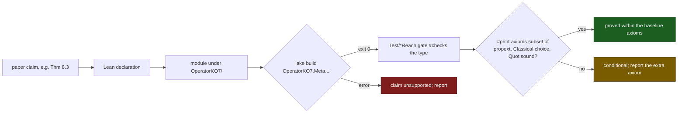

# Observer Determinacy of Termination Certificates: claim-to-code index

Generated from `Rahnama_Operational_Inexpressibility.tex` (SHA-256 `53F46ECF`), with numbers from its `.aux`. Every Lean name and module path in this file resolves in this repository under `OperatorKO7/`. This file holds 214 claim rows, 530 module rows and the 270 check files present in this repository. The manuscript names the seven-constructor calculus the Concrete Witness System (CWS); the Lean identifiers name it `KO7`.

## Claim to anchor

| Claim | Lean identifier(s) | Status | Module | Claim in one line | Established in Lean | Conditions |
|---|---|---|---|---|---|---|
| Prop. 2.1 [`prop:license-criterion`] | `OperatorKO7.Meta.OperationalInexpressibility.LicenseCriterion.licensed_iff_factorsThrough`, `OperatorKO7.Meta.OperationalInexpressibility.LicenseCriterion.observerRefines_iff_licenseTheory_inclusion`, `OperatorKO7.Meta.OperationalInexpressibility.LicenseCriterion.licensed_identity_iff_injective`, `OperatorKO7.Meta.OperationalInexpressibility.LicenseCriterion.mutual_refinement_iff_same_kernel`, `OperatorKO7.Meta.OperationalInexpressibility.LicenseCriterion.licensed_of_injective` | PROVEN | `Meta/OperationalInexpressibility/LicenseCore.lean` | License criterion and observer refinement. | Proves that licensing is fiber constancy and factorization through the attained image, that refinement is inclusion of licensed target families, that mutual refinement is equality of kernels, and that an injective observer licenses every target. | Arbitrary observer and target; reconstruction is equality on observer fibers. Module closure: generic. |
| Prop. 2.2 [`prop:executable-license`] | `OperatorKO7.Meta.OperationalInexpressibility.ExecutableLicense.licensedB_eq_true_iff`, `OperatorKO7.Meta.OperationalInexpressibility.ExecutableLicense.observerRefinesB_eq_true_iff`, `OperatorKO7.Meta.OperationalInexpressibility.ExecutableLicense.unlicensedWitness?_sound`, `OperatorKO7.Meta.OperationalInexpressibility.ExecutableLicense.unlicensedWitness?_eq_none_iff`, `OperatorKO7.Meta.OperationalInexpressibility.ExecutableLicense.targetKernelClasses_spec`, `OperatorKO7.Meta.OperationalInexpressibility.ExecutableLicense.licensedB_emptyEnumeration`, `OperatorKO7.Meta.OperationalInexpressibility.ExecutableLicense.licensedB_unitEnumeration`, `OperatorKO7.Meta.OperationalInexpressibility.ExecutableLicense.parity_fixture` | PROVEN | `Meta/OperationalInexpressibility/ExecutableLicense.lean` | The Boolean license and refinement checks, the collision search, and the target classes decide their specifications on explicit enumerations. | Proves that the license check returns true if and only if the observer licenses the target, the same for the refinement check, soundness and the none characterization of the collision search, the class specification, and the empty, one-point, and parity fixtures. | Explicit duplicate-free complete enumeration; decidable equality on observations and values. Module closure: generic. |
| Def. 2.3 [`def:op-incomplete`] | `OperatorKO7.StepDuplicating.StepDuplicatingSchema.OperationallyIncomplete`, `OperatorKO7.StepDuplicating.StepDuplicatingSchema.OperationalQuestion`, `OperatorKO7.Meta.OperationalInexpressibility.DefinitionUnification.ObservedLanguage.operationalInexpressibility_language_iff_observer` | DEFINITION | `Meta/SchemaOperationalIncompleteness.lean`, `Meta/OperationalInexpressibility/DefinitionUnification.lean` | Operational inexpressibility. | Defines operational incompleteness relative to a question, dependence, and target constraint; the observed-language form is related to observer collisions by the definition-unification theorem. | Carrier as declared in `Meta/SchemaOperationalIncompleteness.lean`. Module closure: generic. |
| Thm. 2.4 [`thm:definition-unification`] | `OperatorKO7.Meta.OperationalInexpressibility.DefinitionUnification.ObservedLanguage.operationalInexpressibility_language_iff_observer`, `OperatorKO7.Meta.OperationalInexpressibility.DefinitionUnification.ObservedLanguage.languageInexpressible_iff_unlicensed_of_total`, `OperatorKO7.Meta.OperationalInexpressibility.DefinitionUnification.noIncorporation_iff_constraining_licensed_by_forgetful`, `OperatorKO7.Meta.OperationalInexpressibility.DefinitionUnification.observerSeesDimension_is_required`, `OperatorKO7.Meta.OperationalInexpressibility.DefinitionUnification.complete_is_required`, `OperatorKO7.Meta.OperationalInexpressibility.DefinitionUnification.sound_is_required` | PROVEN | `Meta/OperationalInexpressibility/DefinitionUnification.lean` | For a sound and complete language whose observer sees the dimension, language-level and observer-level operational inexpressibility coincide, and each hypothesis is necessary. | Proves the equivalence under soundness, completeness, and dimension visibility; with a total context relation, the equivalence with dimension presence plus failure of the license; the license form of clause (ii); and three fixtures in which one hypothesis fails and the equivalence fails. | Arbitrary universes for worlds, statements, observations, dimensions, and values. Module closure: generic. |
| Prop. 2.5 [`prop:fixed-input-boundary`] | `OperatorKO7.Meta.OperationalInexpressibility.FixedInputLanguage.FixedInputLanguageBoundary`, `OperatorKO7.Meta.OperationalInexpressibility.FixedInputLanguage.dimension_present`, `OperatorKO7.Meta.OperationalInexpressibility.FixedInputLanguage.derivable_denotation_factorsThrough`, `OperatorKO7.Meta.OperationalInexpressibility.FixedInputLanguage.no_derivable_constrainsTarget`, `OperatorKO7.Meta.OperationalInexpressibility.FixedInputLanguage.no_derivable_statement_decides_target`, `OperatorKO7.Meta.OperationalInexpressibility.FixedInputLanguage.target_not_factorsThrough`, `OperatorKO7.Meta.OperationalInexpressibility.FixedInputLanguage.target_has_no_quotientFactorization`, `OperatorKO7.Meta.OperationalInexpressibility.FixedInputLanguage.operationalQuestion_operationallyIncomplete` | PROVEN | `Meta/OperationalInexpressibility/FixedInputLanguage.lean` | A fixed-input language whose derivable statements factor through the observer, with a same-context collision that changes the dimension and the target, is operationally inexpressible at that input. | Proves presence of the dimension, factorization of every derivable denotation through the observer, failure of every derivable statement to constrain or decide the target, failure of the target to factor through the observer and through its kernel quotient, and the operational-incompleteness instance whose dependence and constraint predicates are the semantic ones. | The boundary structure supplies the factorization of derivable statements and the two worlds; arbitrary carriers. Module closure: generic. |
| Def. 2.6 [`def:beth-property`] | `OperatorKO7.Meta.OperationalInexpressibility.DefinitionUnification.ObservedLanguage.ExplicitlyDefines`, `OperatorKO7.Meta.OperationalInexpressibility.DefinitionUnification.ObservedLanguage.BethPropertyOn`, `OperatorKO7.Meta.OperationalInexpressibility.DefinitionUnification.ObservedLanguage.PostcompositionClosed` | DEFINITION | `Meta/OperationalInexpressibility/BethDefinability.lean` | Explicit definition of a target by a derivable statement, and the Beth property of a language on a class of targets. | (none) | Observed languages in independent universes. Module closure: generic. |
| Thm. 2.7 [`thm:beth-gap`] | `OperatorKO7.Meta.OperationalInexpressibility.DefinitionUnification.ObservedLanguage.licensed_of_explicitlyDefines`, `OperatorKO7.Meta.OperationalInexpressibility.DefinitionUnification.ObservedLanguage.not_explicitlyDefines_iff`, `OperatorKO7.Meta.OperationalInexpressibility.DefinitionUnification.ObservedLanguage.not_explicitlyDefines_iff_not_licensed`, `OperatorKO7.Meta.OperationalInexpressibility.DefinitionUnification.ObservedLanguage.bethPropertyOn_of_complete`, `OperatorKO7.Meta.OperationalInexpressibility.DefinitionUnification.ObservedLanguage.padoa_sound_is_required`, `OperatorKO7.Meta.OperationalInexpressibility.DefinitionUnification.ObservedLanguage.beth_complete_is_required`, `OperatorKO7.Meta.OperationalInexpressibility.DefinitionUnification.ObservedLanguage.beth_postcomposition_is_required` | PROVEN | `Meta/OperationalInexpressibility/BethDefinability.lean` | In a sound language an explicitly defined target is licensed; a target without explicit definition is unlicensed or a Beth failure; a complete language closed under post-composition has the Beth property, and each hypothesis is necessary. | Proves the Padoa direction, the gap decomposition, the Beth property from completeness and closure, and the three fixtures separating soundness, completeness, and closure. | Observed languages in independent universes; the post-composition construction is classical. Module closure: generic. |
| Prop. 2.8 [`prop:beth-grammar-projection`] | `OperatorKO7.Meta.OperationalInexpressibility.BethDefinabilityInstances.grammar_fullReading_not_bethProperty`, `OperatorKO7.Meta.OperationalInexpressibility.BethDefinabilityInstances.grammar_counter_sound_on_orienting`, `OperatorKO7.Meta.OperationalInexpressibility.BethDefinabilityInstances.measureExpr_double_step`, `OperatorKO7.Meta.OperationalInexpressibility.BethDefinabilityInstances.bethGap_not_grammar_denotable`, `OperatorKO7.Meta.OperationalInexpressibility.BethDefinabilityInstances.grammar_counter_not_bethProperty`, `OperatorKO7.Meta.OperationalInexpressibility.BethDefinabilityInstances.projection_sound`, `OperatorKO7.Meta.OperationalInexpressibility.BethDefinabilityInstances.projection_bethProperty_on_orienting`, `OperatorKO7.Meta.OperationalInexpressibility.BethDefinabilityInstances.projection_explicitlyDefines_iff_licensed` | PROVEN | `Meta/OperationalInexpressibility/BethDefinabilityInstances.lean` | On the counter-payload carrier with orienting targets: the grammar fails the Beth property under the full reading and under the counter, and the language of strictly increasing functions of the counter has the property. | Proves the failure at the universal orienter, the counter license of every orienting expression, the doubling obstruction $2e(1,0)\le e(2,0)$ that excludes the jumping rank, the counter failure, soundness of the projection language, and the projection equivalence. | The reflected direct grammar and the projection language on $\mathbb N\times\mathbb N$. Module closure: generic. |
| Prop. 2.9 [`prop:grammar-license`] | `OperatorKO7.Meta.OperationalInexpressibility.DirectGrammarBoundary.payloadBlind_iff_licensed_by_counter`, `OperatorKO7.Meta.OperationalInexpressibility.DirectGrammarBoundary.usesPayload_iff_unlicensed_by_counter`, `OperatorKO7.Meta.OperationalInexpressibility.DirectGrammarBoundary.directGrammar_orienting_denotations_licensed_by_counter`, `OperatorKO7.Meta.OperationalInexpressibility.DirectGrammarBoundary.orienting_denotations_licensed_by_counter_of_denotational_subgrammar`, `OperatorKO7.Meta.OperationalInexpressibility.DirectGrammarBoundary.payload_target_unlicensed_by_counter`, `OperatorKO7.Meta.OperationalInexpressibility.DirectGrammarBoundary.counter_projection_orients_and_licensed`, `OperatorKO7.Meta.OperationalInexpressibility.DirectGrammarBoundary.payloadSensitiveOrienter_orients_and_unlicensed_by_counter` | PROVEN | `Meta/OperationalInexpressibility/DirectGrammarLicense.lean` | Payload blindness is the counter observer's license, so every orienting grammar denotation is licensed by the counter observer, and the payload target is unlicensed. | Proves payload blindness if and only if the counter license, payload use if and only if failure of the counter license, the counter license of every orienting grammar expression and of every denotational subgrammar, the unlicensed payload target, the licensed counter projection, and the unlicensed orienter $\mu_*$. | Carrier $\mathbb N\times\mathbb N$ of counter and payload readings; the reflected grammar. Module closure: generic. |
| Prop. 3.1 [`prop:target-kernel-quotient`] | `OperatorKO7.Meta.OperationalInexpressibility.TargetKernel.targetKernelQuotient_coarsest_sufficient`, `OperatorKO7.Meta.OperationalInexpressibility.TargetKernel.targetKernelQuotient_unique_up_to_kernel`, `OperatorKO7.Meta.OperationalInexpressibility.TargetKernel.licensed_iff_refines_targetKernelQuotient`, `OperatorKO7.Meta.OperationalInexpressibility.LicenseLattice.observerKernelPartitionEquiv` | PROVEN | `Meta/OperationalInexpressibility/TargetKernelQuotient.lean`, `Meta/OperationalInexpressibility/LicenseLattice.lean` | Target-kernel quotient. | Proves that the target-kernel quotient licenses the target, that an observer licenses the target if and only if it refines the quotient, and uniqueness up to kernel; the lattice isomorphism places the quotient among all observers. | The target-kernel quotient; uniqueness concerns its kernel, not every observer presentation. Module closure: generic. |
| Rem. 3.2 [`rem:orientation-consumer`] | `OperatorKO7.Methods.OrientationClosure.ObserverSufficiency.counter_target_coarsest_sufficient`, `OperatorKO7.Methods.OrientationClosure.ObserverSufficiency.sufficient_iff_refines_counter_kernel`, `OperatorKO7.Methods.OrientationClosure.ObserverSufficiency.counterKernelQuotientEquivNat`, `OperatorKO7.Methods.OrientationClosure.ObserverSufficiency.raised_observers_incomparable`, `OperatorKO7.Methods.OrientationClosure.ObserverSufficiency.no_coarsest_licensing_observer` | PROVEN | `Meta/Methods/OrientationClosure/ObserverSufficiency.lean` | The orientation development applies the target-kernel quotient to the counter of a counter system. | Proves that the counter-kernel quotient is sufficient and refined by every sufficient observer, sufficiency if and only if refinement of the quotient, the equivalence of the quotient with $\mathbb N$, two incomparable rank-licensing observers, and that no licensing observer is coarser than every natural-valued licensing observer on the free call relation. | Counter systems of the orientation development, which uses this paper's quotient theorem. Module closure: generic. |
| Thm. 3.3 [`thm:license-lattice`] | `OperatorKO7.Meta.OperationalInexpressibility.LicenseLattice.observerKernelPartitionEquiv`, `OperatorKO7.Meta.OperationalInexpressibility.LicenseLattice.observerPartitionOrderIso`, `OperatorKO7.Meta.OperationalInexpressibility.LicenseLattice.observerKernel_jointPair`, `OperatorKO7.Meta.OperationalInexpressibility.LicenseLattice.observerKernel_jointObserver`, `OperatorKO7.Meta.OperationalInexpressibility.LicenseLattice.commonCoarsening_greatest_lower`, `OperatorKO7.Meta.OperationalInexpressibility.LicenseLattice.licensed_meet_iff`, `OperatorKO7.Meta.OperationalInexpressibility.LicenseLattice.licensed_meetFamily_iff`, `OperatorKO7.Meta.OperationalInexpressibility.LicenseLattice.commonCoarsening_eq_iff_eqvGen`, `OperatorKO7.Meta.OperationalInexpressibility.LicenseLattice.licensed_join_of_either`, `OperatorKO7.Meta.OperationalInexpressibility.LicenseLattice.parity_licensed_by_join_only` | PROVEN | `Meta/OperationalInexpressibility/LicenseLattice.lean` | Observers modulo kernel form the partition lattice; the common coarsening licenses a target if and only if both observers do, and the joint observer licenses the targets of either observer. | Constructs the order isomorphism from observers modulo mutual refinement onto equivalence relations and onto partitions, and proves the kernels of the joint observer and of the common coarsening, the lower-bound property of the common coarsening, the license theory of the meet for pairs and families, the chain characterization, the join inclusion, and the parity control. | Arbitrary source type; observations in the universe of the source for the isomorphism; license statements for arbitrary universes. Module closure: generic. |
| Thm. 3.4 [`thm:aumann-agreement`] | `OperatorKO7.Meta.OperationalInexpressibility.AumannAgreement.agreement_of_commonKnowledge_fiberRatio`, `OperatorKO7.Meta.OperationalInexpressibility.AumannAgreement.AssignsFiberRatio`, `OperatorKO7.Meta.OperationalInexpressibility.AumannAgreement.commonKnowledgeAt_iff_meetCell`, `OperatorKO7.Meta.OperationalInexpressibility.AumannAgreement.massOf_eq_mul_of_saturated`, `OperatorKO7.Meta.OperationalInexpressibility.AumannAgreement.agreement_positive_mass_is_required`, `OperatorKO7.Meta.OperationalInexpressibility.AumannAgreement.agreement_commonKnowledge_is_required`, `OperatorKO7.Meta.OperationalInexpressibility.LicenseLattice.commonCoarsening_eq_iff_eqvGen` | PROVEN | `Meta/OperationalInexpressibility/AumannAgreement.lean`, `Meta/OperationalInexpressibility/LicenseLattice.lean` | Common knowledge at a state is containment of its meet cell, and two observers with common knowledge of their assignments on a cell of nonzero weight assign the same signed fiber ratio. | Proves the meet-cell characterization through the generated equivalence relation, the agreement theorem for signed fiber ratios by summing the assignments over the fibers inside the meet cell, and the two fixtures in which a zero mass or absent common knowledge defeats the conclusion. | Finite states with real weights of any sign and a meet cell of nonzero weight; the conditional-probability reading needs a nonnegative weighting with total weight one. The compatibility theorem `agreement_of_commonKnowledge` states the same result under the historical predicate name. Module closure: generic. |
| Thm. 3.5 [`thm:license-galois`] | `OperatorKO7.Meta.OperationalInexpressibility.LicenseGalois.licenseFamily_galoisConnection`, `OperatorKO7.Meta.OperationalInexpressibility.LicenseGalois.kerFamily_licensedBy_eq`, `OperatorKO7.Meta.OperationalInexpressibility.LicenseGalois.licenseClosure_eq_self_iff`, `OperatorKO7.Meta.OperationalInexpressibility.LicenseGalois.licensedBy_strict_of_setoid_lt` | PROVEN | `Meta/OperationalInexpressibility/LicenseGalois.lean` | Boolean license reconstruction. | Proves the antitone Galois connection between equivalence relations and Boolean target families, $K(B(E))=E$, the closure laws, and the inclusion classification. | Arbitrary state set and all Boolean target predicates; Boolean separation uses classical choice. Module closure: generic. |
| Thm. 3.6 [`thm:rule-invariant-galois`] | `OperatorKO7.Meta.OperationalInexpressibility.DynamicLicenseGalois.rule_le_preservingRules_iff`, `OperatorKO7.Meta.OperationalInexpressibility.DynamicLicenseGalois.rulePredicate_galoisConnection`, `OperatorKO7.Meta.OperationalInexpressibility.DynamicLicenseGalois.ruleClosure_idempotent`, `OperatorKO7.Meta.OperationalInexpressibility.DynamicLicenseGalois.predicateClosure_idempotent`, `OperatorKO7.Meta.OperationalInexpressibility.DynamicLicenseGalois.invariantFamilyRepair_complete`, `OperatorKO7.Meta.OperationalInexpressibility.DynamicLicenseGalois.dynamic_license_galois_complete` | PROVEN | `Meta/OperationalInexpressibility/DynamicLicenseGalois.lean` | Rule families and preserved invariants form an antitone Galois connection with idempotent closures; the invariant repair is the greatest preserving subfamily and its exclusion is least. | Proves the Galois law, the Galois connection after order reversal, idempotence of both closures, and the six-part repair package: containment, preservation, maximality, least exclusion, partition, and disjointness. | Arbitrary rule-indexed relations on an arbitrary carrier. Module closure: instance. |
| Thm. 3.7 [`thm:license-stabilizer`] | `OperatorKO7.Meta.OperationalInexpressibility.LicenseStabilizer.license_stabilizer_complete`, `OperatorKO7.Meta.OperationalInexpressibility.LicenseStabilizer.observerRefines_strict_iff_licenseStabilizer_lt`, `OperatorKO7.Meta.OperationalInexpressibility.LicenseStabilizer.same_kernel_iff_licenseStabilizer_eq`, `OperatorKO7.Meta.OperationalInexpressibility.LicenseStabilizer.natCard_licenseStabilizer_eq_prod_factorial`, `OperatorKO7.Meta.OperationalInexpressibility.LicenseStabilizer.pointedAutomorphismGroup_lt_observerStabilizer`, `OperatorKO7.Meta.OperationalInexpressibility.LicenseStabilizer.observerRefines_iff_licenseStabilizer_le`, `OperatorKO7.Meta.OperationalInexpressibility.LicenseStabilizer.padoa_definable_iff_stabilizer_invariant` | PROVEN | `Meta/OperationalInexpressibility/LicenseStabilizer.lean`, `Meta/OperationalInexpressibility/SufficiencyInstance.lean` | Observer stabilizers. | Proves that licensing is invariance under the observer stabilizer, that fibers are stabilizer orbits, that refinement is stabilizer inclusion, the product decomposition over fibers, the finite factorial count, and the definability form. | Arbitrary observer; the factorial cardinal formula also requires finite source. Module closure: generic. |
| Prop. 4.1 [`prop:side-channel-minimum`] | `OperatorKO7.Meta.OperationalInexpressibility.Confusability.exists_resolving_channel_iff_fiber_embeddings`, `OperatorKO7.Meta.OperationalInexpressibility.Confusability.exists_fin_resolving_channel_iff_fiber_capacity`, `OperatorKO7.Meta.OperationalInexpressibility.Confusability.exists_binary_resolving_channel_iff_fiber_capacity`, `OperatorKO7.Meta.OperationalInexpressibility.Confusability.chromaticNumber_le_iff_exists_fin_resolving_channel`, `OperatorKO7.Meta.OperationalInexpressibility.FiberDeficit.fiberMultiplicity_is_minimum_side_channel_cardinality`, `OperatorKO7.Meta.OperationalInexpressibility.FiberDeficit.fiberCodeDeficit_is_minimum_fixedLength_bits`, `OperatorKO7.Meta.OperationalInexpressibility.ExecutableResolvingChannel.optimal_fixedLength_bits`, `OperatorKO7.Meta.OperationalInexpressibility.Confusability.zero_symbol_channel_iff_isEmpty`, `OperatorKO7.Meta.OperationalInexpressibility.Confusability.one_symbol_channel_iff_licensed`, `OperatorKO7.Meta.OperationalInexpressibility.Confusability.natParity_no_one_symbol` | PROVEN | `Meta/OperationalInexpressibility/ConfusabilityGraph.lean`, `Meta/OperationalInexpressibility/FiberDeficitCore.lean`, `Meta/OperationalInexpressibility/ExecutableResolvingChannel.lean` | Arbitrary-set channel capacity, chromatic number, and executable finite optimum. | Proves the embedding criterion for arbitrary sets, the finite alphabet and bit-width minima, the zero-symbol and one-symbol criteria, and a deterministic executable encoder and decoder at the optimum. | Arbitrary input set for embeddings; explicit finite enumeration for executable synthesis. Module closure: generic. |
| Thm. 4.2 [`thm:relational-recovery`] | `OperatorKO7.Meta.OperationalInexpressibility.RelationalRecovery.quotientRelationalRecovery_iff_fiberCommonWitness`, `OperatorKO7.Meta.OperationalInexpressibility.RelationalRecovery.pairwiseFiberCompatible_not_sufficient`, `OperatorKO7.Meta.OperationalInexpressibility.RelationalRecovery.boolIdentity_falseOnlyLanguage_fails`, `OperatorKO7.Meta.OperationalInexpressibility.RelationalRecovery.boolIdentity_directRelationalRecovery` | PROVEN | `Meta/OperationalInexpressibility/RelationalRecovery.lean` | Set-valued certificate recovery and language separation. | Fiber-common-certificate equivalence, pairwise/\allowbreak{}global counterexample, and full-information/\allowbreak{}restricted-language counterexample. | Arbitrary carrier, observer, and acceptance relation; finite controls instantiate the strict separations. Module closure: generic. |
| Thm. 4.3 [`thm:relational-side-channel`] | `OperatorKO7.Meta.OperationalInexpressibility.RelationalSideChannel.partialRelationalSideChannel_iff_hypergraphColoring`, `OperatorKO7.Meta.OperationalInexpressibility.RelationalSideChannel.threeWay_higherOrder_sideChannel_separation`, `OperatorKO7.Meta.OperationalInexpressibility.RelationalSideCapacity.exists_sideChannel_iff_capacity_le`, `OperatorKO7.Meta.OperationalInexpressibility.RelationalSideCapacity.relationalSideCapacity_exact` | PROVEN | `Meta/OperationalInexpressibility/RelationalSideChannel.lean`, `Meta/OperationalInexpressibility/RelationalSideCapacity.lean` | Hypergraph criterion for set-valued side channels. | Proves that cellwise common-certificate recovery holds if and only if every bad fiber subset is non-monochromatic, the two-color strict control, and the capacity form of the least alphabet. | Partial decoder required on realized observer/\allowbreak{}color cells only. Module closure: generic. |
| Thm. 4.4 [`thm:set-valued-capacity`] | `OperatorKO7.Meta.OperationalInexpressibility.RelationalSideCapacity.exists_sideChannel_iff_forall_fiberColorable`, `OperatorKO7.Meta.OperationalInexpressibility.RelationalSideCapacity.exists_sideChannel_iff_capacity_le`, `OperatorKO7.Meta.OperationalInexpressibility.RelationalSideCapacity.relationalSideCapacity_exact`, `OperatorKO7.Meta.OperationalInexpressibility.RelationalSideCapacity.relationalSideCapacity?_eq_some`, `OperatorKO7.Meta.OperationalInexpressibility.RelationalSideCapacity.relationalSideCapacity?_eq_none_iff`, `OperatorKO7.Meta.OperationalInexpressibility.RelationalSideCapacity.relationalSideCapacity_singleton`, `OperatorKO7.Meta.OperationalInexpressibility.RelationalSideCapacity.no_sideChannel_of_no_certificate`, `OperatorKO7.Meta.OperationalInexpressibility.RelationalSideCapacity.threeWay_pairwise_compatible_capacity_two` | PROVEN | `Meta/OperationalInexpressibility/RelationalSideCapacity.lean` | The least side alphabet for set-valued recovery is the maximum fiber chromatic number of the bad-subset hypergraph, attained and computed by exhaustive search. | Proves gluing of fiber colorings, that a $k$-symbol channel exists if and only if the capacity is at most $k$, attainment and optimality, that the search returns the capacity when every state has a certificate and none if and only if some state has none, the singleton specialization to the fiber multiplicity, and the three-way control with capacity two. | Finite source and decidable observation equality; explicit enumerations and decidable acceptance for the search; fiber chromatic numbers use classical choice. Module closure: generic. |
| Prop. 4.5 [`prop:joint-target-capacity`] | `OperatorKO7.Meta.OperationalInexpressibility.JointTargetCapacity.licensed_pairedTarget_iff`, `OperatorKO7.Meta.OperationalInexpressibility.JointTargetCapacity.product_side_channels_license_pairedTarget`, `OperatorKO7.Meta.OperationalInexpressibility.JointTargetCapacity.pairedTarget_exact_side_capacity`, `OperatorKO7.Meta.OperationalInexpressibility.JointTargetCapacity.duplicated_target_product_bound_not_tight` | PROVEN | `Meta/OperationalInexpressibility/JointTargetCapacity.lean` | Joint target licensing and capacity. | Componentwise licensing, product upper construction, joint multiplicity, and strict overcount control. | minimum assumes finite nonempty source; licensing equivalence is arbitrary. Module closure: generic. |
| Prop. 5.1 [`prop:noisy-budgeted-recovery`] | `OperatorKO7.Meta.OperationalInexpressibility.NoisyRecovery.posterior?_sum_one`, `OperatorKO7.Meta.OperationalInexpressibility.NoisyRecovery.bayesRisk_mem_unitInterval`, `OperatorKO7.Meta.OperationalInexpressibility.NoisyRecovery.bayesRisk_le_randomizedRisk`, `OperatorKO7.Meta.OperationalInexpressibility.NoisyRecovery.bayesRisk_eq_zero_iff_licensedOnJointSupport`, `OperatorKO7.Meta.OperationalInexpressibility.BudgetedNoisyRecovery.bestBudgetedSideEncoder?_minimal`, `OperatorKO7.Meta.OperationalInexpressibility.BudgetedNoisyRecovery.bestBudgetedSideEncoder?_eq_none_iff`, `OperatorKO7.Meta.OperationalInexpressibility.BudgetedNoisyRecovery.bestBudgetedSideEncoder?_risk_antitone`, `OperatorKO7.Meta.OperationalInexpressibility.NoisyRecovery.bayesRisk_le_postProcessedRisk`, `OperatorKO7.Meta.OperationalInexpressibility.NoisyRecovery.bayesRisk_le_randomizedPostProcessedRisk`, `OperatorKO7.Meta.OperationalInexpressibility.NoisyRecovery.bayesRisk_le_risk`, `OperatorKO7.Meta.OperationalInexpressibility.BlackwellOrder.refines_iff_bayesRisk_le` | PROVEN | `Meta/OperationalInexpressibility/NoisyRecovery.lean`, `Meta/OperationalInexpressibility/BudgetedNoisyRecovery.lean`, `Meta/OperationalInexpressibility/BlackwellOrder.lean` | Bayes-optimal noisy recovery under a finite encoder budget. | Proves the derived posterior, the risk interval, optimality against deterministic and randomized decoders and post-processing, the support-relative zero-risk criterion, the feasible exhaustive argmin with none if and only if infeasible, and budget monotonicity. | Explicit finite enumerations and normalized rational model; exhaustive algorithm has no efficiency claim. Module closure: generic. |
| Thm. 5.2 [`thm:blackwell-deterministic`] | `OperatorKO7.Meta.OperationalInexpressibility.BlackwellOrder.bayesRisk_le_of_refines`, `OperatorKO7.Meta.OperationalInexpressibility.BlackwellOrder.refines_of_bayesRisk_le_twoPoint`, `OperatorKO7.Meta.OperationalInexpressibility.BlackwellOrder.refines_of_bayesRisk_le_self`, `OperatorKO7.Meta.OperationalInexpressibility.BlackwellOrder.refines_iff_bayesRisk_le`, `OperatorKO7.Meta.OperationalInexpressibility.BlackwellOrder.bayesRisk_le_of_garbling`, `OperatorKO7.Meta.OperationalInexpressibility.BlackwellOrder.single_target_does_not_determine_refinement` | PROVEN | `Meta/OperationalInexpressibility/BlackwellOrder.lean` | On deterministic observers, refinement is domination of Bayes risk over all targets and rational priors, and post-processing cannot lower Bayes risk. | Proves that refinement implies risk domination, that domination for the target $q_2$ under two-point priors implies refinement, the equivalence, the garbling inequality for every finite rational model and kernel, and the constant-target control. | Finite types with decidable equality and explicit enumerations; rational priors and kernels; the stochastic converse is Theorem 5.3. Module closure: generic. |
| Thm. 5.3 [`thm:blackwell-finite`] | `OperatorKO7.Meta.OperationalInexpressibility.BlackwellStochastic.isGarbling_iff_dominates`, `OperatorKO7.Meta.OperationalInexpressibility.BlackwellStochastic.dominates_of_isGarbling`, `OperatorKO7.Meta.OperationalInexpressibility.BlackwellStochastic.isGarbling_of_dominates`, `OperatorKO7.Meta.OperationalInexpressibility.BlackwellStochastic.isGarbling_ofObserver_iff_refines`, `OperatorKO7.Meta.OperationalInexpressibility.BlackwellStochastic.dominates_iff_gainVulnerability_le`, `OperatorKO7.Meta.OperationalInexpressibility.BlackwellStochastic.dominatesZeroOne_of_dominates`, `OperatorKO7.Meta.OperationalInexpressibility.BlackwellStochastic.dominatesZeroOne_ofObserver_iff_refines`, `OperatorKO7.Meta.OperationalInexpressibility.BlackwellStochastic.dominatesZeroOne_ofObserver_iff_bayesRisk_le`, `OperatorKO7.Meta.OperationalInexpressibility.BlackwellStochastic.nonempty_output_is_required`, `OperatorKO7.Meta.OperationalInexpressibility.BlackwellStochastic.noisy_isGarbling_perfect_not_conversely` | PROVEN | `Meta/OperationalInexpressibility/BlackwellStochastic.lean` | Two finite real experiments: every decision value of the second is at most the first if and only if the second is the first followed by a stochastic matrix; for observers this is refinement, and the gain-function form is the posterior vulnerability. | Proves the garbling inequality, the converse by separating the target from the convex hull of the deterministic post-processings with a hyperplane and reading the separating functional as a utility, the observer equivalence, the gain form, the restriction to zero-one utilities, which on observers is refinement and is the Bayes-risk order of Theorem 5.2, and the two controls. | Finite types with decidable equality, real matrices and utilities, action types in the universe of the second observation type, nonempty second observation type for the converse, and an enumeration of it for the zero-one identification. Module closure: generic. |
| Thm. 5.4 [`thm:entropy-fiber-bound`] | `OperatorKO7.Meta.OperationalInexpressibility.FiberEntropy.conditionalEntropy_le_log_fiberMultiplicity`, `OperatorKO7.Meta.OperationalInexpressibility.FiberEntropy.conditionalEntropyBits_le_logb_fiberMultiplicity`, `OperatorKO7.Meta.OperationalInexpressibility.FiberEntropy.conditionalEntropy_eq_log_fiberMultiplicity_iff`, `OperatorKO7.Meta.OperationalInexpressibility.FiberEntropy.conditionalEntropy_eq_zero_iff_licensedOnSupport`, `OperatorKO7.Meta.OperationalInexpressibility.FiberEntropy.nonuniform_fiber_law_lt_log_fiberMultiplicity`, `OperatorKO7.Meta.OperationalInexpressibility.FiberEntropy.zeroMass_collision_conditionalEntropy_eq_zero` | PROVEN | `Meta/OperationalInexpressibility/FiberEntropyBound.lean` | The conditional entropy of a target given an observer is at most the logarithm of the fiber multiplicity, with the stated equality and zero cases. | Proves the bound in nats and in bits, equality if and only if every positive-mass fiber realizes $m$ values uniformly, zero entropy if and only if the license on the support, and the nonuniform and zero-mass controls. | Finite carriers in the lowest universe with decidable equality; real probability law; the zero case needs only nonnegative weights. Module closure: generic. |
| Thm. 5.5 [`thm:sufficiency-definability`] | `OperatorKO7.Meta.OperationalInexpressibility.SufficiencyInstance.sufficient_identityModel_iff`, `OperatorKO7.Meta.OperationalInexpressibility.SufficiencyInstance.sufficient_identityModel_iff_licensed`, `OperatorKO7.Meta.OperationalInexpressibility.SufficiencyInstance.bayesRisk_eq_fullObservation_iff_sufficient`, `OperatorKO7.Meta.OperationalInexpressibility.SufficiencyInstance.targetKernelQuotient_coarsest_sufficientStatistic`, `OperatorKO7.Meta.OperationalInexpressibility.SufficiencyInstance.fullyNoisyBinary_sufficient_not_licensedOnJointSupport`, `OperatorKO7.Meta.OperationalInexpressibility.LicenseStabilizer.padoa_definable_iff_stabilizer_invariant`, `OperatorKO7.Meta.OperationalInexpressibility.LicenseStabilizer.padoa_nonempty_verdict_is_required` | PROVEN | `Meta/OperationalInexpressibility/SufficiencyInstance.lean` | In the deterministic model, sufficiency is the license on positive-prior states, attainment of the full-observation risk characterizes sufficiency, the target-kernel quotient is the coarsest sufficient statistic, and definability is stabilizer invariance. | Proves the sufficiency criterion and its full-support license form, the risk-attainment equivalence, the coarsest sufficient statistic, the fully noisy separation, the set-level definability criterion, and the empty-world control. | (a) finite source with a rational prior and the full observation, full support for the license form and the coarsest statistic; (b) arbitrary types with a nonempty target type. Module closure: generic. |
| Thm. 5.6 [`thm:finite-family-sufficiency`] | `OperatorKO7.Meta.OperationalInexpressibility.FiniteFamilySufficiency.sufficient_familyModel_iff_factorization`, `OperatorKO7.Meta.OperationalInexpressibility.FiniteFamilySufficiency.posterior?_familyModel_eq_iff`, `OperatorKO7.Meta.OperationalInexpressibility.FiniteFamilySufficiency.posterior_minimalSufficient`, `OperatorKO7.Meta.OperationalInexpressibility.FiniteFamilySufficiency.fullSupport_is_required` | PROVEN | `Meta/OperationalInexpressibility/FiniteFamilySufficiency.lean` | For a finite family of rational likelihoods and a full-support prior, sufficiency is the factorization of the likelihood, equal posteriors are proportional likelihood vectors, and the posterior map is minimal sufficient; a zero in the prior breaks the factorization. | Proves the factorization criterion, the proportional-posterior characterization, minimal sufficiency of the posterior map, and the zero-prior control on a two-by-two family. | Finite parameter and sample types; rational likelihoods; full-support prior where stated. Module closure: generic. |
| Thm. 5.7 [`thm:lift-or-refuse`] | `OperatorKO7.Meta.OperationalInexpressibility.LiftOrRefuse.collision_lifted_or_refused`, `OperatorKO7.Meta.OperationalInexpressibility.LiftOrRefuse.licensedOn_iff_subset_correctSet`, `OperatorKO7.Meta.OperationalInexpressibility.LiftOrRefuse.maximalLicensedOn_iff`, `OperatorKO7.Meta.OperationalInexpressibility.LiftOrRefuse.maximal_refusals_of_collision`, `OperatorKO7.Meta.OperationalInexpressibility.LiftOrRefuse.lift_relabel_of_collision`, `OperatorKO7.Meta.OperationalInexpressibility.LiftOrRefuse.least_lift_eq_fiberMultiplicity`, `OperatorKO7.Meta.OperationalInexpressibility.LiftOrRefuse.mixed_repair_iff`, `OperatorKO7.Meta.OperationalInexpressibility.LiftOrRefuse.least_refusal_eq_bayesRisk`, `OperatorKO7.Meta.OperationalInexpressibility.LiftOrRefuse.repairFrontier_attained`, `OperatorKO7.Meta.OperationalInexpressibility.LiftOrRefuse.repairFrontier_le_refusedMass`, `OperatorKO7.Meta.OperationalInexpressibility.LiftOrRefuse.repairFrontier_zero`, `OperatorKO7.Meta.OperationalInexpressibility.LiftOrRefuse.repairFrontier_one_eq_bayesRisk`, `OperatorKO7.Meta.OperationalInexpressibility.LiftOrRefuse.repairFrontier_antitone`, `OperatorKO7.Meta.OperationalInexpressibility.LiftOrRefuse.repairFrontier_convex`, `OperatorKO7.Meta.OperationalInexpressibility.LiftOrRefuse.repairFrontier_eq_zero_of_fiberMultiplicity_le`, `OperatorKO7.Meta.OperationalInexpressibility.LiftOrRefuse.fiberMultiplicity_le_of_repairFrontier_eq_zero`, `OperatorKO7.Meta.OperationalInexpressibility.LiftOrRefuse.lift_or_refuse`, `OperatorKO7.Meta.OperationalInexpressibility.LiftOrRefuse.twoVoids_lift_or_refuse` | PROVEN | `Meta/OperationalInexpressibility/LiftOrRefuse.lean` | A collision is repaired by a separating side symbol or by refusing one of its states; refusals are decoder correctness sets; the least refused weight is the Bayes risk, the least alphabet is the fiber multiplicity, and the least refused weight of $k$-symbol repairs is nonincreasing and convex in $k$. | Proves the collision law, refusal as decoding, the maximal refusals, the two maximal refusals and the relabeled lift at a collision, the least lift, the mixed-repair criterion, least refusal as Bayes risk, attainment and minimality of the least refused weight for $k$ symbols, its values at zero and one, antitonicity, convexity, the vanishing criterion, and the two-state fixture. | (a) to (d) arbitrary types, a nonempty target type for refusal as decoding, decidable equality on the alphabet for the relabeled lift, and a finite retained set for (d); (e) finite types with decidable equality, an explicit target enumeration, nonnegative rational weights, a prior for the Bayes-risk statements, and positive weights for the vanishing criterion. Module closure: generic. |
| Thm. 5.8 [`thm:fd-license`] | `OperatorKO7.Meta.OperationalInexpressibility.DependencyLicense.fdHoldsOn_iff_licensedOn`, `OperatorKO7.Meta.OperationalInexpressibility.DependencyLicense.armstrongDerivable_iff_semanticallyImplies_universal`, `OperatorKO7.Meta.OperationalInexpressibility.DependencyLicense.armstrongDerivable_iff_semanticallyImplies`, `OperatorKO7.Meta.OperationalInexpressibility.DependencyLicense.twoTuple_family_is_required`, `OperatorKO7.Meta.OperationalInexpressibility.DependencyLicense.fdListHoldsOn_iff_licensedOn_each`, `OperatorKO7.Meta.OperationalInexpressibility.DependencyLicense.fdListHoldsOn_familyDependencies_iff`, `OperatorKO7.Meta.OperationalInexpressibility.DependencyRepair.mem_every_repair_iff_fiber_constant`, `OperatorKO7.Meta.OperationalInexpressibility.DependencyRepair.exists_repair_mem`, `OperatorKO7.Meta.OperationalInexpressibility.DependencyRepair.card_subsetRepairs`, `OperatorKO7.Meta.OperationalInexpressibility.DependencyRepair.maxLicensedCard_eq_sum`, `OperatorKO7.Meta.OperationalInexpressibility.DependencyRepair.g3_eq_bayesRisk_uniform`, `OperatorKO7.Meta.OperationalInexpressibility.DependencyRepair.g2Count_eq_card_sub_certain`, `OperatorKO7.Meta.OperationalInexpressibility.DependencyRepair.g1Count_eq_sum_fiber`, `OperatorKO7.Meta.OperationalInexpressibility.DependencyRepair.g3_le_g2`, `OperatorKO7.Meta.OperationalInexpressibility.DependencyRepair.g1_le_g2`, `OperatorKO7.Meta.OperationalInexpressibility.DependencyRepair.licensed_iff_g1Count_eq_zero`, `OperatorKO7.Meta.OperationalInexpressibility.DependencyRepair.licensed_iff_g2Count_eq_zero`, `OperatorKO7.Meta.OperationalInexpressibility.DependencyRepair.licensed_iff_g3Count_eq_zero` | PROVEN | `Meta/OperationalInexpressibility/DependencyLicense.lean`, `Meta/OperationalInexpressibility/DependencyRepair.lean` | A functional dependency is the license of its right restriction by its left restriction; Armstrong's rules derive the dependencies true in every instance; the subset repairs, their count as a product over fibers, and the measures $g_1$, $g_2$, $g_3$ are the license-side quantities, with $g_3$ the uniform-law Bayes risk. | Proves the license identification, soundness and completeness of Armstrong's rules with the two-tuple Boolean instance refuting every non-derivable dependency, the list form and the family form over attributes, the two consistent-answer statements, the repair count, the fiber formula for $g_3$ and its identity with the uniform Bayes risk, the certain-answer form of $g_2$, the pair count for $g_1$, the two inequalities, and the three zero criteria. | Finite attribute sets and tuples in the license form; finite decidable state, observation, and value types for the counts. Module closure: generic. |
| Prop. 5.9 [`prop:frontier-ktry`] | `OperatorKO7.Meta.OperationalInexpressibility.KTryVulnerability.repairFrontier_eq_sub_kTryVulnerability`, `OperatorKO7.Meta.OperationalInexpressibility.KTryVulnerability.kTryVulnerability_eq_exact`, `OperatorKO7.Meta.OperationalInexpressibility.KTryVulnerability.kTryVulnerability_one`, `OperatorKO7.Meta.OperationalInexpressibility.KTryVulnerability.kTryVulnerability_concave`, `OperatorKO7.Meta.OperationalInexpressibility.KTryVulnerability.twoVoids_kTryVulnerability` | PROVEN | `Meta/OperationalInexpressibility/KTryVulnerability.lean` | The least weight refused by a repair with $k$ side symbols is the total weight minus the weight kept by guessing the target within $k$ tries per observation; for a prior this is one minus the posterior vulnerability, the size-$k$ form holds, $V_1$ is one minus the Bayes risk, and $k\mapsto V_k$ is concave. | Proves the repair-curve identity, the size-$k$ replacement, the value at one try as the Bayes risk, concavity, and the two-state fixture. | Finite types with decidable equality; nonnegative rational weights. Module closure: generic. |
| Prop. 5.10 [`prop:lift-universal`] | `OperatorKO7.Meta.OperationalInexpressibility.LiftUniversalProperty.jointPair_greatest_licensingRefinement`, `OperatorKO7.Meta.OperationalInexpressibility.LiftUniversalProperty.licensingRefinement_iff_kernel_le`, `OperatorKO7.Meta.OperationalInexpressibility.LiftUniversalProperty.observerKernel_eq_of_universal`, `OperatorKO7.Meta.OperationalInexpressibility.LiftUniversalProperty.exists_greatest_licensedOn_iff`, `OperatorKO7.Meta.OperationalInexpressibility.LiftUniversalProperty.no_greatest_licensedOn_of_collision`, `OperatorKO7.Meta.OperationalInexpressibility.LiftOrRefuse.maximal_refusals_of_collision` | PROVEN | `Meta/OperationalInexpressibility/LiftUniversalProperty.lean`, `Meta/OperationalInexpressibility/LicenseLattice.lean`, `Meta/OperationalInexpressibility/LiftOrRefuse.lean` | The joint observer is the universal observer that refines $q$ and licenses $P$, with kernel the meet; a greatest set on which $q$ licenses $P$ exists if and only if $q$ licenses $P$, and at a collision there is none. | Proves the universal property, the kernel characterization of any observer with it, the existence criterion for a greatest licensed set, the two maximal licensed sets at a collision, and the collision control. | Arbitrary types. Module closure: generic. |
| Thm. 6.1 [`thm:license-cutoff`] | `OperatorKO7.Meta.OperationalInexpressibility.LicenseCriterion.license_coarsening_dichotomy`, `OperatorKO7.Meta.OperationalInexpressibility.LicenseCriterion.first_license_loss_unique` | PROVEN | `Meta/OperationalInexpressibility/LicenseCore.lean` | License cutoff. | Proves that along a coarsening sequence either every stage licenses the target or a unique first loss index exists, with a pair separated before it and identified from it on. | Arbitrary coarsening sequence and target; observation types may depend on the index. Module closure: generic. |
| Thm. 6.2 [`thm:finite-license-bound`] | `OperatorKO7.Meta.OperationalInexpressibility.FiniteObserverRecurrence.compatible_image_kernel_eq_at_card_pred`, `OperatorKO7.Meta.OperationalInexpressibility.FiniteObserverRecurrence.compatible_license_loss_cutoff_le_image_card_pred`, `OperatorKO7.Meta.OperationalInexpressibility.FiniteObserverRecurrence.compatible_license_at_image_card_pred_iff_persistent`, `OperatorKO7.Meta.OperationalInexpressibility.FiniteObserverRecurrence.finite_license_bound_sharp` | PROVEN | `Meta/OperationalInexpressibility/FiniteObserverRecurrence.lean` | Finite persistence bound. | Proves kernel stability from stage $B=\max\{\|q(X)\|-1,0\}$ under observation compatibility, persistence of licensing if and only if licensing at $B$, a first loss by $B$, and attainment of the bound. | Deterministic dynamics compatible with the observation; finite attained observation image. Module closure: generic. |
| Thm. 6.3 [`thm:channel-compactness`] | `OperatorKO7.Meta.OperationalInexpressibility.Confusability.finite_channel_set_isClosed`, `OperatorKO7.Meta.OperationalInexpressibility.Confusability.finite_alphabet_compactness`, `OperatorKO7.Meta.OperationalInexpressibility.Confusability.coarsening_fixed_finite_alphabet_iff_stagewise`, `OperatorKO7.Meta.OperationalInexpressibility.Confusability.threePair_stagewise_two_symbols`, `OperatorKO7.Meta.OperationalInexpressibility.Confusability.threePair_no_common_two_symbols` | PROVEN | `Meta/OperationalInexpressibility/ConfusabilityGraph.lean` | Common finite channels. | Proves that a common finite channel exists if and only if every finite set of requirements has one, and the stagewise form for coarsening sequences. | Coarsening observations, arbitrary input set and a fixed finite alphabet with a channel at every stage. Module closure: generic. |
| Cor. 6.4 [`cor:permanent-channel-capacity`] | `OperatorKO7.Meta.OperationalInexpressibility.Confusability.fixed_channel_licenses_all_iff_at_image_bound`, `OperatorKO7.Meta.OperationalInexpressibility.Confusability.exists_fixed_channel_iff_stagewise_channels`, `OperatorKO7.Meta.OperationalInexpressibility.Confusability.permanent_finite_alphabet_channel_iff_fiber_capacity` | PROVEN | `Meta/OperationalInexpressibility/ConfusabilityGraph.lean` | Permanent capacity. | Proves that a channel licenses the target at every stage if and only if it does at stage $B$, the permanent $m$-symbol criterion, and equivalence of stagewise and uniform channels. | The same finite-alphabet and coarsening hypotheses as the compactness theorem. Module closure: generic. |
| Thm. 6.5 [`thm:sequential-memory`] | `OperatorKO7.Meta.OperationalInexpressibility.SequentialMemoryRecovery.historyObserver_refines_stage`, `OperatorKO7.Meta.OperationalInexpressibility.SequentialMemoryRecovery.licensed_history_monotone`, `OperatorKO7.Meta.OperationalInexpressibility.SequentialMemoryRecovery.current_observation_can_forget_while_history_retains`, `OperatorKO7.Meta.OperationalInexpressibility.SequentialMemoryRecovery.first_sufficient_horizon_dichotomy` | PROVEN | `Meta/OperationalInexpressibility/SequentialMemoryRecovery.lean`, `Meta/OperationalInexpressibility/SequentialMemoryHorizon.lean` | Retained history as observer refinement. | Proves that the history refines every retained stage and grows monotonically, the current-forgets and history-retains control, and the first-sufficient-horizon dichotomy. | Arbitrary state/\allowbreak{}observation carrier for the generic theorem; Boolean control for strictness. Module closure: generic. |
| Thm. 6.6 [`thm:first-sufficient-horizon`] | `OperatorKO7.Meta.OperationalInexpressibility.SequentialMemoryRecovery.licensed_history_of_le`, `OperatorKO7.Meta.OperationalInexpressibility.SequentialMemoryRecovery.first_sufficient_horizon_dichotomy`, `OperatorKO7.Meta.OperationalInexpressibility.SequentialMemoryRecovery.first_sufficient_horizon_unique`, `OperatorKO7.Meta.OperationalInexpressibility.SequentialMemoryRecovery.historyTargetKernel_coarsest_memory`, `OperatorKO7.Meta.OperationalInexpressibility.SequentialMemoryRecovery.revealingObserver_first_sufficient_horizon`, `OperatorKO7.Meta.OperationalInexpressibility.SequentialMemoryRecovery.forgettingObserver_first_sufficient_horizon` | PROVEN | `Meta/OperationalInexpressibility/SequentialMemoryHorizon.lean` | Retained histories have a unique first sufficient horizon when some horizon suffices, and the target-kernel quotient is the coarsest licensing memory. | Proves persistence of history licenses, the first-sufficient-horizon dichotomy and its uniqueness, the coarsest licensing memory, and the revealing and forgetting controls. | Arbitrary state, observation, and target types; Boolean controls. Module closure: generic. |
| Def. 6.7 [`def:access-model`] | `OperatorKO7.InformationAccess.AccessibleFrom`, `OperatorKO7.InformationAccess.MetaAccessModel` | DEFINITION | `Meta/InformationAccess.lean` | Observation and target access. | Defines access by function factorization and supplies the observer view, target, and stage observations. | Arbitrary state, view, target, and observation types. Module closure: generic. |
| Def. 6.8 [`def:direct-vs-sequential`] | `OperatorKO7.InformationAccess.MetaAccessModel.DirectRetrieval`, `OperatorKO7.InformationAccess.MetaAccessModel.SequentialUncertaintyReduction` | DEFINITION | `Meta/InformationAccess.lean` | Direct retrieval and sequential uncertainty reduction. | Defines direct retrieval and sequential uncertainty reduction as accessibility at the initial versus a later stage. | Carrier as declared in `Meta/InformationAccess.lean`. Module closure: generic. |
| Prop. 6.9 [`prop:retrieval-vs-resolution`] | `OperatorKO7.InformationAccess.MetaAccessModel.meta_accessible_implies_directRetrieval`, `OperatorKO7.InformationAccess.MetaAccessModel.directRetrieval_not_sequential_resolution`, `OperatorKO7.InformationAccess.MetaAccessModel.sequential_resolution_implies_nonvacuous` | PROVEN | `Meta/InformationAccess.lean` | Retrieval and sequential resolution. | View accessibility implies initial recovery; initial recovery excludes sequential resolution; sequential resolution implies view inaccessibility. | Arbitrary access model and stage. Module closure: generic. |
| Prop. 6.10 [`prop:hidden-state`] | `OperatorKO7.InformationAccess.MetaAccessModel.sequential_resolution_requires_hidden_terminal_state`, `OperatorKO7.InformationAccess.MetaAccessModel.sequential_resolution_requires_hidden_state` | PROVEN | `Meta/InformationAccess.lean` | Inaccessible statistic required by resolution. | The resolving trace observation is inaccessible from the view and supplies a statistic from which the view and target decoder recover the target. | Sequential resolution at the stated stage; the statistic is constructed as that stage's observation. Module closure: generic. |
| Prop. 6.11 [`prop:finite-observer-recurrence`] | `OperatorKO7.Meta.OperationalInexpressibility.FiniteObserverRecurrence.finite_observer_has_first_repeat`, `OperatorKO7.Meta.OperationalInexpressibility.FiniteObserverRecurrence.finite_observer_repeat_status_inexpressible` | PROVEN | `Meta/OperationalInexpressibility/FiniteObserverRecurrence.lean` | Finite observer recurrence. | Proves that an orbit read by a finite observer has a first repeated observation at which the repeat status is no function of the observation. | Finite attained observation range; chronological recurrence target on an actual sequence. Module closure: generic. |
| Thm. 6.12 [`thm:repeat-depth-license`] | `OperatorKO7.Meta.OperationalInexpressibility.RepeatDepthLicense.repeatDepth_values_on_fiber`, `OperatorKO7.Meta.OperationalInexpressibility.RepeatDepthLicense.repeatDepth_minimal_record_cost`, `OperatorKO7.Meta.OperationalInexpressibility.RepeatDepthLicense.repeat_depth_license_complete`, `OperatorKO7.Meta.OperationalInexpressibility.RepeatDepthLicense.repeatStatus_fiberMultiplicity_eq_zero_iff`, `OperatorKO7.Meta.OperationalInexpressibility.RepeatDepthLicense.repeatStatus_fiberMultiplicity_eq_one_iff`, `OperatorKO7.Meta.OperationalInexpressibility.RepeatDepthLicense.repeatStatus_fiberMultiplicity_eq_two_iff` | PROVEN | `Meta/OperationalInexpressibility/RepeatDepthLicense.lean` | Minimum recurrence record cost. | Proves that the depth values on a fiber of size $k$ are $0,\dots,k-1$, that the least side alphabet for depth is the largest fiber size with the matching binary cost, the zero-or-one-bit cost of the repeat status, its fiber multiplicity of zero, one, or two, and that no fixed finite alphabet serves every horizon. | Finite sequence and decidable observation equality; arbitrary fixed record alphabet in the unbounded-horizon obstruction. Module closure: generic. |
| Thm. 7.1 [`thm:free-context-normalization`] | `OperatorKO7.Meta.OperationalInexpressibility.FreeRecursorContext.freeRecursor_ctx_rev_wellFounded`, `OperatorKO7.Meta.OperationalInexpressibility.FreeRecursorContext.freeRecursor_ctx_confluent`, `OperatorKO7.Meta.OperationalInexpressibility.FreeRecursorContext.freeRecursor_ctx_joinable_iff`, `OperatorKO7.Meta.OperationalInexpressibility.FreeRecursorKernel.freeRecursor_step_rev_wellFounded`, `OperatorKO7.Meta.OperationalInexpressibility.FreeRecursorKernel.freeRecursor_root_deterministic`, `OperatorKO7.Meta.OperationalInexpressibility.FreeRecursorKernel.freeRecursor_root_confluent`, `OperatorKO7.Meta.OperationalInexpressibility.FreeRecursorContext.normalize_reachable`, `OperatorKO7.Meta.OperationalInexpressibility.FreeRecursorContext.normalize_normal`, `OperatorKO7.Meta.OperationalInexpressibility.FreeRecursorContext.normalize_star` | PROVEN | `Meta/OperationalInexpressibility/FreeRecursorContext.lean`, `Meta/OperationalInexpressibility/FreeRecursorKernel.lean` | The root and contextual free-recursor relations terminate and are confluent, and an executable normalizer decides contextual joinability. | Proves well-foundedness of the reversed root and contextual step relations, determinism and confluence of the root relation, confluence of the contextual relation, and that the normalizer reaches a normal form of every term and characterizes joinability by equal normal forms. | Free syntax with the two root rules and inert constructors; contextual closure under every one-hole context. Module closure: instance. |
| Prop. 7.2 [`prop:additive-fails-on-dup`] | `OperatorKO7.StepDuplicating.StepDuplicatingSchema.no_additive_orients_dup_step` | PROVEN | `Meta/StepDuplicatingSchema.lean` | Additive whole-term aggregation fails on the duplicating step. | Proves no additive measure orients the duplicating step. | Every additive measure on the step-duplicating schema with nonnegative weights. Module closure: generic. |
| Prop. 7.3 [`prop:trace-law`] | `OperatorKO7.StepDuplicating.StepDuplicatingSchema.BaseDuplicatingSystem.canonicalTrace`, `OperatorKO7.StepDuplicating.StepDuplicatingSchema.BaseDuplicatingSystem.canonical_dup_step`, `OperatorKO7.StepDuplicating.StepDuplicatingSchema.BaseDuplicatingSystem.trace_ctr`, `OperatorKO7.StepDuplicating.StepDuplicatingSchema.BaseDuplicatingSystem.trace_pay`, `OperatorKO7.Meta.Recursor.TraceInvariants.SStep.functional`, `OperatorKO7.Meta.Recursor.TraceInvariants.StepsTo.normal_unique`, `OperatorKO7.Meta.Recursor.TraceInvariants.canonical_steps_from`, `OperatorKO7.Meta.Recursor.TraceInvariants.L1_length_unique`, `OperatorKO7.Meta.Recursor.TraceInvariants.L11_carrier_dimension` | PROVEN | `Meta/SchemaCanonicalTrace.lean`, `Meta/Recursor/TraceInvariants.lean` | Canonical trace law for counter and payload. | Defines the canonical trace and proves the duplicating-step law with counter and payload coordinates; the step relation is functional, the canonical steps enumerate the stages, the derivation length is unique, and the payload count at stage $i$ is $i+1$. | Normal ground base and payload terms and the counter $S^k(0)$. Module closure: generic. |
| Prop. 7.4 [`prop:exact-runtime-mass-rate`] | `OperatorKO7.Meta.Recursor.TraceInvariants.L1_exact_length`, `OperatorKO7.Meta.Recursor.TraceInvariants.L2_mass_rate`, `OperatorKO7.Meta.Recursor.TraceInvariants.L1_payload_blind`, `OperatorKO7.Meta.Recursor.TraceInvariants.L1_length_unique`, `OperatorKO7.Meta.Recursor.TraceInvariants.L2_terminal_drop`, `OperatorKO7.Meta.Recursor.SchemaTraceKernel.wsize_closed_form`, `OperatorKO7.Meta.Recursor.SchemaTraceKernel.wsize_terminal_closed_form` | PROVEN | `Meta/Recursor/TraceInvariants.lean`, `Meta/Recursor/SchemaTraceKernel.lean` | Derivational length and time-mass decoupling. | Proves derivation length $k+1$ independent of base and payload, the per-step mass identity, the closed forms of $\|t_i\|$ and $\|t_{k+1}\|$, the terminal mass drop, and uniqueness of the length. | Weighted syntax size with successor weight one. Module closure: generic. |
| Prop. 7.5 [`prop:exchange-rate`] | `OperatorKO7.StepDuplicating.StepDuplicatingSchema.BaseDuplicatingSystem.per_step_exchange`, `OperatorKO7.Meta.Recursor.TraceInvariants.L6_step_budget`, `OperatorKO7.Meta.Recursor.TraceInvariants.L11_carrier_dimension`, `OperatorKO7.Meta.Recursor.SchemaTraceKernel.ctr_closed_form`, `OperatorKO7.Meta.Recursor.SchemaTraceKernel.countG_closed_form`, `OperatorKO7.Meta.Recursor.SchemaTraceKernel.countPay_closed_form` | PROVEN | `Meta/SchemaCanonicalTrace.lean`, `Meta/Recursor/TraceInvariants.lean`, `Meta/Recursor/SchemaTraceKernel.lean` | The per-step control-to-payload exchange. | Reads the counter, frame, and payload counts on the actual stage terms: each recursive step lowers the counter by one and raises the payload count by one, and counter plus frame count is constant. | Canonical trace of the binary recursor. Module closure: generic. |
| Prop. 7.6 [`prop:offset-conservation`] | `OperatorKO7.Meta.Recursor.TraceInvariants.L6_offset`, `OperatorKO7.Meta.Recursor.SchemaTraceKernel.countPay_closed_form`, `OperatorKO7.Meta.Recursor.SchemaTraceKernel.countG_closed_form`, `OperatorKO7.Meta.Recursor.SchemaTraceKernel.countPay_terminal`, `OperatorKO7.Meta.Recursor.SchemaTraceKernel.countG_terminal` | PROVEN | `Meta/Recursor/TraceInvariants.lean`, `Meta/Recursor/SchemaTraceKernel.lean` | Offset conservation law. | Proves $\#b(t_i)=\#G(t_i)+1$ on live stages, the closed forms $\#b(t_i)=i+1$ and $\#G(t_i)=i$, and the terminal counts $\#b=\#G=k$. | Live stages $0\le i\le k$ and the terminal record. Module closure: generic. |
| Prop. 7.7 [`prop:conserved-lattice`] | `OperatorKO7.Meta.OperationalInexpressibility.TransitionConservation.constantFrom_iff_annihilatesReachableIncrements`, `OperatorKO7.Meta.OperationalInexpressibility.TransitionConservation.failingReachableEdge?_eq_none_iff`, `OperatorKO7.Meta.OperationalInexpressibility.TransitionConservation.actualRaryConservedAlong_iff_zeroDepth_or_balance`, `OperatorKO7.Meta.OperationalInexpressibility.TransitionConservation.failingReachableEdge?_sound` | PROVEN | `Meta/OperationalInexpressibility/TransitionConservation.lean` | Reachable-increment conservation and actual $r$-ary adapter. | Proves the arbitrary-relation criterion, soundness and the none characterization of the finite violating-edge search, and the three-coordinate $r$-ary specialization. | Arbitrary carrier/\allowbreak{}relation for the generic criterion; explicit enumeration for executable search; stated live-orbit bounds for the recursor. Module closure: generic. |
| Def. 7.8 [`def:wrapper-cell`] | `OperatorKO7.StepDuplicating.StepDuplicatingSchema.BaseDuplicatingSystem.wrapperCellWeight` | DEFINITION | `Meta/SchemaOffsetAndWrapper.lean` | Wrapper cell and wrapper-cell weight. | Defines wrapper-cell weight as wrap size plus payload size. | Carrier as declared in `Meta/SchemaOffsetAndWrapper.lean`. Module closure: generic. |
| Def. 7.9 [`def:wrapper-stack`] | `OperatorKO7.StepDuplicating.StepDuplicatingSchema.BaseDuplicatingSystem.wrapperStack`, `OperatorKO7.StepDuplicating.StepDuplicatingSchema.BaseDuplicatingSystem.wrapperStack_length_offset` | DEFINITION | `Meta/SchemaOffsetAndWrapper.lean` | Wrapper stack and diagonal subset. | Defines the wrapper stack and proves its length equals the offset. | Carrier as declared in `Meta/SchemaOffsetAndWrapper.lean`. Module closure: generic. |
| Prop. 7.10 [`prop:gauge-symmetry`] | `OperatorKO7.StepDuplicating.StepDuplicatingSchema.BaseDuplicatingSystem.permutation_gauge_symmetry_package` | PROVEN | `Meta/SchemaOffsetAndWrapper.lean` | Permutation gauge symmetry. | Proves that every label permutation fixes the constant payload tuple, that additive payload mass is permutation invariant and grows strictly with the number of positions, and that the counter reading is permutation invariant. | Diagonal payload tuples on the canonical trace; clause (3) is modeled as invariance of the counter reading. Module closure: generic. |
| Prop. 7.11 [`prop:S-retained`] | `OperatorKO7.StepDuplicating.StepDuplicatingSchema.BaseDuplicatingSystem.counter_unique_retained_coordinate`, `OperatorKO7.Meta.Recursor.SchemaTraceKernel.ctr_closed_form`, `OperatorKO7.Meta.Recursor.TraceInvariants.L11_orbit_injective` | PROVEN | `Meta/SchemaOffsetAndWrapper.lean`, `Meta/Recursor/SchemaTraceKernel.lean`, `Meta/Recursor/TraceInvariants.lean` | The counter $S$ is the gauge-invariant retained coordinate. | Proves the counter is the unique gauge-invariant strictly descending coordinate on the canonical trace, reads its closed form on the stage terms, and proves the orbit injective. | Hypotheses as stated in `Meta/SchemaOffsetAndWrapper.lean`. Module closure: generic. |
| Cor. 7.12 [`cor:counter-exact-sufficient`] | `OperatorKO7.Meta.Recursor.TraceInvariants.L7_sufficient_statistic`, `OperatorKO7.Meta.Recursor.TraceInvariants.L7_sufficient_statistic_unique`, `OperatorKO7.Meta.Recursor.TraceInvariants.SStep.functional` | PROVEN | `Meta/Recursor/TraceInvariants.lean` | The counter is a sufficient statistic for residual work. | Proves that the remaining derivation from each live stage has $\mathrm{ctr}+1$ steps and a unique endpoint, using functionality of the step relation. | Hypotheses as stated in `Meta/Recursor/TraceInvariants.lean`. Module closure: generic. |
| Prop. 7.13 [`prop:recursor-license-instances`] | `OperatorKO7.Meta.OperationalInexpressibility.LicenseCriterion.counter_licensed_for_residualWork`, `OperatorKO7.Meta.OperationalInexpressibility.LicenseCriterion.constant_observer_unlicensed_for_payload`, `OperatorKO7.Meta.OperationalInexpressibility.LicenseCriterion.constant_observer_payload_collision`, `OperatorKO7.Meta.OperationalInexpressibility.LicenseCriterion.counterObserver_injective`, `OperatorKO7.Meta.OperationalInexpressibility.LicenseCriterion.counterObserver_licenses_every_target`, `OperatorKO7.Meta.OperationalInexpressibility.LicenseCriterion.freeRecursor_lossy_execution_license`, `OperatorKO7.Meta.OperationalInexpressibility.LicenseCriterion.licensed_termination_of_wellFounded`, `OperatorKO7.Meta.OperationalInexpressibility.LicenseCriterion.recursor_counter_licensed`, `OperatorKO7.Meta.OperationalInexpressibility.LicenseCriterion.payloadLoop_licensed_iff_empty`, `OperatorKO7.Meta.OperationalInexpressibility.LicenseCriterion.payloadSensitive_termination_collision`, `OperatorKO7.Meta.OperationalInexpressibility.LicenseCriterion.counter_termination_scope_dichotomy` | PROVEN | `Meta/OperationalInexpressibility/LicenseCriterion.lean` | The counter observer licenses residual work and, on one trace, every target; the constant observer collides on the payload; the rank licenses the machine's step count and termination of the extracted calls, fails to license the step argument, and after payload-selected loops licenses termination if and only if no payload is selected. | Proves the licenses and collisions on the live stages, injectivity of the counter observer on one trace, the lossy execution license on all terms, the constant termination verdict of a well-founded relation, the loop characterization, and the equal-rank collision with opposite termination status. | Live stages of one trace; the free recursor terms and their extracted calls; loops added at the terms selected by a predicate. Module closure: instance. |
| Rem. 7.14 [`rem:reversibility-asymmetry`] | `OperatorKO7.Meta.Recursor.TraceInvariants.L6_step_budget`, `OperatorKO7.Meta.OperationalInexpressibility.RecursorTraceAsymmetry.stepRule_ctr`, `OperatorKO7.Meta.OperationalInexpressibility.RecursorTraceAsymmetry.stepRule_countG`, `OperatorKO7.Meta.OperationalInexpressibility.RecursorTraceAsymmetry.orbit_ctr_succ`, `OperatorKO7.Meta.OperationalInexpressibility.RecursorTraceAsymmetry.orbit_countG_succ`, `OperatorKO7.Meta.OperationalInexpressibility.RecursorTraceAsymmetry.orbit_countG_mono`, `OperatorKO7.Meta.OperationalInexpressibility.RecursorTraceAsymmetry.orbit_frames_and_counter` | PROVEN | `Meta/Recursor/TraceInvariants.lean`, `Meta/OperationalInexpressibility/RecursorTraceAsymmetry.lean` | Asymmetry of the reconstructible and persistent coordinates. | Proves that every instance of the step rule removes one successor layer, so the source counter is the successor of the reduct counter, and adds one frame; that along the canonical trace the frame count rises by one per firing and never decreases through the terminal base step, so the record keeps every frame; and the conservation $\mathrm{ctr}(t_i)+\#G(t_i)=K$. | The canonical trace with leaf base and payload; frame persistence concerns the frames outside the payload that the base rule erases. Module closure: generic. |
| Def. 7.15 [`def:terminal-record-map`] | `OperatorKO7.InformationAccess.PrimitiveDuplicatorTerm.terminalRecordMap` | DEFINITION | `Meta/InformationAccess.lean` | Terminal record map for the duplicator. | Defines the terminal record as the G-chain of length K on the seed. | Carrier as declared in `Meta/InformationAccess.lean`. Module closure: generic. |
| Prop. 7.16 [`prop:live-vs-record`] | `OperatorKO7.InformationAccess.PrimitiveDuplicatorTerm.live_computation_channel_unique`, `OperatorKO7.InformationAccess.PrimitiveDuplicatorTerm.visible_record_multiplicity`, `OperatorKO7.InformationAccess.PrimitiveDuplicatorTerm.terminal_record_has_no_live_site`, `OperatorKO7.InformationAccess.PrimitiveDuplicatorTerm.terminal_record_recovers_progress_exactly` | PROVEN | `Meta/InformationAccess.lean` | Live computation versus terminal record at the duplicator. | Proves one live $F$-site on nonterminal stages, $G$-frame count equal to the stage index, no live site at the terminal record, and recovery of the depth from the terminal frame count. | Hypotheses as stated in `Meta/InformationAccess.lean`. Module closure: generic. |
| Prop. 7.17 [`prop:terminal-record-complete-quant`] | `OperatorKO7.InformationAccess.PrimitiveDuplicatorTerm.terminal_record_recovers_progress_exactly`, `OperatorKO7.Meta.OperationalInexpressibility.ClaimStrengthening.sortedRecord`, `OperatorKO7.Meta.OperationalInexpressibility.ClaimStrengthening.sortedRecord_injective`, `OperatorKO7.Meta.OperationalInexpressibility.ClaimStrengthening.sortedRecord_zero_forgets_payload`, `OperatorKO7.Meta.OperationalInexpressibility.ClaimStrengthening.unsorted_depth_base_collision`, `OperatorKO7.Meta.OperationalInexpressibility.ClaimStrengthening.depth_sq_mul_payload_le_confessedBurdenDoubled` | PROVEN | `Meta/InformationAccess.lean`, `Meta/OperationalInexpressibility/ClaimStrengthening.lean` | Terminal-record completeness and the zero-depth boundary. | On the sorted term model, proves the positive-depth terminal-record map injective in base, payload, and depth, that depth zero forgets the payload, that an unsorted base slot admits a depth and base collision, and the bound $K^2\beta\le 2 \mathrm{Con}(K,Y)$. | Separately sorted base and frame slots. Module closure: instance. |
| Cor. 7.18 [`cor:min-live-record`] | `OperatorKO7.InformationAccess.PrimitiveDuplicatorTerm.live_computation_vs_terminal_record`, `OperatorKO7.BenchmarkedPRCFamily.fullDuplicating_is_global_minimum_in_bench_family` | PROVEN | `Meta/InformationAccess.lean`, `Meta/BenchmarkedPrimitiveRecursionFamily.lean` | Minimal clean certificate of live-state /\allowbreak{} record separation. | Packages the live $F$-site, the stage-indexed $G$-multiplicity, and a live-free terminal record, and proves the duplicator is the minimum of the benchmarked family. | The six-member benchmarked primitive-recursion family. Module closure: instance. |
| Thm. 8.1 [`thm:canonical-instance`] | `OperatorKO7.Meta.OperationalInexpressibility.DirectGrammarBoundary.DirectGrammarDerivation`, `OperatorKO7.Meta.OperationalInexpressibility.DirectGrammarBoundary.DirectGrammarDerivable`, `OperatorKO7.Meta.OperationalInexpressibility.DirectGrammarBoundary.directGrammarDerivable_no_payload_orientation`, `OperatorKO7.Meta.OperationalInexpressibility.DirectGrammarBoundary.UsesPayload`, `OperatorKO7.Meta.OperationalInexpressibility.DefinitionUnification.ko7StepArgument_operationallyIncomplete_via_license`, `OperatorKO7.Meta.OperationalInexpressibility.DefinitionUnification.ko7StepArgument_operationallyIncomplete_iff_license_face` | PROVEN | `Meta/OperationalInexpressibility/DirectGrammarBoundary.lean`, `Meta/OperationalInexpressibility/DefinitionUnificationInstances.lean` | Canonical instance. | Proves that every grammar expression ignores the payload or fails to orient the duplicating carrier, and that the step-argument instance satisfies the operational-incompleteness predicate together with its license form. | Closed reflected grammar with seven forms; the fixed duplicating carrier. Module closure: instance. |
| Cor. 8.2 [`cor:universal-oi`] | `OperatorKO7.Meta.OperationalInexpressibility.DirectGrammarBoundary.no_payload_orientation_of_denotational_subgrammar`, `OperatorKO7.Meta.OperationalInexpressibility.DirectGrammarBoundary.payloadSensitiveOrienter_orients`, `OperatorKO7.Meta.OperationalInexpressibility.DirectGrammarBoundary.payloadSensitiveOrienter_not_payloadBlind`, `OperatorKO7.Meta.OperationalInexpressibility.DirectGrammarBoundary.payloadSensitiveOrienter_not_grammar_denotable`, `OperatorKO7.Meta.OperationalInexpressibility.DirectGrammarBoundary.denotational_subgrammar_premise_necessary` | PROVEN | `Meta/OperationalInexpressibility/DirectGrammarBoundary.lean` | Every syntax whose denotations are realized in the reflected grammar inherits the canonical instance, and the realization premise is necessary. | Proves that no expression of a denotational subgrammar both reads the payload and orients the step, that the orienter $\mu_*$ orients the step, reads the payload, and is denoted by no grammar expression, and that the subgrammar premise is necessary. | Certificate syntax with an evaluation map into two-argument natural functions. Module closure: generic. |
| Rem. 8.3 [`rem:recdelta-typed-baseorder`] | (none) | NO-LEAN | (none) | Rec$\Delta$-core location, typed survival, and transformed simplicity. | (none) | Cites results of the Orientation paper; unformalized here by scope. |
| Thm. 8.4 [`thm:min-instance`] | `OperatorKO7.BenchmarkedPRCFamily.fullDuplicating_unique_blocked_complete_member`, `OperatorKO7.BenchmarkedPRCFamily.global_family_classification` | PROVEN | `Meta/BenchmarkedPrimitiveRecursionFamily.lean` | The duplicating complete member is the only structurally complete member of the six-member family without an additive direct certificate. | Proves that among structurally complete members the absence of an additive direct certificate holds only for the duplicating member, and the three-class classification of all six members. | Six members of the primitive-recursion family; additive whole-term measures. Module closure: instance. |
| Rem. 8.5 [`rem:scc-survival`] | (none) | NO-LEAN | (none) | The obstruction is not tied to one immediate rule. | (none) | Cites results of the Orientation paper; unformalized here by scope. |
| Thm. 8.6 [`thm:dp-not-signature-derivable`] | `OperatorKO7.Meta.Recursor.DPConfessionLicenseUnconditional.dp_projection_not_in_recursor_signature_unconditional` | PROVEN | `Meta/Recursor/DPConfessionLicenseUnconditional.lean` | The dependency-pair projection lies outside the signature. | Proves that every $\Sigma$-homomorphism into an algebra whose recursor operation is constant in its third argument assigns equal images to the two displayed terms. | Seven-symbol signature; algebras constant in the counter slot. Module closure: instance. |
| Prop. 8.7 [`prop:signature-hypothesis`] | `OperatorKO7.Meta.Recursor.SignatureDerivabilitySharpness.witnessPair_distinct`, `OperatorKO7.Meta.Recursor.SignatureDerivabilitySharpness.constantThirdArgument_identifies_witnessPair`, `OperatorKO7.Meta.Recursor.SignatureDerivabilitySharpness.counterHeightAlgebra_separates_witnessPair`, `OperatorKO7.Meta.Recursor.SignatureDerivabilitySharpness.counterHeightAlgebra_reads_third_argument`, `OperatorKO7.Meta.Recursor.SignatureDerivabilitySharpness.signature_nonDerivability_is_relative_to_the_constant_class` | PROVEN | `Meta/Recursor/SignatureDerivabilitySharpness.lean` | Every algebra constant in the third recursor argument identifies the pair, and the counter-height algebra separates it, so the signature theorem is relative to the constant class. | Proves distinctness of the pair, identification under every constant-third-argument fold, separation under the counter-height fold, failure of the constancy hypothesis for that algebra, and the conjunction of the two facts. | The three-symbol recursor fragment; the pair differs only in the third argument. Module closure: generic. |
| Thm. 8.8 [`thm:homomorphic-inexpressibility`] | `OperatorKO7.Meta.BoundaryGeneral.HomomorphicInexpressibility.FreeTerm.eval_natural`, `OperatorKO7.Meta.BoundaryGeneral.HomomorphicInexpressibility.projection_not_factorsThrough_of_hom_collapse`, `OperatorKO7.Meta.BoundaryGeneral.HomomorphicInexpressibility.predicate_not_termDefinable_of_hom_collapse`, `OperatorKO7.Meta.BoundaryGeneral.HomomorphicInexpressibility.HomomorphicPredicateObstruction.not_termDefinable`, `OperatorKO7.Meta.BoundaryGeneral.HomomorphicInexpressibility.disequality_not_termDefinable_of_hom_collapse` | PROVEN | `Meta/BoundaryGeneral/HomomorphicInexpressibility.lean` | Over a finitary signature, a projection separating a pair that a homomorphism identifies fails to factor through it, and a predicate that a truth-fixing endomorphism carries from a positive pair to a negative pair has no two-variable term definition; disequality is the instance. | Proves naturality of evaluation along a proof-carrying homomorphism, the factorization obstruction, the term-definability obstruction from a fixed truth token and a collapsed positive pair, its packaged form, and the disequality specialization. | Signature with finite arities; arbitrary algebras; terms in two variables evaluated at the pair. Module closure: generic. |
| Cor. 8.9 [`cor:homomorphic-instances`] | `OperatorKO7.Meta.Recursor.HomomorphicProjectionBarrier.foldHom`, `OperatorKO7.Meta.Recursor.HomomorphicProjectionBarrier.sigmaHom_identifies_witnesses_of_recRConstantInThird`, `OperatorKO7.Meta.Recursor.HomomorphicProjectionBarrier.recursorCounterProjection_separates_witnesses`, `OperatorKO7.Meta.Recursor.HomomorphicProjectionBarrier.recursorCounterProjection_not_factorsThrough_sigmaHom`, `OperatorKO7.Meta.Recursor.HomomorphicProjectionBarrier.recursorCounterProjection_not_factorsThrough_fold` | PROVEN | `Meta/Recursor/HomomorphicProjectionBarrier.lean` | The recursor fold into an algebra constant in the third argument is a homomorphism identifying the pair that the counter projection separates, so the projection fails to factor through the fold. | Packages the fold as a proof-carrying homomorphism, proves the identification from the signature theorem, the separation by the projection, and the two factorization obstructions. | Algebras whose recursor operation ignores its third input. Module closure: instance. |
| Def. 9.1 [`def:record-emitter`] | `OperatorKO7.StepDuplicating.StepDuplicatingSchema.RecordTerm`, `OperatorKO7.StepDuplicating.StepDuplicatingSchema.RecordCounter`, `OperatorKO7.StepDuplicating.StepDuplicatingSchema.RecordGenerator` | DEFINITION | `Meta/RecordEmissionNecessity.lean` | Record-emitting base/\allowbreak{}step/\allowbreak{}counter schema. | Defines the record-emitting term syntax with counter and generator sorts. | Carrier as declared in `Meta/RecordEmissionNecessity.lean`. Module closure: generic. |
| Def. 9.2 [`def:record-emission`] | `OperatorKO7.StepDuplicating.StepDuplicatingSchema.RecordTerm.emitsNewRecordFrame`, `OperatorKO7.StepDuplicating.StepDuplicatingSchema.RecordTerm.preservesRecursiveGenerator` | DEFINITION | `Meta/RecordEmissionNecessity.lean` | Record emission and generator preservation. | Defines frame emission and generator preservation on the right-hand side: a frame occurrence, and an active-site occurrence. | Carrier as declared in `Meta/RecordEmissionNecessity.lean`. Module closure: generic. |
| Thm. 9.3 [`thm:record-emission-necessity`] | `OperatorKO7.StepDuplicating.StepDuplicatingSchema.RecordTerm.architectural_necessity_of_payload_duplication` | PROVEN | `Meta/RecordEmissionNecessity.lean` | Architectural necessity of payload duplication. | Proves that emitting a new record frame while preserving the generator forces payload duplication. | Hypotheses as stated in `Meta/RecordEmissionNecessity.lean`. Module closure: generic. |
| Cor. 9.4 [`cor:no-record-without-duplication`] | `OperatorKO7.StepDuplicating.StepDuplicatingSchema.RecordTerm.no_record_without_duplication_or_generator_erasure` | PROVEN | `Meta/RecordEmissionNecessity.lean` | Record emission forces duplication or generator erasure. | Proves there is no record emission without duplication or generator erasure. | Hypotheses as stated in `Meta/RecordEmissionNecessity.lean`. Module closure: generic. |
| Cor. 9.5 [`cor:y-bridge`] | `OperatorKO7.StepDuplicating.StepDuplicatingSchema.RecordTerm.primitiveDuplicatorRhs_witnesses_duplication`, `OperatorKO7.Meta.OperationalInexpressibility.ClaimStrengthening.recordGenerator_eq_gen`, `OperatorKO7.Meta.OperationalInexpressibility.ClaimStrengthening.generator_bridge_unique` | PROVEN | `Meta/RecordEmissionNecessity.lean`, `Meta/OperationalInexpressibility/ClaimStrengthening.lean` | The generator variable $y$ is the unique live-record bridge. | Proves that every generator-sorted term is the generator token and that this token is the unique inhabitant of both the frame slot and the active-site slot. | Lean covers a named fragment; the remainder of the paper statement stays in prose. Module closure: instance. |
| Prop. 9.6 [`prop:record-emission-dynamic`] | `OperatorKO7.Meta.RecordEmissionDynamic.RecordStep`, `OperatorKO7.Meta.RecordEmissionDynamic.canonicalStage`, `OperatorKO7.Meta.RecordEmissionDynamic.recordStep_canonicalStage_succ`, `OperatorKO7.Meta.RecordEmissionDynamic.canonicalStage_emitsNewRecordFrame`, `OperatorKO7.Meta.RecordEmissionDynamic.canonicalStage_preservesRecursiveGenerator`, `OperatorKO7.Meta.RecordEmissionDynamic.canonicalStage_carries_frame_and_active_generator_positions`, `OperatorKO7.Meta.RecordEmissionDynamic.every_positive_stage_duplicates_the_generator`, `OperatorKO7.Meta.RecordEmissionDynamic.canonicalStage_sequence_is_inhabited` | PROVEN | `Meta/RecordEmissionDynamic.lean` | Along the rewrite sequence of the record-emitting schema, consecutive stages are related by the step rule, and every stage after the first firing carries the generator at a frame position and at an active position. | Defines the step rule closed under frames and the stage terms, proves the step between consecutive stages, frame emission and generator preservation at positive stages, the two distinct generator positions from the positional theorem, and inhabitation of the sequence for positive height. | Counter height $k$; stages $1\le i\le k$. Module closure: generic. |
| Rem. 9.7 [`rem:two-canonical-forms`] | (none) | NO-LEAN | (none) | Two canonical storage forms for generator retention. | (none) | Classification summary; no single Lean statement. |
| Prop. 9.8 [`prop:record-emission-beyond`] | `OperatorKO7.StepDuplicating.StepDuplicatingSchema.BaseDuplicatingSystem.record_emission_extension_to_externalized_trace`, `OperatorKO7.StepDuplicating.StepDuplicatingSchema.record_emission_extension_to_many_sorted`, `OperatorKO7.StepDuplicating.StepDuplicatingSchema.record_emission_extension_to_richer_semantic_regimes`, `OperatorKO7.StepDuplicating.StepDuplicatingSchema.record_emission_extension_unified_classifier` | PROVEN | `Meta/RecordEmissionNecessity_BeyondFirstOrder.lean` | Externalized record emission. | Proves the two-occurrence conclusion for many-sorted families, depth separation for faithful externalized traces, the semantic-regime transfer under the coherence condition, and the unique regime classification. | The three declared first-order, scoped and external-record regimes, each with its own scope. Module closure: generic. |
| Rem. 9.9 [`rem:sharing-below-theorem`] | (none) | NO-LEAN | (none) | Sharing is an implementation choice below the theorem. | (none) | Cited background; no Lean statement is asserted. |
| Rem. 9.10 [`rem:kolmogorov-record`] | (none) | NO-LEAN | (none) | Kolmogorov description-length bound on the record (informal). | (none) | Cited bounds of Kolmogorov complexity; no Lean statement is asserted. |
| Rem. 9.11 [`rem:kolmogorov-invariance`] | (none) | NO-LEAN | (none) | Implementation-invariant form of the architectural necessity. | (none) | Cited invariance; no Lean statement is asserted. |
| Rem. 9.12 [`rem:duplication-is-feature`] | (none) | NO-LEAN | (none) | The duplication is the unique atomic record-emission move. | (none) | Scope remark; states no mathematical claim. |
| Rem. 9.13 [`rem:layer-crossing-bridge`] | (none) | NO-LEAN | (none) | Record emission and certificate order. | (none) | Cross-reference remark; states no mathematical claim. |
| Prop. 9.14 [`prop:rary-duplicator-laws`] | `OperatorKO7.Meta.Recursor.RaryDuplicator.L10_runtime_r_blind`, `OperatorKO7.Meta.Recursor.RaryDuplicator.L10_con_r_closed`, `OperatorKO7.Meta.Recursor.RaryDuplicator.L10_runtime_unique`, `OperatorKO7.Meta.Recursor.RaryDuplicator.L10_trace_law_r`, `OperatorKO7.Meta.Recursor.RaryDuplicator.L10_scaling_envelope`, `OperatorKO7.Meta.Recursor.RaryDuplicator.L10_gauge_r`, `OperatorKO7.Meta.Recursor.RaryDuplicator.Architectural.multiFrameRhs_generator_count`, `OperatorKO7.Meta.Recursor.RaryDuplicatorLaws.traceActionR_eq_live_sum`, `OperatorKO7.Meta.Recursor.RaryDuplicatorLaws.conMassCellR_eq_live_sum`, `OperatorKO7.Meta.Recursor.RaryDuplicatorLaws.conMassR_eq_live_sum`, `OperatorKO7.Meta.Recursor.RaryDuplicatorLaws.L3_action_closed_r`, `OperatorKO7.Meta.Recursor.RaryDuplicatorLaws.L4_partition_identity_r`, `OperatorKO7.Meta.Recursor.RaryDuplicatorLaws.L5_fraction_r`, `OperatorKO7.Meta.Recursor.RaryDuplicatorLaws.L5_crossover_minimal_r`, `OperatorKO7.Meta.Recursor.RaryDuplicatorLaws.rary_dominance_at_crossover`, `OperatorKO7.Meta.Recursor.RaryDuplicatorLaws.inefficiencyCoefficientR_unbounded_atTop`, `OperatorKO7.Meta.Recursor.RaryDuplicatorLaws.L10_gauge_r_export`, `OperatorKO7.Meta.Recursor.RaryDuplicatorLaws.rary_laws_recover_binary`, `OperatorKO7.Meta.Recursor.RaryDuplicatorLaws.rary_is_binary_at_scaled_weight`, `OperatorKO7.Meta.Recursor.RaryDuplicatorLaws.scaled_binary_payload_mass_gap`, `OperatorKO7.Meta.Recursor.RaryDuplicatorLaws.rary_quantitative_laws_all_arities`, `OperatorKO7.Meta.OperationalInexpressibility.RaryCertificate.exists_strict_binary_certificate_iff_rRootStep` | PROVEN | `Meta/Recursor/RaryDuplicator.lean`, `Meta/Recursor/RaryDuplicatorLaws.lean`, `Meta/OperationalInexpressibility/RaryCertificate.lean` | Duplication-order scaling laws. | Proves $r$-blind runtime and length, $\#b(t_i)=ri+1$, the closed form and envelopes of $\mathrm{Con}_r$, the live-orbit sums, action and partition identities, crossover bounds and minimality, dominance, unbounded inefficiency for $rw>0$, the gauge law, recovery of the binary laws at $r=1$, the scaled-weight identity with its correction term, and the $rm+1$ occurrence count. | Hypotheses as stated in `Meta/Recursor/RaryDuplicator.lean`. Module closure: instance. |
| Thm. 9.15 [`thm:rary-license-information`] | `OperatorKO7.Meta.OperationalInexpressibility.RolePartitionInformation.HBits_activeFrameProb`, `OperatorKO7.Meta.OperationalInexpressibility.RolePartitionInformation.actual_rary_dp_is_active_frame`, `OperatorKO7.Meta.OperationalInexpressibility.RolePartitionInformation.uniform_dp_probability_map_agrees`, `OperatorKO7.Meta.OperationalInexpressibility.RolePartitionInformation.arbitrary_binary_role_law_resolves_all`, `OperatorKO7.Meta.OperationalInexpressibility.RolePartitionInformation.zero_frames_zero_entropy` | PROVEN | `Meta/OperationalInexpressibility/RolePartitionCore.lean`, `Meta/OperationalInexpressibility/RolePartitionInformation.lean` | Nonuniform $r$-ary role information. | Entropy chain law, actual dependency-pair partition, uniform map agreement, arbitrary binary specialization, and zero-frame boundary. | Normalized frame law when frames are present; zero-frame theorem avoids an empty-carrier normalization premise. Module closure: instance. |
| Prop. 9.16 [`prop:countable-role-exchange`] | `OperatorKO7.Meta.BoundaryGeneral.CountableRoleExchange.countableRoleDivergence`, `OperatorKO7.Meta.BoundaryGeneral.CountableRoleExchange.countableRoleDivergence_fintype`, `OperatorKO7.Meta.BoundaryGeneral.CountableRoleExchange.countableRoleDivergence_uniform`, `OperatorKO7.Meta.BoundaryGeneral.CountableRoleExchange.countableRoleDivergence_nonneg_of_equal_mass`, `OperatorKO7.Meta.BoundaryGeneral.CountableRoleExchange.countableRoleDivergence_nonneg`, `OperatorKO7.Meta.BoundaryGeneral.CountableRoleExchange.countableRoleDivergence_self`, `OperatorKO7.Meta.BoundaryGeneral.CountableRoleExchange.countable_recovers_finite_role_exchange` | PROVEN | `Meta/BoundaryGeneral/CountableRoleExchange.lean` | The role divergence at countable support reduces to the finite sum on a finite alphabet, equals the finite role gap against the uniform law with the same zero set, is nonnegative under summability and equal totals, and vanishes at the reference law. | Defines the divergence as a series, proves the finite reduction, the identity with the finite role gap and its zero set at the uniform reference, the termwise Gibbs bound and the sign under summability and equal totals, and vanishing at the reference law. | Index type $C$; nonnegative law and strictly positive reference law with equal totals; summable divergence series; finite nonempty alphabet for the uniform statements. Module closure: instance. |
| Thm. 10.1 [`thm:free-root-extraction`] | `OperatorKO7.Meta.OperationalInexpressibility.FreeRecursorKernel.freeRecursor_extraction_complete`, `OperatorKO7.Meta.OperationalInexpressibility.FreeRecursorKernel.freeRecursor_dp_normalize`, `OperatorKO7.Meta.OperationalInexpressibility.FreeRecursorKernel.freeRecursor_dp_length`, `OperatorKO7.Meta.OperationalInexpressibility.FreeRecursorKernel.rootExtension_extraction_complete_iff_new_edges_pair_free`, `OperatorKO7.Meta.OperationalInexpressibility.FreeRecursorKernel.freeRecursor_dp_deterministic`, `OperatorKO7.Meta.OperationalInexpressibility.FreeRecursorKernel.freeRecursor_dp_rev_wellFounded`, `OperatorKO7.Meta.OperationalInexpressibility.FreeRecursorKernel.freeRecursor_dp_confluent` | PROVEN | `Meta/OperationalInexpressibility/FreeRecursorKernel.lean` | Free extraction and extension criterion. | Proves the extraction equivalence, determinism, termination, and confluence of $D_0$ with its length and endpoint, and the criterion for extensions by new root edges. | Free root relation; extra edges are restricted by the genuinely-new-edge biconditional. Module closure: instance. |
| Thm. 10.2 [`thm:free-role-selection`] | `OperatorKO7.Meta.OperationalInexpressibility.FreeRecursorRoleGate.freeBoundaryKernel_two_actions`, `OperatorKO7.Meta.OperationalInexpressibility.FreeRecursorRoleGate.channel_decodes_iff_separates`, `OperatorKO7.Meta.OperationalInexpressibility.FreeRecursorRoleGate.channelEvidence_joint_factorization`, `OperatorKO7.Meta.OperationalInexpressibility.FreeRecursorRoleGate.channelEvidence_deficitBits_general` | PROVEN | `Meta/OperationalInexpressibility/FreeRecursorRoleGate.lean` | Located role decision and posterior. | Proves that the computed channel separates frame from active, that the decoders are the channels with distinct values, that no function of the common generator value decodes the decision, and the entropy, posterior, and gap values for every role law. | Located generator occurrences on free output; declared role probabilities and calibrated posterior. Module closure: instance. |
| Thm. 10.3 [`thm:one-bit`] | `OperatorKO7.Meta.OperationalInexpressibility.FiberDeficit.two_verdict_deficit_eq_fork3_zero_evidence_gap`, `OperatorKO7.Meta.BoundaryGeneral.OverproductionGap.omega_dp_exchange_law`, `OperatorKO7.Meta.BoundaryGeneral.OverproductionGap.one_bit_dp_exchange` | PROVEN | `Meta/OperationalInexpressibility/FiberDeficit.lean`, `Meta/BoundaryGeneral/OverproductionGapDPExchange.lean` | On the three-state fork, channels constant across the roles have gap one, and the role channel closes the gap. | Proves that the deficit of the two-valued termination verdict equals the zero-evidence gap of the three-state fork, the dependency-pair exchange law for the overproduction gap, and the one-bit exchange. | Calibrated three-state fork with two terminal outputs. Module closure: instance. |
| Prop. 10.4 [`prop:role-split-law`] | `OperatorKO7.Meta.BoundaryGeneral.RoleSplitLaw.boundary_query_trichotomy`, `OperatorKO7.Meta.BoundaryGeneral.RoleSplitLaw.RoleSplit`, `OperatorKO7.Meta.BoundaryGeneral.RoleSplitLaw.roleSplit_iff`, `OperatorKO7.Meta.BoundaryGeneral.RoleSplitLaw.roleSplit_iff_refuse_lift_exogenous`, `OperatorKO7.Meta.BoundaryGeneral.RoleSplitLaw.value_blind_of_valueFactored`, `OperatorKO7.Meta.BoundaryGeneral.RoleSplitLaw.separator_not_valueFactored`, `OperatorKO7.Meta.BoundaryGeneral.RoleSplitLaw.payloadValueProj_surjective`, `OperatorKO7.Meta.BoundaryGeneral.RoleSplitLaw.payload_two_actions_same_boundary`, `OperatorKO7.Meta.BoundaryGeneral.RoleSplitLaw.payload_separator_exogenous` | PROVEN | `Meta/BoundaryGeneral/RoleSplitLaw.lean` | A pair is equal, a role split, or value-split; a role split is characterized by refusal under every value-factored map together with a Boolean separator, every separator is exogenous to the value map, and the two occurrences of one payload in the successor output form a role split. | Proves the trichotomy, both characterizations of the role split, value blindness of value-factored maps, exogeneity of separators, surjectivity of the payload value projection, and the refuse, lift, and exogeneity facts on the frame and active occurrences of an arbitrary payload term. | Arbitrary value map and carrier; the recursor instance on occurrences of payload terms. Module closure: instance. |
| Prop. 10.5 [`prop:gap-forms`] | `OperatorKO7.Meta.BoundaryGeneral.OverproductionGapShannon.TerminalScheduler`, `OperatorKO7.Meta.BoundaryGeneral.OverproductionGapShannon.shannonOverproductionGap`, `OperatorKO7.Meta.BoundaryGeneral.OverproductionGapShannon.shannon_overproduction_le_hartley`, `OperatorKO7.Meta.BoundaryGeneral.OverproductionGapShannon.uniform_shannonGap_eq_hartleyGap`, `OperatorKO7.Meta.BoundaryGeneral.OverproductionGapShannon.shannonGap_eq_condEntropyLicensedBits_of_entropy_alignment`, `OperatorKO7.Meta.BoundaryGeneral.OverproductionGapShannon.shannonGap_eq_zero_of_aligned_zero_residual`, `OperatorKO7.Meta.BoundaryGeneral.OverproductionGapShannon.fork3_uniform_shannon_gap_eq_one`, `OperatorKO7.Meta.BoundaryGeneral.OverproductionGapShannon.fork3_uniform_shannon_gap_resolving_eq_zero`, `OperatorKO7.Meta.BoundaryGeneral.OverproductionGapChainRule.overproductionGap_evidence_chain_rule`, `OperatorKO7.Meta.BoundaryGeneral.OverproductionGapChainRule.omega_antitone_in_licensed_gain`, `OperatorKO7.Meta.BoundaryGeneral.OverproductionGapChainRule.omega_strictly_drops_with_strict_gain`, `OperatorKO7.Meta.BoundaryGeneral.OverproductionGapChainRule.fork3_echo_to_resolving_chain_rule` | PROVEN | `Meta/BoundaryGeneral/OverproductionGapShannon.lean`, `Meta/BoundaryGeneral/OverproductionGapChainRule.lean` | The scheduled gap is at most the Hartley gap with equality for the uniform scheduler, equals the residual conditional entropy under entropy alignment, takes the values one and zero on the fork, and changes by the difference of licensed gains when the channel changes. | Defines schedulers on the reachable normal forms and the scheduled gap, proves the Hartley envelope, uniform attainment, the aligned collapse and its zero case, the fork values, the chain rule, antitonicity and strict decrease in the licensed gain, and the one-bit fork drop. | Finite carrier; local normalization at the source for the envelope; finite target, observer, and channel types. Module closure: generic. |
| Prop. 10.6 [`prop:structural-identity-under-direct-measure`] | `OperatorKO7.Meta.Recursor.MassProfileIdentity.SelfEmbeddingStep`, `OperatorKO7.Meta.Recursor.CanonicalExecutionMassProfile.canonicalExecution_mass_ne_deltaOrbit_of_pos`, `OperatorKO7.Meta.Recursor.CanonicalExecutionMassProfile.weightedCost_canonicalExecution_massProfile_eq_canonicalDeltaOrbit_iff`, `OperatorKO7.Meta.Recursor.CanonicalExecutionMassProfile.weightedCost_canonicalExecution_mass_eq_canonicalDeltaOrbit`, `OperatorKO7.Meta.Recursor.CanonicalExecutionMassProfile.factorTwoCalibratedExecutionAlgebra_calibration` | PROVEN | `Meta/Recursor/MassProfileIdentity.lean`, `Meta/Recursor/CanonicalExecutionMassProfile.lean` | Calibrated mass identity on the actual execution. | Proves that the weighted mass profiles of the canonical execution and the same-start self-embedding orbit agree if and only if $c_G=2c_\delta$ for $k>0$, the factor-two calibration instance, and inequality at every positive index under unit costs. | Hypotheses as stated in `Meta/Recursor/CanonicalExecutionMassProfile.lean`, `Meta/Recursor/MassProfileIdentity.lean`. Module closure: instance. |
| Prop. 10.7 [`prop:whole-term-indistinguishability`] | `OperatorKO7.Meta.Recursor.CanonicalExecutionMassProfile.weightedMassProfileObserver_cannot_separate_canonicalExecution_from_selfEmbeddingOrbit`, `OperatorKO7.Meta.Recursor.CanonicalExecutionMassProfile.massProfileObserver_cannot_separate_canonicalExecution_from_massMatchedCircular`, `OperatorKO7.Meta.OperationalInexpressibility.FreeRecursorKernel.freeRecursor_dp_rank_exact`, `OperatorKO7.Meta.OperationalInexpressibility.FreeRecursorKernel.freeRecursor_dp_rank_decreases` | PROVEN | `Meta/Recursor/CanonicalExecutionMassProfile.lean`, `Meta/OperationalInexpressibility/FreeRecursorKernel.lean` | Whole-term indistinguishability and projection escape. | Proves that observers factoring through the mass profile cannot separate the canonical execution from the self-embedding prefix under the factor-two calibration or from the two-cycle under unit costs, and that the counter projection decreases on the extracted call. | Hypotheses as stated in `Meta/Recursor/CanonicalExecutionMassProfile.lean`. Module closure: instance. |
| Thm. 10.8 [`thm:progress-quotient`] | `OperatorKO7.Meta.OperationalInexpressibility.ProgressOrbitEquivalence.indexed_orbit_system_isomorphism_of_injective`, `OperatorKO7.Meta.OperationalInexpressibility.ProgressOrbitEquivalence.progressQuotientRelationIso`, `OperatorKO7.Meta.OperationalInexpressibility.ProgressOrbitEquivalence.progress_quotient_equal_iff` | PROVEN | `Meta/OperationalInexpressibility/ProgressOrbitEquivalence.lean` | Progress quotient. | Proves that index transport is a relation isomorphism, that the quotient of the disjoint union by index is isomorphic to $(I,J)$, and that the quotient has more than one point when $I$ does. | The specified indexed states and induced quotient relation. Module closure: instance. |
| Thm. 10.9 [`thm:progress-dp-direction`] | `OperatorKO7.Meta.OperationalInexpressibility.ProgressOrbitEquivalence.recursor_circular_reverse_dp_iso`, `OperatorKO7.Meta.OperationalInexpressibility.ProgressOrbitEquivalence.finite_countdown_circular_prefix_iso`, `OperatorKO7.Meta.OperationalInexpressibility.ProgressOrbitEquivalence.no_wrap_to_dp_simulation` | PROVEN | `Meta/OperationalInexpressibility/ProgressOrbitEquivalence.lean` | Actual transition directions. | Proves $r_m D_0 r_n$ if and only if $m=n+1$, the reversed-call and finite-prefix isomorphisms with wrapper expansion, and that no map preserves every expansion step as a forward $D_0$ step. | Reverse dependency-pair direction; forward countdown only on a finite prefix. Module closure: instance. |
| Def. 10.10 [`def:lq-on-orbits`] | `OperatorKO7.Meta.Recursor.NonvacuousClosure.LicensedQuotient` | DEFINITION | `Meta/Recursor/NonvacuousClosure.lean` | Licensed quotient on the orbit-function space. | Defines a licensed quotient on a gauge/\allowbreak{}quotient pair. | Carrier as declared in `Meta/Recursor/NonvacuousClosure.lean`. Module closure: instance. |
| Def. 10.11 [`def:trs-equiv-lq`] | `OperatorKO7.Meta.Recursor.TRSEquivalence.LicensedQuotientLinearGrowthAgreement` | DEFINITION | `Meta/Recursor/TRSEquivalence.lean` | TRS-equivalence under licensed quotient. | Defines licensed-quotient linear-growth agreement as the TRS-side equivalence used in the paper. | Carrier as declared in `Meta/Recursor/TRSEquivalence.lean`. Module closure: instance. |
| Thm. 10.12 [`thm:trs-iso-mod-lq`] | `OperatorKO7.Meta.Recursor.TRSEquivalence.step_duplicator_linearGrowthAgreement_under_licensed_quotient`, `OperatorKO7.Meta.Recursor.TRSEquivalence.recursor_circular_orbit_system_isomorphism` | PROVEN | `Meta/Recursor/TRSEquivalence.lean` | Index-system correspondence modulo the stipulated quotient. | Proves the three-field linear-growth agreement of the counter-indexed recursor family and the circular-reference orbit under the one-point quotient, and the orbit-system isomorphism. | Certificate term only; no covering theorem. Module `Meta/Recursor/MassProfileIdentity.lean`. Module closure: instance. |
| Prop. 10.13 [`prop:orbit-iso`] | `OperatorKO7.Meta.Recursor.TRSEquivalence.recursor_circular_orbit_system_isomorphism`, `OperatorKO7.Meta.Recursor.TRSEquivalence.recursorOrbit_injective`, `OperatorKO7.Meta.Recursor.TRSEquivalence.circularReferenceOrbit_injective` | PROVEN | `Meta/Recursor/TRSEquivalence.lean` | Orbit-system isomorphism. | Proves the index-preserving state map is a bijection of the two declared orbit systems and commutes with one-step successors in both directions. It does not simulate the kernel rewrite relation. | Hypotheses as stated in `Meta/Recursor/TRSEquivalence.lean`. Module closure: instance. |
| Def. 10.14 [`def:entropy-measure`] | `OperatorKO7.Meta.Recursor.InformationEquivalence.EntropyMeasure` | DEFINITION | `Meta/Recursor/InformationEquivalence.lean` | Entropy measure consistent with the cost floor. | Defines an entropy measure on discarded-information data. | Carrier as declared in `Meta/Recursor/InformationEquivalence.lean`. Module closure: instance. |
| Def. 10.15 [`def:info-equiv-mod-dp`] | `OperatorKO7.Meta.Recursor.InformationEquivalence.InformationEquivalentModDP` | DEFINITION | `Meta/Recursor/InformationEquivalence.lean` | Information equivalence modulo the dependency-pair projection. | Defines information equivalence modulo the dependency-pair projection. | Carrier as declared in `Meta/Recursor/InformationEquivalence.lean`. Module closure: instance. |
| Thm. 10.16 [`thm:info-equiv-mod-dp`] | `OperatorKO7.Meta.Recursor.InformationEquivalence.step_duplicator_information_equivalent_to_circular_reference_under_DP_projection` | PROVEN | `Meta/Recursor/InformationEquivalence.lean` | Information equivalence modulo the dependency-pair projection. | Proves information equivalence of the step duplicator and circular-reference families under the DP projection. | Hypotheses as stated in `Meta/Recursor/InformationEquivalence.lean`. Module closure: instance. |
| Rem. 11.1 [`rem:inverse-growth`] | `OperatorKO7.Meta.Recursor.TraceInvariants.L6_step_budget`, `OperatorKO7.Meta.Recursor.TraceInvariants.L11_carrier_dimension`, `OperatorKO7.Meta.OperationalInexpressibility.RecursorTraceAsymmetry.orbit_counter_drop_payload_rise`, `OperatorKO7.Meta.OperationalInexpressibility.RecursorTraceAsymmetry.orbit_payload_mass_ge`, `OperatorKO7.StepDuplicating.StepDuplicatingSchema.no_additive_orients_dup_step`, `OperatorKO7.StepDuplicating.StepDuplicatingSchema.no_global_orients_affine_of_unbounded`, `OperatorKO7.ReverseMath.SizeChangeSoundness.dupDPProjection_ignores_step_argument`, `OperatorKO7.Methods.OrientationClosure.DependencyPairSoundness.terminating_of_subtermCriterion` | PROVEN | `Meta/Recursor/TraceInvariants.lean`, `Meta/OperationalInexpressibility/RecursorTraceAsymmetry.lean`, `Meta/StepDuplicatingSchema.lean`, `Meta/ReverseMath/SizeChangeSoundness.lean`, `Meta/Methods/OrientationClosure/DependencyPairSoundness.lean` | The counter and the payload multiplicity move in opposite directions, and the projection omits the growing payload. | Proves the counts $k-i$ and $i+1$ along the trace, the payload mass bound $(i+1)\|b\|$ at stage $i$, that no additive measure and no affine measure of unbounded range orients the duplicating step, that the dependency-pair projection ignores the step argument, and termination through the subterm criterion. | The canonical trace; additive and affine measures as declared in `Meta/StepDuplicatingSchema.lean`; the affine barrier needs unbounded range. Module closure: instance. |
| Prop. 11.2 [`prop:confession-dominance`] | `OperatorKO7.StepDuplicating.StepDuplicatingSchema.BaseDuplicatingSystem.confessedBurdenDoubled`, `OperatorKO7.StepDuplicating.StepDuplicatingSchema.BaseDuplicatingSystem.confession_dominance_product`, `OperatorKO7.StepDuplicating.StepDuplicatingSchema.BaseDuplicatingSystem.confession_linear_asymptotic_tendsto`, `OperatorKO7.StepDuplicating.StepDuplicatingSchema.BaseDuplicatingSystem.confession_ratio_eventually_dominates`, `OperatorKO7.StepDuplicating.StepDuplicatingSchema.BaseDuplicatingSystem.confession_quadratic_invariant_tendsto` | PROVEN | `Meta/SchemaConfessionDominance.lean` | The confession dominance law. | Proves the doubled dominance identity, the limit $\mathrm{Con}/\allowbreak{}\mathrm{Res}\sim k\|b\|/\allowbreak{}2$, eventual domination by every factor, and the limit of the quadratic invariant. | Fixed $\|b\|\ge 1$ for the domination clause. Module closure: generic. |
| Prop. 11.3 [`prop:confession-crossing`] | `OperatorKO7.Meta.ConfessionCrossingPoint.crossingPoint`, `OperatorKO7.Meta.ConfessionCrossingPoint.crossingPoint_spec`, `OperatorKO7.Meta.ConfessionCrossingPoint.confession_crossing_law`, `OperatorKO7.Meta.OperationalInexpressibility.CostComparison.weak_crossing_exists`, `OperatorKO7.Meta.OperationalInexpressibility.CostComparison.weakCrossingPoint_spec`, `OperatorKO7.Meta.OperationalInexpressibility.CostComparison.weakCrossingPoint_least`, `OperatorKO7.Meta.OperationalInexpressibility.CostComparison.tie_depth_unique_of_payload_pos`, `OperatorKO7.Meta.OperationalInexpressibility.CostComparison.weakCrossingPoint_le_crossingPoint`, `OperatorKO7.Meta.OperationalInexpressibility.CostComparison.crossingPoint_le_weakCrossingPoint_succ`, `OperatorKO7.Meta.OperationalInexpressibility.CostComparison.zero_payload_tie_iff`, `OperatorKO7.Meta.OperationalInexpressibility.CostComparison.zero_payload_never_strict` | PROVEN | `Meta/ConfessionCrossingPoint.lean`, `Meta/OperationalInexpressibility/CostComparison.lean` | The confession crossing point. | Proves existence, leastness, and specification of the weak and strict thresholds, $k_{\mathrm w}\le k_{\mathrm s}\le k_{\mathrm w}+1$, uniqueness of a tie for positive payload, and the zero-payload cases. | Hypotheses as stated in `Meta/ConfessionCrossingPoint.lean`. Module closure: generic. |
| Prop. 11.4 [`prop:workload-semantics`] | `OperatorKO7.Meta.OperationalInexpressibility.CostWorkloadSemantics.cachedTraceCarryDoubled_closed`, `OperatorKO7.Meta.OperationalInexpressibility.CostWorkloadSemantics.repeatedPrefixCarryDoubled_closed`, `OperatorKO7.Meta.OperationalInexpressibility.CostWorkloadSemantics.repeatedPrefixCarryDoubled_gt_cached_of_positive`, `OperatorKO7.Meta.OperationalInexpressibility.CostWorkloadSemantics.zero_payload_workloads` | PROVEN | `Meta/OperationalInexpressibility/CostWorkloadSemantics.lean` | Workload-sensitive quadratic/\allowbreak{}cubic cost laws. | one-trace and repeated-prefix identities, strict positive-payload separation, and zero-payload boundary. | These are declared workload costs, not universal proof-complexity lower bounds. Module closure: generic. |
| Prop. 11.5 [`prop:budget-thresholds`] | `OperatorKO7.Meta.ConfessionCrossingPoint.crossingPoint_is_least_derived_budget`, `OperatorKO7.Meta.ConfessionCrossingPoint.carry_exceeds_iff_crossingPoint_le`, `OperatorKO7.Meta.OperationalInexpressibility.CostComparison.weakCrossingPoint_spec`, `OperatorKO7.Meta.OperationalInexpressibility.CostComparison.weakCrossingPoint_least`, `OperatorKO7.Meta.OperationalInexpressibility.CostComparison.weakCrossingPoint_le_crossingPoint`, `OperatorKO7.Meta.OperationalInexpressibility.CostComparison.weak_tie_iff_strict_threshold_next`, `OperatorKO7.Meta.OperationalInexpressibility.CostComparison.zero_payload_never_strict`, `OperatorKO7.Meta.OperationalInexpressibility.CostComparison.zero_payload_tie_iff` | PROVEN | `Meta/ConfessionCrossingPoint.lean`, `Meta/OperationalInexpressibility/CostComparison.lean` | The exhaustion budget has a least strictly derived threshold, a weak threshold one below it at a tie, and no strict threshold at zero payload. | Proves the least derived budget, the exceedance criterion, the weak threshold specification and minimality, its relation to the crossing point, the tie criterion, and the zero-payload cases. | Hypotheses as stated in `Meta/ConfessionCrossingPoint.lean`. Module closure: generic. |
| Rem. 11.6 [`rem:marginal-regimes`] | `OperatorKO7.Meta.Decision.EchoStopping.zero_current_gain_positive_cost_dominated_continuations_force_stop`, `OperatorKO7.Meta.Decision.EchoStopping.futureGainFixture_computes`, `OperatorKO7.Meta.OperationalInexpressibility.CostComparison.cumulativeConfessDoubled_succ`, `OperatorKO7.Meta.OperationalInexpressibility.CostComparison.finite_horizon_stop_iff_edge_bound`, `OperatorKO7.Meta.OperationalInexpressibility.CostComparison.positive_price_binary_stopping_region`, `OperatorKO7.Meta.OperationalInexpressibility.CostComparison.zero_gain_alone_not_a_stopping_rule` | PROVEN | `Meta/Decision/EchoStoppingMDP.lean`, `Meta/OperationalInexpressibility/CostComparison.lean` | The marginal reading, and two stopping regimes. | Proves the marginal increment of the confessed burden, the finite-horizon stop criterion, the positive-price stopping region, the forced stop under zero current gain and positive cost with dominated continuations, and the one-state fixture in which continuing is optimal. | Finite-branching sequential model whose continue action stays in one observer fiber. Module closure: generic. |
| Thm. 11.7 [`thm:recursor-stopping`] | `OperatorKO7.Meta.Decision.RecursorStopping.raryCumulativeCost_succ_eq_actual_live_extension`, `OperatorKO7.Meta.Decision.RecursorStopping.recursorPrefixReturn_eq_sum`, `OperatorKO7.Meta.Decision.RecursorStopping.recursorStopping_value_eq_finiteHorizonMaximum`, `OperatorKO7.Meta.Decision.RecursorStopping.recursorFiniteHorizonMaximum_isGreatest`, `OperatorKO7.Meta.Decision.RecursorStopping.recursorOptimalStoppingTime_and_policy_exists`, `OperatorKO7.Meta.Decision.RecursorStopping.recursorStopping_all_horizons_eq_stop_iff_all_prefixReturns_le` | PROVEN | `Meta/Decision/RecursorStopping.lean` | The recursor-depth decision has an attained finite-prefix optimum and a stopping criterion. | Actual live-stage cost, Bellman maximum, an attaining stopping time and policy, and the all-finite-horizons criterion. | Arbitrary real benefit and stopping reward; all natural unit prices, payloads and arities. A transition extends the input depth, not a fixed-input rewrite state. Module closure: generic. |
| Cor. 11.8 [`cor:recursor-stopping-cutoff`] | `OperatorKO7.Meta.Decision.RecursorStopping.raryMarginalCutoff_le_iff`, `OperatorKO7.Meta.Decision.RecursorStopping.constantBenefit_all_horizons_stop_iff`, `OperatorKO7.Meta.Decision.RecursorStopping.binary_constantBenefit_all_horizons_stop_iff`, `OperatorKO7.Meta.Decision.RecursorStopping.zero_arity_constantBenefit_all_horizons_stop_iff`, `OperatorKO7.Meta.Decision.RecursorStopping.positiveBenefit_zeroPrice_continues` | PROVEN | `Meta/Decision/RecursorStopping.lean` | Constant rewards have a least stopping depth and classified zero-cost cases. | Ceiling-division cutoff and binary specialization; zero-arity criterion and a positive-benefit zero-price continuation. | Constant natural benefit and zero stopping reward. The finite-cutoff formula requires positive price, payload and arity; the stated controls cover their failures. Module closure: generic. |
| Thm. 11.9 [`thm:snell-envelope`] | `OperatorKO7.Meta.OperationalInexpressibility.SnellEnvelope.value_isLeast_excessiveMajorant`, `OperatorKO7.Meta.OperationalInexpressibility.SnellEnvelope.envelopePolicy_value`, `OperatorKO7.Meta.OperationalInexpressibility.SnellEnvelope.envelopePolicy_stops_iff`, `OperatorKO7.Meta.Decision.EchoStopping.Stochastic.value_isGreatest`, `OperatorKO7.Meta.Decision.RecursorStopping.recursorStoppingModel` | PROVEN | `Meta/OperationalInexpressibility/SnellEnvelope.lean`, `Meta/Decision/EchoStoppingMDP.lean`, `Meta/Decision/RecursorStopping.lean` | The Bellman values are the least excessive majorant, they are the greatest expected returns of adaptive policies, and the rule that stops where the value meets the stopping value attains them. | Proves the least-majorant property by induction on the horizon, attainment by the envelope stopping rule with a classical choice of an attaining action, and the stop-if-and-only-if criterion; one legal action gives the recursor instance. | Arbitrary state and action types with decidable equality; real rewards. Module closure: generic. |
| Prop. 11.10 [`prop:zero-deficit-stopping`] | `OperatorKO7.Meta.Decision.ZeroDeficitStopping.circular_reference_is_zero_deficit`, `OperatorKO7.Meta.Decision.ZeroDeficitStopping.zero_deficit_zero_VOC`, `OperatorKO7.Meta.Decision.ZeroDeficitStopping.positive_cost_zero_deficit_forces_stop`, `OperatorKO7.Meta.Decision.ZeroDeficitStopping.demo_echo_zero_deficit_and_stop`, `OperatorKO7.Meta.Decision.ZeroDeficitStopping.positive_deficit_stop_conclusion_fails` | PROVEN | `Meta/Decision/ZeroDeficitStopping.lean` | An uninformative channel has deficit zero and value of computation zero, so every positive cost makes stopping optimal; a revealing channel has positive deficit and computes. | Proves the zero deficit of a channel-constant conditional, the zero value of computation, optimality of stopping at positive cost, and the two-action two-state instances with stop and compute outcomes. | Finite action, target, observer, and channel types; conditional channel law summing to one; natural-valued loss. Module closure: generic. |
| Prop. 11.11 [`prop:reflective-pairs`] | `OperatorKO7.Meta.Decision.ReflectiveDependencyPairs.ReflectiveStep`, `OperatorKO7.Meta.Decision.ReflectiveDependencyPairs.wf_RankLT`, `OperatorKO7.Meta.Decision.ReflectiveDependencyPairs.reflective_pair_strict_rank`, `OperatorKO7.Meta.Decision.ReflectiveDependencyPairs.reflective_DP_wellFounded`, `OperatorKO7.Meta.Decision.ReflectiveDependencyPairs.identity_reflective_pair_blocked`, `OperatorKO7.Meta.Decision.ReflectiveDependencyPairs.mutual_reflective_cycle_requires_descent`, `OperatorKO7.Meta.Decision.ReflectiveDependencyPairs.unlicensed_rank_tie_blocked`, `OperatorKO7.Meta.Decision.ReflectiveDependencyPairs.demo_deliberation_terminates` | PROVEN | `Meta/Decision/ReflectiveDependencyPairs.lean` | Licensed deliberation transitions decrease the lexicographic rank of budget and obligations, the licensed relation is well founded, the identity transition and every rank tie are unlicensed, no licensed path returns to its source, and the three-state instance terminates. | Defines the licensed step, proves well-foundedness of the lexicographic rank on budget and the Dershowitz and Manna multiset order, strict descent of every licensed step, well-foundedness of the licensed relation, the blocked identity and rank-tie transitions, the absence of cycles, and the instance. | Obligations as finite multisets over $\mathbb N$; budget in $\mathbb N$. Module closure: instance. |
| Prop. 11.12 [`prop:payload-ratio`] | `OperatorKO7.Meta.OperationalInexpressibility.RecursorRatioLimits.two_mul_conMassR_one`, `OperatorKO7.Meta.OperationalInexpressibility.RecursorRatioLimits.conMassR_one_div_sq`, `OperatorKO7.Meta.OperationalInexpressibility.RecursorRatioLimits.tendsto_conMassR_one_div_sq`, `OperatorKO7.Meta.Recursor.RaryDuplicator.L10_con_r_closed` | PROVEN | `Meta/OperationalInexpressibility/RecursorRatioLimits.lean`, `Meta/Recursor/RaryDuplicator.lean` | The payload ratio is $(k+1)(k+2)\|b\|/(2k^2)$ for $k\ge1$ with limit $\|b\|/2$. | Proves the closed form, the ratio, and the limit; the zero and positive payload cases follow from the same formula. | Natural counter heights and payload sizes. Module closure: instance. |
| Prop. 11.13 [`prop:trace-action-law`] | `OperatorKO7.Meta.Recursor.TraceAction.L3_action_syntactic`, `OperatorKO7.Meta.Recursor.TraceAction.L4_partition_identity`, `OperatorKO7.Meta.Recursor.TraceAction.L3_action_closed`, `OperatorKO7.Meta.OperationalInexpressibility.ClaimAsymptotics.traceAction_div_sq_tendsto` | PROVEN | `Meta/Recursor/TraceAction.lean`, `Meta/OperationalInexpressibility/ClaimAsymptotics.lean` | Trace action and the second quadratic invariant. | Proves $2A(k)=k(k+1)(w+1)+2(k+1)c$ and the limit $A(k)/\allowbreak{}k^2\to(w+1)/\allowbreak{}2$. | Hypotheses as stated in `Meta/Recursor/TraceAction.lean`. Module closure: generic. |
| Prop. 11.14 [`prop:proof-entropy`] | `OperatorKO7.StepDuplicating.StepDuplicatingSchema.BaseDuplicatingSystem.ProofEntropyNonDecreasing`, `OperatorKO7.StepDuplicating.StepDuplicatingSchema.BaseDuplicatingSystem.proof_entropy_nondecreasing`, `OperatorKO7.Meta.Recursor.SchemaTraceKernel.wsize_closed_form`, `OperatorKO7.StepDuplicating.StepDuplicatingSchema.BaseDuplicatingSystem.proofEntropyValue_zero`, `OperatorKO7.Meta.OperationalInexpressibility.ClaimAsymptotics.proof_entropy_tendsto_ratio` | PROVEN | `Meta/SchemaConfessionDominance.lean`, `Meta/Recursor/SchemaTraceKernel.lean`, `Meta/OperationalInexpressibility/ClaimAsymptotics.lean` | Proof-entropy monotonicity. | Proves $H_{\mathrm{proof}}(t_0)=0$, monotonicity across live stages in cross-multiplied form, the closed form of $\|t_i\|$, and the limit $i/\allowbreak{}(i+1)$ as $\|b\|$ grows with $c_\ast=c_0+\|b\|$. | Hypotheses as stated in `Meta/SchemaConfessionDominance.lean`. Module closure: generic. |
| Rem. 11.15 [`rem:proof-entropy-interpretation`] | (none) | NO-LEAN | (none) | Interpretation of $H_{\mathrm{proof}}$. | (none) | Interpretation of a proved quantity; states no new claim. |
| Prop. 11.16 [`prop:confession-dominance-full`] | `OperatorKO7.StepDuplicating.StepDuplicatingSchema.BaseDuplicatingSystem.total_confessed_burden_doubled`, `OperatorKO7.StepDuplicating.StepDuplicatingSchema.BaseDuplicatingSystem.confessedBurdenDoubled`, `OperatorKO7.StepDuplicating.StepDuplicatingSchema.BaseDuplicatingSystem.total_confession_linear_asymptotic_tendsto` | PROVEN | `Meta/SchemaConfessionDominance.lean` | Total confessed burden. | Proves the closed form of the total confessed burden and the limit $\mathrm{Con}_{\mathrm{total}}/\allowbreak{}\mathrm{Res}\sim kw/\allowbreak{}2$. | Hypotheses as stated in `Meta/SchemaConfessionDominance.lean`. Module closure: generic. |
| Prop. 11.17 [`prop:exact-mass-partition`] | `OperatorKO7.Meta.Recursor.TraceAction.L4_partition_identity`, `OperatorKO7.Meta.OperationalInexpressibility.ClaimAsymptotics.conMassCell_div_traceAction_tendsto` | PROVEN | `Meta/Recursor/TraceAction.lean`, `Meta/OperationalInexpressibility/ClaimAsymptotics.lean` | Mass partition and asymptotic confession fraction. | Proves the division-free mass partition and the limit $\mathrm{Con}_{\mathrm{cell}}/\allowbreak{}A\to w/\allowbreak{}(w+1)$. | Hypotheses as stated in `Meta/Recursor/TraceAction.lean`. Module closure: generic. |
| Prop. 11.18 [`prop:crossover-law`] | `OperatorKO7.Meta.Recursor.TraceInvariants.L5_crossover_minimal`, `OperatorKO7.Meta.Recursor.TraceInvariants.istar`, `OperatorKO7.Meta.Recursor.TraceInvariants.L5_crossover_holds`, `OperatorKO7.Meta.Recursor.TraceInvariants.L5_fraction`, `OperatorKO7.Meta.OperationalInexpressibility.ClaimAsymptotics.istar_div_tendsto` | PROVEN | `Meta/Recursor/TraceInvariants.lean`, `Meta/OperationalInexpressibility/ClaimAsymptotics.lean` | Crossover or majority-loss law. | Defines the crossover index, proves that it is the least majority stage with the integer envelope, and proves $i_\ast/\allowbreak{}k\to 1/\allowbreak{}(w+1)$. | Hypotheses as stated in `Meta/Recursor/TraceInvariants.lean`. Module closure: generic. |
| Prop. 11.19 [`prop:norm-mismatch`] | `OperatorKO7.StepDuplicating.StepDuplicatingSchema.BaseDuplicatingSystem.norm_mismatch_pairwise`, `OperatorKO7.StepDuplicating.StepDuplicatingSchema.BaseDuplicatingSystem.diagonal_norm_values`, `OperatorKO7.StepDuplicating.StepDuplicatingSchema.BaseDuplicatingSystem.diagonalSeedRank_eq_one`, `OperatorKO7.StepDuplicating.StepDuplicatingSchema.BaseDuplicatingSystem.diagonalSupportCount_of_pos` | PROVEN | `Meta/SchemaNormMismatch.lean` | Seed rank, support count, maximum size, and additive mass are different coordinates on the diagonal. | Proves the four observable values on the constant tuple and their pairwise separation. | Values for $i\ge 1$ and $\|b\|>0$; strict pairwise separation of the four coordinates requires $i\ge 2$ and $\|b\|\ge 2$. Module closure: generic. |
| Prop. 11.20 [`prop:payload-dimension`] | `OperatorKO7.Meta.Recursor.TraceInvariants.L11_orbit_injective`, `OperatorKO7.Meta.Recursor.TraceInvariants.L11_carrier_dimension` | PROVEN | `Meta/Recursor/TraceInvariants.lean` | The orbit index is injective and stage $i$ carries $i+1$ live payload coordinates. | Proves the injectivity of the orbit index and the carrier dimension count. | The step-duplicating trace. Module closure: instance. |
| Prop. 11.21 [`prop:hidden-progress-entropy`] | `OperatorKO7.InformationAccess.progressEntropyBits`, `OperatorKO7.InformationAccess.progressEntropyBits_eq_HBits_uniform`, `OperatorKO7.Meta.InformationalIncompleteness.FiniteSupportEntropy.HBits_uniformMass_eq_logb_card`, `OperatorKO7.InformationAccess.history_observation_terminal_cost`, `OperatorKO7.InformationAccess.history_observation_quadratic_overcost`, `OperatorKO7.InformationAccess.ExactProgressCode`, `OperatorKO7.InformationAccess.optimalRecoveryBits_least`, `OperatorKO7.InformationAccess.named_channels_attain_universal_exact_code_minimum` | PROVEN | `Meta/InformationAccess.lean`, `Meta/InformationalIncompleteness/FiniteSupportEntropy.lean` | Information content of the hidden-progress coordinate. | Proves $H(j)=\log_2(K+1)$ under the uniform prior, the closed form and the quadratic lower bound of the history cost, that every lossless progress code needs at least $\lceil\log_2(K+1)\rceil$ bits, and that the structural-counting, origin-comparison, and parallel-clock channels attain that width. | The history cost charges a declared width per stored payload copy; lossless codes are injective maps into fixed-width binary words. Module closure: generic. |
| Cor. 11.22 [`cor:meta-trace-mi`] | `OperatorKO7.InformationAccess.meta_trace_mutual_information_at_terminal`, `OperatorKO7.InformationAccess.positive_terminal_mutual_information_exact`, `OperatorKO7.InformationAccess.positiveTerminalEvidenceMass_eq_uniform`, `OperatorKO7.InformationAccess.positiveTerminalBayesPosterior_eq_declared`, `OperatorKO7.InformationAccess.positiveTerminalPosteriorGiven_HBits_zero` | PROVEN | `Meta/InformationAccess.lean` | Meta-trace mutual information at terminal. | Proves $I(K;T_{K+1})=\log_2 K_{\max}$ for the uniform prior, the evidence mass $1/\allowbreak{}K_{\max}$, the Bayes point posterior at the observed depth, and zero posterior entropy. | Lean covers a named fragment; the remainder of the paper statement stays in prose. Module closure: generic. |
| Prop. 11.23 [`prop:channel-cost-gap`] | `OperatorKO7.InformationAccess.optimalRecoveryBits_least`, `OperatorKO7.InformationAccess.named_channels_attain_universal_exact_code_minimum`, `OperatorKO7.InformationAccess.named_channel_costs_are_optimal`, `OperatorKO7.InformationAccess.history_observation_terminal_cost`, `OperatorKO7.InformationAccess.history_observation_quadratic_overcost` | PROVEN | `Meta/InformationAccess.lean` | Channels (2) to (4) cost the least width of a faithful code, $\lceil\log_2(K+1)\rceil$ bits, while channel (1) costs $w(K+1)(K+2)/2\ge K(K+1)/2$ for payload width $w\ge1$. | Proves the minimality of the faithful-code width, attainment by the named channels, their optimality, and the history channel's quadratic cost and overcost. | The declared channel model. Module closure: instance. |
| Def. 11.24 [`def:gauge-entropy`] | `OperatorKO7.StepDuplicating.StepDuplicatingSchema.BaseDuplicatingSystem.gaugeEntropy` | DEFINITION | `Meta/SchemaNormMismatch.lean` | Gauge-orbit entropy. | Defines gauge-orbit entropy as the log of payload-position cardinality. | Carrier as declared in `Meta/SchemaNormMismatch.lean`. Module closure: generic. |
| Rem. 11.25 [`rem:two-entropy-objects`] | (none) | NO-LEAN | (none) | Two distinct entropy objects. | (none) | Names two objects; states no new claim. |
| Def. 11.26 [`def:inefficiency`] | `OperatorKO7.StepDuplicating.StepDuplicatingSchema.BaseDuplicatingSystem.inefficiencyCoefficient` | DEFINITION | `Meta/SchemaNormMismatch.lean` | Inefficiency coefficient. | Defines the inefficiency coefficient comparing quadratic confessed mass to log gauge entropy. | Carrier as declared in `Meta/SchemaNormMismatch.lean`. Module closure: generic. |
| Prop. 11.27 [`prop:inefficiency-classification`] | `OperatorKO7.StepDuplicating.StepDuplicatingSchema.BaseDuplicatingSystem.inefficiencyCoefficient_unbounded_atTop`, `OperatorKO7.StepDuplicating.StepDuplicatingSchema.BaseDuplicatingSystem.inefficiencyCoefficient_unbounded` | PROVEN | `Meta/SchemaNormMismatch.lean` | Divergence of the direct-carrier inefficiency coefficient. | Proves $\eta(2N+1,w)\ge N$ for every $N$ when $w\ge 1$. | Hypotheses as stated in `Meta/SchemaNormMismatch.lean`. Module closure: generic. |
| Prop. 11.28 [`prop:inefficiency-rate`] | `OperatorKO7.StepDuplicating.StepDuplicatingSchema.BaseDuplicatingSystem.inefficiencyCoefficient_isTheta_quadraticLog`, `OperatorKO7.StepDuplicating.StepDuplicatingSchema.BaseDuplicatingSystem.inefficiencyCoefficient_perResidual_isTheta_linearLog`, `OperatorKO7.StepDuplicating.StepDuplicatingSchema.BaseDuplicatingSystem.inefficiencyCoefficient_perStep_isTheta_linearLog` | PROVEN | `Meta/SchemaNormMismatch.lean` | Asymptotic rate of inefficiency divergence. | Proves $\eta=\Theta(k^2w/\allowbreak{}\log(k+1))$ and the per-residual and per-step rates $\Theta(kw/\allowbreak{}\log(k+1))$. | Hypotheses as stated in `Meta/SchemaNormMismatch.lean`. Module closure: generic. |
| Prop. 11.29 [`prop:inefficiency-odd-bound`] | `OperatorKO7.Meta.OperationalInexpressibility.RecursorRatioLimits.inefficiencyCoefficient_odd_index_ge`, `OperatorKO7.StepDuplicating.StepDuplicatingSchema.BaseDuplicatingSystem.inefficiencyCoefficient_lower_linear` | PROVEN | `Meta/OperationalInexpressibility/RecursorRatioLimits.lean`, `Meta/SchemaNormMismatch.lean` | The inefficiency coefficient at odd index $2N+1$ is at least $N$ for payload width $w\ge1$. | Substituting the odd index into the linear lower bound gives the bound. | Natural counter heights and payload sizes. Module closure: instance. |
| Prop. 11.30 [`prop:marginal-gauge-cost`] | `OperatorKO7.Meta.OperationalInexpressibility.ClaimStrengthening.bitCost_identity`, `OperatorKO7.Meta.OperationalInexpressibility.ClaimStrengthening.bitCost_ge`, `OperatorKO7.Meta.OperationalInexpressibility.ClaimStrengthening.projBits_spec` | PROVEN | `Meta/OperationalInexpressibility/ClaimStrengthening.lean` | Marginal cost per bit of gauge information. | Proves $2 \mathrm{bitCost}(m,w)+w2^{m-1}=3w4^{m-1}$, $\mathrm{bitCost}(m,w)\ge w4^{m-1}$, and $\mathrm{projBits}(k)=\lfloor\log_2 k\rfloor+1$ with $k<2^{\mathrm{projBits}(k)}$. | Hypotheses as stated in `Meta/SchemaNormMismatch.lean`. Module closure: instance. |
| Prop. 11.31 [`prop:shannon-uniqueness`] | `OperatorKO7.StepDuplicating.StepDuplicatingSchema.BaseDuplicatingSystem.explicitDescription_linear_gap`, `OperatorKO7.Meta.OperationalInexpressibility.ClaimStrengthening.explicitDescriptionLength_lt_repeatedCarrierMass`, `OperatorKO7.Meta.OperationalInexpressibility.ClaimStrengthening.repeatedCarrierMass_lt_explicitDescriptionLength_at_zero` | PROVEN | `Meta/SchemaNormMismatch.lean`, `Meta/OperationalInexpressibility/ClaimStrengthening.lean` | Explicit-description linear gap at the duplicator. | Proves the description-length identity, strict excess of the repeated-carrier envelope for cell weight at least two, index at least two, and glue overhead below the index, and the reversal at $i=0$. | Lean covers a named fragment; the remainder of the paper statement stays in prose. Module closure: instance. |
| Def. 11.32 [`def:carrier-collapse`] | `OperatorKO7.SchemaSeedCarrier.Diagonal`, `OperatorKO7.SchemaSeedCarrier.collapse` | DEFINITION | `Meta/SchemaSeedCarrierFactorization.lean` | Full payload-carrier vector and collapse map. | Defines the diagonal submodule and the seed-collapse map. | Carrier as declared in `Meta/SchemaSeedCarrierFactorization.lean`. Module closure: generic. |
| Prop. 11.33 [`prop:carrier-factorization`] | `OperatorKO7.SchemaSeedCarrier.PayloadObservable.factorization_criterion`, `OperatorKO7.SchemaSeedCarrier.PayloadObservable.factorization_unique` | PROVEN | `Meta/SchemaSeedCarrierFactorization.lean` | Seed-carrier factorization criterion. | Proves the biconditional factorization criterion and uniqueness of the factoring map. | Hypotheses as stated in `Meta/SchemaSeedCarrierFactorization.lean`. Module closure: generic. |
| Cor. 11.34 [`cor:additive-nonfactor`] | `OperatorKO7.SchemaSeedCarrier.additiveObservable_not_factors` | PROVEN | `Meta/SchemaSeedCarrierFactorization.lean` | The direct additive reading is the non-factorizing one. | Proves the additive payload observable does not factor through seed collapse. | Hypotheses as stated in `Meta/SchemaSeedCarrierFactorization.lean`. Module closure: generic. |
| Rem. 11.35 [`rem:what-shannon-validates`] | (none) | NO-LEAN | (none) | Scope of the coding model. | (none) | Interpretive or expository remark; deliberately unformalized as a numbered Lean theorem. |
| Prop. 11.36 [`prop:quotient-factor-law`] | `OperatorKO7.Meta.OperationalInexpressibility.ObserverKernel.pushforward_through_observerKernel`, `OperatorKO7.Meta.OperationalInexpressibility.ObserverKernel.shannon_through_observerKernel`, `OperatorKO7.Meta.OperationalInexpressibility.ObserverKernel.hartley_through_observerKernel` | PROVEN | `Meta/OperationalInexpressibility/ObserverKernel.lean` | A finite deterministic channel that factors through an observer's kernel has the same pushforward, Shannon value, and Hartley support as its quotient factor. | Proves the pushforward, Shannon, and Hartley equalities through the observer kernel. | Finite deterministic channels. Module closure: generic. |
| Prop. 11.37 [`prop:verdict-zero-entropy`] | `OperatorKO7.Meta.OperationalInexpressibility.SoundVerdictEntropy.outputLaw_eq_pointMass`, `OperatorKO7.Meta.OperationalInexpressibility.SoundVerdictEntropy.outputLaw_entropy_zero`, `OperatorKO7.Meta.OperationalInexpressibility.SoundVerdictEntropy.recursor_soundVerdict_true`, `OperatorKO7.Meta.OperationalInexpressibility.SoundVerdictEntropy.recursor_outputLaw_entropy_zero`, `OperatorKO7.Methods.OrientationClosure.DependencyPairSoundness.freeRecursorTRS_terminating` | PROVEN | `Meta/OperationalInexpressibility/SoundVerdictEntropy.lean`, `Meta/Methods/OrientationClosure/DependencyPairSoundness.lean` | Every sound Boolean termination verdict is true on the recursor, and the output law of any finite family of sound termination verdicts is a point mass with zero Shannon entropy. | Proves the point-mass law, zero entropy, the recursor instance of the termination verdict, and the family instance, using the free recursor's termination theorem. | Finite families with real weights summing to one. Module closure: instance. |
| Prop. 11.38 [`prop:ag-derivational`] | `OperatorKO7.Meta.ArtsGieslProofLengthBySize.agProofLength`, `OperatorKO7.Meta.ArtsGieslProofLengthBySize.agProofLength_le_of_nonempty` | PROVEN | `Meta/ArtsGiesl_ProofLengthBySize.lean` | Certificate length of the Arts and Giesl license, relative to a fixed cost model. | Defines Arts-Giesl proof length from rule size and proves the nonempty upper bound. | Hypotheses as stated in `Meta/ArtsGiesl_ProofLengthBySize.lean`. Module closure: generic. |
| Cor. 11.39 [`cor:ag-recursor`] | `OperatorKO7.Meta.ArtsGieslProofLengthBySize.agProofLength_recursor_closed_form` | PROVEN | `Meta/ArtsGiesl_ProofLengthBySize.lean` | AG proof-length on the step-duplicating recursor. | Proves the closed-form Arts-Giesl proof length on the recursor instance. | Hypotheses as stated in `Meta/ArtsGiesl_ProofLengthBySize.lean`. Module closure: generic. |
| Rem. 11.40 [`rem:consistency-moser-schnabl`] | (none) | NO-LEAN | (none) | Consistency with Moser and Schnabl. | (none) | Cited comparison of derivational-complexity classes; the step numbers and constant charge are recorded in Proposition 11.41. |
| Prop. 11.41 [`prop:certificate-charge`] | `OperatorKO7.Meta.ArtsGieslProofLengthBySize.confessionCertificateLength_recursor`, `OperatorKO7.Meta.ArtsGieslProofLengthBySize.agProofLength_recursor_closed_form`, `OperatorKO7.Meta.ArtsGieslProofLengthBySize.licenseOverhead_constant_in_input`, `OperatorKO7.Meta.Recursor.RaryDuplicator.L10_runtime_r_blind`, `OperatorKO7.Meta.Recursor.RaryDuplicator.L10_runtime_unique` | PROVEN | `Meta/ArtsGiesl_ProofLengthBySize.lean`, `Meta/Recursor/RaryDuplicator.lean` | The certificate length is $4\sigma+2+K$, and the recursor's $K+1$ steps on inputs of size $O(K)$ carry the charge $4\sigma+2$ constant in $K$. | Proves the closed form of the certificate length, the constant license overhead, and the runtime blindness that makes the charge constant in $K$. | The assembly model's cost conventions. Module closure: instance. |
| Thm. 11.42 [`thm:strict-certificate`] | `OperatorKO7.Meta.OperationalInexpressibility.RecursorCertificateSyntax.checkSerializedBitsStrict_rejects_trailing`, `OperatorKO7.Meta.OperationalInexpressibility.RecursorCertificateSyntax.exists_strict_binary_certificate_iff_rootStep`, `OperatorKO7.Meta.OperationalInexpressibility.RecursorCertificateSyntax.deserializeBitsPrefixRuntimeWork_bitInspections_le`, `OperatorKO7.Meta.OperationalInexpressibility.RecursorCertificateSyntax.deserializeBitsPrefixRuntimeWork_serializeBits_append`, `OperatorKO7.Meta.OperationalInexpressibility.RecursorCertificateSyntax.checkSerializedBitsStrictRuntimeCosted_bitInspections_le`, `OperatorKO7.Meta.OperationalInexpressibility.RecursorCertificateSyntax.checkSerializedBitsStrictRuntimeCosted_checkerOperations_le`, `OperatorKO7.Meta.OperationalInexpressibility.CertificateBitMachine.runBitMachine_deserialize_eq`, `OperatorKO7.Meta.OperationalInexpressibility.CertificateAcceptedSet.checkSerializedBitsStrict_eq_true_iff`, `OperatorKO7.Meta.OperationalInexpressibility.CertificateAcceptedSet.checkSerializedBitsStrict_length_canonical` | PROVEN | `Meta/OperationalInexpressibility/RecursorCertificateSyntax.lean`, `Meta/OperationalInexpressibility/CertificateBitMachine.lean`, `Meta/OperationalInexpressibility/CertificateAcceptedSet.lean` | Strict compact certificate exactness and recursive accounting. | Whole-message rejection of trailing data, certificate existence iff root step, recursive all-input bit-inspection bounds, canonical-prefix inspection, and separate proof-checker operation bounds. | Free two-rule root relation; bit inspections, word-format operations, and proof-checker operations remain distinct measures. Module closure: instance. |
| Thm. 11.43 [`thm:bit-machine`] | `OperatorKO7.Meta.OperationalInexpressibility.CertificateBitMachine.runBitMachine_deserialize_eq`, `OperatorKO7.Meta.OperationalInexpressibility.CertificateBitMachine.deserializeBitsPrefixRuntimeWork_eq_machine`, `OperatorKO7.Meta.OperationalInexpressibility.CertificateBitMachine.bitReaches_input_suffix`, `OperatorKO7.Meta.OperationalInexpressibility.CertificateBitMachine.runBitMachine_eq_of_wordStream`, `OperatorKO7.Meta.OperationalInexpressibility.CertificateBitMachine.runBitMachine_serializeBits_append`, `OperatorKO7.Meta.OperationalInexpressibility.CertificateBitMachine.runBitMachine_zero_width`, `OperatorKO7.Meta.OperationalInexpressibility.CertificateBitMachine.runBitMachine_zero_payload` | PROVEN | `Meta/OperationalInexpressibility/CertificateBitMachine.lean` | A cell-by-cell machine reproduces the parser's output and bit-inspection count on every input. | Proves that on every bit list the machine run with fuel $3n+1$ halts with the parser's output, unread suffix, and inspection count, that reachable states consume the input left to right, the run on a canonical certificate followed by a suffix, and the zero-width and zero-payload controls. | Every input list, accepted or rejected. Module closure: instance. |
| Thm. 11.44 [`thm:accepted-set`] | `OperatorKO7.Meta.OperationalInexpressibility.CertificateAcceptedSet.checkSerializedBitsStrict_eq_true_iff`, `OperatorKO7.Meta.OperationalInexpressibility.CertificateAcceptedSet.deserializeBitsPrefix_of_checkSerializedBitsStrict`, `OperatorKO7.Meta.OperationalInexpressibility.CertificateAcceptedSet.checkSerializedBitsStrict_length_canonical`, `OperatorKO7.Meta.OperationalInexpressibility.CertificateAcceptedSet.decodeNatCompact_eq_some_iff`, `OperatorKO7.Meta.OperationalInexpressibility.CertificateAcceptedSet.check_eq_true_iff_buildCertificate`, `OperatorKO7.Meta.OperationalInexpressibility.CertificateAcceptedSet.padded_successorCertificate_accepted` | PROVEN | `Meta/OperationalInexpressibility/CertificateAcceptedSet.lean` | The strict checker accepts the padded encodings of the constructed certificate and nothing else, and the canonical serialization is the unique shortest accepted bitstring. | Proves that the strict checker accepts a bit list if and only if it is a padded encoding of the words of the constructed certificate, that every accepted list decodes to that certificate, that the canonical serialization is the unique shortest accepted list, and the padded successor control. | Every source and right-hand side of the free recursor. Module closure: instance. |
| Thm. 11.45 [`thm:rary-certificate`] | `OperatorKO7.Meta.OperationalInexpressibility.RaryCertificate.exists_strict_binary_certificate_iff_rRootStep`, `OperatorKO7.Meta.OperationalInexpressibility.RaryCertificate.exists_strict_binary_certificate_iff_rStep_F`, `OperatorKO7.Meta.OperationalInexpressibility.RaryCertificate.checkRary_sound`, `OperatorKO7.Meta.OperationalInexpressibility.RaryCertificate.no_strict_certificate_for_G_source`, `OperatorKO7.Meta.OperationalInexpressibility.RaryCertificate.rtermDecEq` | PROVEN | `Meta/OperationalInexpressibility/RaryCertificate.lean` | For every duplication arity, a strict certificate exists for a pair of terms if and only if the pair is a root step. | For every arity $r$, proves that a strict certificate exists if and only if the pair is an $r$-ary root step, the same for $F$-headed steps of the $r$-ary relation, soundness of the checker, and the $G$-frame control; equality of $r$-ary terms is decided structurally. | Every arity, including zero; root steps. Module closure: instance. |
| Thm. 12.1 [`thm:normal-form-faithful-transport`] | `OperatorKO7.Meta.OperationalInexpressibility.NormalFormFaithfulTransport.relationUNred_transfer`, `OperatorKO7.Meta.OperationalInexpressibility.NormalFormFaithfulTransport.UNred_transfer`, `OperatorKO7.Meta.OperationalInexpressibility.NormalFormFaithfulTransport.UNconv_transfer`, `OperatorKO7.Meta.OperationalInexpressibility.NormalFormFaithfulTransport.normalForm_injectivity_is_required`, `OperatorKO7.Meta.OperationalInexpressibility.NormalFormFaithfulTransport.relation_wellFounded_of_stutteringSimulation`, `OperatorKO7.Meta.OperationalInexpressibility.NormalFormFaithfulTransport.stutter_descent_is_required_for_termination_transport`, `OperatorKO7.Meta.OperationalInexpressibility.ConfluenceTransport.confluent_of_transports`, `OperatorKO7.Meta.OperationalInexpressibility.ConfluenceTransport.terminating_confluent_iff_UNred` | PROVEN | `Meta/OperationalInexpressibility/NormalFormFaithfulTransport.lean`, `Meta/OperationalInexpressibility/ConfluenceTransport.lean` | Unique-normal-form and stuttering-termination transport. | $\mathrm{UN}^{\to}$ for arbitrary relations and first-order TRS $\mathrm{UN}^{=}$ transfer under simulation, normality, and normal-form injectivity; termination transfers under target well-foundedness plus strict rank descent on stutters; both premises have necessity controls. | Target uniqueness and target well-foundedness are input theorems, not established by transport. Module closure: generic. |
| Thm. 12.2 [`thm:confluence-transport`] | `OperatorKO7.Meta.OperationalInexpressibility.ConfluenceTransport.confluent_of_wellFounded_and_relationUNred`, `OperatorKO7.Meta.OperationalInexpressibility.ConfluenceTransport.confluent_of_transports`, `OperatorKO7.Meta.OperationalInexpressibility.ConfluenceTransport.terminating_confluent_iff_UNconv`, `OperatorKO7.Meta.OperationalInexpressibility.ConfluenceTransport.terminating_confluent_iff_UNred`, `OperatorKO7.Meta.OperationalInexpressibility.ConfluenceTransport.confluent_of_TRS_transports`, `OperatorKO7.Meta.OperationalInexpressibility.ConfluenceTransport.triStep_confluent_by_transport`, `OperatorKO7.Meta.OperationalInexpressibility.ConfluenceTransport.uniqueness_is_required_for_confluence` | PROVEN | `Meta/OperationalInexpressibility/ConfluenceTransport.lean` | Termination with unique normal forms gives confluence, and confluence moves along a stuttering simulation into a terminating target together with a normal-form-faithful simulation into a target with unique normal forms. | Proves the confluence criterion, the two-transport theorem, the equivalences of confluence with unique normal forms under conversion and with unique reachable normal forms for terminating TRSs, the TRS form of the transport, the non-injective three-state instance, and the terminating non-confluent fork. | Arbitrary relations for (i) and (ii); first-order TRSs for (iii); uniqueness of normal forms in the target is an input. Module closure: generic. |
| Prop. 12.3 [`prop:quotient-simulation`] | `OperatorKO7.Meta.OperationalInexpressibility.OrbitSimulation.observerQuotientARS`, `OperatorKO7.Meta.OperationalInexpressibility.OrbitSimulation.quotientProjection`, `OperatorKO7.Meta.OperationalInexpressibility.OrbitSimulation.quotientProjection_maps_steps`, `OperatorKO7.Meta.OperationalInexpressibility.OrbitSimulation.quotientProjection_maps_reach`, `OperatorKO7.Meta.OperationalInexpressibility.OrbitSimulation.chainObserver_edge_fixture`, `OperatorKO7.Meta.OperationalInexpressibility.OrbitSimulation.chainObserver_reach_fixture` | PROVEN | `Meta/OperationalInexpressibility/OrbitSimulation.lean` | The observer-quotient relation is simulated by the projection: paths of every length and reachability transport, and the chain fixture keeps its edge. | Defines the quotient reduction system and the projection as a reduction morphism, proves transport of length-indexed paths and of reachability, and evaluates the two-state chain fixture. | Arbitrary reduction system and observer; forward simulation. Module closure: generic. |
| Prop. 12.4 [`prop:finite-adapters`] | `OperatorKO7.Meta.OperationalInexpressibility.TRSFiniteAdapterInstances.constantAdapter`, `OperatorKO7.Meta.OperationalInexpressibility.TRSFiniteAdapterInstances.step_constTerm_iff`, `OperatorKO7.Meta.OperationalInexpressibility.TRSFiniteAdapterInstances.constant_reach_iff`, `OperatorKO7.Meta.OperationalInexpressibility.TRSFiniteAdapterInstances.fork_joinable_a_b`, `OperatorKO7.Meta.OperationalInexpressibility.TRSFiniteAdapterInstances.forkObs_not_joinable`, `OperatorKO7.Meta.OperationalInexpressibility.TRSFiniteAdapterInstances.forkObs_no_adapter`, `OperatorKO7.Meta.OperationalInexpressibility.TRSFiniteAdapterInstances.orbit_no_adapter_realizes_f` | PROVEN | `Meta/OperationalInexpressibility/TRSFiniteAdapterInstances.lean` | Constant rewrite systems over an enumerated signature have finite adapters, with a restricted fork and an infinite orbit as controls. | Constructs the adapter of every constant rewrite system over an explicit enumeration, proves the one-step reduct characterization and reachability equivalence, the joinable fork, the restricted table without a common reduct or adapter, and the orbit system without a finite adapter. | Rules that rewrite one nullary symbol to another; explicit signature enumeration. Module closure: generic. |
| Thm. 12.5 [`thm:hypothesis-necessity`] | `OperatorKO7.Meta.OperationalInexpressibility.HypothesisNecessityCatalog.hypothesisNecessity_catalog`, `OperatorKO7.Meta.OperationalInexpressibility.HypothesisNecessityCatalog.compatibility_is_required_for_finite_stabilization`, `OperatorKO7.Meta.OperationalInexpressibility.HypothesisNecessityCatalog.finiteness_is_required_for_exact_capacity`, `OperatorKO7.Meta.OperationalInexpressibility.HypothesisNecessityCatalog.certificate_existence_is_required` | PROVEN | `Meta/OperationalInexpressibility/HypothesisNecessityCatalog.lean` | Every hypothesis of the package fails in a fixture in which the conclusion fails with it. | Proves the conjunction of the twenty-six fixture statements, each read off its fixture theorem, including three fixtures introduced here: a rotation without observation compatibility, an infinite fiber, and a task without certificates. | Each conjunct carries the carrier of its fixture. Module closure: generic. |
| Thm. 13.1 [`thm:eqw-non-derivable`] | `OperatorKO7.Meta.SafeStep.SyntacticNonDerivability.disequality_not_sigma_expressible_unconditional` | PROVEN | `Meta/SafeStep/SyntacticNonDerivability.lean` | The disequality guard lies outside the signature. | Proves disequality is not expressible in the declared sigma grammar unconditionally. | Hypotheses as stated in `Meta/SafeStep/SyntacticNonDerivability.lean`. Module closure: instance. |
| Cor. 13.2 [`cor:guard-instance`] | `OperatorKO7.Meta.SafeStep.HomomorphicGuardBarrier.ko7SubstitutionHom`, `OperatorKO7.Meta.SafeStep.HomomorphicGuardBarrier.evalKO7Term_eq_evalSigma_compile`, `OperatorKO7.Meta.SafeStep.HomomorphicGuardBarrier.ko7VariableCollapseHom_fixes_positiveTruth`, `OperatorKO7.Meta.SafeStep.HomomorphicGuardBarrier.ko7VariableCollapseHom_identifies_variables`, `OperatorKO7.Meta.SafeStep.HomomorphicGuardBarrier.ko7GuardObstruction`, `OperatorKO7.Meta.SafeStep.HomomorphicGuardBarrier.ko7_sevenConstructor_disequality_not_termDefinable` | PROVEN | `Meta/SafeStep/HomomorphicGuardBarrier.lean` | On the seven-symbol signature the variable-collapsing substitution is a truth-fixing endomorphism, so no two-variable term returns the token $\mathrm{delta} \mathrm{void}$ on the disequal inputs and only on them. | Packages substitution as a homomorphism, proves agreement of generic evaluation with the substitution evaluator on compiled terms, the fixed token, the identification of the two variables, the packaged obstruction, and the term-definability theorem for disequality with the fixed token. | Two variable leaves; closed truth token $\mathrm{delta} \mathrm{void}$; the void-test theorem is separate. Module closure: instance. |
| Rem. 13.3 [`rem:two-inexpressibles`] | (none) | NO-LEAN | (none) | The two inexpressibles. | (none) | Comparison of two proved results; no new statement. |
| Rem. 13.4 [`rem:eqW-evidence`] | (none) | NO-LEAN | (none) | The equality certificate as object-level evidence of Y-copy indistinguishability. | (none) | Interpretive or expository remark; deliberately unformalized as a numbered Lean theorem. |
| Prop. 13.5 [`prop:eqW-overlap`] | `MetaSN_KO7.not_localJoinStep_eqW_void_void`, `OperatorKO7.Meta.SafeStep.EqWVoidAnomaly.eqW_void_void_admits_two_normal_forms`, `OperatorKO7.Meta.SafeStep.EqWVoidAnomaly.eqW_void_void_normal_forms_are_unjoinable` | PROVEN | `Meta/Confluence_Safe.lean`, `Meta/SafeStep/EqWVoidAnomaly.lean` | At $a=b=\mathrm{void}$ both $\mathrm{eqW}$ rules apply and yield distinct normal forms that do not join; the guard $a\ne b$ removes the overlap. | Proves the non-join of the two reducts and the overlap removal by the guard. | The $\mathrm{eqW}$ kernel. Module closure: instance. |
| Prop. 13.6 [`prop:lift-refuse-instances`] | `OperatorKO7.Meta.OperationalInexpressibility.LiftOrRefuseInstances.roleGate_lift_or_refuse`, `OperatorKO7.Meta.OperationalInexpressibility.LiftOrRefuseInstances.roleGate_lift_iff`, `OperatorKO7.Meta.OperationalInexpressibility.LiftOrRefuseInstances.roleGate_dpChannel_least_lift`, `OperatorKO7.Meta.OperationalInexpressibility.LiftOrRefuseInstances.roleGate_maximal_refusals`, `OperatorKO7.Meta.OperationalInexpressibility.LiftOrRefuseInstances.roleGate_least_refusal`, `OperatorKO7.Meta.OperationalInexpressibility.LiftOrRefuseInstances.diagonalGuard_lift_or_refuse`, `OperatorKO7.Meta.OperationalInexpressibility.LiftOrRefuseInstances.diagonal_maximal_refusals`, `OperatorKO7.Meta.OperationalInexpressibility.LiftOrRefuseInstances.safeStep_eqDiff_iff_mem_correctSet`, `OperatorKO7.Meta.OperationalInexpressibility.LiftOrRefuseInstances.safeStep_eqRefl_mem_correctSet`, `OperatorKO7.Meta.OperationalInexpressibility.LiftOrRefuseInstances.no_sigmaVoidTest_lift`, `OperatorKO7.Meta.OperationalInexpressibility.LiftOrRefuseInstances.disequality_not_sigma_expressible_of_no_lift` | PROVEN | `Meta/OperationalInexpressibility/LiftOrRefuseInstances.lean` | The occurrence roles of the recursor are repaired by a least lift and the diagonal target by a maximal refusal. | Proves the role collision, the equivalence of licensing lifts with separating channels and with decoders of the computed branch decision, fiber multiplicity two and the one-bit width equal to the gain of the computed decision, the singleton refusals and the refused half; the diagonal collision, the failure of one-symbol lifts, the diagonal and off-diagonal refusals, the guarded rules on the correctness sets, the self lift, and the void-test obstruction with the disequality corollary. | Arbitrary free boundary kernel parameters; kernel terms for the guarded rules; Sigma terms with the void test. Module closure: instance. |
| Thm. 13.7 [`thm:quant-terminal-characterization`] | `OperatorKO7.Meta.DistinctionBoundary.Quantitative.confluentAt_iff_terminalMultiplicity_eq_one`, `OperatorKO7.Meta.DistinctionBoundary.Quantitative.terminalHartleyEntropy_eq_zero_iff_confluentAt` | PROVEN | `Meta/DistinctionBoundary/Quantitative/TerminalMultiplicity.lean` | Terminal-support characterization of source confluence. | Under local normalization, proves source confluence iff terminal multiplicity is one, equivalently iff terminal Hartley entropy is zero. | Hypotheses as stated in `Meta/DistinctionBoundary/Quantitative/TerminalMultiplicity.lean`. Module closure: generic. |
| Prop. 13.8 [`prop:quant-premise-necessary`] | `OperatorKO7.Meta.DistinctionBoundary.Quantitative.normalizingAt_premise_cannot_be_weakened` | PROVEN | `Meta/DistinctionBoundary/Quantitative/TerminalMultiplicity.lean` | The local-normalization premise resists weakening. | Supplies a three-state escape fixture in which the source reaches a unique normal form while confluence fails, so local normalization cannot be weakened to mere existence of a normal form. | Hypotheses as stated in `Meta/DistinctionBoundary/Quantitative/TerminalMultiplicity.lean`. Module closure: generic. |
| Thm. 13.9 [`thm:quant-repair-cover`] | `OperatorKO7.Meta.DistinctionBoundary.Quantitative.repairCoverNumber_lower_bound`, `OperatorKO7.Meta.DistinctionBoundary.Quantitative.repairCoverNumber_eq_bad_card_of_independent_singletons` | PROVEN | `Meta/DistinctionBoundary/Quantitative/RepairCover.lean` | Repair-cover lower bound and the independence case. | Proves the ceil of defect-count over max-cover-size lower bound, and equality with defect count when repairs are independent singletons. | Hypotheses as stated in `Meta/DistinctionBoundary/Quantitative/RepairCover.lean`. Module closure: generic. |
| Prop. 13.10 [`prop:confluence-axis-decidable`] | `OperatorKO7.Meta.OperationalInexpressibility.FiniteCoordinateAlgorithms.exists_trsCriticalPairOrigin_of_mem_criticalPairs`, `OperatorKO7.Meta.OperationalInexpressibility.FiniteCoordinateAlgorithms.TRSCriticalPairInput.covers_criticalPairs`, `OperatorKO7.Meta.OperationalInexpressibility.FiniteCoordinateAlgorithms.TRSFiniteAdapter.joinable_iff`, `OperatorKO7.Meta.OperationalInexpressibility.FiniteCoordinateAlgorithms.minimumRepairCover?_sound_minimal`, `OperatorKO7.Meta.OperationalInexpressibility.FiniteCoordinateAlgorithms.minimumPriceRepair?_sound_minimal`, `OperatorKO7.Meta.OperationalInexpressibility.FiniteCoordinateAlgorithms.boundedWitnessRank?_eq_none_iff`, `OperatorKO7.Meta.OperationalInexpressibility.TRSFiniteAdapterInstances.constantAdapter`, `OperatorKO7.Meta.OperationalInexpressibility.TRSFiniteAdapterInstances.fork_joinable_a_b`, `OperatorKO7.Meta.OperationalInexpressibility.TRSFiniteAdapterInstances.forkObs_no_adapter`, `OperatorKO7.Meta.OperationalInexpressibility.TRSFiniteAdapterInstances.orbit_no_adapter_realizes_f` | PROVEN | `Meta/OperationalInexpressibility/FiniteCoordinateAlgorithms.lean`, `Meta/OperationalInexpressibility/TRSFiniteAdapterInstances.lean` | The finite confluence coordinates are decidable from the finite data that define them. | Proves critical-pair origins for listed pairs and completeness of the supplied inventory, reachability and joinability transfer through a finite adapter, soundness and minimality of the repair-cover and repair-price searches, the bounded certificate-rank none characterization, and a constructed adapter with its two controls. | Explicit enumeration and decidable relation table; critical-pair origins, prices, and adequacy predicates are supplied data; bounded search covers the declared interval only. Module closure: generic. |
| Thm. 13.11 [`thm:confluence-calibration`] | `OperatorKO7.ReverseMath.newmanSentence`, `OperatorKO7.ReverseMath.IsPi11Set`, `OperatorKO7.ReverseMath.newmanSentence_isPi11`, `OperatorKO7.ReverseMath.cpJoinability_isLow`, `OperatorKO7.ReverseMath.stdModel_newmanSentence`, `OperatorKO7.ReverseMath.rca0Basic_consistent_with_newman`, `OperatorKO7.ReverseMath.confluence_measure_order_type`, `OperatorKO7.ReverseMath.confluence_measure_trace_bound`, `OperatorKO7.ReverseMath.confluence_measure_order_type_lt_epsilon0`, `OperatorKO7.Meta.ReverseMath.GuardedNewmanExactCalibration.guardedNewmanOmegaOmegaTwo_closes`, `OperatorKO7.Meta.ReverseMath.GuardedNewmanRCA0.safeStep_guardedNewmanUpper`, `OperatorKO7.Meta.ReverseMath.BareNewmanPi11Calibration.bareNewman_pi11_calibration` | PROVEN | `Meta/ReverseMath/NewmanComplexity.lean`, `Meta/ReverseMath/NewmanRCA0Upper.lean`, `Meta/ReverseMath/ConfluenceOrderType.lean`, `Meta/ReverseMath/GuardedNewmanExactCalibration.lean`, `Meta/ReverseMath/GuardedNewmanRCA0.lean`, `Meta/ReverseMath/BareNewmanPi11Calibration.lean` | The well-founded-induction sentence is $\Pi^1_1$ and holds in the standard model, critical-pair joinability for a fixed system is quantifier free, the multiset measure has order type $\omega^\omega$ with trace bound $\omega^\omega\cdot2<\varepsilon_0$, and the guarded relation's confluence package carries these data. | Proves the structural $\Pi^1_1$ classification of the sentence and the quantifier-free classification of joinability, satisfaction of the sentence in the standard model and satisfiability with the basic axioms, the order-type package of the multiset order with the trace bound and the $\varepsilon_0$ comparison, and the packaged guarded-Newman record. | Single-sorted $L_2$ encoding; the eight basic axioms; the guarded kernel relation and its triple-lexicographic measure. Module closure: instance. |
| Thm. 13.12 [`thm:generic-binary-profile`] | `OperatorKO7.Meta.OperationalInexpressibility.BinaryForkExactProfile.binaryForkPresentation_certified_profiles`, `OperatorKO7.Meta.OperationalInexpressibility.BinaryForkExactProfile.ambientBinaryFork_profile_exact`, `OperatorKO7.Meta.OperationalInexpressibility.BinaryForkExactProfile.ambientBinaryFork_terminal_counts` | PROVEN | `Meta/OperationalInexpressibility/BinaryForkExactProfile.lean` | Generic certified profiles. | Proves the certified raw and licensed profiles of a forward-closed binary fork and their transport along the image isomorphism. | Closed binary fork with distinct normal endpoints; stated evidence and repair-price model. Module closure: instance. |
| Def. 14.1 [`def:witness-hierarchy`] | `OperatorKO7.StepDuplicating.StepDuplicatingSchema.WLevel`, `OperatorKO7.StepDuplicating.StepDuplicatingSchema.SchemaWitnessTower` | DEFINITION | `Meta/SchemaWitnessOrder.lean` | Certificate-language hierarchy. | Defines certificate levels and a schema-parametric certificate tower. | Carrier as declared in `Meta/SchemaWitnessOrder.lean`. Module closure: generic. |
| Def. 14.2 [`def:kappa-star`] | `OperatorKO7.StepDuplicating.StepDuplicatingSchema.SchemaWitnessTower.kappaLe`, `OperatorKO7.StepDuplicating.StepDuplicatingSchema.SchemaWitnessTower.kappaGt` | DEFINITION | `Meta/SchemaWitnessOrder.lean` | Least certificate order. | Defines the certificate-order comparison predicates kappaLe and kappaGt. | Carrier as declared in `Meta/SchemaWitnessOrder.lean`. Module closure: generic. |
| Def. 14.3 [`def:ob`] | `OperatorKO7.StepDuplicating.StepDuplicatingSchema.SchemaWitnessTower.OB` | DEFINITION | `Meta/SchemaWitnessOrder.lean` | Orientation-boundary predicate. | Defines the orientation-boundary predicate as absence of a direct-whole certificate. | Carrier as declared in `Meta/SchemaWitnessOrder.lean`. Module closure: generic. |
| Prop. 14.4 [`prop:boundary-kappa`] | `OperatorKO7.StepDuplicating.StepDuplicatingSchema.SchemaWitnessTower.OB_iff_no_directWhole`, `OperatorKO7.StepDuplicating.StepDuplicatingSchema.SchemaWitnessTower.OB_witness_at_transformedCall`, `OperatorKO7.Meta.OperationalInexpressibility.FreeRecursorWitnessOrder.freeRecursor_no_directWhole`, `OperatorKO7.Meta.OperationalInexpressibility.FreeRecursorWitnessOrder.freeRecursor_kappaBoundary_eq_transformedCall` | PROVEN | `Meta/SchemaWitnessOrder.lean`, `Meta/OperationalInexpressibility/FreeRecursorWitnessOrder.lean` | Orientation boundary as a certificate-order condition. | Proves that the orientation boundary is equivalent to absence of a direct whole-term certificate together with a transformed-call certificate, and on the free recursor that no direct whole-term certificate exists and that the boundary grade is the transformed-call layer. | Hypotheses as stated in `Meta/SchemaWitnessOrder.lean`. Module closure: instance. |
| Rem. 14.5 [`rem:w1-vs-w2`] | (none) | NO-LEAN | (none) | $\mathcal W_1$ and $\mathcal W_2$ are distinct kinds of ascent. | (none) | Definitional classification; no new statement. |
| Rem. 14.6 [`rem:witness-cost-accounting`] | (none) | NO-LEAN | (none) | Cost accounting across certificate orders. | (none) | Interpretive or expository remark; deliberately unformalized as a numbered Lean theorem. |
| Prop. 14.7 [`prop:construction-confession-information`] | `OperatorKO7.Meta.OperationalInexpressibility.LicenseEntropy.construction_choice_vs_confession_role_profile`, `OperatorKO7.Meta.OperationalInexpressibility.LicenseEntropy.w1_finite_choice_hartley_unbounded`, `OperatorKO7.Meta.OperationalInexpressibility.LicenseEntropy.w2_active_flag_shannon_le_one`, `OperatorKO7.Meta.OperationalInexpressibility.LicenseEntropy.w2_role_information_chain_rule` | PROVEN | `Meta/OperationalInexpressibility/LicenseEntropy.lean` | Construction data is a choice from finite supports whose Hartley measure exceeds every bound, while the confession role flag has Shannon entropy at most one bit, equal to one at binary arity. | Proves the profile theorem, the unbounded Hartley measure, the one-bit bound, and the chain rule. | The licensed-entropy model. Module closure: instance. |
| Prop. 14.8 [`prop:free-root-height`] | `OperatorKO7.Meta.OperationalInexpressibility.FreeRecursorWitnessOrder.every_successor_profile_attained`, `OperatorKO7.Meta.OperationalInexpressibility.FreeRecursorWitnessOrder.derivationHeight_pointwise_least`, `OperatorKO7.Meta.OperationalInexpressibility.FreeRecursorWitnessOrder.derivationHeight_not_profile_factored`, `OperatorKO7.Meta.OperationalInexpressibility.FreeRecursorWitnessOrder.freeRecursor_no_directWhole` | PROVEN | `Meta/OperationalInexpressibility/FreeRecursorWitnessOrder.lean` | Least ranking and attained profiles. | Proves that root height is the pointwise least natural-valued ranking of $R_0$, that every successor profile is attained by a root step, that no direct certificate exists, and that root height is no function of the counter and payload profile. | Free root relation, with realized counter/\allowbreak{}payload profiles; root height counts root steps only. Module closure: instance. |
| Thm. 14.9 [`thm:free-witness-depths`] | `OperatorKO7.Meta.OperationalInexpressibility.FreeRecursorWitnessOrder.truthHierarchy_adequate_iff`, `OperatorKO7.Meta.OperationalInexpressibility.FreeRecursorWitnessOrder.boundaryHierarchy_adequate_iff`, `OperatorKO7.Meta.OperationalInexpressibility.FreeRecursorWitnessOrder.freeRecursor_kappaTruth_eq_importedWhole`, `OperatorKO7.Meta.OperationalInexpressibility.FreeRecursorWitnessOrder.freeRecursor_kappaBoundary_eq_transformedCall` | PROVEN | `Meta/OperationalInexpressibility/FreeRecursorWitnessOrder.lean` | Free certificate depths. | Proves that the truth hierarchy has a certificate at depth $k$ if and only if $1\le k$ and the boundary hierarchy if and only if $2\le k$, with minimum depths one and two. | The specified decoder-relative certificate languages on free terms. Module closure: instance. |
| Thm. 14.10 [`thm:faithful-recursor-realization`] | `OperatorKO7.Meta.OperationalInexpressibility.FaithfulRecursorRealization.FaithfulRealization.relationIso`, `OperatorKO7.Meta.OperationalInexpressibility.FaithfulRecursorRealization.FaithfulRealization.contextual_iff_context_contraction`, `OperatorKO7.Meta.OperationalInexpressibility.FaithfulRecursorRealization.FaithfulRealization.transportMachine_complete_state`, `OperatorKO7.Meta.OperationalInexpressibility.FaithfulRecursorRealization.FaithfulRealization.faithfulRealization_witness_depths`, `OperatorKO7.Meta.OperationalInexpressibility.FaithfulRecursorRealization.FaithfulRealization.freeRecursor_step_iff_realized_step`, `OperatorKO7.Meta.OperationalInexpressibility.FaithfulRecursorRealization.FaithfulRealization.freeRecursor_dp_iff_realized_dp`, `OperatorKO7.Meta.OperationalInexpressibility.FaithfulRecursorRealization.FaithfulRealization.freeRecursor_context_iff_realized_context`, `OperatorKO7.Meta.OperationalInexpressibility.FaithfulRecursorRealization.FaithfulRealization.root_wellFounded`, `OperatorKO7.Meta.OperationalInexpressibility.FaithfulRecursorRealization.FaithfulRealization.dp_wellFounded`, `OperatorKO7.Meta.OperationalInexpressibility.FaithfulRecursorRealization.FaithfulRealization.contextual_wellFounded`, `OperatorKO7.Meta.OperationalInexpressibility.FaithfulRecursorRealization.FaithfulRealization.root_confluent`, `OperatorKO7.Meta.OperationalInexpressibility.FaithfulRecursorRealization.FaithfulRealization.dp_confluent`, `OperatorKO7.Meta.OperationalInexpressibility.FaithfulRecursorRealization.FaithfulRealization.contextual_confluent`, `OperatorKO7.Meta.OperationalInexpressibility.FaithfulRecursorRealization.FaithfulRealization.transportMachine_normalize_state`, `OperatorKO7.Meta.OperationalInexpressibility.FaithfulRecursorRealization.FaithfulRealization.transportMachine_cost_state`, `OperatorKO7.Meta.OperationalInexpressibility.FaithfulRecursorRealization.FaithfulRealization.faithfulRealization_context_normalization`, `OperatorKO7.Meta.OperationalInexpressibility.FaithfulRecursorRealization.FaithfulRealization.faithfulRealization_processor_sound`, `OperatorKO7.Meta.OperationalInexpressibility.FaithfulRecursorRealization.FaithfulRealization.faithfulRealization_role_separator` | PROVEN | `Meta/OperationalInexpressibility/FaithfulRecursorRealization.lean` | Faithful interpretations. | For every injective constructor fold, proves relation isomorphisms for $R_0$, $D_0$, and $R_{\mathrm{ctx}}$, well-foundedness and confluence of the generated relations, contextual generation by interpreted contexts, transported normalizers and step counts, soundness of the transported extraction, the role separator, and certificate depths one and two. | Injective constructor-preserving fold; generated image relations. Module closure: instance. |
| Prop. 14.11 [`prop:faithful-ambient-criterion`] | `OperatorKO7.Meta.OperationalInexpressibility.FaithfulRecursorRealization.ambient_exact_outgoing_iff`, `OperatorKO7.Meta.OperationalInexpressibility.FaithfulRecursorRealization.ambient_transport_of_exact_outgoing`, `OperatorKO7.Meta.OperationalInexpressibility.FaithfulRecursorRealization.ambient_confluence_of_exact_outgoing`, `OperatorKO7.Meta.OperationalInexpressibility.FaithfulRecursorRealization.escapingAmbient_not_accessible`, `OperatorKO7.Meta.OperationalInexpressibility.FaithfulRecursorRealization.collapsedDPChannel_fails_separation` | PROVEN | `Meta/OperationalInexpressibility/FaithfulRecursorRealization.lean` | Ambient transport and necessity. | Proves that agreement of an ambient relation with the generated relation at represented states is equivalent to reflection plus outgoing closure, that these conditions transfer termination and confluence, and that reflection alone is insufficient. | Image-step equivalence and outgoing closure are both required for an ambient relation. Module closure: instance. |
| Def. 14.12 [`def:construction`] | `OperatorKO7.StepDuplicating.StepDuplicatingSchema.ConstructionResponse` | DEFINITION | `Meta/SchemaOperationalIncompleteness.lean` | Construction method. | Defines a construction response as an object added to the proof language. | Carrier as declared in `Meta/SchemaOperationalIncompleteness.lean`. Module closure: generic. |
| Def. 14.13 [`def:confession`] | `OperatorKO7.StepDuplicating.StepDuplicatingSchema.ConfessionResponse` | DEFINITION | `Meta/SchemaOperationalIncompleteness.lean` | Confession method. | Defines a confession response as a licensed projection away from a dimension. | Carrier as declared in `Meta/SchemaOperationalIncompleteness.lean`. Module closure: generic. |
| Prop. 14.14 [`prop:construction-confession`] | `OperatorKO7.StepDuplicating.StepDuplicatingSchema.ConstructionResponse`, `OperatorKO7.StepDuplicating.StepDuplicatingSchema.ForgettingWitness`, `OperatorKO7.StepDuplicating.StepDuplicatingSchema.ForgettingWitness.ofProjectionRank`, `OperatorKO7.ConfessionMethodFamily.ConfessionMethod`, `OperatorKO7.StepDuplicating.StepDuplicatingSchema.construction_confession_exclusive` | PROVEN | `Meta/SchemaOperationalIncompleteness.lean`, `Meta/SchemaForgettingWitness.lean`, `Meta/ConfessionMethod.lean` | A construction response and a forgetting certificate never share a rank. | Defines construction responses by wrapper sensitivity for all arguments and forgetting certificates by its failure for some arguments, derives a forgetting certificate from every projection rank, and proves that no rank is both. | Step-duplicating schemas; ranks into the natural numbers. Module closure: generic. |
| Def. 14.15 [`def:counter-system`] | `OperatorKO7.Meta.Rewriting.RankOrderClassification.CounterSystem`, `OperatorKO7.Meta.Rewriting.RankOrderClassification.CounterSystem.FiberConstant` | DEFINITION | `Meta/Rewriting/RankOrderClassification.lean` | Counter system and counter-determined rank. | Defines a counter system, with states, a relation, a decreasing counter, and countdown states, and constancy of a rank on counter fibers. | Arbitrary set and relation. Module closure: generic. |
| Thm. 14.16 [`thm:construction-confession-orders`] | `OperatorKO7.Meta.Rewriting.RankOrderClassification.CounterSystem.counter_order_classification`, `OperatorKO7.Meta.Rewriting.RankOrderClassification.CounterSystem.recoding_decreases_iff`, `OperatorKO7.Meta.Rewriting.RankOrderClassification.rankOrderQuotient_infinite_of_axis_witnesses` | PROVEN | `Meta/Rewriting/RankOrderClassification.lean` | Full-order classification. | Proves that a decreasing rank is counter-determined if and only if it has the counter's full order, that counter-determined ranks correspond to strictly increasing maps of $\mathbb N$, and that an independent invariant coordinate yields infinitely many full-order classes. | Arbitrary relation with realized countdowns; invariant-sensitive infinitude requires its stated independent values. Module closure: generic. |
| Cor. 14.17 [`cor:faithful-rank-classification`] | `OperatorKO7.Meta.OperationalInexpressibility.FaithfulRecursorRanks.faithful_rank_classification`, `OperatorKO7.Meta.OperationalInexpressibility.FaithfulRecursorRanks.rootRankFamily_same_order_iff`, `OperatorKO7.PolyInterpretation.Family.Wam_same_full_order_iff`, `OperatorKO7.PolyInterpretation.Family.rootOrienterFullOrderQuotient_infinite`, `OperatorKO7.Meta.OperationalInexpressibility.ConstructionConfessionModuli.construction_confession_moduli_exact` | PROVEN | `Meta/OperationalInexpressibility/FaithfulRecursorRanks.lean`, `Meta/PolyInterpretation_Family.lean`, `Meta/OperationalInexpressibility/ConstructionConfessionModuli.lean` | Faithful rank classes. | Proves infinitely many full-order classes of root and extracted-call rankings on every faithful realization and one class for counter-determined extracted-call rankings. | Every faithful realization; selected construction and projection ranks are stated separately. Module closure: instance. |
| Rem. 14.18 [`rem:confession-as-declaration`] | (none) | NO-LEAN | (none) | The confession is a declaration of internal inexpressibility at the dimension. | (none) | Interpretation; states no new claim. |
| Rem. 14.19 [`rem:projection-vs-axiom`] | (none) | NO-LEAN | (none) | Projection and axiom extension. | (none) | Interpretation; states no new claim. |
| Prop. 14.20 [`prop:confession-not-verdict-y`] | `OperatorKO7.ConfessionMethodFamily.all_confession_routes_yield_certified_forgetting_witnesses`, `OperatorKO7.MetaOperationalIncompleteness.CertifiedForgettingWitness`, `OperatorKO7.Meta.Recursor.TraceInvariants.L11_carrier_dimension`, `OperatorKO7.InformationAccess.PrimitiveDuplicatorTerm.terminal_record_recovers_progress_exactly` | PROVEN | `Meta/ConfessionMethod_Unification.lean`, `Meta/OperationalIncompleteness.lean`, `Meta/Recursor/TraceInvariants.lean`, `Meta/InformationAccess.lean` | Every confession route yields a forgetting certificate that excludes no value of the step argument, and the step argument stays in the trace and in the record. | Proves the certified forgetting certificate of each of the four confession routes, whose orientation field quantifies over every step argument, that the step argument occupies $i+1$ positions at live stage $i$, and that the terminal record of depth $K$ carries $K$ frames. | Four confession routes on the step-duplicating recursor. Module closure: instance. |
| Rem. 14.21 [`rem:two-license-types`] | (none) | NO-LEAN | (none) | Two structurally distinct external-license types. | (none) | Classification; states no new claim. |
| Rem. 14.22 [`rem:linear-logic-scope`] | (none) | NO-LEAN | (none) | Linear-logic placement and the first-order scope of the architectural necessity. | (none) | Cited background; no Lean statement is asserted. |
| Rem. 14.23 [`rem:W2-mechanized`] | `OperatorKO7.Methods.OrientationClosure.DependencyPairSoundness.freeRecursorTRS_terminating`, `OperatorKO7.PolyInterpretation.W_orients_step`, `OperatorKO7.PolyInterpretation.wf_StepRev_poly` | PROVEN | `Meta/Methods/OrientationClosure/DependencyPairSoundness.lean`, `Meta/PolyInterpretation_FullStep.lean` | Both response classes are nonempty: the confession class contains the terminating free recursor, and the construction class contains the orienting polynomial interpretation of the step. | Proves the free recursor's termination and the polynomial orientation with its well-foundedness; the soundness sentence stays prose. | The two declared response classes. Module closure: instance. |
| Thm. 15.1 [`thm:ag-equivalence`] | `OperatorKO7.Meta.OperationalInexpressibility.DependencyPairEquivalence.terminating_iff_minChain_wf`, `OperatorKO7.Meta.OperationalInexpressibility.DependencyPairEquivalence.minChain_wf_of_terminating`, `OperatorKO7.Meta.OperationalInexpressibility.DependencyPairEquivalence.terminating_iff_no_infinite_minimalChain`, `OperatorKO7.Meta.OperationalInexpressibility.DependencyPairEquivalence.sn_iff_boundedRunsAt`, `OperatorKO7.Meta.OperationalInexpressibility.DependencyPairEquivalence.terminating_iff_boundedRuns`, `OperatorKO7.Meta.OperationalInexpressibility.DependencyPairEquivalence.freeRecursor_boundedRuns`, `OperatorKO7.Meta.OperationalInexpressibility.FiniteTRSReducts.mem_reducts_iff`, `OperatorKO7.Meta.OperationalInexpressibility.FiniteTRSReducts.freshTRS_infinitely_branching`, `OperatorKO7.Methods.OrientationClosure.DependencyPairSoundness.freshTRS_no_pairs`, `OperatorKO7.Methods.OrientationClosure.DependencyPairSoundness.fresh_variable_control` | PROVEN | `Meta/OperationalInexpressibility/DependencyPairEquivalence.lean`, `Meta/OperationalInexpressibility/FiniteTRSReducts.lean`, `Meta/Methods/OrientationClosure/DependencyPairSoundness.lean` | For a finite system whose right-hand sides use only left-hand-side variables, termination, well-foundedness of the minimal dependency-chain relation, and the absence of an infinite minimal chain are equivalent; strong normalization is bounded runs, decided per bound; without the variable condition all three fail. | Proves the chain-step argument as a reduction followed by passage to a subterm, the well-foundedness from strong normalization, the sequence form, the finite computable reducts, the bounded-run equivalence, and the fresh-rule control: no dependency pair, no termination, and a reduct for every variable. | Finite rule lists over decidable signature and variable types. Module closure: generic. |
| Prop. 15.2 [`prop:ag-pi02`] | `OperatorKO7.ReverseMath.SizeChangeSoundness.dupDPBoundedSNSentence_isPi02`, `OperatorKO7.ReverseMath.SizeChangeSoundness.dupDPBoundedSNSentence_faithful`, `OperatorKO7.ReverseMath.SizeChangeSoundness.dupDP_noChain_iff_counter_lt`, `OperatorKO7.ReverseMath.SizeChangeSoundness.dupDP_boundedSN_iff_stdModel_formula`, `OperatorKO7.Meta.OperationalInexpressibility.DependencyPairEquivalence.terminating_iff_no_infinite_minimalChain`, `OperatorKO7.Meta.OperationalInexpressibility.DependencyPairEquivalence.sn_iff_boundedRunsAt` | PROVEN | `Meta/ReverseMath/SizeChangeSoundness.lean`, `Meta/OperationalInexpressibility/DependencyPairEquivalence.lean` | The dependency-pair termination statement has a bounded presentation, and Arts and Giesl soundness is a $\Pi^0_2$ principle. | For the recursor's singleton projected pair, proves that the bounded strong-normalization sentence is $\Pi^0_2$ and faithful, the finite-chain matrix, and equivalence with the standard-model formula; Theorem 15.1 proves the chain-freeness equivalence for finite systems with the variable condition. | Clause (3) is formalized; clause (2) is Theorem 15.1; the coding of clause (1) is Remark 15.3. Module closure: instance. |
| Rem. 15.3 [`rem:ag-pi02-coding`] | (none) | NO-LEAN | `Meta/OperationalInexpressibility/DependencyPairEquivalence.lean` | Coding of the bounded presentation after coding terms by numbers, with the $\mathrm{WKL}_0$ equivalence. | (none) | Coding remark; the equivalence it states is cited metatheory. |
| Rem. 15.4 [`rem:canonical-vs-arbitrary-dp`] | (none) | NO-LEAN | (none) | Canonical dependency pairs versus arbitrary DP problems. | (none) | Cites the results of Endrullis, Geuvers, and Zantema; no Lean statement is asserted. |
| Thm. 15.5 [`thm:ag-rca`] | `OperatorKO7.ReverseMath.SizeChangeSoundness.dupDPStep_wellFounded`, `OperatorKO7.ReverseMath.SizeChangeSoundness.dupDP_boundedSN_iff_counterBound`, `OperatorKO7.ReverseMath.SizeChangeSoundness.dupDPStepRank_eq_counter`, `OperatorKO7.ReverseMath.SizeChangeSoundness.dupDPStepHeight_eq_omega`, `OperatorKO7.ReverseMath.SizeChangeSoundness.dupDPStep_exact_ordinal_height`, `OperatorKO7.ReverseMath.simpsonArithmetic_derives_axLtSucc`, `OperatorKO7.ReverseMath.zeroOrSuccInductionFragment_derives_axZeroOrSucc`, `OperatorKO7.ReverseMath.zeroOrSuccInductionFragment_derives_numberPredecessorDescent`, `OperatorKO7.ReverseMath.numberPredecessorDescent_derivable_of_contains`, `OperatorKO7.ReverseMath.boundedInductionTheory_derives_numberPredecessorDescent`, `OperatorKO7.ReverseMath.simpsonArithmetic_not_derives_zeroOrSucc`, `OperatorKO7.ReverseMath.twoInductionFragment_not_derives_axLtIrrefl`, `OperatorKO7.Meta.OperationalInexpressibility.DependencyPairEquivalence.terminating_iff_minChain_wf` | PROVEN | `Meta/ReverseMath/SizeChangeSoundness.lean`, `Meta/ReverseMath/RCA0Derivations.lean`, `Meta/ReverseMath/RCA0DerivationSharpness.lean`, `Meta/OperationalInexpressibility/DependencyPairEquivalence.lean` | The recursor's projected dependency pair is natural-number descent of height $\omega$, and one bounded induction sentence over a finite arithmetic base derives predecessor descent. | Proves well-foundedness of the pair relation, the bounded-normalization and counter-bound equivalence, rank equal to the counter, and height $\omega$; the base derivation of $x<S(x)$; the derivations of zero-or-successor and predecessor descent from the base and one induction sentence, in every theory containing both; and the two underivability results. | Finite number-relativized arithmetic theory in the single-sorted language, lacking comprehension; the $\mathrm{RCA}_0$ placement is cited metatheory (Remark 15.6); the dependency-pair equivalence is Theorem 15.1. Module closure: instance. |
| Rem. 15.6 [`rem:ag-rca-coding`] | `OperatorKO7.ReverseMath.zeroOrSuccInductionFragment_derives_axZeroOrSucc`, `OperatorKO7.ReverseMath.simpsonArithmetic_not_entails_zeroOrSucc`, `OperatorKO7.ReverseMath.twoInductionFragment_not_entails_axLtIrrefl`, `OperatorKO7.ReverseMath.BaseInsufficiencyCountermodel.models_simpsonArithmetic`, `OperatorKO7.ReverseMath.TwoInductionCountermodel.models_twoInductionFragment` | PROVEN | `Meta/ReverseMath/RCA0Derivations.lean`, `Meta/ReverseMath/RCA0DerivationSharpness.lean` | Scope of the arithmetic derivation: one bounded induction sentence suffices, the base theory leaves zero-or-successor underivable, and the two-instance irreflexivity strengthening is false in the single-sorted encoding. | Proves the one-instance derivation of zero-or-successor, the three-element model of the base that falsifies zero-or-successor, and the two-element model of the base and both induction sentences in which $<$ is reflexive, with the semantic non-entailments. | Single-sorted encoding in which $0$ may denote a set object; the $\mathrm{RCA}_0$ placement of the descent proof is cited metatheory. Module closure: instance. |
| Rem. 15.7 [`rem:certificate-overkill`] | (none) | NO-LEAN | (none) | Instance runtime versus construction-family envelopes. | (none) | Cited bounds; no Lean statement is asserted. |
| Rem. 15.8 [`rem:localized-ascent`] | (none) | NO-LEAN | (none) | The confession is a strictly localized reflection ascent. | (none) | Scope remark; states no new claim. |
| Def. 15.9 [`def:lcel-schema`] | `OperatorKO7.Meta.LCELCanonicalInstances.godelCanonical_base_derivable_iff`, `OperatorKO7.Meta.LCELCanonicalInstances.godelCanonical_extension_derivable_iff`, `OperatorKO7.Meta.LCELCanonicalInstances.godelCanonical_annotated_derivable_iff`, `OperatorKO7.Meta.LCELCanonicalInstances.godelCanonical_unlicensed_nonderivability`, `OperatorKO7.LCELSchema.FormalLCELInstance`, `OperatorKO7.LCELSchema.canonical_lcel_instances_realize_schema` | DEFINITION | `Meta/LCELCanonicalInstances.lean`, `Meta/LCELSchema.lean` | Layer-Crossing-Under-External-License schema. | Defines the formal LCEL instance structure and proves that the canonical instances realize the schema. | Hypotheses as stated in `Meta/LCELCanonicalInstances.lean`. Module closure: instance. |
| Prop. 15.10 [`prop:lcel-reversibility`] | `OperatorKO7.Meta.LCELAnnotatedReimport.annotateBase`, `OperatorKO7.Meta.LCELAnnotatedReimport.reimportAnnotated`, `OperatorKO7.Meta.LCELAnnotatedReimport.extension_derivation_reimports_annotated`, `OperatorKO7.Meta.LCELAnnotatedReimport.annotated_reimport_reversibility_derived` | PROVEN | `Meta/LCELAnnotatedReimport.lean` | Proof-carrying annotated reimport asymmetry. | Embed a genuine base derivation into the annotated layer. Reimport an extension proof with an explicit license annotation. Every extension derivation reimports as an actual proof object in the annotated layer. This is the proof-carrying replacement for plain-base conservativity. | Hypotheses as stated in `Meta/LCELAnnotatedReimport.lean`. Module closure: generic. |
| Prop. 15.11 [`prop:lcel-boundary-factorization`] | `OperatorKO7.Meta.LCELFactorization.BaseDerivationsFactorThroughRev`, `OperatorKO7.Meta.LCELFactorization.ExtensionalFactorization`, `OperatorKO7.Meta.LCELFactorization.piIrrSensitive_underivable_of_baseFactorization`, `OperatorKO7.Meta.LCELFactorization.piIrrSensitive_implies_boundaryAdmissible`, `OperatorKO7.Meta.LCELFactorization.boundaryAdmissible_set_eq_piIrrSensitive_set` | PROVEN | `Meta/LCELFactorization.lean` | Sound boundary factorization, with conditional equality. | Proves that under base factorization every reference-true statement sensitive to $\pi_{\mathrm{irr}}$ is underivable in the base, that sensitivity implies boundary acceptance, and set equality under the completeness hypothesis. | The completeness hypothesis is stated per instance. Module closure: instance. |
| Thm. 15.12 [`thm:lcel-structural-identity`] | `OperatorKO7.LCELSchema.RealizesLCELSchema`, `OperatorKO7.LCELStructuralIdentity.LCELQuasiFunctor`, `OperatorKO7.LCELStructuralIdentity.LCELComparisonWitness.toQuasiFunctor`, `OperatorKO7.LCELStructuralIdentity.lcel_structural_identity`, `OperatorKO7.LCELStructuralIdentity.lcel_structural_identity_bidirectional`, `OperatorKO7.LCELStructuralIdentity.LCELQuasiFunctor.transports_realization`, `OperatorKO7.Meta.OperationalInexpressibility.ClaimStrengthening.lcelQuasiFunctor_subsingleton`, `OperatorKO7.Meta.OperationalInexpressibility.ClaimStrengthening.lcelComparisonWitness_subsingleton` | PROVEN | `Meta/LCELSchema.lean`, `Meta/LCELStructuralIdentity.lean`, `Meta/OperationalInexpressibility/ClaimStrengthening.lean` | Six-slot LCEL comparison package. | Proves that the six-clause comparison transports realization in both directions and exists for any two realized instances, and that the comparison and comparison-certificate types are subsingletons. | Typed LCEL instances with their compatibility laws. Module closure: instance. |
| Rem. 15.13 [`rem:arch-necessity-as-lcel`] | (none) | NO-LEAN | (none) | Concrete DP factorization model. | (none) | Interpretive or expository remark; deliberately unformalized as a numbered Lean theorem. |
| Prop. 15.14 [`prop:counter-rank-parity`] | `OperatorKO7.Meta.LCELFactorization.ko7_dpRank_does_not_determine_wrapperParity`, `OperatorKO7.Meta.LCELFactorization.ko7_dpRank_does_not_determine_wrapperMultiplicity` | PROVEN | `Meta/LCELFactorization.lean` | Two traces may have the same counter rank and different wrapper parity, so a base language factored through counter rank cannot derive that parity. | Proves that the dependency-pair rank does not determine wrapper parity or wrapper multiplicity. | The recursor factorization model. Module closure: instance. |
| Rem. 15.15 [`rem:lcel-scope-and-mechanization`] | (none) | NO-LEAN | (none) | Schema-level parallelism. | (none) | Scope remark; states no new claim. |
| Thm. 15.16 [`thm:structural-identity`] | `OperatorKO7.ProofTheoreticRegister.structural_identity`, `OperatorKO7.ProofTheoreticRegister.dpSixStepStructuralProfile`, `OperatorKO7.Meta.GodelSideAscentProfile.godelCompiledAscentProfile_realizes`, `OperatorKO7.Meta.ProofTheoreticRegister.GodelDPAscentComparison.dp_and_godel_realize_six_step_shape`, `OperatorKO7.Meta.ProofTheoreticRegister.GodelDPAscentComparison.six_step_comparison_degenerate`, `OperatorKO7.Meta.ProofTheoreticRegister.GodelDPAscentComparison.shape_transports_witness_does_not` | PROVEN | `Meta/ProofTheoreticRegister.lean`, `Meta/GodelSideAscentProfile.lean`, `Meta/ProofTheoreticRegister/GodelDPAscentComparison.lean` | The dependency-pair response and a compiled G\"odel ascent for Robinson arithmetic realize one six-step shape; comparison at that layer is a classification, and the certificate layer separates the ascents. | Proves that both profiles realize the six-step shape, the G\"odel side on compiled arithmetic for $Q$ without conditions, that comparison at the shape layer is membership in the realized reflection family with subsingleton comparison types, and that the G\"odel checker ascent maps into the quotation ascent while the orientation and quotation ascents admit no morphism in either direction. | Robinson arithmetic $Q$ on compiled formulas; the checker edge is a one-step packaging, not a Hilbert derivation. Module closure: instance. |
| Prop. 15.17 [`prop:not-diagonal`] | `OperatorKO7.LawvereYanofskySeparation.primitive_duplicator_dp_confession_lacks_internal_code_object`, `OperatorKO7.LawvereYanofskySeparation.primitive_duplicator_dp_confession_lacks_evaluation_map`, `OperatorKO7.LawvereYanofskySeparation.primitive_duplicator_dp_confession_lacks_fixed_point_free_endomap`, `OperatorKO7.LawvereYanofskySeparation.primitive_duplicator_dp_confession_not_lawvere_yanofsky_schema`, `OperatorKO7.ProofTheoreticRegister.dp_confession_not_lawvere_yanofsky_diagonal`, `OperatorKO7.ProofTheoreticRegister.dp_confession_semantic_lawvere_yanofsky_separation` | PROVEN | `Meta/LawvereYanofskySeparation.lean`, `Meta/ProofTheoreticRegister.lean` | The dependency-pair construction supplies no internal code object, evaluation map, or fixed-point-free endomap. | Proves that the mechanized dependency-pair confession has no internal code object, no evaluation map, and no fixed-point-free endomap, that it is not a Lawvere and Yanofsky schema instance, and that its register is not the diagonal branch. | The mechanized dependency-pair representation; alternative encodings lie outside the statement. Module closure: instance. |
| Prop. 15.18 [`prop:reflection-family`] | `OperatorKO7.ProofTheoreticRegister.dp_confession_is_reflection_family_ascent`, `OperatorKO7.ProofTheoreticRegister.dp_confession_has_reflection_family_witness`, `OperatorKO7.Meta.GodelSideAscentProfile.godelCompiledAscentProfile_realizes`, `OperatorKO7.Meta.GodelSideAscentProfile.godelCompiledAscentProfile_compatible`, `OperatorKO7.Meta.OperationalInexpressibility.DependencyPairEquivalence.terminating_iff_minChain_wf` | PROVEN | `Meta/ProofTheoreticRegister.lean`, `Meta/GodelSideAscentProfile.lean`, `Meta/OperationalInexpressibility/DependencyPairEquivalence.lean` | The dependency-pair confession has the four-stage reflection-family shape, and the compiled G\"odel ascent for $Q$ carries the reflection tag and realizes the six-step shape. | Classifies the dependency-pair confession as a reflection-family ascent, proves that the compiled G\"odel profile for $Q$ realizes the six-step shape and is compatible with the dependency-pair profile, and replaces the soundness assumption by Theorem 15.1 for finite systems with the variable condition. | The bounded presentation rests on Proposition 15.2 and Theorem 15.1. Module closure: instance. |
| Rem. 15.19 [`rem:godel-diagonal-reflection-components`] | (none) | NO-LEAN | (none) | Diagonal construction and external metatheory. | (none) | Cited content; no Lean statement is asserted. |
| Rem. 15.20 [`rem:wrapper-vs-endomap`] | (none) | NO-LEAN | (none) | Wrapper-accumulation irreversibility versus fixed-point-freeness of an endomap. | (none) | Comparison of different objects; no new statement. |
| Rem. 15.21 [`rem:no-scaling-bypass`] | `OperatorKO7.Meta.BoundaryGeneral.DirectMeasureGrammarClosure.orients_implies_payload_blind`, `OperatorKO7.Meta.OperationalInexpressibility.DirectGrammarBoundary.no_payload_orientation_of_denotational_subgrammar` | PROVEN | `Meta/BoundaryGeneral/DirectMeasureGrammarClosure.lean`, `Meta/OperationalInexpressibility/DirectGrammarBoundary.lean` | The orienting grammar expressions stay independent of the payload at every size, and the denotational subgrammar admits no payload orientation. | Proves payload blindness of every orienting expression and the absence of payload orientation in the denotational subgrammar. | The reflected direct grammar. Module closure: generic. |
| Rem. 15.22 [`rem:reflection-component-terminology`] | (none) | NO-LEAN | (none) | Diagonal component versus reflection component: terminology and scope. | (none) | Terminology; states no new claim. |
| Def. 15.23 [`def:boundary-transaction`] | `OperatorKO7.StepDuplicating.StepDuplicatingSchema.ProjectionTransaction` | DEFINITION | `Meta/SchemaOperationalIncompleteness.lean` | Orientation boundary as projection-transaction. | Defines a projection transaction packing the static projection data. | Carrier as declared in `Meta/SchemaOperationalIncompleteness.lean`. Module closure: generic. |
| Prop. 15.24 [`prop:boundary-static`] | `OperatorKO7.StepDuplicating.StepDuplicatingSchema.projection_transaction_static`, `OperatorKO7.Meta.OperationalInexpressibility.ClaimStrengthening.projectionFamily_constant_of_license_constant` | PROVEN | `Meta/SchemaOperationalIncompleteness.lean`, `Meta/OperationalInexpressibility/ClaimStrengthening.lean` | Staticity of the boundary. | Proves that a step-indexed family of projection transactions with equal consecutive licenses and a license that determines the dimension and certificate is constant. | Hypotheses as stated in `Meta/SchemaOperationalIncompleteness.lean`. Module closure: instance. |
| Rem. 15.25 [`rem:licensed-multiplicity-collapse`] | `OperatorKO7.Methods.OrientationClosure.DependencyPairSoundness.terminating_of_subtermCriterion`, `OperatorKO7.Methods.OrientationClosure.DependencyPairSoundness.freeRecursorTRS_terminating` | PROVEN | `Meta/Methods/OrientationClosure/DependencyPairSoundness.lean` | The licensed multiplicity collapses along the counter descent, which proves termination. | Proves termination through the subterm criterion and the free recursor's termination. | The licensed multiplicity model; the collapse map is the one of its row. Module closure: instance. |
| Rem. 15.26 [`rem:transaction-scope`] | (none) | NO-LEAN | (none) | Term-rewriting transaction reading. | (none) | Scope remark; states no new claim. |
| Rem. 16.1 [`rem:import-independence`] | (none) | NO-LEAN | (none) | The general theorems import none of the modules of the concrete kernel, the guarded relation, the dependency-pair development, or the recursor trace. | (none) | Artifact fact, checked by elaborating `Test/OIGenericCoreImportClosure.lean` and computing its import closure from the import lines. |

## Module map

| Module | Namespace(s) | Contents | Key identifiers |
|---|---|---|---|
| **Observer, license, recovery, and realization modules** | | | |
| `Meta/OperationalInexpressibility/BinaryForkExactProfile.lean` | `OperatorKO7.Meta.OperationalInexpressibility.BinaryForkExactProfile` | Binary-fork profiles and transport. | `OperatorKO7.Meta.OperationalInexpressibility.BinaryForkExactProfile.binaryForkPresentation_certified_profiles`, `OperatorKO7.Meta.OperationalInexpressibility.BinaryForkExactProfile.ambientBinaryFork_profile_exact`, `OperatorKO7.Meta.OperationalInexpressibility.BinaryForkExactProfile.ambientBinaryFork_terminal_counts` |
| `Meta/OperationalInexpressibility/BlackwellOrder.lean` | `OperatorKO7.Meta.OperationalInexpressibility.BlackwellOrder` | Refinement of deterministic observers as the order of Bayes risks; the garbling inequality. | `OperatorKO7.Meta.OperationalInexpressibility.BlackwellOrder.refines_iff_bayesRisk_le`, `OperatorKO7.Meta.OperationalInexpressibility.BlackwellOrder.bayesRisk_le_of_refines`, `OperatorKO7.Meta.OperationalInexpressibility.BlackwellOrder.refines_of_bayesRisk_le_self`, `OperatorKO7.Meta.OperationalInexpressibility.BlackwellOrder.bayesRisk_le_of_garbling` |
| `Meta/OperationalInexpressibility/BudgetedNoisyRecovery.lean` | `OperatorKO7.Meta.OperationalInexpressibility.BudgetedNoisyRecovery` | Executable finite budget-constrained side-encoder optimization. | `OperatorKO7.Meta.OperationalInexpressibility.BudgetedNoisyRecovery.bestBudgetedSideEncoder?_minimal`, `OperatorKO7.Meta.OperationalInexpressibility.BudgetedNoisyRecovery.bestBudgetedSideEncoder?_eq_none_iff`, `OperatorKO7.Meta.OperationalInexpressibility.BudgetedNoisyRecovery.bestBudgetedSideEncoder?_risk_antitone` |
| `Meta/OperationalInexpressibility/CertificateAcceptedSet.lean` | `OperatorKO7.Meta.OperationalInexpressibility.CertificateAcceptedSet` | The set of bit lists accepted by the strict certificate checker. | `OperatorKO7.Meta.OperationalInexpressibility.CertificateAcceptedSet.checkSerializedBitsStrict_eq_true_iff`, `OperatorKO7.Meta.OperationalInexpressibility.CertificateAcceptedSet.checkSerializedBitsStrict_length_canonical`, `OperatorKO7.Meta.OperationalInexpressibility.CertificateAcceptedSet.deserializeBitsPrefix_of_checkSerializedBitsStrict`, `OperatorKO7.Meta.OperationalInexpressibility.CertificateAcceptedSet.decodeNatCompact_eq_some_iff` |
| `Meta/OperationalInexpressibility/CertificateBitMachine.lean` | `OperatorKO7.Meta.OperationalInexpressibility.CertificateBitMachine` | A cell-by-cell machine for the compact certificate format and its agreement with the recursive parser. | `OperatorKO7.Meta.OperationalInexpressibility.CertificateBitMachine.runBitMachine_deserialize_eq`, `OperatorKO7.Meta.OperationalInexpressibility.CertificateBitMachine.deserializeBitsPrefixRuntimeWork_eq_machine`, `OperatorKO7.Meta.OperationalInexpressibility.CertificateBitMachine.bitReaches_input_suffix`, `OperatorKO7.Meta.OperationalInexpressibility.CertificateBitMachine.runBitMachine_eq_of_wordStream` |
| `Meta/OperationalInexpressibility/CertificateCodecCore.lean` | `OperatorKO7.Meta.OperationalInexpressibility.RecursorCertificateSyntax` | Compact and unary natural codecs, prefix splitting, and runtime-costed decoders, independent of the certificate type. | `OperatorKO7.Meta.OperationalInexpressibility.RecursorCertificateSyntax.natBitLength`, `OperatorKO7.Meta.OperationalInexpressibility.RecursorCertificateSyntax.compactNatPayloadWidth`, `OperatorKO7.Meta.OperationalInexpressibility.RecursorCertificateSyntax.compactNatFieldBits` |
| `Meta/OperationalInexpressibility/ClaimAsymptotics.lean` | `OperatorKO7.Meta.OperationalInexpressibility.ClaimAsymptotics` | Limits of the trace action, the proof entropy, the completed-cell fraction, and the crossover index. | `OperatorKO7.Meta.OperationalInexpressibility.ClaimAsymptotics.traceAction_div_sq_tendsto`, `OperatorKO7.Meta.OperationalInexpressibility.ClaimAsymptotics.proof_entropy_tendsto_ratio`, `OperatorKO7.Meta.OperationalInexpressibility.ClaimAsymptotics.conMassCell_div_traceAction_tendsto`, `OperatorKO7.Meta.OperationalInexpressibility.ClaimAsymptotics.istar_div_tendsto` |
| `Meta/OperationalInexpressibility/ClaimStrengthening.lean` | `OperatorKO7.Meta.OperationalInexpressibility.ClaimStrengthening` | Sorted terminal records, bit-cost identities, description-gap bounds, generator uniqueness, and comparison subsingletons. | `OperatorKO7.Meta.OperationalInexpressibility.ClaimStrengthening.sortedRecord`, `OperatorKO7.Meta.OperationalInexpressibility.ClaimStrengthening.sortedRecord_injective`, `OperatorKO7.Meta.OperationalInexpressibility.ClaimStrengthening.sortedRecord_zero_forgets_payload`, `OperatorKO7.Meta.OperationalInexpressibility.ClaimStrengthening.unsorted_depth_base_collision` |
| `Meta/OperationalInexpressibility/ConfluenceTransport.lean` | `OperatorKO7.Meta.OperationalInexpressibility.ConfluenceTransport` | Confluence from termination and unique normal forms, and its transport along simulations. | `OperatorKO7.Meta.OperationalInexpressibility.ConfluenceTransport.confluent_of_transports`, `OperatorKO7.Meta.OperationalInexpressibility.ConfluenceTransport.terminating_confluent_iff_UNred`, `OperatorKO7.Meta.OperationalInexpressibility.ConfluenceTransport.confluent_of_wellFounded_and_relationUNred`, `OperatorKO7.Meta.OperationalInexpressibility.ConfluenceTransport.terminating_confluent_iff_UNconv` |
| `Meta/OperationalInexpressibility/ConfusabilityGraph.lean` | `OperatorKO7.Meta.OperationalInexpressibility.Confusability` | Observer-target confusability graph. | `OperatorKO7.Meta.OperationalInexpressibility.Confusability.exists_resolving_channel_iff_fiber_embeddings`, `OperatorKO7.Meta.OperationalInexpressibility.Confusability.exists_fin_resolving_channel_iff_fiber_capacity`, `OperatorKO7.Meta.OperationalInexpressibility.Confusability.exists_binary_resolving_channel_iff_fiber_capacity`, `OperatorKO7.Meta.OperationalInexpressibility.Confusability.chromaticNumber_le_iff_exists_fin_resolving_channel` |
| `Meta/OperationalInexpressibility/ConstructionConfessionModuli.lean` | `OperatorKO7.Meta.OperationalInexpressibility.ConstructionConfessionModuli` | Construction and confession moduli for selected recursor routes. | `OperatorKO7.Meta.OperationalInexpressibility.ConstructionConfessionModuli.construction_confession_moduli_exact`, `OperatorKO7.Meta.OperationalInexpressibility.ConstructionConfessionModuli.ConfessionRoute`, `OperatorKO7.Meta.OperationalInexpressibility.ConstructionConfessionModuli.ConfessionRoute.Evidence` |
| `Meta/OperationalInexpressibility/CostComparison.lean` | `OperatorKO7.Meta.OperationalInexpressibility.CostComparison` | Complete weak/\allowbreak{}strict/\allowbreak{}tie cost classification and finite threshold search. | `OperatorKO7.Meta.OperationalInexpressibility.CostComparison.weak_crossing_exists`, `OperatorKO7.Meta.OperationalInexpressibility.CostComparison.weakCrossingPoint_spec`, `OperatorKO7.Meta.OperationalInexpressibility.CostComparison.weakCrossingPoint_least`, `OperatorKO7.Meta.OperationalInexpressibility.CostComparison.tie_depth_unique_of_payload_pos` |
| `Meta/OperationalInexpressibility/CostWorkloadSemantics.lean` | `OperatorKO7.Meta.OperationalInexpressibility.CostWorkloadSemantics` | Single-trace versus repeated-prefix cost semantics. | `OperatorKO7.Meta.OperationalInexpressibility.CostWorkloadSemantics.cachedTraceCarryDoubled_closed`, `OperatorKO7.Meta.OperationalInexpressibility.CostWorkloadSemantics.repeatedPrefixCarryDoubled_closed`, `OperatorKO7.Meta.OperationalInexpressibility.CostWorkloadSemantics.repeatedPrefixCarryDoubled_gt_cached_of_positive`, `OperatorKO7.Meta.OperationalInexpressibility.CostWorkloadSemantics.zero_payload_workloads` |
| `Meta/OperationalInexpressibility/DefinitionUnification.lean` | `OperatorKO7.Meta.OperationalInexpressibility.DefinitionUnification` | Observed languages; the language-level and observer-level forms of operational inexpressibility and three necessity fixtures. | `OperatorKO7.Meta.OperationalInexpressibility.DefinitionUnification.ObservedLanguage.operationalInexpressibility_language_iff_observer`, `OperatorKO7.Meta.OperationalInexpressibility.DefinitionUnification.ObservedLanguage.languageInexpressible_iff_unlicensed_of_total`, `OperatorKO7.Meta.OperationalInexpressibility.DefinitionUnification.noIncorporation_iff_constraining_licensed_by_forgetful`, `OperatorKO7.Meta.OperationalInexpressibility.DefinitionUnification.observerSeesDimension_is_required` |
| `Meta/OperationalInexpressibility/DefinitionUnificationInstances.lean` | `OperatorKO7.Meta.OperationalInexpressibility.DefinitionUnification` | The fixed-input boundary and the free-recursor step argument as observed languages. | `OperatorKO7.Meta.OperationalInexpressibility.DefinitionUnification.ko7StepArgument_operationallyIncomplete_via_license`, `OperatorKO7.Meta.OperationalInexpressibility.DefinitionUnification.ko7StepArgument_operationallyIncomplete_iff_license_face`, `OperatorKO7.Meta.OperationalInexpressibility.DefinitionUnification.ObservedLanguage.ofFixedInputBoundary` |
| `Meta/OperationalInexpressibility/DirectGrammarBoundary.lean` | `OperatorKO7.Meta.OperationalInexpressibility.DirectGrammarBoundary` | Direct-grammar operational boundary. | `OperatorKO7.Meta.OperationalInexpressibility.DirectGrammarBoundary.DirectGrammarDerivation`, `OperatorKO7.Meta.OperationalInexpressibility.DirectGrammarBoundary.DirectGrammarDerivable`, `OperatorKO7.Meta.OperationalInexpressibility.DirectGrammarBoundary.directGrammarDerivable_no_payload_orientation`, `OperatorKO7.Meta.OperationalInexpressibility.DirectGrammarBoundary.UsesPayload` |
| `Meta/OperationalInexpressibility/DirectGrammarLicense.lean` | `OperatorKO7.Meta.OperationalInexpressibility.DirectGrammarBoundary` | The direct-measure grammar boundary as an instance of the license criterion for the counter observer. | `OperatorKO7.Meta.OperationalInexpressibility.DirectGrammarBoundary.payloadBlind_iff_licensed_by_counter`, `OperatorKO7.Meta.OperationalInexpressibility.DirectGrammarBoundary.usesPayload_iff_unlicensed_by_counter`, `OperatorKO7.Meta.OperationalInexpressibility.DirectGrammarBoundary.directGrammar_orienting_denotations_licensed_by_counter`, `OperatorKO7.Meta.OperationalInexpressibility.DirectGrammarBoundary.orienting_denotations_licensed_by_counter_of_denotational_subgrammar` |
| `Meta/OperationalInexpressibility/ExecutableLicense.lean` | `OperatorKO7.Meta.OperationalInexpressibility.ExecutableLicense` | Executable license and refinement checks, collision search, and target classes on explicit enumerations. | `OperatorKO7.Meta.OperationalInexpressibility.ExecutableLicense.licensedB_eq_true_iff`, `OperatorKO7.Meta.OperationalInexpressibility.ExecutableLicense.observerRefinesB_eq_true_iff`, `OperatorKO7.Meta.OperationalInexpressibility.ExecutableLicense.unlicensedWitness?_sound`, `OperatorKO7.Meta.OperationalInexpressibility.ExecutableLicense.unlicensedWitness?_eq_none_iff` |
| `Meta/OperationalInexpressibility/ExecutableResolvingChannel.lean` | `OperatorKO7.Meta.OperationalInexpressibility.ExecutableResolvingChannel` | Executable optimal resolving channel. | `OperatorKO7.Meta.OperationalInexpressibility.ExecutableResolvingChannel.optimal_fixedLength_bits`, `OperatorKO7.Meta.OperationalInexpressibility.ExecutableResolvingChannel.Enumeration`, `OperatorKO7.Meta.OperationalInexpressibility.ExecutableResolvingChannel.Enumeration.toFintype` |
| `Meta/OperationalInexpressibility/FaithfulRecursorRanks.lean` | `OperatorKO7.Meta.OperationalInexpressibility.FaithfulRecursorRanks` | Rank classification in every faithful recursor realization. | `OperatorKO7.Meta.OperationalInexpressibility.FaithfulRecursorRanks.faithful_rank_classification`, `OperatorKO7.Meta.OperationalInexpressibility.FaithfulRecursorRanks.rootRankFamily_same_order_iff`, `OperatorKO7.Meta.OperationalInexpressibility.FaithfulRecursorRanks.traceEquiv` |
| `Meta/OperationalInexpressibility/FaithfulRecursorRealization.lean` | `OperatorKO7.Meta.OperationalInexpressibility.FaithfulRecursorRealization` | Faithful realizations of the free recursor. | `OperatorKO7.Meta.OperationalInexpressibility.FaithfulRecursorRealization.FaithfulRealization.relationIso`, `OperatorKO7.Meta.OperationalInexpressibility.FaithfulRecursorRealization.FaithfulRealization.contextual_iff_context_contraction`, `OperatorKO7.Meta.OperationalInexpressibility.FaithfulRecursorRealization.FaithfulRealization.transportMachine_complete_state`, `OperatorKO7.Meta.OperationalInexpressibility.FaithfulRecursorRealization.FaithfulRealization.faithfulRealization_witness_depths` |
| `Meta/OperationalInexpressibility/FiberDeficit.lean` | `OperatorKO7.Meta.OperationalInexpressibility.FiberDeficit` | Concrete two-role specialization layered over the generic capacity core. | `OperatorKO7.Meta.OperationalInexpressibility.FiberDeficit.two_verdict_deficit_eq_fork3_zero_evidence_gap`, `OperatorKO7.Meta.OperationalInexpressibility.FiberDeficit.valueObserver`, `OperatorKO7.Meta.OperationalInexpressibility.FiberDeficit.roleTarget` |
| `Meta/OperationalInexpressibility/FiberDeficitCore.lean` | `OperatorKO7.Meta.OperationalInexpressibility.FiberDeficit` | finite zero-error side-channel capacity. | `OperatorKO7.Meta.OperationalInexpressibility.FiberDeficit.fiberMultiplicity_is_minimum_side_channel_cardinality`, `OperatorKO7.Meta.OperationalInexpressibility.FiberDeficit.fiberCodeDeficit_is_minimum_fixedLength_bits`, `OperatorKO7.Meta.OperationalInexpressibility.FiberDeficit.fiberVerdicts` |
| `Meta/OperationalInexpressibility/FiberEntropyBound.lean` | `OperatorKO7.Meta.OperationalInexpressibility.FiberEntropy` | Conditional entropy bounded by the logarithm of the fiber multiplicity, with the equality and zero cases. | `OperatorKO7.Meta.OperationalInexpressibility.FiberEntropy.conditionalEntropy_le_log_fiberMultiplicity`, `OperatorKO7.Meta.OperationalInexpressibility.FiberEntropy.conditionalEntropyBits_le_logb_fiberMultiplicity`, `OperatorKO7.Meta.OperationalInexpressibility.FiberEntropy.conditionalEntropy_eq_log_fiberMultiplicity_iff`, `OperatorKO7.Meta.OperationalInexpressibility.FiberEntropy.conditionalEntropy_eq_zero_iff_licensedOnSupport` |
| `Meta/OperationalInexpressibility/FiniteCoordinateAlgorithms.lean` | `OperatorKO7.Meta.OperationalInexpressibility.FiniteCoordinateAlgorithms` | Executable finite relation search, typed critical-pair origins, repair optimization, and bounded certificate rank. | `OperatorKO7.Meta.OperationalInexpressibility.FiniteCoordinateAlgorithms.exists_trsCriticalPairOrigin_of_mem_criticalPairs`, `OperatorKO7.Meta.OperationalInexpressibility.FiniteCoordinateAlgorithms.TRSCriticalPairInput.covers_criticalPairs`, `OperatorKO7.Meta.OperationalInexpressibility.FiniteCoordinateAlgorithms.TRSFiniteAdapter.joinable_iff`, `OperatorKO7.Meta.OperationalInexpressibility.FiniteCoordinateAlgorithms.minimumRepairCover?_sound_minimal` |
| `Meta/OperationalInexpressibility/FiniteObserverRecurrence.lean` | `OperatorKO7.Meta.OperationalInexpressibility.FiniteObserverRecurrence` | Finite-observer recurrence. | `OperatorKO7.Meta.OperationalInexpressibility.FiniteObserverRecurrence.compatible_image_kernel_eq_at_card_pred`, `OperatorKO7.Meta.OperationalInexpressibility.FiniteObserverRecurrence.compatible_license_loss_cutoff_le_image_card_pred`, `OperatorKO7.Meta.OperationalInexpressibility.FiniteObserverRecurrence.compatible_license_at_image_card_pred_iff_persistent`, `OperatorKO7.Meta.OperationalInexpressibility.FiniteObserverRecurrence.finite_license_bound_sharp` |
| `Meta/OperationalInexpressibility/FiniteProbabilityChannel.lean` | `OperatorKO7.Meta.OperationalInexpressibility.FiniteProbabilityChannel` | Typed finite probability channels. | `OperatorKO7.Meta.OperationalInexpressibility.FiniteProbabilityChannel.FiniteDistribution`, `OperatorKO7.Meta.OperationalInexpressibility.FiniteProbabilityChannel.FiniteDistribution.pointMassU`, `OperatorKO7.Meta.OperationalInexpressibility.FiniteProbabilityChannel.FiniteDistribution.normalized` |
| `Meta/OperationalInexpressibility/FreeRecursorContext.lean` | `OperatorKO7.Meta.OperationalInexpressibility.FreeRecursorContext` | Contextual termination, normalization, and confluence of the two-rule recursor. | `OperatorKO7.Meta.OperationalInexpressibility.FreeRecursorContext.freeRecursor_ctx_rev_wellFounded`, `OperatorKO7.Meta.OperationalInexpressibility.FreeRecursorContext.freeRecursor_ctx_confluent`, `OperatorKO7.Meta.OperationalInexpressibility.FreeRecursorContext.freeRecursor_ctx_joinable_iff`, `OperatorKO7.Meta.OperationalInexpressibility.FreeRecursorContext.normalize_reachable` |
| `Meta/OperationalInexpressibility/FreeRecursorKernel.lean` | `OperatorKO7.Meta.OperationalInexpressibility.FreeRecursorKernel` | Free recursor root rules and transformed calls. | `OperatorKO7.Meta.OperationalInexpressibility.FreeRecursorKernel.freeRecursor_step_rev_wellFounded`, `OperatorKO7.Meta.OperationalInexpressibility.FreeRecursorKernel.freeRecursor_root_deterministic`, `OperatorKO7.Meta.OperationalInexpressibility.FreeRecursorKernel.freeRecursor_root_confluent`, `OperatorKO7.Meta.OperationalInexpressibility.FreeRecursorKernel.freeRecursor_extraction_complete` |
| `Meta/OperationalInexpressibility/FreeRecursorRoleGate.lean` | `OperatorKO7.Meta.OperationalInexpressibility.FreeRecursorRoleGate` | Role selection on the free recursor. | `OperatorKO7.Meta.OperationalInexpressibility.FreeRecursorRoleGate.freeBoundaryKernel_two_actions`, `OperatorKO7.Meta.OperationalInexpressibility.FreeRecursorRoleGate.channel_decodes_iff_separates`, `OperatorKO7.Meta.OperationalInexpressibility.FreeRecursorRoleGate.channelEvidence_joint_factorization`, `OperatorKO7.Meta.OperationalInexpressibility.FreeRecursorRoleGate.channelEvidence_deficitBits_general` |
| `Meta/OperationalInexpressibility/FreeRecursorWitnessOrder.lean` | `OperatorKO7.Meta.OperationalInexpressibility.FreeRecursorWitnessOrder` | Certificate depths for the free recursor. | `OperatorKO7.Meta.OperationalInexpressibility.FreeRecursorWitnessOrder.freeRecursor_no_directWhole`, `OperatorKO7.Meta.OperationalInexpressibility.FreeRecursorWitnessOrder.freeRecursor_kappaBoundary_eq_transformedCall`, `OperatorKO7.Meta.OperationalInexpressibility.FreeRecursorWitnessOrder.every_successor_profile_attained`, `OperatorKO7.Meta.OperationalInexpressibility.FreeRecursorWitnessOrder.derivationHeight_pointwise_least` |
| `Meta/OperationalInexpressibility/HypothesisNecessityCatalog.lean` | `OperatorKO7.Meta.OperationalInexpressibility.HypothesisNecessityCatalog` | Fixtures in which each hypothesis of the package fails with its conclusion, and their conjunction. | `OperatorKO7.Meta.OperationalInexpressibility.HypothesisNecessityCatalog.hypothesisNecessity_catalog`, `OperatorKO7.Meta.OperationalInexpressibility.HypothesisNecessityCatalog.compatibility_is_required_for_finite_stabilization`, `OperatorKO7.Meta.OperationalInexpressibility.HypothesisNecessityCatalog.finiteness_is_required_for_exact_capacity`, `OperatorKO7.Meta.OperationalInexpressibility.HypothesisNecessityCatalog.certificate_existence_is_required` |
| `Meta/OperationalInexpressibility/JointTargetCapacity.lean` | `OperatorKO7.Meta.OperationalInexpressibility.JointTargetCapacity` | Joint licensing, product upper construction, joint capacity, and overcount control. | `OperatorKO7.Meta.OperationalInexpressibility.JointTargetCapacity.licensed_pairedTarget_iff`, `OperatorKO7.Meta.OperationalInexpressibility.JointTargetCapacity.product_side_channels_license_pairedTarget`, `OperatorKO7.Meta.OperationalInexpressibility.JointTargetCapacity.pairedTarget_exact_side_capacity`, `OperatorKO7.Meta.OperationalInexpressibility.JointTargetCapacity.duplicated_target_product_bound_not_tight` |
| `Meta/OperationalInexpressibility/KO7DeclaredInventoryCoverage.lean` | `OperatorKO7.Meta.OperationalInexpressibility.KO7DeclaredInventoryCoverage` | Supporting declarations of the development. | `OperatorKO7.Meta.OperationalInexpressibility.KO7DeclaredInventoryCoverage.DirectProfileCovered`, `OperatorKO7.Meta.OperationalInexpressibility.KO7DeclaredInventoryCoverage.directProfileCovered`, `OperatorKO7.Meta.OperationalInexpressibility.KO7DeclaredInventoryCoverage.u6ClassOf_ne_temporaryUnclassified` |
| `Meta/OperationalInexpressibility/KO7FixedInputLanguage.lean` | `OperatorKO7.Meta.OperationalInexpressibility.KO7FixedInputLanguage` | Concrete CWS fixed-input proof language. | `OperatorKO7.Meta.OperationalInexpressibility.KO7FixedInputLanguage.KO7Statement`, `OperatorKO7.Meta.OperationalInexpressibility.KO7FixedInputLanguage.ko7FixedInput`, `OperatorKO7.Meta.OperationalInexpressibility.KO7FixedInputLanguage.ko7WorldInput` |
| `Meta/OperationalInexpressibility/KO7LicensedChannel.lean` | `OperatorKO7.Meta.OperationalInexpressibility.KO7LicensedChannel` | Concrete normalized CWS licensed channel. | `OperatorKO7.Meta.OperationalInexpressibility.KO7LicensedChannel.ko7_recursor_relation_eq_step`, `OperatorKO7.Meta.OperationalInexpressibility.KO7LicensedChannel.ko7_selfEmbedding_relation_eq_selfEmbeddingStep`, `OperatorKO7.Meta.OperationalInexpressibility.KO7LicensedChannel.relationSystem_card_eq_two` |
| `Meta/OperationalInexpressibility/KO7ObservationVerdict.lean` | `OperatorKO7.Meta.OperationalInexpressibility.KO7ObservationVerdict` | Concrete CWS boundary between observations and termination verdicts. | `OperatorKO7.Meta.OperationalInexpressibility.KO7ObservationVerdict.DeclaredDirectOrienter`, `OperatorKO7.Meta.OperationalInexpressibility.KO7ObservationVerdict.DeclaredDirectBarrierRepresentable`, `OperatorKO7.Meta.OperationalInexpressibility.KO7ObservationVerdict.Candidate` |
| `Meta/OperationalInexpressibility/KO7StepArgumentInstance.lean` | `OperatorKO7.Meta.OperationalInexpressibility.KO7StepArgumentInstance` | Genuine step-argument instance on the fixed duplicating carrier: an inductive seven-constructor `DirectGrammarDerivation` judgment, actual $\pi_y$ projection, nonconstant `UsesPayload` and whole-relation `GloballyOrientsFixedDuplicatingCarrier` predicates, a proof that global orientation is equivalent to the root duplicator target on this relation, a concrete changing edge, and the operational-incompleteness theorem (`DirectGrammarDerivable`, `directGrammarDerivable_no_payload_orientation`, `globallyOrientsFixedDuplicatingCarrier_iff_adequateForDupOrientation`, `constrainsTarget_iff_globalOrientation`, `ko7StepArgument_predicates_nonconstant`, `derivable_claim_stepArgument_boundary`, `ko7StepArgument_operationallyIncomplete`) | `OperatorKO7.Meta.OperationalInexpressibility.KO7StepArgumentInstance.stepArgumentProjection`, `OperatorKO7.Meta.OperationalInexpressibility.KO7StepArgumentInstance.FixedDuplicatingCarrierStep`, `OperatorKO7.Meta.OperationalInexpressibility.KO7StepArgumentInstance.evalOnCarrier` |
| `Meta/OperationalInexpressibility/LicenseCore.lean` | `OperatorKO7.Meta.OperationalInexpressibility.LicenseCriterion` | Dependency-clean licensing, refinement, coarsening, and cutoff theory. | `OperatorKO7.Meta.OperationalInexpressibility.LicenseCriterion.licensed_iff_factorsThrough`, `OperatorKO7.Meta.OperationalInexpressibility.LicenseCriterion.observerRefines_iff_licenseTheory_inclusion`, `OperatorKO7.Meta.OperationalInexpressibility.LicenseCriterion.licensed_identity_iff_injective`, `OperatorKO7.Meta.OperationalInexpressibility.LicenseCriterion.mutual_refinement_iff_same_kernel` |
| `Meta/OperationalInexpressibility/LicenseEntropy.lean` | `OperatorKO7.Meta.OperationalInexpressibility.LicenseEntropy` | Construction-choice Hartley complexity and confession-role Shannon complexity. | `OperatorKO7.Meta.OperationalInexpressibility.LicenseEntropy.w1FiniteChoiceHartley`, `OperatorKO7.Meta.OperationalInexpressibility.LicenseEntropy.w2ActiveFlagShannon`, `OperatorKO7.Meta.OperationalInexpressibility.LicenseEntropy.w2FullRoleHartley` |
| `Meta/OperationalInexpressibility/LicenseGalois.lean` | `OperatorKO7.Meta.OperationalInexpressibility.LicenseGalois` | The license Galois connection. | `OperatorKO7.Meta.OperationalInexpressibility.LicenseGalois.licenseFamily_galoisConnection`, `OperatorKO7.Meta.OperationalInexpressibility.LicenseGalois.kerFamily_licensedBy_eq`, `OperatorKO7.Meta.OperationalInexpressibility.LicenseGalois.licenseClosure_eq_self_iff`, `OperatorKO7.Meta.OperationalInexpressibility.LicenseGalois.licensedBy_strict_of_setoid_lt` |
| `Meta/OperationalInexpressibility/LicenseLattice.lean` | `OperatorKO7.Meta.OperationalInexpressibility.LicenseLattice` | Observers modulo kernel as the partition lattice; joint observer, common coarsening, and their license theories. | `OperatorKO7.Meta.OperationalInexpressibility.LicenseLattice.observerKernelPartitionEquiv`, `OperatorKO7.Meta.OperationalInexpressibility.LicenseLattice.observerPartitionOrderIso`, `OperatorKO7.Meta.OperationalInexpressibility.LicenseLattice.observerKernel_jointPair`, `OperatorKO7.Meta.OperationalInexpressibility.LicenseLattice.observerKernel_jointObserver` |
| `Meta/OperationalInexpressibility/LicenseStabilizer.lean` | `OperatorKO7.Meta.OperationalInexpressibility.LicenseStabilizer` | Observer-relative license stabilizers. | `OperatorKO7.Meta.OperationalInexpressibility.LicenseStabilizer.license_stabilizer_complete`, `OperatorKO7.Meta.OperationalInexpressibility.LicenseStabilizer.observerRefines_strict_iff_licenseStabilizer_lt`, `OperatorKO7.Meta.OperationalInexpressibility.LicenseStabilizer.same_kernel_iff_licenseStabilizer_eq`, `OperatorKO7.Meta.OperationalInexpressibility.LicenseStabilizer.natCard_licenseStabilizer_eq_prod_factorial` |
| `Meta/OperationalInexpressibility/LiftOrRefuse.lean` | `OperatorKO7.Meta.OperationalInexpressibility.LiftOrRefuse` | Repair of an unlicensed target by a side channel, a retained set, or both; refused weight, Bayes risk, and the least refused weight of $k$-symbol repairs. | `OperatorKO7.Meta.OperationalInexpressibility.LiftOrRefuse.lift_or_refuse`, `OperatorKO7.Meta.OperationalInexpressibility.LiftOrRefuse.collision_lifted_or_refused`, `OperatorKO7.Meta.OperationalInexpressibility.LiftOrRefuse.maximalLicensedOn_iff`, `OperatorKO7.Meta.OperationalInexpressibility.LiftOrRefuse.repairFrontier_convex` |
| `Meta/OperationalInexpressibility/LiftOrRefuseInstances.lean` | `OperatorKO7.Meta.OperationalInexpressibility.LiftOrRefuseInstances` | The occurrence roles of the recursor as a least lift, the guarded difference rule as a maximal refusal, and the void-test obstruction for Sigma terms. | `OperatorKO7.Meta.OperationalInexpressibility.LiftOrRefuseInstances.roleGate_lift_or_refuse`, `OperatorKO7.Meta.OperationalInexpressibility.LiftOrRefuseInstances.diagonalGuard_lift_or_refuse`, `OperatorKO7.Meta.OperationalInexpressibility.LiftOrRefuseInstances.no_sigmaVoidTest_lift` |
| `Meta/OperationalInexpressibility/NoisyRecovery.lean` | `OperatorKO7.Meta.OperationalInexpressibility.NoisyRecovery` | Derived posteriors, Bayes risk, support licensing, deterministic and randomized post-processing. | `OperatorKO7.Meta.OperationalInexpressibility.NoisyRecovery.posterior?_sum_one`, `OperatorKO7.Meta.OperationalInexpressibility.NoisyRecovery.bayesRisk_mem_unitInterval`, `OperatorKO7.Meta.OperationalInexpressibility.NoisyRecovery.bayesRisk_le_randomizedRisk`, `OperatorKO7.Meta.OperationalInexpressibility.NoisyRecovery.bayesRisk_eq_zero_iff_licensedOnJointSupport` |
| `Meta/OperationalInexpressibility/NormalFormFaithfulTransport.lean` | `OperatorKO7.Meta.OperationalInexpressibility.NormalFormFaithfulTransport` | $\mathrm{UN}^{\to}$ and $\mathrm{UN}^{=}$ transport, stuttering termination transport, and necessity controls. | `OperatorKO7.Meta.OperationalInexpressibility.NormalFormFaithfulTransport.UNred_transfer`, `OperatorKO7.Meta.OperationalInexpressibility.NormalFormFaithfulTransport.UNconv_transfer`, `OperatorKO7.Meta.OperationalInexpressibility.NormalFormFaithfulTransport.normalForm_injectivity_is_required`, `OperatorKO7.Meta.OperationalInexpressibility.NormalFormFaithfulTransport.relation_wellFounded_of_stutteringSimulation` |
| `Meta/OperationalInexpressibility/ObserverKernel.lean` | `OperatorKO7.Meta.OperationalInexpressibility.ObserverKernel` | Observer-kernel quotients and finite deterministic channels. | `OperatorKO7.Meta.OperationalInexpressibility.ObserverKernel.observerSetoid`, `OperatorKO7.Meta.OperationalInexpressibility.ObserverKernel.ObserverQuotient`, `OperatorKO7.Meta.OperationalInexpressibility.ObserverKernel.quotientMap` |
| `Meta/OperationalInexpressibility/ObserverTargetCore.lean` | `OperatorKO7.Meta.OperationalInexpressibility.DirectGrammarBoundary` | Dependency-clean observer/\allowbreak{}target factorization and collision core. | `OperatorKO7.Meta.OperationalInexpressibility.DirectGrammarBoundary.VerdictDeterminedBy`, `OperatorKO7.Meta.OperationalInexpressibility.DirectGrammarBoundary.OperationallyInexpressibleAt`, `OperatorKO7.Meta.OperationalInexpressibility.DirectGrammarBoundary.not_factorsThrough_of_collision` |
| `Meta/OperationalInexpressibility/ProgressOrbitEquivalence.lean` | `OperatorKO7.Meta.OperationalInexpressibility.ProgressOrbitEquivalence` | Indexed relations and recursor progress. | `OperatorKO7.Meta.OperationalInexpressibility.ProgressOrbitEquivalence.indexed_orbit_system_isomorphism_of_injective`, `OperatorKO7.Meta.OperationalInexpressibility.ProgressOrbitEquivalence.progressQuotientRelationIso`, `OperatorKO7.Meta.OperationalInexpressibility.ProgressOrbitEquivalence.progress_quotient_equal_iff`, `OperatorKO7.Meta.OperationalInexpressibility.ProgressOrbitEquivalence.recursor_circular_reverse_dp_iso` |
| `Meta/OperationalInexpressibility/RaryCertificate.lean` | `OperatorKO7.Meta.OperationalInexpressibility.RaryCertificate` | Strict certificates for the root steps of the $r$-ary duplicators. | `OperatorKO7.Meta.OperationalInexpressibility.RaryCertificate.exists_strict_binary_certificate_iff_rRootStep`, `OperatorKO7.Meta.OperationalInexpressibility.RaryCertificate.exists_strict_binary_certificate_iff_rStep_F`, `OperatorKO7.Meta.OperationalInexpressibility.RaryCertificate.checkRary_sound`, `OperatorKO7.Meta.OperationalInexpressibility.RaryCertificate.no_strict_certificate_for_G_source` |
| `Meta/OperationalInexpressibility/RecursorCertificateSyntax.lean` | `OperatorKO7.Meta.OperationalInexpressibility.RecursorCertificateSyntax` | Recursive bit parser/\allowbreak{}checker accounting, compact codec, and strict whole-message soundness/\allowbreak{}completeness. | `OperatorKO7.Meta.OperationalInexpressibility.RecursorCertificateSyntax.checkSerializedBitsStrict_rejects_trailing`, `OperatorKO7.Meta.OperationalInexpressibility.RecursorCertificateSyntax.exists_strict_binary_certificate_iff_rootStep`, `OperatorKO7.Meta.OperationalInexpressibility.RecursorCertificateSyntax.deserializeBitsPrefixRuntimeWork_bitInspections_le`, `OperatorKO7.Meta.OperationalInexpressibility.RecursorCertificateSyntax.deserializeBitsPrefixRuntimeWork_serializeBits_append` |
| `Meta/OperationalInexpressibility/RelationalRecovery.lean` | `OperatorKO7.Meta.OperationalInexpressibility.RelationalRecovery` | Set-valued certificate recovery, pairwise countercontrol, decoder-language separation. | `OperatorKO7.Meta.OperationalInexpressibility.RelationalRecovery.quotientRelationalRecovery_iff_fiberCommonWitness`, `OperatorKO7.Meta.OperationalInexpressibility.RelationalRecovery.pairwiseFiberCompatible_not_sufficient`, `OperatorKO7.Meta.OperationalInexpressibility.RelationalRecovery.boolIdentity_falseOnlyLanguage_fails`, `OperatorKO7.Meta.OperationalInexpressibility.RelationalRecovery.boolIdentity_directRelationalRecovery` |
| `Meta/OperationalInexpressibility/RelationalSideCapacity.lean` | `OperatorKO7.Meta.OperationalInexpressibility.RelationalSideCapacity` | Capacity of set-valued recovery as the maximum fiber chromatic number, with an exhaustive search. | `OperatorKO7.Meta.OperationalInexpressibility.RelationalSideCapacity.exists_sideChannel_iff_capacity_le`, `OperatorKO7.Meta.OperationalInexpressibility.RelationalSideCapacity.relationalSideCapacity_exact`, `OperatorKO7.Meta.OperationalInexpressibility.RelationalSideCapacity.exists_sideChannel_iff_forall_fiberColorable`, `OperatorKO7.Meta.OperationalInexpressibility.RelationalSideCapacity.relationalSideCapacity?_eq_some` |
| `Meta/OperationalInexpressibility/RelationalSideChannel.lean` | `OperatorKO7.Meta.OperationalInexpressibility.RelationalSideChannel` | Bad-fiber hypergraph criterion and strict pairwise/\allowbreak{}global separation. | `OperatorKO7.Meta.OperationalInexpressibility.RelationalSideChannel.partialRelationalSideChannel_iff_hypergraphColoring`, `OperatorKO7.Meta.OperationalInexpressibility.RelationalSideChannel.threeWay_higherOrder_sideChannel_separation`, `OperatorKO7.Meta.OperationalInexpressibility.RelationalSideChannel.ColorCell` |
| `Meta/OperationalInexpressibility/RepeatDepthLicense.lean` | `OperatorKO7.Meta.OperationalInexpressibility.RepeatDepthLicense` | Minimum record cost for finite-observer recurrence. | `OperatorKO7.Meta.OperationalInexpressibility.RepeatDepthLicense.repeatDepth_values_on_fiber`, `OperatorKO7.Meta.OperationalInexpressibility.RepeatDepthLicense.repeatDepth_minimal_record_cost`, `OperatorKO7.Meta.OperationalInexpressibility.RepeatDepthLicense.repeat_depth_license_complete` |
| `Meta/OperationalInexpressibility/ResponseProvenance.lean` | `OperatorKO7.Meta.OperationalInexpressibility.ResponseProvenance` | Origin classification of responses for the declared CWS dependency-pair route. | `OperatorKO7.Meta.OperationalInexpressibility.ResponseProvenance.RuleDetermined`, `OperatorKO7.Meta.OperationalInexpressibility.ResponseProvenance.ImportedData`, `OperatorKO7.Meta.OperationalInexpressibility.ResponseProvenance.ruleDetermined_of_extractor` |
| `Meta/OperationalInexpressibility/RolePartitionCore.lean` | `OperatorKO7.Meta.OperationalInexpressibility.RolePartitionInformation` | Role laws, partition masses, within-cell laws, and the entropy chain law for role partitions. | `OperatorKO7.Meta.OperationalInexpressibility.RolePartitionInformation.HBits_activeFrameProb`, `OperatorKO7.Meta.OperationalInexpressibility.RolePartitionInformation.arbitrary_binary_role_law_resolves_all`, `OperatorKO7.Meta.OperationalInexpressibility.RolePartitionInformation.zero_frames_zero_entropy` |
| `Meta/OperationalInexpressibility/RolePartitionInformation.lean` | `OperatorKO7.Meta.OperationalInexpressibility.RolePartitionInformation` | Nonuniform role entropy and actual $r$-ary partition specialization. | `OperatorKO7.Meta.OperationalInexpressibility.RolePartitionInformation.actual_rary_dp_is_active_frame`, `OperatorKO7.Meta.OperationalInexpressibility.RolePartitionInformation.uniform_dp_probability_map_agrees`, `OperatorKO7.Meta.OperationalInexpressibility.RolePartitionInformation.EnumeratedRoleLaw` |
| `Meta/OperationalInexpressibility/SequentialMemoryHorizon.lean` | `OperatorKO7.Meta.OperationalInexpressibility.SequentialMemoryRecovery` | First sufficient horizon of retained histories and the coarsest licensing memory. | `OperatorKO7.Meta.OperationalInexpressibility.SequentialMemoryRecovery.first_sufficient_horizon_dichotomy`, `OperatorKO7.Meta.OperationalInexpressibility.SequentialMemoryRecovery.licensed_history_of_le`, `OperatorKO7.Meta.OperationalInexpressibility.SequentialMemoryRecovery.first_sufficient_horizon_unique`, `OperatorKO7.Meta.OperationalInexpressibility.SequentialMemoryRecovery.historyTargetKernel_coarsest_memory` |
| `Meta/OperationalInexpressibility/SequentialMemoryRecovery.lean` | `OperatorKO7.Meta.OperationalInexpressibility.SequentialMemoryRecovery` | Retained-history refinement and forgetting control. | `OperatorKO7.Meta.OperationalInexpressibility.SequentialMemoryRecovery.historyObserver_refines_stage`, `OperatorKO7.Meta.OperationalInexpressibility.SequentialMemoryRecovery.licensed_history_monotone`, `OperatorKO7.Meta.OperationalInexpressibility.SequentialMemoryRecovery.current_observation_can_forget_while_history_retains` |
| `Meta/OperationalInexpressibility/SufficiencyInstance.lean` | `OperatorKO7.Meta.OperationalInexpressibility.LicenseStabilizer`, `OperatorKO7.Meta.OperationalInexpressibility.SufficiencyInstance` | Sufficiency in the deterministic model, the coarsest sufficient statistic, and the set-level definability criterion. | `OperatorKO7.Meta.OperationalInexpressibility.LicenseStabilizer.padoa_definable_iff_stabilizer_invariant`, `OperatorKO7.Meta.OperationalInexpressibility.SufficiencyInstance.sufficient_identityModel_iff`, `OperatorKO7.Meta.OperationalInexpressibility.SufficiencyInstance.sufficient_identityModel_iff_licensed`, `OperatorKO7.Meta.OperationalInexpressibility.SufficiencyInstance.bayesRisk_eq_fullObservation_iff_sufficient` |
| `Meta/OperationalInexpressibility/TRSFiniteAdapterInstances.lean` | `OperatorKO7.Meta.OperationalInexpressibility.TRSFiniteAdapterInstances` | Finite adapters for constant rewrite systems and two controls. | `OperatorKO7.Meta.OperationalInexpressibility.TRSFiniteAdapterInstances.constantAdapter`, `OperatorKO7.Meta.OperationalInexpressibility.TRSFiniteAdapterInstances.step_constTerm_iff`, `OperatorKO7.Meta.OperationalInexpressibility.TRSFiniteAdapterInstances.constant_reach_iff`, `OperatorKO7.Meta.OperationalInexpressibility.TRSFiniteAdapterInstances.fork_joinable_a_b` |
| `Meta/OperationalInexpressibility/TargetKernelQuotient.lean` | `OperatorKO7.Meta.OperationalInexpressibility.TargetKernel` | Canonical target-kernel quotient. | `OperatorKO7.Meta.OperationalInexpressibility.TargetKernel.targetKernelQuotient_coarsest_sufficient`, `OperatorKO7.Meta.OperationalInexpressibility.TargetKernel.targetKernelQuotient_unique_up_to_kernel`, `OperatorKO7.Meta.OperationalInexpressibility.TargetKernel.licensed_iff_refines_targetKernelQuotient` |
| `Meta/OperationalInexpressibility/TransitionConservation.lean` | `OperatorKO7.Meta.OperationalInexpressibility.TransitionConservation` | Arbitrary-relation reachable-increment criterion, finite violation search, and actual $r$-ary adapter. | `OperatorKO7.Meta.OperationalInexpressibility.TransitionConservation.constantFrom_iff_annihilatesReachableIncrements`, `OperatorKO7.Meta.OperationalInexpressibility.TransitionConservation.failingReachableEdge?_eq_none_iff`, `OperatorKO7.Meta.OperationalInexpressibility.TransitionConservation.actualRaryConservedAlong_iff_zeroDepth_or_balance`, `OperatorKO7.Meta.OperationalInexpressibility.TransitionConservation.failingReachableEdge?_sound` |
| **Recursor layer** | | | |
| `Meta/Recursor/CanonicalExecutionMassProfile.lean` | `OperatorKO7.Meta.Recursor.CanonicalExecutionMassProfile` | Actual fixed-input canonical execution under explicit constructor costs; `StepCtxFull` execution adjacency and actual `SelfEmbeddingStep` adjacency; factor-two calibrated pointwise, profile, and observer equality with a concrete calibrated inhabitant; tight positive-depth converse; unit-cost impossibility; and a separate equal-unit-mass nonterminating two-cycle with proved orbit adjacency and failure of strong normalization (`ko7CanonicalExecution_stage_stepCtxFull`, `canonicalDeltaOrbit_stage_step`, `weightedCost_canonicalExecution_massProfile_eq_canonicalDeltaOrbit_iff`, `weightedMassProfileObserver_cannot_separate_canonicalExecution_from_selfEmbeddingOrbit`, `canonicalExecution_mass_ne_deltaOrbit_of_pos`, `massMatchedCircularOrbit_step`, `massMatchedCircularStep_not_stronglyNormalizing`, `massProfileObserver_cannot_separate_canonicalExecution_from_massMatchedCircular`) | `OperatorKO7.Meta.Recursor.CanonicalExecutionMassProfile.canonicalExecution_mass_ne_deltaOrbit_of_pos`, `OperatorKO7.Meta.Recursor.CanonicalExecutionMassProfile.weightedCost_canonicalExecution_massProfile_eq_canonicalDeltaOrbit_iff`, `OperatorKO7.Meta.Recursor.CanonicalExecutionMassProfile.weightedCost_canonicalExecution_mass_eq_canonicalDeltaOrbit`, `OperatorKO7.Meta.Recursor.CanonicalExecutionMassProfile.factorTwoCalibratedExecutionAlgebra_calibration` |
| `Meta/Recursor/CircularIdentity.lean` | `OperatorKO7.Meta.Recursor.CircularIdentity` | Recursor as Circular Reference: structural-identity theorem (W17.1). | `OperatorKO7.Meta.Recursor.CircularIdentity.DirectMeasureProofSystem`, `OperatorKO7.Meta.Recursor.CircularIdentity.counterTrace`, `OperatorKO7.Meta.Recursor.CircularIdentity.RecursorOrbit` |
| `Meta/Recursor/DPConfessionLicense.lean` | `OperatorKO7.Meta.Recursor.DPConfessionLicense` | Dependency-Pair Compatibility Carriers. | `OperatorKO7.Meta.Recursor.DPConfessionLicense.RecursorTerm`, `OperatorKO7.Meta.Recursor.DPConfessionLicense.dpCollapseToVoid`, `OperatorKO7.Meta.Recursor.DPConfessionLicense.DP_projection_is_not_substitution_invariant` |
| `Meta/Recursor/DPConfessionLicenseUnconditional.lean` | `OperatorKO7.Meta.Recursor.DPConfessionLicenseUnconditional` | Recursor fold and orbit-profile lemmas. | `OperatorKO7.Meta.Recursor.DPConfessionLicenseUnconditional.dp_projection_not_in_recursor_signature_unconditional`, `OperatorKO7.Meta.Recursor.DPConfessionLicenseUnconditional.witnessLeft`, `OperatorKO7.Meta.Recursor.DPConfessionLicenseUnconditional.witnessRight` |
| `Meta/Recursor/GaugeCost.lean` | `OperatorKO7.Meta.Recursor.GaugeCost` | Exponential marginal gauge-bit cost; projection comparison; positive-depth terminal decoder and injectivity (`L8_bitcost_exact`, `L9_decode_correct`, `L9_terminal_injective`) | `OperatorKO7.Meta.Recursor.GaugeCost.cumCell`, `OperatorKO7.Meta.Recursor.GaugeCost.bitCost`, `OperatorKO7.Meta.Recursor.GaugeCost.projBits` |
| `Meta/Recursor/InformationEquivalence.lean` | `OperatorKO7.Meta.Recursor.InformationEquivalence` | Linear-growth-invariant information agreement. | `OperatorKO7.Meta.Recursor.InformationEquivalence.EntropyMeasure`, `OperatorKO7.Meta.Recursor.InformationEquivalence.InformationEquivalentModDP`, `OperatorKO7.Meta.Recursor.InformationEquivalence.step_duplicator_information_equivalent_to_circular_reference_under_DP_projection` |
| `Meta/Recursor/MassProfileIdentity.lean` | `OperatorKO7.Meta.Recursor.MassProfileIdentity` | Legacy comparison of the counter-indexed recursor input family with a self-embedding family under the original mass algebra. It is retained for its separation and no-ranking lemmas but is not the execution-trace anchor. The paper-facing fixed-input result is `Meta/Recursor/CanonicalExecutionMassProfile.lean` above (`recursorOrbit_selfEmbeddingOrbit_massProfile_pointwise_eq`, `selfEmbeddingStep_admits_no_strictlyDecreasing_natMeasure`) | `OperatorKO7.Meta.Recursor.MassProfileIdentity.SelfEmbeddingStep`, `OperatorKO7.Meta.Recursor.MassProfileIdentity.selfEmbeddingOrbit`, `OperatorKO7.Meta.Recursor.MassProfileIdentity.selfEmbeddingStep_orbit_succ` |
| `Meta/Recursor/NonvacuousClosure.lean` | `OperatorKO7.Meta.Recursor.NonvacuousClosure` | Licensed-quotient and information-functional results on the same source-indexed families, together with the explicit limitation that index transport does not transport termination. These declarations do not identify the underlying rewrite systems (`massProfileLicensedQuotient_separates`, `massProfileLicensedQuotient_identifies_recursor_and_circular`, `orbit_isomorphism_does_not_transport_termination`, `information_equivalence_for_every_functional`, `slopeFunctional_is_not_constant_on_linearGrowth`) | `OperatorKO7.Meta.Recursor.NonvacuousClosure.LicensedQuotient`, `OperatorKO7.Meta.Recursor.NonvacuousClosure.MassPreservingRelabel`, `OperatorKO7.Meta.Recursor.NonvacuousClosure.payloadRelabel` |
| `Meta/Recursor/PayloadGrowthBlindness.lean` | `OperatorKO7.Meta.Recursor.PayloadGrowthBlindness` | Linear-Growth Profiles for Two Recursor Traces. | `OperatorKO7.Meta.Recursor.PayloadGrowthBlindness.PayloadGrowthRate`, `OperatorKO7.Meta.Recursor.PayloadGrowthBlindness.CounterDropRate`, `OperatorKO7.Meta.Recursor.PayloadGrowthBlindness.recursor_payload_grows_linearly_while_counter_drops_linearly` |
| `Meta/Recursor/RaryDuplicator.lean` | `OperatorKO7.Meta.Recursor.RaryDuplicator` | Independent $r$-ary syntax and dynamics; $r$-blind runtime; linear-in-$r$ mass law; multi-frame generator-occurrence theorem (`L10_runtime_r_blind`, `L10_con_r_closed`, `Architectural.L10_architectural_r`) | `OperatorKO7.Meta.Recursor.RaryDuplicator.L10_runtime_r_blind`, `OperatorKO7.Meta.Recursor.RaryDuplicator.L10_con_r_closed`, `OperatorKO7.Meta.Recursor.RaryDuplicator.L10_runtime_unique`, `OperatorKO7.Meta.Recursor.RaryDuplicator.L10_trace_law_r` |
| `Meta/Recursor/RaryDuplicatorLaws.lean` | `OperatorKO7.Meta.Recursor.RaryDuplicatorLaws` | The quantitative laws at every duplication arity. | `OperatorKO7.Meta.Recursor.RaryDuplicatorLaws.traceActionR_eq_live_sum`, `OperatorKO7.Meta.Recursor.RaryDuplicatorLaws.conMassCellR_eq_live_sum`, `OperatorKO7.Meta.Recursor.RaryDuplicatorLaws.conMassR_eq_live_sum`, `OperatorKO7.Meta.Recursor.RaryDuplicatorLaws.L3_action_closed_r` |
| `Meta/Recursor/RecursorFreeAlgebra.lean` | `OperatorKO7.Meta.Recursor.RecursorFreeAlgebra` | Fold algebra for the seven-constructor RecursorTerm signature. | `OperatorKO7.Meta.Recursor.RecursorFreeAlgebra.SigmaAlgebra`, `OperatorKO7.Meta.Recursor.RecursorFreeAlgebra.RecursorTerm.fold`, `OperatorKO7.Meta.Recursor.RecursorFreeAlgebra.IsSigmaHomomorphism` |
| `Meta/Recursor/SchemaTraceKernel.lean` | `OperatorKO7.Meta.Recursor.SchemaTraceKernel` | Distinct base/\allowbreak{}payload schema syntax; canonical orbit; unique-redex relation; weighted size, counter, frame, and payload counts (`orbit_step`, `orbit_unique_redex`, `wsize_closed_form`, `ctr_closed_form`) | `OperatorKO7.Meta.Recursor.SchemaTraceKernel.wsize_closed_form`, `OperatorKO7.Meta.Recursor.SchemaTraceKernel.wsize_terminal_closed_form`, `OperatorKO7.Meta.Recursor.SchemaTraceKernel.ctr_closed_form`, `OperatorKO7.Meta.Recursor.SchemaTraceKernel.countG_closed_form` |
| `Meta/Recursor/TRSEquivalence.lean` | `OperatorKO7.Meta.Recursor.TRSEquivalence` | Licensed-quotient agreement and orbit-system isomorphism. | `OperatorKO7.Meta.Recursor.TRSEquivalence.LicensedQuotientLinearGrowthAgreement`, `OperatorKO7.Meta.Recursor.TRSEquivalence.step_duplicator_linearGrowthAgreement_under_licensed_quotient`, `OperatorKO7.Meta.Recursor.TRSEquivalence.recursor_circular_orbit_system_isomorphism`, `OperatorKO7.Meta.Recursor.TRSEquivalence.recursorOrbit_injective` |
| `Meta/Recursor/TraceAction.lean` | `OperatorKO7.Meta.Recursor.TraceAction` | Trace action, full syntax-sum bridge, mass partition, and confession-dominance envelopes (`L3_action_syntactic`, `L4_partition_identity`, `L4_manuscript_con`) | `OperatorKO7.Meta.Recursor.TraceAction.L3_action_syntactic`, `OperatorKO7.Meta.Recursor.TraceAction.L4_partition_identity`, `OperatorKO7.Meta.Recursor.TraceAction.L3_action_closed` |
| `Meta/Recursor/TraceConservation.lean` | `OperatorKO7.Meta.Recursor.TraceConservation` | Earlier canonical-trace conservation specialization. | `OperatorKO7.Meta.Recursor.TraceConservation.affineCoordinate`, `OperatorKO7.Meta.Recursor.TraceConservation.ConservedAlong`, `OperatorKO7.Meta.Recursor.TraceConservation.affineCoordinate_step` |
| `Meta/Recursor/TraceInvariants.lean` | `OperatorKO7.Meta.Recursor.TraceInvariants` | Runtime, constant mass rate, crossover, conservation, sufficient statistic, and dimension inflation (`L1_exact_length`, `L2_mass_rate`, `L5_crossover_minimal`, `L6_step_budget`, `L7_sufficient_statistic`, `L11_orbit_injective`) | `OperatorKO7.Meta.Recursor.TraceInvariants.SStep.functional`, `OperatorKO7.Meta.Recursor.TraceInvariants.StepsTo.normal_unique`, `OperatorKO7.Meta.Recursor.TraceInvariants.canonical_steps_from`, `OperatorKO7.Meta.Recursor.TraceInvariants.L1_length_unique` |
| **Decision layer** | | | |
| `Meta/Decision/EchoStoppingMDP.lean` | `OperatorKO7.Meta.Decision.EchoStopping` | Dynamic echo stopping with continuation value. | `OperatorKO7.Meta.Decision.EchoStopping.zero_current_gain_positive_cost_dominated_continuations_force_stop`, `OperatorKO7.Meta.Decision.EchoStopping.futureGainFixture_computes`, `OperatorKO7.Meta.Decision.EchoStopping.EchoStoppingMDP` |
| `Meta/Decision/RecursorStopping.lean` | `OperatorKO7.Meta.Decision.RecursorStopping` | Stopping law for duplicating recursors. | `OperatorKO7.Meta.Decision.RecursorStopping.raryCumulativeCost_succ_eq_actual_live_extension`, `OperatorKO7.Meta.Decision.RecursorStopping.recursorPrefixReturn_eq_sum`, `OperatorKO7.Meta.Decision.RecursorStopping.recursorStopping_value_eq_finiteHorizonMaximum`, `OperatorKO7.Meta.Decision.RecursorStopping.recursorFiniteHorizonMaximum_isGreatest` |
| **Reverse mathematics** | | | |
| `Meta/ReverseMath/ArtsGieslFaithful.lean` | `OperatorKO7.ReverseMath` | Standard-model interpretation of the predecessor-descent sentence. | `OperatorKO7.ReverseMath.ActualNumberPredecessorDescent`, `OperatorKO7.ReverseMath.actualNumberPredecessorDescent_holds`, `OperatorKO7.ReverseMath.numberPredecessorDescent_faithful`, `OperatorKO7.ReverseMath.stdModel_models_numberPredecessorDescent` |
| `Meta/ReverseMath/ArtsGieslKO7Bridge.lean` | `OperatorKO7.ReverseMath` | Natural-number measure descent for the CWS dependency-pair relation. | `OperatorKO7.ReverseMath.SctDescentSoundness`, `OperatorKO7.ReverseMath.sctDescentSoundness_holds`, `OperatorKO7.ReverseMath.actualSctSoundness_certifies_ko7_recursor` |
| `Meta/ReverseMath/ArtsGieslPi02.lean` | `OperatorKO7.ReverseMath` | The predecessor-descent sentence $\forall x \exists y (y<x\vee x=0)$, relativized to numbers, as an $L_2$ sentence over a quantifier-free matrix, with its $\Pi^0_2$ and prenex classifications | `OperatorKO7.ReverseMath.numberPredecessorDescentMatrix`, `OperatorKO7.ReverseMath.numberPredecessorDescentSentence`, `OperatorKO7.ReverseMath.numberPredecessorDescentSentence_isPi02`, `OperatorKO7.ReverseMath.numberPredecessorDescentSentence_isPrenex` |
| `Meta/ReverseMath/ArtsGieslProduct.lean` | `OperatorKO7.ReverseMath` | Record parameterized by an object theory: a `DerivableFO` derivation of the predecessor-descent sentence, its $\Pi^0_2$ shape, standard-model faithfulness, an $\omega^3$ well-order, and the CWS rank implication (`ArtsGieslOmega3ProductTheorem`, `artsGieslOmega3Product_of_upper`) | `OperatorKO7.ReverseMath.ArtsGieslOmega3ProductTheorem`, `OperatorKO7.ReverseMath.artsGieslOmega3Product_of_upper` |
| `Meta/ReverseMath/ArtsGieslUpperSemantic.lean` | `OperatorKO7.ReverseMath` | Semantic entailment: every model of the five-sentence finite predecessor-arithmetic theory satisfies the predecessor-descent sentence | `OperatorKO7.ReverseMath.finitePredecessorArithmetic_models_numberPredecessorDescent`, `OperatorKO7.ReverseMath.finitePredecessorArithmetic_entails_numberPredecessorDescent` |
| `Meta/ReverseMath/ArtsGieslUpperSyntactic.lean` | `OperatorKO7.ReverseMath` | Derivation in `DerivableFO` of the predecessor-descent sentence from zero-or-successor over an arbitrary theory, with its specialization to the five-sentence theory and the resulting record | `OperatorKO7.ReverseMath.numberPredecessorDescent_derivable_of_axZeroOrSucc`, `OperatorKO7.ReverseMath.artsGieslOmega3Product_rca0` |
| `Meta/ReverseMath/Complexity.lean` | `OperatorKO7.ReverseMath.Complexity` | Cumulative prenex-prefix classifier on BoundedFormula. | `OperatorKO7.ReverseMath.Complexity.IsArith`, `OperatorKO7.ReverseMath.Complexity.IsSigma0Of`, `OperatorKO7.ReverseMath.Complexity.IsPi0Of` |
| `Meta/ReverseMath/DeductionFO.lean` | `OperatorKO7.ReverseMath.DeductionFO` | A sound first-order Hilbert calculus over de Bruijn bounded formulas with generalization, specialization, term instantiation, free-variable weakening, equality, and existential rules, with universal-closure soundness against every model (`DerivableFO`, `derivableFO_sound`) | `OperatorKO7.ReverseMath.DeductionFO.DerivableFO`, `OperatorKO7.ReverseMath.DeductionFO.derivableFO_sound`, `OperatorKO7.ReverseMath.DeductionFO.derivableFO_sound_sentence` |
| `Meta/ReverseMath/DeductionH.lean` | `OperatorKO7.ReverseMath.DeductionH` | The deduction-theorem /\allowbreak{} hypothetical-derivation layer over `DerivableFO` (`DerivableH`, `deduction`, `mp_H`, `ex_intro_H`, `or_elim_H`) | `OperatorKO7.ReverseMath.DeductionH.imp_self`, `OperatorKO7.ReverseMath.DeductionH.imp_trans`, `OperatorKO7.ReverseMath.DeductionH.DerivableH` |
| `Meta/ReverseMath/Language.lean` | `OperatorKO7.ReverseMath` | Single-sorted second-order-arithmetic language $L_2$ (Simpson encoding): number and set objects separated by an `IsSet` predicate, the $0/\allowbreak{}S/\allowbreak{}{+}/\allowbreak{}{\cdot}/\allowbreak{}{<}$ vocabulary, atomic bounded-formula builders, and quantifier-free /\allowbreak{} prenex substrate lemmas (`L2`, `ltBd`, `isSetBd`, `ltBd_isQF`) | `OperatorKO7.ReverseMath.Func`, `OperatorKO7.ReverseMath.Rel`, `OperatorKO7.ReverseMath.L2` |
| `Meta/ReverseMath/RCA0.lean` | `OperatorKO7.ReverseMath` | A five-sentence number-relativized arithmetic theory in $L_2$ whose axioms include zero-or-successor and irreflexivity of $<$, with standard-model satisfaction of every axiom | `OperatorKO7.ReverseMath.finitePredecessorArithmeticAxioms`, `OperatorKO7.ReverseMath.axZeroOrSucc`, `OperatorKO7.ReverseMath.stdModel_models_finitePredecessorArithmeticAxioms` |
| `Meta/ReverseMath/SizeChangeSoundness.lean` | `OperatorKO7.ReverseMath.SizeChangeSoundness` | One-thread size-change soundness: chain freeness, the bounded $\forall\exists$ presentation with an explicit chain-length bound, and well-foundedness; the singleton dependency pair extracted from the recursor with its simple projection; and the surjectivity fixing the instance measure at order type $\omega$ (`sizeChangeGraph_has_no_infinite_call_chain`, `sizeChangeGraph_boundedSN`, `sizeChangeGraph_wellFounded`, `dupDP_has_no_infinite_chain`, `dupDP_boundedSN`, `dupDPStep_wellFounded`, `dupDPProjection_surjective`, `dupDPStep_projection_strict`) | `OperatorKO7.ReverseMath.SizeChangeSoundness.dupDPBoundedSNSentence_isPi02`, `OperatorKO7.ReverseMath.SizeChangeSoundness.dupDPBoundedSNSentence_faithful`, `OperatorKO7.ReverseMath.SizeChangeSoundness.dupDP_noChain_iff_counter_lt`, `OperatorKO7.ReverseMath.SizeChangeSoundness.dupDP_boundedSN_iff_stdModel_formula` |
| `Meta/ReverseMath/StandardModel.lean` | `OperatorKO7.ReverseMath` | The standard model of the single-sorted L2. | `OperatorKO7.ReverseMath.StdCarrier`, `OperatorKO7.ReverseMath.StdModel.funMap`, `OperatorKO7.ReverseMath.StdModel.relMap` |
| `Meta/ReverseMath/Substitution.lean` | `OperatorKO7.ReverseMath.Substitution` | Capture-avoiding de Bruijn substitution for BoundedFormula Empty n. | `OperatorKO7.ReverseMath.Substitution.liftSubst`, `OperatorKO7.ReverseMath.Substitution.substAll`, `OperatorKO7.ReverseMath.Substitution.realize_substAll` |
| `Meta/ReverseMathFramework.lean` | `OperatorKO7.ReverseMathFramework` | Calibration-transfer package used to import the SCT calibration profile and transport it to the Arts and Giesl target; tag-insensitive erasure layer used to state route equivalence up to prose-level justification strings, together with a semantic /\allowbreak{} presentation-erasure layer zeroing `label` and `complexityFloor?` on theory profiles (`ExactCalibrationTransfer`, `ExactCalibrationTransfer.transferredCalibration`, `ReverseMathUpperBound.eraseJustificationTag`, `ReverseMathLowerBound.eraseJustificationTag`, `ReverseMathCalibration.eraseJustificationTags`, `SecondOrderTheoryProfile.erasePresentationMetadata`, `SecondOrderTheoryProfile.erasePresentationMetadata_congr`, `ReverseMathUpperBound.erasePresentationMetadata`, `ReverseMathLowerBound.erasePresentationMetadata`, `ReverseMathUpperBound.erasePresentationMetadata_congr`, `ReverseMathLowerBound.erasePresentationMetadata_congr`) | `OperatorKO7.ReverseMathFramework.EvidenceStatus`, `OperatorKO7.ReverseMathFramework.SecondOrderTheoryProfile`, `OperatorKO7.ReverseMathFramework.PrincipleProfile` |
| `Meta/ReverseMathOmega3WellOrdering.lean` | `OperatorKO7.ReverseMathOmega3` | Ambient $\omega$\^{}3 order and descent facts. | `OperatorKO7.ReverseMathOmega3.omega3`, `OperatorKO7.ReverseMathOmega3.omega3_pos`, `OperatorKO7.ReverseMathOmega3.omega3_lt_epsilon0` |
| `Meta/ReverseMathSupport.lean` | `OperatorKO7.ReverseMathSupport` | Calibration-window scaffolding; baseline reverse-mathematical support theorems | `OperatorKO7.ReverseMathSupport.CalibrationStatus`, `OperatorKO7.ReverseMathSupport.TheoryCalibrationWindow`, `OperatorKO7.ReverseMathSupport.OrdinalCalibrationWindow` |
| **Layer crossing under external license** | | | |
| `Meta/LCELAnnotatedReimport.lean` | `OperatorKO7.Meta.LCELAnnotatedReimport` | Proof-carrying annotated reimport. | `OperatorKO7.Meta.LCELAnnotatedReimport.annotateBase`, `OperatorKO7.Meta.LCELAnnotatedReimport.reimportAnnotated`, `OperatorKO7.Meta.LCELAnnotatedReimport.extension_derivation_reimports_annotated`, `OperatorKO7.Meta.LCELAnnotatedReimport.annotated_reimport_reversibility_derived` |
| `Meta/LCELBoundaryReimportRepair.lean` | `OperatorKO7.Meta.LCELBoundaryReimportRepair` | The collision theorem showing clauses (2), (4) and (5) forbid any overlap of boundary and reimport class; the two-sentence model of the configuration both canonical instances supply, and the proof that every conservativity-clause structure fails to carry it; the annotated repair, a model carrying the overlap, and the strictness of the repair (`boundary_and_reimport_overlap_is_impossible`, `boundary_reimport_disjoint_of_clauses`, `godelShaped_violates_conservativity_clause`, `LCELAnnotatedClauses`, `godelShapedAnnotated`, `godelShaped_satisfies_annotated_clauses`, `annotated_clauses_strictly_weaker_than_conservativity`) | `OperatorKO7.Meta.LCELBoundaryReimportRepair.LCELClauses`, `OperatorKO7.Meta.LCELBoundaryReimportRepair.boundary_and_reimport_overlap_is_impossible`, `OperatorKO7.Meta.LCELBoundaryReimportRepair.boundary_reimport_disjoint_of_clauses` |
| `Meta/LCELCanonicalInstances.lean` | `OperatorKO7.Meta.LCELCanonicalInstances` | Canonical inhabited LCEL annotated-reimport instances. | `OperatorKO7.Meta.LCELCanonicalInstances.godelCanonical_base_derivable_iff`, `OperatorKO7.Meta.LCELCanonicalInstances.godelCanonical_extension_derivable_iff`, `OperatorKO7.Meta.LCELCanonicalInstances.godelCanonical_annotated_derivable_iff`, `OperatorKO7.Meta.LCELCanonicalInstances.godelCanonical_unlicensed_nonderivability` |
| `Meta/LCELDpInstance.lean` | `OperatorKO7.LCELDpInstance` | Native dependency-pair /\allowbreak{} emitter-side canonical LCEL instance so that the non-G\"odel side of the comparison is able to travel through its own native instance and not through `benchmarkTransportLCELInstance`: formal external comparison object derived from the DP /\allowbreak{} emitter-side stack, typed boundary and annotation-functor objects, the native LCEL instance itself, and its realization theorem (`dpEmitterFormalExternalClassicalComparisonObject`, `dpEmitterLCELBoundaryObject`, `dpEmitterLCELAnnotationFunctor`, `dpEmitterLCELInstance`, `dpEmitterLCELInstance_realizesSchema`); canonical support packages and comparison certificates tying the DP /\allowbreak{} emitter-side instance to the G\"odel-side instance at the reversibility-asymmetry, boundary-factorization, and structural-identity levels (`dpEmitterBaseReversibilitySupport`, `dpEmitterLicenseIrreversibilitySupport`, `dpEmitterReimportReversibilitySupport`, `dpEmitterBoundaryFactorizationSupport`, `dpEmitterLCELReversibilityAsymmetryFromSupport`, `dpEmitterLCELBoundaryFactorizationFromSupport`, `godel_dpEmitter_lcelSemanticComparisonWitness`, `godel_dpEmitter_lcelSupportComparisonWitness`) | `OperatorKO7.LCELDpInstance.DpEmitterSentenceSemantic`, `OperatorKO7.LCELDpInstance.DpEmitterProjectionFramework`, `OperatorKO7.LCELDpInstance.projectionCertified` |
| `Meta/LCELFactorization.lean` | `OperatorKO7.Meta.LCELFactorization` | Extensional factorization iff fiber constancy; sound irreversible-sensitivity inclusion under `BaseDerivationsFactorThroughRev`; set equality only under `ExtensionalFactorization`; an inhabited Boolean fixture; and a concrete DP trace proxy whose reversible coordinate is `dpRank` and whose irreversible coordinate is wrapper multiplicity. The model proves pair descent and wrapper preservation, source-step wrapper deposit, a factorized base language, a sensitive certificate, sound boundary inclusion, equality on its explicitly scoped two-sentence universe, and three negative results showing that rank does not determine wrapper count or parity and has no trace left inverse (`ko7DP_pair_counter_descent_and_source_wrapper_deposit`, `ko7DPWrapperMultiplicityEven_boundaryAdmissible`, `ko7DPExtensionalFactorization`, `ko7DP_boundaryAdmissible_set_eq_piIrrSensitive_set`, `ko7_dpRank_does_not_determine_wrapperMultiplicity`, `ko7_dpRank_does_not_determine_wrapperParity`, `ko7_dpRank_has_no_trace_leftInverse`) | `OperatorKO7.Meta.LCELFactorization.BaseDerivationsFactorThroughRev`, `OperatorKO7.Meta.LCELFactorization.ExtensionalFactorization`, `OperatorKO7.Meta.LCELFactorization.piIrrSensitive_underivable_of_baseFactorization`, `OperatorKO7.Meta.LCELFactorization.piIrrSensitive_implies_boundaryAdmissible` |
| `Meta/LCELReversibility.lean` | `OperatorKO7.LCELReversibility` | Legacy proposition-certificate packaging retained for compatibility. These records store supplied propositions and are not the paper-facing proof of reimport reversibility or boundary factorization. | `OperatorKO7.LCELReversibility.BaseStepReversibilityWitness`, `OperatorKO7.LCELReversibility.LicenseIrreversibilityWitness`, `OperatorKO7.LCELReversibility.ReimportReversibilityWitness` |
| `Meta/LCELSchema.lean` | `OperatorKO7.LCELSchema` | Single typed Lean carrier for the LCEL schema: propositional slot profile `LCELSlotProfile` with `RealizesLCELSchema` realization predicate; clause enumeration, stagewise-equivalence relation, and preservation; typed boundary object `LCELBoundaryObject` carrying a designated certificate with internal non-derivability (`designated_not_provable`) and reference-model truth (`designated_true`); typed annotation functor `LCELAnnotationFunctor` with a typed annotation, a decoder, and the three laws `witness_decodes_to_imported`, `witness_certifies_decoded`, `witness_decoded_true`; typed carrier `FormalLCELInstance` bundling the richer typed boundary/\allowbreak{}annotation objects with the explicit external-license and reimport-class slots and the bridge iffs `boundaryMatchesProfile` and `annotationMatchesProfile`; canonical G\"odel-side and benchmark /\allowbreak{} dependency-pair-side typed boundary and annotation objects (`godel1931LCELBoundaryObject`, `godel1931LCELAnnotationFunctor`, `benchmarkTransportLCELBoundaryObject`, `benchmarkTransportLCELAnnotationFunctor`) and the canonical LCEL instances with realization theorems (`godel1931LCELInstance`, `benchmarkTransportLCELInstance`, `realizesLCELSchema_of_supported`, `canonical_lcel_instances_realize_schema`) | `OperatorKO7.LCELSchema.FormalLCELInstance`, `OperatorKO7.LCELSchema.canonical_lcel_instances_realize_schema`, `OperatorKO7.LCELSchema.RealizesLCELSchema` |
| `Meta/LCELStructuralIdentity.lean` | `OperatorKO7.LCELStructuralIdentity` | Conditional six-slot comparison records and proposition-level realization transport. `LCELQuasiFunctor` has slot identity, symmetry, and composition operations but no theory-carrier maps or categorical functor laws; it supports the stated slot comparison only. | `OperatorKO7.LCELStructuralIdentity.LCELQuasiFunctor`, `OperatorKO7.LCELStructuralIdentity.LCELComparisonWitness.toQuasiFunctor`, `OperatorKO7.LCELStructuralIdentity.lcel_structural_identity`, `OperatorKO7.LCELStructuralIdentity.lcel_structural_identity_bidirectional` |
| `Meta/LCELTypedDPInstance.lean` | `OperatorKO7.Meta.LCELDPInstance` | Actual typed DP derivations and fixed-system semantics. The active license consumes well-foundedness of the concrete reverse dependency-pair relation to derive source well-foundedness; the typed base judgment is equivalent to the two-sentence proxy judgment, while global truth transport, extensional factorization, and boundary/\allowbreak{}sensitivity set equality are explicitly refuted for the actual semantics (`ko7SourceWellFounded_of_pairCertificate`, `ko7DPCertificateConsumingLicense`, `dpBaseDerivable_iff_observationProxyProvesBase`, `ko7TypedDPSemantic_observationProxy_not_truthPreserving`, `ko7TypedDPSemantic_no_extensionalFactorization`, `ko7TypedDP_boundaryAdmissible_set_ne_piIrrSensitive_set`, `ko7AnnotatedSourceTermination_not_plain`) | `OperatorKO7.Meta.LCELDPInstance.DPSentence`, `OperatorKO7.Meta.LCELDPInstance.TransformedCallCertificate`, `OperatorKO7.Meta.LCELDPInstance.KO7FixedSystemLicense` |
| `Meta/LCELTypedDerivations.lean` | `OperatorKO7.Meta.LCELTypedDerivations` | Actual sentence and derivation morphisms; proof-carrying annotated reimport; partial base erasure; payload reconstruction; a nonconstant three-sentence Gödel-shaped fixture with complete base, extension, and annotated derivability characterizations; a combined proof that the third sentence lies outside all three relations; concrete fixed-system DP fixture; inhabited canonical clause records; boundary/\allowbreak{}reimport overlap in both fixtures; and the plain-base overlap refuter (`extension_derivation_reimports_annotated`, `annotated_reimport_reversibility_derived`, `licensed_reimport_not_plain`, `canonicalAnnotatedClauseInstances_inhabited`, `godelCanonical_base_derivable_iff`, `godelCanonical_extension_derivable_iff`, `godelCanonical_annotated_derivable_iff`, `godelCanonical_unlicensed_nonderivability`, `godelCanonical_boundary_reimport_overlap`, `dpCanonical_boundary_reimport_overlap`, `dpCanonical_plainBase_reimport_impossible`) | `OperatorKO7.Meta.LCELTypedDerivations.TypedTheory`, `OperatorKO7.Meta.LCELTypedDerivations.DerivationMorphism`, `OperatorKO7.Meta.LCELTypedDerivations.DerivationMorphism.id` |
| `Meta/LCELTypedSigmaGamma.lean` | `OperatorKO7.LCELTypedSigmaGamma` | Typed carriers for the two remaining explicit LCEL slots, external license $\Sigma$ and reimport class $\Gamma'$, so those slots are exposed as typed objects and not only proposition-level certificates (`LCELExternalLicenseObject`, `LCELReimportClassObject`, `defaultExternalLicenseObject`, `defaultReimportClassObject`) | `OperatorKO7.LCELTypedSigmaGamma.LCELExternalLicenseObject`, `OperatorKO7.LCELTypedSigmaGamma.LCELExternalLicenseObject.realized`, `OperatorKO7.LCELTypedSigmaGamma.LCELExternalLicenseObject.designated_realizes` |
| **Confession-method layer** | | | |
| `Meta/ConfessionMethod.lean` | `OperatorKO7.ConfessionMethodFamily` | Generic confession-method interface over the step-duplicating schema; `SoundnessLicense` enum; generic orientation and sensitivity-violation theorems (`ConfessionMethod`, `SoundnessLicense`, `confession_orients`, `confession_violates_wrap1`, `confession_violates_wrap2`) | `OperatorKO7.ConfessionMethodFamily.SoundnessLicense`, `OperatorKO7.ConfessionMethodFamily.ConfessionMethod`, `OperatorKO7.ConfessionMethodFamily.ConfessionMethod.toConfessionCoreWitness` |
| `Meta/ConfessionMethod_ArgumentFiltering.lean` | `OperatorKO7.ConfessionMethodFamily` | Argument-filtering interpretation as a `ConfessionMethod` alias; argument-filtering-rank canonical-equality theorem (`argumentFilteringConfession`, `argumentFilteringRankFn_eq_dpProjection`) | `OperatorKO7.ConfessionMethodFamily.ArgumentFilteringWitness`, `OperatorKO7.ConfessionMethodFamily.schemaArgumentFilteringWitness`, `OperatorKO7.ConfessionMethodFamily.argumentFilteringRankFn` |
| `Meta/ConfessionMethod_CounterProjection.lean` | `OperatorKO7.ConfessionMethodFamily` | Direct counter-projection as a `ConfessionMethod` alias; schema rank-identity lemma (`counterProjectionConfession`, `counterProjectionRankFn_eq_dpProjection`) | `OperatorKO7.ConfessionMethodFamily.DirectSubterm`, `OperatorKO7.ConfessionMethodFamily.OriginalSymbolSubterm`, `OperatorKO7.ConfessionMethodFamily.directSubterm_to_originalSymbolSubterm` |
| `Meta/ConfessionMethod_DP.lean` | `OperatorKO7.ConfessionMethodFamily` | Dependency-pair + subterm-criterion route as a `ConfessionMethod` instance; route-local certificate and canonical-equality theorem (`DPWitness`, `dpConfession`, `dpWitness_selects_counter_coordinate`) | `OperatorKO7.ConfessionMethodFamily.DPWitness`, `OperatorKO7.ConfessionMethodFamily.schemaDPWitness`, `OperatorKO7.ConfessionMethodFamily.DPWitness.toConfessionCoreWitness` |
| `Meta/ConfessionMethod_Family.lean` | `OperatorKO7.ConfessionMethodFamily` | Family-level class theorem: four methods, one projection core, four distinct licenses, certified-forgetting interface; termination bridges (`confession_is_a_class`, `family_rank_agreement`, `family_certified_forgetting`, `family_distinct_licenses`, `family_terminates_pair_problem`, `ko7_full_system_terminates`, `ko7_full_context_closed_terminates`) | `OperatorKO7.ConfessionMethodFamily.allConfessionMethods`, `OperatorKO7.ConfessionMethodFamily.family_size`, `OperatorKO7.ConfessionMethodFamily.family_rank_agreement` |
| `Meta/ConfessionMethod_FutureRouteSchema.lean` | `OperatorKO7.Meta.ConfessionMethodFutureRouteSchema` | Stable schema for admitting future confession routes once four explicit route-equality requirements are supplied, used as the universal-API admission gate for new routes (`FutureRouteRequirements`, `FutureRouteUniversalAdmission`, `future_route_admits_universal_surface_iff_requirements_met`) | `OperatorKO7.Meta.ConfessionMethodFutureRouteSchema.KO7FutureConfessionMethod`, `OperatorKO7.Meta.ConfessionMethodFutureRouteSchema.KO7FutureRouteEvidence`, `OperatorKO7.Meta.ConfessionMethodFutureRouteSchema.FutureRouteRequirements` |
| `Meta/ConfessionMethod_OptimalityBoundary.lean` | `OperatorKO7.Meta.ConfessionMethodOptimalityBoundary` | Theorem-by-theorem boundary ledger for the universal confession surface, recording statuses, conditional hypotheses, and support-module tags (`optimalityBoundary`, `optimalityBoundaryLedger`, `optimalityBoundary_exhaustive`) | `OperatorKO7.Meta.ConfessionMethodOptimalityBoundary.SupportingPhaseModule`, `OperatorKO7.Meta.ConfessionMethodOptimalityBoundary.supportingPhaseModuleFile`, `OperatorKO7.Meta.ConfessionMethodOptimalityBoundary.UniversalBoundaryHypothesis` |
| `Meta/ConfessionMethod_RouteEvidence.lean` | `OperatorKO7.ConfessionMethodFamily` | Cross-paper import-boundary module exposing route-evidence agreement across the universal confession surface as a stable API consumed by downstream artifacts | `OperatorKO7.ConfessionMethodFamily.ConfessionRouteConvergencePackage`, `OperatorKO7.ConfessionMethodFamily.confessionRouteConvergencePackage`, `OperatorKO7.ConfessionMethodFamily.confessionRouteConvergencePackage_projects_route_agreement` |
| `Meta/ConfessionMethod_SCT.lean` | `OperatorKO7.ConfessionMethodFamily` | Size-change-termination sketch on the schema; SCT-rank canonical-equality theorem (`SCArc`, `SizeChangeGraph`, `sctSatisfied`, `sctRankFn_eq_dpProjection`) | `OperatorKO7.ConfessionMethodFamily.SCArc`, `OperatorKO7.ConfessionMethodFamily.SCArc.join`, `OperatorKO7.ConfessionMethodFamily.SCArc.comp` |
| `Meta/ConfessionMethod_Unification.lean` | `OperatorKO7.ConfessionMethodFamily` | Five-level convergence (rank, projection rank, `ConfessionCoreWitness`, semantic profile, CWS extended-profile uniqueness); route-local certificates converge (`all_confession_routes_share_projection_core`, `all_confession_methods_share_confession_core_witness_exact`, `all_confession_methods_share_semantic_profile`, `ko7_extended_semantic_profile_unique`, `all_route_local_witnesses_converge_by_extended_semantic_profile`, `confession_routes_converge`) | `OperatorKO7.ConfessionMethodFamily.all_confession_routes_yield_certified_forgetting_witnesses`, `OperatorKO7.ConfessionMethodFamily.confessionProjectionCore`, `OperatorKO7.ConfessionMethodFamily.confessionCoreWitness` |
| `Meta/ConfessionMethod_UniversalAPI.lean` | `OperatorKO7.Meta.ConfessionMethodUniversalAPI` | Stable universal confession API packaging route /\allowbreak{} theorem status vocabularies, theorem-boundary ledger accessors, future-route admission gate, and pinned route /\allowbreak{} theorem status counts (`theoremBackedRouteCount_exact`, `conditionalRouteCount_exact`, `blockedRouteCount_exact`, `theoremProjectedCount_exact`, `conditionalTheoremCount_exact`, `unconditionallyTheoremBackedTheoremCount_exact`) | `OperatorKO7.Meta.ConfessionMethodUniversalAPI.UniversalRouteId`, `OperatorKO7.Meta.ConfessionMethodUniversalAPI.UniversalRouteStatus`, `OperatorKO7.Meta.ConfessionMethodUniversalAPI.UniversalTheoremId` |
| `Meta/ConfessionMethod_UniversalInstances.lean` | `OperatorKO7.Meta.ConfessionMethodUniversalInstances` | Universal packaging of the landed confession routes as instances of the generic confession-move surface | `OperatorKO7.Meta.ConfessionMethodUniversalInstances.KO7Carrier`, `OperatorKO7.Meta.ConfessionMethodUniversalInstances.UniversalMove`, `OperatorKO7.Meta.ConfessionMethodUniversalInstances.UniversalInfo` |
| `Meta/ConfessionMethod_UniversalRouteLedger.lean` | `OperatorKO7.Meta.ConfessionMethodUniversalRouteLedger` | Route-ledger layer recording theorem status and route-evidence agreement across the universal confession surface | `OperatorKO7.Meta.ConfessionMethodUniversalRouteLedger.UniversalRouteId`, `OperatorKO7.Meta.ConfessionMethodUniversalRouteLedger.UniversalRouteStatus`, `OperatorKO7.Meta.ConfessionMethodUniversalRouteLedger.universalRouteName` |
| `Meta/ConfessionMethod_UniversalUsableRules.lean` | `OperatorKO7.Meta.ConfessionMethodUniversalUsableRules` | Universal wrapper plus unconditional CWS refinement, H-equivalence, optimality data, and discarded-information minimality data obtained from the inhabited bridge (`usableRulesConcreteCandidate_projects_to_universal_surface`, `usableRulesConcreteCandidate_is_HEquivalent_canonical`, `usableRulesConcreteCandidateOptimalityData`, `usableRulesConcreteCandidateDiscardedInformationMinimalityData`) | `OperatorKO7.Meta.ConfessionMethodUniversalUsableRules.usableRulesResidual_routeEvidence_rank_eq_dpConfession`, `OperatorKO7.Meta.ConfessionMethodUniversalUsableRules.canonicalRouteEvidenceConfessionMove`, `OperatorKO7.Meta.ConfessionMethodUniversalUsableRules.canonicalRouteEvidenceInformationTheoreticConfession` |
| `Meta/ConfessionMethod_UsableRules.lean` | `OperatorKO7.ConfessionMethodFamily` | Residual-package admission interface and its equivalence with the convergence wrapper; any admitted package must carry the explicit source-soundness transport (`usableRulesResidual_projects_route_agreement`, `usableRulesRouteResidual_iff_convergenceExtension`, `usableRulesResidual_requires_explicit_soundnessBridge`) | `OperatorKO7.ConfessionMethodFamily.usableRulesResidual_projects_core_agreement`, `OperatorKO7.ConfessionMethodFamily.usableRulesResidual_projects_route_agreement`, `OperatorKO7.ConfessionMethodFamily.usableRulesResidual_to_common_route_evidence` |
| `Meta/ConfessionMethod_UsableRulesBridgeAttempt.lean` | `OperatorKO7.Meta.ConfessionMethodUsableRulesBridgeAttempt` | Certificateed bridge result together with retained historical diagnostics for rank-only construction attempts. The live bridge derives source termination from the independent CWS theorem (`concreteUsableRulesBridgeWitness`, `usableRulesSoundnessBridgeObstruction`, `usableRulesSoundnessBridgeAttemptResult_witnessed`, `usableRules_fifth_route_closed`) | `OperatorKO7.Meta.ConfessionMethodUsableRulesBridgeAttempt.ConcreteUsableRulesBridgeWitness`, `OperatorKO7.Meta.ConfessionMethodUsableRulesBridgeAttempt.ConcreteUsableRulesUniversalAdmission`, `OperatorKO7.Meta.ConfessionMethodUsableRulesBridgeAttempt.concreteUsableRulesBridgeWitness` |
| `Meta/ConfessionMethod_UsableRulesConcrete.lean` | `OperatorKO7.ConfessionMethodFamily` | Concrete CWS candidate, independently justified full-source termination transport, inhabited bridge, and closed residual package. Its theorem scope is this candidate; a generic usable-rules processor theorem requires a system-parametric carrier (`usableRulesSourceSoundnessTransport`, `usableRulesConcreteSoundnessBridge`, `usableRulesConcreteRoute_inhabited`) | `OperatorKO7.ConfessionMethodFamily.UsableRulesConcreteRouteCandidate`, `OperatorKO7.ConfessionMethodFamily.UsableRulesBridgeObligation`, `OperatorKO7.ConfessionMethodFamily.UsableRulesSoundnessBridge` |
| `Meta/ConfessionMethod_UsableRulesFinalStatus.lean` | `OperatorKO7.Meta.ConfessionMethodUsableRulesFinalStatus` | Confession Method Usable-Rules Closure Status. | `OperatorKO7.Meta.ConfessionMethodUsableRulesFinalStatus.UsableRulesFinalStatusKind`, `OperatorKO7.Meta.ConfessionMethodUsableRulesFinalStatus.UsableRulesFinalStatusRowId`, `OperatorKO7.Meta.ConfessionMethodUsableRulesFinalStatus.usableRules_final_status_kind` |
| **Schema layer** | | | |
| `Meta/SchemaCanonicalTrace.lean` | `OperatorKO7.StepDuplicating.StepDuplicatingSchema` | Base-duplicating system with explicit base rule; canonical trace with coordinates $(\mathrm{ctr}, \mathrm{pay}, \mathrm{wraps})$; per-step exchange; offset conservation (`BaseDuplicatingSystem.canonicalTrace`, `canonical_dup_step`, `canonical_base_step`, `canonical_stage_step`, `canonical_trace_to_base_stage`, `per_step_exchange`, `offset_conservation`) | `OperatorKO7.StepDuplicating.StepDuplicatingSchema.BaseDuplicatingSystem.canonicalTrace`, `OperatorKO7.StepDuplicating.StepDuplicatingSchema.BaseDuplicatingSystem.canonical_dup_step`, `OperatorKO7.StepDuplicating.StepDuplicatingSchema.BaseDuplicatingSystem.trace_ctr`, `OperatorKO7.StepDuplicating.StepDuplicatingSchema.BaseDuplicatingSystem.trace_pay` |
| `Meta/SchemaConfessionDominance.lean` | `OperatorKO7.StepDuplicating.StepDuplicatingSchema.BaseDuplicatingSystem` | Doubled confessed-burden identity; closed-form payload summation; proof-entropy monotonicity in cross-multiplied Nat-level form (`confessedBurdenDoubled`, `sum_payloads_doubled`, `confession_dominance_product`, `total_confessed_burden_doubled`, `proofEntropyNumerator`, `proofEntropyDenominator`, `ProofEntropyNonDecreasing`, `proof_entropy_nondecreasing`) | `OperatorKO7.StepDuplicating.StepDuplicatingSchema.BaseDuplicatingSystem.confessedBurdenDoubled`, `OperatorKO7.StepDuplicating.StepDuplicatingSchema.BaseDuplicatingSystem.confession_dominance_product`, `OperatorKO7.StepDuplicating.StepDuplicatingSchema.BaseDuplicatingSystem.confession_linear_asymptotic_tendsto`, `OperatorKO7.StepDuplicating.StepDuplicatingSchema.BaseDuplicatingSystem.confession_ratio_eventually_dominates` |
| `Meta/SchemaForgettingWitness.lean` | `OperatorKO7.StepDuplicating.StepDuplicatingSchema`, `OperatorKO7.ConfessionMethodFamily.ConfessionMethod` | Schema-generic forgetting-certificate structure with generic bridges from every `ProjectionRank` and every `ConfessionMethod` (`ForgettingWitness`, `ForgettingWitness.ofProjectionRank`, `ForgettingWitness.ofConfessionCoreWitness`, `ForgettingWitness.ofSemanticProfile`, `ConfessionMethod.toForgettingWitness`) | `OperatorKO7.StepDuplicating.StepDuplicatingSchema.ForgettingWitness`, `OperatorKO7.StepDuplicating.StepDuplicatingSchema.ForgettingWitness.ofProjectionRank`, `OperatorKO7.StepDuplicating.StepDuplicatingSchema.ForgettingWitness.ofProjectionRank_rank` |
| `Meta/SchemaNormMismatch.lean` | `OperatorKO7.StepDuplicating.StepDuplicatingSchema.BaseDuplicatingSystem` | $\ell^0 /\allowbreak{} \ell^\infty /\allowbreak{} \ell^1$ norm mismatch on the diagonal; gauge-orbit entropy; inefficiency coefficient with the $\Theta(k^2 w/\allowbreak{}\ln(k+1))$ rate; per-residual and per-step linear-log rates; explicit-description linear gap (`norm_mismatch_pairwise`, `diagonal_norm_values`, `normInf_le_norm1`, `norm0_le_normInf_of_posSize`, `gaugeEntropy`, `inefficiencyCoefficient`, `inefficiencyCoefficient_lower_linear`, `inefficiencyCoefficient_unbounded_atTop`, `inefficiencyCoefficient_isTheta_quadraticLog`, `inefficiencyCoefficient_perResidual_isTheta_linearLog`, `inefficiencyCoefficient_perStep_isTheta_linearLog`, `explicitDescription_linear_gap`) | `OperatorKO7.StepDuplicating.StepDuplicatingSchema.BaseDuplicatingSystem.norm_mismatch_pairwise`, `OperatorKO7.StepDuplicating.StepDuplicatingSchema.BaseDuplicatingSystem.diagonal_norm_values`, `OperatorKO7.StepDuplicating.StepDuplicatingSchema.BaseDuplicatingSystem.diagonalSeedRank_eq_one`, `OperatorKO7.StepDuplicating.StepDuplicatingSchema.BaseDuplicatingSystem.diagonalSupportCount_of_pos` |
| `Meta/SchemaOffsetAndWrapper.lean` | `OperatorKO7.StepDuplicating.StepDuplicatingSchema.BaseDuplicatingSystem` | Wrapper-cell weight; wrapper stack; permutation gauge symmetry on the diagonal submodule; counter as the uniquely retained gauge-invariant coordinate (`wrapperCellWeight`, `wrapperStack`, `wrapperStack_length_offset`, `constTuple_gauge_invariant`, `payloadMass_permute`, `payloadMass_constTuple_strict_mono`, `trace_ctr_gaugeInvariant`, `counter_unique_retained_coordinate`, `counter_retained_coordinate_package`, `permutation_gauge_symmetry_package`) | `OperatorKO7.StepDuplicating.StepDuplicatingSchema.BaseDuplicatingSystem.wrapperCellWeight`, `OperatorKO7.StepDuplicating.StepDuplicatingSchema.BaseDuplicatingSystem.wrapperStack`, `OperatorKO7.StepDuplicating.StepDuplicatingSchema.BaseDuplicatingSystem.wrapperStack_length_offset`, `OperatorKO7.StepDuplicating.StepDuplicatingSchema.BaseDuplicatingSystem.permutation_gauge_symmetry_package` |
| `Meta/SchemaOperationalIncompleteness.lean` | `OperatorKO7.StepDuplicating.StepDuplicatingSchema` | Generic operational-inexpressibility interface, projection-transaction record, and construction-versus-confession exclusivity; the incompleteness record now has a direct certificate form returning it from any projection rank, with the existential form retained as a documented compatibility corollary (`OperationalQuestion`, `OperationallyIncomplete`, `operationalIncompleteness_witness`, `ConstructionResponse`, `ConfessionResponse`, `construction_confession_exclusive`, `ProjectionTransaction`, `IsStaticProjectionFamily`, `projection_transaction_static`) | `OperatorKO7.StepDuplicating.StepDuplicatingSchema.OperationallyIncomplete`, `OperatorKO7.StepDuplicating.StepDuplicatingSchema.OperationalQuestion`, `OperatorKO7.StepDuplicating.StepDuplicatingSchema.ConstructionResponse`, `OperatorKO7.StepDuplicating.StepDuplicatingSchema.ConfessionResponse` |
| `Meta/SchemaSeedCarrierFactorization.lean` | `OperatorKO7.SchemaSeedCarrier` | Seed-collapse maps on the diagonal; factorization-criterion biconditional; uniqueness of the factoring map; additive-vs-seed observable corollaries (`Diagonal`, `collapse`, `PayloadObservable`, `factorization_criterion`, `factorization_unique`, `seedObservable_factors`, `additiveObservable_not_factors`) | `OperatorKO7.SchemaSeedCarrier.Diagonal`, `OperatorKO7.SchemaSeedCarrier.collapse`, `OperatorKO7.SchemaSeedCarrier.PayloadObservable.factorization_criterion`, `OperatorKO7.SchemaSeedCarrier.PayloadObservable.factorization_unique` |
| `Meta/SchemaWitnessOrder.lean` | `OperatorKO7.StepDuplicating.StepDuplicatingSchema` | Schema-parametric certificate tower; least certificate order $\kappa^*$; orientation-boundary predicate and its biconditional against direct-whole certificates (`WLevel`, `SchemaWitnessTower`, `kappaLe`, `kappaGt`, `OB`, `OB_iff_no_directWhole`, `OB_witness_at_transformedCall`, `boundary_threshold_at_transformedCall`) | `OperatorKO7.StepDuplicating.StepDuplicatingSchema.WLevel`, `OperatorKO7.StepDuplicating.StepDuplicatingSchema.SchemaWitnessTower`, `OperatorKO7.StepDuplicating.StepDuplicatingSchema.SchemaWitnessTower.kappaLe`, `OperatorKO7.StepDuplicating.StepDuplicatingSchema.SchemaWitnessTower.kappaGt` |
| **Other modules** | | | |
| `Meta/ArtsGiesl_DerivationalComplexity.lean` | `OperatorKO7.ArtsGieslDerivationalComplexity` | Artifact-facing derivational-complexity layer for the Arts and Giesl license: fixed-finite-TRS audit surface, finite head-view and finite first-order closure theorems, polynomial overhead corollaries, and the recursor specialization (`FixedFiniteTRS`, `ag_proof_length_on_fixedFiniteTRS`, `ag_proof_length_on_finiteHeadRuleTRS`, `ag_proof_length_on_finiteFirstOrderTRS`, `arts_giesl_derivational_overhead_polynomial_of_finiteFirstOrderTRS`, `ag_proof_length_on_step_duplicating_recursor`) | `OperatorKO7.ArtsGieslDerivationalComplexity.FixedFiniteTRS`, `OperatorKO7.ArtsGieslDerivationalComplexity.FixedFiniteTRS.graphConstructionBound`, `OperatorKO7.ArtsGieslDerivationalComplexity.FixedFiniteTRS.singleApplicationBound` |
| `Meta/ArtsGiesl_LowerBound.lean` | `OperatorKO7.ArtsGieslLowerBound` | Artifact-facing AG lower-bound strengthening; generic lower-side route-comparison theorems matching the upper-side layer, including the stronger presentation-erased variant (`ArtsGieslSharpTheoremLowerBound.ofExactCalibrationTransfer_sameTheory`, `ArtsGieslSharpTheoremLowerBound.ofExactCalibrationTransfer_sameOrdinal`, `ArtsGieslSharpTheoremLowerBound.ofExactCalibrationTransfer_sameStatus`, `ArtsGieslSharpTheoremLowerBound.ofExactCalibrationTransfer_eraseTags_eq_ofTheoremAlignment`, `ArtsGieslSharpTheoremLowerBound.ofExactCalibrationTransfer_erasePresentation_eq_ofTheoremAlignment`) | `OperatorKO7.ArtsGieslLowerBound.artsGieslPi02FloorProfile`, `OperatorKO7.ArtsGieslLowerBound.artsGieslTheoremLowerBound`, `OperatorKO7.ArtsGieslLowerBound.artsGieslTheoremLowerBound_status` |
| `Meta/ArtsGiesl_ProofLengthBySize.lean` | `OperatorKO7.Meta.ArtsGieslProofLengthBySize` | Proof length parameterized by maximum rule size with base-order additivity carried as an explicit field and the constant derived from the stage definitions; the theorem that signature cardinality falls short of bounding rule size; and the recursor closed form (`BaseOrderProofLength`, `agProofLength`, `agProofLength_le_of_nonempty`, `constructionCost_unbounded_in_ruleSize`, `agProofLength_recursor_closed_form`, `confessionCertificateLength_recursor`) | `OperatorKO7.Meta.ArtsGieslProofLengthBySize.agProofLength`, `OperatorKO7.Meta.ArtsGieslProofLengthBySize.agProofLength_le_of_nonempty`, `OperatorKO7.Meta.ArtsGieslProofLengthBySize.agProofLength_recursor_closed_form` |
| `Meta/ArtsGiesl_ReverseMathCalibration.lean` | `OperatorKO7.ArtsGieslReverseMathCalibration` | Artifact-facing $\omega^3$-order-type descriptor records at the $\mathrm{RCA}_0+\mathrm{WO}(\omega^3)$ target, reached by the direct tight-bound route; declaration names such as `artsGieslExactCalibration` and `ArtsGieslExactTheoremCalibration` mark calibrations whose records have equal termination-measure order type. These records are descriptor bookkeeping over a product order that $\mathrm{RCA}_0$ already proves well-ordered, and they stand apart from the published calibration of general SCT soundness at $\mathrm{WO}(\omega_3)$; the instance calibration of Theorem 15.5 is carried by the projected counter descent at order type $\omega$; | `OperatorKO7.ArtsGieslReverseMathCalibration.artsGieslCurrentCalibration`, `OperatorKO7.ArtsGieslReverseMathCalibration.artsGieslCurrentCalibration_status`, `OperatorKO7.ArtsGieslReverseMathCalibration.artsGieslCurrentCalibration_target_theory` |
| `Meta/ArtsGiesl_UpperBound.lean` | `OperatorKO7.ArtsGieslUpperBound` | Artifact-facing AG upper-bound strengthening; generic upper-side route-comparison theorems between the direct calibration-transport route and the induced theorem-alignment route, plus a stronger presentation-erased variant requiring only `hTheory` and `hOrdinal` (`ArtsGieslSharpTheoremUpperBound.ofExactCalibrationTransfer_sameTheory`, `ArtsGieslSharpTheoremUpperBound.ofExactCalibrationTransfer_sameOrdinal`, `ArtsGieslSharpTheoremUpperBound.ofExactCalibrationTransfer_sameStatus`, `ArtsGieslSharpTheoremUpperBound.ofExactCalibrationTransfer_eraseTags_eq_ofTheoremAlignment`, `ArtsGieslSharpTheoremUpperBound.ofExactCalibrationTransfer_erasePresentation_eq_ofTheoremAlignment`) | `OperatorKO7.ArtsGieslUpperBound.artsGieslTheoremUpperBound`, `OperatorKO7.ArtsGieslUpperBound.artsGieslTheoremUpperBound_status`, `OperatorKO7.ArtsGieslUpperBound.artsGieslTheoremUpperBound_theory` |
| `Meta/BenchmarkedPrimitiveRecursionFamily.lean` | `OperatorKO7.BenchmarkedPRCFamily` | Six-member primitive-recursion family classification; unique-blocked-member theorem for the duplicator (`PRCConfig`, `fullDuplicating`, `global_family_classification`, `fullDuplicating_unique_blocked_complete_member`) | `OperatorKO7.BenchmarkedPRCFamily.fullDuplicating_is_global_minimum_in_bench_family`, `OperatorKO7.BenchmarkedPRCFamily.fullDuplicating_unique_blocked_complete_member`, `OperatorKO7.BenchmarkedPRCFamily.global_family_classification` |
| `Meta/BoundaryGeneral/OverproductionGapDPExchange.lean` | `OperatorKO7.Meta.BoundaryGeneral.OverproductionGap`, `OperatorKO7.Meta.DistinctionBoundary.RoleErasureInstance` | The one-bit exchange between the distinction refusal and the DP license. | `OperatorKO7.Meta.BoundaryGeneral.OverproductionGap.omega_dp_exchange_law`, `OperatorKO7.Meta.BoundaryGeneral.OverproductionGap.one_bit_dp_exchange`, `OperatorKO7.Meta.DistinctionBoundary.RoleErasureInstance.instFintypeRole` |
| `Meta/BoundaryGeneral/ProjectionSensitivityAndProvenance.lean` | `OperatorKO7.Meta.BoundaryGeneral.ProjectionSensitivityAndProvenance` | Determination by a projection and the boundary-factorization theorem with certificates on both sides; staticity from one-step license invariance together with the counterexample showing that the hypothesis is required; and the origin vocabulary with independence in both directions, the certificate-first gate, and endogenous collapse (`DeterminedBy`, `statements_not_determined_by_reversible_layer_lie_outside_base_derivability`, `wrapperParity_is_not_determined_by_reversible_layer`, `static_of_stepInvariant_license`, `stepInvariance_hypothesis_is_load_bearing`, `provenance_does_not_entail_license`, `witnessFirst_rejects_provenance_without_license`, `endogenous_provenance_collapse`) | `OperatorKO7.Meta.BoundaryGeneral.ProjectionSensitivityAndProvenance.DeterminedBy`, `OperatorKO7.Meta.BoundaryGeneral.ProjectionSensitivityAndProvenance.NotDeterminedBy`, `OperatorKO7.Meta.BoundaryGeneral.ProjectionSensitivityAndProvenance.ProjectionLayers` |
| `Meta/ClassicalAscentProfile.lean` | `OperatorKO7.ClassicalAscentProfile` | External and formal-external G\"odel-side comparison objects with typed semantic carriers for the base theory, obstruction, reflection operator, and reimport step; semantic-support and staged-transfer theorems (`FormalExternalClassicalComparisonObject`, `FormalExternalClassicalComparisonObject.supported`, `FormalExternalClassicalComparisonObject.semanticSupported`, `FormalExternalClassicalComparisonObject.semanticTransferSupported`, `godel1931FormalExternalClassicalComparison_supported`, `godel1931FormalExternalClassicalComparison_transferSupported`) | `OperatorKO7.ClassicalAscentProfile.AscentProfile`, `OperatorKO7.ClassicalAscentProfile.ConcreteComparisonProfile`, `OperatorKO7.ClassicalAscentProfile.HistoricalBaseKind` |
| `Meta/ComputationalLayerCrossing.lean` | `OperatorKO7.StepDuplicating.StepDuplicatingSchema` | Record-emission certificate stack and layer-crossing bridge from faithful emitters to confession-side certificates; stage-indexed, conservation-based, and generator-preserving emitter layers; canonical-shadow profile; semantic-kernel and rank-level-kernel routes back to `ConservationBasedGeneratorEmitter` and the projective/\allowbreak{}confession bridge; direct free-carrier ambient bridge and semantic-kernel realization route (`RecordEmissionWitness`, `FaithfulRecordEmitter`, `StageIndexedConservationEmitter`, `ConservationBasedGeneratorEmitter`, `GeneratorPreservingRecordEmitter`, `ProjectiveRecordEmitter`, `toCanonicalShadowConservationInterface`, `FaithfulRecordEmitter.toConservationBasedGeneratorEmitterOfSemanticKernel`, `FaithfulRecordEmitter.toConservationBasedGeneratorEmitterOfRankLevelKernel`, `freeFaithfulRecordEmitter_realizes_ambient_bridge_direct`, `freeFaithfulRecordEmitter_realizes_bridge_via_semanticKernel`, `freeStageIndexedConservationEmitter_realizes_bridge_via_semanticKernel`) | `OperatorKO7.StepDuplicating.StepDuplicatingSchema.BaseDuplicatingSystem.RecordEmissionWitness`, `OperatorKO7.StepDuplicating.StepDuplicatingSchema.BaseDuplicatingSystem.RecordEmissionWitness.live_canonical`, `OperatorKO7.StepDuplicating.StepDuplicatingSchema.BaseDuplicatingSystem.RecordEmissionWitness.record_canonical` |
| `Meta/ConfessionCrossingPoint.lean` | `OperatorKO7.Meta.ConfessionCrossingPoint` | The confession crossing point. | `OperatorKO7.Meta.ConfessionCrossingPoint.crossingPoint`, `OperatorKO7.Meta.ConfessionCrossingPoint.crossingPoint_spec`, `OperatorKO7.Meta.ConfessionCrossingPoint.confession_crossing_law` |
| `Meta/DistinctionBoundary/Quantitative/RepairCover.lean` | `OperatorKO7.Meta.DistinctionBoundary.Quantitative` | Minimum repair cover. | `OperatorKO7.Meta.DistinctionBoundary.Quantitative.repairCoverNumber_lower_bound`, `OperatorKO7.Meta.DistinctionBoundary.Quantitative.repairCoverNumber_eq_bad_card_of_independent_singletons`, `OperatorKO7.Meta.DistinctionBoundary.Quantitative.IsRepairCover` |
| `Meta/DistinctionBoundary/Quantitative/TerminalMultiplicity.lean` | `OperatorKO7.Meta.DistinctionBoundary.Quantitative` | Terminal multiplicity and structural confluence entropy. | `OperatorKO7.Meta.DistinctionBoundary.Quantitative.confluentAt_iff_terminalMultiplicity_eq_one`, `OperatorKO7.Meta.DistinctionBoundary.Quantitative.terminalHartleyEntropy_eq_zero_iff_confluentAt`, `OperatorKO7.Meta.DistinctionBoundary.Quantitative.normalizingAt_premise_cannot_be_weakened` |
| `Meta/EqW_Guard_Barrier.lean` | `MetaSN_KO7`, `OperatorKO7.Meta.EqW_Guard_Barrier` | Full-step `eqW` overlap obstruction; guard-necessity theorem used as object-level evidence of Y-copy indistinguishability (`not_localJoinStep_eqW_refl`) | `MetaSN_KO7.normalForm_integrate_merge_self`, `MetaSN_KO7.void_ne_integrate_merge_self`, `MetaSN_KO7.not_localJoinStep_eqW_refl` |
| `Meta/EscapeTrichotomy.lean` | `OperatorKO7.EscapeTrichotomy` | Escape trichotomy for the explicit CWS direct universe; projection-based extension (`ko7_direct_escape_trichotomy_extended`, `ko7_projection_escape_trichotomy`) | `OperatorKO7.EscapeTrichotomy.KO7DirectOrienter`, `OperatorKO7.EscapeTrichotomy.KO7DirectOrienter.primaryScalar`, `OperatorKO7.EscapeTrichotomy.KO7DirectOrienter.Orients` |
| `Meta/FBI_AdequacyBoundary.lean` | `OperatorKO7.FBIAdequacyBoundary` | Forward /\allowbreak{} backward adequacy boundary layer for FBI methods, isolating which adequacy implications are proved and which blanket claims stay outside this theorem surface | `OperatorKO7.FBIAdequacyBoundary.FBIFinalCoverage`, `OperatorKO7.FBIAdequacyBoundary.FBIGenericForwardAdequacyClass`, `OperatorKO7.FBIAdequacyBoundary.FBIGenericBackwardAdequacyClass` |
| `Meta/FBI_Classification.lean` | `OperatorKO7.FBIClassification` | Route and closure classification for the FBI family with finite theorem-backed catalog data | `OperatorKO7.FBIClassification.FBIRoutesTo`, `OperatorKO7.FBIClassification.FBIHasClosureStatus`, `OperatorKO7.FBIClassification.fbiRouteClosureStatus` |
| `Meta/FBI_FinalCatalog.lean` | `OperatorKO7.FBIFinalCatalog` | Thin paper-facing final catalog reexporting the theorem-backed FBI classification and adequacy boundary surface, organized as a direction-indexed route and status catalog with a twelve-row total assignment; legacy adequacy names survive as deprecated compatibility aliases, and the external TTT2 FBI status stays MAYBE | `OperatorKO7.FBIFinalCatalog.FBIFinalCoverage`, `OperatorKO7.FBIFinalCatalog.FBIGenericForwardAdequacyData`, `OperatorKO7.FBIFinalCatalog.FBIGenericBackwardAdequacyData` |
| `Meta/FBI_Method.lean` | `OperatorKO7` | Formal FBI carrier, instantiation modes, comparison certificates, and closure-status surface for the FBI family | `OperatorKO7.FBIDirection`, `OperatorKO7.FBIInstantiation`, `OperatorKO7.FBIInstantiation.directions` |
| `Meta/FreeStepDuplicatingSyntax.lean` | `OperatorKO7.StepDuplicating.StepDuplicatingSchema` | Canonical generated instance of the schema; initiality record; schema-level uniqueness (`FreeTerm`, `freeSchema`, `freeSchemaGenerated`, `freeCounterDepth`, `freeProjectionRank_unique`, `freeConfessionCoreWitness_unique`) | `OperatorKO7.StepDuplicating.StepDuplicatingSchema.FreeTerm`, `OperatorKO7.StepDuplicating.StepDuplicatingSchema.freeSchema`, `OperatorKO7.StepDuplicating.StepDuplicatingSchema.freeSchemaGenerated` |
| `Meta/FreeStepDuplicatingTraceBridge.lean` | `OperatorKO7.StepDuplicating.StepDuplicatingSchema` | Embedding of `FreeTerm` into `Trace`; erasure roundtrip; per-route restriction theorems (`embedFreeTerm`, `embedFreeTerm_injective`, `eraseTraceToFreeTerm`, `erase_embedFreeTerm`, `dpProjection_on_embedFreeTerm`, `counterProjectionRankFn_on_embedFreeTerm`, `sctRankFn_on_embedFreeTerm`, `argumentFilteringRankFn_on_embedFreeTerm`, `all_confession_routes_factor_through_embedFreeTerm`) | `OperatorKO7.StepDuplicating.StepDuplicatingSchema.embedFreeTerm`, `OperatorKO7.StepDuplicating.StepDuplicatingSchema.eraseTraceToFreeTerm`, `OperatorKO7.StepDuplicating.StepDuplicatingSchema.erase_embedFreeTerm` |
| `Meta/GenericConfessionMove.lean` | `OperatorKO7.Meta.GenericConfessionMove` | Generic confession-move carrier with equivalence and refinement structure across the named confession routes, used as the common higher-level wrapper over the route-local certificates | `OperatorKO7.Meta.GenericConfessionMove.GenericConfessionMove`, `OperatorKO7.Meta.GenericConfessionMove.GenericConfessionMove.certificate_projects_residual`, `OperatorKO7.Meta.GenericConfessionMove.GenericConfessionMove.residual_projects_sourceBarrier` |
| `Meta/GenericDPMethodBoundary.lean` | `OperatorKO7.GenericDPMethodBoundary` | Generic DP-style method-boundary layer spanning extraction /\allowbreak{} SCC, W2 transformed-call, W1 imported-ordering, and certificate-engine routes | `OperatorKO7.GenericDPMethodBoundary.GenericDPMethodClass`, `OperatorKO7.GenericDPMethodBoundary.genericDPMethodClasses`, `OperatorKO7.GenericDPMethodBoundary.genericDPBoundaryRoute?` |
| `Meta/GodelSideAscentProfile.lean` | `OperatorKO7.Meta.GodelSideAscentProfile` | Compiled G\"odel side of the six-step profile. | `OperatorKO7.Meta.GodelSideAscentProfile.godelCompiledAscentProfile_realizes`, `OperatorKO7.Meta.GodelSideAscentProfile.godelCompiledAscentProfile`, `OperatorKO7.Meta.GodelSideAscentProfile.godelCompiledAscentProfile_compatible` |
| `Meta/InformationAccess.lean` | `OperatorKO7.InformationAccess` | Meta-object access model; non-vacuous meta-query; direct retrieval vs.\ sequential uncertainty reduction; hidden-progress proposition; terminal-record recovery; primitive-duplicator syntax and live-vs-record separation (`information_seeking_character_of_nonvacuous_query`, `sequential_resolution_requires_hidden_state`, `live_computation_vs_terminal_record`, `meta_trace_mutual_information_at_terminal`) | `OperatorKO7.InformationAccess.AccessibleFrom`, `OperatorKO7.InformationAccess.MetaAccessModel`, `OperatorKO7.InformationAccess.MetaAccessModel.DirectRetrieval`, `OperatorKO7.InformationAccess.MetaAccessModel.SequentialUncertaintyReduction` |
| `Meta/InformationTheoreticConfession.lean` | `OperatorKO7.Meta.InformationTheoreticConfession` | Information carrier for confession moves. Universal characterization, convergence, gauge fixing, and optimality retain their written data hypotheses (`universal_confession_characterization`, `confession_convergence_iff_H_equivalent`, `gauge_fixing_identity`, `optimal_confession_universal_property`) | `OperatorKO7.Meta.InformationTheoreticConfession.InformationTheoreticConfession`, `OperatorKO7.Meta.InformationTheoreticConfession.UniversalConfessionCharacterizationData`, `OperatorKO7.Meta.InformationTheoreticConfession.ConfessionConverges` |
| `Meta/InformationalIncompleteness/FiniteSupportEntropy.lean` | `OperatorKO7.Meta.InformationalIncompleteness.FiniteSupportEntropy` | Shannon entropy below the finite Hartley envelope. | `OperatorKO7.Meta.InformationalIncompleteness.FiniteSupportEntropy.HBits_uniformMass_eq_logb_card`, `OperatorKO7.Meta.InformationalIncompleteness.FiniteSupportEntropy.HBits`, `OperatorKO7.Meta.InformationalIncompleteness.FiniteSupportEntropy.uniformMass` |
| `Meta/InformationalIncompleteness/VerdictDeficit.lean` | `OperatorKO7.Meta.InformationalIncompleteness.VerdictDeficit` | Entropy theorem for termination verdicts, derived from strong normalization and support on sound termination-verdict functions, with a concrete normalized prior. Certificate entropy and unlicensed certificate construction are explicitly outside the statement (`verdict_deficit_zero_of_terminating`, `verdictCellMarginal_eq_pointMass_of_terminating`, `canonicalSoundVerdictPrior_total`, `canonicalSoundVerdictPrior_supported`, `ko7_recursor_verdict_deficit_zero`, `ko7_recursor_canonicalPrior_verdict_deficit_zero`) | `OperatorKO7.Meta.InformationalIncompleteness.VerdictDeficit.VerdictFunction`, `OperatorKO7.Meta.InformationalIncompleteness.VerdictDeficit.IsSoundVerdict`, `OperatorKO7.Meta.InformationalIncompleteness.VerdictDeficit.SupportedOnSoundVerdicts` |
| `Meta/LawvereYanofskySeparation.lean` | `OperatorKO7.LawvereYanofskySeparation` | Semantic separation theorem backing Proposition 15.17 beyond the enum-tag exclusion: formalizes the Lawvere and Yanofsky schema slots (code-carrier object, internal evaluation map, fixed-point-free endomap), a singleton finite-pair graph certificate capturing the Arts and Giesl extracted-pair shape, and the dependency-pair confession structure on the primitive duplicator; proves that the duplicator DP confession is a singleton extracted-pair certificate under an external Arts and Giesl license and not an instantiation of the Lawvere and Yanofsky schema (`LawvereCodeObject`, `LawvereEvaluationMap`, `FixedPointFreeEndomap`, `LawvereYanofskySchema`, `FinitePairGraphCertificate`, `DpConfessionStructure`, `primitive_duplicator_dp_confession_not_lawvere_yanofsky_schema`, `primitive_duplicator_dp_confession_semantically_separated_from_lawvere_yanofsky`, `primitive_duplicator_dp_confession_semantic_profile`) | `OperatorKO7.LawvereYanofskySeparation.LawvereCodeObject`, `OperatorKO7.LawvereYanofskySeparation.LawvereEvaluationMap`, `OperatorKO7.LawvereYanofskySeparation.FixedPointFreeEndomap` |
| `Meta/MPO_FullStep.lean` | `OperatorKO7.MetaMPO` | CWS-specialized MPO; per-rule orientation; reverse-MPO well-foundedness (`wf_StepRev_mpo`) | `OperatorKO7.MetaMPO.Sym`, `OperatorKO7.MetaMPO.sym`, `OperatorKO7.MetaMPO.args` |
| `Meta/Methods/OrientationClosure/ObserverSufficiency.lean` | `OperatorKO7.Methods.OrientationClosure.ObserverSufficiency` | Which observers of a countdown license a well-founded rank. | `OperatorKO7.Methods.OrientationClosure.ObserverSufficiency.counter_target_coarsest_sufficient`, `OperatorKO7.Methods.OrientationClosure.ObserverSufficiency.sufficient_iff_refines_counter_kernel`, `OperatorKO7.Methods.OrientationClosure.ObserverSufficiency.counterKernelQuotientEquivNat`, `OperatorKO7.Methods.OrientationClosure.ObserverSufficiency.raised_observers_incomparable` |
| `Meta/OperationalIncompleteness.lean` | `OperatorKO7.MetaOperationalIncompleteness` | CWS-facing `CertifiedForgettingWitness`; `PayloadOperationalIncompleteness` packaging; CWS instantiation (`ko7PayloadOperationalIncompleteness`, `dp_projection_exhibits_certified_forgetting`, `CertifiedForgettingWitness.ofConfessionMethod`) | `OperatorKO7.MetaOperationalIncompleteness.CertifiedForgettingWitness`, `OperatorKO7.MetaOperationalIncompleteness.dpCertifiedForgettingWitness`, `OperatorKO7.MetaOperationalIncompleteness.ko7CarrierEquivTrace` |
| `Meta/PolyInterpretation_Family.lean` | `OperatorKO7.PolyInterpretation.Family` | An unbounded discrete family of polynomial orienters for full CWS Step. | `OperatorKO7.PolyInterpretation.Family.Wam_same_full_order_iff`, `OperatorKO7.PolyInterpretation.Family.rootOrienterFullOrderQuotient_infinite`, `OperatorKO7.PolyInterpretation.Family.Wa` |
| `Meta/PolyInterpretation_FullStep.lean` | `OperatorKO7.PolyInterpretation` | Nonlinear polynomial certificate; CWS-specific polynomial orientation (`wf_StepRev_poly`) | `OperatorKO7.PolyInterpretation.W`, `OperatorKO7.PolyInterpretation.W_pos`, `OperatorKO7.PolyInterpretation.W_orients_step` |
| `Meta/ProjectionAsConservativeExtension.lean` | `OperatorKO7.ProjectionAsConservativeExtension` | Benchmark-side conservative-extension transport | `OperatorKO7.ProjectionAsConservativeExtension.WitnessLanguage`, `OperatorKO7.ProjectionAsConservativeExtension.ConservativeExtension`, `OperatorKO7.ProjectionAsConservativeExtension.ConservativeExtension.transports_hasWitness` |
| `Meta/ProjectionTransactionDynamics.lean` | `OperatorKO7.StepDuplicating.StepDuplicatingSchema` | Nontrivial projection-transaction rigidity beyond the constant-family tautology: generated-schema semantic-kernel staticity, raw-emitter free-carrier staticity, and canonical-trace/\allowbreak{}terminal staticity for projective-emitter transactions (`RankProjectionTransaction`, `generated_semanticKernel_emitter_transaction_static_of_licenseInvariant`, `generated_stageIndexed_semanticKernel_transaction_static_of_licenseInvariant`, `generated_projective_emitter_transaction_boundary_static`, `generated_projective_emitter_transaction_canonical_static_of_licenseInvariant`, `projective_emitter_transaction_dimension_static_on_canonical_trace`, `free_faithful_emitter_transaction_static_of_licenseInvariant`, `free_stageIndexed_emitter_transaction_static_of_licenseInvariant`, `free_projective_emitter_transaction_canonical_static`) | `OperatorKO7.StepDuplicating.StepDuplicatingSchema.RankProjectionTransaction`, `OperatorKO7.StepDuplicating.StepDuplicatingSchema.RankProjectionTransaction.toProjectionTransaction`, `OperatorKO7.StepDuplicating.StepDuplicatingSchema.RankProjectionTransaction.toProjectionTransaction_dimension` |
| `Meta/ProofTheoreticRegister.lean` | `OperatorKO7.ProofTheoreticRegister` | Six-step profile and author-defined comparison metadata. The declarations whose names contain `reflection_family` store or re-export that classification and do not prove that dependency pairs are formal reflection principles (`dpSixStepStructuralProfile`, `structural_identity`, `arts_giesl_soundness_is_pi02`, `arts_giesl_formalizable_in_ISigma1`, `dp_confession_semantic_lawvere_yanofsky_separation`, `dp_confession_has_singleton_finite_graph_certificate`) | `OperatorKO7.ProofTheoreticRegister.structural_identity`, `OperatorKO7.ProofTheoreticRegister.dpSixStepStructuralProfile`, `OperatorKO7.ProofTheoreticRegister.dp_confession_not_lawvere_yanofsky_diagonal`, `OperatorKO7.ProofTheoreticRegister.dp_confession_semantic_lawvere_yanofsky_separation` |
| `Meta/ProofTheoreticRegister/GodelDPAscentComparison.lean` | `OperatorKO7.Meta.ProofTheoreticRegister.GodelDPAscentComparison` | What the G\"odel and dependency-pair ascents share, and where they part. | `OperatorKO7.Meta.ProofTheoreticRegister.GodelDPAscentComparison.dp_and_godel_realize_six_step_shape`, `OperatorKO7.Meta.ProofTheoreticRegister.GodelDPAscentComparison.six_step_comparison_degenerate`, `OperatorKO7.Meta.ProofTheoreticRegister.GodelDPAscentComparison.shape_transports_witness_does_not` |
| `Meta/RecCore.lean` | `OperatorKO7.RecCore` | Rec$\Delta$-core schema instance; transparency-essentiality theorem (`transparency_is_essential_for_tier2`) | `OperatorKO7.RecCore.RecCoreTerm`, `OperatorKO7.RecCore.recCoreSchema`, `OperatorKO7.RecCore.embed` |
| `Meta/RecordEmissionNecessity.lean` | `OperatorKO7.StepDuplicating.StepDuplicatingSchema` | Dedicated many-sorted first-order positional theorem for the architectural duplication claim: record-emitter syntax, explicit generator-occurrence positions, and the duplication theorem /\allowbreak{} contrapositive (`RecordTerm.emitsNewRecordFrame`, `RecordTerm.preservesRecursiveGenerator`, `RecordTerm.architectural_necessity_of_payload_duplication`, `no_record_without_duplication_or_generator_erasure`, `primitiveDuplicatorRhs_witnesses_duplication`) | `OperatorKO7.StepDuplicating.StepDuplicatingSchema.RecordTerm`, `OperatorKO7.StepDuplicating.StepDuplicatingSchema.RecordCounter`, `OperatorKO7.StepDuplicating.StepDuplicatingSchema.RecordGenerator`, `OperatorKO7.StepDuplicating.StepDuplicatingSchema.RecordTerm.emitsNewRecordFrame` |
| `Meta/RecordEmissionNecessity_BeyondFirstOrder.lean` | `OperatorKO7.StepDuplicating.StepDuplicatingSchema` | Record-Emission Architectural Necessity Beyond First-Order TRS. | `OperatorKO7.StepDuplicating.StepDuplicatingSchema.BaseDuplicatingSystem.record_emission_extension_to_externalized_trace`, `OperatorKO7.StepDuplicating.StepDuplicatingSchema.record_emission_extension_to_many_sorted`, `OperatorKO7.StepDuplicating.StepDuplicatingSchema.record_emission_extension_to_richer_semantic_regimes`, `OperatorKO7.StepDuplicating.StepDuplicatingSchema.record_emission_extension_unified_classifier` |
| `Meta/ReflectionSchema.lean` | `OperatorKO7.ReflectionSchema` | Reflection-side framework for the comparative proof-theoretic register | `OperatorKO7.ReflectionSchema.StructuralStage`, `OperatorKO7.ReflectionSchema.StageHolds`, `OperatorKO7.ReflectionSchema.StagewiseRealization` |
| `Meta/RepShift/FoundationalIntegration.lean` | `OperatorKO7.RepShift` | Concrete CWS bottleneck records at truth depth $1$ and boundary depth $2$; wrong-depth refuters; finite many-to-one interface separating its unit law and property transport from faithful state reconstruction (`ko7_truth_representationShiftBottleneck`, `ko7_boundary_representationShiftBottleneck`, `ko7_truth_depth_two_not_representationShiftBottleneck`, `ko7_boundary_depth_one_not_representationShiftBottleneck`, `ko7_boundary_depth_three_not_representationShiftBottleneck`, `natToUnitLayerInterface_no_leftInverse`, `property_transport_coexists_with_noninjective_abstraction`) | `OperatorKO7.RepShift.ko7TruthWitnessFamily`, `OperatorKO7.RepShift.ko7TruthWitnessHierarchy`, `OperatorKO7.RepShift.ko7TruthWitnessHierarchy_no_adequate_at_zero` |
| `Meta/RepShift_LayeredSemanticsTower.lean` | `OperatorKO7.RepShift` | Generic representation layers and bottleneck predicate together with the CWS truth-level and boundary-relative hierarchies | `OperatorKO7.RepShift.SemanticLayer`, `OperatorKO7.RepShift.Verifier`, `OperatorKO7.RepShift.adequateWitnesses` |
| `Meta/ResidualMethodClosureCatalog.lean` | `OperatorKO7.ResidualMethodClosureCatalog` | Cross-family residual-method catalog integrating the matrix, FBI, generic-DP, semantic, and nonlinear residual closures | `OperatorKO7.ResidualMethodClosureCatalog.ResidualMethodClosureCatalogSource`, `OperatorKO7.ResidualMethodClosureCatalog.ResidualMethodClosureStatus`, `OperatorKO7.ResidualMethodClosureCatalog.ResidualMethodClosureCatalogRow` |
| `Meta/Rewriting/RankOrderClassification.lean` | `OperatorKO7.Meta.Rewriting.RankOrderClassification` | Counter-only and invariant-sensitive ranks for arbitrary relations. | `OperatorKO7.Meta.Rewriting.RankOrderClassification.CounterSystem`, `OperatorKO7.Meta.Rewriting.RankOrderClassification.CounterSystem.FiberConstant`, `OperatorKO7.Meta.Rewriting.RankOrderClassification.CounterSystem.counter_order_classification`, `OperatorKO7.Meta.Rewriting.RankOrderClassification.CounterSystem.recoding_decreases_iff` |
| `Meta/SafeStep/CrossAxisConfession.lean` | `OperatorKO7.Meta.SafeStep.CrossAxisConfession` | Relation-local termination refusal plus concrete SafeStep refusal, shared outer `T3_confession` constructor, unequal full outputs, and explicit separation between the fixed duplicator and `iiRecursor` relations (`terminationAxisCounterPlusPayload_substantiveNoDecisiveReceipt`, `fixedDuplicator_actualEdge_not_iiRecursorRootStep`, `termination_axis_direct_refusal_emits_confession`, `confluence_and_termination_refusals_share_t3_constructor`, `crossAxis_confession_full_outputs_ne`) | `OperatorKO7.Meta.SafeStep.CrossAxisConfession.terminationAxisPayloadProjection`, `OperatorKO7.Meta.SafeStep.CrossAxisConfession.TerminationAxisDecisiveSupport`, `OperatorKO7.Meta.SafeStep.CrossAxisConfession.terminationAxisPayloadMeasure` |
| `Meta/SafeStep/SyntacticNonDerivability.lean` | `OperatorKO7.Meta.SafeStep.SyntacticNonDerivability` | Syntactic Non-Derivability of the Disequality Guard (W16.7). | `OperatorKO7.Meta.SafeStep.SyntacticNonDerivability.disequality_not_sigma_expressible_unconditional`, `OperatorKO7.Meta.SafeStep.SyntacticNonDerivability.disequality_is_not_substitution_invariant`, `OperatorKO7.Meta.SafeStep.SyntacticNonDerivability.disequality_not_sigma_expressible` |
| `Meta/SemanticMethodBoundary.lean` | `OperatorKO7.SemanticMethodBoundary` | Semantic-method carrier layer spanning transparent whole-term comparison, import-dependent lifting, and certificate-engine routes | `OperatorKO7.SemanticMethodBoundary.SemanticMethodClass`, `OperatorKO7.SemanticMethodBoundary.semanticMethodClasses`, `OperatorKO7.SemanticMethodBoundary.semanticMethodBoundaryRoute?` |
| `Meta/StepDuplicatingSchema.lean` | `OperatorKO7.StepDuplicating` | Parametric step-duplicating schema; generic impossibility theorems for direct whole-term measures (`no_additive_orients_dup_step`, `no_global_orients_compositional_transparent_succ`, `no_global_orients_affine_of_unbounded`) | `OperatorKO7.StepDuplicating.StepDuplicatingSchema.no_additive_orients_dup_step`, `OperatorKO7.StepDuplicating.StepDuplicatingSchema`, `OperatorKO7.StepDuplicating.StepDuplicatingSchema.wrapIter` |
| `Meta/StructuralIdentityComparison.lean` | `OperatorKO7.StructuralIdentityComparison` | Comparison certificates and recovery theorems between external, formal-external, and grounded comparison carriers; theorem-backed G\"odel-side and benchmark-side structural-identity packages (`compatible_profile_has_dp_structural_identity`, `godel1931Paper_has_dp_structural_identity`, `benchmarkTransport_has_dp_structural_identity`, `GroundedHistoricalComparisonObject.supported`, `benchmarkTransportFormalExternalClassicalComparison_supported`, `benchmarkTransportFormalExternalClassicalComparison_transferSupported`) | `OperatorKO7.StructuralIdentityComparison.ComparisonWitness`, `OperatorKO7.StructuralIdentityComparison.HistoricalComparisonObject`, `OperatorKO7.StructuralIdentityComparison.AnnotatedHistoricalComparisonObject` |
| `Meta/TerminationPrincipleRegister.lean` | `OperatorKO7.TerminationPrincipleRegister` | Termination-principle register indexing the DP, SCT, and AG profiles; generic transfer-to-alignment bridge turning an `ExactCalibrationTransfer` applied to `sctPrincipleProfile` and `artsGieslPrincipleProfile`, hitting the $\mathrm{RCA}_0 + \mathrm{WO}(\omega^3)$ target, into an inhabitant of `ArtsGieslSctTheoremAlignment` (`ArtsGieslSctTheoremAlignment.ofExactCalibrationTransfer`, `ArtsGieslSctTheoremAlignment.ofExactCalibrationTransfer_theory`, `ArtsGieslSctTheoremAlignment.ofExactCalibrationTransfer_ordinal`, `ArtsGieslSctTheoremAlignment.ofExactCalibrationTransfer_theoremLevel`) | `OperatorKO7.TerminationPrincipleRegister.TerminationPrinciple`, `OperatorKO7.TerminationPrincipleRegister.TerminationPrincipleEntry`, `OperatorKO7.TerminationPrincipleRegister.sctEntry` |
| `Meta/W1MethodCarrier.lean` | `OperatorKO7.W1MethodCarrier` | Canonical W1 certificate carrier packaging the construction-side imports as a finite method layer that can be compared directly with the confession-side W2 routes | `OperatorKO7.W1MethodCarrier.W1MethodRow`, `OperatorKO7.W1MethodCarrier.w1MethodRows`, `OperatorKO7.W1MethodCarrier.W1MethodStatus` |
| `Meta/WitnessOrder.lean` | `OperatorKO7.WitnessOrder` | CWS-specific certificate tower populated by existing polynomial, MPO, and DP proofs (`ko7Tower`, `ko7_no_directWhole_witness`, `ko7_has_importedWhole_witness_poly`) | `OperatorKO7.WitnessOrder.WLevel`, `OperatorKO7.WitnessOrder.WLevel.toNat`, `OperatorKO7.WitnessOrder.WLevel.toNat_directWhole` |
| **Operational Inexpressibility upgrade modules (2026-09-13)** | | | |
| `Meta/OperationalInexpressibility/DependencyLicense.lean` | `OperatorKO7.Meta.OperationalInexpressibility.DependencyLicense` | Dependency as license, Armstrong soundness, completeness, and universe-polymorphic semantics. | `OperatorKO7.Meta.OperationalInexpressibility.DependencyLicense.fdHoldsOn_iff_licensedOn`, `OperatorKO7.Meta.OperationalInexpressibility.DependencyLicense.armstrongDerivable_iff_semanticallyImplies`, `OperatorKO7.Meta.OperationalInexpressibility.DependencyLicense.armstrongDerivable_iff_semanticallyImplies_universal`, `OperatorKO7.Meta.OperationalInexpressibility.DependencyLicense.twoTuple_family_is_required` |
| `Meta/OperationalInexpressibility/DependencyRepair.lean` | `OperatorKO7.Meta.OperationalInexpressibility.DependencyRepair` | Subset repairs, their count, and the measures g1, g2, g3; minimality audit. | `OperatorKO7.Meta.OperationalInexpressibility.DependencyRepair.card_subsetRepairs`, `OperatorKO7.Meta.OperationalInexpressibility.DependencyRepair.maxLicensedCard_eq_sum`, `OperatorKO7.Meta.OperationalInexpressibility.DependencyRepair.g3_eq_bayesRisk_uniform`, `OperatorKO7.Meta.OperationalInexpressibility.DependencyRepair.g1Count_eq_sum_fiber` |
| `Meta/OperationalInexpressibility/KTryVulnerability.lean` | `OperatorKO7.Meta.OperationalInexpressibility.KTryVulnerability` | Repair curve as one minus the k-try kept mass. | `OperatorKO7.Meta.OperationalInexpressibility.KTryVulnerability.repairFrontier_eq_sub_kTryVulnerability`, `OperatorKO7.Meta.OperationalInexpressibility.KTryVulnerability.kTryVulnerability_eq_exact`, `OperatorKO7.Meta.OperationalInexpressibility.KTryVulnerability.twoVoids_kTryVulnerability` |
| `Meta/OperationalInexpressibility/LiftUniversalProperty.lean` | `OperatorKO7.Meta.OperationalInexpressibility.LiftUniversalProperty` | Universal property of the joint observer; no greatest refusal. | `OperatorKO7.Meta.OperationalInexpressibility.LiftUniversalProperty.jointPair_greatest_licensingRefinement`, `OperatorKO7.Meta.OperationalInexpressibility.LiftUniversalProperty.observerKernel_eq_of_universal`, `OperatorKO7.Meta.OperationalInexpressibility.LiftUniversalProperty.no_greatest_licensedOn_of_collision` |
| `Meta/OperationalInexpressibility/BlackwellStochastic.lean` | `OperatorKO7.Meta.OperationalInexpressibility.BlackwellStochastic` | Finite experiments: garbling iff decision domination; observer and gain forms. | `OperatorKO7.Meta.OperationalInexpressibility.BlackwellStochastic.isGarbling_iff_dominates`, `OperatorKO7.Meta.OperationalInexpressibility.BlackwellStochastic.isGarbling_ofObserver_iff_refines`, `OperatorKO7.Meta.OperationalInexpressibility.BlackwellStochastic.dominatesZeroOne_ofObserver_iff_bayesRisk_le`, `OperatorKO7.Meta.OperationalInexpressibility.BlackwellStochastic.nonempty_output_is_required` |
| `Meta/OperationalInexpressibility/AumannAgreement.lean` | `OperatorKO7.Meta.OperationalInexpressibility.AumannAgreement` | Agreement of signed fiber ratios from common knowledge of the meet cell. | `OperatorKO7.Meta.OperationalInexpressibility.AumannAgreement.AssignsFiberRatio`, `OperatorKO7.Meta.OperationalInexpressibility.AumannAgreement.assignsFiberRatio_iff_assignsProbability`, `OperatorKO7.Meta.OperationalInexpressibility.AumannAgreement.agreement_of_commonKnowledge_fiberRatio`, `OperatorKO7.Meta.OperationalInexpressibility.AumannAgreement.commonKnowledgeAt_iff_meetCell` |
| `Meta/OperationalInexpressibility/FiniteFamilySufficiency.lean` | `OperatorKO7.Meta.OperationalInexpressibility.FiniteFamilySufficiency` | Sufficiency is factorization; the posterior map is minimal sufficient. | `OperatorKO7.Meta.OperationalInexpressibility.FiniteFamilySufficiency.sufficient_familyModel_iff_factorization`, `OperatorKO7.Meta.OperationalInexpressibility.FiniteFamilySufficiency.posterior?_familyModel_eq_iff`, `OperatorKO7.Meta.OperationalInexpressibility.FiniteFamilySufficiency.fullSupport_is_required` |
| `Meta/OperationalInexpressibility/SnellEnvelope.lean` | `OperatorKO7.Meta.OperationalInexpressibility.SnellEnvelope` | Bellman value as least excessive majorant; the envelope rule attains it. | `OperatorKO7.Meta.OperationalInexpressibility.SnellEnvelope.value_isLeast_excessiveMajorant`, `OperatorKO7.Meta.OperationalInexpressibility.SnellEnvelope.envelopePolicy_value`, `OperatorKO7.Meta.OperationalInexpressibility.SnellEnvelope.envelopePolicy_stops_iff` |
| `Meta/OperationalInexpressibility/BethDefinability.lean` | `OperatorKO7.Meta.OperationalInexpressibility.DefinitionUnification.ObservedLanguage` | Explicit definition, Beth property, gap decomposition, necessity controls. | `OperatorKO7.Meta.OperationalInexpressibility.DefinitionUnification.ObservedLanguage.licensed_of_explicitlyDefines`, `OperatorKO7.Meta.OperationalInexpressibility.DefinitionUnification.ObservedLanguage.bethPropertyOn_of_complete`, `OperatorKO7.Meta.OperationalInexpressibility.DefinitionUnification.ObservedLanguage.beth_postcomposition_is_required` |
| `Meta/OperationalInexpressibility/BethDefinabilityInstances.lean` | `OperatorKO7.Meta.OperationalInexpressibility.BethDefinabilityInstances` | Grammar and projection languages: failures and the positive Beth theorem. | `OperatorKO7.Meta.OperationalInexpressibility.BethDefinabilityInstances.grammar_fullReading_not_bethProperty`, `OperatorKO7.Meta.OperationalInexpressibility.BethDefinabilityInstances.measureExpr_double_step`, `OperatorKO7.Meta.OperationalInexpressibility.BethDefinabilityInstances.projection_bethProperty_on_orienting` |
| `Meta/OperationalInexpressibility/FiniteTRSReducts.lean` | `OperatorKO7.Meta.OperationalInexpressibility.FiniteTRSReducts` | Finite computable one-step reducts under the variable condition. | `OperatorKO7.Meta.OperationalInexpressibility.FiniteTRSReducts.mem_reducts_iff`, `OperatorKO7.Meta.OperationalInexpressibility.FiniteTRSReducts.mem_rootReducts_iff`, `OperatorKO7.Meta.OperationalInexpressibility.FiniteTRSReducts.freshTRS_infinitely_branching` |
| `Meta/OperationalInexpressibility/DependencyPairEquivalence.lean` | `OperatorKO7.Meta.OperationalInexpressibility.DependencyPairEquivalence` | Arts and Giesl equivalence and bounded runs. | `OperatorKO7.Meta.OperationalInexpressibility.DependencyPairEquivalence.terminating_iff_minChain_wf`, `OperatorKO7.Meta.OperationalInexpressibility.DependencyPairEquivalence.terminating_iff_no_infinite_minimalChain`, `OperatorKO7.Meta.OperationalInexpressibility.DependencyPairEquivalence.sn_iff_boundedRunsAt` |
| `Meta/OperationalInexpressibility/SoundVerdictEntropy.lean` | `OperatorKO7.Meta.OperationalInexpressibility.SoundVerdictEntropy` | A sound termination verdict gives a point mass with zero entropy at the recursor. | `OperatorKO7.Meta.OperationalInexpressibility.SoundVerdictEntropy.outputLaw_eq_pointMass`, `OperatorKO7.Meta.OperationalInexpressibility.SoundVerdictEntropy.outputLaw_entropy_zero`, `OperatorKO7.Meta.OperationalInexpressibility.SoundVerdictEntropy.recursor_outputLaw_entropy_zero` |
| `Meta/OperationalInexpressibility/RecursorRatioLimits.lean` | `OperatorKO7.Meta.OperationalInexpressibility.RecursorRatioLimits` | Payload ratio closed form, its limit, and the odd-index inefficiency bound. | `OperatorKO7.Meta.OperationalInexpressibility.RecursorRatioLimits.two_mul_conMassR_one`, `OperatorKO7.Meta.OperationalInexpressibility.RecursorRatioLimits.conMassR_one_div_sq`, `OperatorKO7.Meta.OperationalInexpressibility.RecursorRatioLimits.tendsto_conMassR_one_div_sq`, `OperatorKO7.Meta.OperationalInexpressibility.RecursorRatioLimits.inefficiencyCoefficient_odd_index_ge` |
| `Meta/OperationalInexpressibility/RecursorTraceAsymmetry.lean` | `OperatorKO7.Meta.OperationalInexpressibility.RecursorTraceAsymmetry` | Frame accumulation and counter descent along the recursor trace; the payload mass bound. | `OperatorKO7.Meta.OperationalInexpressibility.RecursorTraceAsymmetry.stepRule_ctr`, `OperatorKO7.Meta.OperationalInexpressibility.RecursorTraceAsymmetry.orbit_countG_mono`, `OperatorKO7.Meta.OperationalInexpressibility.RecursorTraceAsymmetry.orbit_frames_and_counter`, `OperatorKO7.Meta.OperationalInexpressibility.RecursorTraceAsymmetry.orbit_payload_mass_ge` |
| `Meta/ReverseMath/RCA0Derivations.lean` | `OperatorKO7.ReverseMath` | The eight-sentence number-relativized base, induction sentences, bounded formulas, the cut lemma, and the one-instance derivations of zero-or-successor and predecessor descent. | `OperatorKO7.ReverseMath.simpsonArithmetic_derives_axLtSucc`, `OperatorKO7.ReverseMath.zeroOrSuccInductionFragment_derives_axZeroOrSucc`, `OperatorKO7.ReverseMath.numberPredecessorDescent_derivable_of_contains`, `OperatorKO7.ReverseMath.boundedInductionTheory_derives_numberPredecessorDescent` |
| `Meta/ReverseMath/RCA0DerivationSharpness.lean` | `OperatorKO7.ReverseMath` | Two finite models: a three-element model of the base that falsifies zero-or-successor, and a two-element model of the base and two induction sentences with reflexive $<$. | `OperatorKO7.ReverseMath.simpsonArithmetic_not_derives_zeroOrSucc`, `OperatorKO7.ReverseMath.twoInductionFragment_not_derives_axLtIrrefl`, `OperatorKO7.ReverseMath.simpsonArithmetic_not_entails_zeroOrSucc`, `OperatorKO7.ReverseMath.twoInductionFragment_not_entails_axLtIrrefl` |
| `Kernel.lean` | `OperatorKO7` | Syntax `Trace`, the eight-rule rewrite relation `Step`, its reflexive-transitive closure, and normal forms. | `OperatorKO7.stepstar_trans`, `OperatorKO7.stepstar_of_step`, `OperatorKO7.nf_no_stepstar_forward` |
| `Meta/ComputableMeasure.lean` | `OperatorKO7.MetaCM` | Computable triple-lexicographic measure $(\delta,\kappa^M,\tau)$ over Dershowitz and Manna multisets that decreases on every safe step. | `OperatorKO7.MetaCM.wf_SafeStepRev_c`, `OperatorKO7.MetaCM.wellFounded_of_measure_decreases_R_c`, `OperatorKO7.MetaCM.drop_R_int_delta_c` |
| `Meta/ComputableMeasure_Verification.lean` | `OperatorKO7.MetaCM.Verification` | Checks of the computable measure: rank monotonicity, multiset order facts, per-rule decrease, and agreement with the ordinal measure on well-foundedness. | `OperatorKO7.MetaCM.Verification.dm_lifts_to_LexDM_c`, `OperatorKO7.MetaCM.Verification.tau_delta_iterate`, `OperatorKO7.MetaCM.Verification.kappaM_facts` |
| `Meta/ContextClosed_SN.lean` | `MetaSN_KO7` | Well-foundedness of the reverse selected-context safe relation through the numeric interpretation `ctxFuel`. | `MetaSN_KO7.ctxFuel_decreases_ctx`, `MetaSN_KO7.acc_ctx_app_of_acc`, `MetaSN_KO7.acc_integrate_arg_of_acc` |
| `Meta/ContextClosed_SN_Full.lean` | `MetaSN_KO7` | Strong normalization of the unguarded relation under all contexts through the polynomial interpretation `W`, increasing in every constructor argument. | `MetaSN_KO7.W_orients_stepCtxFull`, `MetaSN_KO7.wf_StepCtxFullRev_poly`, `MetaSN_KO7.StepCtxFull` |
| `Meta/ContextualCopyBudget.lean` | `MetaSN_KO7` | Position-aware copy budget and multiplicity potential for contextual safe steps, with a length bound and a single-exponential size bound. | `MetaSN_KO7.copyBudget_mono_safeStepCtx`, `MetaSN_KO7.safeStepCtx_length_le_ctxDupPotential`, `MetaSN_KO7.ctxDupPotential_decreases_safe` |
| `Meta/ContextualCopyBudget_NoGo.lean` | `MetaSN_KO7` | Counterexamples for contextual copy measures and the class result for the monotone arithmetic closure of the candidate coordinates. | `MetaSN_KO7.recSuccPayloadFlat_copyMass_eq`, `MetaSN_KO7.recSuccMassBad_copyMass_increases`, `MetaSN_KO7.counterBudget_mono_safe` |
| `Meta/DM_OrderType.lean` | `OperatorKO7.MetaDM` | Ordinal embeddings of the multiset order below $\omega^\omega$ and of the triple-lexicographic measure below $\varepsilon_0$, with the safe-step decreases. | `OperatorKO7.MetaDM.dmRankOrd_lt_opow_omega`, `OperatorKO7.MetaDM.lex3cToOrd_drop_R_int_delta`, `OperatorKO7.MetaDM.lex3cToOrd_drop_R_eq_refl` |
| `Meta/DM_OrderType_LowerBound.lean` | `OperatorKO7.MetaDM` | Surjectivity of the multiset rank onto the ordinals below $\omega^\omega$ and the order-type bound of the triple-lexicographic carrier. | `OperatorKO7.MetaDM.lex3c_order_type_bound` |
| `Meta/DM_TripleLexExactness.lean` | `OperatorKO7.MetaDM` | Every ordinal below $\omega^\omega\cdot 2$ lies in the calibrated triple-lexicographic image; order reflection and the order type of the carrier. | `OperatorKO7.MetaDM.full_triple_lex_order_reflects_of_dmOrdEmbedInjective`, `OperatorKO7.MetaDM.full_triple_lex_order_reflects_of_lexDMToOrd_reflects`, `OperatorKO7.MetaDM.lexDMToOrd_order_iff` |
| `Meta/DM_TripleLexExactness_FinalCatalog.lean` | `OperatorKO7.DMTripleLexExactnessFinalCatalog` | Combined statement of carrier injectivity, order reflection, and order type for the triple-lexicographic measure. | `OperatorKO7.DMTripleLexExactnessFinalCatalog.triple_lex_exactness_final_catalog`, `OperatorKO7.DMTripleLexExactnessFinalCatalog.final_catalog_projects_exact_order_type`, `OperatorKO7.DMTripleLexExactnessFinalCatalog.final_catalog_projects_carrier_injective` |
| `Meta/DM_TripleLexImage.lean` | `OperatorKO7.MetaDM` | The calibrated binary-phase carrier behind the triple-lexicographic image, with its embedding into the ordinals. | `OperatorKO7.MetaDM.full_triple_lex_dm_component_embeds`, `OperatorKO7.MetaDM.full_triple_lex_phase_one_family`, `OperatorKO7.MetaDM.lexDMToOrd_surjective_lt_opow_omega` |
| `Meta/DM_UpstreamSurface.lean` | `OperatorKO7.MetaDMUpstream` | Forwarding module for the multiset order results: strict monotonicity, injectivity, order reflection, and order type below $\omega^\omega$. | `OperatorKO7.MetaDMUpstream.dmOrder_exact_type`, `OperatorKO7.MetaDMUpstream.dmOrder_lt_opow_omega`, `OperatorKO7.MetaDMUpstream.dmOrder_reflects` |
| `Meta/EqGuardedConfluence.lean` | `OperatorKO7.EqGuardedConfluence` | Root confluence of the fragment that guards only the `eqW` difference rule; it contains the safe relation and lies inside the full root relation. | `OperatorKO7.EqGuardedConfluence.eqGuarded_not_subset_safe`, `OperatorKO7.EqGuardedConfluence.safeStep_sub_eqGuarded`, `OperatorKO7.EqGuardedConfluence.eqgstar_trans` |
| `Meta/MPO_ProofTheoreticBound.lean` | `OperatorKO7.MPOProofTheoreticBound` | Ordinal ranking of the kernel-specialized multiset path order proof on the seven-constructor signature, with rank below the Veblen value $\varphi_7(0)$. | `OperatorKO7.MPOProofTheoreticBound.rank_lt_seven`, `OperatorKO7.MPOProofTheoreticBound.mpoVeblenBound_gt_one`, `OperatorKO7.MPOProofTheoreticBound.mpoVeblenBound_isSuccLimit` |
| `Meta/Mu3c_Image_LowerBound.lean` | `OperatorKO7.MetaDM` | Payload and flagged tower families that realize large values of the triple-lexicographic measure, with bounds by blocks. | `OperatorKO7.MetaDM.flaggedTower_mu3c_lower`, `OperatorKO7.MetaDM.mu3c_payloadTower`, `OperatorKO7.MetaDM.tau_payloadTower` |
| `Meta/Newman_Safe.lean` | `MetaSN_KO7` | Newman's lemma for the safe fragment under a local-join hypothesis: confluence of the reflexive-transitive closure and uniqueness of normal forms. | `MetaSN_KO7.newman_safe`, `MetaSN_KO7.confluentSafe_of_localJoinAt_and_SN`, `MetaSN_KO7.normalizeSafe_unique_of_loc` |
| `Meta/NormalizeSafe_LowerBound.lean` | `MetaSN_KO7` | Step-counting cost model of the certified safe normalizer and its lower bound on the left-nested `merge void` chain. | `MetaSN_KO7.mergeVoidChain_star_void`, `MetaSN_KO7.normalizeSafeSteps_mergeVoidChain_succ`, `MetaSN_KO7.normalizeSafe_void` |
| `Meta/Normalize_Safe.lean` | `MetaSN_KO7` | Computable certified normalizer for the safe fragment by well-founded recursion, with normal-form facts. | `MetaSN_KO7.to_norm_safe`, `MetaSN_KO7.norm_nf_safe`, `MetaSN_KO7.nf_iff_normalize_fixed` |
| `Meta/OrdinalHierarchy.lean` | `OperatorKO7.OrdinalHierarchy` | Slow-growing and Cichon hierarchies below $\varepsilon_0$ with their defining equations. | `OperatorKO7.OrdinalHierarchy.cichon_zero'`, `OperatorKO7.OrdinalHierarchy.slowGrowing_limit`, `OperatorKO7.OrdinalHierarchy.slowGrowing_def` |
| `Meta/OrdinalHierarchy_Control.lean` | `OperatorKO7.OrdinalHierarchy` | Controlled descent chains of ordinal notations have length at most the corresponding Cichon value. | `OperatorKO7.OrdinalHierarchy.exactControlledPow_length_le_cichon`, `OperatorKO7.OrdinalHierarchy.exactControlledPath_length_le_cichon`, `OperatorKO7.OrdinalHierarchy.ExactControlledPow` |
| `Meta/OrdinalHierarchy_Controlled.lean` | `OperatorKO7.OrdinalHierarchy` | Counterexample to same-control monotonicity of the Cichon function: at control one its value is 5 at the notation 5 and 3 at $\omega$. | `OperatorKO7.OrdinalHierarchy.cichon_ofNat_five_one_eq_five`, `OperatorKO7.OrdinalHierarchy.not_cichon_mono_repr`, `OperatorKO7.OrdinalHierarchy.cichon_omegaNote_one_eq_three` |
| `Meta/Reachability_Complexity.lean` | `MetaSN_KO7` | Decision cost for reachability of safe normal forms, linear in term size, with a matching linear family. | `MetaSN_KO7.reachabilityDecisionCost_le_complexity_bound`, `MetaSN_KO7.reachabilityDecision_has_linear_size_family`, `MetaSN_KO7.reachability_decision_spec` |
| `Meta/SafeRoot_Complexity.lean` | `MetaSN_KO7` | Length of the certified root normalizer as a counted safe path, bounded by `ctxFuel` and linear in term size. | `MetaSN_KO7.safeStepPow_to_ctxPow`, `MetaSN_KO7.normalizeSafeSteps_le_linear_termSize`, `MetaSN_KO7.termSize_mergeVoidChain` |
| `Meta/SafeStep.lean` | `OperatorKO7.Meta.SafeStep` | Import point for the guarded-step modules of the gauge-fixing example. | (imports only) |
| `Meta/SafeStep/GaugeFixingGuard.lean` | `OperatorKO7.Meta.SafeStep.GaugeFixingGuard` | The off-diagonal disequality guard of the safe relation as a distinction license, with the local-join theorem. | `OperatorKO7.Meta.SafeStep.GaugeFixingGuard.safestep_guard_restores_local_confluence`, `OperatorKO7.Meta.SafeStep.GaugeFixingGuard.safeStepGuard_to_distinctionLicense`, `OperatorKO7.Meta.SafeStep.GaugeFixingGuard.distinctionLicense_to_disequality` |
| `Meta/SafeStep/SigmaFreeAlgebra.lean` | `OperatorKO7.Meta.SafeStep.SigmaFreeAlgebra` | Terms over the seven kernel constructors with two distinguished leaves, their evaluation, and substitution invariance. | `OperatorKO7.Meta.SafeStep.SigmaFreeAlgebra.evalSigma_non_leaf_never_void`, `OperatorKO7.Meta.SafeStep.SigmaFreeAlgebra.substitution_invariance`, `OperatorKO7.Meta.SafeStep.SigmaFreeAlgebra.evalSigma_varB` |
| `Meta/SafeStep/SmugglingUndecidability.lean` | `OperatorKO7.Meta.SafeStep.SmugglingUndecidability` | Record of an overlap-peak proof with external guard choices, and its projection to the imported unjoinable fork. | `OperatorKO7.Meta.SafeStep.SmugglingUndecidability.eqW_void_void_is_pre_undecidability_fracture`, `OperatorKO7.Meta.SafeStep.SmugglingUndecidability.safestep_guard_smuggles_external_observer`, `OperatorKO7.Meta.SafeStep.SmugglingUndecidability.GaugeAnomalyAsSmuggling` |
| `Meta/SafeStepCtx_Complexity_Cichon.lean` | `MetaSN_KO7` | The single-exponential contextual length bound stated through a finite ordinal notation and its Cichon value. | `MetaSN_KO7.safestepctx_length_le_ctxExpCichonBound`, `MetaSN_KO7.safeStepCtx_length_le_ctxExpCichonBound`, `MetaSN_KO7.contextualExpBound_le_ctxExpCichonBound` |
| `Meta/SafeStepCtx_Complexity_Exponential.lean` | `MetaSN_KO7` | The bound $2^{2n}$ on the length of contextual safe reduction chains from terms of size $n$. | `MetaSN_KO7.ctxDupPotential_add_one_le_contextualExpBound`, `MetaSN_KO7.safeStepCtx_length_le_contextualExpBound`, `MetaSN_KO7.contextualExpBound_le_complexity_bound` |
| `Meta/SafeStepCtx_Complexity_LowerBound.lean` | `MetaSN_KO7` | A family of terms whose contextual safe reductions have length at least exponential in the index. | `MetaSN_KO7.safeStepCtxPow_appL`, `MetaSN_KO7.termSize_ctxLowerNF`, `MetaSN_KO7.safeStepCtxPow_trans` |
| `Meta/SafeStepCtx_Confluence.lean` | `MetaSN_KO7` | Local joinability of every contextual safe peak and confluence of the contextual safe relation, with the Newman equivalence. | `MetaSN_KO7.localJoinAll_ctx`, `MetaSN_KO7.confluentSafeCtx`, `MetaSN_KO7.confluentSafeCtx_iff_localJoinAll` |
| `Meta/SafeStep_Complexity.lean` | `MetaSN_KO7` | Counted full contextual reductions, whose length is bounded by the polynomial interpretation `W`. | `MetaSN_KO7.stepCtxFullPow_length_lt_W`, `MetaSN_KO7.stepCtxFullPow_length_le_W`, `MetaSN_KO7.StepCtxFullPow` |
| `Meta/SafeStep_Complexity_FastGrowing.lean` | `MetaSN_KO7` | Finite-level fast-growing hierarchy that bounds the tower bound on contextual safe reduction length. | `MetaSN_KO7.fastGrow_one`, `MetaSN_KO7.fastGrow_two_plus_one`, `MetaSN_KO7.fastGrow_level_mono` |
| `Meta/SafeStep_Complexity_MW_Ctx.lean` | `MetaSN_KO7` | The contextual length bound through a notation below $\omega^\omega\cdot 2$ and its Cichon value, with the obstruction to root-notation descent under contexts. | `MetaSN_KO7.safeStepCtx_length_le_mwCtxBound`, `MetaSN_KO7.mwCtxNote_lt_opow_omega_mul_two`, `MetaSN_KO7.ctxOrdinalObstruction_rootNote_increases` |
| `Meta/SafeStep_Complexity_MW_CtxExact.lean` | `MetaSN_KO7` | Controlled predecessor descent of a contextual notation on every contextual safe step, with the Cichon length bound. | `MetaSN_KO7.safestepctx_length_le_ctxExactBound`, `MetaSN_KO7.safeStepCtx_length_le_ctxFuel_drop`, `MetaSN_KO7.safeStepCtxPow_ctxFuel_antitone` |
| `Meta/SafeStep_Complexity_MW_Root.lean` | `MetaSN_KO7` | Translation of the triple-lexicographic calibration into ordinal notations, with controlled descent and the Cichon bound on root safe steps. | `MetaSN_KO7.repr_omegaPowOmegaNote`, `MetaSN_KO7.tau_le_mwRootBound`, `MetaSN_KO7.safeStep_target_repr_le_source_pred` |
| `Meta/SafeStep_Complexity_Ordinal.lean` | `MetaSN_KO7` | Length bounds for contextual safe chains by `ctxFuel` and by a size-based tower. | `MetaSN_KO7.safeStepCtx_length_le_ctxFuel`, `MetaSN_KO7.safestep_length_bounded_by_size`, `MetaSN_KO7.termSize_pos` |
| `Meta/SafeStep_Core.lean` | `MetaSN_DM`, `MetaSN_KO7` | Computable multiset weights, the root-delta flag, the guarded relation `SafeStep`, and its reverse. | `MetaSN_DM.kappaM_rec_zero`, `MetaSN_KO7.deltaFlag_rec_zero`, `MetaSN_KO7.deltaFlag_void` |
| `Meta/SafeStep_Ctx.lean` | `MetaSN_KO7` | Contextual closure of the safe relation, its reflexive-transitive closure, lifting lemmas, and local-join cases. | `MetaSN_KO7.localJoin_ctx_merge_void_delta`, `MetaSN_KO7.localJoin_ctx_integrate_app`, `MetaSN_KO7.localJoin_ctx_integrate_integrate` |
| `Meta/SafeTrace_CertificateAudit.lean` | `OperatorKO7.SafeTraceCertificateAudit` | Rows naming each certified safe-trace statement, with completeness and duplicate-freeness. | `OperatorKO7.SafeTraceCertificateAudit.safeTraceCertificateAuditRows_nodup`, `OperatorKO7.SafeTraceCertificateAudit.safeTraceCertificateAuditRows_length`, `OperatorKO7.SafeTraceCertificateAudit.safeTraceCertificateAuditRows_complete` |
| `Meta/SafeTrace_CertificateBridge.lean` | `OperatorKO7.SafeTraceCertificateBridge` | Connection of the realized safe-trace image to the safe-step certificates: endpoint facts, order equivalence, and upper bounds. | `OperatorKO7.SafeTraceCertificateBridge.externalizedTraceImage_code_eq_iff_realizable_eq`, `OperatorKO7.SafeTraceCertificateBridge.safeStepEndpoint_source_fundamentalSequence`, `OperatorKO7.SafeTraceCertificateBridge.externalizedTraceImage_realizable_upper_bound` |
| `Meta/SafeTrace_ComplexityBridge.lean` | `OperatorKO7.SafeTraceComplexityBridge` | Root and contextual complexity bounds stated on the realized safe-trace image. | `OperatorKO7.SafeTraceComplexityBridge.safeStepCtxComplexityPackage_length_le_fgOmegaEnvelope`, `OperatorKO7.SafeTraceComplexityBridge.safeStepEndpointComplexityPackage_target_upper_bound`, `OperatorKO7.SafeTraceComplexityBridge.safeStepEndpointComplexityPackage_source_code_eq_iff_eq` |
| `Meta/SafeTrace_RoadmapCloseout.lean` | `OperatorKO7.SafeTraceRoadmapCloseout` | Status rows for the safe-trace results with the full-carrier obstruction. | `OperatorKO7.SafeTraceRoadmapCloseout.safeTraceRoadmapCloseout_catalog_projects_full_carrier_obstruction`, `OperatorKO7.SafeTraceRoadmapCloseout.safeTraceRoadmapCloseoutRows_complete`, `OperatorKO7.SafeTraceRoadmapCloseout.safeTraceRoadmapCloseoutRows_mem_iff` |
| `Meta/SafeTrace_TripleLexExactness.lean` | `OperatorKO7.SafeTraceTripleLexExactness` | Transport of the triple-lexicographic order results to terms that realize carrier points; the code identifies distinct terms in general, and a collision is given. | `OperatorKO7.SafeTraceTripleLexExactness.zeroDmPhaseZero_code_eq_iff_carrier_eq`, `OperatorKO7.SafeTraceTripleLexExactness.kappaM_has_one_of_deltaFlag_one`, `OperatorKO7.SafeTraceTripleLexExactness.TraceRealization.code_eq_iff_carrier_eq` |
| `Meta/SafeTrace_TripleLexExactness_FinalCatalog.lean` | `OperatorKO7.SafeTraceTripleLexExactnessFinalCatalog` | Combined statement of the safe-trace order, complexity, and collision results. | `OperatorKO7.SafeTraceTripleLexExactnessFinalCatalog.final_catalog_projects_primitive_image_code_not_injective`, `OperatorKO7.SafeTraceTripleLexExactnessFinalCatalog.final_catalog_projects_safeTraceCertificateAuditRows_length`, `OperatorKO7.SafeTraceTripleLexExactnessFinalCatalog.final_catalog_projects_safeTraceCertificateAuditRows_mem_iff` |
| `Meta/TPDB_Export.lean` | `OperatorKO7` | Rendering of the kernel root rules in TPDB syntax, equal to the embedded reference text. | `OperatorKO7.ko7_full_step_tpdb_matches_embedded_reference`, `OperatorKO7.ko7_full_step_tpdb_rule_count`, `OperatorKO7.ko7_full_step_tpdb_matches_artifact_text` |
| **Direct-measure barriers** | | | |
| `Meta/AffineThresholdSharpness.lean` | `OperatorKO7.StepDuplicating` | An affine measure family that attains the affine pump bound: it orients the duplicating step below the bound and fails at the bound. | `OperatorKO7.StepDuplicating.affineThresholdMeasure_exact_cutoff`, `OperatorKO7.StepDuplicating.affineThresholdMeasure_orients_below_bound`, `OperatorKO7.StepDuplicating.affineThresholdMeasure_bound` |
| `Meta/ArcticBarrier.lean` | `OperatorKO7.ArcticBarrier` | Kernel instance of the arctic primary-projection barrier for unbounded projections. | `OperatorKO7.ArcticBarrier.no_global_step_orientation_arctic_primary_of_unbounded` |
| `Meta/ArcticBarrier_Schema.lean` | `OperatorKO7.StepDuplicating` | Schema barrier for arctic interpretations whose finite primary projection obeys the max-plus laws, under a successor pump, a wrapper pump, or unbounded range. | `OperatorKO7.StepDuplicating.StepDuplicatingSchema.no_arctic_primary_orients_dup_step_of_wrap_pump`, `OperatorKO7.StepDuplicating.StepDuplicatingSchema.no_arctic_primary_orients_dup_step_of_unbounded`, `OperatorKO7.StepDuplicating.StepDuplicatingSchema.no_arctic_primary_orients_dup_step_of_succ_pump` |
| `Meta/BarrierClass_Classifier.lean` | `OperatorKO7.StepDuplicating` | Decidable classifier from normalized coefficient tables to barrier-family shape tags, with separate pump and bounded-regime flags. | `OperatorKO7.StepDuplicating.StepDuplicatingSchema.additive_table_classes`, `OperatorKO7.StepDuplicating.StepDuplicatingSchema.matrix2_lex_table_class`, `OperatorKO7.StepDuplicating.StepDuplicatingSchema.quadratic_table_classes` |
| `Meta/BarrierWitness.lean` | `OperatorKO7.StepDuplicating` | Computable extractors returning an instance $(b,s,n)$ at which additive, transparent compositional, or pumped affine measures fail to orient the duplicating step. | `OperatorKO7.StepDuplicating.additive_witness_computable`, `OperatorKO7.StepDuplicating.compositional_witness_is_base`, `OperatorKO7.StepDuplicating.additive_witness` |
| `Meta/BarrierWitness_Budgets.lean` | `OperatorKO7.StepDuplicating` | Construction budgets for the extracted instances: the payload is the base term, a successor chain, or a wrapper chain of computable length. | `OperatorKO7.StepDuplicating.StepDuplicatingSchema.matrixFunctional_with_projected_affine_pump_witness_shape`, `OperatorKO7.StepDuplicating.StepDuplicatingSchema.max_with_pump_witness_shape`, `OperatorKO7.StepDuplicating.StepDuplicatingSchema.affine_with_pump_witness_shape` |
| `Meta/BarrierWitness_Extended.lean` | `OperatorKO7.StepDuplicating` | Further extractors for restricted quadratic, max-plus, and weighted functional matrix measures with an internal pump. | `OperatorKO7.StepDuplicating.StepDuplicatingSchema.quadratic_with_pump_witness`, `OperatorKO7.StepDuplicating.StepDuplicatingSchema.max_with_pump_witness`, `OperatorKO7.StepDuplicating.StepDuplicatingSchema.matrixFunctional_with_projected_affine_pump_witness` |
| `Meta/BoundaryFactorization.lean` | `OperatorKO7.BarrierFactorization` | Four ablation facts: recursion alone leaves the direct barrier absent, simple typing keeps it in two typed variants, and sharing semantics removes the tree obstruction. | `OperatorKO7.BarrierFactorization.simple_typing_not_escape_mechanism_affine`, `OperatorKO7.BarrierFactorization.simple_typing_not_escape_mechanism_additive`, `OperatorKO7.BarrierFactorization.sharing_can_break_tree_barrier` |
| `Meta/BoundaryGeneral/VectorOrderRepair.lean` | `OperatorKO7.Meta.BoundaryGeneral.VectorOrderRepair` | The relation `PrimaryFirstLt` with its two-cycle, the prefix-equality lexicographic order `VecLexLt`, and fixed-row and row-sum corollaries with their scalar functionals. | `OperatorKO7.Meta.BoundaryGeneral.VectorOrderRepair.primaryStrictWeakLt_transitive`, `OperatorKO7.Meta.BoundaryGeneral.VectorOrderRepair.vecLex_orients_implies_primary_payloadBlind`, `OperatorKO7.Meta.BoundaryGeneral.VectorOrderRepair.counterVector_orients_primaryStrictWeakLt` |
| `Meta/CompositionalMeasure_Impossibility.lean` | `OperatorKO7.CompositionalImpossibility` | Duplicating-rule barrier for additive, transparent compositional, and pumped affine measures, and the dependency-pair counter projection that orients the rule. | `OperatorKO7.CompositionalImpossibility.no_additive_compositional_orients_rec_succ`, `OperatorKO7.CompositionalImpossibility.no_compositional_orients_rec_succ_transparent_delta`, `OperatorKO7.CompositionalImpossibility.no_global_step_orientation_compositional_transparent_delta` |
| `Meta/Conjecture_Boundary.lean` | `OperatorKO7.MetaConjectureBoundary` | Barriers for concrete measure families: node count, tree depth, nesting depth, linear weight, simple size, simple lexicographic combinations, and head precedence. | `OperatorKO7.MetaConjectureBoundary.no_global_step_orientation_headPrecedence`, `OperatorKO7.MetaConjectureBoundary.no_simple_lex_witness`, `OperatorKO7.MetaConjectureBoundary.no_additive_strict_drop_rec_succ` |
| `Meta/ContextClosedBarrier.lean` | `OperatorKO7.ContextClosedBarrier` | Transfer of the direct barriers to the full context closure through the identity context. | `OperatorKO7.ContextClosedBarrier.no_stepCtxFull_orientation_affine_with_pump`, `OperatorKO7.ContextClosedBarrier.no_stepCtxFull_orientation_multilinear_with_pump`, `OperatorKO7.ContextClosedBarrier.no_stepCtxFull_orientation_max_with_pump` |
| `Meta/DepthBarrier.lean` | `OperatorKO7.DepthBarrier` | Kernel instances of the max-depth and tree-depth barriers. | `OperatorKO7.DepthBarrier.no_global_step_orientation_standardTreeDepth`, `OperatorKO7.DepthBarrier.no_global_step_orientation_maxDepth`, `OperatorKO7.DepthBarrier.standardTreeDepth_eval` |
| `Meta/DepthBarrier_Schema.lean` | `OperatorKO7.StepDuplicating` | Schema barrier for max-aggregative depth measures, with the global orientation corollary. | `OperatorKO7.StepDuplicating.StepDuplicatingSchema.no_maxDepth_orients_dup_step`, `OperatorKO7.StepDuplicating.StepDuplicatingSchema.no_global_orients_maxDepth`, `OperatorKO7.StepDuplicating.StepDuplicatingSchema.MaxDepthMeasure` |
| `Meta/EscapeTrichotomy_Schema.lean` | `OperatorKO7.StepDuplicating` | Schema escape trichotomy for natural-valued direct measures: wrapper-subterm sensitivity, successor transparency at the base, or representability in the barrier universe. | `OperatorKO7.StepDuplicating.StepDuplicatingSchema.nat_direct_escape_trichotomy`, `OperatorKO7.StepDuplicating.StepDuplicatingSchema.NatDirectBarrierRepresentable`, `OperatorKO7.StepDuplicating.StepDuplicatingSchema.TransparentAtBase` |
| `Meta/Impossibility_Lemmas.lean` | `OperatorKO7` | Counterexamples for $\kappa+k$, a two-component lexicographic measure, a root `delta` flag, constellation size, and additive size, beside the safe-step measure. | `OperatorKO7.Impossibility.KO7_FixPathExamples.wf_safe`, `OperatorKO7.Impossibility.FailedMeasures.simple_lex_fails`, `OperatorKO7.Impossibility.KO7_FixPathExamples.safe_decrease_rec_succ` |
| `Meta/KBO_Impossible.lean` | `OperatorKO7.KBOImpossible` | Kernel instance of the variable-condition obstruction for Knuth and Bendix style orders. | `OperatorKO7.KBOImpossible.no_kbo_orients_ko7_rec_succ_trace` |
| `Meta/KBO_Impossible_Schema.lean` | `OperatorKO7.KBOImpossible` | Variable-condition obstruction for Knuth and Bendix style orders on the duplicating schema step. | `OperatorKO7.KBOImpossible.no_kbo_orients_dup_step`, `OperatorKO7.KBOImpossible.no_kbo_orients_ko7_rec_succ`, `OperatorKO7.KBOImpossible.KBOStyleOrder` |
| `Meta/LinearRec_Ablation.lean` | `OperatorKO7` | A linear recursor variant oriented by node count, with well-foundedness, and the counterexample of node count on the duplicating successor rule. | `OperatorKO7.simpleSize_pos`, `OperatorKO7.wf_linearStep`, `OperatorKO7.simpleSize_fails_on_duplicating_rec_succ` |
| `Meta/MPO_Precedence_Barrier.lean` | `OperatorKO7.MPOPrecedenceBarrier` | Multiset path order with application above the recursor in the precedence: the duplicating rule fails on its smallest instance. | `OperatorKO7.MPOPrecedenceBarrier.not_mpoBad_void_badRecSuccTgt`, `OperatorKO7.MPOPrecedenceBarrier.not_mpoBad_rec_succ_instance`, `OperatorKO7.MPOPrecedenceBarrier.app_outranks_rec` |
| `Meta/ManySortedBarrierSurvival.lean` | `OperatorKO7.ManySortedBarrierSurvival` | The additive barrier and the pumped affine barrier on the many-sorted first-order presentation of the recursor fragment. | `OperatorKO7.ManySortedBarrierSurvival.no_additive_orients_manySorted_recSucc`, `OperatorKO7.ManySortedBarrierSurvival.no_affine_orients_manySorted_recSucc_of_stepPump`, `OperatorKO7.ManySortedBarrierSurvival.Term` |
| `Meta/MatrixBarrier2.lean` | `OperatorKO7.MatrixBarrier2` | Kernel instances of the two-dimensional componentwise affine barrier under successor, wrapper, and componentwise pumps. | `OperatorKO7.MatrixBarrier2.no_global_step_orientation_matrix2_of_succ_pump`, `OperatorKO7.MatrixBarrier2.no_global_step_orientation_matrix2_of_wrap_pump`, `OperatorKO7.MatrixBarrier2.no_global_step_orientation_matrix2_of_componentwise_pump` |
| `Meta/MatrixBarrier2_Schema.lean` | `OperatorKO7.StepDuplicating` | Schema barrier for componentwise affine measures into $\mathbb N\times\mathbb N$ through either tracked component. | `OperatorKO7.StepDuplicating.StepDuplicatingSchema.no_matrix2_orients_dup_step_of_componentwise_pump_snd`, `OperatorKO7.StepDuplicating.StepDuplicatingSchema.no_matrix2_orients_dup_step_of_succ_pump`, `OperatorKO7.StepDuplicating.StepDuplicatingSchema.no_matrix2_orients_dup_step_of_wrap_pump` |
| `Meta/MatrixBarrierArbitrary.lean` | `OperatorKO7.MatrixBarrierArbitrary` | Kernel instance of the mixed-matrix barrier under scalar dominance with a pump. | `OperatorKO7.MatrixBarrierArbitrary.no_global_step_orientation_matrixArbitrary_of_scalar_dominance_pump` |
| `Meta/MatrixBarrierArbitrary_Instances.lean` | `OperatorKO7.StepDuplicating` | Unit-weight and all-ones instances of the mixed-matrix scalarization barrier. | `OperatorKO7.StepDuplicating.StepDuplicatingSchema.matrixScalarize_unitWeight`, `OperatorKO7.StepDuplicating.StepDuplicatingSchema.no_matrixArbitrary_orients_dup_step_of_rowSum_scalar_dominance_pump`, `OperatorKO7.StepDuplicating.StepDuplicatingSchema.matrixScalarize_allOnesWeight` |
| `Meta/MatrixBarrierArbitrary_Schema.lean` | `OperatorKO7.StepDuplicating` | Finite-dimensional mixed matrices with a weight vector that each constructor action respects, so the scalarized measure is affine; the barrier under scalar dominance. | `OperatorKO7.StepDuplicating.StepDuplicatingSchema.matrixScalarize_le_of_pointwise_le`, `OperatorKO7.StepDuplicating.StepDuplicatingSchema.MixedMatrix.scalarize_act_eq_reweighted`, `OperatorKO7.StepDuplicating.StepDuplicatingSchema.no_matrixArbitrary_orients_dup_step_of_scalar_dominance_pump` |
| `Meta/MatrixBarrierArcticTropical.lean` | `OperatorKO7.MatrixBarrierArcticTropical` | Kernel instances of the arctic and tropical matrix barriers under scalar dominance. | `OperatorKO7.MatrixBarrierArcticTropical.no_global_step_orientation_arcticMatrix_of_scalar_dominance_pump`, `OperatorKO7.MatrixBarrierArcticTropical.no_global_step_orientation_tropicalMatrix_of_scalar_dominance_pump` |
| `Meta/MatrixBarrierArcticTropical_Instances.lean` | `OperatorKO7.StepDuplicating` | Unit-weight and row-sum instances of the arctic and tropical matrix barriers. | `OperatorKO7.StepDuplicating.StepDuplicatingSchema.no_arcticMatrix_orients_dup_step_of_unit_scalar_dominance_pump`, `OperatorKO7.StepDuplicating.StepDuplicatingSchema.no_arcticMatrix_orients_dup_step_of_rowSum_scalar_dominance_pump`, `OperatorKO7.StepDuplicating.MatrixBarrierArcticTropical.no_global_step_orientation_tropicalMatrix_unit_of_scalar_dominance_pump` |
| `Meta/MatrixBarrierArcticTropical_Schema.lean` | `OperatorKO7.StepDuplicating` | Arctic and tropical vector interpretations with comparison and scalarization certificates that reduce them to the mixed-matrix barrier. | `OperatorKO7.StepDuplicating.StepDuplicatingSchema.no_tropicalMatrix_orients_dup_step_of_scalar_dominance_pump`, `OperatorKO7.StepDuplicating.StepDuplicatingSchema.no_arcticMatrix_orients_dup_step_of_scalar_dominance_pump`, `OperatorKO7.StepDuplicating.StepDuplicatingSchema.TropicalMatrixVec` |
| `Meta/MatrixBarrierD.lean` | `OperatorKO7.MatrixBarrierD` | Kernel instances of the fixed-dimension componentwise barrier through one tracked coordinate. | `OperatorKO7.MatrixBarrierD.no_global_step_orientation_matrixD_of_succ_pump`, `OperatorKO7.MatrixBarrierD.no_global_step_orientation_matrixD_of_wrap_pump`, `OperatorKO7.MatrixBarrierD.no_global_step_orientation_matrixD_of_componentwise_pump` |
| `Meta/MatrixBarrierD_Schema.lean` | `OperatorKO7.StepDuplicating` | Schema barrier for finite-dimensional affine measures through one tracked natural-number coordinate. | `OperatorKO7.StepDuplicating.StepDuplicatingSchema.no_matrixD_orients_dup_step_of_succ_pump`, `OperatorKO7.StepDuplicating.StepDuplicatingSchema.no_matrixD_orients_dup_step_of_componentwise_pump`, `OperatorKO7.StepDuplicating.StepDuplicatingSchema.no_matrixD_orients_dup_step_of_wrap_pump` |
| `Meta/MatrixBarrierFunctional.lean` | `OperatorKO7.MatrixBarrierFunctional` | Kernel instances of the weighted componentwise projection barrier. | `OperatorKO7.MatrixBarrierFunctional.no_global_step_orientation_matrixFunctional_of_wrap_pump`, `OperatorKO7.MatrixBarrierFunctional.no_global_step_orientation_matrixFunctional_of_componentwise_pump`, `OperatorKO7.MatrixBarrierFunctional.no_global_step_orientation_matrixFunctional_of_succ_pump` |
| `Meta/MatrixBarrierFunctional_Schema.lean` | `OperatorKO7.StepDuplicating` | Schema barrier for matrix measures with a positive weighted scalar projection. | `OperatorKO7.StepDuplicating.StepDuplicatingSchema.no_matrixFunctional_orients_dup_step_of_componentwise_pump`, `OperatorKO7.StepDuplicating.StepDuplicatingSchema.no_global_orients_matrixFunctional_of_componentwise_pump`, `OperatorKO7.StepDuplicating.StepDuplicatingSchema.weightedSum_lt_of_vecLt` |
| `Meta/MatrixBarrierLex.lean` | `OperatorKO7.MatrixBarrierLex` | Kernel instances of the two-dimensional lexicographic barrier through the primary component. | `OperatorKO7.MatrixBarrierLex.no_global_step_orientation_matrix2_lex_of_wrap_pump`, `OperatorKO7.MatrixBarrierLex.no_global_step_orientation_matrix2_lex_of_succ_pump`, `OperatorKO7.MatrixBarrierLex.no_global_step_orientation_matrix2_lex_of_componentwise_pump` |
| `Meta/MatrixBarrierLexD.lean` | `OperatorKO7.MatrixBarrierLexD` | Kernel instances of the finite-dimensional lexicographic barrier with a tracked primary coordinate. | `OperatorKO7.MatrixBarrierLexD.no_global_step_orientation_matrixLexD_of_succ_pump`, `OperatorKO7.MatrixBarrierLexD.no_global_step_orientation_matrixLexD_of_unbounded_primary`, `OperatorKO7.MatrixBarrierLexD.no_global_step_orientation_matrixLexD_with_primary_pump` |
| `Meta/MatrixBarrierLexD_Schema.lean` | `OperatorKO7.StepDuplicating` | Schema barrier for lexicographic vector orders of fixed finite dimension: a pumped increase of the primary coordinate contradicts lexicographic decrease. | `OperatorKO7.StepDuplicating.StepDuplicatingSchema.no_global_orients_matrixLexD_with_primary_pump`, `OperatorKO7.StepDuplicating.StepDuplicatingSchema.no_matrixLexD_orients_dup_step_of_succ_pump`, `OperatorKO7.StepDuplicating.StepDuplicatingSchema.no_matrixLexD_orients_dup_step_of_wrap_pump` |
| `Meta/MatrixBarrierLexPermD.lean` | `OperatorKO7.MatrixBarrierLexPermD` | Kernel instance of the permuted lexicographic barrier with a pumped primary coordinate. | `OperatorKO7.MatrixBarrierLexPermD.no_global_step_orientation_matrixLexPermD_with_primary_pump` |
| `Meta/MatrixBarrierLexPermD_Schema.lean` | `OperatorKO7.StepDuplicating` | Schema barrier for lexicographic vector orders after a supplied coordinate permutation. | `OperatorKO7.StepDuplicating.StepDuplicatingSchema.no_matrixLexPermD_with_primary_pump_orients_dup_step`, `OperatorKO7.StepDuplicating.StepDuplicatingSchema.no_matrixLexPermD_orients_dup_step_of_wrap_pump`, `OperatorKO7.StepDuplicating.StepDuplicatingSchema.no_global_orients_matrixLexPermD_with_primary_pump` |
| `Meta/MatrixBarrierLex_Schema.lean` | `OperatorKO7.StepDuplicating` | Schema barrier for the lexicographic order on $\mathbb N\times\mathbb N$ through the tracked first component. | `OperatorKO7.StepDuplicating.StepDuplicatingSchema.no_global_orients_matrix2_lex_of_componentwise_pump`, `OperatorKO7.StepDuplicating.StepDuplicatingSchema.no_matrix2_lex_orients_dup_step_of_wrap_pump`, `OperatorKO7.StepDuplicating.StepDuplicatingSchema.no_matrix2_lex_orients_dup_step_of_unbounded_primary` |
| `Meta/MatrixBarrierMix2.lean` | `OperatorKO7.MatrixBarrierMix2` | Kernel instance of the balanced two-coordinate mixed barrier. | `OperatorKO7.MatrixBarrierMix2.no_global_step_orientation_matrixMix2_of_sum_pump` |
| `Meta/MatrixBarrierMix2_Schema.lean` | `OperatorKO7.StepDuplicating` | Schema barrier for a balanced two-coordinate mixed projection through the coordinate sum. | `OperatorKO7.StepDuplicating.StepDuplicatingSchema.no_global_orients_matrixMix2_of_sum_pump`, `OperatorKO7.StepDuplicating.StepDuplicatingSchema.no_matrixMix2_orients_dup_step_of_sum_pump`, `OperatorKO7.StepDuplicating.StepDuplicatingSchema.vecSum_lt_of_pairLt` |
| `Meta/MatrixOrderInterfaces.lean` | `OperatorKO7.MatrixOrderInterfaces` | Order interfaces for matrix measures (componentwise with a strict coordinate, lexicographic priority, Pareto product, scalarizable weights) and the scalar projection each one exposes. | `OperatorKO7.MatrixOrderInterfaces.componentwiseWeakStrict_projection_payload`, `OperatorKO7.MatrixOrderInterfaces.scalarizable_order_yields_scalar_dominance`, `OperatorKO7.MatrixOrderInterfaces.pareto_product_has_strict_coordinate` |
| `Meta/MatrixProjectionCoverage.lean` | `OperatorKO7.MatrixProjectionCoverage` | Kernel instances of the fixed-row and row-sum matrix projection barriers. | `OperatorKO7.MatrixProjectionCoverage.no_global_step_orientation_matrix_row_sum_of_componentwise_pump`, `OperatorKO7.MatrixProjectionCoverage.no_global_step_orientation_matrix_fixed_row_of_componentwise_pump` |
| `Meta/MatrixProjectionCoverage_Schema.lean` | `OperatorKO7.StepDuplicating` | Fixed-row and row-sum specializations of the matrix barriers. | `OperatorKO7.StepDuplicating.StepDuplicatingSchema.no_matrix_orients_dup_step_of_fixed_row_pump`, `OperatorKO7.StepDuplicating.StepDuplicatingSchema.no_matrixFunctional_orients_dup_step_of_row_sum_pump`, `OperatorKO7.StepDuplicating.StepDuplicatingSchema.no_matrix_orients_dup_step_of_fixed_row_succ_pump` |
| `Meta/MaxBarrier.lean` | `OperatorKO7.MaxBarrier` | Kernel instances of the max-plus barrier under unbounded range and pumps. | `OperatorKO7.MaxBarrier.no_global_step_orientation_max_of_wrap_pump`, `OperatorKO7.MaxBarrier.no_global_step_orientation_max_of_unbounded`, `OperatorKO7.MaxBarrier.no_global_step_orientation_max_of_succ_pump` |
| `Meta/MaxBarrier_Schema.lean` | `OperatorKO7.StepDuplicating` | Schema barrier for max-plus direct measures under unbounded range, a successor pump, or a wrapper pump. | `OperatorKO7.StepDuplicating.StepDuplicatingSchema.eval_succIter_ge_max`, `OperatorKO7.StepDuplicating.StepDuplicatingSchema.no_max_orients_dup_step_of_unbounded`, `OperatorKO7.StepDuplicating.StepDuplicatingSchema.eval_wrapIter_ge_max` |
| `Meta/MultilinearBarrier.lean` | `OperatorKO7.MultilinearBarrier` | Kernel instances of the bounded multilinear barrier. | `OperatorKO7.MultilinearBarrier.no_global_step_orientation_multilinear_of_unbounded`, `OperatorKO7.MultilinearBarrier.no_global_step_orientation_multilinear_of_wrap_pump`, `OperatorKO7.MultilinearBarrier.no_global_step_orientation_multilinear_of_succ_pump` |
| `Meta/MultilinearBarrier_Schema.lean` | `OperatorKO7.StepDuplicating` | Schema barrier for recursor interpretations given by bounded multilinear monomial tables in the base, step, and counter values. | `OperatorKO7.StepDuplicating.StepDuplicatingSchema.no_multilinear_orients_dup_step_of_unbounded`, `OperatorKO7.StepDuplicating.StepDuplicatingSchema.BoundedMultilinearMeasure.monomialSum_eq_constPart_add_stepCoeff`, `OperatorKO7.StepDuplicating.StepDuplicatingSchema.eval_succIter_ge_multilinear` |
| `Meta/ObjectAxiom_Ablation.lean` | `OperatorKO7.ObjectAxiomAblation` | Extension of the kernel by the collapse rule $\mathit{app} t t\to t$: the extended relation terminates through `W`, and the direct barriers persist. | `OperatorKO7.ObjectAxiomAblation.no_global_stepCollapse_orientation_additive`, `OperatorKO7.ObjectAxiomAblation.wf_StepCollapseRev`, `OperatorKO7.ObjectAxiomAblation.collapse_surrogate_preserves_direct_barrier` |
| `Meta/PolynomialBarrierGeneral.lean` | `OperatorKO7.PolynomialBarrierGeneral` | Kernel instances of the degree-bounded polynomial barrier; an orienting polynomial requires failure of base dominance. | `OperatorKO7.PolynomialBarrierGeneral.polynomial_escape_requires_failure_of_base_dominance`, `OperatorKO7.PolynomialBarrierGeneral.no_global_step_orientation_polynomial_of_wrap_pump`, `OperatorKO7.PolynomialBarrierGeneral.no_global_step_orientation_polynomial_of_unbounded` |
| `Meta/PolynomialBarrierGeneral_Schema.lean` | `OperatorKO7.StepDuplicating` | Schema barrier for finite polynomial tables with natural exponents in the base, step, and counter values under frozen base dominance. | `OperatorKO7.StepDuplicating.StepDuplicatingSchema.eval_wrapIter_ge_poly`, `OperatorKO7.StepDuplicating.StepDuplicatingSchema.no_polynomial_orients_dup_step_of_unbounded`, `OperatorKO7.StepDuplicating.StepDuplicatingSchema.no_global_orients_polynomial_of_unbounded` |
| `Meta/PrecedenceBarrier.lean` | `OperatorKO7.PrecedenceBarrier` | Barrier for measures that depend only on the outermost constructor, through the collapsing `merge_cancel` rule. | `OperatorKO7.PrecedenceBarrier.no_global_step_orientation_headPrecedenceFamily` |
| `Meta/ProjectedPrimaryBarrier.lean` | `OperatorKO7.StepDuplicating` | One barrier for orders that force a pumped affine primary projection to be non-increasing, with the matrix instances. | `OperatorKO7.StepDuplicating.StepDuplicatingSchema.no_global_orients_of_projected_primary_dominance`, `OperatorKO7.StepDuplicating.StepDuplicatingSchema.no_matrixD_orients_dup_step_of_componentwise_pump_via_primary_dominance`, `OperatorKO7.StepDuplicating.StepDuplicatingSchema.no_matrixLexD_orients_dup_step_of_unbounded_primary_via_primary_dominance` |
| `Meta/PumpedBarrierClasses.lean` | `OperatorKO7.PumpedBarrierClasses` | Kernel barriers for subclasses that include their pump: affine, quadratic, cross-term quadratic, multilinear, max-plus, polynomial, and matrix measures. | `OperatorKO7.PumpedBarrierClasses.no_global_step_orientation_polynomial_with_pump`, `OperatorKO7.PumpedBarrierClasses.no_global_step_orientation_max_with_pump`, `OperatorKO7.PumpedBarrierClasses.no_global_step_orientation_quadratic_with_pump` |
| `Meta/PumpedBarrierClasses_Schema.lean` | `OperatorKO7.StepDuplicating` | Schema versions of the pumped subclass barriers. | `OperatorKO7.StepDuplicating.StepDuplicatingSchema.no_affine_with_pump_orients_dup_step`, `OperatorKO7.StepDuplicating.StepDuplicatingSchema.no_global_orients_matrixFunctional_with_projected_affine_pump`, `OperatorKO7.StepDuplicating.StepDuplicatingSchema.no_multilinear_with_pump_orients_dup_step` |
| `Meta/QuadraticBarrier.lean` | `OperatorKO7.QuadraticBarrier` | Kernel instances of the restricted quadratic counter barrier. | `OperatorKO7.QuadraticBarrier.no_global_step_orientation_quadratic_of_wrap_pump`, `OperatorKO7.QuadraticBarrier.no_global_step_orientation_quadratic_of_unbounded`, `OperatorKO7.QuadraticBarrier.no_global_step_orientation_quadratic_of_succ_pump` |
| `Meta/QuadraticBarrier_Schema.lean` | `OperatorKO7.StepDuplicating` | Schema barrier for measures with affine successor and wrapper clauses and a counter-square recursor term. | `OperatorKO7.StepDuplicating.StepDuplicatingSchema.no_quadratic_counter_orients_dup_step_of_unbounded`, `OperatorKO7.StepDuplicating.StepDuplicatingSchema.global_orienter_not_quadratic_unbounded_representable`, `OperatorKO7.StepDuplicating.StepDuplicatingSchema.no_global_orients_quadratic_of_succ_pump` |
| `Meta/QuadraticCrossTermBarrier.lean` | `OperatorKO7.QuadraticCrossTermBarrier` | Kernel instances of the bounded cross-term quadratic barrier. | `OperatorKO7.QuadraticCrossTermBarrier.no_global_step_orientation_cross_quadratic_of_wrap_pump`, `OperatorKO7.QuadraticCrossTermBarrier.no_global_step_orientation_cross_quadratic_of_succ_pump`, `OperatorKO7.QuadraticCrossTermBarrier.no_global_step_orientation_cross_quadratic_of_unbounded` |
| `Meta/QuadraticCrossTermBarrier_Schema.lean` | `OperatorKO7.StepDuplicating` | Schema barrier for quadratic recursor interpretations with one step-counter cross term in a bounded coupling regime. | `OperatorKO7.StepDuplicating.StepDuplicatingSchema.no_cross_quadratic_orients_dup_step_of_unbounded`, `OperatorKO7.StepDuplicating.StepDuplicatingSchema.eval_wrapIter_ge_cross`, `OperatorKO7.StepDuplicating.StepDuplicatingSchema.no_cross_quadratic_orients_dup_step_of_succ_pump` |
| `Meta/ScalarProjectionBarrier.lean` | `OperatorKO7.StepDuplicating` | One barrier for richer codomains through a scalar projection that strict decrease forces down, with the matrix instances. | `OperatorKO7.StepDuplicating.StepDuplicatingSchema.no_orients_dup_step_of_scalar_projection`, `OperatorKO7.StepDuplicating.StepDuplicatingSchema.no_matrix2_orients_dup_step_of_componentwise_pump_via_projection`, `OperatorKO7.StepDuplicating.StepDuplicatingSchema.no_matrixMix2_orients_dup_step_of_sum_pump_via_projection` |
| `Meta/ScopeBoundaryWitnesses.lean` | `OperatorKO7.ScopeBoundaryWitnesses` | One theorem for each scope limit of the barrier results, including rank-based pair soundness, weak semantic readings, and a successor relation whose reverse fails to be well-founded. | `OperatorKO7.ScopeBoundaryWitnesses.scope_boundary_witnesses`, `OperatorKO7.ScopeBoundaryWitnesses.successorSourceRev_not_wellFounded`, `OperatorKO7.ScopeBoundaryWitnesses.weak_semantic_reading_does_not_force_strict` |
| `Meta/SharingBarrierLift.lean` | `OperatorKO7.SharingBarrierLift` | A sharing surrogate of the duplicating recursor oriented by a shared counter; under sharing the additive tree obstruction disappears. | `OperatorKO7.SharingBarrierLift.wf_SharedStepRev`, `OperatorKO7.SharingBarrierLift.sharedCounter_orients_step`, `OperatorKO7.SharingBarrierLift.sharing_breaks_tree_barrier` |
| `Meta/StandardPumpLemmas.lean` | `OperatorKO7.StepDuplicating` | Unbounded range from positive successor or wrapper drift for affine, restricted quadratic, and tracked pair measures. | `OperatorKO7.StepDuplicating.StepDuplicatingSchema.matrix2_hasUnboundedRange1_of_wrap_pump`, `OperatorKO7.StepDuplicating.StepDuplicatingSchema.affine_hasUnboundedRange_of_succ_pump`, `OperatorKO7.StepDuplicating.StepDuplicatingSchema.affine_hasUnboundedRange_of_wrap_pump` |
| `Meta/SymbolicComparatorBarrier.lean` | `OperatorKO7.SymbolicComparatorBarrier` | Interpretation of the symbolic duplicating terms in `Trace` with two definitional equalities. | `OperatorKO7.SymbolicComparatorBarrier.instantiate_dupSrc`, `OperatorKO7.SymbolicComparatorBarrier.instantiate_dupTgt`, `OperatorKO7.SymbolicComparatorBarrier.instantiate` |
| `Meta/SymbolicComparatorBarrier_Schema.lean` | `OperatorKO7.SymbolicComparatorBarrier` | Variable-count obstruction on the duplicating schema terms for comparators with the variable condition. | `OperatorKO7.SymbolicComparatorBarrier.countVar_dupSrc_b`, `OperatorKO7.SymbolicComparatorBarrier.countVar_dupTgt_n`, `OperatorKO7.SymbolicComparatorBarrier.countVar_dupTgt_s` |
| `Meta/SynthesisOracle.lean` | `OperatorKO7.StepDuplicating` | Oracle interface over the barrier extractors: a refinement that succeeds on the returned instance changes one of its evaluated sides. | `OperatorKO7.StepDuplicating.successful_refinement_changes_certificate`, `OperatorKO7.StepDuplicating.changesAtCertificate`, `OperatorKO7.StepDuplicating.affineWithPumpSynthesisOracle` |
| `Meta/TextbookDupInstance.lean` | `OperatorKO7.TextbookDupInstance` | The schema instance $f(x,s(y))\to g(x,f(x,y))$ with the additive, affine, and transparent compositional barriers. | `OperatorKO7.TextbookDupInstance.no_global_textbook_orientation_additive`, `OperatorKO7.TextbookDupInstance.no_global_textbook_orientation_affine_of_unbounded`, `OperatorKO7.TextbookDupInstance.no_global_textbook_orientation_compositional_transparent_succ` |
| `Meta/TropicalBarrier.lean` | `OperatorKO7.TropicalBarrier` | Kernel instance of the tropical primary-projection barrier for unbounded projections. | `OperatorKO7.TropicalBarrier.no_global_step_orientation_tropical_primary_of_unbounded` |
| `Meta/TropicalBarrier_Schema.lean` | `OperatorKO7.StepDuplicating` | Schema barrier for carriers with a strict natural primary projection identified with a max measure. | `OperatorKO7.StepDuplicating.StepDuplicatingSchema.no_tropical_primary_orients_dup_step_of_unbounded`, `OperatorKO7.StepDuplicating.StepDuplicatingSchema.no_tropical_primary_orients_dup_step_of_wrap_pump`, `OperatorKO7.StepDuplicating.StepDuplicatingSchema.no_tropical_primary_orients_dup_step_of_succ_pump` |
| `Meta/TypedBarrierSurvival.lean` | `OperatorKO7.TypedBarrierSurvival` | The additive barrier and the pumped affine barrier on a first-order presentation of the duplicating recursor with simple types. | `OperatorKO7.TypedBarrierSurvival.no_additive_orients_typed_recSucc`, `OperatorKO7.TypedBarrierSurvival.eval_stepIter_ge`, `OperatorKO7.TypedBarrierSurvival.typed_affine_target_ge_source_of_bound` |
| `Meta/WPO_PolynomialBarrier.lean` | `OperatorKO7.WPOPolynomialBarrier` | Kernel instances of the barrier for weighted path orders sound for bounded polynomial algebras. | `OperatorKO7.WPOPolynomialBarrier.no_global_step_orientation_wpoPolynomialDirect_of_wrap_pump`, `OperatorKO7.WPOPolynomialBarrier.wpoPolynomialDirect_escape_requires_failure_of_base_dominance`, `OperatorKO7.WPOPolynomialBarrier.no_global_step_orientation_wpoPolynomialDirect_of_succ_pump` |
| `Meta/WPO_PolynomialBarrier_Schema.lean` | `OperatorKO7.StepDuplicating.StepDuplicatingSchema` | Schema barrier for direct orders sound for a bounded-degree constructor-local polynomial algebra. | `OperatorKO7.StepDuplicating.StepDuplicatingSchema.wpoPolynomialDirect_escape_requires_failure_of_base_dominance`, `OperatorKO7.StepDuplicating.StepDuplicatingSchema.no_wpoPolynomialDirect_orients_dup_step_of_wrap_pump`, `OperatorKO7.StepDuplicating.StepDuplicatingSchema.no_global_orients_wpoPolynomialDirect_of_unbounded` |
| **Dependency pairs and mutual duplication** | | | |
| `Meta/DP_BaseOrder_Boundary.lean` | `OperatorKO7.DPBaseOrderBoundary` | The extracted dependency-pair problem is one predecessor drop on the counter and is oriented by the linear counter-height order, so polynomial base orders suffice for the pair problem. | `OperatorKO7.DPBaseOrderBoundary.counterHeight_orients_dpPair`, `OperatorKO7.DPBaseOrderBoundary.no_blanket_dp_poly_base_barrier`, `OperatorKO7.DPBaseOrderBoundary.extracted_dp_problem_has_linear_base_order` |
| `Meta/DependencyPairs_CallGraph.lean` | `OperatorKO7.DependencyPairsFragment` | Edge relation from a finite call-graph presentation by matching successor keys, search for a node pair with reachability in both directions, and the resulting orientation contradiction. | `OperatorKO7.DependencyPairsFragment.FiniteCallGraph.findNontrivialSCCPair?_spec`, `OperatorKO7.DependencyPairsFragment.FiniteCallGraph.not_globalOrients_of_source_le_target_of_hasNontrivialSCC`, `OperatorKO7.DependencyPairsFragment.FiniteCallGraph.hasNontrivialSCC_iff_exists_findNontrivialSCCPair?` |
| `Meta/DependencyPairs_ExtractedCallGraph.lean` | `OperatorKO7.DependencyPairsFragment` | The same construction from node data stored in an array, with nodes indexed by `Fin`. | `OperatorKO7.DependencyPairsFragment.FiniteExtractedCallGraph.findNontrivialSCCPair?_spec`, `OperatorKO7.DependencyPairsFragment.FiniteExtractedCallGraph.not_globalOrients_of_source_le_target_of_findNontrivialSCCPair?`, `OperatorKO7.DependencyPairsFragment.FiniteExtractedCallGraph.hasNontrivialSCC_of_findNontrivialSCCPair?_eq_some` |
| `Meta/DependencyPairs_FiniteCarrierView.lean` | `OperatorKO7.DependencyPairsFragment` | Call-graph extraction for engines whose rules form a finite carrier type with left- and right-hand side maps. | `OperatorKO7.DependencyPairsFragment.HasFiniteCarrierFirstOrderView.extractedNodes`, `OperatorKO7.DependencyPairsFragment.FiniteCarrierFirstOrderEngine.definedHeads`, `OperatorKO7.DependencyPairsFragment.FiniteCarrierExtractedEngine.findNontrivialSCCPair?` |
| `Meta/DependencyPairs_FiniteGraph.lean` | `OperatorKO7.DependencyPairsFragment` | Finite decidable dependency-pair relations: component search, path extraction, and the contradiction theorems from a found component. | `OperatorKO7.DependencyPairsFragment.FiniteDPGraph.not_globalOrients_of_source_le_target_of_findNontrivialSCCPair?`, `OperatorKO7.DependencyPairsFragment.FiniteDPGraph.target_lt_source_of_findNontrivialSCCPair?`, `OperatorKO7.DependencyPairsFragment.FiniteDPGraph.findNontrivialSCCPair?_spec` |
| `Meta/DependencyPairs_FirstOrderEngine.lean` | `OperatorKO7.DependencyPairsFragment` | A first-order rewriting engine as one structure, with extraction, component search, and contradiction theorems read from it. | `OperatorKO7.DependencyPairsFragment.FiniteFirstOrderEngine.not_globalOrients_of_source_le_target_of_findNontrivialSCCPair?`, `OperatorKO7.DependencyPairsFragment.FiniteFirstOrderEngine.not_globalOrients_of_source_le_target_of_hasNontrivialSCC`, `OperatorKO7.DependencyPairsFragment.FiniteFirstOrderEngine.hasNontrivialSCC_iff_exists_findNontrivialSCCPair?` |
| `Meta/DependencyPairs_FirstOrderExtraction.lean` | `OperatorKO7.DependencyPairsFragment` | Defined heads, right-hand call heads, and the direct call graph of a finite first-order rule array, computed for the kernel rules. | `OperatorKO7.DependencyPairsFragment.KO7FirstOrder.ko7_full_step_defined_heads`, `OperatorKO7.DependencyPairsFragment.KO7FirstOrder.ko7_full_step_extracted_node_count`, `OperatorKO7.DependencyPairsFragment.KO7FirstOrder.ko7_full_step_has_recD_successor` |
| `Meta/DependencyPairs_FirstOrderFrontend.lean` | `OperatorKO7.DependencyPairsFragment` | Call-head records for rule records with maps into first-order terms, with graph and component search. | `OperatorKO7.DependencyPairsFragment.foDefinedHeadsOf_eq_foDefinedHeads`, `OperatorKO7.DependencyPairsFragment.extractRuleFrontendNodes_eq_extractFORuleNodes`, `OperatorKO7.DependencyPairsFragment.not_globalOrients_of_source_le_target_of_findNontrivialSCCPair?Of` |
| `Meta/DependencyPairs_Fragment.lean` | `OperatorKO7.DependencyPairsFragment` | Rank-based pair problems with strict projection decrease; a nonempty path forces strict decrease under every global orienter. | `OperatorKO7.DependencyPairsFragment.SCCCycle.not_globalOrients_of_source_le_target`, `OperatorKO7.DependencyPairsFragment.DPProjection.rev_sub_rank`, `OperatorKO7.DependencyPairsFragment.transGen_drop` |
| `Meta/DependencyPairs_HeadView.lean` | `OperatorKO7.DependencyPairsFragment` | Call-head records, graph, and component search from a supplied root-head observation and a finite set of call heads. | `OperatorKO7.DependencyPairsFragment.FiniteHeadRuleEngine.not_globalOrients_of_source_le_target_of_findNontrivialSCCPair?`, `OperatorKO7.DependencyPairsFragment.FiniteHeadRuleEngine.not_globalOrients_of_source_le_target_of_hasNontrivialSCC`, `OperatorKO7.DependencyPairsFragment.FiniteHeadRuleEngine.hasNontrivialSCC_iff_exists_findNontrivialSCCPair?` |
| `Meta/DependencyPairs_TPDBExtraction.lean` | `OperatorKO7.DependencyPairsFragment` | Rule-head call graph of the kernel rules in the TPDB export syntax. | `OperatorKO7.DependencyPairsFragment.ko7_full_step_has_recD_successor`, `OperatorKO7.DependencyPairsFragment.ko7_full_step_extracted_node_count`, `OperatorKO7.DependencyPairsFragment.ko7_full_step_defined_heads` |
| `Meta/DependencyPairs_Works.lean` | `OperatorKO7.MetaDependencyPairs` | The recursive-call pair of the duplicating rule, strict decrease of the counter projection on every pair step, and well-foundedness of the reverse pair relation. | `OperatorKO7.MetaDependencyPairs.wf_DPPairRev`, `OperatorKO7.MetaDependencyPairs.natLt_wellFounded_of_DPPairRev`, `OperatorKO7.MetaDependencyPairs.dpCounterEncoding_succ_pairRev` |
| `Meta/FiniteGraphSCC.lean` | `OperatorKO7.FiniteGraphSCC` | Search for a node pair with reachability in both directions in a finite decidable graph, and correctness of the search. | `OperatorKO7.FiniteGraphSCC.hasNontrivialSCC_iff_exists_findNontrivialSCCPair?`, `OperatorKO7.FiniteGraphSCC.witnessSrc_ne_witnessDst`, `OperatorKO7.FiniteGraphSCC.findNontrivialSCCPair?_spec` |
| `Meta/GraphPathExtraction.lean` | `OperatorKO7.GraphPathExtraction` | Explicit edge-indexed paths from transitive-closure proofs. | `OperatorKO7.GraphPathExtraction.EdgePath.nonempty_ofTransGen`, `OperatorKO7.GraphPathExtraction.EdgePath` |
| `Meta/MutualDuplication_CallGraph.lean` | `OperatorKO7.MutualDuplicationCallGraph` | Contextual barriers for systems of mutual recursion built from a finite call graph, obtained from a found node pair with reachability in both directions. | `OperatorKO7.MutualDuplicationCallGraph.Preserving.Presentation.no_global_orients_ctx_transparent_of_exists_findNontrivialSCCPair?`, `OperatorKO7.MutualDuplicationCallGraph.Delayed.Presentation.no_global_orients_ctx_compositional_transparent_of_exists_findNontrivialSCCPair?`, `OperatorKO7.MutualDuplicationCallGraph.Preserving.Presentation.no_global_orients_ctx_of_scalar_projection_transparent_of_exists_findNontrivialSCCPair?` |
| `Meta/MutualDuplication_Case.lean` | `OperatorKO7.MutualDuplicationCase` | An alternating two-function system in which each successor rule duplicates the step argument, and the additive barrier for its two-step composite. | `OperatorKO7.MutualDuplicationCase.no_additive_orients_alternating_dup2_step`, `OperatorKO7.MutualDuplicationCase.eval_wrapIter_ge`, `OperatorKO7.MutualDuplicationCase.alternating_dup2_realized` |
| `Meta/MutualDuplication_CycleFlow.lean` | `OperatorKO7.MutualDuplicationCycleFlow` | One abstract duplication cycle as a contextual path, from which the additive, affine, transparent compositional, and scalar-projection barriers follow. | `OperatorKO7.MutualDuplicationCycleFlow.CompositionalOps.wrapNestFn_gt_subterm1`, `OperatorKO7.MutualDuplicationCycleFlow.no_global_orients_ctx_additive`, `OperatorKO7.MutualDuplicationCycleFlow.CompositionalOps.succIter_transparent_at_base` |
| `Meta/MutualDuplication_ExtractedCallGraph.lean` | `OperatorKO7.MutualDuplicationExtractedCallGraph` | The same contextual barriers from node data stored in an array. | `OperatorKO7.MutualDuplicationExtractedCallGraph.Delayed.Presentation.no_global_orients_ctx_affine_of_unbounded_of_exists_findNontrivialSCCPair?`, `OperatorKO7.MutualDuplicationExtractedCallGraph.Preserving.Presentation.no_global_orients_ctx_additive_of_exists_findNontrivialSCCPair?`, `OperatorKO7.MutualDuplicationExtractedCallGraph.Delayed.Presentation.no_global_orients_ctx_of_scalar_projection_affine_of_unbounded_of_exists_findNontrivialSCCPair?` |
| `Meta/MutualDuplication_FiniteSchema.lean` | `OperatorKO7.MutualDuplicationFiniteSchema`, `OperatorKO7.MutualDuplicationSchema.Schema` | Finite-cycle mutual step-duplicating schemas with two- and three-rule instances and their contextual additive and affine barriers. | `OperatorKO7.MutualDuplicationSchema.System.cycle_realized_via_finiteSchema`, `OperatorKO7.MutualDuplicationFiniteSchema.KCycleSystem.three_rule_nonvacuous`, `OperatorKO7.MutualDuplicationFiniteSchema.KCycleSystem.no_global_orients_ctx_affine_of_unbounded` |
| `Meta/MutualDuplication_FiniteSchema_API.lean` | `OperatorKO7.MutualDuplicationFiniteSchemaAPI` | Stable names for the finite-cycle mutual duplication results. | `OperatorKO7.MutualDuplicationFiniteSchemaAPI.two_rule_witness`, `OperatorKO7.MutualDuplicationFiniteSchemaAPI.additive_barrier`, `OperatorKO7.MutualDuplicationFiniteSchemaAPI.certified_successor_edge_boundary` |
| `Meta/MutualDuplication_FiniteSchema_AlgorithmicSearch.lean` | `OperatorKO7.MutualDuplicationFiniteSchema` | Executable check of the successor edges of an encoded cycle, with success on the two- and three-rule instances. | `OperatorKO7.MutualDuplicationFiniteSchema.FiniteCycleGraphSearch.EncodedSearchSpace.exists_searchCycle?_eq_some`, `OperatorKO7.MutualDuplicationFiniteSchema.FiniteCycleGraphSearch.EncodedSearchSpace.searchCycle?_eq_none_iff_missingSuccessorEdgeStatus`, `OperatorKO7.MutualDuplicationFiniteSchema.FiniteCycleGraphSearch.KCycleSystem.twoRuleWitness_searchCycle?_succeeds` |
| `Meta/MutualDuplication_FiniteSchema_AlgorithmicSearch_FinalCatalog.lean` | `OperatorKO7.MutualDuplicationFiniteSchema` | Search over an encoded finite edge space: a found cycle transfers the realization and barriers, and a failed search names the missing successor edge. | `OperatorKO7.MutualDuplicationFiniteSchema.final_catalog_projects_cycle_realization_transport`, `OperatorKO7.MutualDuplicationFiniteSchema.final_catalog_projects_missing_successor_edge_boundary`, `OperatorKO7.MutualDuplicationFiniteSchema.final_catalog_projects_closeout_catalog` |
| `Meta/MutualDuplication_FiniteSchema_Builder.lean` | `OperatorKO7.MutualDuplicationFiniteSchema` | Builder record for arbitrary finite-cycle systems, transferred to the cycle realization and barriers. | `OperatorKO7.MutualDuplicationFiniteSchema.FiniteCycleBuilder.Builder.no_global_orients_ctx_additive`, `OperatorKO7.MutualDuplicationFiniteSchema.FiniteCycleBuilder.Builder.cycle_realized_at`, `OperatorKO7.MutualDuplicationFiniteSchema.FiniteCycleBuilder.Builder.no_global_orients_ctx_affine_of_unbounded` |
| `Meta/MutualDuplication_FiniteSchema_BuilderMapping.lean` | `OperatorKO7.MutualDuplicationFiniteSchema` | Search certificates with caller-supplied successor edges, mapped to builder records. | `OperatorKO7.MutualDuplicationFiniteSchema.KCycleSystem.threeRuleWitnessSearchCertificate_toBuilder_eq`, `OperatorKO7.MutualDuplicationFiniteSchema.FiniteCycleBuilderMapping.SearchCertificate.no_global_orients_ctx_affine_of_unbounded`, `OperatorKO7.MutualDuplicationFiniteSchema.Constructors.ThreeRuleData.toSearchCertificate_toBuilder_eq` |
| `Meta/MutualDuplication_FiniteSchema_Closeout.lean` | `OperatorKO7.MutualDuplicationFiniteSchemaCloseout` | Status table of the finite-cycle results with its length and duplicate-freeness. | `OperatorKO7.MutualDuplicationFiniteSchemaCloseout.algorithmic_search_space_nonempty`, `OperatorKO7.MutualDuplicationFiniteSchemaCloseout.h3CloseoutRowStatus_twoRuleInstance`, `OperatorKO7.MutualDuplicationFiniteSchemaCloseout.h3CloseoutRowStatus_algorithmicEncodedSearchSpace` |
| `Meta/MutualDuplication_FiniteSchema_FinalCatalog.lean` | `OperatorKO7.MutualDuplicationFiniteSchema` | Record of realization and additive and affine barriers for a supplied graph-search certificate. | `OperatorKO7.MutualDuplicationFiniteSchema.final_catalog_two_rule_nonvacuous`, `OperatorKO7.MutualDuplicationFiniteSchema.FiniteCycleMutualDuplicationFinalCatalog.additive_barrier`, `OperatorKO7.MutualDuplicationFiniteSchema.final_catalog_projects_cycle_realization` |
| `Meta/MutualDuplication_FiniteSchema_GraphSearch.lean` | `OperatorKO7.MutualDuplicationFiniteSchema` | Graph-search certificates whose stored edges certify each successor transition, mapped to the finite-cycle barriers. | `OperatorKO7.MutualDuplicationFiniteSchema.FiniteCycleGraphSearch.GraphSearchCertificate.cycle_realized_at`, `OperatorKO7.MutualDuplicationFiniteSchema.FiniteCycleGraphSearch.GraphSearchCertificate.toSearchCertificate_toBuilder_eq`, `OperatorKO7.MutualDuplicationFiniteSchema.FiniteCycleGraphSearch.GraphSearchCertificate.no_global_orients_ctx_additive` |
| `Meta/MutualDuplication_FiniteSchema_Instances.lean` | `OperatorKO7.MutualDuplicationFiniteSchema` | Small finite-cycle constructors and the two- and three-rule systems expressed through them. | `OperatorKO7.MutualDuplicationFiniteSchema.KCycleSystem.threeRuleWitnessSystem_no_global_orients_ctx_additive`, `OperatorKO7.MutualDuplicationFiniteSchema.Constructors.TwoRuleData.cycle_realized_at`, `OperatorKO7.MutualDuplicationFiniteSchema.KCycleSystem.twoRuleWitnessSystem_no_global_orients_ctx_additive` |
| `Meta/MutualDuplication_General.lean` | `OperatorKO7.MutualDuplicationGeneral` | Bounded two-node composite duplication: each root rule duplicates the payload once and the composite exposes two copies; additive and unbounded affine barriers. | `OperatorKO7.MutualDuplicationGeneral.AlternatingDupSchema.no_global_orients_ctx_additive`, `OperatorKO7.MutualDuplicationGeneral.AlternatingDupSchema.eval_wrapIter_ge`, `OperatorKO7.MutualDuplicationGeneral.AlternatingDupSchema.no_global_orients_ctx_affine_of_unbounded` |
| `Meta/MutualDuplication_GraphCycle.lean` | `OperatorKO7.MutualDuplicationGraphCycle` | Delayed-duplication barriers on an arbitrary directed graph with graph-indexed recursors, local successor rules, and a certified closed cycle. | `OperatorKO7.MutualDuplicationGraphCycle.GraphDupSystem.CyclePath.cycleFlow_succIter_eq`, `OperatorKO7.MutualDuplicationGraphCycle.GraphDupSystem.CyclePath.no_global_orients_ctx_of_scalar_projection_affine_of_unbounded_of_roundTrip`, `OperatorKO7.MutualDuplicationGraphCycle.GraphDupSystem.CyclePath.no_global_orients_ctx_affine_of_unbounded_of_exists_roundTrip` |
| `Meta/MutualDuplication_KNode.lean` | `OperatorKO7.MutualDuplicationKNode` | Delayed duplication on a cyclic family of $k+1$ recursors: one cycle removes $k+1$ successors and adds $k+1$ nested wrappers; additive and affine barriers. | `OperatorKO7.MutualDuplicationKNode.CyclicDupSchema.CyclicDupSystem.cycle_realized`, `OperatorKO7.MutualDuplicationKNode.CyclicDupSchema.CyclicDupSystem.no_global_orients_ctx_additive`, `OperatorKO7.MutualDuplicationKNode.CyclicDupSchema.CyclicDupSystem.no_global_orients_ctx_affine_of_unbounded` |
| `Meta/MutualDuplication_KNode_Abstract.lean` | `OperatorKO7.MutualDuplicationKNodeAbstract` | The $(k+1)$-node development factored through the abstract one-cycle interface, with the matrix corollaries. | `OperatorKO7.MutualDuplicationKNodeAbstract.CyclicDupSystem.no_global_orients_ctx_affine_of_unbounded_via_cycleFlow`, `OperatorKO7.MutualDuplicationKNodeAbstract.CyclicDupSystem.cycleFlow_succIter_eq`, `OperatorKO7.MutualDuplicationKNodeAbstract.CyclicDupSystem.no_global_orients_ctx_matrixMix2_of_sum_pump_via_cycleFlow` |
| `Meta/MutualDuplication_PacketGraph.lean` | `OperatorKO7.MutualDuplicationPacketGraph` | Payload-preserving packet barriers on an arbitrary directed graph with a certified closed cycle. | `OperatorKO7.MutualDuplicationPacketGraph.GraphPacketSystem.CyclePath.no_global_orients_ctx_affine_of_wrapper_dominance`, `OperatorKO7.MutualDuplicationPacketGraph.GraphPacketSystem.CyclePath.no_global_orients_ctx_of_scalar_projection_transparent_of_exists_roundTrip`, `OperatorKO7.MutualDuplicationPacketGraph.GraphPacketSystem.CyclePath.no_global_orients_ctx_of_scalar_projection_transparent_of_roundTrip` |
| `Meta/MutualDuplication_PayloadFlow.lean` | `OperatorKO7.MutualDuplicationPayloadFlow` | Abstract packet interface with a certified one-cycle path, from which the additive and affine barriers for payload-preserving cycles follow. | `OperatorKO7.MutualDuplicationPayloadFlow.eval_wrapNest`, `OperatorKO7.MutualDuplicationPayloadFlow.eval_wrapNest_gt`, `OperatorKO7.MutualDuplicationPayloadFlow.syncTarget_eval_gt_transparent` |
| `Meta/MutualDuplication_Preserving.lean` | `OperatorKO7.MutualDuplicationPreserving` | Two-node system whose root rules keep an explicit payload count; a synchronized cycle exposes two wrapped copies, with the additive barrier and the affine barrier under wrapper dominance. | `OperatorKO7.MutualDuplicationPreserving.stepCtx_preserves_payloadCount`, `OperatorKO7.MutualDuplicationPreserving.visible_syncTarget`, `OperatorKO7.MutualDuplicationPreserving.step_preserves_payloadCount` |
| `Meta/MutualDuplication_Preserving_Abstract.lean` | `OperatorKO7.MutualDuplicationPreservingAbstract` | The finite payload-preserving development factored through the abstract packet interface. | `OperatorKO7.MutualDuplicationPreservingAbstract.SyncTerm.no_global_orients_ctx_packetTransparent_via_payloadFlow`, `OperatorKO7.MutualDuplicationPreservingAbstract.SyncTerm.no_global_orients_ctx_matrixFunctional_of_projected_packetTransparent_via_payloadFlow`, `OperatorKO7.MutualDuplicationPreservingAbstract.SyncTerm.toPayloadFlow_wrapLeftIter` |
| `Meta/MutualDuplication_Preserving_KNode.lean` | `OperatorKO7.MutualDuplicationPreservingKNode` | Payload-preserving synchronized cycles on $k+1$ nodes: the additive barrier, the affine barrier under wrapper dominance, and an affine measure that orients the cycle outside wrapper dominance. | `OperatorKO7.MutualDuplicationPreservingKNode.SyncTerm.synchronized_cycle_realized`, `OperatorKO7.MutualDuplicationPreservingKNode.SyncTerm.no_additive_orients_synchronized_cycle`, `OperatorKO7.MutualDuplicationPreservingKNode.SyncTerm.no_global_orients_ctx_affine_of_wrapper_dominance` |
| `Meta/MutualDuplication_Preserving_Transparent.lean` | `OperatorKO7.MutualDuplicationPreservingTransparent` | Barriers for payload-preserving cycles whose packet constructors are transparent to evaluation, with the matrix-functional corollary. | `OperatorKO7.MutualDuplicationPreservingTransparent.PreservingKNode.no_global_orients_ctx_matrixFunctional_of_projected_packetTransparent`, `OperatorKO7.MutualDuplicationPreservingTransparent.PreservingKNode.no_compositional_orients_synchronized_cycle_packetTransparent`, `OperatorKO7.MutualDuplicationPreservingTransparent.PreservingKNode.syncSource_eval_eq_empty_packet` |
| `Meta/MutualDuplication_RelationalGraph.lean` | `OperatorKO7.MutualDuplicationRelationalGraph` | Delayed and packet-preserving graph systems built from relation-level presentations, with the barriers under round trips, found components, and projections. | `OperatorKO7.MutualDuplicationRelationalGraph.Delayed.Presentation.no_global_orients_ctx_additive_of_finiteRoundTrip`, `OperatorKO7.MutualDuplicationRelationalGraph.Preserving.Presentation.no_global_orients_ctx_of_scalar_projection_transparent_of_roundTrip`, `OperatorKO7.MutualDuplicationRelationalGraph.Preserving.Presentation.no_global_orients_ctx_transparent_of_exists_findNontrivialSCCPair?` |
| `Meta/MutualDuplication_Schema.lean` | `OperatorKO7.MutualDuplicationSchema` | Two-rule mutual step-duplicating schema with its one-cycle data and the context closure that realizes the cycle. | `OperatorKO7.MutualDuplicationSchema.Schema.cycleSource_eq_cycleFlow`, `OperatorKO7.MutualDuplicationSchema.Schema.cycleTarget_eq_cycleFlow`, `OperatorKO7.MutualDuplicationSchema.Schema.eval_wrapIter_ge` |
| `Meta/MutualDuplication_SchemaBarrier.lean` | `OperatorKO7.MutualDuplicationSchema`, `OperatorKO7.MutualDuplicationGeneral.AlternatingDupSchema` | Additive and affine barriers for the two-rule mutual schema, with the alternating two-node system as an instance. | `OperatorKO7.MutualDuplicationGeneral.AlternatingDupSchema.AlternatingDupSystem.cycle_realized_via_mutualSchema`, `OperatorKO7.MutualDuplicationSchema.Schema.no_additive_orients_cycle`, `OperatorKO7.MutualDuplicationCase.mutualWitnessSystem_nonvacuous` |
| `Meta/MutualDuplication_SchemaProjection.lean` | `OperatorKO7.MutualDuplicationFiniteSchema`, `OperatorKO7.MutualDuplicationSchema` | Transparent compositional and scalar-projection barriers lifted to the finite-cycle and two-rule mutual schemas. | `OperatorKO7.MutualDuplicationFiniteSchema.KCycleSystem.no_global_orients_ctx_transparent_compositional`, `OperatorKO7.MutualDuplicationFiniteSchema.KCycleSystem.no_global_orients_ctx_of_scalar_projection_affine_of_unbounded`, `OperatorKO7.MutualDuplicationSchema.System.no_global_orients_ctx_of_scalar_projection_affine_of_unbounded` |
| `Meta/MutualDuplication_Transparent.lean` | `OperatorKO7.MutualDuplicationTransparent` | Transparent compositional barrier for the alternating two-node system and its weighted matrix-functional corollary. | `OperatorKO7.MutualDuplicationTransparent.AlternatingDupSchema.no_compositional_orients_alternating_dup2_composite_transparent`, `OperatorKO7.MutualDuplicationTransparent.AlternatingDupSchema.succ_transparent_at_base_twice`, `OperatorKO7.MutualDuplicationTransparent.AlternatingDupSchema.no_global_orients_ctx_compositional_transparent` |
| `Meta/TTT2_CertificateReplay.lean` | `OperatorKO7.TTT2CertificateReplay` | Dependency-pair replay record for the kernel projection problem, with its agreement with the export and extraction and its soundness. | `OperatorKO7.TTT2CertificateReplay.ko7FastReplay_uses_recSucc_pair`, `OperatorKO7.TTT2CertificateReplay.ko7FastReplay_export_has_recD_successor`, `OperatorKO7.TTT2CertificateReplay.ko7FastReplay_sound` |
| **Method classification** | | | |
| `Meta/BeyondTwelveMethodCoverage.lean` | `OperatorKO7.BeyondTwelveMethodCoverage` | Status table for termination-method families outside the twelve matrix subfamilies, each embedded in a constructor of the first-order classification. | `OperatorKO7.BeyondTwelveMethodCoverage.beyond_twelve_coverage_status_catalog`, `OperatorKO7.BeyondTwelveMethodCoverage.beyond_twelve_catalog_has_open`, `OperatorKO7.BeyondTwelveMethodCoverage.beyondTwelveFamilies_nodup` |
| `Meta/ConstructionMethodClassification.lean` | `OperatorKO7.ConstructionMethodClassification` | Four successful constructions beyond direct measures and the structure each imports: precedence, a global polynomial, an imported whole term, and transparency. | `OperatorKO7.ConstructionMethodClassification.poly_w1_success_requires_global_polynomial_import`, `OperatorKO7.ConstructionMethodClassification.transparency_w1_success_requires_transparency_import`, `OperatorKO7.ConstructionMethodClassification.fullDuplicating_imported_whole_not_w0_direct` |
| `Meta/ConstructionRouteCatalog.lean` | `OperatorKO7.ConstructionRouteCatalog` | Route tags for four imported-structure constructions and two transformed-system constructions, each separated from direct search. | `OperatorKO7.ConstructionRouteCatalog.canonical_w2_route_catalog`, `OperatorKO7.ConstructionRouteCatalog.canonical_witness_route_not_w0`, `OperatorKO7.ConstructionRouteCatalog.fullDuplicating_canonical_route_tags_are_non_w0` |
| `Meta/ConstructionRouteCatalog_Audit.lean` | `OperatorKO7.ConstructionRouteCatalogAudit` | Completeness of the construction list and the proof object attached to each construction. | `OperatorKO7.ConstructionRouteCatalogAudit.canonical_construction_audit_catalog`, `OperatorKO7.ConstructionRouteCatalogAudit.canonical_construction_certificate_implies_audit_catalog`, `OperatorKO7.ConstructionRouteCatalogAudit.canonical_witness_has_payload_and_non_w0` |
| `Meta/ConstructionRouteCatalog_Certificate.lean` | `OperatorKO7.ConstructionRouteCatalogCertificate` | Certificate fixing the route and the imported or transformed structure of the six constructions, with its projections. | `OperatorKO7.ConstructionRouteCatalogCertificate.canonical_construction_certificate`, `OperatorKO7.ConstructionRouteCatalogCertificate.canonical_construction_certificate_projects_route_catalog`, `OperatorKO7.ConstructionRouteCatalogCertificate.canonical_construction_certificate_projects_w2_transforms` |
| `Meta/ConstructionRouteCatalog_Exactness.lean` | `OperatorKO7.ConstructionRouteCatalogExactness` | Length, duplicate-freeness, and completeness of the six-element construction list. | `OperatorKO7.ConstructionRouteCatalogExactness.canonicalConstructionWitnesses_length`, `OperatorKO7.ConstructionRouteCatalogExactness.canonicalConstructionWitnesses_all_non_w0`, `OperatorKO7.ConstructionRouteCatalogExactness.canonicalConstructionWitnesses_nodup` |
| `Meta/ConstructionRouteCatalog_Partition.lean` | `OperatorKO7.ConstructionRouteCatalogPartition` | Partition of the six constructions into imported-structure and transformed-system classes, with agreement of routes and proof objects. | `OperatorKO7.ConstructionRouteCatalogPartition.canonical_construction_final_catalog`, `OperatorKO7.ConstructionRouteCatalogPartition.canonical_w1_partition_catalog`, `OperatorKO7.ConstructionRouteCatalogPartition.canonical_witness_w1_or_w2` |
| `Meta/ConstructionRouteCatalog_Payload.lean` | `OperatorKO7.ConstructionRouteCatalogPayload` | Proof objects of success for each route tag, with the imported or transformed structure each one uses. | `OperatorKO7.ConstructionRouteCatalogPayload.fullDuplicating_route_payloads_separate_from_direct_search`, `OperatorKO7.ConstructionRouteCatalogPayload.canonical_w2_success_payload_catalog`, `OperatorKO7.ConstructionRouteCatalogPayload.canonical_w2_payloads_have_permitted_transforms` |
| `Meta/DirectToolSearchMapping.lean` | `OperatorKO7.DirectToolSearchMapping` | Search fragments of additive, affine, restricted quadratic, bounded multilinear, and polynomial direct measures, each with its barrier under unbounded range or a pump hypothesis. | `OperatorKO7.DirectToolSearchMapping.affineUnbounded_fragment_no_global_orientation`, `OperatorKO7.DirectToolSearchMapping.quadraticUnbounded_fragment_no_global_orientation`, `OperatorKO7.DirectToolSearchMapping.polynomialSuccPump_fragment_no_global_orientation` |
| `Meta/ExtendedDirectToolSearchMapping.lean` | `OperatorKO7.ExtendedDirectToolSearchMapping` | Search fragments of bounded cross-term quadratic, max-plus, and polynomial direct measures, with their barriers under unbounded range, pumps, or base dominance. | `OperatorKO7.ExtendedDirectToolSearchMapping.crossQuadraticSuccPump_fragment_no_global_orientation`, `OperatorKO7.ExtendedDirectToolSearchMapping.crossQuadraticWrapPump_fragment_no_global_orientation`, `OperatorKO7.ExtendedDirectToolSearchMapping.maxUnbounded_fragment_no_global_orientation` |
| `Meta/FBI_GenericAdequacy.lean` | `OperatorKO7.FBIGenericAdequacy` | Coverage of the finite comparison constructors by the rows of the final classification, in both directions. | `OperatorKO7.FBIGenericAdequacy.fbi_admissible_comparison_witness`, `OperatorKO7.FBIGenericAdequacy.fbi_no_outside_catalog_method`, `OperatorKO7.FBIGenericAdequacy.fbi_directional_coverage` |
| `Meta/GenericDPGrammar.lean` | `OperatorKO7.GenericDPGrammar` | Six constructors for dependency-pair methods (pair extraction, components, argument filtering, usable rules, external ordering, certificate engines) with the class of each. | `OperatorKO7.GenericDPGrammar.certificateEngine_is_externallyCertified`, `OperatorKO7.GenericDPGrammar.usableRules_is_w2LicensedEscape`, `OperatorKO7.GenericDPGrammar.scc_is_w0Blocked` |
| `Meta/HigherOrderNoSharingBoundary.lean` | `OperatorKO7.HigherOrderNoSharingBoundary` | Two sharing policies: the policy with sharing orients the step, so the tree lift requires the tree-semantics hypothesis. | `OperatorKO7.HigherOrderNoSharingBoundary.no_sharing_hypothesis_is_required_for_tree_lift`, `OperatorKO7.HigherOrderNoSharingBoundary.restricted_fragment_embeds_first_order_shape`, `OperatorKO7.HigherOrderNoSharingBoundary.shared_policy_refutes_unqualified_no_go` |
| `Meta/HigherOrderRewriting_BetaBinder.lean` | `OperatorKO7.HigherOrderRewritingBetaBinder` | Binder-aware substitution with freshness lemmas, beta steps and their contextual closure, and the policy counterexample for beta orientation. | `OperatorKO7.HigherOrderRewritingBetaBinder.closedFragment_binderFreeSubstitute_eq`, `OperatorKO7.HigherOrderRewritingBetaBinder.beta_step_rewriteStep`, `OperatorKO7.HigherOrderRewritingBetaBinder.explicit_sharing_policy_binder_free_context_closed` |
| `Meta/HigherOrderRewriting_Boundary.lean` | `OperatorKO7.HigherOrderRewritingBoundary` | The sharing policy orients the embedded step, which refutes the unqualified higher-order lift; transport of the tree-semantics boundary. | `OperatorKO7.HigherOrderRewritingBoundary.catalog_transports_shared_counterexample`, `OperatorKO7.HigherOrderRewritingBoundary.shared_policy_counter_orients_step`, `OperatorKO7.HigherOrderRewritingBoundary.explicit_policy_counter_embedSharedTerm` |
| `Meta/HigherOrderRewriting_CaptureDecidable.lean` | `OperatorKO7.HigherOrderRewritingCaptureDecidable` | Executable substitution checks whose success yields the capture-safety conditions, with closure under plugging. | `OperatorKO7.HigherOrderRewritingCaptureDecidable.contextSafeSubstitutionCheck_success_preserves_betaFree_plug`, `OperatorKO7.HigherOrderRewritingCaptureDecidable.freeVarOccurs_classifier_eq_false_iff`, `OperatorKO7.HigherOrderRewritingCaptureDecidable.freshFor_classifier_eq_true_iff` |
| `Meta/HigherOrderRewriting_CaptureSubfamilies.lean` | `OperatorKO7.HigherOrderRewritingCaptureSubfamilies` | Linear, shared, and closed higher-order subfamilies; the variable-constant direct measures orient the duplicating beta step if the constant lies below a threshold. | `OperatorKO7.HigherOrderRewritingCaptureSubfamilies.no_directHOMeasure_orients_duplicating_beta`, `OperatorKO7.HigherOrderRewritingCaptureSubfamilies.var_constant_family_boundary`, `OperatorKO7.HigherOrderRewritingCaptureSubfamilies.varConstantEval_succ` |
| `Meta/HigherOrderRewriting_Closeout.lean` | `OperatorKO7.HigherOrderRewritingCloseout` | Status table of the higher-order policy rows with the evidence for each row, including the blocked full-capture row. | `OperatorKO7.HigherOrderRewritingCloseout.closeout_no_unrestricted_higher_order_impossibility`, `OperatorKO7.HigherOrderRewritingCloseout.hoCloseoutRowStatus_captureSafe`, `OperatorKO7.HigherOrderRewritingCloseout.hoCloseoutRowStatus_never_open` |
| `Meta/HigherOrderRewriting_DecidableClassifiers.lean` | `OperatorKO7.HigherOrderRewritingDecidableClassifiers` | Boolean classifiers for the higher-order subfamilies and their equivalence with the propositional predicates. | `OperatorKO7.HigherOrderRewritingDecidableClassifiers.shareFree_classifier_eq_true_iff`, `OperatorKO7.HigherOrderRewritingDecidableClassifiers.closedFragment_implies_betaFree_classifier_true`, `OperatorKO7.HigherOrderRewritingDecidableClassifiers.betaFree_classifier_eq_true_iff` |
| `Meta/HigherOrderRewriting_FinalCatalog.lean` | `OperatorKO7.HigherOrderRewritingFinalCatalog` | Combined statement of the higher-order results: the tree-semantics boundary, the shared and explicit-sharing counterexamples, the split into subfamilies, and the obstruction to the unqualified lift. | `OperatorKO7.HigherOrderRewritingFinalCatalog.final_catalog_projects_betaFreeContext_classifier_eq_true_iff`, `OperatorKO7.HigherOrderRewritingFinalCatalog.final_catalog_projects_betaFree_classifier_eq_true_iff`, `OperatorKO7.HigherOrderRewritingFinalCatalog.final_catalog_projects_binder_free_term_context_closure` |
| `Meta/HigherOrderRewriting_FullCaptureBoundary.lean` | `OperatorKO7.HigherOrderRewritingFullCaptureBoundary` | Body-fresh substitution law, a counterexample to the capture-avoidance law that omits body freshness, and success of the checker on the binder-free share-free fragment. | `OperatorKO7.HigherOrderRewritingFullCaptureBoundary.fullCaptureBoundaryRowStatus_certifiedFragmentSuccess`, `OperatorKO7.HigherOrderRewritingFullCaptureBoundary.full_capture_substitution_semantics`, `OperatorKO7.HigherOrderRewritingFullCaptureBoundary.full_capture_block_does_not_yield_unrestricted_impossibility` |
| `Meta/HigherOrderRewriting_PolicyAudit.lean` | `OperatorKO7.HigherOrderRewritingPolicyAudit` | Policy rows with status tags and a total evidence predicate linking each tag to its theorem. | `OperatorKO7.HigherOrderRewritingPolicyAudit.hoPolicyRowEvidence_captureSafe`, `OperatorKO7.HigherOrderRewritingPolicyAudit.hoPolicyRows_nodup`, `OperatorKO7.HigherOrderRewritingPolicyAudit.hoPolicyRowStatus_betaCompatible` |
| `Meta/HigherOrderRewriting_Syntax.lean` | `OperatorKO7.HigherOrderRewritingSyntax` | Untyped higher-order term syntax, policy tags, replacement, one-hole contexts, and two embeddings. | `OperatorKO7.HigherOrderRewritingSyntax.policyOfBoundary_tree_is_treeHO`, `OperatorKO7.HigherOrderRewritingSyntax.embedSharedTerm_closed`, `OperatorKO7.HigherOrderRewritingSyntax.betaCompatiblePolicy_has_binderStatus` |
| `Meta/HigherOrderSharingBoundary.lean` | `OperatorKO7.HigherOrderSharingBoundary` | The shared policy is a counterexample to universal nonorientation, which blocks the unqualified lift of the tree barrier. | `OperatorKO7.HigherOrderSharingBoundary.shared_policy_counter_orients_step`, `OperatorKO7.HigherOrderSharingBoundary.sharing_policy_blocks_unqualified_tree_barrier_lift`, `OperatorKO7.HigherOrderSharingBoundary.unqualified_higher_order_lift_contradiction` |
| `Meta/HigherOrderSharingBoundary_API.lean` | `OperatorKO7.HigherOrderSharingBoundaryAPI` | Stable names for the higher-order sharing results. | `OperatorKO7.HigherOrderSharingBoundaryAPI.beta_free_context_term_closure`, `OperatorKO7.HigherOrderSharingBoundaryAPI.context_safe_binder_free_closure`, `OperatorKO7.HigherOrderSharingBoundaryAPI.binder_free_context_classifier_eq_true_iff` |
| `Meta/HigherOrderSharingBoundary_FinalCatalog.lean` | `OperatorKO7.HigherOrderSharingBoundaryFinalCatalog` | Record combining the two imported sharing barriers with the typed marker for the refuted unqualified lift. | `OperatorKO7.HigherOrderSharingBoundaryFinalCatalog.final_catalog_projects_no_sharing_requirement`, `OperatorKO7.HigherOrderSharingBoundaryFinalCatalog.higher_order_sharing_boundary_final_catalog`, `OperatorKO7.HigherOrderSharingBoundaryFinalCatalog.final_catalog_records_full_higher_order_not_claimed` |
| `Meta/MatrixResidualClosureCatalog.lean` | `OperatorKO7.MatrixResidualClosureCatalog` | Ten-row status table of matrix measure classes, each row supported by a theorem, a licensed escape, or the six-kind split. | `OperatorKO7.MatrixResidualClosureCatalog.matrixResidualClosureCertificate_projects_statusCatalog`, `OperatorKO7.MatrixResidualClosureCatalog.matrixResidualClosureCatalogRowSupportKind_projects_status`, `OperatorKO7.MatrixResidualClosureCatalog.matrixResidualClosureFinalCatalog_exact` |
| `Meta/MatrixResidualTaxonomy.lean` | `OperatorKO7.MatrixResidualTaxonomy` | Matrix residual families with their length, duplicate-freeness, and closure statuses. | `OperatorKO7.MatrixResidualTaxonomy.matrixResidualClosureStatus_unconstrainedRelationClosed`, `OperatorKO7.MatrixResidualTaxonomy.matrixResidualFamilies_nodup`, `OperatorKO7.MatrixResidualTaxonomy.matrixResidualFamilies_length` |
| `Meta/MatrixToolSearchMapping.lean` | `OperatorKO7.MatrixToolSearchMapping` | Search fragments of fixed-row and row-sum scalarizations of mixed, arctic, and tropical matrices, each with its barrier. | `OperatorKO7.MatrixToolSearchMapping.tropicalFixedRow_fragment_no_global_orientation`, `OperatorKO7.MatrixToolSearchMapping.tropicalRowSum_fragment_no_global_orientation`, `OperatorKO7.MatrixToolSearchMapping.rowSum_fragment_no_global_orientation` |
| `Meta/MatrixUnrestrictedSplit.lean` | `OperatorKO7.MatrixUnrestrictedSplit` | Connection of the six-kind matrix split to the residual status table. | `OperatorKO7.MatrixUnrestrictedSplit.unconstrainedRelation_row_closed_by_unrestricted_split`, `OperatorKO7.MatrixUnrestrictedSplit.unconstrainedRelation_rows_closed_by_unrestricted_split`, `OperatorKO7.MatrixUnrestrictedSplit.matrix_unrestricted_classes_split_final_catalog_unconditional_anchor` |
| `Meta/MatrixUnrestrictedSplitCore.lean` | `OperatorKO7.MatrixUnrestrictedSplit` | Split of unconstrained matrix relations into six certificate kinds, each closed by a projection theorem, a licensed-escape certificate, or a non-scalarizability proof. | `OperatorKO7.MatrixUnrestrictedSplit.unrestricted_matrix_classes_split_final_catalog_unconditional`, `OperatorKO7.MatrixUnrestrictedSplit.matrix_unrestricted_class_blocked_unconditional_for_kind`, `OperatorKO7.MatrixUnrestrictedSplit.matrix_certificate_classification` |
| `Meta/NonlinearDirectBoundary.lean` | `OperatorKO7.NonlinearDirectBoundary` | Status of the nonlinear direct measure families (bounded cross-term quadratic, bounded multilinear, polynomial, max-plus) with the certificate that supports each row. | `OperatorKO7.NonlinearDirectBoundary.maxPlusDirectFragment_blocked`, `OperatorKO7.NonlinearDirectBoundary.nonlinear_direct_boundary_certificate_projects_status_catalog`, `OperatorKO7.NonlinearDirectBoundary.nonlinear_direct_boundary_certificate_projects_projection_catalog` |
| `Meta/NonlinearDominanceCriteria.lean` | `OperatorKO7.NonlinearDominanceCriteria` | Dominance criteria for transparent polynomial measures that close the transparent row once a projection is supplied. | `OperatorKO7.NonlinearDominanceCriteria.transparent_polynomial_dominance_universal_unconditional`, `OperatorKO7.NonlinearDominanceCriteria.transparentPolynomialDominanceCriterion_requires_projection_status`, `OperatorKO7.NonlinearDominanceCriteria.transparentPolynomialDominanceCriterion_closes_transparent_row` |
| `Meta/NonlinearDominanceWitnesses.lean` | `OperatorKO7.NonlinearDominanceWitnesses` | Classes of transparent polynomial measures dominated at the base from some index on: successor identity, trivial monomial, and wrapper dominance. | `OperatorKO7.NonlinearDominanceWitnesses.transparent_dominance_witness_class_eventually_dominated_at_base`, `OperatorKO7.NonlinearDominanceWitnesses.wrap_dominant_eventually_dominated_at_base`, `OperatorKO7.NonlinearDominanceWitnesses.trivial_monomial_eventually_dominated_at_base` |
| `Meta/NonlinearMethodLawCarrier.lean` | `OperatorKO7.NonlinearMethodLawCarrier` | Finite carrier of nonlinear method laws: the kernel relation has the imported-whole escape, with the dichotomy for arbitrary relations. | `OperatorKO7.NonlinearMethodLawCarrier.directWholeTerm_supported`, `OperatorKO7.NonlinearMethodLawCarrier.arbitrary_relation_law_no_first_order_method_or_licensed_escape`, `OperatorKO7.NonlinearMethodLawCarrier.nonlinearMethodLawRoute_exact` |
| `Meta/NonlinearResidualTaxonomy.lean` | `OperatorKO7.NonlinearResidualTaxonomy` | Nonlinear residual families and their statuses, with length and duplicate-freeness. | `OperatorKO7.NonlinearResidualTaxonomy.nonlinearResidualFamilies_nodup`, `OperatorKO7.NonlinearResidualTaxonomy.nonlinearResidualStatuses_length`, `OperatorKO7.NonlinearResidualTaxonomy.nonlinearResidualStatuses_nodup` |
| `Meta/NonlinearTransparentProjection.lean` | `OperatorKO7.NonlinearTransparentProjection` | Transparent polynomial projections: supplied dominance data or a member of the dominance class yields the bounded polynomial barrier. | `OperatorKO7.NonlinearTransparentProjection.transparentPolynomialProjectionBoundary_hasDominanceData_of_data`, `OperatorKO7.NonlinearTransparentProjection.transparentPolynomialProjectionBoundary_hasDominanceData_of_witnessClass`, `OperatorKO7.NonlinearTransparentProjection.transparentPolynomialProjectionBoundary_with_data_is_blocked` |
| `Meta/NonlinearUnconstrainedSplit.lean` | `OperatorKO7.NonlinearUnconstrainedSplit` | Three-constructor split of the unconstrained nonlinear row with the status and support of each constructor. | `OperatorKO7.NonlinearUnconstrainedSplit.transparentWithDominanceBoundary_supported`, `OperatorKO7.NonlinearUnconstrainedSplit.nonlinearUnconstrainedRow_has_listed_status`, `OperatorKO7.NonlinearUnconstrainedSplit.crossCoupledGlobalWitness_supported` |
| `Meta/ResidualMethodLedger.lean` | `OperatorKO7.ResidualMethodLedger` | Status of each residual method family in four values (closed, conditional, adapter only, open), with consistency. | `OperatorKO7.ResidualMethodLedger.residual_method_ledger_consistent`, `OperatorKO7.ResidualMethodLedger.residualLedgerRows_length`, `OperatorKO7.ResidualMethodLedger.residual_method_ledger_has_closed` |
| `Meta/ResidualReductionGraph.lean` | `OperatorKO7.ResidualReductionGraph` | Reduction edges between residual families, the meet of statuses, and acyclicity. | `OperatorKO7.ResidualReductionGraph.reduction_graph_acyclic`, `OperatorKO7.ResidualReductionGraph.reduceStatus_le_own`, `OperatorKO7.ResidualReductionGraph.canonicalEdges_length` |
| `Meta/SemanticMethodGrammar.lean` | `OperatorKO7.SemanticMethodGrammar` | Three constructors for semantic methods (model imports, logical relations, reducibility candidates) and the combined nine-constructor classification with the dependency-pair grammar. | `OperatorKO7.SemanticMethodGrammar.reducibilityCandidate_is_w1LicensedEscape`, `OperatorKO7.SemanticMethodGrammar.generic_dp_and_semantic_method_grammar_unconditional`, `OperatorKO7.SemanticMethodGrammar.allSemanticMethods_complete` |
| `Meta/ToolSearchFragmentCoverage.lean` | `OperatorKO7.ToolSearchFragmentCoverage` | Coverage of the direct scalar, extended direct, and matrix projection search fragments by their barrier theorems. | `OperatorKO7.ToolSearchFragmentCoverage.matrix_projection_fragment_coverage_catalog`, `OperatorKO7.ToolSearchFragmentCoverage.extended_direct_fragment_coverage_catalog`, `OperatorKO7.ToolSearchFragmentCoverage.tool_search_fragment_coverage_catalog` |
| `Meta/ToolSearchFragmentCoverage_Exactness.lean` | `OperatorKO7.ToolSearchFragmentCoverageExactness` | Membership, length, duplicate-freeness, and group counts of the covered and residual family lists. | `OperatorKO7.ToolSearchFragmentCoverageExactness.tool_search_fragment_exact_inventory`, `OperatorKO7.ToolSearchFragmentCoverageExactness.tool_search_group_partition_catalog`, `OperatorKO7.ToolSearchFragmentCoverageExactness.residualToolSearchFamilies_complete_exact` |
| `Meta/ToolSearchFragmentCoverage_FinalCatalog.lean` | `OperatorKO7.ToolSearchFragmentCoverageFinalCatalog` | Combined certificate of search-fragment coverage with the residual boundary and group memberships. | `OperatorKO7.ToolSearchFragmentCoverageFinalCatalog.tool_search_fragment_final_projects_certificate`, `OperatorKO7.ToolSearchFragmentCoverageFinalCatalog.tool_search_fragment_final_matrix_projection_group_exact`, `OperatorKO7.ToolSearchFragmentCoverageFinalCatalog.tool_search_fragment_final_projects_theoremBacked_family` |
| `Meta/ToolSearchFragmentCoverage_ListAudit.lean` | `OperatorKO7.ToolSearchFragmentCoverageListAudit` | Completeness of the covered and residual family lists with their statuses and certificates. | `OperatorKO7.ToolSearchFragmentCoverageListAudit.theoremBackedToolSearchFamilies_status_covered`, `OperatorKO7.ToolSearchFragmentCoverageListAudit.theoremBackedToolSearchFamilies_complete`, `OperatorKO7.ToolSearchFragmentCoverageListAudit.tool_search_fragment_audit_catalog` |
| `Meta/ToolSearchFragmentCoverage_PerFamily.lean` | `OperatorKO7.ToolSearchFragmentCoveragePerFamily` | Status and certificate of each search-fragment family. | `OperatorKO7.ToolSearchFragmentCoveragePerFamily.tool_search_fragment_group_catalog`, `OperatorKO7.ToolSearchFragmentCoveragePerFamily.tool_search_family_status_and_certificate`, `OperatorKO7.ToolSearchFragmentCoveragePerFamily.direct_scalar_families_project_to_direct_certificate` |
| `Meta/ToolSearchFragmentCoverage_ResidualBoundary.lean` | `OperatorKO7.ToolSearchFragmentCoverageResidualBoundary` | Status table combining covered families with certificates and residual families with status labels. | `OperatorKO7.ToolSearchFragmentCoverageResidualBoundary.tool_search_exact_inventory_implies_boundary_catalog`, `OperatorKO7.ToolSearchFragmentCoverageResidualBoundary.tool_search_residual_boundary_catalog`, `OperatorKO7.ToolSearchFragmentCoverageResidualBoundary.residual_tool_search_families_have_residual_status` |
| `Meta/ToolSearchFragmentCoverage_Status.lean` | `OperatorKO7.ToolSearchFragmentCoverageStatus` | Certificate over the covered search fragments with statuses for the residual families. | `OperatorKO7.ToolSearchFragmentCoverageStatus.residual_fragment_family_status_catalog`, `OperatorKO7.ToolSearchFragmentCoverageStatus.covered_fragment_family_status_catalog`, `OperatorKO7.ToolSearchFragmentCoverageStatus.tool_search_coverage_certificate` |
| `Meta/TransformedCallClassification.lean` | `OperatorKO7.TransformedCallClassification` | Two transformed-system routes, the dependency-pair projection for the duplicating family member and the transformed call for the linear member, each separated from direct search. | `OperatorKO7.TransformedCallClassification.fullDuplicating_w2_success_requires_ko7_dp_projection`, `OperatorKO7.TransformedCallClassification.fullDuplicating_w2_separates_from_direct_search`, `OperatorKO7.TransformedCallClassification.fullLinear_w2_success_requires_transformed_call_witness` |
| `Meta/UniversalFirstOrderDichotomy.lean` | `OperatorKO7.UniversalFirstOrderDichotomy` | Every first-order interpretation method of the ten-constructor carrier is blocked as a direct measure, licensed through an imported or transformed class, or backed by an external certificate. | `OperatorKO7.UniversalFirstOrderDichotomy.universal_first_order_dichotomy_unconditional`, `OperatorKO7.UniversalFirstOrderDichotomy.universal_first_order_dichotomy_no_undefined_method`, `OperatorKO7.UniversalFirstOrderDichotomy.universal_first_order_dichotomy_at_verdict_layer` |
| `Meta/UniversalFirstOrderEmbeddings.lean` | `OperatorKO7.UniversalFirstOrderEmbeddings` | Constructor maps from method families into the ten-constructor carrier, with the class assigned to each. | `OperatorKO7.UniversalFirstOrderEmbeddings.universal_first_order_method_embedding_coverage`, `OperatorKO7.UniversalFirstOrderEmbeddings.embedFBIGeneric_isW0Blocked`, `OperatorKO7.UniversalFirstOrderEmbeddings.embedSemantic_isW0Blocked` |
| `Meta/UniversalFirstOrderInterpretationMethod.lean` | `OperatorKO7.UniversalFirstOrderInterpretationMethod` | Ten tagged constructors of first-order interpretation methods with the class assigned to each. | `OperatorKO7.UniversalFirstOrderInterpretationMethod.isW0Blocked_iff_not_licensed`, `OperatorKO7.UniversalFirstOrderInterpretationMethod.universal_first_order_method_classification`, `OperatorKO7.UniversalFirstOrderInterpretationMethod.admitsStepsUnconditionally_iff_licensed` |
| `Meta/W1AscentStructuralIdentity.lean` | `OperatorKO7.W1AscentStructuralIdentity` | Six-step profile of imported-structure constructions, its separation from dependency-pair projection, and the family classification. | `OperatorKO7.W1AscentStructuralIdentity.w1_ascent_structural_identity`, `OperatorKO7.W1AscentStructuralIdentity.w1_ascent_distinct_from_w2_confession`, `OperatorKO7.W1AscentStructuralIdentity.w1_ascent_construction_family_classification` |
| `Meta/W1W2UniversalNecessity.lean` | `OperatorKO7.W1W2UniversalNecessity` | On the ten-constructor carrier a method admits the steps if its class is an imported, transformed, or external license. | `OperatorKO7.W1W2UniversalNecessity.admits_steps_iff_licensed_via_w1_w2_or_external`, `OperatorKO7.W1W2UniversalNecessity.not_licensed_implies_not_admits_steps`, `OperatorKO7.W1W2UniversalNecessity.admits_steps_implies_verdict_licensed` |
| `ResidualMethodAPI.lean` | `OperatorKO7.ResidualMethodAPI` | Import point for the residual-method certificates: final classification, nonlinear, matrix, semantic, and dependency-pair boundaries. | `OperatorKO7.ResidualMethodAPI.residualMethodClosureAllRowsTerminal`, `OperatorKO7.ResidualMethodAPI.residualMethodClosureCatalog`, `OperatorKO7.ResidualMethodAPI.w1MethodCarrierCertificate` |
| **Right-duplicating recursor schema** | | | |
| `Meta/KO7RDRSAdapter.lean` | `OperatorKO7.StepDuplicating` | Role-aware syntax for the duplicating rule of the kernel with variables for base, step, and counter; the step variable occurs once on the left and twice on the right, and the syntax projects to kernel steps. | `OperatorKO7.StepDuplicating.KO7RDRSAdapter.KO7RDRSTerm.lhs_s_count_eq_one`, `OperatorKO7.StepDuplicating.KO7RDRSAdapter.KO7RDRSTerm.rhs_s_count_eq_two`, `OperatorKO7.StepDuplicating.KO7RDRSAdapter.ko7RDRS_projects_to_kernel_step` |
| `Meta/RDRSAlgebraicInterpretationAtlas.lean` | `OperatorKO7.RDRSAlgebraicInterpretationAtlas` | Status of the fourteen algebraic-interpretation method rows for the right-duplicating recursor schema, with the named hypothesis of each conditional row. | `OperatorKO7.RDRSAlgebraicInterpretationAtlas.algebraic_row_status_exact`, `OperatorKO7.RDRSAlgebraicInterpretationAtlas.algebraicInterpretationRows_length`, `OperatorKO7.RDRSAlgebraicInterpretationAtlas.algebraicInterpretationRows_complete` |
| `Meta/RDRSBoundaryBottleneck.lean` | `OperatorKO7.RDRSBoundaryBottleneck` | Layered certificates for the schema: the direct and imported layers fail the boundary condition, the projection layer meets it, and this order differs from the truth-level order. | `OperatorKO7.RDRSBoundaryBottleneck.boundary_bottleneck`, `OperatorKO7.RDRSBoundaryBottleneck.boundary_relative_not_truth_level`, `OperatorKO7.RDRSBoundaryBottleneck.W0_not_boundary_admissible` |
| `Meta/RDRSConditionalTypedAtlas.lean` | `OperatorKO7.RDRSConditionalTypedAtlas` | Status of the thirteen conditional, constrained, higher-order, and type-based method rows, with the hypothesis of each typing row. | `OperatorKO7.RDRSConditionalTypedAtlas.rdrs_conditional_typed_layer_closed`, `OperatorKO7.RDRSConditionalTypedAtlas.higherOrderLCTRS_status`, `OperatorKO7.RDRSConditionalTypedAtlas.sizedTypesAdmittance_mechanism` |
| `Meta/RDRSCoverageLedger.lean` | `OperatorKO7.RDRSCoverageLedger.Full` | Ten-column record for each of the 76 method families of the schema, with class counts and a total partition. | `OperatorKO7.RDRSCoverageLedger.Full.payloadSensitiveBlocked_count`, `OperatorKO7.RDRSCoverageLedger.Full.projectionTransactionEscape_count`, `OperatorKO7.RDRSCoverageLedger.Full.transformEscape_count` |
| `Meta/RDRSCoverageLedgerSeed.lean` | `OperatorKO7.RDRSCoverageLedger` | Initial coverage map of the 76 method families with the owning module, theorem name, and class of each row. | `OperatorKO7.RDRSCoverageLedger.coverage_partition_total`, `OperatorKO7.RDRSCoverageLedger.projectionEscapeFamilies_length`, `OperatorKO7.RDRSCoverageLedger.rdrs_coverage_ledger_seed_closed` |
| `Meta/RDRSDPProcessorClassification.lean` | `OperatorKO7.RDRSDPProcessorClassification` | Dependency-pair processors against the schema: projection processors close it, inheritance processors need a duplication-tolerant base order, neutral processors leave the cycle open, and the usable-rules case. | `OperatorKO7.RDRSDPProcessorClassification.inheritanceStyleProcessors_nodup`, `OperatorKO7.RDRSDPProcessorClassification.inheritanceStyleProcessors_length`, `OperatorKO7.RDRSDPProcessorClassification.projection_rows_are_exact` |
| `Meta/RDRSDescentLens.lean` | `OperatorKO7.RDRSDescentLens` | Abstract one-step relation with a descent map on observations; an orientation that implies descent of the map contradicts an exhibited violation. | `OperatorKO7.RDRSDescentLens.no_orients_of_lens_violation`, `OperatorKO7.RDRSDescentLens.DescentLens.nonincrease_of_lt` |
| `Meta/RDRSMethodCertificate.lean` | `OperatorKO7.RDRSMethodCertificate` | Raw direct-measure syntax with normalized descent certificates, a total normalization function, and a decidable payload-sensitivity predicate with soundness and completeness. | `OperatorKO7.RDRSMethodCertificate.normalize_total`, `OperatorKO7.RDRSMethodCertificate.rawPayloadSensitive?_counter_not`, `OperatorKO7.RDRSMethodCertificate.payloadSensitive?_abstain_false` |
| `Meta/RDRSMethodCertificateClassifier.lean` | `OperatorKO7.RDRSMethodCertificateClassifier` | Deterministic priority classifier over normalized certificates and projection evidence, with the soundness of each class. | `OperatorKO7.RDRSMethodCertificateClassifier.classify_construction_escape_sound`, `OperatorKO7.RDRSMethodCertificateClassifier.classify_projection_transaction_escape_sound`, `OperatorKO7.RDRSMethodCertificateClassifier.retainedCoordinate_factorsThrough_counter_is_conditional` |
| `Meta/RDRSNoBarrierZones.lean` | `OperatorKO7.RDRSNoBarrierZones` | Method rows that accept the recursor through typing or computability rules, and resource-typing rows that reject the term. | `OperatorKO7.RDRSNoBarrierZones.lal_row_reason`, `OperatorKO7.RDRSNoBarrierZones.type_projection_rows_reason`, `OperatorKO7.RDRSNoBarrierZones.rdrs_type_computability_no_barrier_zones_closed` |
| `Meta/RDRSNonConservativeEscapeAtlas.lean` | `OperatorKO7.RDRSNonConservativeEscapeAtlas` | Graph, quotient, translation, continuation-passing, and sharing rows whose method changes the carrier or the semantics. | `OperatorKO7.RDRSNonConservativeEscapeAtlas.sharing_row_reason`, `OperatorKO7.RDRSNonConservativeEscapeAtlas.equational_quotient_row_reason`, `OperatorKO7.RDRSNonConservativeEscapeAtlas.generalized_weighted_graph_row_projects_status` |
| `Meta/RDRSNonKO7Instances.lean` | `OperatorKO7.StepDuplicating` | Three instances of the schema outside the kernel (a textbook rule, a tagged binary rule, a depth-counter rule), each with its duplication gap. | `OperatorKO7.StepDuplicating.RDRSNonKO7Instances.rdrs_non_ko7_instances_unconditional`, `OperatorKO7.StepDuplicating.RDRSNonKO7Instances.taggedBinaryRDRS_rhs_strict`, `OperatorKO7.StepDuplicating.RDRSNonKO7Instances.depthCounterRDRS_gap_pos` |
| `Meta/RDRSNotesReconciliationAddendum.lean` | `OperatorKO7.RDRSNotesReconciliationAddendum` | Classification of further method names (probabilistic, complexity, modular, signature transformation) against scope markers, final tables, or changes of substrate. | `OperatorKO7.RDRSNotesReconciliationAddendum.generalizedWPOBranchClosed_intro`, `OperatorKO7.RDRSNotesReconciliationAddendum.constraintTrivializationScope_not_InScope`, `OperatorKO7.RDRSNotesReconciliationAddendum.notesStatus_total` |
| `Meta/RDRSPathOrderDichotomy.lean` | `OperatorKO7.RDRSPathOrderDichotomy` | Knuth and Bendix and path-order rows: barriers from the variable-count obstruction and precedence, and conditional escapes with their hypotheses as data. | `OperatorKO7.RDRSPathOrderDichotomy.cichon_principle_not_universal`, `OperatorKO7.RDRSPathOrderDichotomy.pathOrderAtlasRows_length`, `OperatorKO7.RDRSPathOrderDichotomy.subtermCoefficientKBO_barrier` |
| `Meta/RDRSProjectionSyntax.lean` | `OperatorKO7.RDRSProjectionSyntax` | Commuting syntactic projection with a stored projected orientation proof, which lifts to an orientation of the source. | `OperatorKO7.RDRSProjectionSyntax.PayloadForgetErasure.erase_commutes_rhs`, `OperatorKO7.RDRSProjectionSyntax.PayloadForgetErasure.erase_commutes_lhs`, `OperatorKO7.RDRSProjectionSyntax.ProjectionEscape.lifted_orients` |
| `Meta/RDRSProjectionTransaction.lean` | `OperatorKO7.RDRSProjectionTransaction` | Projection transactions: a retained coordinate that commutes with both sides, a well-founded projected relation, and factorization through the counter, lifting projected orientation. | `OperatorKO7.RDRSProjectionTransaction.ProjectionTransactionEscape.lifted_orients`, `OperatorKO7.RDRSProjectionTransaction.ProjectionTransactionEscape.projected_orientation`, `OperatorKO7.RDRSProjectionTransaction.ProjectionTransactionEscape.requires_positive_evidence` |
| `Meta/RDRSRawDirectMeasure.lean` | `OperatorKO7.RDRSRawDirectMeasure` | Closed grammar of raw direct measures and orders with payload-occurrence and natural-order containment predicates. | `OperatorKO7.RDRSRawDirectMeasure.containsPayloadOccur_base`, `OperatorKO7.RDRSRawDirectMeasure.containsNatLt_natLt`, `OperatorKO7.RDRSRawDirectMeasure.containsPayloadOccur_constant` |
| `Meta/RDRSReflectedDirectMeasureDSL.lean` | `OperatorKO7.RDRSReflectedDirectMeasureDSL` | Computable classifier over reflected syntax for additive measures on the counter and payload carrier, with soundness for the interpreted measure. | `OperatorKO7.RDRSReflectedDirectMeasureDSL.reflected_payload_sensitive_of_payloadCoeff_pos`, `OperatorKO7.RDRSReflectedDirectMeasureDSL.reflectedClassify_counter_sound`, `OperatorKO7.RDRSReflectedDirectMeasureDSL.reflectedClassify_total` |
| `Meta/RDRSRetainedCoordinate.lean` | `OperatorKO7.RDRSRetainedCoordinate` | Retained-coordinate hypotheses (counter gauge invariance, payload and wrapper multiplicities that fail to descend), factorization through the counter, and the refutation of the unconditional factorization. | `OperatorKO7.RDRSRetainedCoordinate.retainedCoordinate_factorsThrough_counter`, `OperatorKO7.RDRSRetainedCoordinate.counter_gaugeInvariant`, `OperatorKO7.RDRSRetainedCoordinate.payloadMultiplicity_not_descending` |
| `Meta/RDRSSearchBudgetInvariance.lean` | `OperatorKO7.RDRSSearchBudgetInvariance` | Every search bounded inside the direct layer keeps its boundary tag for every budget, and the projection layer stays reachable. | `OperatorKO7.RDRSSearchBudgetInvariance.search_budget_invariance`, `OperatorKO7.RDRSSearchBudgetInvariance.boundary_invariant_under_W0_budget`, `OperatorKO7.RDRSSearchBudgetInvariance.W0_budget_invariance_does_not_block_W2` |
| `Meta/RDRSSeedCollapse.lean` | `OperatorKO7.RDRSSeedCollapse` | Section-retraction pairs and factorization through the collapse map, which fixes the factor on the carrier. | `OperatorKO7.RDRSSeedCollapse.FactorsThroughSeedCollapse.factor_on_carrier`, `OperatorKO7.RDRSSeedCollapse.SeedCollapse_nonempty_diagonal`, `OperatorKO7.RDRSSeedCollapse.FactorsThroughSeedCollapse_nonempty_const` |
| `Meta/RDRSSemanticArbitraryClassifier.lean` | `OperatorKO7.RDRSSemanticArbitraryClassifier` | Classifier over arbitrary semantic measure data: on a step with a static payload erasure every orienting measure is counter-dominated. | `OperatorKO7.RDRSSemanticArbitraryClassifier.counterFirstLex_classify_arbitrary_semantic_label_total`, `OperatorKO7.RDRSSemanticArbitraryClassifier.classifyArbitrarySemantic_label_total`, `OperatorKO7.RDRSSemanticArbitraryClassifier.counterFirstLex_classify_arbitrary_semantic_total` |
| `Meta/RDRSSemanticCertificate.lean` | `OperatorKO7.RDRSSemanticCertificate` | Three certificate levels for semantic direct measures: orientation, raw payload sensitivity, and decisive payload sensitivity. | `OperatorKO7.RDRSSemanticCertificate.SemanticOrientationCertificate`, `OperatorKO7.RDRSSemanticCertificate.RawSensitiveOrientationCertificate`, `OperatorKO7.RDRSSemanticCertificate.DecisivePayloadSensitiveCertificate` |
| `Meta/RDRSSemanticClassifier.lean` | `OperatorKO7.RDRSSemanticClassifier` | Total classifier over a five-constructor input grammar with the soundness of each class. | `OperatorKO7.RDRSSemanticClassifier.semantic_temporary_unclassified_count_is_zero`, `OperatorKO7.RDRSSemanticClassifier.semantic_not_direct_sound`, `OperatorKO7.RDRSSemanticClassifier.semantic_classifier_total` |
| `Meta/RDRSSemanticCounterexampleAudit.lean` | `OperatorKO7.RDRSSemanticCounterexampleAudit` | Classification of nine known semantic escape rows by the six classifier labels, with bucket counts. | `OperatorKO7.RDRSSemanticCounterexampleAudit.audit_no_temporary_unclassified`, `OperatorKO7.RDRSSemanticCounterexampleAudit.allAuditRows_length`, `OperatorKO7.RDRSSemanticCounterexampleAudit.counterFirstLex_class` |
| `Meta/RDRSSemanticCoverageLedger.lean` | `OperatorKO7.RDRSSemanticCoverageLedger` | Record of every semantic family with its directness status, class, and theorem, with counts and a total partition. | `OperatorKO7.RDRSSemanticCoverageLedger.coverage_no_temporary_unclassified`, `OperatorKO7.RDRSSemanticCoverageLedger.coverage_no_plain_erasure_projection_escape`, `OperatorKO7.RDRSSemanticCoverageLedger.coverage_partition_total` |
| `Meta/RDRSSemanticDirectMeasure.lean` | `OperatorKO7.RDRSSemanticDirectMeasure` | Semantic direct measures as measure data with directness propositions and their proofs, and a nonvacuous instance. | `OperatorKO7.RDRSSemanticDirectMeasure.SemanticDirectMeasure.DirectConstructorLaw_holds`, `OperatorKO7.RDRSSemanticDirectMeasure.unit_false_wf`, `OperatorKO7.RDRSSemanticDirectMeasure.semantic_direct_measure_nonvacuous` |
| `Meta/RDRSSemanticLensPump.lean` | `OperatorKO7.RDRSSemanticLensPump` | A semantic pump counterexample on the observation map excludes orientation, and decisive payload-sensitive descent yields a violation of that map. | `OperatorKO7.RDRSSemanticLensPump.no_orients_of_semantic_payload_sensitive_decisive_descent`, `OperatorKO7.RDRSSemanticLensPump.semantic_lens_pump_no_orients`, `OperatorKO7.RDRSSemanticLensPump.semantic_payload_sensitive_descent_has_lens_violation` |
| `Meta/RDRSSemanticNormalizedRawSyntax.lean` | `OperatorKO7.RDRSSemanticNormalizedRawSyntax` | Normalized raw syntax for semantic measures with derived directness and derived pump counterexamples for the blocked shapes. | `OperatorKO7.RDRSSemanticNormalizedRawSyntax.payloadProjection_lens_pump_witness`, `OperatorKO7.RDRSSemanticNormalizedRawSyntax.payloadPlusConst_raw_payload_sensitive`, `OperatorKO7.RDRSSemanticNormalizedRawSyntax.constantMeasure_lens_pump_witness` |
| `Meta/RDRSSemanticPayloadSensitivity.lean` | `OperatorKO7.RDRSSemanticPayloadSensitivity` | Payload observables, lenses, and raw and decisive payload sensitivity; the counter-first lexicographic order is raw payload-sensitive and fails decisiveness. | `OperatorKO7.RDRSSemanticPayloadSensitivity.firstCoordLt_wf`, `OperatorKO7.RDRSSemanticPayloadSensitivity.counter_first_lex_is_raw_payload_sensitive_not_decisive_payload_sensitive`, `OperatorKO7.RDRSSemanticPayloadSensitivity.payload_sensitive_decisive_not_counter_forgetting` |
| `Meta/RDRSSemanticProjectionTransaction.lean` | `OperatorKO7.RDRSSemanticProjectionTransaction` | Semantic projection transactions that require a retained coordinate, a well-founded projected relation, a seed collapse, and projected orientation. | `OperatorKO7.RDRSSemanticProjectionTransaction.SemanticProjectionTransactionEscape.lifted_orients`, `OperatorKO7.RDRSSemanticProjectionTransaction.semantic_projection_escape_requires_projected_orientation`, `OperatorKO7.RDRSSemanticProjectionTransaction.SemanticProjectionTransaction.pi_commutes_rhs` |
| `Meta/RDRSSemanticProjectionTransactionAudit.lean` | `OperatorKO7.RDRSSemanticProjectionTransaction.SemanticProjectionTransactionEscape`, `OperatorKO7.RDRSSemanticProjectionTransactionAudit` | Semantic projection escapes differ from plain erasure, factor through the counter, and satisfy the layer separation and budget invariance. | `OperatorKO7.RDRSSemanticProjectionTransactionAudit.semantic_search_budget_invariance`, `OperatorKO7.RDRSSemanticProjectionTransactionAudit.semantic_projection_escape_retained_factors_through_counter`, `OperatorKO7.RDRSSemanticProjectionTransactionAudit.semantic_boundary_bottleneck_w0_blocked_w2_succeeds` |
| `Meta/RDRSSemanticRawUniversalAdjudication.lean` | `OperatorKO7.RDRSSemanticRawUniversalAdjudication` | The unrestricted raw semantic statement is false: the counter-first lexicographic order, a nonlinear coupling, a projection, and a term-algebra oracle each orient a schema step. | `OperatorKO7.RDRSSemanticRawUniversalAdjudication.naive_raw_semantic_universal_adjudicated`, `OperatorKO7.RDRSSemanticRawUniversalAdjudication.naive_raw_semantic_universal_false`, `OperatorKO7.RDRSSemanticRawUniversalAdjudication.termAlgebraOracle_orients` |
| `Meta/RDRSSemanticStructuralAtlas.lean` | `OperatorKO7.Meta.RDRSSemanticStructuralAtlas` | Twelve semantic and structural method rows (labellings, monotone algebras, finite models, match bounds) with status and mechanism. | `OperatorKO7.Meta.RDRSSemanticStructuralAtlas.status_matches_universe`, `OperatorKO7.Meta.RDRSSemanticStructuralAtlas.rdrs_semantic_structural_layer_closed`, `OperatorKO7.Meta.RDRSSemanticStructuralAtlas.strictMonotoneAlgebraArchimedean_barrier` |
| `Meta/RDRSTerminationMethodAtlas.lean` | `OperatorKO7.RDRSTerminationMethodAtlas` | Rows for the 76 method families with reason, status, and completeness. | `OperatorKO7.RDRSTerminationMethodAtlas.rdrs_termination_method_atlas_complete`, `OperatorKO7.RDRSTerminationMethodAtlas.rowOf_reason`, `OperatorKO7.RDRSTerminationMethodAtlas.rdrs_termination_method_atlas_has_no_unclassified_rows` |
| `Meta/RDRSTerminationMethodUniverse.lean` | `OperatorKO7.RDRSTerminationMethodUniverse` | The 76 method families of the schema with their terminal statuses. | `OperatorKO7.RDRSTerminationMethodUniverse.allMethodFamilies_complete`, `OperatorKO7.RDRSTerminationMethodUniverse.allMethodFamilies_length`, `OperatorKO7.RDRSTerminationMethodUniverse.allMethodFamilies_nodup` |
| `Meta/RDRSTerminationMethodUniverseCloseout.lean` | `OperatorKO7.RDRSTerminationMethodUniverseCloseout` | Combined certificate over the 76 method families and the eight classification layers. | `OperatorKO7.RDRSTerminationMethodUniverseCloseout.rdrs_termination_method_universe_closed`, `OperatorKO7.RDRSTerminationMethodUniverseCloseout.RDRSUniverseClosed`, `OperatorKO7.RDRSTerminationMethodUniverseCloseout.RDRSSemanticStructuralLayerProp` |
| `Meta/RDRSUniversalPayloadSensitiveBarrier.lean` | `OperatorKO7.RDRSUniversalPayloadSensitiveBarrier` | Combined certificate of the payload-sensitive direct-measure barrier results, with the retained-coordinate factorization kept conditional. | `OperatorKO7.RDRSUniversalPayloadSensitiveBarrier.rdrs_universal_payload_sensitive_barrier_closed`, `OperatorKO7.RDRSUniversalPayloadSensitiveBarrier.retainedCoordinate_factorsThrough_counter_conditional_capstone`, `OperatorKO7.RDRSUniversalPayloadSensitiveBarrier.retainedCoordinate_factorsThrough_counter_is_conditional_capstone` |
| `Meta/RDRSWitnessTransport.lean` | `OperatorKO7.RDRSWitnessTransport` | Dependency-pair projection escapes obtained from projection-transaction escapes, with soundness of the transport. | `OperatorKO7.RDRSWitnessTransport.dpWitnessTransport_sound`, `OperatorKO7.RDRSWitnessTransport.DPProjectionEscape_nonempty_of_projectionTransactionEscape`, `OperatorKO7.RDRSWitnessTransport.DPProjectionEscape` |
| `Meta/RightDuplicatingRecursorSchema.lean` | `OperatorKO7.StepDuplicating` | Interface for one rewrite rule whose right-hand side duplicates a distinguished payload variable, with the duplication gap. | `OperatorKO7.StepDuplicating.RightDuplicatingRecursorSchema.one_le_distinguishedDuplicationGap`, `OperatorKO7.StepDuplicating.RightDuplicatingRecursorSchema.distinguished_payload_count_rhs_pos`, `OperatorKO7.StepDuplicating.RightDuplicatingRecursorSchema.rhs_count_gt_lhs_count` |
| **Boundary operator and supervisory modules** | | | |
| `Meta/BoundaryGeneral/WitnessFirst.lean` | `OperatorKO7.Meta.BoundaryGeneral.WitnessFirst` | Conjunctive acceptance policy over six proposition-valued certificate fields, with field projections and two fixtures. | `OperatorKO7.Meta.BoundaryGeneral.WitnessFirst.accepts_verdict_supported`, `OperatorKO7.Meta.BoundaryGeneral.WitnessFirst.accepts_example`, `OperatorKO7.Meta.BoundaryGeneral.WitnessFirst.carrier_blind_projection_rejected` |
| `Meta/BoundaryOperator.lean` | `OperatorKO7.Meta.BoundaryOperator` | Boundary-operator record with six field laws and a finite inhabited example. | `OperatorKO7.Meta.BoundaryOperator.toyBoundaryOperator_domain_some`, `OperatorKO7.Meta.BoundaryOperator.partiality_holds`, `OperatorKO7.Meta.BoundaryOperator.payloadDiscarding_holds` |
| `Meta/BoundaryOperator/LicensedQuotient.lean` | `OperatorKO7.Meta.BoundaryOperator` | Licensed-quotient factorization certificate with an unconditional default instance and a finite example. | `OperatorKO7.Meta.BoundaryOperator.LicensedQuotientFactorization_exists_unconditional`, `OperatorKO7.Meta.BoundaryOperator.toyBoundaryOperator_has_licensed_quotient_factorization`, `OperatorKO7.Meta.BoundaryOperator.boundaryOperator_codomain_nonempty` |
| `Meta/BoundaryOperator/LicensedQuotientFactorization.lean` | `OperatorKO7.Meta.BoundaryOperator` | Factorization of observable boundary outputs through supplied projections, with pointwise uniqueness. | `OperatorKO7.Meta.BoundaryOperator.toyBoundaryOperator_LicensedQuotientFactorization_engine_grade`, `OperatorKO7.Meta.BoundaryOperator.LicensedQuotientFactorization_unconditional`, `OperatorKO7.Meta.BoundaryOperator.LicensedQuotientFactorization_uniqueness_unconditional` |
| `Meta/BoundaryOperator/TypedRefusalCompleteness.lean` | `OperatorKO7.Meta.BoundaryOperator` | Four refusal constructors and the packaging of arbitrary classifiers into them; constructor coverage and codomain typing. | `OperatorKO7.Meta.BoundaryOperator.refusalType_exhaustive`, `OperatorKO7.Meta.BoundaryOperator.typedOutputToRefusalType_mem_support`, `OperatorKO7.Meta.BoundaryOperator.TypedOutputBoundaryOperatorCompleteness_engine_grade` |
| `Meta/LicensedBoundaryCalculus/Accounting/ScalarPolicyFirewall.lean` | `OperatorKO7.Meta.LicensedBoundaryCalculus` | Two monotone nonzero scalar policies, bits and joules, that disagree on one mixed fixture. | `OperatorKO7.Meta.LicensedBoundaryCalculus.bitScalarPolicy_monotone`, `OperatorKO7.Meta.LicensedBoundaryCalculus.no_policy_independent_scalar_on_mixed_fixture`, `OperatorKO7.Meta.LicensedBoundaryCalculus.jouleScalarPolicy_monotone` |
| `Meta/LicensedBoundaryCalculus/Execution/BoundaryGate.lean` | `OperatorKO7.Meta.LicensedBoundaryCalculus` | Executable licensed-boundary step: commit when the endpoint lies in the domain and the edge is admitted, refuse otherwise, with a generated trace. | `OperatorKO7.Meta.LicensedBoundaryCalculus.execute_commit_iff_domain_and_admitted`, `OperatorKO7.Meta.LicensedBoundaryCalculus.execute_edge_refusal_sound`, `OperatorKO7.Meta.LicensedBoundaryCalculus.execute_commit_output_eq_map` |
| `Meta/LicensedBoundaryCalculus/Execution/LedgerSoundness.lean` | `OperatorKO7.Meta.LicensedBoundaryCalculus` | Event counts of execution traces, additive under sequential composition. | `OperatorKO7.Meta.LicensedBoundaryCalculus.execute_comp_trace`, `OperatorKO7.Meta.LicensedBoundaryCalculus.execute_comp_ledger`, `OperatorKO7.Meta.LicensedBoundaryCalculus.execute_ledger_eq_decisionLedger` |
| `Meta/LicensedBoundaryCalculus/Integrated/CertifiedBoundaryTransaction.lean` | `OperatorKO7.Meta.LicensedBoundaryCalculus` | Boundary transactions whose result, trace, event count, and profiles are computed from a partial morphism with a semantic certificate. | `OperatorKO7.Meta.LicensedBoundaryCalculus.CertifiedIntegratedBoundaryTransaction.semantic_relation_iff`, `OperatorKO7.Meta.LicensedBoundaryCalculus.CertifiedIntegratedBoundaryTransaction.ledger_eq_countEvents`, `OperatorKO7.Meta.LicensedBoundaryCalculus.CertifiedIntegratedBoundaryTransaction.execution_adequate` |
| `Meta/LicensedBoundaryCalculus/Integrated/CertifiedCompositionBoundary.lean` | `OperatorKO7.Meta.LicensedBoundaryCalculus` | Identity, associativity, trace, and event-count laws of certified composition; on the kernel fixture two certified composites of one relation have different grades, so factor decorations fix composite decorations only under a domain law. | `OperatorKO7.Meta.LicensedBoundaryCalculus.KO7DistinctionAdapter.ko7_certified_composite_profiles_differ`, `OperatorKO7.Meta.LicensedBoundaryCalculus.KO7DistinctionAdapter.no_universal_semantic_composer_without_domain_law`, `OperatorKO7.Meta.LicensedBoundaryCalculus.IntegratedBoundaryTransaction.integrated_comp_id` |
| `Meta/LicensedBoundaryCalculus/Integrated/SemanticNoGo.lean` | `OperatorKO7.Meta.LicensedBoundaryCalculus` | Two transactions with the same partial morphism and event trace and different semantic profiles on one finite system; every profile extractor that reads only morphism and trace fails on this pair. | `OperatorKO7.Meta.LicensedBoundaryCalculus.IntegratedBuilders.orientation_twoAlternatives_same_trace_fixture`, `OperatorKO7.Meta.LicensedBoundaryCalculus.IntegratedBuilders.orientation_twoAlternatives_fixedLengthFloor_eq_one`, `OperatorKO7.Meta.LicensedBoundaryCalculus.IntegratedBuilders.no_morphism_trace_only_semanticProfile_fixture` |
| `Meta/LicensedBoundaryCalculus/LicensedReductionMorphism.lean` | `OperatorKO7.Meta.LicensedBoundaryCalculus` | Licensed reduction morphisms: an admitted subrelation of the source with a state map that sends admitted edges to target edges, and transport of paths. | `OperatorKO7.Meta.LicensedBoundaryCalculus.LicensedReductionMorphism.admitted_is_source_step`, `OperatorKO7.Meta.LicensedBoundaryCalculus.LicensedReductionMorphism.reach_map`, `OperatorKO7.Meta.LicensedBoundaryCalculus.LicensedReductionMorphism.map_steps` |
| `Meta/LicensedBoundaryCalculus/Quantitative/GuardedRates.lean` | `OperatorKO7.Meta.LicensedBoundaryCalculus` | Rates and support-ratio entropies that return the empty option on an empty sample space; the zero- and one-totalized extensions disagree at zero. | `OperatorKO7.Meta.LicensedBoundaryCalculus.guardedRate_eq_some_of_pos`, `OperatorKO7.Meta.LicensedBoundaryCalculus.totalizedRates_disagree_at_zero`, `OperatorKO7.Meta.LicensedBoundaryCalculus.oneTotalizedRate_isExtension` |
| `Meta/LicensedBoundaryCalculus/Quantitative/SemanticAdequacyCertificate.lean` | `OperatorKO7.Meta.LicensedBoundaryCalculus` | Semantic construction data with a certificate that its fields denote the scoped relation, its local defects, its repairs, and its terminal alternatives. | `OperatorKO7.Meta.LicensedBoundaryCalculus.SemanticAdequacyCertificate.terminalMultiplicity_eq_alternative_card`, `OperatorKO7.Meta.LicensedBoundaryCalculus.SemanticAdequacyCertificate.counted_defect_is_actual`, `OperatorKO7.Meta.LicensedBoundaryCalculus.SemanticAdequacyCertificate.criticalPairDefect_eq_certified_defect_card` |
| `Meta/LicensedBoundaryCalculus/Quantitative/TerminalSupportCollapse.lean` | `OperatorKO7.Meta.LicensedBoundaryCalculus` | Terminal-support collapse certificate under normalization and a multiplicity bound, with its log-ratio value. | `OperatorKO7.Meta.LicensedBoundaryCalculus.TerminalSupportCollapse.logRatio_eq_some` |
| **Shared boundary substrate** | | | |
| `Meta/ArtsGieslReverseMathCalibrationTheorem.lean` | `OperatorKO7.Meta.ArtsGieslReverseMathCalibrationTheorem` | The proved facts of the Arts and Giesl calibration record as one theorem; the matching-bounds record is uninhabited, and the equivalence with $\mathrm{RCA}_0+\mathrm{WO}(\omega^3)$ keeps a conjectural status. | `OperatorKO7.Meta.ArtsGieslReverseMathCalibrationTheorem.artsGieslReverseMathCalibration_theorem` |
| `Meta/BoundaryGeneral/DistinctionRecord.lean` | `OperatorKO7.Meta.BoundaryGeneral.DistinctionRecord` | On distinction-complete record systems, derivations from equality premises emit only null records and each non-null record requires a distinction event; the diagonal `eqW a a` emits a null record. | `OperatorKO7.Meta.BoundaryGeneral.DistinctionRecord.equality_record_inert`, `OperatorKO7.Meta.BoundaryGeneral.DistinctionRecord.nonnull_has_distinction`, `OperatorKO7.Meta.BoundaryGeneral.DistinctionRecord.ko7_distinctionComplete` |
| `Meta/BoundaryGeneral/OverproductionGapDPExchangeKO7.lean` | `OperatorKO7.Meta.BoundaryGeneral.OverproductionGap` | The one-bit exchange on the local cone of the kernel with the dependency-pair channel, which is the role-resolving channel; every value-factored channel is role-constant with gap one. | `OperatorKO7.Meta.BoundaryGeneral.OverproductionGap.dpEvidence_eq_roleResolving`, `OperatorKO7.Meta.BoundaryGeneral.OverproductionGap.valueFactored_pair_is_roleConstant`, `OperatorKO7.Meta.BoundaryGeneral.OverproductionGap.ko7_gap_of_fork3` |
| `Meta/BoundaryGeneral/OverproductionGapRoleExchange.lean` | `OperatorKO7.Meta.BoundaryGeneral.OverproductionGapRoleExchange` | The $m$-ary role exchange on the star carrier: a channel that ignores roles leaves gap $\log_2 m$, and the role-resolving channel supplies $\log_2 m$ bits. | `OperatorKO7.Meta.BoundaryGeneral.OverproductionGapRoleExchange.binary_case`, `OperatorKO7.Meta.BoundaryGeneral.OverproductionGapRoleExchange.roleResolving_mixture_eq_uniform`, `OperatorKO7.Meta.BoundaryGeneral.OverproductionGapRoleExchange.roleResolving_condEntropyDirect` |
| `Meta/BoundaryGeneral/OverproductionGapRoleExchangeGeneral.lean` | `OperatorKO7.Meta.BoundaryGeneral.OverproductionGapRoleExchangeGeneral` | Arbitrary role laws exchange their Shannon entropy with the overproduction gap; for an $r$-frame duplicator the active-frame channel spends the binary entropy and leaves the frame-index entropy. | `OperatorKO7.Meta.BoundaryGeneral.OverproductionGapRoleExchangeGeneral.finite_relation_role_exchange`, `OperatorKO7.Meta.BoundaryGeneral.OverproductionGapRoleExchangeGeneral.dpChannel_condEntropyDirect`, `OperatorKO7.Meta.BoundaryGeneral.OverproductionGapRoleExchangeGeneral.klFromUniform_nonneg` |
| `Meta/DistinctionBoundary/MinimalFork/UniversalEmbedding.lean` | `OperatorKO7.Meta.DistinctionBoundary.MinimalFork` | Every terminal equality diagonal is a pointed fork with two distinct terminal exits and receives an injective map from the three-point fork; under one-step determinacy the image is isomorphic to the fork relation. | `OperatorKO7.Meta.DistinctionBoundary.MinimalFork.fork3Embedding_equal`, `OperatorKO7.Meta.DistinctionBoundary.MinimalFork.fork3Embedding_preserves`, `OperatorKO7.Meta.DistinctionBoundary.MinimalFork.fork3Embedding_different` |
| `Meta/DistinctionBoundary/MinimalForkQuantitative.lean` | `OperatorKO7.Meta.DistinctionBoundary.MinimalFork` | Terminal support of the minimal fork falls from two elements under the raw relation to one under the licensed relation, a Hartley collapse of one bit. | `OperatorKO7.Meta.DistinctionBoundary.MinimalFork.fork3_raw_normalizingAt_source`, `OperatorKO7.Meta.DistinctionBoundary.MinimalFork.fork3_licensed_terminalMultiplicity_eq_one`, `OperatorKO7.Meta.DistinctionBoundary.MinimalFork.fork3Licensed_sub_raw` |
| `Meta/DistinctionBoundary/MinimalForkQuantitativeKO7Transport.lean` | `OperatorKO7.Meta.DistinctionBoundary.MinimalFork` | Terminal multiplicities of the local cone of the kernel, derived from the minimal fork by relation isomorphism. | `OperatorKO7.Meta.DistinctionBoundary.MinimalFork.RelIso.terminalMultiplicity_eq`, `OperatorKO7.Meta.DistinctionBoundary.MinimalFork.ko7_licensed_transport_agrees_existing`, `OperatorKO7.Meta.DistinctionBoundary.MinimalFork.ko7_licensed_terminalMultiplicity_transport` |
| `Meta/DistinctionBoundary/Quantitative/WitnessRank.lean` | `OperatorKO7.Meta.DistinctionBoundary.Quantitative` | Least grade that admits a certificate of the declared kind, its monotonicity under grade-wise transfer, and fixtures of rank zero and one. | `OperatorKO7.Meta.DistinctionBoundary.Quantitative.impossibleAdequacy_is_scopeWall`, `OperatorKO7.Meta.DistinctionBoundary.Quantitative.witnessScopeWall_iff_no_grade`, `OperatorKO7.Meta.DistinctionBoundary.Quantitative.adequate_at_and_above_witnessRank` |
| `Meta/DistinctionBoundary/RoleErasureInstance.lean` | `OperatorKO7.Meta.DistinctionBoundary.RoleErasureInstance` | Occurrences as value and role pairs at the duplicating recursor: every value-factored discriminator merges the frame and active copies, and the dependency-pair license is an exogenous separator. | `OperatorKO7.Meta.DistinctionBoundary.RoleErasureInstance.roleCollapse_merges`, `OperatorKO7.Meta.DistinctionBoundary.RoleErasureInstance.isActive_not_value_factored`, `OperatorKO7.Meta.DistinctionBoundary.RoleErasureInstance.no_roleBlind_discriminator` |
| `Meta/DistinctionBoundary/WriteClosure.lean` | `OperatorKO7.Meta.DistinctionBoundary.WriteClosure` | Closure operator for the write dependencies of positional freeze sets, and the least confluent repair of a requested thaw set. | `OperatorKO7.Meta.DistinctionBoundary.WriteClosure.recDSeed_ne_writeClosure`, `OperatorKO7.Meta.DistinctionBoundary.WriteClosure.confluenceRepair_confluent`, `OperatorKO7.Meta.DistinctionBoundary.WriteClosure.confluenceRepair_least` |
| `Meta/ExternalizedTraceStorage.lean` | `OperatorKO7.StepDuplicating` | Terminal records of the record-emission family as a storage object with inverse encoding and decoding maps and a lower bound on its size. | `OperatorKO7.StepDuplicating.StepDuplicatingSchema.freeRecordEmissionWitness_imageToIndex_indexToImage`, `OperatorKO7.StepDuplicating.StepDuplicatingSchema.BaseDuplicatingSystem.FaithfulRecordEmitter.terminalExternalizedTraceStorage_toStorageForm`, `OperatorKO7.StepDuplicating.StepDuplicatingSchema.BaseDuplicatingSystem.RecordEmissionWitness.terminalExternalizedTraceStorage_lower_bound` |
| `Meta/InformationalIncompleteness/ConditionalEntropy.lean` | `OperatorKO7.Meta.InformationalIncompleteness.ConditionalEntropy` | Finite conditional entropy as the weighted average of cell entropies, and $H(X\mid Y)\le H(X)$ by Jensen's inequality. | `OperatorKO7.Meta.InformationalIncompleteness.ConditionalEntropy.condEntropy_le_H_mixture`, `OperatorKO7.Meta.InformationalIncompleteness.ConditionalEntropy.condEntropy`, `OperatorKO7.Meta.InformationalIncompleteness.ConditionalEntropy.conditional_entropy_anchor` |
| `Meta/InformationalIncompleteness/ShannonFinite.lean` | `OperatorKO7.Meta.InformationalIncompleteness.ShannonFinite` | Finite-alphabet Shannon entropy through `Real.negMulLog`: nonnegativity, point masses, and relabelling. | `OperatorKO7.Meta.InformationalIncompleteness.ShannonFinite.H_relabel_eq`, `OperatorKO7.Meta.InformationalIncompleteness.ShannonFinite.H_pointMass`, `OperatorKO7.Meta.InformationalIncompleteness.ShannonFinite.H_nonneg` |
| `Meta/LCELComparisonDegeneracy.lean` | `OperatorKO7.LCELComparisonDegeneracy` | The six-slot comparison stores six equivalences and zero carrier maps; any two realized slot profiles compare, and its hom-sets are subsingletons. | `OperatorKO7.LCELComparisonDegeneracy.lcelQuasiFunctor_subsingleton`, `OperatorKO7.LCELComparisonDegeneracy.contentless_stagewise`, `OperatorKO7.LCELComparisonDegeneracy.contentless_lcel_compares` |
| `Meta/RecordStorageForm.lean` | `OperatorKO7.StepDuplicating` | Injective natural-number codes with decoders; normalized codes that increase with the index are at least their index. | `OperatorKO7.StepDuplicating.StepDuplicatingSchema.BaseDuplicatingSystem.StorageForm.code_injective`, `OperatorKO7.StepDuplicating.StepDuplicatingSchema.BaseDuplicatingSystem.RecordEmissionWitness.terminalNormalizedStorageForm_lower_bound`, `OperatorKO7.StepDuplicating.StepDuplicatingSchema.BaseDuplicatingSystem.StorageForm.Normalized.index_le_code` |
| `Meta/Recursor/CanonicalExecution.lean` | `OperatorKO7.Meta.Recursor.CanonicalExecution` | Fixed-source execution of the recursor indexed by stage, with counter descent, payload ascent, and the terminal stage. | `OperatorKO7.Meta.Recursor.CanonicalExecution.canonicalExecution_source_reaches_output`, `OperatorKO7.Meta.Recursor.CanonicalExecution.canonicalExecution_source`, `OperatorKO7.Meta.Recursor.CanonicalExecution.canonicalExecution_apply` |
| `Meta/RepShift_BottleneckPredicate.lean` | `OperatorKO7.RepShift` | Representation depth on a certificate hierarchy, the single-layer and interface predicates for a least certificate depth, and their consequences. | `OperatorKO7.RepShift.RepresentationShiftBottleneck.kappaStarLe_of_bottleneck`, `OperatorKO7.RepShift.RepresentationShiftBottleneck.kappaStarGt_of_bottleneck`, `OperatorKO7.RepShift.RepresentationShiftBottleneck.minimal_iff_no_witness_below` |
| `Meta/RepShift_CrossLayerComposition.lean` | `OperatorKO7.RepShift` | Composition of two layer interfaces and of their transports. | `OperatorKO7.RepShift.LayerInterface.compose_gamma_iff`, `OperatorKO7.RepShift.cross_layer_transfer`, `OperatorKO7.RepShift.cross_layer_transfer_composed` |
| `Meta/RepShift_RecursorInstance.lean` | `OperatorKO7.RepShift` | The kernel as an instance of the representation-shift depth predicates: certificates at level one by polynomial and path orders and at level two by dependency pairs, at the truth level and at the boundary level. | `OperatorKO7.RepShift.ko7_no_accepted_at_zero`, `OperatorKO7.RepShift.ko7_truth_level_bottleneck`, `OperatorKO7.RepShift.ko7_boundary_admissible_at_two_dp` |
| `Meta/Rewriting/CriticalPair.lean` | `OperatorKO7.Meta.Rewriting` | Enumeration of non-variable overlaps of a first-order system with renaming apart; every emitted pair is an overlap peak. | `OperatorKO7.Meta.Rewriting.renameRule_vars_disjoint`, `OperatorKO7.Meta.Rewriting.Term.isApp_rename`, `OperatorKO7.Meta.Rewriting.nonVarPositions_sound` |
| `Meta/Rewriting/ParallelReductionConfluence.lean` | `OperatorKO7.Meta.Rewriting` | Takahashi triangle for orthogonal first-order systems: parallel reduction to the complete development, the diamond, and confluence. | `OperatorKO7.Meta.Rewriting.matchAuxList_complete`, `OperatorKO7.Meta.Rewriting.rename_injective`, `OperatorKO7.Meta.Rewriting.WeaklyOrthogonalShallow.demo_stepStar_confluent` |
| `Meta/Rewriting/RankedNormalization.lean` | `OperatorKO7.Meta.Rewriting` | Deterministic ranked relations: normalization, path length bounded by rank, uniqueness of normal forms, and confluence. | `OperatorKO7.Meta.Rewriting.RankedMachine.normalize_step`, `OperatorKO7.Meta.Rewriting.RankedMachine.normalize_normal`, `OperatorKO7.Meta.Rewriting.RankedMachine.confluent` |
| `Meta/UniqueNormalization/UNStatement.lean` | `OperatorKO7.Meta.UniqueNormalization` | Conversion, normal forms, and the normal-form uniqueness properties $\mathrm{UN}^{=}$ and $\mathrm{UN}^{\to}$ over first-order terms, with their relations to confluence and the normal-form property. | `OperatorKO7.Meta.UniqueNormalization.Example.no_rootStep_of_head_ne`, `OperatorKO7.Meta.UniqueNormalization.NormalForm.eq_of_stepStar`, `OperatorKO7.Meta.UniqueNormalization.NFP_of_confluent` |
| `Meta/UniversalBoundary/BoundaryPrimitive.lean` | `OperatorKO7.Meta.UniversalBoundary.BoundaryPrimitive` | Typed boundary structure in which the decision depends on a dimension the observation drops; the decision fails to factor through the observation, and every facet obeys this law. | `OperatorKO7.Meta.UniversalBoundary.BoundaryPrimitive.TypedBoundary.verdict_not_observation_function`, `OperatorKO7.Meta.UniversalBoundary.BoundaryPrimitive.all_facets_obey_universal_law`, `OperatorKO7.Meta.UniversalBoundary.BoundaryPrimitive.TypedBoundary` |
| `PrimitiveSchemaAPI.lean` | (root) | Import point for the step-duplicating schema modules. | (imports only) |
| **Signature obstructions, role split, decision, and confluence-axis calibration** | | | |
| `Meta/OperationalInexpressibility/FixedInputLanguage.lean` | `OperatorKO7.Meta.OperationalInexpressibility.FixedInputLanguage` | Fixed-input boundary structure: derivable statements factor through the observer; a same-context collision changes the dimension and the target; bridge to the abstract operational-incompleteness predicate. | `OperatorKO7.Meta.OperationalInexpressibility.FixedInputLanguage.no_derivable_constrainsTarget`, `OperatorKO7.Meta.OperationalInexpressibility.FixedInputLanguage.target_not_factorsThrough`, `OperatorKO7.Meta.OperationalInexpressibility.FixedInputLanguage.operationalQuestion_operationallyIncomplete` |
| `Meta/OperationalInexpressibility/DynamicLicenseGalois.lean` | `OperatorKO7.Meta.OperationalInexpressibility.DynamicLicenseGalois` | Antitone Galois connection between rule families and preserved predicates; closures; invariant repair with least exclusion; the positional confluence repair of the kernel. | `OperatorKO7.Meta.OperationalInexpressibility.DynamicLicenseGalois.rulePredicate_galoisConnection`, `OperatorKO7.Meta.OperationalInexpressibility.DynamicLicenseGalois.invariantFamilyRepair_complete`, `OperatorKO7.Meta.OperationalInexpressibility.DynamicLicenseGalois.dynamic_license_galois_complete` |
| `Meta/OperationalInexpressibility/OrbitSimulation.lean` | `OperatorKO7.Meta.OperationalInexpressibility.OrbitSimulation` | Observer-quotient reduction system; the projection as a reduction morphism; transport of paths and reachability; chain fixture. | `OperatorKO7.Meta.OperationalInexpressibility.OrbitSimulation.quotientProjection_maps_steps`, `OperatorKO7.Meta.OperationalInexpressibility.OrbitSimulation.quotientProjection_maps_reach` |
| `Meta/OperationalInexpressibility/LicenseCriterion.lean` | `OperatorKO7.Meta.OperationalInexpressibility.LicenseCriterion` | Recursor instances of the license criterion: counter and constant observers on the live stages, the lossy execution license of the rank, termination licenses, and payload-selected loop extensions. | `OperatorKO7.Meta.OperationalInexpressibility.LicenseCriterion.counter_licensed_for_residualWork`, `OperatorKO7.Meta.OperationalInexpressibility.LicenseCriterion.freeRecursor_lossy_execution_license`, `OperatorKO7.Meta.OperationalInexpressibility.LicenseCriterion.counter_termination_scope_dichotomy` |
| `Meta/BoundaryGeneral/HomomorphicInexpressibility.lean` | `OperatorKO7.Meta.BoundaryGeneral.HomomorphicInexpressibility`, `OperatorKO7.Meta.BoundaryGeneral.HomomorphicInexpressibility.FreeTerm` | Finitary signatures, algebras, proof-carrying homomorphisms, free terms, naturality of evaluation, and the factorization and term-definability obstructions. | `OperatorKO7.Meta.BoundaryGeneral.HomomorphicInexpressibility.FreeTerm.eval_natural`, `OperatorKO7.Meta.BoundaryGeneral.HomomorphicInexpressibility.projection_not_factorsThrough_of_hom_collapse`, `OperatorKO7.Meta.BoundaryGeneral.HomomorphicInexpressibility.predicate_not_termDefinable_of_hom_collapse` |
| `Meta/SafeStep/HomomorphicGuardBarrier.lean` | `OperatorKO7.Meta.SafeStep.HomomorphicGuardBarrier` | The seven-constructor signature in the generic interface; substitution homomorphisms; the guard obstruction with the fixed token; the void-test theorem retained separately. | `OperatorKO7.Meta.SafeStep.HomomorphicGuardBarrier.ko7_sevenConstructor_disequality_not_termDefinable`, `OperatorKO7.Meta.SafeStep.HomomorphicGuardBarrier.evalKO7Term_eq_evalSigma_compile` |
| `Meta/Recursor/HomomorphicProjectionBarrier.lean` | `OperatorKO7.Meta.Recursor.HomomorphicProjectionBarrier` | The recursor fold as a proof-carrying homomorphism; the counter projection; the factorization obstruction for algebras constant in the third argument. | `OperatorKO7.Meta.Recursor.HomomorphicProjectionBarrier.recursorCounterProjection_not_factorsThrough_fold`, `OperatorKO7.Meta.Recursor.HomomorphicProjectionBarrier.recursorCounterProjection_not_factorsThrough_sigmaHom` |
| `Meta/Recursor/SignatureDerivabilitySharpness.lean` | `OperatorKO7.Meta.Recursor.SignatureDerivabilitySharpness` | The constant-third-argument hypothesis of the signature theorem: identification under every constant fold and separation by the counter-height algebra. | `OperatorKO7.Meta.Recursor.SignatureDerivabilitySharpness.constantThirdArgument_identifies_witnessPair`, `OperatorKO7.Meta.Recursor.SignatureDerivabilitySharpness.counterHeightAlgebra_separates_witnessPair`, `OperatorKO7.Meta.Recursor.SignatureDerivabilitySharpness.signature_nonDerivability_is_relative_to_the_constant_class` |
| `Meta/RecordEmissionDynamic.lean` | `OperatorKO7.Meta.RecordEmissionDynamic` | The rewrite sequence of the record-emitting schema; the step under frames; two generator positions at every positive stage. | `OperatorKO7.Meta.RecordEmissionDynamic.recordStep_canonicalStage_succ`, `OperatorKO7.Meta.RecordEmissionDynamic.every_positive_stage_duplicates_the_generator` |
| `Meta/BoundaryGeneral/CountableRoleExchange.lean` | `OperatorKO7.Meta.BoundaryGeneral.CountableRoleExchange` | Role divergence at countable support; finite reduction; the finite role gap as the uniform-reference case; Gibbs under summability. | `OperatorKO7.Meta.BoundaryGeneral.CountableRoleExchange.countableRoleDivergence_uniform`, `OperatorKO7.Meta.BoundaryGeneral.CountableRoleExchange.countableRoleDivergence_nonneg`, `OperatorKO7.Meta.BoundaryGeneral.CountableRoleExchange.countable_recovers_finite_role_exchange` |
| `Meta/BoundaryGeneral/RoleSplitLaw.lean` | `OperatorKO7.Meta.BoundaryGeneral.RoleSplitLaw` | Role-split trichotomy and its refuse, lift, and exogeneity characterization; the two-action boundary; the payload-generic recursor instance. | `OperatorKO7.Meta.BoundaryGeneral.RoleSplitLaw.roleSplit_iff_refuse_lift_exogenous`, `OperatorKO7.Meta.BoundaryGeneral.RoleSplitLaw.payload_two_actions_same_boundary`, `OperatorKO7.Meta.BoundaryGeneral.RoleSplitLaw.payload_separator_exogenous` |
| `Meta/BoundaryGeneral/OverproductionGapShannon.lean` | `OperatorKO7.Meta.BoundaryGeneral.OverproductionGapShannon` | Schedulers on the reachable normal forms; the scheduled gap below the Hartley envelope; uniform attainment; the aligned collapse to residual conditional entropy; fork values. | `OperatorKO7.Meta.BoundaryGeneral.OverproductionGapShannon.shannon_overproduction_le_hartley`, `OperatorKO7.Meta.BoundaryGeneral.OverproductionGapShannon.uniform_shannonGap_eq_hartleyGap`, `OperatorKO7.Meta.BoundaryGeneral.OverproductionGapShannon.shannon_overproduction_law` |
| `Meta/BoundaryGeneral/OverproductionGapChainRule.lean` | `OperatorKO7.Meta.BoundaryGeneral.OverproductionGapChainRule` | The evidence chain rule for the gap: the change under a new channel is the negative incremental licensed gain. | `OperatorKO7.Meta.BoundaryGeneral.OverproductionGapChainRule.overproductionGap_evidence_chain_rule`, `OperatorKO7.Meta.BoundaryGeneral.OverproductionGapChainRule.omega_antitone_in_licensed_gain`, `OperatorKO7.Meta.BoundaryGeneral.OverproductionGapChainRule.fork3_echo_to_resolving_chain_rule` |
| `Meta/Decision/ZeroDeficitStopping.lean` | `OperatorKO7.Meta.Decision.ZeroDeficitStopping` | Finite decision problems with a stop and a compute branch; value of computation; zero-deficit channels are refused at positive cost; the two-state instances. | `OperatorKO7.Meta.Decision.ZeroDeficitStopping.zero_deficit_zero_VOC`, `OperatorKO7.Meta.Decision.ZeroDeficitStopping.positive_cost_zero_deficit_forces_stop`, `OperatorKO7.Meta.Decision.ZeroDeficitStopping.positive_deficit_stop_conclusion_fails` |
| `Meta/Decision/ReflectiveDependencyPairs.lean` | `OperatorKO7.Meta.Decision.ReflectiveDependencyPairs` | Deliberation states with budgets and obligation multisets; licensed steps; the lexicographic rank on budget and the multiset order; well-foundedness; blocked identity and rank-tie transitions. | `OperatorKO7.Meta.Decision.ReflectiveDependencyPairs.reflective_DP_wellFounded`, `OperatorKO7.Meta.Decision.ReflectiveDependencyPairs.identity_reflective_pair_blocked`, `OperatorKO7.Meta.Decision.ReflectiveDependencyPairs.mutual_reflective_cycle_requires_descent` |
| `Meta/ReverseMath/NewmanComplexity.lean` | `OperatorKO7.ReverseMath` | The well-founded-induction sentence as an $L_2$ sentence with a set-guarded leading quantifier; the arithmetical closure; the structural $\Pi^1_1$ classification; quantifier-free critical-pair joinability. | `OperatorKO7.ReverseMath.newmanSentence`, `OperatorKO7.ReverseMath.newmanSentence_isPi11`, `OperatorKO7.ReverseMath.cpJoinability_isLow` |
| `Meta/ReverseMath/NewmanRCA0Upper.lean` | `OperatorKO7.ReverseMath` | Satisfaction of the well-founded-induction sentence in the standard model by strong induction; satisfiability with the basic axioms. | `OperatorKO7.ReverseMath.stdModel_newmanSentence`, `OperatorKO7.ReverseMath.rca0Basic_consistent_with_newman` |
| `Meta/ReverseMath/ConfluenceOrderType.lean` | `OperatorKO7.ReverseMath` | The order type $\omega^\omega$ of the multiset order, the trace bound $\omega^\omega\cdot2$ of the guarded measure, and its position below $\varepsilon_0$. | `OperatorKO7.ReverseMath.confluence_measure_order_type`, `OperatorKO7.ReverseMath.confluence_measure_trace_bound`, `OperatorKO7.ReverseMath.confluence_measure_below_epsilon0` |
| `Meta/ReverseMath/GuardedNewmanExactCalibration.lean` | `OperatorKO7.Meta.ReverseMath.GuardedNewmanExactCalibration` | The guarded Newman descriptor with ordinal bound $\omega^\omega\cdot2$; the order-type package and the lower-bound certificates; the closed package with global confluence. | `OperatorKO7.Meta.ReverseMath.GuardedNewmanExactCalibration.safeStepCtx_order_type_exact`, `OperatorKO7.Meta.ReverseMath.GuardedNewmanExactCalibration.guardedNewmanOmegaOmegaTwo_closes` |
| `Meta/ReverseMath/GuardedNewmanRCA0.lean` | `OperatorKO7.Meta.ReverseMath.GuardedNewmanRCA0` | The guarded-Newman upper package: strong normalization, local joinability, global and contextual confluence, the standard-model upper bound, and the order bound. | `OperatorKO7.Meta.ReverseMath.GuardedNewmanRCA0.safeStep_guardedNewmanUpper`, `OperatorKO7.Meta.ReverseMath.GuardedNewmanRCA0.guarded_newman_order_below_epsilon0` |
| `Meta/ReverseMath/BareNewmanPi11Calibration.lean` | `OperatorKO7.Meta.ReverseMath.BareNewmanPi11Calibration` | One conjunction of the $\Pi^1_1$ classification, the standard-model satisfaction, the satisfiability with the basic axioms, and the quantifier-free joinability classification. | `OperatorKO7.Meta.ReverseMath.BareNewmanPi11Calibration.bareNewman_pi11_calibration` |

## Check files

| File | Contents | Role |
|---|---|---|
| `Test/ArtsGieslDerivationalReach.lean` | Declaration and axiom checks for `Meta/ProofTheoreticRegister.lean`, `Meta/DependencyPairs_KernelFirstOrder.lean`. | validation support |
| `Test/ArtsGieslReverseMathCalibrationReach.lean` | Declaration and axiom checks for `Meta/ArtsGiesl_ReverseMathCalibration.lean`. | validation support |
| `Test/AumannAgreementReach.lean` | Declaration and axiom checks for `Meta/OperationalInexpressibility/AumannAgreement.lean`. | validation support |
| `Test/BareNewmanPi11CalibrationReach.lean` | Declaration and axiom checks for `Meta/ReverseMath/BareNewmanPi11Calibration.lean`. | validation support |
| `Test/BethDefinabilityInstancesReach.lean` | Declaration and axiom checks for `Meta/OperationalInexpressibility/BethDefinabilityInstances.lean`. | validation support |
| `Test/BethDefinabilityReach.lean` | Declaration and axiom checks for `Meta/OperationalInexpressibility/BethDefinability.lean`. | validation support |
| `Test/BeyondTwelveMethodCoverageReach.lean` | Declaration checks for `Meta/BeyondTwelveMethodCoverage.lean`. | validation support |
| `Test/BinaryForkExactProfileReach.lean` | Declaration and axiom checks for `Meta/OperationalInexpressibility/BinaryForkExactProfile.lean`. | validation support |
| `Test/BlackwellOrderReach.lean` | Declaration and axiom checks for `Meta/OperationalInexpressibility/BlackwellOrder.lean`. | validation support |
| `Test/BlackwellStochasticReach.lean` | Declaration and axiom checks for `Meta/OperationalInexpressibility/BlackwellStochastic.lean`. | validation support |
| `Test/BoundaryOperatorLCELP4CBoundaryReach.lean` | Declaration and axiom checks for `Meta/BoundaryOperator/TRSInstance.lean`. | validation support |
| `Test/BoundaryOperatorLicensedQuotientFactorizationReach.lean` | Declaration checks for `Meta/BoundaryOperator/LicensedQuotientFactorization.lean`. | validation support |
| `Test/BoundaryOperatorLicensedQuotientReach.lean` | Declaration checks for `Meta/BoundaryOperator/LicensedQuotient.lean`. | validation support |
| `Test/BoundaryOperatorReach.lean` | Declaration checks for `Meta/BoundaryOperator.lean`. | validation support |
| `Test/BoundaryOperatorTRSInstanceReach.lean` | Declaration checks for `Meta/BoundaryOperator/TRSInstance.lean`. | validation support |
| `Test/BoundaryOperatorTypedRefusalReach.lean` | Declaration checks for `Meta/BoundaryOperator/TypedRefusalCompleteness.lean`. | validation support |
| `Test/BudgetedNoisyRecoveryReach.lean` | Declaration and axiom checks for `Meta/OperationalInexpressibility/BudgetedNoisyRecovery.lean`. | validation support |
| `Test/CertificateAcceptedSetReach.lean` | Declaration and axiom checks for `Meta/OperationalInexpressibility/CertificateAcceptedSet.lean`. | validation support |
| `Test/CertificateBitMachineReach.lean` | Declaration and axiom checks for `Meta/OperationalInexpressibility/CertificateBitMachine.lean`. | validation support |
| `Test/CertificateCodecCoreReach.lean` | Declaration and axiom checks for `Meta/OperationalInexpressibility/CertificateCodecCore.lean`. | validation support |
| `Test/ClaimAsymptoticsReach.lean` | Declaration and axiom checks for `Meta/OperationalInexpressibility/ClaimAsymptotics.lean`. | validation support |
| `Test/ClaimStrengtheningReach.lean` | Declaration and axiom checks for `Meta/OperationalInexpressibility/ClaimStrengthening.lean`. | validation support |
| `Test/ConfessionCrossingPointReach.lean` | Declaration and axiom checks for `Meta/ConfessionCrossingPoint.lean`. | validation support |
| `Test/ConfessionMethodFutureRouteSchemaReach.lean` | Declaration checks for `Meta/ConfessionMethod_FutureRouteSchema.lean`. | validation support |
| `Test/ConfessionMethodOptimalityBoundaryReach.lean` | Declaration checks for `Meta/ConfessionMethod_OptimalityBoundary.lean`. | validation support |
| `Test/ConfessionMethodUniversalAPIReach.lean` | Declaration and axiom checks for `Meta/ConfessionMethod_UniversalAPI.lean`. | validation support |
| `Test/ConfessionMethodUniversalInstancesReach.lean` | Declaration checks for `Meta/ConfessionMethod_UniversalInstances.lean`. | validation support |
| `Test/ConfessionMethodUniversalRouteLedgerReach.lean` | Declaration checks for `Meta/ConfessionMethod_UniversalRouteLedger.lean`. | validation support |
| `Test/ConfessionMethodUniversalUsableRulesReach.lean` | Declaration checks for `Meta/ConfessionMethod_UsableRulesBridgeAttempt.lean`. | validation support |
| `Test/ConfessionMethodUsableRulesBridgeAttemptReach.lean` | Declaration checks for `Meta/ConfessionMethod_UsableRulesBridgeAttempt.lean`. | validation support |
| `Test/ConfessionMethodUsableRulesFinalStatusReach.lean` | Declaration and axiom checks for `Meta/ConfessionMethod_UsableRulesFinalStatus.lean`. | validation support |
| `Test/ConfessionMethodUsableRulesReach.lean` | Declaration and axiom checks for `Meta/ConfessionMethod_UsableRulesBridgeAttempt.lean`. | validation support |
| `Test/ConfluenceOrderTypeReach.lean` | Declaration and axiom checks for `Meta/ReverseMath/ConfluenceOrderType.lean`. | validation support |
| `Test/ConfluenceTransportReach.lean` | Declaration and axiom checks for `Meta/OperationalInexpressibility/ConfluenceTransport.lean`. | validation support |
| `Test/ConfusabilityGraphReach.lean` | Declaration and axiom checks for `Meta/OperationalInexpressibility/ConfusabilityGraph.lean`. | validation support |
| `Test/ConstructionConfessionModuliReach.lean` | Declaration and axiom checks for `Meta/OperationalInexpressibility/ConstructionConfessionModuli.lean`. | validation support |
| `Test/ConstructionMethodClassificationReach.lean` | Declaration checks for `Meta/ConstructionMethodClassification.lean`. | validation support |
| `Test/ConstructionRouteCatalogCertificateReach.lean` | Declaration checks for `Meta/ConstructionRouteCatalog_Audit.lean`. | validation support |
| `Test/ConstructionRouteCatalogExactnessReach.lean` | Declaration checks for `Meta/ConstructionRouteCatalog_Partition.lean`. | validation support |
| `Test/ConstructionRouteCatalogFinalReach.lean` | Declaration checks for `Meta/ConstructionRouteCatalog_Partition.lean`. | validation support |
| `Test/ConstructionRouteCatalogPayloadReach.lean` | Declaration checks for `Meta/ConstructionRouteCatalog_Payload.lean`. | validation support |
| `Test/ConstructionRouteCatalogReach.lean` | Declaration checks for `Meta/ConstructionRouteCatalog.lean`. | validation support |
| `Test/CostComparisonReach.lean` | Declaration and axiom checks for `Meta/OperationalInexpressibility/CostComparison.lean`. | validation support |
| `Test/CostWorkloadSemanticsReach.lean` | Declaration and axiom checks for `Meta/OperationalInexpressibility/CostWorkloadSemantics.lean`. | validation support |
| `Test/CountableRoleExchangeReach.lean` | Declaration and axiom checks for `Meta/BoundaryGeneral/CountableRoleExchange.lean`. | validation support |
| `Test/DefinitionUnificationInstancesReach.lean` | Declaration and axiom checks for `Meta/OperationalInexpressibility/DefinitionUnificationInstances.lean`. | validation support |
| `Test/DefinitionUnificationReach.lean` | Declaration and axiom checks for `Meta/OperationalInexpressibility/DefinitionUnification.lean`. | validation support |
| `Test/DependencyLicenseReach.lean` | Declaration and axiom checks for `Meta/OperationalInexpressibility/DependencyLicense.lean`. | validation support |
| `Test/DependencyPairEquivalenceReach.lean` | Declaration and axiom checks for `Meta/OperationalInexpressibility/DependencyPairEquivalence.lean`. | validation support |
| `Test/DependencyRepairReach.lean` | Declaration and axiom checks for `Meta/OperationalInexpressibility/DependencyRepair.lean`. | validation support |
| `Test/DirectGrammarBoundaryReach.lean` | Declaration and axiom checks for `Meta/OperationalInexpressibility/DirectGrammarBoundary.lean`. | validation support |
| `Test/DirectGrammarLicenseReach.lean` | Declaration and axiom checks for `Meta/OperationalInexpressibility/DirectGrammarLicense.lean`. | validation support |
| `Test/DirectToolSearchMappingReach.lean` | Declaration checks for `Meta/DirectToolSearchMapping.lean`. | validation support |
| `Test/DMOrderTypeLowerBoundReach.lean` | Declaration checks for `Meta/DM_OrderType_LowerBound.lean`. | validation support |
| `Test/DMTripleLexExactnessFinalCatalogReach.lean` | Declaration checks for `Meta/DM_TripleLexExactness_FinalCatalog.lean`. | validation support |
| `Test/DMTripleLexExactnessReach.lean` | Declaration checks for `Meta/DM_TripleLexExactness.lean`. | validation support |
| `Test/DMTripleLexImageReach.lean` | Declaration checks for `Meta/DM_TripleLexImage.lean`. | validation support |
| `Test/DMUpstreamSurfaceReach.lean` | Declaration checks for `Meta/DM_UpstreamSurface.lean`. | validation support |
| `Test/DynamicLicenseGaloisReach.lean` | Declaration and axiom checks for `Meta/OperationalInexpressibility/DynamicLicenseGalois.lean`. | validation support |
| `Test/EchoStoppingMDPReach.lean` | Declaration and axiom checks for `Meta/Decision/EchoStoppingMDP.lean`. | validation support |
| `Test/ExecutableLicenseReach.lean` | Declaration and axiom checks for `Meta/OperationalInexpressibility/ExecutableLicense.lean`. | validation support |
| `Test/ExecutableResolvingChannelReach.lean` | Declaration and axiom checks for `Meta/OperationalInexpressibility/ExecutableResolvingChannel.lean`. | validation support |
| `Test/ExtendedDirectToolSearchMappingReach.lean` | Declaration checks for `Meta/ExtendedDirectToolSearchMapping.lean`. | validation support |
| `Test/ExternalizedTraceStorageReach.lean` | Elaboration examples over `Meta/ExternalizedTraceStorage.lean`. | validation support |
| `Test/FaithfulRecursorRanksReach.lean` | Declaration and axiom checks for `Meta/OperationalInexpressibility/FaithfulRecursorRanks.lean`. | validation support |
| `Test/FaithfulRecursorRealizationReach.lean` | Declaration and axiom checks for `Meta/OperationalInexpressibility/FaithfulRecursorRealization.lean`. | validation support |
| `Test/FBIAdequacyBoundaryReach.lean` | Declaration and axiom checks for `Meta/FBI_AdequacyBoundary.lean`. | validation support |
| `Test/FBIClassificationReach.lean` | Declaration and axiom checks for `Meta/FBI_Classification.lean`. | validation support |
| `Test/FBIFinalCatalogReach.lean` | Declaration and axiom checks for `Meta/FBI_FinalCatalog.lean`. | validation support |
| `Test/FBIFinalCatalogRootReach.lean` | Declaration and axiom checks for `ResidualMethodAPI.lean`. | validation support |
| `Test/FBIGenericAdequacyReach.lean` | Declaration and axiom checks for `Meta/FBI_GenericAdequacy.lean`, `Meta/FBI_AdequacyBoundary.lean`. | validation support |
| `Test/FiberDeficitCoreReach.lean` | Declaration and axiom checks for `Meta/OperationalInexpressibility/FiberDeficitCore.lean`. | validation support |
| `Test/FiberDeficitReach.lean` | Declaration and axiom checks for `Meta/OperationalInexpressibility/FiberDeficit.lean`. | validation support |
| `Test/FiberEntropyBoundReach.lean` | Declaration and axiom checks for `Meta/OperationalInexpressibility/FiberEntropyBound.lean`. | validation support |
| `Test/FiniteCoordinateAlgorithmsReach.lean` | Declaration and axiom checks for `Meta/OperationalInexpressibility/FiniteCoordinateAlgorithms.lean`. | validation support |
| `Test/FiniteFamilySufficiencyReach.lean` | Declaration and axiom checks for `Meta/OperationalInexpressibility/FiniteFamilySufficiency.lean`. | validation support |
| `Test/FiniteObserverRecurrenceReach.lean` | Declaration and axiom checks for `Meta/OperationalInexpressibility/FiniteObserverRecurrence.lean`. | validation support |
| `Test/FiniteProbabilityChannelReach.lean` | Declaration and axiom checks for `Meta/OperationalInexpressibility/FiniteProbabilityChannel.lean`. | validation support |
| `Test/FiniteTRSReductsReach.lean` | Declaration and axiom checks for `Meta/OperationalInexpressibility/FiniteTRSReducts.lean`. | validation support |
| `Test/FixedInputLanguageReach.lean` | Declaration and axiom checks for `Meta/OperationalInexpressibility/FixedInputLanguage.lean`. | validation support |
| `Test/FreeRecursorContextReach.lean` | Declaration and axiom checks for `Meta/OperationalInexpressibility/FreeRecursorContext.lean`. | validation support |
| `Test/FreeRecursorKernelReach.lean` | Declaration and axiom checks for `Meta/OperationalInexpressibility/FreeRecursorKernel.lean`. | validation support |
| `Test/FreeRecursorRoleGateReach.lean` | Declaration and axiom checks for `Meta/OperationalInexpressibility/FreeRecursorRoleGate.lean`. | validation support |
| `Test/FreeRecursorWitnessOrderReach.lean` | Declaration and axiom checks for `Meta/OperationalInexpressibility/FreeRecursorWitnessOrder.lean`. | validation support |
| `Test/GapClosureReach.lean` | Declaration and axiom checks for `Meta/Recursor/MassProfileIdentity.lean`, `Meta/Recursor/NonvacuousClosure.lean` and 7 further modules. | validation support |
| `Test/GenericConfessionMoveReach.lean` | Declaration checks for `Meta/GenericConfessionMove.lean`. | validation support |
| `Test/GenericDPSemanticBoundaryReach.lean` | Declaration checks for `Meta/GenericDPMethodBoundary.lean`, `Meta/SemanticMethodBoundary.lean`. | validation support |
| `Test/GenericDPSemanticGrammarReach.lean` | Declaration checks for `Meta/GenericDPGrammar.lean`, `Meta/SemanticMethodGrammar.lean`. | validation support |
| `Test/GuardedNewmanExactCalibrationReach.lean` | Declaration and axiom checks for `Meta/ReverseMath/GuardedNewmanExactCalibration.lean`. | validation support |
| `Test/GuardedNewmanRCA0Reach.lean` | Declaration and axiom checks for `Meta/ReverseMath/GuardedNewmanRCA0.lean`. | validation support |
| `Test/HigherOrderRewritingBetaBinderReach.lean` | Declaration checks for `Meta/HigherOrderRewriting_BetaBinder.lean`. | validation support |
| `Test/HigherOrderRewritingBoundaryReach.lean` | Declaration checks for `Meta/HigherOrderRewriting_Boundary.lean`. | validation support |
| `Test/HigherOrderRewritingCaptureDecidableReach.lean` | Declaration checks for `Meta/HigherOrderRewriting_CaptureDecidable.lean`. | validation support |
| `Test/HigherOrderRewritingCaptureSubfamiliesReach.lean` | Declaration and axiom checks for `Meta/HigherOrderRewriting_CaptureSubfamilies.lean`. | validation support |
| `Test/HigherOrderRewritingCloseoutReach.lean` | Declaration and axiom checks for `Meta/HigherOrderRewriting_Closeout.lean`. | validation support |
| `Test/HigherOrderRewritingDecidableClassifiersReach.lean` | Declaration checks for `Meta/HigherOrderRewriting_DecidableClassifiers.lean`. | validation support |
| `Test/HigherOrderRewritingFinalCatalogReach.lean` | Declaration checks for `Meta/HigherOrderRewriting_FinalCatalog.lean`. | validation support |
| `Test/HigherOrderRewritingFullCaptureBoundaryReach.lean` | Declaration and axiom checks for `Meta/HigherOrderRewriting_FullCaptureBoundary.lean`. | validation support |
| `Test/HigherOrderRewritingPolicyAuditReach.lean` | Declaration and axiom checks for `Meta/HigherOrderRewriting_PolicyAudit.lean`. | validation support |
| `Test/HigherOrderSharingBoundaryAPIReach.lean` | Declaration checks for `Meta/HigherOrderSharingBoundary_API.lean`. | validation support |
| `Test/HigherOrderSharingBoundaryFinalCatalogReach.lean` | Declaration and axiom checks for `Meta/HigherOrderSharingBoundary_FinalCatalog.lean`. | validation support |
| `Test/HigherOrderSharingBoundaryReach.lean` | Declaration checks for `Meta/HigherOrderSharingBoundary.lean`. | validation support |
| `Test/HomomorphicGuardBarrierReach.lean` | Declaration and axiom checks for `Meta/SafeStep/HomomorphicGuardBarrier.lean`. | validation support |
| `Test/HomomorphicInexpressibilityReach.lean` | Declaration and axiom checks for `Meta/BoundaryGeneral/HomomorphicInexpressibility.lean`. | validation support |
| `Test/HomomorphicProjectionBarrierReach.lean` | Declaration and axiom checks for `Meta/Recursor/HomomorphicProjectionBarrier.lean`. | validation support |
| `Test/HypothesisNecessityCatalogReach.lean` | Declaration and axiom checks for `Meta/OperationalInexpressibility/HypothesisNecessityCatalog.lean`. | validation support |
| `Test/JointTargetCapacityReach.lean` | Declaration and axiom checks for `Meta/OperationalInexpressibility/JointTargetCapacity.lean`. | validation support |
| `Test/KO7DeclaredInventoryCoverageReach.lean` | Declaration and axiom checks for `Meta/OperationalInexpressibility/KO7DeclaredInventoryCoverage.lean`. | validation support |
| `Test/KO7FixedInputLanguageReach.lean` | Declaration and axiom checks for `Meta/OperationalInexpressibility/KO7FixedInputLanguage.lean`. | validation support |
| `Test/KO7LicensedChannelReach.lean` | Declaration and axiom checks for `Meta/OperationalInexpressibility/KO7LicensedChannel.lean`. | validation support |
| `Test/KO7ObservationVerdictReach.lean` | Declaration and axiom checks for `Meta/OperationalInexpressibility/KO7ObservationVerdict.lean`. | validation support |
| `Test/KO7StepArgumentInstanceReach.lean` | Declaration and axiom checks for `Meta/OperationalInexpressibility/KO7StepArgumentInstance.lean`. | validation support |
| `Test/KTryVulnerabilityReach.lean` | Declaration and axiom checks for `Meta/OperationalInexpressibility/KTryVulnerability.lean`. | validation support |
| `Test/LCELComparisonDegeneracyReach.lean` | Declaration and axiom checks for `Meta/LCELComparisonDegeneracy.lean`. | validation support |
| `Test/LCELDpInstanceReach.lean` | Declaration and axiom checks for `Meta/LCELStructuralIdentity.lean`. | validation support |
| `Test/LCELReversibilitySupport.lean` | Declaration and axiom checks for `Meta/LCELReversibility.lean`, `Meta/LCELDpInstance.lean`. | validation support |
| `Test/LCELReversibilityUnconditionalReach.lean` | Declaration and axiom checks for `Meta/LCELDpInstance.lean`. | validation support |
| `Test/LCELTypedSigmaGammaReach.lean` | Declaration and axiom checks for `Meta/LCELDpInstance.lean`. | validation support |
| `Test/LicenseCoreReach.lean` | Declaration and axiom checks for `Meta/OperationalInexpressibility/LicenseCore.lean`. | validation support |
| `Test/LicenseCriterionReach.lean` | Declaration and axiom checks for `Meta/OperationalInexpressibility/LicenseCriterion.lean`. | validation support |
| `Test/LicenseEntropyReach.lean` | Declaration and axiom checks for `Meta/OperationalInexpressibility/LicenseEntropy.lean`. | validation support |
| `Test/LicenseGaloisReach.lean` | Declaration and axiom checks for `Meta/OperationalInexpressibility/LicenseGalois.lean`. | validation support |
| `Test/LicenseLatticeReach.lean` | Declaration and axiom checks for `Meta/OperationalInexpressibility/LicenseLattice.lean`. | validation support |
| `Test/LicenseStabilizerReach.lean` | Declaration and axiom checks for `Meta/OperationalInexpressibility/LicenseStabilizer.lean`. | validation support |
| `Test/LiftOrRefuseInstancesReach.lean` | Declaration and axiom checks for `Meta/OperationalInexpressibility/LiftOrRefuseInstances.lean`. | validation support |
| `Test/LiftOrRefuseReach.lean` | Declaration and axiom checks for `Meta/OperationalInexpressibility/LiftOrRefuse.lean`. | validation support |
| `Test/LiftUniversalPropertyReach.lean` | Declaration and axiom checks for `Meta/OperationalInexpressibility/LiftUniversalProperty.lean`. | validation support |
| `Test/MatrixBarrierArbitraryInstancesReach.lean` | Declaration checks for `Meta/MatrixBarrierArbitrary_Instances.lean`. | validation support |
| `Test/MatrixBarrierArbitraryReach.lean` | Elaboration examples over `Meta/MatrixBarrierArbitrary.lean`. | validation support |
| `Test/MatrixBarrierArcticTropicalInstancesReach.lean` | Declaration checks for `Meta/MatrixBarrierArcticTropical_Instances.lean`. | validation support |
| `Test/MatrixBarrierArcticTropicalReach.lean` | Declaration checks for `Meta/MatrixBarrierArcticTropical.lean`. | validation support |
| `Test/MatrixOrderInterfacesReach.lean` | Declaration checks for `Meta/MatrixOrderInterfaces.lean`. | validation support |
| `Test/MatrixResidualClosureCatalogReach.lean` | Declaration checks for `Meta/MatrixResidualClosureCatalog.lean`. | validation support |
| `Test/MatrixResidualTaxonomyReach.lean` | Declaration and axiom checks for `Meta/MatrixResidualTaxonomy.lean`. | validation support |
| `Test/MatrixToolSearchMappingReach.lean` | Declaration checks for `Meta/MatrixToolSearchMapping.lean`. | validation support |
| `Test/MatrixUnrestrictedSplitReach.lean` | Declaration checks for `Meta/MatrixUnrestrictedSplit.lean`. | validation support |
| `Test/MutualDuplicationFiniteSchemaAlgorithmicSearchFinalCatalogReach.lean` | Declaration checks for `Meta/MutualDuplication_FiniteSchema_AlgorithmicSearch_FinalCatalog.lean`, `Meta/MutualDuplication_FiniteSchema_API.lean`. | validation support |
| `Test/MutualDuplicationFiniteSchemaAlgorithmicSearchReach.lean` | Declaration checks for `Meta/MutualDuplication_FiniteSchema_AlgorithmicSearch.lean`. | validation support |
| `Test/MutualDuplicationFiniteSchemaAPIReach.lean` | Declaration checks for `Meta/MutualDuplication_FiniteSchema_API.lean`. | validation support |
| `Test/MutualDuplicationFiniteSchemaBuilderMappingReach.lean` | Declaration checks for `Meta/MutualDuplication_FiniteSchema_BuilderMapping.lean`. | validation support |
| `Test/MutualDuplicationFiniteSchemaBuilderReach.lean` | Declaration checks for `Meta/MutualDuplication_FiniteSchema_Instances.lean`. | validation support |
| `Test/MutualDuplicationFiniteSchemaCloseoutReach.lean` | Declaration checks for `Meta/MutualDuplication_FiniteSchema_Closeout.lean`. | validation support |
| `Test/MutualDuplicationFiniteSchemaFinalCatalogReach.lean` | Declaration checks for `Meta/MutualDuplication_FiniteSchema_FinalCatalog.lean`. | validation support |
| `Test/MutualDuplicationFiniteSchemaGraphSearchReach.lean` | Declaration checks for `Meta/MutualDuplication_FiniteSchema_GraphSearch.lean`. | validation support |
| `Test/MutualDuplicationFiniteSchemaInstancesReach.lean` | Elaboration examples over `Meta/MutualDuplication_FiniteSchema_Instances.lean`. | validation support |
| `Test/MutualDuplicationFiniteSchemaReach.lean` | Declaration checks for `Meta/MutualDuplication_FiniteSchema.lean`, `Meta/MutualDuplication_FiniteSchema_Instances.lean`. | validation support |
| `Test/MutualDuplicationSchemaProjectionReach.lean` | Elaboration examples over `Meta/MutualDuplication_SchemaProjection.lean`. | validation support |
| `Test/MutualDuplicationSchemaReach.lean` | Elaboration examples over `Meta/MutualDuplication_SchemaBarrier.lean`. | validation support |
| `Test/NewmanComplexityReach.lean` | Declaration and axiom checks for `Meta/ReverseMath/NewmanComplexity.lean`. | validation support |
| `Test/NewmanRCA0UpperReach.lean` | Declaration and axiom checks for `Meta/ReverseMath/NewmanRCA0Upper.lean`. | validation support |
| `Test/NoisyRecoveryReach.lean` | Declaration and axiom checks for `Meta/OperationalInexpressibility/NoisyRecovery.lean`. | validation support |
| `Test/NonlinearDirectBoundaryReach.lean` | Declaration checks for `Meta/NonlinearDominanceCriteria.lean`, `Meta/NonlinearUnconstrainedSplit.lean`, `Meta/NonlinearTransparentProjection.lean` and 1 further modules. | validation support |
| `Test/NonlinearDominanceCriteriaReach.lean` | Declaration checks for `Meta/NonlinearDominanceCriteria.lean`. | validation support |
| `Test/NonlinearMethodLawCarrierReach.lean` | Declaration and axiom checks for `Meta/NonlinearMethodLawCarrier.lean`, `Meta/NonlinearUnconstrainedSplit.lean`. | validation support |
| `Test/NonlinearTransparentProjectionReach.lean` | Declaration checks for `Meta/NonlinearTransparentProjection.lean`, `Meta/NonlinearDominanceCriteria.lean`. | validation support |
| `Test/NonlinearUnconstrainedSplitReach.lean` | Declaration checks for `Meta/NonlinearUnconstrainedSplit.lean`. | validation support |
| `Test/NormalFormFaithfulTransportReach.lean` | Declaration and axiom checks for `Meta/OperationalInexpressibility/NormalFormFaithfulTransport.lean`. | validation support |
| `Test/ObserverKernelReach.lean` | Declaration and axiom checks for `Meta/OperationalInexpressibility/ObserverKernel.lean`. | validation support |
| `Test/ObserverTargetCoreReach.lean` | Declaration and axiom checks for `Meta/OperationalInexpressibility/ObserverTargetCore.lean`. | validation support |
| `Test/OIClosureBoundaryCases.lean` | Declaration and axiom checks for `Meta/OperationalInexpressibility/FiniteCoordinateAlgorithms.lean`, `Meta/OperationalInexpressibility/CostComparison.lean`, `Meta/OperationalInexpressibility/TransitionConservation.lean` and 11 further modules. | validation support |
| `Test/OIClosureEdgeCases.lean` | Declaration and axiom checks for `Meta/OperationalInexpressibility/FiniteCoordinateAlgorithms.lean`, `Meta/OperationalInexpressibility/CostComparison.lean`, `Meta/OperationalInexpressibility/TransitionConservation.lean` and 11 further modules. | validation support |
| `Test/OIControlsReach.lean` | Declaration and axiom checks for `Meta/OperationalInexpressibility/ExecutableLicense.lean`, `Meta/OperationalInexpressibility/ConfusabilityGraph.lean`, `Meta/OperationalInexpressibility/RelationalSideCapacity.lean` and 21 further modules. | validation support |
| `Test/OIGenericCoreImportClosure.lean` | Declaration and axiom checks for `Meta/OperationalInexpressibility/ObserverKernel.lean`, `Meta/OperationalInexpressibility/ObserverTargetCore.lean`, `Meta/OperationalInexpressibility/LicenseCore.lean` and 19 further modules. | validation support |
| `Test/OIUpgradeDependencyReach.lean` | Reach and axiom gate for the upstream and new identifier surface of the upgrade. | validation support |
| `Test/OperationalInexpressibilityFullAnchorGate1.lean` | Declaration and axiom checks for 44 manuscript identifiers of `Meta/InformationAccess.lean`, `Meta/ProofTheoreticRegister.lean`, `Meta/LCELStructuralIdentity.lean` and 14 further modules. | validation support |
| `Test/OperationalInexpressibilityFullAnchorGate2.lean` | Declaration and axiom checks for 746 manuscript identifiers of `Meta/InformationAccess.lean`, `Meta/StepDuplicatingSchema.lean`, `Meta/Recursor/TraceInvariants.lean` and 309 further modules. | validation support |
| `Test/OperationalInexpressibilityWave1Reach.lean` | Declaration and axiom checks for `Meta/FiniteGraphReachability.lean`, `Meta/OperationalInexpressibility/DirectGrammarBoundary.lean`, `Meta/ReverseMath/SizeChangeSoundness.lean` and 2 further modules. | validation support |
| `Test/OrbitSimulationReach.lean` | Declaration and axiom checks for `Meta/OperationalInexpressibility/OrbitSimulation.lean`. | validation support |
| `Test/OrientationBoundaryAPIReach.lean` | Declaration and axiom checks for `OrientationBoundaryAPI.lean`. | validation support |
| `Test/OverproductionGapChainRuleReach.lean` | Declaration and axiom checks for `Meta/BoundaryGeneral/OverproductionGapChainRule.lean`. | validation support |
| `Test/OverproductionGapRoleExchangeGeneralReach.lean` | Declaration and axiom checks for `Meta/BoundaryGeneral/OverproductionGapRoleExchangeGeneral.lean`. | validation support |
| `Test/OverproductionGapRoleExchangeReach.lean` | Declaration and axiom checks for `Meta/BoundaryGeneral/OverproductionGapRoleExchange.lean`. | validation support |
| `Test/OverproductionGapShannonReach.lean` | Declaration and axiom checks for `Meta/BoundaryGeneral/OverproductionGapShannon.lean`. | validation support |
| `Test/PrimitiveSchemaAPIReach.lean` | Elaboration examples over `PrimitiveSchemaAPI.lean`. | validation support |
| `Test/ProgressOrbitEquivalenceReach.lean` | Declaration and axiom checks for `Meta/OperationalInexpressibility/ProgressOrbitEquivalence.lean`. | validation support |
| `Test/QuantLawsReach.lean` | Declaration and axiom checks for `Meta/Recursor/RaryDuplicator.lean`. | validation support |
| `Test/RaryCertificateReach.lean` | Declaration and axiom checks for `Meta/OperationalInexpressibility/RaryCertificate.lean`. | validation support |
| `Test/RCA0DerivationSharpnessReach.lean` | Declaration and axiom checks for `Meta/ReverseMath/RCA0DerivationSharpness.lean`. | validation support |
| `Test/RCA0DerivationsReach.lean` | Declaration and axiom checks for `Meta/ReverseMath/RCA0Derivations.lean`. | validation support |
| `Test/RDRSAlgebraicInterpretationAtlasReach.lean` | Declaration checks for `Meta/RDRSAlgebraicInterpretationAtlas.lean`. | validation support |
| `Test/RDRSConditionalTypedAtlasReach.lean` | Declaration checks for `Meta/RDRSConditionalTypedAtlas.lean`. | validation support |
| `Test/RDRSCoverageLedgerAxiomCheck.lean` | Axiom checks for `Meta/RDRSCoverageLedger.lean`, `Meta/RDRSCoverageLedgerSeed.lean`, `Meta/RDRSCoverageEvidenceLedger.lean` and 22 further modules. | validation support |
| `Test/RDRSCoverageLedgerSeedReach.lean` | Declaration checks for `Meta/RDRSCoverageLedgerSeed.lean`. | validation support |
| `Test/RDRSDescentLensAndProjectionReach.lean` | Declaration checks for `Meta/RDRSDescentLens.lean`, `Meta/RDRSProjectionSyntax.lean`. | validation support |
| `Test/RDRSDPProcessorClassificationReach.lean` | Elaboration examples over `Meta/RDRSDPProcessorClassification.lean`. | validation support |
| `Test/RDRSNoBarrierZonesReach.lean` | Declaration checks for `Meta/RDRSNoBarrierZones.lean`. | validation support |
| `Test/RDRSNonConservativeEscapeAtlasReach.lean` | Declaration checks for `Meta/RDRSNonConservativeEscapeAtlas.lean`. | validation support |
| `Test/RDRSNonKO7InstancesReach.lean` | Declaration and axiom checks for `Meta/RDRSNonKO7Instances.lean`. | validation support |
| `Test/RDRSNotesReconciliationAddendumReach.lean` | Declaration and axiom checks for `Meta/RDRSNotesReconciliationAddendum.lean`. | validation support |
| `Test/RDRSPathOrderDichotomyReach.lean` | Declaration and axiom checks for `Meta/RDRSPathOrderDichotomy.lean`. | validation support |
| `Test/RDRSReflectedDirectMeasureDSLReach.lean` | Declaration checks for `Meta/RDRSReflectedDirectMeasureDSL.lean`. | validation support |
| `Test/RDRSSemanticArbitraryClassifierReach.lean` | Declaration checks for `Meta/RDRSSemanticArbitraryClassifier.lean`. | validation support |
| `Test/RDRSSemanticClassifierReach.lean` | Declaration and axiom checks for `Meta/RDRSSemanticClassifier.lean`. | validation support |
| `Test/RDRSSemanticCounterexampleAuditReach.lean` | Declaration and axiom checks for `Meta/RDRSSemanticCounterexampleAudit.lean`. | validation support |
| `Test/RDRSSemanticCoverageLedgerReach.lean` | Declaration and axiom checks for `Meta/RDRSSemanticCoverageLedger.lean`. | validation support |
| `Test/RDRSSemanticNormalizedRawSyntaxReach.lean` | Declaration checks for `Meta/RDRSSemanticNormalizedRawSyntax.lean`. | validation support |
| `Test/RDRSSemanticProjectionTransactionAuditReach.lean` | Declaration checks for `Meta/RDRSSemanticProjectionTransactionAudit.lean`. | validation support |
| `Test/RDRSSemanticProjectionTransactionReach.lean` | Declaration and axiom checks for `Meta/RDRSSemanticProjectionTransaction.lean`. | validation support |
| `Test/RDRSSemanticStructuralAtlasReach.lean` | Declaration checks for `Meta/RDRSSemanticStructuralAtlas.lean`. | validation support |
| `Test/RDRSTerminationMethodAtlasReach.lean` | Declaration checks for `Meta/RDRSTerminationMethodAtlas.lean`. | validation support |
| `Test/RDRSTerminationMethodUniverseCloseoutReach.lean` | Declaration checks for `Meta/RDRSTerminationMethodUniverseCloseout.lean`. | validation support |
| `Test/RDRSUniversalPayloadSensitiveBarrierReach.lean` | Declaration checks for `Meta/RDRSUniversalPayloadSensitiveBarrier.lean`. | validation support |
| `Test/RecordEmissionDynamicReach.lean` | Declaration and axiom checks for `Meta/RecordEmissionDynamic.lean`. | validation support |
| `Test/RecordEmissionNecessity_BeyondFirstOrderReach.lean` | Declaration and axiom checks for `Meta/RecordEmissionNecessity_BeyondFirstOrder.lean`. | validation support |
| `Test/RecordEmissionNecessityReach.lean` | Declaration and axiom checks for `Meta/RecordEmissionNecessity.lean`. | validation support |
| `Test/RecordStorageFormReach.lean` | Elaboration examples over `Meta/RecordStorageForm.lean`. | validation support |
| `Test/RecursorCertificateSyntaxReach.lean` | Declaration and axiom checks for `Meta/OperationalInexpressibility/RecursorCertificateSyntax.lean`. | validation support |
| `Test/RecursorCircularIdentityReach.lean` | Declaration and axiom checks for `Meta/Recursor/CircularIdentity.lean`. | validation support |
| `Test/RecursorDPConfessionLicenseReach.lean` | Declaration and axiom checks for `Meta/Recursor/DPConfessionLicense.lean`. | validation support |
| `Test/RecursorFreeAlgebraReach.lean` | Declaration and axiom checks for `Meta/Recursor/RecursorFreeAlgebra.lean`, `Meta/Recursor/DPConfessionLicenseUnconditional.lean`. | validation support |
| `Test/RecursorInformationEquivalenceReach.lean` | Declaration and axiom checks for `Meta/Recursor/InformationEquivalence.lean`. | validation support |
| `Test/RecursorPayloadGrowthBlindnessReach.lean` | Declaration and axiom checks for `Meta/Recursor/PayloadGrowthBlindness.lean`. | validation support |
| `Test/RecursorRatioLimitsReach.lean` | Declaration and axiom checks for `Meta/OperationalInexpressibility/RecursorRatioLimits.lean`. | validation support |
| `Test/RecursorStoppingReach.lean` | Declaration and axiom checks for `Meta/Decision/RecursorStopping.lean`. | validation support |
| `Test/RecursorTraceAsymmetryReach.lean` | Declaration and axiom checks for `Meta/OperationalInexpressibility/RecursorTraceAsymmetry.lean`. | validation support |
| `Test/RecursorTRSEquivalenceReach.lean` | Declaration and axiom checks for `Meta/Recursor/TRSEquivalence.lean`. | validation support |
| `Test/ReflectiveDependencyPairsReach.lean` | Declaration and axiom checks for `Meta/Decision/ReflectiveDependencyPairs.lean`. | validation support |
| `Test/RelationalRecoveryReach.lean` | Declaration and axiom checks for `Meta/OperationalInexpressibility/RelationalRecovery.lean`. | validation support |
| `Test/RelationalSideCapacityReach.lean` | Declaration and axiom checks for `Meta/OperationalInexpressibility/RelationalSideCapacity.lean`. | validation support |
| `Test/RelationalSideChannelReach.lean` | Declaration and axiom checks for `Meta/OperationalInexpressibility/RelationalSideChannel.lean`. | validation support |
| `Test/RepeatDepthLicenseReach.lean` | Declaration and axiom checks for `Meta/OperationalInexpressibility/RepeatDepthLicense.lean`. | validation support |
| `Test/RepShiftFoundationalIntegrationReach.lean` | Declaration and axiom checks for `Meta/RepShift/FoundationalIntegration.lean`. | validation support |
| `Test/ResidualMethodAPIReach.lean` | Declaration and axiom checks for `ResidualMethodAPI.lean`. | validation support |
| `Test/ResidualMethodClosureCatalogReach.lean` | Declaration and axiom checks for `Meta/ResidualMethodClosureCatalog.lean`. | validation support |
| `Test/ResidualMethodLedgerReach.lean` | Declaration and axiom checks for `Meta/ResidualMethodLedger.lean`. | validation support |
| `Test/ResidualReductionGraphReach.lean` | Declaration checks for `Meta/ResidualReductionGraph.lean`. | validation support |
| `Test/ResponseProvenanceReach.lean` | Declaration and axiom checks for `Meta/OperationalInexpressibility/ResponseProvenance.lean`. | validation support |
| `Test/RolePartitionCoreReach.lean` | Declaration and axiom checks for `Meta/OperationalInexpressibility/RolePartitionCore.lean`. | validation support |
| `Test/RolePartitionInformationReach.lean` | Declaration and axiom checks for `Meta/OperationalInexpressibility/RolePartitionInformation.lean`. | validation support |
| `Test/RoleSplitDivergenceReach.lean` | Declaration and axiom checks for `Meta/BoundaryGeneral/RoleSplitLaw.lean`. | validation support |
| `Test/RoleSplitLawReach.lean` | Declaration and axiom checks for `Meta/BoundaryGeneral/RoleSplitLaw.lean`. | validation support |
| `Test/SafeStepAggregatorReach.lean` | Declaration and axiom checks for `Meta/SafeStep.lean`, `Meta/Recursor/DPConfessionLicense.lean`. | validation support |
| `Test/SafeStepEqWVoidAnomalyReach.lean` | Declaration checks for `Meta/SafeStep/EqWVoidAnomaly.lean`. | validation support |
| `Test/SafeStepGaugeFixingGuardReach.lean` | Declaration checks for `Meta/SafeStep/GaugeFixingGuard.lean`. | validation support |
| `Test/SafeStepSmugglingUndecidabilityReach.lean` | Declaration checks for `Meta/SafeStep/SmugglingUndecidability.lean`. | validation support |
| `Test/SafeStepSyntacticNonDerivabilityReach.lean` | Declaration and axiom checks for `Meta/SafeStep/SigmaFreeAlgebra.lean`, `Meta/SafeStep/SyntacticNonDerivability.lean`. | validation support |
| `Test/SafeTraceCertificateAuditReach.lean` | Declaration checks for `Meta/SafeTrace_CertificateAudit.lean`. | validation support |
| `Test/SafeTraceCertificateBridgeReach.lean` | Declaration checks for `Meta/SafeTrace_CertificateBridge.lean`. | validation support |
| `Test/SafeTraceComplexityBridgeReach.lean` | Declaration checks for `Meta/SafeTrace_ComplexityBridge.lean`. | validation support |
| `Test/SafeTraceRoadmapCloseoutReach.lean` | Declaration checks for `Meta/SafeTrace_RoadmapCloseout.lean`. | validation support |
| `Test/SafeTraceSurjectivityReach.lean` | Declaration checks for `Meta/SafeTrace_TripleLexExactness_FinalCatalog.lean`. | validation support |
| `Test/SafeTraceTripleLexExactnessFinalCatalogReach.lean` | Declaration checks for `Meta/SafeTrace_TripleLexExactness_FinalCatalog.lean`. | validation support |
| `Test/SafeTraceTripleLexExactnessReach.lean` | Declaration checks for `Meta/SafeTrace_CertificateAudit.lean`. | validation support |
| `Test/Sanity.lean` | Toolchain smoke test with 1 evaluation and 1 declaration check on core definitions. | validation support |
| `Test/SchemaAPIReach.lean` | Declaration and axiom checks for `SchemaAPI.lean`. | validation support |
| `Test/SchemaExtendedAPIReach.lean` | Elaboration examples over `SchemaExtendedAPI.lean`. | validation support |
| `Test/SequentialMemoryHorizonReach.lean` | Declaration and axiom checks for `Meta/OperationalInexpressibility/SequentialMemoryHorizon.lean`. | validation support |
| `Test/SequentialMemoryRecoveryReach.lean` | Declaration and axiom checks for `Meta/OperationalInexpressibility/SequentialMemoryRecovery.lean`. | validation support |
| `Test/SignatureDerivabilitySharpnessReach.lean` | Declaration and axiom checks for `Meta/Recursor/SignatureDerivabilitySharpness.lean`. | validation support |
| `Test/SnellEnvelopeReach.lean` | Declaration and axiom checks for `Meta/OperationalInexpressibility/SnellEnvelope.lean`. | validation support |
| `Test/SoundVerdictEntropyReach.lean` | Declaration and axiom checks for `Meta/OperationalInexpressibility/SoundVerdictEntropy.lean`. | validation support |
| `Test/SufficiencyInstanceReach.lean` | Declaration and axiom checks for `Meta/OperationalInexpressibility/SufficiencyInstance.lean`. | validation support |
| `Test/TargetKernelQuotientReach.lean` | Declaration and axiom checks for `Meta/OperationalInexpressibility/TargetKernelQuotient.lean`. | validation support |
| `Test/ToolSearchFragmentCoverageExactnessReach.lean` | Declaration checks for `Meta/ToolSearchFragmentCoverage_ResidualBoundary.lean`. | validation support |
| `Test/ToolSearchFragmentCoverageFinalCatalogReach.lean` | Declaration and axiom checks for `Meta/ToolSearchFragmentCoverage_FinalCatalog.lean`. | validation support |
| `Test/ToolSearchFragmentCoverageListAuditReach.lean` | Declaration checks for `Meta/ToolSearchFragmentCoverage_ListAudit.lean`. | validation support |
| `Test/ToolSearchFragmentCoveragePerFamilyReach.lean` | Declaration checks for `Meta/ToolSearchFragmentCoverage_ListAudit.lean`. | validation support |
| `Test/ToolSearchFragmentCoverageReach.lean` | Declaration checks for `Meta/ToolSearchFragmentCoverage.lean`. | validation support |
| `Test/ToolSearchFragmentCoverageResidualBoundaryReach.lean` | Declaration checks for `Meta/ToolSearchFragmentCoverage_ResidualBoundary.lean`. | validation support |
| `Test/ToolSearchFragmentCoverageStatusReach.lean` | Declaration checks for `Meta/ToolSearchFragmentCoverage_Status.lean`. | validation support |
| `Test/TPDB_Export.lean` | Declaration checks for `Meta/TPDB_Export.lean`. | validation support |
| `Test/TraceConservationReach.lean` | Declaration and axiom checks for `Meta/Recursor/TraceConservation.lean`. | validation support |
| `Test/TransformedCallClassificationReach.lean` | Declaration checks for `Meta/TransformedCallClassification.lean`. | validation support |
| `Test/TransitionConservationReach.lean` | Declaration and axiom checks for `Meta/OperationalInexpressibility/TransitionConservation.lean`. | validation support |
| `Test/TRSFiniteAdapterInstancesReach.lean` | Declaration and axiom checks for `Meta/OperationalInexpressibility/TRSFiniteAdapterInstances.lean`. | validation support |
| `Test/UniversalFirstOrderDichotomyReach.lean` | Declaration checks for `Meta/UniversalFirstOrderInterpretationMethod.lean`, `Meta/UniversalFirstOrderEmbeddings.lean`, `Meta/UniversalFirstOrderDichotomy.lean` and 1 further modules. | validation support |
| `Test/UsableRulesBridgeReach.lean` | Declaration and axiom checks for `Meta/ConfessionMethod_UsableRulesBridgeAttempt.lean`. | validation support |
| `Test/W1AscentStructuralIdentityReach.lean` | Declaration checks for `Meta/W1AscentStructuralIdentity.lean`. | validation support |
| `Test/W1MethodCarrierReach.lean` | Declaration checks for `Meta/W1MethodCarrier.lean`. | validation support |
| `Test/ZeroDeficitStoppingReach.lean` | Declaration and axiom checks for `Meta/Decision/ZeroDeficitStopping.lean`. | validation support |
