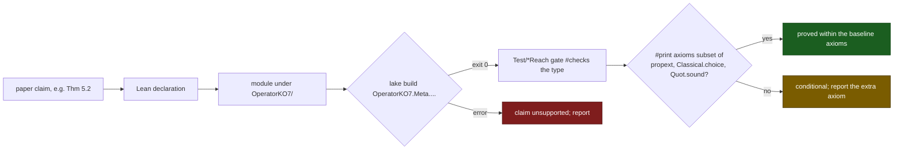

# Unique Normal Forms: claim-to-code index

Generated from `Rahnama_Unique Normal Forms.tex`. Anchors resolve against this repository under `OperatorKO7/`. The manuscript keeps the headline claim-to-code table; this file carries the full surface, and a row whose claim cell has a label and no number indexes a result stated in the Lean development: 454 claim anchors and 298 modules.

## Claim to anchor

| Claim | Lean anchor |
|---|---|
| Prop. 2.1 [`prop:un79-lemma64`] Lemma 64 fails as printed | `Meta.UniqueNormalization.Section7Active.Trap.lemma64_fails_as_printed` |
| Prop. 2.1 [`prop:un79-lemma64`] complete nonuniversal graph | `Meta.UniqueNormalization.Section7Active.Trap.lemma64_as_printed` |
| Prop. 2.1 [`prop:un79-lemma64`] `⇓_A` is a consistency invariant | `Meta.UniqueNormalization.Section7Active.Trap.trap_DownOn_is_consistencyInvariant` |
| Prop. 2.1 [`prop:un79-lemma64`] selected redex returns to its fiber | `Meta.UniqueNormalization.Section7Active.Trap.selected_redex_returns_to_fiber` |
| Prop. 2.1 [`prop:un79-lemma64`] parent edge must change under a universal extension | `Meta.UniqueNormalization.Section7Active.Trap.repair_requires_parent_change` |
| Thm. 4.4 [`thm:breaker`] fork | `SafeStep.EqWVoidAnomaly.eqW_void_void_admits_two_normal_forms` |
| Thm. 4.4 [`thm:breaker`] unjoinable | `SafeStep.EqWVoidAnomaly.eqW_void_void_normal_forms_are_unjoinable` |
| Thm. 4.4 [`thm:breaker`] critical pair | `SafeStep.EqWVoidAnomaly.local_confluence_fails_at_eqW_void_void` |
| local-join obstruction (origin) | `Meta.EqW_Guard_Barrier.not_localJoinStep_eqW_refl`, `MetaSN_KO7.not_localJoinStep_eqW_void_void` |
| pre-undecidability framing | `SafeStep.SmugglingUndecidability.eqW_void_void_is_pre_undecidability_fracture` |
| Thm. 4.6 [`thm:control`] non-LL necessary for the kernel fracture, insufficient alone | `SafeStep.DistinctionControls.nonLeftLinearity_necessary_not_sufficient` |
| SafeStep removes the diagonal branch | `SafeStep.DistinctionControls.safestep_removes_exactly_diagonal` |
| closed witness (scoped) | `SafeStep.DistinctionControls.eqW_void_void_closed_witness` |
| Def. 4.7 [`def:dfs`] diagonal-fork schema | `SafeStep.GenericDiagonalFork.DiagonalForkSchema` |
| Thm. 4.8 [`thm:portability`] generic fork (portability) | `SafeStep.GenericDiagonalFork.localConfluence_fails_at_diagonal` |
| Thm. 4.8 [`thm:portability`] KO7 instance (derived) | `SafeStep.GenericDiagonalFork.eqW_void_void_genericDiagonalFork` |
| Thm. 4.9 [`thm:dwb`] characterization (biconditional) | `SafeStep.DistinctionWitnessBoundary.diagonal_localConfluence_iff_verdictsJoin` |
| Thm. 4.9 [`thm:dwb`] KO7 diagonal determined | `SafeStep.DistinctionWitnessBoundary.ko7_diagonal_determined` |
| Thm. 4.9 [`thm:dwb`] characterization on the KO7 kernel | `SafeStep.DistinctionWitnessBoundary.ko7_diagonal_localConfluence_iff_verdictsJoin` |
| Thm. 4.9 [`thm:dwb`] guard recovery | `SafeStep.DistinctionWitnessBoundary.guarded_diagonal_localJoin` |
| Thm. 4.9 [`thm:dwb`] guard recovery on the KO7 constructors | `SafeStep.DistinctionWitnessBoundary.ko7_guarded_diagonal_localJoin` |
| Thm. 4.9 [`thm:dwb`] delete and quotient recoveries | `SafeStep.DistinctionWitnessBoundary.delete_recovers`, `quotient_recovers` |
| Thm. 4.9 [`thm:dwb`] two-sided boundary | `SafeStep.DistinctionWitnessBoundary.distinction_witness_boundary` |
| Thm. 4.12 [`thm:takahashi`] Takahashi triangle property | `OperatorKO7.Meta.Rewriting.parStep_triangle` |
| Thm. 4.12 [`thm:takahashi`] parallel-reduction diamond | `OperatorKO7.Meta.Rewriting.parStep_diamond` |
| Thm. 4.12 [`thm:takahashi`] termination-free confluence | `OperatorKO7.Meta.Rewriting.weaklyOrthogonal_shallow_stepStar_confluent` |
| Thm. 7.1 [`thm:completeness`] critical-pair completeness (biconditional) | `DistinctionBoundary.CriticalPairCompleteness.eqW_diagonal_is_the_unique_root_obstruction` |
| Thm. 7.1 [`thm:completeness`] canonical-witness corollary | `DistinctionBoundary.CriticalPairCompleteness.eqW_void_void_is_canonical_root_obstruction` |
| Thm. 7.2 [`thm:global`] global confluence of SafeStep | `DistinctionBoundary.GlobalConfluence.safeStep_globally_confluent` |
| Thm. 7.2 [`thm:global`] context-closed global confluence | `DistinctionBoundary.GlobalConfluence.safeStepCtx_globally_confluent` |
| Thm. 7.2 [`thm:global`] unique normal forms | `DistinctionBoundary.GlobalConfluence.safeStep_unique_normal_forms` |
| Thm. 7.2 [`thm:global`] Newman ingredients (SN, local joinability, combination) | `MetaCM.wf_SafeStepRev_c`, `MetaSN_KO7.locAll_safe`, `MetaSN_KO7.newman_safe` |
| Thm. 7.2 [`thm:global`] axis end to end (confluent + obstruction-complete) | `DistinctionBoundary.GlobalConfluence.safeStep_confluent_and_obstruction_complete` |
| mathematical confluence-axis spine | `DistinctionBoundary.Pillar` |
| claim-anchor check module | `Test.DistinctionBoundaryClaimLiveness` |
| Thm. 5.1 [`thm:nonderiv`] inexpressibility | `SafeStep.SyntacticNonDerivability.disequality_not_sigma_expressible_unconditional` |
| substitution-invariance lemma | `SafeStep.SigmaFreeAlgebra.evalSigma_non_leaf_never_void` |
| negative witness | `SafeStep.SyntacticNonDerivability.disequality_is_not_substitution_invariant` |
| Thm. 5.2 [`thm:onefaces`] one obstruction, two faces (shared root) | `DistinctionBoundary.SharedRoot.two_nonderivabilities_share_one_root` |
| Thm. 5.2 [`thm:onefaces`] two distinct faces | `DistinctionBoundary.SharedRoot.shared_root_has_two_genuine_faces` |
| Thm. 5.2 [`thm:onefaces`] abstract obstruction (reusable) | `DistinctionBoundary.SharedRoot.SubstitutionInvariantObstruction`, `collapse_blind_license_sighted` |
| Def [`def:inexpr`] inexpressibility predicate | `SafeStep.DistinctionInexpressible.IsDistinctionInexpressible` |
| Def [`def:inexpr`] KO7 instance | `SafeStep.DistinctionInexpressible.ko7_distinctionInexpressible` |
| Thm [`thm:witorder`] grade type and the two adequacy legs | `SafeStep.DistinctionInexpressible.CWLevel`, `raw_inadequate`, `license_adequate` |
| Thm [`thm:witorder`] witness order (`_dist1`) | `SafeStep.DistinctionInexpressible.kappaDist_ge_one` |
| Thm [`thm:witorder`] witness order one (`_dist=1`) | `SafeStep.DistinctionInexpressible.kappaDist_eq_one` |
| Thm [`thm:witorder`] witness order nonzero (bundle) | `SafeStep.DistinctionInexpressible.ko7_confluence_witnessOrder_nonzero` |
| Prop. 6.1 [`prop:guard`] external observer | `SafeStep.SyntacticNonDerivability.safestep_guard_requires_external_observer` |
| Thm. 6.2 [`thm:guardnogo`] guard obstruction (diagonal) | `SafeStep.GuardNecessity.diagonal_emission_incompatible_with_local_confluence` |
| Thm. 6.2 [`thm:guardnogo`] guard route is the satisfier | `SafeStep.GuardNecessity.guard_is_the_satisfier` |
| Thm. 6.4 [`thm:comparator`] comparator `` decidable eq | `Meta.ComparatorNecessity.exactComparator_decidableEq` |
| Thm. 6.4 [`thm:comparator`] decidable eq `` comparator | `Meta.ComparatorNecessity.decidableEq_exactComparator` |
| Thm. 6.4 [`thm:comparator`] comparator on the kernel carrier | `Meta.ComparatorNecessity.exactComparator_Trace` |
| asymmetry leg 1 (memory) | `InformationalIncompleteness.MemoryDistinction.equality_not_one_cell_observable` |
| asymmetry leg 1 (two-cell) | `InformationalIncompleteness.MemoryDistinction.equality_is_two_cell_observable` |
| asymmetry leg 2 (info) | `InformationalIncompleteness.MemoryDistinction.distinction_bears_information` |
| asymmetry leg 2 (zero) | `InformationalIncompleteness.MemoryDistinction.no_distinction_zero_information` |
| asymmetry leg 3 (fork) | `InformationalIncompleteness.MemoryDistinction.eqW_distinction_fork` |
| Thm [`thm:inert`] record-inert | `BoundaryGeneral.DistinctionRecord.equality_record_inert` |
| Thm [`thm:inert`] non-null has distinction | `BoundaryGeneral.DistinctionRecord.nonnull_has_distinction` |
| record surface (non-vacuity) | `BoundaryGeneral.DistinctionRecord.RecordSurface`, `ko7RecordSurface`, `ko7_distinctionComplete`, `ko7_equality_record_inert` |
| carrier-burden cost | `BoundaryGeneral.DiagonalMirror.mirror_cost_separation`, `ko7_mirror_cost_separation` |
| Prop [`prop:echo`] echo vacuum | `InformationalIncompleteness.LicensedChannelDeficit.circular_reference_zero_deficit` |
| echo vacuum (contrapositive) | `InformationalIncompleteness.LicensedChannelDeficit.positive_deficit_requires_exogeny` |
| Prop [`prop:bracket`] deficit bracket (`0 I H(X W_0)`) | `InformationalIncompleteness.LicensedChannelDeficit.deficit_bracket` |
| Prop [`prop:bracket`] upper bound achieved (full resolution) | `InformationalIncompleteness.LicensedChannelDeficit.deficit_eq_condEntropyDirect_of_zero_residual` |
| Prop [`prop:bracket`] deficit nonnegativity and the two endpoint witnesses | `InformationalIncompleteness.LicensedChannelDeficit.deficit`, `deficit_nonneg`, `circular_reference_witness_zero`, `deficit_witness_saturates_upper` |
| distinction-completeness biconditional | `BoundaryGeneral.DistinctionRecord.distinctionComplete_iff_no_reflexive_nonnull` |
| license-as-proof-object | `SafeStep.GaugeFixingGuard.DistinctionLicense`, `distinctionLicense_diagonal_empty`, `safeStepGuard_to_distinctionLicense`, `distinctionLicense_to_safeStepGuard` |
| external gauge choice (the arm selector) | `SafeStep.GaugeFixingGuard.ExternalGaugeChoice` |
| guard restores local confluence off the diagonal | `SafeStep.GaugeFixingGuard.safestep_guard_restores_local_confluence` |
| guard smuggles external observer | `SafeStep.SmugglingUndecidability.safestep_guard_smuggles_external_observer` |
| eqW fracture (pre-undecidability) | `SafeStep.SmugglingUndecidability.eqW_void_void_is_pre_undecidability_fracture` |
| Def [`def:branchtxn`] license-rejected branch | `SafeStep.BranchTransaction.ForbiddenBranch` |
| Def [`def:branchtxn`] branch transaction | `SafeStep.BranchTransaction.BranchTransaction` |
| Prop [`prop:branchtxn`] KO7 branch transaction | `SafeStep.BranchTransaction.ko7_branchTransaction` |
| Prop [`prop:branchtxn`] license-rejected branch non-vacuity | `SafeStep.BranchTransaction.forbiddenBranch_nonempty` |
| terminal-Hartley collapse (real-valued, primary) | `SafeStep.BranchEntropyGeneral.eqW_void_void_branchEntropyGeneral_collapse` over `branchEntropy` `=_2` |
| two-verdict helper (internal) | `SafeStep.BranchEntropy.eqW_void_void_branchEntropy_collapse` over `verdictBits` |
| diagonal refusal certificate (the negative certificate) | `SafeStep.BranchEntropy.diagonal_refusal` |
| ascent-profile comparison (reused) | `StructuralIdentityComparison.compatible_profile_has_dp_structural_identity` |
| Thm. C.3 [`thm:structid`] six-step classification | `SafeStep.DistinctionAscentProfile.distinctionBoundary_has_dp_structural_identity`, `SafeStep.AscentProfileDegeneracy.compatibleWithDp_iff_realizes`, `contentlessToDistinction`, `distinctionToContentless`, `stagewiseEquivalent_of_realizes`, `ascent_profile_identity_is_classification` |
| Thm. E.3 [`thm:structid-morph`] comparison-category degeneracy | `SafeStep.AscentProfileDegeneracy.comparisonWitness_subsingleton`, `comparisonOfRealized` |
| Thm. E.4 [`thm:ascent-transport`] licensed-ascent transport | `LicensedBoundaryCalculus.LicensedAscentTransport.licensed_ascent_identity_split`, `licensed_ascent_transport_table`, `licensed_ascent_failing_laws`, `no_ascentHom_distinction_orientation`, `no_ascentHom_orientation_distinction`, `ascentHom_distinction_quotation` |
| Thm. E.5 [`thm:bdry-iso`] boundary operator, collapse with six laws | `SafeStep.BoundaryDuality.collapseBoundaryOperator` |
| Thm. E.5 [`thm:bdry-iso`] the two boundary operators | `SafeStep.BoundaryDuality.distinctionBoundaryOperator`, `orientationBoundaryOperator` |
| Thm. E.5 [`thm:bdry-iso`] boundary-operator morphism, inverse, verdict swap, morphism category | `SafeStep.BoundaryDuality.distinctionToOrientationBO`, `orientationToDistinctionBO`, `verdictSwap`, `BoundaryMorphism` |
| Thm. E.5 [`thm:bdry-iso`] verdict-layer collapse iso, degenerate swap | `SafeStep.BoundaryDuality.distinction_orientation_boundary_iso` |
| Thm. E.6 [`thm:dyn-functor`] functor carrier | `SafeStep.DynamicalBoundaryFunctor.RewriteBoundaryFunctor` |
| Thm. E.6 [`thm:dyn-functor`] Step/SafeStep functors | `SafeStep.DynamicalBoundaryFunctor.distinction_dynamics_has_full_and_guarded_functors` and `orientation_dynamics_has_full_and_guarded_functors` |
| Thm. E.6 [`thm:dyn-functor`] eqW critical pair transported | `SafeStep.DynamicalBoundaryFunctor.eqW_critical_pair_maps_to_distinction_boundary` |
| Thm. E.6 [`thm:dyn-functor`] off-diagonal SafeStep transported | `SafeStep.DynamicalBoundaryFunctor.distinction_license_maps_offdiagonal_safeStep` |
| Thm. E.6 [`thm:dyn-functor`] non-faithfulness fence | `SafeStep.DynamicalBoundaryFunctor.distinction_dynamical_functor_not_faithful` |
| Thm. C.4 [`thm:nogo`] faithfulness obstruction (general) | `SafeStep.FaithfulnessNoGo.not_payloadFaithful_of_covers` |
| Thm. C.4 [`thm:nogo`] obstruction instances (Step and SafeStep) | `SafeStep.FaithfulnessNoGo.distinction_no_faithful_dynamical_functor`, `orientation_no_faithful_dynamical_functor`, `safeStep_distinction_no_faithful_dynamical_functor` |
| Thm. C.5 [`thm:rawcorr`] dual non-linearity (both rules) | `SafeStep.NonlinearityDichotomy.boundary_rules_dual_nonlinear`, `eqwRefl_leftNonlinear`, `recdSucc_rightDuplicating`, `nonlinearity_dichotomy` |
| Thm. C.5 [`thm:rawcorr`] necessity on each side (ablations) | `Meta.LinearRec_Ablation`, `EqGuardedConfluence.confluentEqGuarded` |
| Thm. C.5 [`thm:rawcorr`] raw-mechanism correspondence (with fork) | `SafeStep.NonlinearityDichotomy.ko7_raw_mechanism_correspondence` |
| **** | |
| licensed-collapse triad equivalence | `InformationalIncompleteness.MemoryDistinction.memory_distinction_information_equiv` |
| record-emission if and only if distinct | `InformationalIncompleteness.DiagonalInert.record_emission_iff_distinction` |
| diagonal inert on three faces | `InformationalIncompleteness.DiagonalInert.diagonal_inert_trinity` |
| eqW diagonal echo vacuum (with fork) | `InformationalIncompleteness.EqWDiagonalDeficit.eqW_diagonal_echo_vacuum_with_fork` |
| axis-growth separation (linear vs unbounded) | `InformationalIncompleteness.AxisGrowthSeparation.axis_growth_separation` |
| unified licensed-collapse deficit | `InformationalIncompleteness.LicensedCollapseDeficit.boundary_collapse_unified` |
| confluence collapse is one bit | `InformationalIncompleteness.LicensedCollapseDeficit.confluence_collapse_matches_branch_entropy` |
| **Expansion: discharged repair routes, second instance, asymmetry, and resources** | |
| inert-witness repair, globally confluent (Newman) | `DistinctionBoundary.RepairRoutes.confluent_inert` |
| delete-difference repair, globally confluent (Newman) | `DistinctionBoundary.RepairRoutes.confluent_deleteDiff` |
| quotient repair, the two verdicts identified | `DistinctionBoundary.RepairRoutes.quotient_route_witness_void` |
| second fork-schema instance, a totalized comparator | `SafeStep.DiagonalForkClassicInstance.localConfluence_fails_comparator` |
| refusal load, one unit certificate per diagonal query | `SafeStep.RefusalLoad.refLoad_diagonal_eq_one` |
| refusal load, linear in the batch size | `SafeStep.RefusalLoad.refLoad_batch_eq_N` |
| Prop [`prop:costdual`] retained-route additive charge law | `DistinctionBoundary.CostDual.totalCharge_append` |
| Prop [`prop:costdual`] orientation charge equals confessed burden | `DistinctionBoundary.CostDual.orientation_totalCharge_doubled_eq_confessedBurdenDoubled` |
| Prop [`prop:costdual`] distinction charge matches refusal load | `DistinctionBoundary.CostDual.distinction_matches_refLoad_batch` |
| Prop [`prop:costdual`] retained-route magnitude separation | `DistinctionBoundary.CostDual.retained_route_magnitudes_separate` |
| Prop [`prop:costdual`] inert route carries empty retained charge | `DistinctionBoundary.CostDual.inert_route_zero_retained_charge` |
| comparison asymmetry, two-semidecider collapse | `InformationalIncompleteness.ComparisonAsymmetry.semideciders_jointlyTotal_decidableEq` |
| comparison asymmetry, the characterization | `InformationalIncompleteness.ComparisonAsymmetry.comparisonAsymmetry_characterization` |
| single bad critical pair suffices | `DistinctionBoundary.SingleBadCriticalPair.ko7_single_bad_pair_package` |
| legacy terminal repair wrapper | `DistinctionBoundary.TerminalRepair.safeStep_terminal_repair` |
| schema guarded completion | `SafeStep.UniversalGuardCompletion.canonical_refuses_diag_diff` |
| productive record surface induces generator | `SafeStep.RecordSurfaceGenerator.ProductiveRecordSurface.toDistinctionGenerator` |
| finite gluing obstruction | `DistinctionBoundary.FiniteGluingObstruction.raw_diagonal_sections_fail_to_glue` |
| branch-code floor drop | `SafeStep.BranchCodeFloor.diagonal_branch_code_drops_one` |
| guarded-Newman upper package | `ReverseMath.GuardedNewmanRCA0.guarded_newman_upper_package` |
| finite equalizer obstruction | `DistinctionBoundary.EqualizerObstruction.raw_diagonal_square_fails` |
| refusal-load balance accounting | `SafeStep.EntropySink.ko7_entropySink_balance` |
| finite strict-transform chart | `DistinctionBoundary.StrictTransform.ko7_chart_refuses_diagonal_difference` |
| finite transaction Galois connection | `DistinctionBoundary.TransactionGalois.finite_transaction_galois` |
| minimum refusal load | `SafeStep.RefusalLoadMinimum.ko7_refusal_load_is_minimum` |
| finite Lawvere-style obstruction | `DistinctionBoundary.LawvereObstruction.eqW_void_void_finite_fixed_point_obstruction` |
| rewriting-liar package | `DistinctionBoundary.RewritingLiar.eqW_void_void_rewriting_liar` |
| metric diagonal-null law | `DistinctionBoundary.MetricDiagonalAxiom.safeStep_satisfies_metric_diagonal_null` |
| mode-by-mode certificate | `DistinctionBoundary.EqualityModeCertificate.collapse_mode_is_raw_fork_certificate` |
| third fork-schema instance, equality-reflection analogy | `SafeStep.EqualityReflectionInstance.equalityReflection_localConfluence_fails` |
| schema semidecider portability | `InformationalIncompleteness.SemideciderCollapseSchema.equality_semidecider_collapse_is_decidableEq` |
| zero-capacity diagonal channel | `InformationalIncompleteness.EqWDiagonalCapacity.eqW_diagonal_zero_capacity_with_fork` |
| constant boundary-verdict functor surface | `SafeStep.FaithfulnessNoGo.payloadDiscarding_constant_functor_surface` |
| repair-basis scoping | `DistinctionBoundary.RepairBasis.determined_diagonal_repair_condition` |
| contextual obstruction certificate | `DistinctionBoundary.ContextualDiagonalFork.eqW_void_void_contextual_obstruction_certificate` |
| Thm. 4.5 [`thm:ctxscope`] contextual survival at the void diagonal | `DistinctionBoundary.ContextualDiagonalScope.eqW_void_void_ctx_not_joinable` |
| Thm. 4.5 [`thm:ctxscope`] contextual dissolution at a delta-headed diagonal | `DistinctionBoundary.ContextualDiagonalScope.eqW_delta_diagonal_ctx_joinable` |
| Thm. 4.5 [`thm:ctxscope`] scope of the contextual fracture (bundle, axiom-free) | `DistinctionBoundary.ContextualDiagonalScope.contextual_fracture_scope` |
| anti-overclaim guarded interface | `SafeStep.EqualityWitnessGeneralization.not_every_eqW_like_interface_forks` |
| copy-discard determinism certificate | `DistinctionBoundary.CopyDiscardDeterminism.raw_comparator_violates_copy_discard_at_void` |
| normalization-axis seed | `NormalizationBoundary.DeltaIntegrateAsymmetry.twoWayNorm_not_wellFounded_rev` |
| partial Y/N/U comparator necessity | `Meta.ComparatorNecessityPartial.decisive_decidableEq` |
| **Finite completion layer** | |
| Thm. G.1 [`thm:axisfunctor`] involutive axis swap | `DistinctionBoundary.AxisDualityFunctor.axis_duality_involutive` |
| Thm. G.1 [`thm:axisfunctor`] descriptor maps in both directions | `DistinctionBoundary.AxisDualityFunctor.Axis`, `dualAxis`, `obstructionToLicense`, `licenseToObstruction` |
| Thm. G.1 [`thm:axisfunctor`] obstruction/license Galois statement | `DistinctionBoundary.AxisDualityFunctor.obstruction_license_duality_galois` |
| Thm. G.1 [`thm:axisfunctor`] transaction Galois as axis duality | `DistinctionBoundary.AxisDualityFunctor.transaction_galois_is_axis_duality` |
| Thm. G.1 [`thm:axisfunctor`] unit distinction boundary charge | `DistinctionBoundary.AxisDualityFunctor.descriptor_distinction_unit_cost` |
| Thm. E.1 [`thm:copydiag`] raw difference violates copy-then-compare | `DistinctionBoundary.LinearLogicDiagonalInterface.ko7_raw_difference_violates_copy_then_compare` |
| Thm. E.1 [`thm:copydiag`] SafeStep respects copy-then-compare | `DistinctionBoundary.LinearLogicDiagonalInterface.safeStep_respects_copy_then_compare_diagonal` |
| Thm. E.1 [`thm:copydiag`] copy-then-compare matches comparator | `DistinctionBoundary.LinearLogicDiagonalInterface.trace_copy_compare_matches_exact_comparator` |
| Thm. E.1 [`thm:copydiag`] copy/contraction carriers | `DistinctionBoundary.LinearLogicDiagonalInterface.FiniteCopyContraction`, `CopyThenCompare`, `traceCopyThenCompare` |
| raw finite directed space has diagonal puncture | `DistinctionBoundary.raw_step_space_diagonal_puncture` |
| guarded finite directed space is locally joinable at the diagonal | `DistinctionBoundary.safeStep_space_locally_directed_joinable_at_diagonal` |
| raw diagonal has nonzero finite Cech-zero obstruction | `DistinctionBoundary.FiniteCechDiagonalObstruction.raw_diagonal_has_nonzero_finite_cech_obstruction` |
| guarded excision kills finite Cech-zero obstruction | `DistinctionBoundary.FiniteCechDiagonalObstruction.guarded_excision_kills_finite_cech_obstruction` |
| finite Cech-zero obstruction matches finite failed gluing | `DistinctionBoundary.FiniteCechDiagonalObstruction.finite_cech_obstruction_matches_gluing` |
| SafeStepCtx order descriptor | `ReverseMath.GuardedNewmanExactCalibration.safeStepCtx_order_type_exact` |
| SafeStepCtx order lower-bound witness | `ReverseMath.GuardedNewmanExactCalibration.safeStepCtx_order_type_lower_bound` |
| guarded-Newman statement closes at `^\!\!2` descriptor | `ReverseMath.GuardedNewmanExactCalibration.guardedNewmanOmegaOmegaTwo_closes` |
| SafeStepCtx single-exponential derivation-length bound | `DistinctionBoundary.SafeStepCtxDerivationLength.safeStepCtx_derivation_length_single_exponential` |
| finite prefix-code raw branch choice slot | `DistinctionBoundary.KolmogorovBranchCertificate.raw_diagonal_choice_slot_one_bit` |
| finite prefix-code guarded branch choice slot | `DistinctionBoundary.KolmogorovBranchCertificate.guarded_diagonal_choice_slot_zero` |
| finite prefix-code model non-vacuity | `DistinctionBoundary.KolmogorovBranchCertificate.branch_certificate_prefix_model_nonvacuous` |
| conditional description-length drop under named invariance interface | `DistinctionBoundary.KolmogorovBranchCertificate.guarded_branch_kolmogorov_drop_conditional` |
| finite prefix-code drop | `DistinctionBoundary.KolmogorovBranchCertificate.finite_guarded_branch_kolmogorov_drop_exact` |
| Prop [`prop:scaling`] orientation bulk charge quadratic doubled | `DistinctionBoundary.CostScalingDimension.orientation_bulk_quadratic_doubled` |
| Prop [`prop:scaling`] distinction boundary charge linear | `DistinctionBoundary.CostScalingDimension.distinction_boundary_linear` |
| Prop [`prop:scaling`] constant per-event distinction charge | `DistinctionBoundary.CostScalingDimension.distinction_per_event_constant` |
| Prop [`prop:scaling`] bulk-versus-boundary scaling divergence | `DistinctionBoundary.CostScalingDimension.bulk_boundary_scaling_diverge` |
| SafeStep final object in the repair category | `DistinctionBoundary.RepairCategory.safeStepFinalObject` |
| Thm. G.2 [`thm:guardcomonad`] guarding comonad on kernel subrelations | `DistinctionBoundary.GuardingComonad.guarding_is_idempotent_interior` |
| Thm. G.2 [`thm:guardcomonad`] definition-driven comonad value characterization | `DistinctionBoundary.GuardingComonad.guarding_comonad_value_is_maximal_repair` |
| all repair objects map to SafeStep final object | `DistinctionBoundary.RepairCategory.safeStep_final_object_hom_nonempty` |
| branch-admission floor, licensed error cutoff | `SafeStep.BranchAdmissionFloor.licensed_error_le` |
| finite-cohort licensed error cutoff | `SafeStep.BranchAdmissionFloor.licensed_cohort_error_le` |
| finite-cohort mean licensed error cutoff | `SafeStep.BranchAdmissionFloor.licensed_cohort_mean_error_le`, `floor_saturated_witness` |
| Thm. E.2 [`thm:dualexternal`] four-way sound-interface theorem | `DistinctionBoundary.DualExternalLicenseBoundary.sound_boundary_interface_four_way` |
| Thm. E.2 [`thm:dualexternal`] liveness witness, four arms | `DistinctionBoundary.DualExternalLicenseBoundary.all_four_discharge_arms_live` |
| payload-faithful section if and only if injective | `SafeStep.FaithfulnessNoGo.payloadFaithfulSection_exists_iff_injective` |
| complete equality-mode certificate | `DistinctionBoundary.EqualityModeCertificate.five_mode_certificate_complete` |
| normalization one-way well-founded | `NormalizationBoundary.DeltaIntegrateLoop.one_way_normalization_well_founded` |
| normalization two-way loop escapes well-foundedness | `NormalizationBoundary.DeltaIntegrateLoop.two_way_delta_integrate_not_wellFounded` |
| anti-normalization lacks an internal inverse | `NormalizationBoundary.AntiNormalizationMap.anti_normalization_no_internal_inverse` |
| normalization licensed recovery with history token | `NormalizationBoundary.NormalizationLicense.anti_normalization_licensed_recovery` |
| Section [`sec:erasing-site`] normalization as irreversibility face | `NormalizationBoundary.NormalizationLicense.normalization_boundary_is_irreversibility_face` |
| Prop [`prop:erasure-directionality`] directionality of the erasing redex | `OperatorKO7.Meta.NormalizationBoundary.DeltaIntegrateLoop.one_way_normalization_well_founded`, `OperatorKO7.Meta.NormalizationBoundary.DeltaIntegrateLoop.two_way_delta_integrate_loops` |
| Prop [`prop:erasure-no-inverse`] no internal inverse | `OperatorKO7.Meta.NormalizationBoundary.AntiNormalizationMap.anti_normalization_no_internal_inverse` |
| Thm [`thm:erasure-infinite-fiber`] infinite erased fiber | `OperatorKO7.Meta.NormalizationBoundary.ErasureFiber.erasedFiberInfinite`, `OperatorKO7.Meta.NormalizationBoundary.ErasureFiber.erasedHistory_injective` |
| Thm [`thm:erasure-finite-tokens`] finite tokens identify distinct histories | `OperatorKO7.Meta.NormalizationBoundary.ErasureFiber.no_finite_token_separates_erased_history`, `OperatorKO7.Meta.NormalizationBoundary.ErasureFiber.no_finite_type_token_separates_erased_history`, `OperatorKO7.Meta.NormalizationBoundary.ErasureFiber.exact_erasure_token_carrier_infinite` |
| Prop [`prop:erasure-not-constant`] the erasing collapse takes two values | `OperatorKO7.Meta.NormalizationBoundary.ErasureFiber.normalForm_not_constant` |
| Thm [`thm:erasure-three-faces`] three faces of one obstruction | `OperatorKO7.Meta.NormalizationBoundary.ThreeFaces.three_faces_share_one_root`, `OperatorKO7.Meta.NormalizationBoundary.ThreeFaces.normalization_face_is_not_constant_collapse`, `OperatorKO7.Meta.NormalizationBoundary.NormalizationLicense.normalizationObstruction` |
| Prop [`prop:erasure-three-sites`] three sites | `OperatorKO7.Meta.NormalizationBoundary.ErasureFiber.normalization_redex_is_not_recursor_redex`, `OperatorKO7.Meta.NormalizationBoundary.ErasureFiber.normalization_redex_is_not_eqW_diagonal` |
| Prop [`prop:erasure-token-injective`] the token is one-to-one | `OperatorKO7.Meta.NormalizationBoundary.ErasureFiber.integrate_delta_injective`, `OperatorKO7.Meta.NormalizationBoundary.ThreeFaces.licensedRecover_injective` |
| Thm [`thm:two-repairs`] the greatest subpredicate closed under reduction | `OperatorKO7.Meta.DistinctionBoundary.PersistentLicense.box_subset`, `OperatorKO7.Meta.DistinctionBoundary.PersistentLicense.box_forwardInvariant`, `OperatorKO7.Meta.DistinctionBoundary.PersistentLicense.box_greatest`, `OperatorKO7.Meta.DistinctionBoundary.PersistentLicense.box_idempotent` |
| Thm [`thm:two-repairs`] the greatest subrelation that maps the predicate into itself | `OperatorKO7.Meta.LicensedBoundaryCalculus.safeRel_subset`, `OperatorKO7.Meta.LicensedBoundaryCalculus.safeRel_preserves`, `OperatorKO7.Meta.LicensedBoundaryCalculus.safeRel_greatest`, `OperatorKO7.Meta.LicensedBoundaryCalculus.boundaryEdge_removed_by_safeRel` |
| Thm [`thm:two-repairs`] each repair is a fixed point of the other | `OperatorKO7.Meta.LicensedBoundaryCalculus.safeRel_box_eq`, `OperatorKO7.Meta.LicensedBoundaryCalculus.box_safeRel_eq`, `OperatorKO7.Meta.LicensedBoundaryCalculus.state_dynamics_mutual_stabilization` |
| Thm [`thm:two-repairs`] greatest stable repairs and the two-point incomparable pair | `OperatorKO7.Meta.LicensedBoundaryCalculus.dynamicsRepair_greatest_with_fullPredicate`, `OperatorKO7.Meta.LicensedBoundaryCalculus.predicateRepair_greatest_with_fullDynamics`, `OperatorKO7.Meta.LicensedBoundaryCalculus.fixture_endpoint_repairs_incomparable`, `OperatorKO7.Meta.LicensedBoundaryCalculus.fixture_real_stable_repair_frontier` |
| Thm [`thm:two-repairs`] persistent disequality at the coalescing pair and at the stable pair | `OperatorKO7.Meta.DistinctionBoundary.PersistentLicense.coalescing_is_distinct`, `OperatorKO7.Meta.DistinctionBoundary.PersistentLicense.coalescing_not_box`, `OperatorKO7.Meta.DistinctionBoundary.PersistentLicense.stably_distinct_box` |
| Prop [`prop:first-crossing`] failure of persistence is a finite path with a first crossing | `OperatorKO7.Meta.LicensedBoundaryCalculus.FailureObject.not_box_iff_exists_reachable_failure_classical`, `OperatorKO7.Meta.LicensedBoundaryCalculus.FailureObject.not_box_iff_exists_failureObject_classical`, `OperatorKO7.Meta.LicensedBoundaryCalculus.FailureObject.of_explicit_path`, `OperatorKO7.Meta.LicensedBoundaryCalculus.FailureObject.crossing_lies_on_path`, `OperatorKO7.Meta.LicensedBoundaryCalculus.FailureObject.prefix_is_safe`, `OperatorKO7.Meta.LicensedBoundaryCalculus.FailureObject.crossing_is_boundary` |
| Prop. 7.12 [`prop:repair-many-to-one`] the repair compiler is monotone, idempotent, and many-to-one | `OperatorKO7.Meta.LicensedBoundaryCalculus.SemanticRepairOrder.confluenceRepair_monotone`, `OperatorKO7.Meta.DistinctionBoundary.WriteClosure.confluenceRepair_idempotent`, `OperatorKO7.Meta.DistinctionBoundary.WriteClosure.confluenceRepair_recDSeed_eq_writeClosure`, `OperatorKO7.Meta.DistinctionBoundary.WriteClosure.recDSeed_ne_writeClosure`, `OperatorKO7.Meta.DistinctionBoundary.WriteClosure.recDSeed_two_histories_same_repair`, `OperatorKO7.Meta.LicensedBoundaryCalculus.same_record_multiple_histories`, `OperatorKO7.Meta.LicensedBoundaryCalculus.confluenceRepair_no_global_left_inverse` |
| Thm [`thm:freeze-grammar`] every decidable position policy has a finite grammar term | `OperatorKO7.Meta.LicensedBoundaryCalculus.freezeAtom_complete`, `OperatorKO7.Meta.LicensedBoundaryCalculus.freezePolicy_semantic_complete`, `OperatorKO7.Meta.LicensedBoundaryCalculus.freezePolicy_writeClose_closed`, `OperatorKO7.Meta.LicensedBoundaryCalculus.freezePolicy_repair_confluent`, `OperatorKO7.Meta.LicensedBoundaryCalculus.repairedRecDPolicy_confluent` |
| Thm [`thm:freeze-grammar`] the guard grammar denotes a proper subset of the guards | `OperatorKO7.Meta.LicensedBoundaryCalculus.interpretGuard_equalityStatusInvariant`, `OperatorKO7.Meta.LicensedBoundaryCalculus.leftVoidGuard_not_equalityStatusInvariant`, `OperatorKO7.Meta.LicensedBoundaryCalculus.guardGrammar_not_semantically_complete` |
| Thm [`thm:proof-carrying`] authorization and refusal indexed by the request | `OperatorKO7.Meta.LicensedBoundaryCalculus.ProofCarryingLicense.authorized_safeRel`, `OperatorKO7.Meta.LicensedBoundaryCalculus.ProofCarryingLicense.authorized_target`, `OperatorKO7.Meta.LicensedBoundaryCalculus.ProofCarryingLicense.refused_boundary`, `OperatorKO7.Meta.LicensedBoundaryCalculus.ProofCarryingLicense.replay_refusal`, `OperatorKO7.Meta.LicensedBoundaryCalculus.ProofCarryingLicense.boundary_no_authorization`, `OperatorKO7.Meta.LicensedBoundaryCalculus.same_input_dependency_fixture` |
| Thm [`thm:repair-transaction`] repair, authorization, and refusal on the recursor seed | `OperatorKO7.Meta.LicensedBoundaryCalculus.emptyRecoveryPolicy_confluent`, `OperatorKO7.Meta.LicensedBoundaryCalculus.rawRecoveryPolicy_not_confluent`, `OperatorKO7.Meta.LicensedBoundaryCalculus.capstoneFailureObject`, `OperatorKO7.Meta.LicensedBoundaryCalculus.capstoneFailedGrammar_exact`, `OperatorKO7.Meta.LicensedBoundaryCalculus.capstoneRepairedPolicy_eq_canonical`, `OperatorKO7.Meta.LicensedBoundaryCalculus.capstoneRepairedPolicy_confluent`, `OperatorKO7.Meta.LicensedBoundaryCalculus.capstone_admitted_path_sound`, `OperatorKO7.Meta.LicensedBoundaryCalculus.capstone_refused_path_sound`, `OperatorKO7.Meta.LicensedBoundaryCalculus.capstoneRawRequest_not_authorizable`, `OperatorKO7.Meta.LicensedBoundaryCalculus.capstone_recovery_forward_separation`, `OperatorKO7.Meta.LicensedBoundaryCalculus.capstone_many_to_one_recovery_boundary` |
| Thm. 7.17 [`thm:grade-transport`] reflection along step simulations, transport along step liftings, code maps | `OperatorKO7.Meta.DistinctionBoundary.DynamicDiagonalGradeTransport.d1p_reflect_of_stepSimulation`, `OperatorKO7.Meta.DistinctionBoundary.DynamicDiagonalGradeTransport.d1p_transport_of_stepLifting`, `OperatorKO7.Meta.DistinctionBoundary.DynamicDiagonalGradeTransport.d2At_transport_codeDenotation` |
| Thm. 7.17 [`thm:grade-transport`] each hypothesis alone leaves the other conclusion false | `OperatorKO7.Meta.DistinctionBoundary.DiagonalGradeStratification.d1p_not_transport_of_simulation_alone`, `OperatorKO7.Meta.DistinctionBoundary.DiagonalGradeStratification.d2_not_reflect_of_lifting_alone` |
| Thm. 7.17 [`thm:grade-transport`] invariance under reflexive-transitive closure | `OperatorKO7.Meta.LicensedBoundaryCalculus.LicensingCompletionRule.d1p_reflTransGen_iff`, `OperatorKO7.Meta.LicensedBoundaryCalculus.LicensingCompletionRule.d2At_reflTransGen_iff` |
| Prop [`prop:grade-computation`] products, pair lift, closure of persistence, role collapse | `OperatorKO7.Meta.LicensedBoundaryCalculus.LicensingProductQuotient.productStep_star_iff`, `OperatorKO7.Meta.LicensedBoundaryCalculus.LicensingProductQuotient.box_product_iff`, `OperatorKO7.Meta.LicensedBoundaryCalculus.LicensingProductQuotient.licensedPairSubrelation_box_iff_d1p`, `OperatorKO7.Meta.LicensedBoundaryCalculus.LicensingProductQuotient.roleErasure_quotient_no_discriminator`, `OperatorKO7.Meta.LicensedBoundaryCalculus.LicensingCompletionRule.box_reflTransGen_iff` |
| Def [`def:self-evaluation`] the self-evaluation structure and its self-application map | `OperatorKO7.Meta.DistinctionBoundary.DiagonalLevels.SelfEvaluationDiagonal`, `OperatorKO7.Meta.DistinctionBoundary.GodelFixedPoint.selfApplication`, `OperatorKO7.Meta.DistinctionBoundary.GodelFixedPoint.Represents` |
| Thm [`thm:self-exclusion`] a represented diagonal composite has a fixed point | `OperatorKO7.Meta.DistinctionBoundary.GodelFixedPoint.represented_composite_has_fixed_point`, `OperatorKO7.Meta.DistinctionBoundary.Godel.fixed_point_from_represented_diagonal` |
| Thm [`thm:self-exclusion`] a fixed-point-free endomap has no represented composite | `OperatorKO7.Meta.DistinctionBoundary.GodelFixedPoint.not_represents_composite_of_fixed_point_free`, `OperatorKO7.Meta.DistinctionBoundary.Godel.fixed_point_free_not_represented` |
| Thm [`thm:self-exclusion`] the successor obstruction on the kernel carrier | `OperatorKO7.Meta.DistinctionBoundary.GodelFixedPoint.not_represents_delta_composite`, `OperatorKO7.Meta.DistinctionBoundary.Godel.successor_obstruction`, `OperatorKO7.Meta.DistinctionBoundary.DiagonalLevels.delta_ne_self` |
| Thm [`thm:self-exclusion`] self-exclusion of a class closed under the successor | `OperatorKO7.Meta.DistinctionBoundary.GodelFixedPoint.ClosedUnderLeftDelta`, `OperatorKO7.Meta.DistinctionBoundary.GodelFixedPoint.self_exclusion_of_class`, `OperatorKO7.Meta.DistinctionBoundary.Godel.self_exclusion` |
| Prop [`prop:three-escapes`] the obstruction is the conjunction of its three hypotheses | `OperatorKO7.Meta.DistinctionBoundary.GodelEscape.Ingredients`, `OperatorKO7.Meta.DistinctionBoundary.GodelEscape.Obstruction`, `OperatorKO7.Meta.DistinctionBoundary.GodelEscape.Escape`, `OperatorKO7.Meta.DistinctionBoundary.GodelEscape.escape_iff_not_obstruction`, `OperatorKO7.Meta.DistinctionBoundary.GodelEscape.escape_sound`, `OperatorKO7.Meta.DistinctionBoundary.GodelEscape.escape_complete` |
| Prop [`prop:three-escapes`] the three escapes are inhabited on the kernel carrier | `OperatorKO7.Meta.DistinctionBoundary.GodelEscape.fuelled_eval_not_total`, `OperatorKO7.Meta.DistinctionBoundary.GodelEscape.unitValued_retraction_impossible`, `OperatorKO7.Meta.DistinctionBoundary.GodelEscape.schematic_omits_delta_selfap`, `OperatorKO7.Meta.DistinctionBoundary.GodelEscape.ko7_not_obstructed` |
| Thm [`thm:boundary-object`] the boundary is the greatest sublicense closed under reduction | `OperatorKO7.Meta.LicensedBoundaryCalculus.BoundaryObjectFunctor.Bd`, `OperatorKO7.Meta.LicensedBoundaryCalculus.BoundaryObjectFunctor.BdCarrier`, `OperatorKO7.Meta.LicensedBoundaryCalculus.BoundaryObjectFunctor.bd_greatest_forwardInvariant` |
| Thm [`thm:boundary-object`] transport, reflection, and the functor laws | `OperatorKO7.Meta.LicensedBoundaryCalculus.BoundaryObjectFunctor.bd_transport_of_lifting`, `OperatorKO7.Meta.LicensedBoundaryCalculus.BoundaryObjectFunctor.bd_reflect_of_simulation`, `OperatorKO7.Meta.LicensedBoundaryCalculus.BoundaryObjectFunctor.boundaryObject_functorial_on_lifting_morphisms` |
| Thm [`thm:boundary-object`] the four carriers, with two empty boundaries | `OperatorKO7.Meta.LicensedBoundaryCalculus.BoundaryObjectFunctor.four_fibers_are_instances`, `OperatorKO7.Meta.LicensedBoundaryCalculus.BoundaryObjectFunctor.ko7_bd_iff_d1p`, `OperatorKO7.Meta.LicensedBoundaryCalculus.BoundaryObjectFunctor.compactUniformSeparation_iff_forall_bd`, `OperatorKO7.Meta.LicensedBoundaryCalculus.BoundaryObjectFunctor.role_bd_empty`, `OperatorKO7.Meta.LicensedBoundaryCalculus.BoundaryObjectFunctor.dp_bd_empty_but_issue_licensed` |
| Prop [`prop:metric-license`] the analytic instance and its reciprocal transport | `OperatorKO7.Meta.LicensedBoundaryCalculus.MetricDynamicLicense.metricPersistentLicense_iff_compactUniformSeparation`, `OperatorKO7.Meta.LicensedBoundaryCalculus.MetricDynamicLicense.guardExpiry_pointwise_nonzero_but_unlicensed`, `OperatorKO7.Meta.LicensedBoundaryCalculus.MetricDynamicLicense.metricPersistentLicense_reciprocal_transport` |
| Thm [`thm:transport-ceiling`] the eight transport properties and the strict implication | `OperatorKO7.Meta.LicensedBoundaryCalculus.TransportStrength.ForwardStepSimulation`, `OperatorKO7.Meta.LicensedBoundaryCalculus.TransportStrength.StepReflection`, `OperatorKO7.Meta.LicensedBoundaryCalculus.TransportStrength.StepLifting`, `OperatorKO7.Meta.LicensedBoundaryCalculus.TransportStrength.ARSIsomorphism`, `OperatorKO7.Meta.BoundaryOperator.TransportCeiling.TransportProperty`, `OperatorKO7.Meta.BoundaryOperator.TransportCeiling.Statement`, `OperatorKO7.Meta.BoundaryOperator.TransportCeiling.forwardStep_strictly_implies_forwardReach` |
| Thm [`thm:transport-ceiling`] isomorphism supplies every property | `OperatorKO7.Meta.LicensedBoundaryCalculus.TransportStrength.arsIsomorphism_forwardStep`, `OperatorKO7.Meta.LicensedBoundaryCalculus.TransportStrength.arsIsomorphism_stepLifting`, `OperatorKO7.Meta.LicensedBoundaryCalculus.TransportStrength.arsIsomorphism_reachReflection`, `OperatorKO7.Meta.LicensedBoundaryCalculus.TransportStrength.arsIsomorphism_reductionEquivalence`, `OperatorKO7.Meta.LicensedBoundaryCalculus.TransportStrength.arsIsomorphism_terminalExactness` |
| Thm [`thm:transport-ceiling`] the antichain, the ceiling, and the promotion failure | `OperatorKO7.Meta.BoundaryOperator.TransportCeiling.forwardStep_stepReflection_antichain`, `OperatorKO7.Meta.BoundaryOperator.TransportCeiling.Ceiling`, `OperatorKO7.Meta.BoundaryOperator.TransportCeiling.identityTransportCeiling`, `OperatorKO7.Meta.BoundaryOperator.TransportCeiling.PromotionFailure`, `OperatorKO7.Meta.BoundaryOperator.TransportCeiling.collapsePromotionFailure` |
| Prop [`prop:pareto-order`] the four-coordinate order and its unordered pair | `OperatorKO7.Meta.LicensedBoundaryCalculus.SemanticRepairOrder.SemanticRepairProfile`, `OperatorKO7.Meta.LicensedBoundaryCalculus.SemanticRepairOrder.ParetoLE`, `OperatorKO7.Meta.LicensedBoundaryCalculus.SemanticRepairOrder.paretoLE_preorder`, `OperatorKO7.Meta.LicensedBoundaryCalculus.SemanticRepairOrder.pareto_incomparable_witness` |
| Prop [`prop:pareto-order`] the greatest predicate repair and the least confluent policy | `OperatorKO7.Meta.LicensedBoundaryCalculus.SemanticRepairOrder.box_maximal_predicate_repair`, `OperatorKO7.Meta.LicensedBoundaryCalculus.SemanticRepairOrder.confluenceRepair_minimal_write_closed`, `OperatorKO7.Meta.DistinctionBoundary.PersistentLicense.box_greatest`, `OperatorKO7.Meta.DistinctionBoundary.WriteClosure.confluenceRepair_least` |
| Thm [`thm:channel-expiry`] the channel expiry object and the expiry equivalence | `OperatorKO7.Meta.LicensedBoundaryCalculus.ChannelExpiry.channelExpiry`, `OperatorKO7.Meta.LicensedBoundaryCalculus.ChannelExpiry.channel_issue_exogenous`, `OperatorKO7.Meta.LicensedBoundaryCalculus.ChannelExpiry.channel_consume_echo`, `OperatorKO7.Meta.LicensedBoundaryCalculus.ChannelExpiry.channel_consume_not_exogenous`, `OperatorKO7.Meta.LicensedBoundaryCalculus.ChannelExpiry.channelExpiry_issue_license_expires`, `OperatorKO7.Meta.BoundaryGeneral.PersistentExogeny.license_expiry_iff_reachable_echo` |
| Thm [`thm:channel-expiry`] two blocked transports and the morphism to the role object | `OperatorKO7.Meta.LicensedBoundaryCalculus.ChannelExpiry.no_hom_channel_eqW`, `OperatorKO7.Meta.LicensedBoundaryCalculus.ChannelExpiry.no_hom_channel_quote`, `OperatorKO7.Meta.LicensedBoundaryCalculus.ChannelExpiry.homChannelRole`, `OperatorKO7.Meta.LicensedBoundaryCalculus.ChannelExpiry.hom_channel_role_nonempty`, `OperatorKO7.Meta.LicensedBoundaryCalculus.ChannelExpiry.four_live_expiry_witnesses`, `OperatorKO7.Meta.LicensedBoundaryCalculus.ChannelExpiry.channel_expiry_is_fourth_object` |
| Prop [`prop:comp-drop`] equality of codes is computable and equality of behaviour is not | `OperatorKO7.Meta.DistinctionBoundary.DiagonalCompDrop.comp_drop_mechanized`, `OperatorKO7.Meta.DistinctionBoundary.DiagonalCompDrop.code_pair_equality_computable`, `OperatorKO7.Meta.DistinctionBoundary.DiagonalCompDrop.comp_behaviour_comparison_not_computable`, `OperatorKO7.Meta.DistinctionBoundary.DiagonalCompDrop.comp_extensional_computable_predicate_trivial`, `OperatorKO7.Meta.DistinctionBoundary.DiagonalCompDrop.zero_mem_zeroBehavior`, `OperatorKO7.Meta.DistinctionBoundary.DiagonalCompDrop.succ_not_mem_zeroBehavior` |
| Prop. 7.7 [`prop:quote-freeze`] the quotation peak and the freeze it forces | `OperatorKO7.Meta.DistinctionBoundary.GodelPartial.quote_eval_nonjoinable_peak`, `OperatorKO7.Meta.DistinctionBoundary.GodelPartial.eqW_kernel_freeze_does_not_remove_quote_peak`, `OperatorKO7.Meta.DistinctionBoundary.GodelPartial.quote_congruence_freeze_kills_underQuote_arm`, `OperatorKO7.Meta.DistinctionBoundary.GodelPartial.least_freeze_includes_quote_congruence` |
| normalization scope fence, Godel diagonal remains eqW | `NormalizationBoundary.NormalizationLicense.normalization_not_godel_diagonal` |
| **** | |
| Thm. 4.1 [`thm:eqwgen`] fork classification | `SafeStep.EqualityWitnessGeneralization.fork_iff_verdicts_not_join` |
| comparison resource necessity | `SafeStep.EqualityWitnessGeneralization.ComparisonInterface.toDecidableEq` |
| sound comparison, empty diagonal difference | `SafeStep.EqualityWitnessGeneralization.comparison_diagonal_no_difference` |
| avoidance routes (guard, delete, quotient) | `SafeStep.EqualityWitnessGeneralization.guarded_avoids_fork`, `delete_avoids_fork`, `quotient_avoids_fork` |
| KO7 instantiates the fracturing mode | `SafeStep.EqualityWitnessGeneralization.ko7_eqW_is_internalized_totalized_comparison` |
| guarded counterexample (scope fence) | `SafeStep.EqualityWitnessGeneralization.guarded_interfaces_refute_universal_failure` |
| structural necessity (generator to interface) | `SafeStep.EqualityWitnessGeneralization.DistinctionGenerator.toComparisonInterface` |
| resource necessity (decidable generator to DecidableEq) | `SafeStep.EqualityWitnessGeneralization.DistinctionGenerator.toDecidableEq` |
| repair exhaustiveness (determined diagonal) | `SafeStep.EqualityWitnessGeneralization.diagonal_repair_exhaustive` |
| formal comparison-mode classification | `DistinctionBoundary.equalityMode_canDiagonalFork_iff` |
| Thm. 6.3 [`thm:safestepmax`] independent semantic exclusion | `DistinctionBoundary.admissibleAtDiagonal_excludes_difference` |
| Thm. 6.3 [`thm:safestepmax`] finite policy semantics and greatestness | `DistinctionBoundary.admissibleDiagonalCriticalPolicy_iff_semantic_admissibility`, `canonicalDiagonalCriticalPolicy_is_greatest_semantic` |
| Thm. 6.3 [`thm:safestepmax`] finite terminal object and idempotent guard | `DistinctionBoundary.canonicalCriticalRepair_isTerminal`, `criticalGuard_idempotent` |
| Section [`sec:quantitative-defect-geometry`] finite terminal characterization | `DistinctionBoundary.Quantitative.confluentAt_iff_terminalMultiplicity_eq_one`, `terminalHartleyEntropy_eq_zero_iff_confluentAt`, `terminalCeilLog2_eq_zero_iff_confluentAt` |
| Section [`sec:quantitative-defect-geometry`] local-normalization premise is unweakenable | `DistinctionBoundary.Quantitative.normalizingAt_premise_cannot_be_weakened`, `escape_not_normalizingAt_source`, `escape_terminalMultiplicity_eq_one`, `escape_not_confluentAt_source` |
| Section [`sec:quantitative-defect-geometry`] repair-cover lower bound and shared-guard counterexample | `DistinctionBoundary.Quantitative.repairCoverNumber_lower_bound`, `sharedGuard_refutes_naive_defect_equality` |
| Section [`sec:quantitative-defect-geometry`] certificate bit floor | `DistinctionBoundary.Quantitative.four_alternatives_fit_two_bits`, `four_alternatives_do_not_fit_one_bit` |
| Section [`sec:quantitative-defect-geometry`] computed KO7 profiles | `LicensedBoundaryCalculus.KO7DistinctionAdapter.raw_semanticProfile_exact`, `licensed_semanticProfile_exact`, `ko7_profile_drop_exact` |
| Section [`sec:quantitative-defect-geometry`] schema-first multiplicity, Hartley, and collapse | `MinimalFork.fork3_raw_terminalMultiplicity_eq_two`, `fork3_licensed_terminalMultiplicity_eq_one`, `fork3_raw_terminalHartleyEntropy_eq_one`, `fork3_licensed_terminalHartleyEntropy_eq_zero`, `fork3_structuralHartleyCollapse_eq_one`, bundle `minimalFork_quantitative_crown` |
| Section [`sec:quantitative-defect-geometry`] one-bit ceiling-log value and KO7 transport | `MinimalFork.minimalFork_exact_structural_one_bit`, `ko7_local_exact_structural_one_bit`, `structural_one_bit_scope`, `ko7_terminalMultiplicity_two_to_one_by_transport` |
| Section [`sec:quantitative-defect-geometry`] schema-first defect-cover-rank profile | `MinimalFork.minimal_raw_profile_exact`, `minimal_licensed_profile_exact`, `ko7_raw_profile_exact`, `ko7_licensed_profile_exact`, `ko7_profile_eq_minimal_profile`, bundle `minimalFork_defect_cover_rank_profile` |
| Section [`sec:quantitative-defect-geometry`] support collapse by transport | `MinimalFork.minimalFork_one_bit_structural_collapse`, `ko7_structuralCollapse_eq_fork3`, `minimalFork_structural_not_physical_energy_claim` |
| overproduction gap and its unit reconciliation | `BoundaryGeneral.OverproductionGap.overproductionGap`, `deficitBits`, `deficitBits_eq_zero_iff`, `BoundaryEvent` |
| overproduction general laws | `BoundaryGeneral.OverproductionGap.overproductionGap_eq_hartley_of_zero_deficit`, `echo_multiplicity_forces_gap`, `boundary_event_of_zero_deficit_of_two_terminals`, `no_boundary_event_of_confluentAt` |
| overproduction at the canonical carrier | `BoundaryGeneral.OverproductionGap.fork3_raw_overproduction_eq_one`, `fork3_licensed_overproduction_eq_zero`, `fork3_overproduction_drop_eq_one`, `fork3_raw_boundary_event` |
| Thm [`thm:overproduction`] accounting-identity fence | `BoundaryGeneral.OverproductionGap.fork3_raw_gap_closed_by_resolving_channel`, `fork3_raw_not_boundary_event_under_resolving_channel` |
| overproduction unit guard and bundle | `BoundaryGeneral.OverproductionGap.resolvingChannel_deficit_eq_log_two`, `resolvingChannel_deficitBits_eq_one`, `resolvingChannel_deficit_ne_deficitBits`, `overproduction_gap_law` |
| Thm [`thm:overproduction-sign`] sign criteria and signed witness | `BoundaryGeneral.OverproductionGapOrder.overproductionGap_nonneg_iff`, `overproductionGap_eq_zero_iff`, `overproductionGap_neg_iff`, `CapacityCompatible`, `chain_resolving_overproduction_eq_neg_one`, `overproductionGap_not_globally_nonnegative`, `more_evidence_lowers_overproduction` |
| scheduler envelope attained at the uniform mass | `BoundaryGeneral.OverproductionGapShannon.shannon_overproduction_le_hartley`, `uniform_shannonGap_eq_hartleyGap`, `scheduler_cannot_assign_outside_terminalSupport`, `InformationalIncompleteness.FiniteSupportEntropy.H_le_log_card`, `HBits_uniformMass_eq_logb_card` |
| aligned reading as residual conditional entropy | `BoundaryGeneral.OverproductionGapShannon.shannonGap_eq_condEntropyLicensedBits_of_entropy_alignment`, `OverproductionGapSchedulerChannel.schedulerEcho_shannonGap_eq_entropyBits`, `schedulerResolving_shannonGap_eq_zero` |
| additivity under an independent product, with its boundary | `BoundaryGeneral.OverproductionGapProduct.overproductionGap_independent_product`, `NormalizedChannel`, `sequential_composition_not_additive` |
| transport range and its two boundaries | `BoundaryGeneral.OverproductionGapTransport.relIso_overproductionGap_eq`, `OverproductionGapRelabel.overproductionGap_full_relabel`, `forwardSimulation_does_not_preserve_overproduction`, `releaseIso_alone_does_not_determine_overproduction` |
| **the gap receipt** | `BoundaryGeneral.OverproductionGapCapstone.omegaTheoryReceipt` |
| concept bridges (envelope drop iff licensed gain; event iff branching) | `BoundaryGeneral.OverproductionGap.gapBelowEnvelope_iff_licensedGain`, `boundaryEvent_iff_branchingAt`, `DistinctionBoundary.Quantitative.BranchingAt`, `InformationalIncompleteness.LicensedChannelDeficit.LicensedGain` |
| gap chain rule and gain antitonicity | `BoundaryGeneral.OverproductionGapChainRule.omega_drop_eq_incremental_gain`, `omega_antitone_in_licensed_gain`, `fork3_echo_to_resolving_chain_rule` |
| Thm. 7.18 [`thm:one-bit-exchange`] the one-bit DP exchange, canonical fork | `BoundaryGeneral.OverproductionGap.valueBlind_gap_one`, `valueBlind_boundary_event`, `roleResolving_deficitBits_one`, `roleResolving_gap_zero`, `one_bit_dp_exchange`, `omega_dp_exchange_law` |
| Thm. 7.18 [`thm:one-bit-exchange`] the exchange on the live cone with the actual DP channel | `BoundaryGeneral.OverproductionGap.dpEvidence_eq_roleResolving`, `valueFactored_pair_is_roleConstant`, `ko7_gap_of_fork3`, `ko7_exchange_bit_eq_gate_refused_bit`, `omega_dp_exchange_ko7_law` |
| Thm. 4.1 [`thm:eqwgen`] the canonical fork inside the live kernel | `MinimalFork.KO7LocalConeBridge.fork3ToTrace`, `fork3ToTrace_injective`, `fork3Step_iff_ko7Step`, `fork3LicensedStep_iff_ko7SafeStep`, `fork3LicensedStep_iff_localLicensed`, `ko7_raw_local_cone_is_Fork3`, `ko7_licensed_local_cone_is_Fork3_repair` |
| Thm. 7.6 [`thm:least-freeze-set`] quotation scope fence on the freeze characterization | `GodelPartial.freeze_characterization_has_no_quote_slot`, `quote_not_a_kernel_constructor`, `eqW_kernel_freeze_does_not_remove_quote_peak`, `eqW_freeze_does_not_stabilize_quote`, `quote_eval_nonjoinable_peak`, `least_freeze_includes_quote_congruence`, `quote_congruence_freeze_kills_underQuote_arm`, `quote_freeze_coupling` |
| Thm [`thm:expiry-transport`] six-way transport among the expiry objects | `LicensedBoundaryCalculus.LicenseExpiryTransport.expiry_pairwise_transport_table`, `expiry_full_pairwise_transport_table`, `no_hom_role_eqW`, `no_hom_role_quote`, `no_hom_eqW_role`, `no_hom_quote_role`, `no_hom_quote_eqW`, `hom_eqW_quote`, `homFull_eqW_quote` |
| Thm [`thm:expiry-transport`] the rank behind the constructed morphism | `LicenseExpiryTransport.eqGuardedRank`, `eqGuardedRank_step`, `eqGuardedStep_graded`, `pairRank`, `pairRank_step`, `rankChain`, `rankChain_quoteReducible`, `eqWToQuoteMap_step`, `eqWToQuoteMap_license` |
| Thm [`thm:expiry-transport`] the three expiry objects and the category laws | `LicensedBoundaryCalculus.LicenseExpiryCategory.ExpiryObject`, `Hom`, `eqWExpiry`, `quoteExpiry`, `roleExpiry`, `QuoteReducible`, `RoleCollapseStep`, `licenseExpiry_category_laws` |
| Prop [`prop:diagonal-levels`] the three diagonal levels | `DistinctionBoundary.DiagonalLevels.diagonal_levels_ladder`, `traceCopyDiagonal`, `traceComparisonDiagonal`, `copy_not_comparison_clone_relative`, `unconditional_copy_not_comparison_refuted`, `no_internal_selfEvaluationDiagonal`, `no_sigmaDefinable_universal_evaluator`, `trivialSelfEvaluationDiagonal`, `trivialSelfEvaluation_not_universal`, `comparison_not_selfEvaluation_definition_relative` |
| Prop [`prop:omega-not-profile`] the profile fails to determine the gap | `BoundaryQuantitative.OmegaProfile.no_legacy_profile_scalar_can_recover_all_omega`, `legacy_profile_does_not_determine_omega`, `five_profile_atlas_requires_omega_adapters`, `fiveProfileAtlas` |
| Section [`sec:quantitative-defect-geometry`] composition and accounting | `LicensedBoundaryCalculus.PartialLicensedReductionMorphism.structural_composition_universal`, `LicensedBoundaryCalculus.countEvents_append`, `AdditiveValuation.evaluate_add` |
| Section [`sec:quantitative-defect-geometry`] boundary-operator axis independence | `BoundaryOperator.orientation_distinction_axis_independent` |
| Section [`sec:quantitative-defect-geometry`] quantitative impossibility boundaries | `LicensedBoundaryCalculus.no_unique_total_rate_extension`, `no_policy_independent_scalar_on_mixed_fixture`, `IntegratedBuilders.no_morphism_trace_only_semanticProfile_fixture` |
| **** | |
| semantic adequacy certificate | `LicensedBoundaryCalculus.SemanticAdequacyCertificate` |
| KO7 raw and licensed adequacy cones | `KO7DistinctionAdapter.ko7RawSemanticAdequacy`, `ko7LicensedSemanticAdequacy` |
| adequacy-cone non-vacuity fixtures | `KO7DistinctionAdapter.ko7_raw_semantic_adequacy_fixture`, `ko7_licensed_semantic_adequacy_fixture` |
| non-admitted edge splits into domain-excluded and license-rejected | `LicensedBoundaryCalculus.PartialLicensedReductionMorphism.nonAdmittedRawEdge_equiv_domainExcluded_sum_licenseRejected` |
| the matching cardinality law | `LicensedBoundaryCalculus.PartialLicensedReductionMorphism.nonAdmittedRawEdgeCount_eq_domainExcluded_plus_licenseRejected` |
| state and edge defects are disjoint | `LicensedBoundaryCalculus.PartialLicensedReductionMorphism.state_domain_edge_defects_disjoint` |
| option-valued terminal-support log ratio | `LicensedBoundaryCalculus.terminalHartleyLogRatio?` |
| certified terminal-support collapse, defined and nonnegative | `LicensedBoundaryCalculus.TerminalSupportCollapse.logRatio_eq_some`, `TerminalSupportCollapse.value_nonneg` |
| KO7 terminal-support collapse instance | `KO7DistinctionAdapter.ko7TerminalSupportCollapse` |
| certified integrated transaction: trace adequacy and ledger equality | `CertifiedIntegratedBoundaryTransaction.execution_adequate`, `CertifiedIntegratedBoundaryTransaction.ledger_eq_countEvents` |
| certified transaction non-vacuity fixture | `LicensedBoundaryCalculus.CertifiedIntegratedBoundaryTransaction.ko7_certified_transaction_nonvacuous_fixture` |
| certified semantic capability | `LicensedBoundaryCalculus.CertifiedSemanticCapability` |
| semantic composition requires a domain law | `KO7DistinctionAdapter.no_universal_semantic_composer_without_domain_law` |
| **Six welds (Roadmap 09; gated: FullAnchorGate 319/319)** | |
| Thm. 7.6 [`thm:least-freeze-set`] two-dimensional crown | `Meta.DistinctionBoundary.FreezeSetForced.confluentOn_eqGuarded_iff` |
| Thm. 7.6 [`thm:least-freeze-set`] full-thaw separator | `Meta.DistinctionBoundary.FreezeSetForced.eqW_least_freeze_at_full_thaw` |
| Thm. 7.6 [`thm:least-freeze-set`] full-minus-eqW confluence | `Meta.DistinctionBoundary.FreezeSetForced.fullMinusEqW_confluent` |
| Thm. 7.6 [`thm:least-freeze-set`] full-thaw confluence failure | `Meta.DistinctionBoundary.FreezeSetForced.fullThaw_not_confluent` |
| Thm. 7.6 [`thm:least-freeze-set`] freeze-enlargement peak | `Meta.DistinctionBoundary.FreezeSetForced.recD_thaw_app_freeze_breaks_confluence` |
| Thm. 7.6 [`thm:least-freeze-set`] alignment restoration | `Meta.DistinctionBoundary.FreezeSetForced.freeze_eqW_recAppAligned_restores_confluence` |
| Thm. 7.10 [`thm:position-crown`] position-sensitive characterization | `Meta.DistinctionBoundary.FreezePositions.confluentOnPos_eqGuarded_iff` |
| Thm. 7.10 [`thm:position-crown`] independent left and right necessity peaks | `Meta.DistinctionBoundary.FreezePositions.recD_thaw_appL_freeze_breaks_confluence`, `recD_thaw_appR_freeze_breaks_confluence` |
| Thm. 7.10 [`thm:position-crown`] rejected one-sided crown and uniform bridge | `Meta.DistinctionBoundary.FreezePositions.confluentOnPos_appR_only_iff_refuted`, `conf_bridge_pos` |
| Thm. 7.11 [`thm:write-closure`] closure laws | `Meta.DistinctionBoundary.WriteClosure.writeClosure_extensive`, `writeClosure_monotone`, `writeClosure_idempotent`, `writeClosure_least` |
| Thm. 7.11 [`thm:write-closure`] canonical repair and leastness | `Meta.DistinctionBoundary.WriteClosure.confluenceRepair_confluent`, `confluenceRepair_least`, `recDSeed_writeClosure_changes_outcome` |
| Thm. 7.14 [`thm:safedelta-crown`] delta-context confluence and strict extension | `Meta.DistinctionBoundary.SafeStepDeltaConfluence.safeStepDeltaCongruenceConfluent_holds`, `expanded_strictly_extends_ctx` |
| Thm. 7.15 [`thm:dp-role-crown`] sound and complete KO7 root extraction | `Meta.DistinctionBoundary.KO7RootDPExtraction.extraction_sound`, `extraction_complete`, `seven_rules_pair_free`, `processor_sound` |
| Thm. 7.15 [`thm:dp-role-crown`] rank, well-foundedness, and controls | `Meta.DistinctionBoundary.KO7RootDPExtraction.processor_rank_decrease`, `processor_wf`, `spurious_not_step`, `spurious_not_dpPair` |
| Thm. 7.15 [`thm:dp-role-crown`] actual occurrence-role channel | `Meta.DistinctionBoundary.DPChannelInstance.extractRecSuccDP_certified`, `actualDPChannel_decodes_isActive`, `actual_dp_license_is_exogenous_separator`, `actual_dp_license_not_value_factored`, `r5_crown` |
| Thm. 7.16 [`thm:dynamic-grade-crown`] semantic ladder and modal bridge | `Meta.DistinctionBoundary.DynamicDiagonalGrade.d2At_to_d1p`, `d1p_to_d1s`, `d1s_to_d0`, `box_pairLift_separation_iff` |
| Thm. 7.16 [`thm:dynamic-grade-crown`] strictness and positive crown | `Meta.DistinctionBoundary.DynamicDiagonalGrade.ko7_d1s_not_imply_d1p`, `ko7_stable_pair_d2` |
| DP license exogenous separator | `Meta.DistinctionBoundary.RoleErasureInstance.dp_license_is_exogenous_separator` |
| activity undefined on values | `Meta.DistinctionBoundary.RoleErasureInstance.isActive_not_value_factored` |
| role-blind discriminator no-go | `Meta.DistinctionBoundary.RoleErasureInstance.no_roleBlind_discriminator` |
| role collapse active-side pin | `Meta.DistinctionBoundary.RoleErasureInstance.roleCollapse_never_active` |
| role collapse merge witness | `Meta.DistinctionBoundary.RoleErasureInstance.roleCollapse_merges` |
| value-natural observers factor uniquely through role | `Meta.DistinctionBoundary.GateObserverUniqueness.valueNatural_iff_existsUnique_role_factor`, `valueNaturalObserverEquiv` |
| value-natural separation is an injective role encoding | `Meta.DistinctionBoundary.GateObserverUniqueness.valueNatural_separating_iff_role_distinct`, `separating_valueNatural_is_role_embedding` |
| Gate characterization capstone | `Meta.DistinctionBoundary.GateObserverUniqueness.gate_characterization` |
| Thm. 7.4 [`thm:executable-membership`] one-step enumeration | `Meta.DistinctionBoundary.RegionMembership.ctxReducts_iff` |
| Thm. 7.4 [`thm:executable-membership`] fueled soundness and completeness | `Meta.DistinctionBoundary.RegionMembership.reachesDeltaHead_sound`, `reachesDeltaHeadFuel_W_iff` |
| Thm. 7.4 [`thm:executable-membership`] decidable boundary verdict | `Meta.DistinctionBoundary.RegionMembership.classifier_join_iff_fueled_W`, `boundary_membership_decidable_on_fueled_region` |
| census unbounded writer | `Meta.DistinctionBoundary.RuleErasureCensus.writing_row_unique`, `duplicator_growth_unbounded` |
| census constant-overhead record former | `Meta.DistinctionBoundary.RuleErasureCensus.recordForming_row_unique`, `record_growth_constant_one` |
| census two positive-delta families | `Meta.DistinctionBoundary.RuleErasureCensus.step_writes_iff_recSucc_or_eqDiff` |
| iterator spine as tape | `Meta.DistinctionBoundary.TranslationTheorems.recD_reduces_to_iterApp`, `no_root_rule_for_app`, `app_free` |
| copy/comparison clone-relative split | `Meta.DistinctionBoundary.DiagonalLevels.copy_not_comparison_clone_relative` |
| unconditional copy/comparison existence split refuted | `Meta.DistinctionBoundary.DiagonalLevels.unconditional_copy_not_comparison_refuted` |
| internal self-evaluation no-go | `Meta.DistinctionBoundary.DiagonalLevels.no_internal_selfEvaluationDiagonal` |
| degenerate external self-evaluation | `Meta.DistinctionBoundary.DiagonalLevels.trivialSelfEvaluationDiagonal` |
| **Supporting anchors: non-vacuity witnesses, separating fixtures, and intermediate lemmas** | |
| Thm. 3.1 [`thm:reldiff`] root determinism behind the Newman step | `ConservativeRepair.eqGuardedStep_root_deterministic` |
| Thm. 3.2 [`thm:greatest-guard`] non-vacuity and non-triviality of admissibility | `ConservativeRepair.admissibleRepair_nonempty`, `step_not_admissible` |
| Thm. 4.1 [`thm:eqwgen`] three-state lower bound and its attainment | `MinimalFork.nonjoinable_peak_has_three_distinct_states`, `nonjoinable_peak_card_ge_three`, `fork3_card_eq_three`, `canonicalHom_injective` |
| Thm. 4.1 [`thm:eqwgen`] schema, terminal certificate, and canonical map | `MinimalFork.ExactDiagonalForkSchema`, `TerminalDiagonal`, `fork3Embedding` |
| Thm. 4.1 [`thm:eqwgen`] unjoinability, breaker, embedding, and determined cone | `MinimalFork.terminalDiagonal_verdicts_unjoinable`, `localConfluence_fails_of_terminal_distinct`, `fork3Embedding_injective`, `determined_terminal_diagonal_localCone_equiv_fork3` |
| Section 4 [`sec:eqwgen`] independent realizations and their composite isomorphism | `MinimalFork.classicLocalConeIso`, `reflectionLocalConeIso`, `classicLocalConeIsoReflectionLocalCone` |
| Section 4 [`sec:eqwgen`] deep first-order comparator artifact | `MinimalFork.DeepEqW.minimalTRS_rule_count`, `reflRule_nonlinear_shape`, `criticalPairs_exact`, `badCriticalPair_not_joinable`, `deep_generic_not_localConfluent`, `deep_minimalTRS_SN` |
| Section 4 [`sec:eqwgen`] root/context scope wall of the minimal comparator | `MinimalFork.guarded_full_context_not_confluent` |
| Section 4 [`sec:eqwgen`] three context-stable repair routes | `MinimalFork.frozen_comparison_context_confluent`, `normalizeThenCompare_confluent`, `persistentDisequality_iff_box`, `persistentGuard_context_confluent` |
| Section 4 [`sec:eqwgen`] KO7 raw local-cone isomorphism and closed-syntax minimum | `MinimalFork.KO7LocalConeBridge.ko7_raw_local_cone_is_Fork3`, `ko7_closed_witness_minimal_in_declared_grammar` |
| Thm. 4.10 [`thm:repairdich`] exhaustiveness, restriction, and mode inhabitation | `RepairCompleteness.repair_trichotomy_exhaustive`, `restriction_cannot_join`, `grammar_modes_inhabited` |
| Thm [`thm:composed-boundary`] guarded relation coincides with the surgical repair | `DiscriminatorExtension.stepStructGuarded_iff_eqGuardedStep` |
| Section 5 [`sec:nonderiv`] observer-class witnesses | `ObserverExpressivity.endomorphismHypotheses_nonvacuous`, `equalityTest_decides_diagonal` |
| Thm. 5.3 [`thm:check-unique`] separating fixtures for the two obligations | `UniqueCheck.constTrue_complete_not_sound`, `constFalse_sound_not_complete` |
| Thm. 5.4 [`thm:injectivity-barrier`] clone-shaped instantiation | `UniqueCheck.clone_shaped_instance` |
| Cor. 5.5 [`cor:barrier-corollaries`] collisions and carrier infinitude | `UniqueCheck.truncate_dpow`, `no_depthOne_check`, `no_hash_check_trace`, `trace_infinite` |
| Section 5.1 [`sec:unique-check`] store model of relocation | `CheckRelocation.pointer_check_forces_injective`, `sharing_insert_yields_check`, `collapsedStore_admits_no_correct_insert` |
| Section 5.1 [`sec:unique-check`] payload-blindness predicate and non-vacuity | `UniqueCheck.PayloadBlindAt`, `payloadBlind_nonvacuous` |
| Section [`sec:quantitative-defect-geometry`] envelope predicate of the gap bridge | `BoundaryGeneral.OverproductionGap.GapBelowEnvelope` |
| Section 6 [`sec:safestep`] record-legality diagnosis of a diagonal emission | `InformationalIncompleteness.ConfluenceForcedTrilemma.diagonal_emission_is_false_formal_legitimacy` |
| Thm. 7.3 [`thm:ctxproven`] cone invariants of the converse leg | `ContextualClassification.ctxStar_integrate_void_imp`, `ctxStar_merge_self_delta_imp` |
| Thm. 7.5 [`thm:eqguarded-ctx-fails`] the two routes and the normal-form lemmas | `ContextualConfluence.witness_to_integrate_void`, `witness_to_void`, `no_step_from_void`, `no_step_from_integrate_void` |
| Prop. 8.3 [`prop:un79-overproduction-gap`] the overproduction gap and unique normal forms | `BoundaryGeneral.OverproductionGapUniqueNormalForms.uniqueReachableNormalForms_iff_gapNonpos`, `uniqueReachableNormalForms_iff_zeroGainBoundaryEventFree`, `gapNonpos_of_uniqueConvertibleNormalForms`, `boundaryEvent_refutes_uniqueConvertibleNormalForms`, `overproductionGap_leaves_uniqueConvertibleNormalForms_undetermined`, `fragment_gapNonpos_of_UNconv`, `not_UNconv_of_fragment_boundaryEvent`, `UNred_iff_fragmentGapNonpos`, `forkTRS_not_UNconv`, `bridgeTRS_fragment_gapNonpos_and_not_UNconv` |
| Prop. 2.1 [`prop:un79-lemma64`] Lemma 64 counterexample (appendix) | `OperatorKO7.Meta.UniqueNormalization.Section7Active.Trap.not_every_complete_targeted_graph_universal`, `OperatorKO7.Meta.UniqueNormalization.Section7Active.Trap.complete_targeted_counterexample`, `OperatorKO7.Meta.UniqueNormalization.Section7Active.Trap.selected_redex_returns_to_fiber` |
| Thm. 2.2 [`thm:un79-chain-target-classification`] chain target classification | `OperatorKO7.Meta.UniqueNormalization.ChainClassification.positive_reach_zero_forces_one_parent`, `OperatorKO7.Meta.UniqueNormalization.ChainClassification.complete_one_parent_reach_zero`, `OperatorKO7.Meta.UniqueNormalization.ChainClassification.complete_graph_universal_iff_parent`, `OperatorKO7.Meta.UniqueNormalization.ChainClassification.complete_target_universal_iff`, `OperatorKO7.Meta.UniqueNormalization.ChainClassification.complete_target_eqv_iff`, `OperatorKO7.Meta.UniqueNormalization.ChainClassification.complete_target_nf_iff`, `OperatorKO7.Meta.UniqueNormalization.ChainClassification.quotient_complete_target_universal_iff` |
| Cor. 2.3 [`cor:un79-chain-counterexamples`] chain counterexamples | `OperatorKO7.Meta.UniqueNormalization.ChainClassification.chain_counterexample_and_repair`, `OperatorKO7.Meta.UniqueNormalization.ChainClassification.chain_bad_graph_exists_iff` |
| Prop. 2.4 [`prop:un79-edge-preserving-repair-obstruction`] edge-preserving repair obstruction | `OperatorKO7.Meta.UniqueNormalization.ChainClassification.complete_nonuniversal_no_edge_extension`, `OperatorKO7.Meta.UniqueNormalization.ChainClassification.complete_nonuniversal_changed_edge`, `OperatorKO7.Meta.UniqueNormalization.ChainClassification.repaired_preserves_eqv`, `OperatorKO7.Meta.UniqueNormalization.ChainClassification.repair_must_change_edge` |
| Prop. 2.5 [`prop:un79-transfer`] conditional linearization transfer | `OperatorKO7.Meta.UniqueNormalization.cconv_iff_conv`, `OperatorKO7.Meta.UniqueNormalization.UNconv_of_cconfluent_linearization`, `OperatorKO7.Meta.UniqueNormalization.UNred_of_cconfluent_linearization` |
| Prop. 2.6 [`prop:un79-decreasing`] decreasing diagrams | `OperatorKO7.Meta.UniqueNormalization.allPeaksMeasured`, `OperatorKO7.Meta.UniqueNormalization.allLocalPeaksDecreasing_confluent`, `OperatorKO7.Meta.UniqueNormalization.MeasuredJoin.paste`, `OperatorKO7.Meta.UniqueNormalization.UNconv_of_linearization_localDecreasing` |
| Prop. 2.7 [`prop:un79-linhub`] hub linearization | `OperatorKO7.Meta.UniqueNormalization.isMethodLinearization_linHub`, `OperatorKO7.Meta.UniqueNormalization.isLinearization_linHub`, `OperatorKO7.Meta.UniqueNormalization.UNconv_of_linHub_minimalLevel_localDecreasing`, `OperatorKO7.Meta.UniqueNormalization.hubCRule_diagRule_conds` |
| Thm. 2.8 [`thm:un79-rule-label-classification`] rule-label classification | `OperatorKO7.Meta.UniqueNormalization.DuplicationLabels.ruleLabelStep_iff_step`, `OperatorKO7.Meta.UniqueNormalization.DuplicationLabels.atom_peak_decreasing_iff`, `OperatorKO7.Meta.UniqueNormalization.DuplicationLabels.atom_peak_rule_priority_repair`, `OperatorKO7.Meta.UniqueNormalization.DuplicationLabels.atom_peak_small_arity`, `OperatorKO7.Meta.UniqueNormalization.DuplicationLabels.nested_peak_not_decreasing`, `OperatorKO7.Meta.UniqueNormalization.DuplicationLabels.no_constant_rule_labeling`, `OperatorKO7.Meta.UniqueNormalization.DuplicationLabels.nested_peak_ordinary_join`, `OperatorKO7.Meta.UniqueNormalization.DuplicationLabels.minimum_level_refutation_preserved` |
| Thm. 2.9 [`thm:un79-oracle-confluence`] oracle confluence | `OperatorKO7.Meta.UniqueNormalization.cstep_iff_cstepE_cconv`, `OperatorKO7.Meta.UniqueNormalization.cpar_exists_target`, `OperatorKO7.Meta.UniqueNormalization.oracleStable_cconv`, `OperatorKO7.Meta.UniqueNormalization.cconfluent_of_noFeasibleOverlap` |
| Cor. 2.10 [`cor:un79-chew`] Chew via hub linearization | `OperatorKO7.Meta.UniqueNormalization.UNconv_of_linHub_nonOverlapping`, `OperatorKO7.Meta.UniqueNormalization.UNconv_of_linHub_noFeasibleOverlap`, `OperatorKO7.Meta.UniqueNormalization.KlopSystem.UNconv_trs_and_not_confluent`, `OperatorKO7.Meta.UniqueNormalization.InfeasibleOverlap.lin_cconfluent` |
| Prop. 2.11 [`prop:un79-residual-instance`] residual unique-normal-form instance | `OperatorKO7.Meta.ProofSearchBoundary.F65Unfolding.f65_residual_contains_UN_instance`, `OperatorKO7.Meta.ProofSearchBoundary.F65Unfolding.f65_residual_forces_cd_separation` |
| Thm. 2.12 [`thm:un79-model-certificate`] model certificate | `OperatorKO7.Meta.UniqueNormalization.SymbolInterp.eval_eq_of_conv`, `OperatorKO7.Meta.UniqueNormalization.noFeasibleOverlap_of_model`, `OperatorKO7.Meta.UniqueNormalization.UNconv_of_model`, `OperatorKO7.Meta.UniqueNormalization.UNconv_of_linHub_model`, `OperatorKO7.Meta.UniqueNormalization.quotientInterp_rulesHold`, `OperatorKO7.Meta.UniqueNormalization.noFeasibleOverlap_iff_quotient_refutes` |
| Prop. 2.13 [`prop:un79-f45-certificate`] F45 certificate | `OperatorKO7.Meta.UniqueNormalization.CertificateFamily.f45_nonOmegaOverlapping`, `OperatorKO7.Meta.UniqueNormalization.CertificateFamily.f45_rhsDetermined`, `OperatorKO7.Meta.UniqueNormalization.F45Certificate.lin_not_nonOverlapping`, `OperatorKO7.Meta.UniqueNormalization.F45Certificate.model_refutes`, `OperatorKO7.Meta.UniqueNormalization.F45Certificate.UNconv_trs` |
| Thm. 2.14 [`thm:un79-carrier-classification`] carrier classification | `OperatorKO7.Meta.UniqueNormalization.CertificateCapacity.capacity_certificate_iff_infinite`, `OperatorKO7.Meta.UniqueNormalization.CertificateCapacity.capacity_certificate_separates`, `OperatorKO7.Meta.UniqueNormalization.CertificateCapacity.capacity_embedding`, `OperatorKO7.Meta.UniqueNormalization.CertificateCapacity.capacity_no_finite_certificate_direct`, `OperatorKO7.Meta.UniqueNormalization.CertificateCapacity.capacity_minimal_carrier`, `OperatorKO7.Meta.UniqueNormalization.CertificateCapacity.capacity_class_and_UNconv`, `OperatorKO7.Meta.UniqueNormalization.CertificateCapacity.finite_constructions_not_certificate` |
| Thm. 2.15 [`thm:un79-certificate-family`] certificate family | `OperatorKO7.Meta.UniqueNormalization.CertificateFamily.family_nonOmegaOverlapping`, `OperatorKO7.Meta.UniqueNormalization.CertificateFamily.family_rhsDetermined`, `OperatorKO7.Meta.UniqueNormalization.CertificateFamily.family_nonlinear_and_collapsing`, `OperatorKO7.Meta.UniqueNormalization.CertificateFamily.family_infinite_reduction`, `OperatorKO7.Meta.UniqueNormalization.CertificateFamily.family_rhs_occurrence_count`, `OperatorKO7.Meta.UniqueNormalization.CertificateFamily.ruleD_duplicates_iff`, `OperatorKO7.Meta.UniqueNormalization.CertificateFamily.family_UNconv`, `OperatorKO7.Meta.UniqueNormalization.CertificateFamily.family_certificate_iff_infinite`, `OperatorKO7.Meta.UniqueNormalization.CertificateFamily.family_minimal_carrier` |
| Prop. 2.16 [`prop:un79-fresh-rhs-reconstruction`] fresh RHS reconstruction | `OperatorKO7.Meta.UniqueNormalization.FreshVariableBoundary.fresh_rhs_root_universal`, `OperatorKO7.Meta.UniqueNormalization.FreshVariableBoundary.fresh_rhs_conversion_universal`, `OperatorKO7.Meta.UniqueNormalization.FreshVariableBoundary.reconstruction_nonOmegaOverlapping`, `OperatorKO7.Meta.UniqueNormalization.FreshVariableBoundary.reconstruction_not_rhsDetermined`, `OperatorKO7.Meta.UniqueNormalization.FreshVariableBoundary.reconstruction_not_UNconv`, `OperatorKO7.Meta.UniqueNormalization.FreshVariableBoundary.reconstruction_hub_feasible`, `OperatorKO7.Meta.UniqueNormalization.FreshVariableBoundary.reconstruction_patterns_not_omegaUnifiable`, `OperatorKO7.Meta.UniqueNormalization.FreshVariableBoundary.unrestricted_reconstruction_false` |
| Prop. 2.17 [`prop:un79-condition-histories`] condition histories | `OperatorKO7.Meta.UniqueNormalization.ConditionHistory.levelStepData_iff`, `OperatorKO7.Meta.UniqueNormalization.ConditionHistory.levelConvData_iff`, `OperatorKO7.Meta.UniqueNormalization.ConditionHistory.conditionalHistory_iff_cconv`, `OperatorKO7.Meta.UniqueNormalization.ConditionHistory.history_reverse`, `OperatorKO7.Meta.UniqueNormalization.ConditionHistory.history_length_append`, `OperatorKO7.Meta.UniqueNormalization.ConditionHistory.history_totalOccurrences`, `OperatorKO7.Meta.UniqueNormalization.ConditionHistory.history_erasure_not_injective`, `OperatorKO7.Meta.UniqueNormalization.ConditionHistory.context_history_projection`, `OperatorKO7.Meta.UniqueNormalization.ConditionHistory.root_history_projection_fails` |
| Prop. 2.18 [`prop:un79-translation`] constructor translation | `OperatorKO7.Meta.UniqueNormalization.lemma13`, `OperatorKO7.Meta.UniqueNormalization.lemma14_forward`, `OperatorKO7.Meta.UniqueNormalization.lemma14_back`, `OperatorKO7.Meta.UniqueNormalization.prop15_forward`, `OperatorKO7.Meta.UniqueNormalization.prop15_back`, `OperatorKO7.Meta.UniqueNormalization.cor16` |
| Prop. 2.19 [`prop:un79-reduction`] signature-extension reduction | `OperatorKO7.Meta.UniqueNormalization.normalForm_extended`, `OperatorKO7.Meta.UniqueNormalization.conv_var_var`, `OperatorKO7.Meta.UniqueNormalization.not_consistent_extended`, `OperatorKO7.Meta.UniqueNormalization.symbolAbsent_all_normalForms_false`, `OperatorKO7.Meta.UniqueNormalization.UNconv_of_consistency_of_extensions`, `OperatorKO7.Meta.UniqueNormalization.normalForm_freeze`, `OperatorKO7.Meta.UniqueNormalization.nonOmegaOverlapping_ext`, `OperatorKO7.Meta.UniqueNormalization.rhsDetermined_ext`, `OperatorKO7.Meta.UniqueNormalization.conv_var_var_ext`, `OperatorKO7.Meta.UniqueNormalization.UNconv_of_theorem68` |
| Prop. 2.20 [`prop:un79-ground`] ground omega-unification | `OperatorKO7.Meta.UniqueNormalization.eq_of_ground_infiniteOmegaUnifiable`, `OperatorKO7.Meta.UniqueNormalization.exists_match_of_ground_infiniteOmegaUnifiable`, `OperatorKO7.Meta.UniqueNormalization.subterm_not_infiniteOmegaUnifiable_of_ground_normalForm` |
| Thm. 2.21 [`thm:finite-omega-decision`] finite omega-unification | `OperatorKO7.Meta.UniqueNormalization.FiniteRationalUnification.decision_infinite_iff`, `OperatorKO7.Meta.UniqueNormalization.FiniteRationalUnification.findCertificate_subst_solves`, `OperatorKO7.Meta.UniqueNormalization.FiniteRationalUnification.rational_iff_infinite`, `OperatorKO7.Meta.UniqueNormalization.FiniteRationalUnification.nonOmegaDecision_true_iff`, `OperatorKO7.Meta.UniqueNormalization.FiniteRationalUnification.findForbiddenOverlap_certificate` |
| Prop. 2.22 [`prop:un79-core`] consistency core | `OperatorKO7.Meta.UniqueNormalization.cor35`, `OperatorKO7.Meta.UniqueNormalization.lemma36`, `OperatorKO7.Meta.UniqueNormalization.thm37`, `OperatorKO7.Meta.UniqueNormalization.Down.sigmaClosed`, `OperatorKO7.Meta.UniqueNormalization.Down.constructorCompatible`, `OperatorKO7.Meta.UniqueNormalization.Down.consistent`, `OperatorKO7.Meta.UniqueNormalization.cor45` |
| Prop. 2.23 [`prop:un79-transitivity`] Down transitivity and uniqueness | `OperatorKO7.Meta.UniqueNormalization.Down.to_conv`, `OperatorKO7.Meta.UniqueNormalization.Down.of_conv`, `OperatorKO7.Meta.UniqueNormalization.conv_eq_down`, `OperatorKO7.Meta.UniqueNormalization.consistent_of_down_trans`, `OperatorKO7.Meta.UniqueNormalization.UNconv_of_section7`, `OperatorKO7.Meta.UniqueNormalization.UNred_of_section7` |
| Prop. 2.24 [`prop:un79-join`] joinability of the invariant | `OperatorKO7.Meta.UniqueNormalization.down_iff_join`, `OperatorKO7.Meta.UniqueNormalization.downOn_iff_join` |
| Prop. 2.25 [`prop:un79-dichotomy`] translated critical-pair dichotomy | `OperatorKO7.Meta.UniqueNormalization.translated_critical_pair_dichotomy`, `OperatorKO7.Meta.UniqueNormalization.argumentChainComposition_eq` |
| Prop. 2.26 [`prop:un79-section7`] Section 7 targeting and completion | `OperatorKO7.Meta.UniqueNormalization.TermTargetedPGraph.sigmaClosedOn_of_complete`, `OperatorKO7.Meta.UniqueNormalization.TermTargetedPGraph.target_rootStep_eqvOn_of_complete_strong`, `OperatorKO7.Meta.UniqueNormalization.TermTargetedPGraph.universal_of_rootStepsRepresented`, `OperatorKO7.Meta.UniqueNormalization.section7Target_nonempty` |
| Prop. 2.27 [`prop:un79-local-context`] local context criterion | `OperatorKO7.Meta.UniqueNormalization.exists_equalityComplete_rootStepsRepresented`, `OperatorKO7.Meta.UniqueNormalization.PGraph.contextTransitive_iff_contextAbsorbs`, `OperatorKO7.Meta.UniqueNormalization.PGraph.context_iff_downOn_of_rootStepsRepresented`, `OperatorKO7.Meta.UniqueNormalization.PGraph.downOn_transitive_of_contextAbsorbs` |
| Thm. 2.28 [`thm:un79-constructor-finite-character`] constructor-finite character | `OperatorKO7.Meta.UniqueNormalization.exists_constructorCompatible_equivalence_iff`, `OperatorKO7.Meta.UniqueNormalization.ConstructorEqClosure.finite_support`, `OperatorKO7.Meta.UniqueNormalization.constructorClash_iff_finite_seed`, `OperatorKO7.Meta.UniqueNormalization.constructorCompatible_equivalence_finite_character` |
| Thm. 2.29 [`thm:un79-finite-support`] finite coalgebra support | `OperatorKO7.Meta.UniqueNormalization.Down.iff_exists_finite_coalgebra`, `OperatorKO7.Meta.UniqueNormalization.Down.pair_exists_finite_coalgebra`, `OperatorKO7.Meta.UniqueNormalization.conv_iff_down_of_finite_context_models`, `OperatorKO7.Meta.UniqueNormalization.constructorCompatible_conv_of_finite_context_models` |
| Thm. 2.30 [`thm:un79-finite-down-computation`] finite Down computation | `OperatorKO7.Meta.UniqueNormalization.FiniteDown.bounded_saturation`, `OperatorKO7.Meta.UniqueNormalization.FiniteDown.rootTable_exact`, `OperatorKO7.Meta.UniqueNormalization.FiniteDown.mem_computeTRS_iff` |
| Prop. 2.31 [`prop:un79-strong-root-completion`] tight equality-complete root representation | `OperatorKO7.Meta.UniqueNormalization.exists_tightEqualityComplete_rootStepsRepresented_of_strong` |
| Prop. 2.37 [`prop:un79-self-grey-counterexample`] self-grey countermodel | `OperatorKO7.Meta.UniqueNormalization.Section7SelfGreyCountermodel.selfGrey_countermodel`, `OperatorKO7.Meta.UniqueNormalization.Section7SelfGreyCountermodel.not_selfGrey_strong_terminating_soundness`, `OperatorKO7.Meta.UniqueNormalization.Section7SelfGreyCountermodel.no_sound_support_certificate` |
| Prop. 2.38 [`prop:un79-least-fixed-point`] restricted invariant as least fixed point | `OperatorKO7.Meta.ProofSearchBoundary.DownLeast.downOn_iff_hornDeriv`, `OperatorKO7.Meta.ProofSearchBoundary.DownLeast.downOn_excludes_unfounded`, `OperatorKO7.Meta.ProofSearchBoundary.DownLeast.MutualCitation.mutual_citation_locally_justified_not_derivable` |
| Thm. 2.39 [`thm:un79-rule-family-support`] rule-family support | `OperatorKO7.Meta.UniqueNormalization.RuleFamily.conv_iff_finite`, `OperatorKO7.Meta.UniqueNormalization.RuleFamily.normal_iff_finite`, `OperatorKO7.Meta.UniqueNormalization.RuleFamily.not_un_iff_finite_witness`, `OperatorKO7.Meta.UniqueNormalization.RuleFamily.finite_un_theorem_iff_rule_families` |
| Thm. 8.1 [`thm:un79-fence`] KO7 fence | `OperatorKO7.Meta.UniqueNormalization.KO7Fence.hypothesis_required`, `KO7FenceBridge.step_enc` |
| Prop. 8.2 [`prop:un79-failure-object`] global UN failure object | `OperatorKO7.Meta.UniqueNormalization.GlobalFailure.not_UNconv_iff_nonempty_globalUNFailure`, `OperatorKO7.Meta.UniqueNormalization.GlobalFailure.UNconv_iff_no_globalUNFailure`, `OperatorKO7.Meta.UniqueNormalization.GlobalFailure.ko7DiagonalFailure` |
| Prop. 8.3 [`prop:un79-overproduction-gap`] overproduction gap (appendix identifiers) | `OperatorKO7.Meta.BoundaryGeneral.OverproductionGapUniqueNormalForms.uniqueReachableNormalForms_iff_gapNonpos`, `OperatorKO7.Meta.BoundaryGeneral.OverproductionGapUniqueNormalForms.uniqueReachableNormalForms_iff_zeroGainBoundaryEventFree`, `OperatorKO7.Meta.BoundaryGeneral.OverproductionGapUniqueNormalForms.uniqueReachableNormalForms_iff_terminalMultiplicity_le_one`, `OperatorKO7.Meta.BoundaryGeneral.OverproductionGapUniqueNormalForms.gapNonpos_of_uniqueConvertibleNormalForms`, `OperatorKO7.Meta.BoundaryGeneral.OverproductionGapUniqueNormalForms.boundaryEvent_refutes_uniqueConvertibleNormalForms`, `OperatorKO7.Meta.BoundaryGeneral.OverproductionGapUniqueNormalForms.overproductionGap_leaves_uniqueConvertibleNormalForms_undetermined`, `OperatorKO7.Meta.BoundaryGeneral.OverproductionGapUniqueNormalForms.fragment_gapNonpos_of_UNconv`, `OperatorKO7.Meta.BoundaryGeneral.OverproductionGapUniqueNormalForms.not_UNconv_of_fragment_boundaryEvent`, `OperatorKO7.Meta.BoundaryGeneral.OverproductionGapUniqueNormalForms.UNred_iff_fragmentGapNonpos`, `OperatorKO7.Meta.BoundaryGeneral.OverproductionGapUniqueNormalForms.nil_hasFiniteStepClosedFragments`, `OperatorKO7.Meta.BoundaryGeneral.OverproductionGapUniqueNormalForms.forkTRS_not_UNconv`, `OperatorKO7.Meta.BoundaryGeneral.OverproductionGapUniqueNormalForms.bridgeTRS_fragment_gapNonpos_and_not_UNconv` |
| new paper results, Section 2.6 | `OperatorKO7.Meta.UniqueNormalization.exists_tight_universal_of_rhsSymbolsDescend` |
| new paper results, Section 2.6 | `OperatorKO7.Meta.UniqueNormalization.Down.trans_of_rhsSymbolsDescend` |
| new paper results, Section 2.6 | `OperatorKO7.Meta.UniqueNormalization.conv_eq_down_of_rhsSymbolsDescend` |
| new paper results, Section 2.6 | `OperatorKO7.Meta.UniqueNormalization.consistent_of_rhsSymbolsDescend` |
| new paper results, Section 2.6 | `OperatorKO7.Meta.UniqueNormalization.consistent_of_constructor_rhs` |
| new paper results, Section 2.6 | `OperatorKO7.Meta.UniqueNormalization.PGraph.EqualityComplete.universal_of_exists_universal` |
| new paper results, Section 2.6 | `OperatorKO7.Meta.UniqueNormalization.TermTargetedPGraph.universal_iff_fiberArgsRepresented` |
| new paper results, Section 2.6 | `OperatorKO7.Meta.UniqueNormalization.TermTargetedPGraph.rootStepsRepresented_iff_no_rootArgumentFailure` |
| new paper results, Section 2.6 | `OperatorKO7.Meta.UniqueNormalization.exists_sameGraph_section7_classification` |
| new paper results, Section 2.6 | `OperatorKO7.Meta.UniqueNormalization.down_transitive_of_finite_complete_targeted_root_models` |
| new paper results, Section 2.6 | `OperatorKO7.Meta.UniqueNormalization.Section7FiniteTargetedModels` |
| new paper results, Section 2.6 | `OperatorKO7.Meta.UniqueNormalization.UNconv_of_section7FiniteTargetedModels` |
| new paper results, Section 2.6 | `OperatorKO7.Meta.UniqueNormalization.downOn_threeFold_iff_transitive` |
| new paper results, Section 2.6 | `OperatorKO7.Meta.UniqueNormalization.ChainClassification.targeted_universal_iff` |
| new paper results, Section 2.6 | `OperatorKO7.Meta.UniqueNormalization.ChainClassification.complete_target_eqv_iff` |
| new paper results, Section 2.6 | `OperatorKO7.Meta.UniqueNormalization.ChainClassification.complete_graph_universal_iff_parent` |
| new paper results, Section 2.6 | `OperatorKO7.Meta.UniqueNormalization.SymbolOccurs.here` |
| new paper results, Section 2.6 | `OperatorKO7.Meta.UniqueNormalization.SymbolOccurs.of_arg` |
| new paper results, Section 2.6 | `OperatorKO7.Meta.UniqueNormalization.wellFounded_extLt` |
| new paper results, Section 2.6 | `OperatorKO7.Meta.UniqueNormalization.UNconv_of_extension_consistent` |
| new paper results, Section 2.6 | `OperatorKO7.Meta.UniqueNormalization.UNred_of_extension_consistent` |
| new paper results, Section 2.6 | `OperatorKO7.Meta.UniqueNormalization.rhsSymbolsDescend_constructorTranslation_extendedTRS` |
| new paper results, Section 2.6 | `OperatorKO7.Meta.UniqueNormalization.consistent_extSystem_of_rhsSymbolsDescend` |
| new paper results, Section 2.6 | `OperatorKO7.Meta.UniqueNormalization.UNconv_of_translation_rhsSymbolsDescend` |
| new paper results, Section 2.6 | `OperatorKO7.Meta.UniqueNormalization.UNred_of_translation_rhsSymbolsDescend` |
| new paper results, Section 2.6 | `OperatorKO7.Meta.UniqueNormalization.SymbolsSatisfy.destructorLabel_of_occurs` |
| new paper results, Section 2.6 | `OperatorKO7.Meta.UniqueNormalization.rhsSymbolsDescend_of_rhs_symbols_below_root` |
| new paper results, Section 2.6 | `OperatorKO7.Meta.UniqueNormalization.UNconv_of_rhs_symbols_below_root` |
| new paper results, Section 2.6 | `OperatorKO7.Meta.UniqueNormalization.UNred_of_rhs_symbols_below_root` |
| new paper results, Section 2.6 | `OperatorKO7.Meta.UniqueNormalization.capacityLt_wf` |
| new paper results, Section 2.6 | `OperatorKO7.Meta.UniqueNormalization.capacity_rhs_symbols_below_root` |
| new paper results, Section 2.6 | `OperatorKO7.Meta.UniqueNormalization.capacity_rhsSymbolsDescend` |
| new paper results, Section 2.6 | `OperatorKO7.Meta.UniqueNormalization.capacity_rhs_carries_symbol` |
| new paper results, Section 2.6 | `OperatorKO7.Meta.UniqueNormalization.descendingClass_nonvacuous` |
| new paper results, Section 2.6 | `OperatorKO7.Meta.UniqueNormalization.descendingClass_UNconv` |
| new paper results, Section 2.6 | `OperatorKO7.Meta.UniqueNormalization.descendingClass_excludes_ko7` |
| Prop [`prop:reverse-certificates`] four finite separations among the self-evaluation hypotheses | `OperatorKO7.Meta.DistinctionBoundary.DiagonalGradeReverseSeparations.selfEvaluation_without_faithfulDiagonalSyntax`, `OperatorKO7.Meta.DistinctionBoundary.DiagonalGradeReverseSeparations.universalEvaluation_without_selfEvaluationCarrier`, `OperatorKO7.Meta.DistinctionBoundary.DiagonalGradeReverseSeparations.representationClosure_without_universalEvaluation`, `OperatorKO7.Meta.DistinctionBoundary.DiagonalGradeReverseSeparations.booleanComparison_without_representationClosure` |
| Prop [`prop:partial-interpreter`] left composition has an equivalent fixed point | `OperatorKO7.Meta.DistinctionBoundary.GodelPartial.left_compose_any_has_extensional_fp`, `OperatorKO7.Meta.DistinctionBoundary.GodelPartial.live_succ_has_fp_freeze_succ_does_not` |
| Prop [`prop:partial-interpreter`] no universal code and no acceptable numbering | `OperatorKO7.Meta.DistinctionBoundary.GodelPartial.not_universal_on_proj_succ`, `OperatorKO7.Meta.DistinctionBoundary.GodelPartial.no_universal_interpreter`, `OperatorKO7.Meta.DistinctionBoundary.GodelPartial.numbering_not_acceptable` |
| Prop [`prop:partial-interpreter`] the freeze-successor operator is computed by no code | `OperatorKO7.Meta.DistinctionBoundary.GodelPartial.freezeSuccOp_not_effective`, `OperatorKO7.Meta.DistinctionBoundary.GodelPartial.freeze_succ_operator_has_no_extensional_fp` |
| Prop [`prop:partial-interpreter`] the extended coding, its s-m-n law, and the failure of self-universality | `OperatorKO7.Meta.DistinctionBoundary.GodelPartial.encodeAcc_injective`, `OperatorKO7.Meta.DistinctionBoundary.GodelPartial.decodeAcc?_encode`, `OperatorKO7.Meta.DistinctionBoundary.GodelPartial.smnAcc_spec`, `OperatorKO7.Meta.DistinctionBoundary.GodelPartial.apply_interprets_partialCode`, `OperatorKO7.Meta.DistinctionBoundary.GodelPartial.accCode_acceptable`, `OperatorKO7.Meta.DistinctionBoundary.GodelPartial.apply_not_universalAcc`, `OperatorKO7.Meta.DistinctionBoundary.GodelPartial.accCodeSelfNumberingRoute_impossible` |
| Prop [`prop:justification-rank`] every licensed edge lowers the rank, the identity edge is refused, and no chain returns | `OperatorKO7.Meta.DistinctionBoundary.GodelPartial.licensed_implies_budgetDrop`, `OperatorKO7.Meta.DistinctionBoundary.GodelPartial.every_licensed_edge_decreases_rank`, `OperatorKO7.Meta.DistinctionBoundary.GodelPartial.quoteJustif_identity_blocked`, `OperatorKO7.Meta.DistinctionBoundary.GodelPartial.quoteJustif_cycle_impossible`, `OperatorKO7.Meta.DistinctionBoundary.GodelPartial.quotation_mediated_cycle_impossible`, `OperatorKO7.Meta.DistinctionBoundary.GodelPartial.quote_justif_wf` |
| Thm [`thm:compiled-incompleteness`] soundness in every structure of the seven axioms, consistency, omega-consistency | `OperatorKO7.Meta.DistinctionBoundary.GodelArith.check_sound`, `OperatorKO7.Meta.DistinctionBoundary.GodelArith.provable_sound`, `OperatorKO7.Meta.DistinctionBoundary.GodelArith.provable_sound_in`, `OperatorKO7.Meta.DistinctionBoundary.GodelArith.q_consistent`, `OperatorKO7.Meta.DistinctionBoundary.GodelArith.q_omega_consistent` |
| Thm [`thm:compiled-incompleteness`] the arithmetized proof relation represents the checker | `OperatorKO7.Meta.DistinctionBoundary.GodelArith.bewOf_representsChecker` |
| Thm [`thm:compiled-incompleteness`] the fixed-point semantics of the Gödel sentence and first incompleteness | `OperatorKO7.Meta.DistinctionBoundary.GodelArith.eval_arithGodelSentence_iff_not_provable`, `OperatorKO7.Meta.DistinctionBoundary.GodelArith.arithGodelFixedPointSemantics_holds`, `OperatorKO7.Meta.DistinctionBoundary.GodelArith.godel_first_incompleteness_Q_unconditional` |
| Thm [`thm:compiled-incompleteness`] the structure with one infinite element, second incompleteness, and the independence of Con(Q) | `OperatorKO7.Meta.DistinctionBoundary.GodelArith.modelInf_qAxioms`, `OperatorKO7.Meta.DistinctionBoundary.GodelArith.modelInf_bew_falsum`, `OperatorKO7.Meta.DistinctionBoundary.GodelArith.modelInf_not_conQ`, `OperatorKO7.Meta.DistinctionBoundary.GodelArith.godel_second_incompleteness_Q_unconditional`, `OperatorKO7.Meta.DistinctionBoundary.GodelArith.not_provable_not_conQ_unconditional`, `OperatorKO7.Meta.DistinctionBoundary.GodelArith.conQ_independent` |
| Thm [`thm:compiled-incompleteness`] the coding of the checker is primitive recursive | `OperatorKO7.Meta.DistinctionBoundary.GodelArith.uncpair_primrec`, `OperatorKO7.Meta.DistinctionBoundary.GodelArith.substFormCode_primrec`, `OperatorKO7.Meta.DistinctionBoundary.GodelArith.substFormAtCode_primrec`, `OperatorKO7.Meta.DistinctionBoundary.GodelArith.checkProofCode_primrec`, `OperatorKO7.Meta.DistinctionBoundary.GodelArith.isProofCodeB_primrec`, `OperatorKO7.Meta.DistinctionBoundary.GodelArith.isProofCodeB_encode_iff`, `OperatorKO7.Meta.DistinctionBoundary.GodelArith.acceptable_numbering_precondition`, `OperatorKO7.Meta.DistinctionBoundary.GodelArith.proofRelCheckB_encode_iff_betaRel`, `OperatorKO7.Meta.DistinctionBoundary.GodelArith.primitiveRecursiveBetaClosure` |
| Prop [`prop:sigma-one-failure`] the checker extended by induction: soundness, consistency, agreement with Hilbert derivability | `OperatorKO7.Meta.DistinctionBoundary.GodelArith.provableI_sound`, `OperatorKO7.Meta.DistinctionBoundary.GodelArith.induction_checker_consistent`, `OperatorKO7.Meta.DistinctionBoundary.GodelArith.compiledIDerives_iff_provableI` |
| Prop [`prop:sigma-one-failure`] the weak interpretation and the true closed atomic sentence it leaves unprovable | `OperatorKO7.Meta.DistinctionBoundary.GodelArith.checkI_weak_sound`, `OperatorKO7.Meta.DistinctionBoundary.GodelArith.sigmaOneCounterexample_isSigma1`, `OperatorKO7.Meta.DistinctionBoundary.GodelArith.sigmaOneCounterexample_true`, `OperatorKO7.Meta.DistinctionBoundary.GodelArith.sigmaOneCounterexample_not_provableI`, `OperatorKO7.Meta.DistinctionBoundary.GodelArith.sigma1_complete_impossible` |
| Prop [`prop:sigma-one-failure`] the derivation from the derivability conditions is closed | `OperatorKO7.Meta.DistinctionBoundary.GodelArith.internal_sigma1_route_impossible`, `OperatorKO7.Meta.DistinctionBoundary.GodelArith.hbl_routeI_impossible`, `OperatorKO7.Meta.DistinctionBoundary.GodelArith.godelII_routes_terminal` |
| Prop [`prop:first-crossing`] the first unsupported promotion of a proof search is a first crossing | `OperatorKO7.Meta.ProofSearchBoundary.first_unsupportedPromotion_boundary`, `OperatorKO7.Meta.ProofSearchBoundary.reachable_unsupportedPromotion_not_persistentLicensed`, `OperatorKO7.Meta.ProofSearchBoundary.unsupportedPromotion_iff_not_licensed` |
| Thm [`thm:transport-ceiling`] the evidence-indexed answer to a transport request | `OperatorKO7.Meta.DistinctionBoundary.TransportStrengthGate.GateResult`, `OperatorKO7.Meta.DistinctionBoundary.TransportStrengthGate.requestSimulation`, `OperatorKO7.Meta.DistinctionBoundary.TransportStrengthGate.requestIsoRejected`, `OperatorKO7.Meta.DistinctionBoundary.TransportStrengthGate.iso_realizes_requested_map`, `OperatorKO7.Meta.DistinctionBoundary.TransportStrengthGate.simulation_success_ne_rejection` |
| Prop [`prop:boundary-determination`] a boundary bijection transports reachability and observables | `OperatorKO7.Meta.LicensedBoundaryCalculus.BoundaryDetermination.BoundaryIso`, `OperatorKO7.Meta.LicensedBoundaryCalculus.BoundaryDetermination.BoundaryIso.reflTransGen_iff`, `OperatorKO7.Meta.LicensedBoundaryCalculus.BoundaryDetermination.boundaryIso_equiv_observableClass` |
| Prop [`prop:boundary-determination`] coupled transport determines the released law; uncoupled transport fails on two points | `OperatorKO7.Meta.LicensedBoundaryCalculus.BoundaryDetermination.ensembleLaw`, `OperatorKO7.Meta.LicensedBoundaryCalculus.BoundaryDetermination.strong_determination_transport`, `OperatorKO7.Meta.LicensedBoundaryCalculus.BoundaryDetermination.releaseData_ensembleLaw_ne`, `OperatorKO7.Meta.LicensedBoundaryCalculus.BoundaryDetermination.strong_determination_kill_under_uncoupled_iso`, `OperatorKO7.Meta.LicensedBoundaryCalculus.BoundaryDetermination.boundary_determination_resolved` |
| Thm [`thm:boundary-object`] identity and associativity for licensing-datum transport | `OperatorKO7.Meta.LicensedBoundaryCalculus.LicensingDatumCategory.licensingDatum_category_laws` |
| Thm. 7.17 [`thm:grade-transport`] the packaged transport table, obstruction assignment, and computation rules | `OperatorKO7.Meta.DistinctionBoundary.DiagonalGradeStratification.grade_obstruction_trivial_iff_realized`, `OperatorKO7.Meta.DistinctionBoundary.DiagonalGradeStratification.dyn_transport_table`, `OperatorKO7.Meta.DistinctionBoundary.DiagonalGradeStratification.adjacent_reverse_separations_complete`, `OperatorKO7.Meta.DistinctionBoundary.DiagonalGradeStratification.declaredComputationRules`, `OperatorKO7.Meta.DistinctionBoundary.DiagonalGradeStratification.stratification_theorem_at_declared_tags` |
| Prop [`prop:graded-omega`] the grade tag leaves the gap undetermined | `OperatorKO7.Meta.BoundaryGeneral.GradedOmega.fork3D0Echo_omega_eq_one`, `OperatorKO7.Meta.BoundaryGeneral.GradedOmega.fork3D0Resolving_omega_eq_zero`, `OperatorKO7.Meta.BoundaryGeneral.GradedOmega.grade_tag_does_not_determine_omega`, `OperatorKO7.Meta.BoundaryGeneral.GradedOmega.no_grade_only_omega_scalar` |

## Module map

| Module | Namespace | Contents | Key identifiers |
|---|---|---|---|
| `Meta/UniqueNormalization/CertificateCarrierClassification.lean` | `OperatorKO7.Meta.UniqueNormalization.CertificateCapacity`, `SplitRay` | The system R_infty: class membership, injective orbit, split-ray certificates, and finite-model exclusions. | `OperatorKO7.Meta.UniqueNormalization.CertificateCapacity.HasCertificate`, `OperatorKO7.Meta.UniqueNormalization.CertificateCapacity.CarrierClassificationGoal`, `OperatorKO7.Meta.UniqueNormalization.CertificateCapacity.CarrierEmbeddingGoal` |
| `Meta/UniqueNormalization/CertificateFamilyInstances.lean` | `OperatorKO7.Meta.UniqueNormalization.CertificateFamily`, `FamilyRay` | Non-omega-overlap of R_F and the certificate family at every duplication count. | `OperatorKO7.Meta.UniqueNormalization.CertificateFamily.nonOmegaOverlapping_append`, `OperatorKO7.Meta.UniqueNormalization.CertificateFamily.rhsDetermined_append`, `OperatorKO7.Meta.UniqueNormalization.CertificateFamily.modelRefutesOverlaps_append` |
| `Meta/UniqueNormalization/Coalgebra.lean` | `OperatorKO7.Meta.UniqueNormalization` | Finite subterm-closed support for every invariant derivation. | `OperatorKO7.Meta.UniqueNormalization.Coalgebra`, `OperatorKO7.Meta.UniqueNormalization.Coalgebra.arg`, `OperatorKO7.Meta.UniqueNormalization.DownStepOn` |
| `Meta/UniqueNormalization/CommonGeneralisation.lean` | `OperatorKO7.Meta.UniqueNormalization`, `OperatorKO7.Meta.UniqueNormalization.FreshRhs` | Most-general common generalisation of left-hand sides and determined-by-variable lemmas. | `OperatorKO7.Meta.UniqueNormalization.apply_eq_of_agree`, `OperatorKO7.Meta.UniqueNormalization.agree_of_apply_eq`, `OperatorKO7.Meta.UniqueNormalization.Term.DeterminedBy` |
| `Meta/UniqueNormalization/ConditionalDecreasingAdapter.lean` | `OperatorKO7.Meta.UniqueNormalization` | Least-level labelling of conditional steps and transfer from local decreasingness to unique normal forms. | `OperatorKO7.Meta.UniqueNormalization.CStepMinimal`, `OperatorKO7.Meta.UniqueNormalization.CStep.exists_minimal`, `OperatorKO7.Meta.UniqueNormalization.CStepMinimal.unique` |
| `Meta/UniqueNormalization/ConditionalDerivationData.lean` | `OperatorKO7.Meta.UniqueNormalization.ConditionHistory`, `OperatorKO7.Meta.UniqueNormalization.ConditionHistory.SignedData` | Type-valued condition histories and their correspondence with level relations and conditional conversion. | `OperatorKO7.Meta.UniqueNormalization.ConditionHistory.FaithfulData`, `OperatorKO7.Meta.UniqueNormalization.ConditionHistory.flip`, `OperatorKO7.Meta.UniqueNormalization.ConditionHistory.map` |
| `Meta/UniqueNormalization/ConditionalTRS.lean` | `OperatorKO7.Meta.UniqueNormalization`, `CondExample` | Semi-equational conditional rewriting, level relations, and conversion. | `OperatorKO7.Meta.UniqueNormalization.relStar`, `OperatorKO7.Meta.UniqueNormalization.relConv`, `OperatorKO7.Meta.UniqueNormalization.relJoinable` |
| `Meta/UniqueNormalization/ConsistencyCore.lean` | `OperatorKO7.Meta.UniqueNormalization` | Constructor terms, tilde algebra, Sigma-closure, and Corollary 35. | `OperatorKO7.Meta.UniqueNormalization.forall`, `OperatorKO7.Meta.UniqueNormalization.pointwise_of_forall`, `OperatorKO7.Meta.UniqueNormalization.forall` |
| `Meta/UniqueNormalization/ConstructorCompatibility.lean` | `OperatorKO7.Meta.UniqueNormalization` | Constructor-topped terms and constructor compatibility. | `OperatorKO7.Meta.UniqueNormalization.ConTopped`, `OperatorKO7.Meta.UniqueNormalization.ConstructorCompatible` |
| `Meta/UniqueNormalization/ConstructorTranslation.lean` | `OperatorKO7.Meta.UniqueNormalization` | Kahrs-Smith constructor translation, lemmas 13-16. | `OperatorKO7.Meta.UniqueNormalization.gammaSym`, `OperatorKO7.Meta.UniqueNormalization.constructorLabel`, `OperatorKO7.Meta.UniqueNormalization.destructorLabel` |
| `Meta/UniqueNormalization/DecreasingDiagramCarrier.lean` | `OperatorKO7.Meta.UniqueNormalization` | Labelled steps and the local decreasing-valley carrier. | `OperatorKO7.Meta.UniqueNormalization.LabelledStep`, `OperatorKO7.Meta.UniqueNormalization.StepBelow`, `OperatorKO7.Meta.UniqueNormalization.StepBelowEither` |
| `Meta/UniqueNormalization/DecreasingDiagrams.lean` | `OperatorKO7.Meta.UniqueNormalization` | Van Oostrom's decreasing-diagrams theorem for lexicographic pair labels. | `OperatorKO7.Meta.UniqueNormalization.MeasuredJoin.mirror`, `OperatorKO7.Meta.UniqueNormalization.MeasuredJoin.of_left_refl`, `OperatorKO7.Meta.UniqueNormalization.MeasuredJoin.of_right_refl` |
| `Meta/UniqueNormalization/DecreasingDMCancellation.lean` | `OperatorKO7.Meta.UniqueNormalization` | Dershowitz-Manna cancellation lemmas used by decreasing-diagram pasting. | `OperatorKO7.Meta.UniqueNormalization.dmLt_irrefl`, `OperatorKO7.Meta.UniqueNormalization.dmLt_zero_of_ne_zero`, `OperatorKO7.Meta.UniqueNormalization.dmLt_of_all_lt_mem` |
| `Meta/UniqueNormalization/DecreasingLocalMeasure.lean` | `OperatorKO7.Meta.UniqueNormalization`, `OperatorKO7.Meta.UniqueNormalization.DMLe` | Local valley measure converting a decreasing certificate into labelled joining paths. | `OperatorKO7.Meta.UniqueNormalization.DMLe`, `OperatorKO7.Meta.UniqueNormalization.refl`, `OperatorKO7.Meta.UniqueNormalization.of_lt` |
| `Meta/UniqueNormalization/DecreasingPasting.lean` | `OperatorKO7.Meta.UniqueNormalization` | Measured-diagram pasting for decreasing diagrams. | `OperatorKO7.Meta.UniqueNormalization.DMLe.belowMultiset_mono`, `OperatorKO7.Meta.UniqueNormalization.MeasuredJoin.leftOutput_downset` |
| `Meta/UniqueNormalization/DecreasingPastingAlgebra.lean` | `OperatorKO7.Meta.UniqueNormalization` | Downset and filtering lemmas for decreasing-diagram pasting. | `OperatorKO7.Meta.UniqueNormalization.BelowMultiset`, `OperatorKO7.Meta.UniqueNormalization.belowMultiset_lexMax_iff_belowList`, `OperatorKO7.Meta.UniqueNormalization.removeBelowList_removeBelowList` |
| `Meta/UniqueNormalization/DecreasingPastingMeasure.lean` | `OperatorKO7.Meta.UniqueNormalization` | Strict-measure lemma for a measured diagram on a nonempty input label sequence. | `OperatorKO7.Meta.UniqueNormalization.BelowList`, `OperatorKO7.Meta.UniqueNormalization.belowListPart_add_removeBelowList`, `OperatorKO7.Meta.UniqueNormalization.removeBelowList_add` |
| `Meta/UniqueNormalization/DecreasingResidualAlgebra.lean` | `OperatorKO7.Meta.UniqueNormalization` | Residual MeasuredJoin inequalities after additive DM cancellation. | `OperatorKO7.Meta.UniqueNormalization.dmLe_removeBelowList_of_dmLt`, `OperatorKO7.Meta.UniqueNormalization.DMLe.removeBelowList`, `OperatorKO7.Meta.UniqueNormalization.MeasuredJoin.leftResidual` |
| `Meta/UniqueNormalization/DecreasingSequenceMeasure.lean` | `OperatorKO7.Meta.UniqueNormalization` | Label-list induction substrate for the decreasing-diagrams valley proof. | `OperatorKO7.Meta.UniqueNormalization.LevelKey`, `OperatorKO7.Meta.UniqueNormalization.LevelLabel.toKey`, `OperatorKO7.Meta.UniqueNormalization.levelLabel_toKey_lt_iff` |
| `Meta/UniqueNormalization/DecreasingStrictSubpeak.lean` | `OperatorKO7.Meta.UniqueNormalization` | Route-R2 specialization of the strict subpeak lemma for LevelLabelLt. | `OperatorKO7.Meta.UniqueNormalization.belowPart`, `OperatorKO7.Meta.UniqueNormalization.belowPart_add_removeBelow`, `OperatorKO7.Meta.UniqueNormalization.removeBelow_lexMax_eq_zero_of_allBelow` |
| `Meta/UniqueNormalization/DescendingClassUniqueness.lean` | `OperatorKO7.Meta.UniqueNormalization` | Unique normal forms for the descending subclass: constructor-translation descent, Theorem 69 transport, and the capacity-system instance. | `OperatorKO7.Meta.UniqueNormalization.UNconv_of_translation_rhsSymbolsDescend`, `OperatorKO7.Meta.UniqueNormalization.descendingClass_UNconv`, `OperatorKO7.Meta.UniqueNormalization.descendingClass_nonvacuous`, `OperatorKO7.Meta.UniqueNormalization.descendingClass_excludes_ko7` |
| `Meta/UniqueNormalization/DownRelation.lean` | `OperatorKO7.Meta.UniqueNormalization` | Constructor rules and the unrelativized down relation. | `OperatorKO7.Meta.UniqueNormalization.ConstructorRules`, `OperatorKO7.Meta.UniqueNormalization.not_conTopped_destructor`, `OperatorKO7.Meta.UniqueNormalization.rootStep_source_destructor` |
| `Meta/UniqueNormalization/DuplicationLabelClassification.lean` | `OperatorKO7.Meta.UniqueNormalization.DuplicationLabels`, `OperatorKO7.Meta.UniqueNormalization.MinimalLevelDuplication` | Rule-labelled steps, atom-peak classification, nested-peak obstruction, least-level refutation. | `OperatorKO7.Meta.UniqueNormalization.DuplicationLabels.ruleLabelStep_iff_step`, `OperatorKO7.Meta.UniqueNormalization.DuplicationLabels.ruleLabelStep_label_of_rule`, `OperatorKO7.Meta.UniqueNormalization.DuplicationLabels.RuleLabelStep.app_inv` |
| `Meta/UniqueNormalization/Examples.lean` | `OperatorKO7.Meta.UniqueNormalization`, `OperatorKO7.Meta.UniqueNormalization.HuetSystem` | Huet and Klop example systems. | `OperatorKO7.Meta.UniqueNormalization.ruleAA`, `OperatorKO7.Meta.UniqueNormalization.ruleAB`, `OperatorKO7.Meta.UniqueNormalization.ruleC` |
| `Meta/UniqueNormalization/Fence.lean` | `OperatorKO7.Meta.UniqueNormalization`, `KO7Fence` | KO7 fence: four clauses placing the transcribed kernel outside the non-overlapping classes. | `OperatorKO7.Meta.UniqueNormalization.rIntDelta`, `OperatorKO7.Meta.UniqueNormalization.rMergeVL`, `OperatorKO7.Meta.UniqueNormalization.rMergeVR` |
| `Meta/UniqueNormalization/FenceKernelBridge.lean` | `KO7FenceBridge` | Encoding from the kernel Step relation into the first-order fence TRS. | `KO7FenceBridge.step_enc` |
| `Meta/UniqueNormalization/FiniteDownClosure.lean` | `OperatorKO7.Meta.UniqueNormalization`, `OperatorKO7.Meta.UniqueNormalization.FiniteSaturation` | Finite computation of restricted consistency by bounded saturation. | `OperatorKO7.Meta.UniqueNormalization.stage`, `OperatorKO7.Meta.UniqueNormalization.stage_subset_succ`, `OperatorKO7.Meta.UniqueNormalization.stage_subset_bound` |
| `Meta/UniqueNormalization/FiniteRationalUnification.lean` | `OperatorKO7.Meta.UniqueNormalization.FiniteRationalUnification` | Decision procedure for omega-unification and forbidden overlaps with infinite-term semantics. | `OperatorKO7.Meta.UniqueNormalization.FiniteRationalUnification.tuples`, `OperatorKO7.Meta.UniqueNormalization.FiniteRationalUnification.mem_tuples_iff`, `OperatorKO7.Meta.UniqueNormalization.FiniteRationalUnification.support` |
| `Meta/UniqueNormalization/FiniteUnifierOmegaCore.lean` | `OperatorKO7.Meta.UniqueNormalization.FiniteUnifierOmegaCore` | Finite UnifClosure certificates for a finite common instance. | `OperatorKO7.Meta.UniqueNormalization.FiniteUnifierOmegaCore.forall2_applyList_eq`, `OperatorKO7.Meta.UniqueNormalization.FiniteUnifierOmegaCore.omegaUnifiableShared_of_subst_axfree`, `OperatorKO7.Meta.UniqueNormalization.FiniteUnifierOmegaCore.renameApartSubst` |
| `Meta/UniqueNormalization/Forest.lean` | `OperatorKO7.Meta.UniqueNormalization`, `OperatorKO7.Meta.UniqueNormalization.ParentReplacement` | Parent forests and represented equality. | `OperatorKO7.Meta.UniqueNormalization.hatEq`, `OperatorKO7.Meta.UniqueNormalization.hatEq.mono`, `OperatorKO7.Meta.UniqueNormalization.ConTopped.of_hatEq` |
| `Meta/UniqueNormalization/GlobalUNFailure.lean` | `OperatorKO7.Meta.UniqueNormalization.GlobalFailure`, `OperatorKO7.Meta.UniqueNormalization.GlobalFailure.GlobalUNFailure` | Failure object for unique normal forms and the CWS diagonal inhabitant. | `OperatorKO7.Meta.UniqueNormalization.GlobalFailure.GlobalUNFailure`, `OperatorKO7.Meta.UniqueNormalization.GlobalFailure.not_UNconv`, `OperatorKO7.Meta.UniqueNormalization.GlobalFailure.exists_data` |
| `Meta/UniqueNormalization/GroundUnification.lean` | `OperatorKO7.Meta.UniqueNormalization` | Ground rigidity and matching for omega-unification, with the normal-form exclusion. | `OperatorKO7.Meta.UniqueNormalization.Ground`, `OperatorKO7.Meta.UniqueNormalization.Ground.of_arg`, `OperatorKO7.Meta.UniqueNormalization.Ground.isApp` |
| `Meta/UniqueNormalization/HubFreshEncoding.lean` | `OperatorKO7.Meta.UniqueNormalization` | Fresh-variable encoding used by hub linearization. | `OperatorKO7.Meta.UniqueNormalization.maxNatList`, `OperatorKO7.Meta.UniqueNormalization.le_maxNatList_of_mem`, `OperatorKO7.Meta.UniqueNormalization.ruleFreshBase` |
| `Meta/UniqueNormalization/HubLinearization.lean` | `OperatorKO7.Meta.UniqueNormalization` | Hub linearization of any system over natural-number variables. | `OperatorKO7.Meta.UniqueNormalization.hubSplitTerm_isApp`, `OperatorKO7.Meta.UniqueNormalization.rule_lhs_allBelowNat`, `OperatorKO7.Meta.UniqueNormalization.hubCRule` |
| `Meta/UniqueNormalization/HubSplitConditions.lean` | `OperatorKO7.Meta.UniqueNormalization` | Split conditions for hub linearization. | `OperatorKO7.Meta.UniqueNormalization.encodeHubConditions`, `OperatorKO7.Meta.UniqueNormalization.hubConditionTerms`, `OperatorKO7.Meta.UniqueNormalization.encodeHubConditions_append` |
| `Meta/UniqueNormalization/HubSplitCore.lean` | `OperatorKO7.Meta.UniqueNormalization` | Core hub-split construction. | `OperatorKO7.Meta.UniqueNormalization.HubSplitResult`, `OperatorKO7.Meta.UniqueNormalization.HubSplitListResult`, `OperatorKO7.Meta.UniqueNormalization.hubSplitTermAux` |
| `Meta/UniqueNormalization/HubSplitLinearity.lean` | `OperatorKO7.Meta.UniqueNormalization` | Left-linearity of the hub split. | `OperatorKO7.Meta.UniqueNormalization.hubSeenStep`, `OperatorKO7.Meta.UniqueNormalization.hubSeenAfter`, `OperatorKO7.Meta.UniqueNormalization.encodeHubOccurrences` |
| `Meta/UniqueNormalization/HubVariableConditionBoundary.lean` | `OperatorKO7.Meta.UniqueNormalization.FreshVariableBoundary` | Fresh right-hand-side variable conversion and the reconstruction refutation. | `OperatorKO7.Meta.UniqueNormalization.FreshVariableBoundary.apply_eq_of_varOccurs_agree`, `OperatorKO7.Meta.UniqueNormalization.FreshVariableBoundary.updateAt_same`, `OperatorKO7.Meta.UniqueNormalization.FreshVariableBoundary.updateAt_ne` |
| `Meta/UniqueNormalization/InfeasibleOverlapCertificate.lean` | `OperatorKO7.Meta.UniqueNormalization` | Infeasible-overlap certificates for linearized systems. | `OperatorKO7.Meta.UniqueNormalization.Model`, `OperatorKO7.Meta.UniqueNormalization.evalInModel`, `OperatorKO7.Meta.UniqueNormalization.evalInModel_apply` |
| `Meta/UniqueNormalization/Lemma36.lean` | `OperatorKO7.Meta.UniqueNormalization` | Lemma 36 of the cited proof, with transitivity as an explicit premise. | `OperatorKO7.Meta.UniqueNormalization.valuate`, `OperatorKO7.Meta.UniqueNormalization.valuateList`, `OperatorKO7.Meta.UniqueNormalization.valuateList_eq_map` |
| `Meta/UniqueNormalization/Lemma52.lean` | `OperatorKO7.Meta.UniqueNormalization` | Proof-graph Lemma 52 and destructor-step reachability. | `OperatorKO7.Meta.UniqueNormalization.ReachN.zero_inv`, `OperatorKO7.Meta.UniqueNormalization.ReachN.succ_inv`, `OperatorKO7.Meta.UniqueNormalization.exists_root` |
| `Meta/UniqueNormalization/Lemma64Counterexample.lean` | `OperatorKO7.Meta.UniqueNormalization`, `OperatorKO7.Meta.UniqueNormalization.Section7Active` | Definition 30 on the FiberReduction coalgebra and the printed Lemma 64 refutation. | `OperatorKO7.Meta.UniqueNormalization.ConsistencyInvariantOn`, `OperatorKO7.Meta.UniqueNormalization.Section7Active.Trap.lemma64_fails_as_printed`, `OperatorKO7.Meta.UniqueNormalization.Section7Active.Trap.lemma64_as_printed`, `OperatorKO7.Meta.UniqueNormalization.Section7Active.Trap.trap_DownOn_is_consistencyInvariant`, `OperatorKO7.Meta.UniqueNormalization.Section7Active.Trap.induction_promotion_fails`, `OperatorKO7.Meta.UniqueNormalization.Section7Active.Trap.repair_requires_parent_change` |
| `Meta/UniqueNormalization/LevelLabels.lean` | `OperatorKO7.Meta.UniqueNormalization` | Least-level labels for conditional steps. | `OperatorKO7.Meta.UniqueNormalization.LevelLabel`, `OperatorKO7.Meta.UniqueNormalization.LevelLabel.toPair`, `OperatorKO7.Meta.UniqueNormalization.LevelLabelLt` |
| `Meta/UniqueNormalization/Linearization.lean` | `OperatorKO7.Meta.UniqueNormalization`, `OperatorKO7.Meta.UniqueNormalization.CondExample` | Conditional linearization interface. | `OperatorKO7.Meta.UniqueNormalization.VarOccurs.app_inv`, `OperatorKO7.Meta.UniqueNormalization.VarOccurs.size_apply_le`, `OperatorKO7.Meta.UniqueNormalization.VarOccurs.size_apply_lt_of_isApp` |
| `Meta/UniqueNormalization/ModelInfeasibility.lean` | `OperatorKO7.Meta.UniqueNormalization`, `OperatorKO7.Meta.UniqueNormalization.SymbolInterp` | Model certificates for infeasible overlaps and the Boolean certificate for R_F. | `OperatorKO7.Meta.UniqueNormalization.restates`, `OperatorKO7.Meta.UniqueNormalization.SymbolInterp`, `OperatorKO7.Meta.UniqueNormalization.eval` |
| `Meta/UniqueNormalization/OverlapClasses.lean` | `OperatorKO7.Meta.UniqueNormalization` | Overlap, omega-overlap, and related syntactic classes. | `OperatorKO7.Meta.UniqueNormalization.Unifiable`, `OperatorKO7.Meta.UniqueNormalization.OmegaUnifiable.of_unifiable`, `OperatorKO7.Meta.UniqueNormalization.ProperSubterm` |
| `Meta/UniqueNormalization/ProofGraph.lean` | `OperatorKO7.Meta.UniqueNormalization`, `OperatorKO7.Meta.UniqueNormalization.PGraph.Extends` | Proof graphs and completeness. | `OperatorKO7.Meta.UniqueNormalization.forall`, `OperatorKO7.Meta.UniqueNormalization.hatEq.trans`, `OperatorKO7.Meta.UniqueNormalization.ConTopped.of_hatEq_right` |
| `Meta/UniqueNormalization/Proposition22.lean` | `OperatorKO7.Meta.UniqueNormalization`, `OperatorKO7.Meta.UniqueNormalization.HuetTranslation` | Proposition 22 of the cited proof. | `OperatorKO7.Meta.UniqueNormalization.VarOccurs.mapSym`, `OperatorKO7.Meta.UniqueNormalization.VarOccurs.of_mapSym`, `OperatorKO7.Meta.UniqueNormalization.varOccurs_destructorPattern` |
| `Meta/UniqueNormalization/RationalUnification.lean` | `OperatorKO7.Meta.UniqueNormalization`, `OperatorKO7.Meta.UniqueNormalization.InfTerm` | Rational and infinite-term unification. | `OperatorKO7.Meta.UniqueNormalization.UnifClosure`, `OperatorKO7.Meta.UniqueNormalization.OmegaUnifiableShared`, `OperatorKO7.Meta.UniqueNormalization.leftCopy` |
| `Meta/UniqueNormalization/RewriteAux.lean` | `OperatorKO7.Meta.Rewriting` | Auxiliary rewriting lemmas on the generic first-order substrate. | `OperatorKO7.Meta.Rewriting.Step.subst`, `OperatorKO7.Meta.Rewriting.StepStar.subst`, `OperatorKO7.Meta.Rewriting.StepStar.args_append` |
| `Meta/UniqueNormalization/RuleFamilySupport.lean` | `OperatorKO7.Meta.UniqueNormalization`, `OperatorKO7.Meta.UniqueNormalization.RuleFamily` | Finite rule-family support for conversion, normality, and unique-normal-form witnesses. | `OperatorKO7.Meta.UniqueNormalization.RuleFamily`, `OperatorKO7.Meta.UniqueNormalization.ofList`, `OperatorKO7.Meta.UniqueNormalization.FinitePart` |
| `Meta/UniqueNormalization/Section7ChainClassification.lean` | `OperatorKO7.Meta.UniqueNormalization.ChainClassification` | Chain carrier of d(x) to x: parent criterion, selection classification, counterexample family, and repair. | `OperatorKO7.Meta.UniqueNormalization.ChainClassification.targeted_universal_iff`, `OperatorKO7.Meta.UniqueNormalization.ChainClassification.complete_target_eqv_iff`, `OperatorKO7.Meta.UniqueNormalization.ChainClassification.complete_graph_universal_iff_parent` |
| `Meta/UniqueNormalization/Section7Completion.lean` | `OperatorKO7.Meta.UniqueNormalization` | Lemma 62 on the finite coalgebra. | `OperatorKO7.Meta.UniqueNormalization.barStepOn_of_barRel_eqvOn`, `OperatorKO7.Meta.UniqueNormalization.TermTargetedPGraph.sigmaClosedOn_of_all_guided`, `OperatorKO7.Meta.UniqueNormalization.TermTargetedPGraph.sigmaClosedOn_of_complete` |
| `Meta/UniqueNormalization/Section7ConversionCompatibility.lean` | `OperatorKO7.Meta.UniqueNormalization`, `OperatorKO7.Meta.UniqueNormalization.ConvCounterexample` | Constructor compatibility of conversion under confluence, and the two-rule counterexample. | `OperatorKO7.Meta.UniqueNormalization.DestructorRooted`, `OperatorKO7.Meta.UniqueNormalization.ConstructorRules.destructorRooted`, `OperatorKO7.Meta.UniqueNormalization.rootStep_source_destructor_of_destructorRooted` |
| `Meta/UniqueNormalization/Section7CriticalPairDichotomy.lean` | `OperatorKO7.Meta.UniqueNormalization` | Three cases for two root redexes of the translation in one destructor fiber. | `OperatorKO7.Meta.UniqueNormalization.ArgumentChainComposition`, `OperatorKO7.Meta.UniqueNormalization.argumentChainComposition_eq`, `OperatorKO7.Meta.UniqueNormalization.argument_related_of_constructor_bar` |
| `Meta/UniqueNormalization/Section7CutElimination.lean` | `OperatorKO7.Meta.UniqueNormalization` | Cut elimination for Section 7 derivations. | `OperatorKO7.Meta.UniqueNormalization.DownCutDerivation.flip`, `OperatorKO7.Meta.UniqueNormalization.DownCutArgsDerivation.flip`, `OperatorKO7.Meta.UniqueNormalization.DownCutDerivation.height` |
| `Meta/UniqueNormalization/Section7DownDerivation.lean` | `OperatorKO7.Meta.UniqueNormalization` | Down derivations on finite coalgebras. | `OperatorKO7.Meta.UniqueNormalization.DownOnDerivation.height`, `OperatorKO7.Meta.UniqueNormalization.DownOnArgsDerivation.height`, `OperatorKO7.Meta.UniqueNormalization.DownOnDerivation.toDownOn` |
| `Meta/UniqueNormalization/Section7FiberReduction.lean` | `OperatorKO7.Meta.UniqueNormalization`, `OperatorKO7.Meta.UniqueNormalization.Section7Active` | Universality iff fiber-argument representation, and the one-rule Lemma 64 counterexample. | `OperatorKO7.Meta.UniqueNormalization.TermTargetedPGraph.universal_iff_fiberArgsRepresented`, `OperatorKO7.Meta.UniqueNormalization.Section7Active.Trap.not_every_complete_targeted_graph_universal` |
| `Meta/UniqueNormalization/Section7FinalInterface.lean` | `OperatorKO7.Meta.UniqueNormalization`, `OperatorKO7.Meta.UniqueNormalization.Section7TranslationDownOnTrans` | Finite targeted-model interface and the uniqueness chain from it. | `OperatorKO7.Meta.UniqueNormalization.Section7FiniteTargetedModels`, `OperatorKO7.Meta.UniqueNormalization.UNconv_of_section7FiniteTargetedModels`, `OperatorKO7.Meta.UniqueNormalization.downOn_threeFold_iff_transitive` |
| `Meta/UniqueNormalization/Section7GlobalCutElimination.lean` | `OperatorKO7.Meta.UniqueNormalization` | Global cut elimination. | `OperatorKO7.Meta.UniqueNormalization.GlobalDownCutDerivation.flip`, `OperatorKO7.Meta.UniqueNormalization.GlobalDownCutArgsDerivation.flip`, `OperatorKO7.Meta.UniqueNormalization.GlobalDownCutDerivation.height` |
| `Meta/UniqueNormalization/Section7GlobalDownDerivation.lean` | `OperatorKO7.Meta.UniqueNormalization` | Global down derivation. | `OperatorKO7.Meta.UniqueNormalization.GlobalDownDerivation.height`, `OperatorKO7.Meta.UniqueNormalization.GlobalDownArgsDerivation.height`, `OperatorKO7.Meta.UniqueNormalization.GlobalDownDerivation.toDown` |
| `Meta/UniqueNormalization/Section7GuardedClosure.lean` | `OperatorKO7.Meta.UniqueNormalization` | Guarded closure of proof graphs. | `OperatorKO7.Meta.UniqueNormalization.OnGuard`, `OperatorKO7.Meta.UniqueNormalization.forall`, `OperatorKO7.Meta.UniqueNormalization.SigmaClosedOn.onGuard_sigmaClosed` |
| `Meta/UniqueNormalization/Section7Joinability.lean` | `OperatorKO7.Meta.UniqueNormalization` | The invariant as joinability of root steps and destructor-tilde steps. | `OperatorKO7.Meta.UniqueNormalization.JoinStep`, `OperatorKO7.Meta.UniqueNormalization.eq_or_hatRel_down_symm`, `OperatorKO7.Meta.UniqueNormalization.Down.of_eq_or_hatRel` |
| `Meta/UniqueNormalization/Section7JointClosure.lean` | `OperatorKO7.Meta.UniqueNormalization` | Tight equality-complete root representation on a finite carrier. | `OperatorKO7.Meta.UniqueNormalization.TightEdge`, `OperatorKO7.Meta.UniqueNormalization.TightEdge.mono`, `OperatorKO7.Meta.UniqueNormalization.TightEdge.toGrey` |
| `Meta/UniqueNormalization/Section7KernelCompatibility.lean` | `OperatorKO7.Meta.UniqueNormalization` | Kernel compatibility of Section 7 constructions. | `OperatorKO7.Meta.UniqueNormalization.RootPeelPath.eq_of_conTopped`, `OperatorKO7.Meta.UniqueNormalization.RootPeeledSeed.constructorCompatible`, `OperatorKO7.Meta.UniqueNormalization.PGraph.pairSetRel_supportSuccSet_constructorCompatible` |
| `Meta/UniqueNormalization/Section7RootSufficiency.lean` | `OperatorKO7.Meta.UniqueNormalization` | Root representation, equality completion, local context criterion, and finite-model transitivity. | `OperatorKO7.Meta.UniqueNormalization.RootStepsRepresented`, `OperatorKO7.Meta.UniqueNormalization.PGraph.universal_of_rootStepsRepresented`, `OperatorKO7.Meta.UniqueNormalization.PGraph.Universal.rootStepsRepresented` |
| `Meta/UniqueNormalization/Section7RootTargets.lean` | `OperatorKO7.Meta.UniqueNormalization` | Root targets for Section 7 proof graphs. | `OperatorKO7.Meta.UniqueNormalization.TermTargetedPGraph.target_parent_is_rootStep`, `OperatorKO7.Meta.UniqueNormalization.TermTargetedPGraph.target_rootStep_eqvOn_of_complete` |
| `Meta/UniqueNormalization/Section7SameGraphClosure.lean` | `OperatorKO7.Meta.UniqueNormalization` | Same-graph root representation and finite complete targeted transitivity. | `OperatorKO7.Meta.UniqueNormalization.TermTargetedPGraph.rootStepsRepresented_iff_no_rootArgumentFailure`, `OperatorKO7.Meta.UniqueNormalization.exists_sameGraph_section7_classification`, `OperatorKO7.Meta.UniqueNormalization.down_transitive_of_finite_complete_targeted_root_models` |
| `Meta/UniqueNormalization/Section7SelfGreyCountermodel.lean` | `OperatorKO7.Meta.UniqueNormalization.Section7SelfGreyCountermodel` | Self-grey countermodel and the failure of a sound support certificate. | `OperatorKO7.Meta.UniqueNormalization.Section7SelfGreyCountermodel.T`, `OperatorKO7.Meta.UniqueNormalization.Section7SelfGreyCountermodel.p`, `OperatorKO7.Meta.UniqueNormalization.Section7SelfGreyCountermodel.q` |
| `Meta/UniqueNormalization/Section7SimultaneousClosure.lean` | `List`, `OperatorKO7.Meta.UniqueNormalization` | Simultaneous constructor-equality closure and finite character. | `List.Forall`, `List.Forall`, `List.DownRootOccurrence.toDownOn` |
| `Meta/UniqueNormalization/Section7StrongRootTargets.lean` | `OperatorKO7.Meta.UniqueNormalization` | Target-redex equality from Theorem 37 in the strongly almost non-omega-overlapping class. | `OperatorKO7.Meta.UniqueNormalization.root_deterministic_of_finite_common_generalisations`, `OperatorKO7.Meta.UniqueNormalization.StronglyAlmostNonOmegaOverlapping.deterministic`, `OperatorKO7.Meta.UniqueNormalization.Deterministic.rhsDetermined` |
| `Meta/UniqueNormalization/Section7SupportKernel.lean` | `OperatorKO7.Meta.UniqueNormalization` | Support kernel of Section 7 graphs. | `OperatorKO7.Meta.UniqueNormalization.PGraph.mem_diagonalSupportSeed_iff`, `OperatorKO7.Meta.UniqueNormalization.PGraph.diagonalSupportSeed_subset_pairUniverse`, `OperatorKO7.Meta.UniqueNormalization.PGraph.supportClosure_seed` |
| `Meta/UniqueNormalization/Section7SupportSaturation.lean` | `OperatorKO7.Meta.UniqueNormalization` | Support saturation. | `OperatorKO7.Meta.UniqueNormalization.PGraph.mem_supportPairSet_iff`, `OperatorKO7.Meta.UniqueNormalization.PGraph.supportPairSet_subset_pairUniverse`, `OperatorKO7.Meta.UniqueNormalization.PGraph.mem_supportSuccSet_iff` |
| `Meta/UniqueNormalization/Section7Targeting.lean` | `OperatorKO7.Meta.UniqueNormalization` | Destructor fibers, targets, and targeted proof graphs. | `OperatorKO7.Meta.UniqueNormalization.BarReachOn.single`, `OperatorKO7.Meta.UniqueNormalization.BarReachOn.tail`, `OperatorKO7.Meta.UniqueNormalization.barReachOn_iff_reflTransGen` |
| `Meta/UniqueNormalization/Section7TightClosure.lean` | `OperatorKO7.Meta.UniqueNormalization`, `OperatorKO7.Meta.UniqueNormalization.PGraph` | Tight-graph constructor closure, RHS-destructor descent, and conversion equality with Down. | `OperatorKO7.Meta.UniqueNormalization.exists_tight_universal_of_rhsSymbolsDescend`, `OperatorKO7.Meta.UniqueNormalization.Down.trans_of_rhsSymbolsDescend`, `OperatorKO7.Meta.UniqueNormalization.conv_eq_down_of_rhsSymbolsDescend`, `OperatorKO7.Meta.UniqueNormalization.consistent_of_rhsSymbolsDescend`, `OperatorKO7.Meta.UniqueNormalization.consistent_of_constructor_rhs`, `OperatorKO7.Meta.UniqueNormalization.PGraph.EqualityComplete.universal_of_exists_universal` |
| `Meta/UniqueNormalization/SemiEquationalConfluence.lean` | `OperatorKO7.Meta.UniqueNormalization`, `KlopSystem` | Level collapse, confluence under infeasible overlaps, and Klop's example. | `OperatorKO7.Meta.UniqueNormalization.as`, `OperatorKO7.Meta.UniqueNormalization.varOccurrences_var_eq`, `OperatorKO7.Meta.UniqueNormalization.varOccurrences_app_eq` |
| `Meta/UniqueNormalization/SignatureExtension.lean` | `OperatorKO7.Meta.UniqueNormalization` | Theorem 69 signature extension and the uniqueness reduction. | `OperatorKO7.Meta.UniqueNormalization.Rule.mapSym`, `OperatorKO7.Meta.UniqueNormalization.Step.mapSym`, `OperatorKO7.Meta.UniqueNormalization.conv.mapSym` |
| `Meta/UniqueNormalization/Summit.lean` | `OperatorKO7.Meta.UniqueNormalization` | Summit theorems relating conversion and Down. | `OperatorKO7.Meta.UniqueNormalization.constructorRules_constructorTranslation`, `OperatorKO7.Meta.UniqueNormalization.Down.to_conv`, `OperatorKO7.Meta.UniqueNormalization.Down.of_conv` |
| `Meta/UniqueNormalization/TermMaps.lean` | `OperatorKO7.Meta.Rewriting`, `OperatorKO7.Meta.Rewriting.Term` | Term maps on the generic first-order substrate. | `OperatorKO7.Meta.Rewriting.mapSym`, `OperatorKO7.Meta.Rewriting.mapSymList`, `OperatorKO7.Meta.Rewriting.mapSymList_eq_map` |
| `Meta/UniqueNormalization/Theorem37.lean` | `OperatorKO7.Meta.UniqueNormalization` | Theorem 37 of the cited proof. | `OperatorKO7.Meta.UniqueNormalization.StronglyAlmostNonOmegaOverlapping`, `OperatorKO7.Meta.UniqueNormalization.ConsistencyInvariant`, `OperatorKO7.Meta.UniqueNormalization.ConOnly.of_apply` |
| `Meta/UniqueNormalization/Theorem69.lean` | `OperatorKO7.Meta.UniqueNormalization`, `OperatorKO7.Meta.UniqueNormalization.FreezingNeeded` | Theorem 69 of the cited proof. | `OperatorKO7.Meta.UniqueNormalization.Step.mono`, `OperatorKO7.Meta.UniqueNormalization.conv.mono`, `OperatorKO7.Meta.UniqueNormalization.extRuleL` |
| `Meta/UniqueNormalization/Transfer.lean` | `OperatorKO7.Meta.UniqueNormalization`, `OperatorKO7.Meta.UniqueNormalization.Controls` | Conversion preservation by conditional linearization and uniqueness transfer. | `OperatorKO7.Meta.UniqueNormalization.conv.args_append`, `OperatorKO7.Meta.UniqueNormalization.conv.args`, `OperatorKO7.Meta.UniqueNormalization.conv_apply_pointwise` |
| `Meta/UniqueNormalization/UnificationTransport.lean` | `OperatorKO7.Meta.UniqueNormalization` | Transport of unification properties. | `OperatorKO7.Meta.UniqueNormalization.mapSym_eq_var`, `OperatorKO7.Meta.UniqueNormalization.mapSym_eq_app`, `OperatorKO7.Meta.UniqueNormalization.symPush` |
| `Meta/UniqueNormalization/UNStatement.lean` | `OperatorKO7.Meta.UniqueNormalization`, `OperatorKO7.Meta.UniqueNormalization.Example` | Unique-normal-form statements UN= and UNred. | `OperatorKO7.Meta.UniqueNormalization.Step.app_inv`, `OperatorKO7.Meta.UniqueNormalization.Step.not_var`, `OperatorKO7.Meta.UniqueNormalization.convStep` |
| `Test/Lemma64CounterexampleReach.lean` | `OperatorKO7.Test` | reach and axiom pin for the Lemma 64 counterexample | `Section7Active.Trap.not_every_complete_targeted_graph_universal` |
| `Meta/DistinctionBoundary/MinimalFork/Core.lean` | `OperatorKO7.Meta.DistinctionBoundary.MinimalFork` | canonical `Fork_3`, reachability and normal forms, three-state and edge lower bounds, marked-fork morphisms, bespoke initiality, and Mathlib `IsInitial` certificate | `OperatorKO7.Meta.DistinctionBoundary.MinimalFork.Fork3`, `OperatorKO7.Meta.DistinctionBoundary.MinimalFork.Fork3Step`, `OperatorKO7.Meta.DistinctionBoundary.MinimalFork.fork3_equal_normal`, `OperatorKO7.Meta.DistinctionBoundary.MinimalFork.fork3_different_normal` |
| `Meta/DistinctionBoundary/MinimalFork/ExactDiagonalForkSchema.lean` | `OperatorKO7.Meta.DistinctionBoundary.MinimalFork` | the closure-fixed diagonal schema, derivation of unjoinability from distinct terminal verdicts, universal injective embedding, determined local-cone relation isomorphism, and explicit compatibility with the legacy schema | `OperatorKO7.Meta.DistinctionBoundary.MinimalFork.LocalJoinAt`, `OperatorKO7.Meta.DistinctionBoundary.MinimalFork.DiagonalDetermined`, `OperatorKO7.Meta.DistinctionBoundary.MinimalFork.DiagonalVerdictsJoin`, `OperatorKO7.Meta.DistinctionBoundary.MinimalFork.ExactDiagonalForkSchema` |
| `Meta/DistinctionBoundary/MinimalFork/EqW/Syntax.lean` | `OperatorKO7.Meta.DistinctionBoundary.MinimalFork` | three-constructor minimal comparator syntax | `OperatorKO7.Meta.DistinctionBoundary.MinimalFork.MiniEqWTerm`, `OperatorKO7.Meta.DistinctionBoundary.MinimalFork.miniEqW_same_ne_different` |
| `Meta/DistinctionBoundary/MinimalFork/EqW/Termination.lean` | `OperatorKO7.Meta.DistinctionBoundary.MinimalFork` | strong normalization of the raw root comparator relation | `OperatorKO7.Meta.DistinctionBoundary.MinimalFork.minimalEqW_root_SN`, `OperatorKO7.Meta.DistinctionBoundary.MinimalFork.minimalEqW_context_SN` |
| `Meta/DistinctionBoundary/MinimalFork/EqW/Confluence.lean` | `OperatorKO7.Meta.DistinctionBoundary.MinimalFork` | guarded root confluence of the minimal comparator | `OperatorKO7.Meta.DistinctionBoundary.MinimalFork.guarded_root_confluent`, `OperatorKO7.Meta.DistinctionBoundary.MinimalFork.minimalEqW_closed_diagonal_not_confluent` |
| `Meta/DistinctionBoundary/MinimalFork/EqW/CriticalPairs.lean` | `OperatorKO7.Meta.DistinctionBoundary.MinimalFork.DeepEqW` | the deep first-order two-rule artifact and its critical pairs | `OperatorKO7.Meta.DistinctionBoundary.MinimalFork.minimalEqW_criticalPairs_exact`, `OperatorKO7.Meta.DistinctionBoundary.MinimalFork.minimalEqW_rule_count_eq_two` |
| `Meta/DistinctionBoundary/MinimalFork/ClassicInstanceBridge.lean` | `OperatorKO7.Meta.DistinctionBoundary.MinimalFork` | independent comparator realizations, their shared canonical obstruction, the KO7 `Step`/`SafeStep` local-cone bridges, closure equivalence, and separate closed-syntax minimum | `OperatorKO7.Meta.DistinctionBoundary.MinimalFork.classicPointedForkSchema`, `OperatorKO7.Meta.DistinctionBoundary.MinimalFork.classicPointedFork_terminal`, `OperatorKO7.Meta.DistinctionBoundary.MinimalFork.classicPointedFork`, `OperatorKO7.Meta.DistinctionBoundary.MinimalFork.classic_contains_fork3` |
| `Meta/DistinctionBoundary/MinimalFork/Quantitative.lean` | `OperatorKO7.Meta.DistinctionBoundary.MinimalFork` | the support, multiplicity, and Hartley profile, transport to KO7, defect-cover-rank coordinates, semantic mode evidence, law-bearing crown, and paper-facing aliases | `OperatorKO7.Meta.DistinctionBoundary.MinimalFork.minimalFork_raw_terminalMultiplicity_eq_two`, `OperatorKO7.Meta.DistinctionBoundary.MinimalFork.minimalFork_licensed_terminalMultiplicity_eq_one`, `OperatorKO7.Meta.DistinctionBoundary.MinimalFork.minimalFork_raw_hartley_eq_one`, `OperatorKO7.Meta.DistinctionBoundary.MinimalFork.minimalFork_licensed_hartley_eq_zero` |
| `Meta/DistinctionBoundary/MinimalForkQuantitative.lean` | `OperatorKO7.Meta.DistinctionBoundary.MinimalFork` | the licensed repair relation on the canonical carrier, its terminal supports, multiplicity two to one, Hartley one bit to zero, the ceiling-log form of the same collapse with its declared scope, and the relation-isomorphism transport of both multiplicities to the KO7 local cone with agreement against the earlier computation | `OperatorKO7.Meta.DistinctionBoundary.MinimalFork.Fork3LicensedStep`, `OperatorKO7.Meta.DistinctionBoundary.MinimalFork.fork3Licensed_sub_raw`, `OperatorKO7.Meta.DistinctionBoundary.MinimalFork.fork3Licensed_equal_normal`, `OperatorKO7.Meta.DistinctionBoundary.MinimalFork.fork3_raw_normalizingAt_source` |
| `Meta/DistinctionBoundary/MinimalFork/Crown.lean` | `OperatorKO7.Meta.DistinctionBoundary.MinimalFork` | schema-first capstone: cardinality minimum, categorical initiality, the canonical terminal-diagonal embedding, minimal comparator TRS, contextual scope, KO7 local-cone isomorphism, semantic mode classification, and one-bit structural collapse | `OperatorKO7.Meta.DistinctionBoundary.MinimalFork.MinimalForkCrown`, `OperatorKO7.Meta.DistinctionBoundary.MinimalFork.minimal_distinction_boundary_crown`, `OperatorKO7.Meta.DistinctionBoundary.MinimalFork.minimalForkCrown_nonempty` |
| `Meta/DistinctionBoundary/MinimalFork/API.lean` | `OperatorKO7.Meta.DistinctionBoundary.MinimalFork.API` | stable paper-facing aliases for cardinality, initiality, the canonical embedding, and the KO7 local-cone theorems, with every scope hypothesis kept visible | `OperatorKO7.Meta.DistinctionBoundary.MinimalFork.API.distinction_minimal_cardinality`, `OperatorKO7.Meta.DistinctionBoundary.MinimalFork.API.distinction_fork3_initial`, `OperatorKO7.Meta.DistinctionBoundary.MinimalFork.API.distinction_exact_schema_contains_fork3` |
| `Meta/BoundaryGeneral/OverproductionGap.lean` | `OperatorKO7.Meta.BoundaryGeneral.OverproductionGap` | emitted terminal branch entropy minus licensed channel gain in a common unit: the nat-to-bit reconciliation and its guard, the gap and its boundary-event predicate, the zero-gain and multiplicity laws, the confluence negative, the canonical one-bit raw and zero licensed values, and the accounting-identity fence of Theorem~19.1 [`thm:overproduction`] (`overproductionGap`, `deficitBits`, `echo_multiplicity_forces_gap`, `fork3_raw_gap_closed_by_resolving_channel`, `overproduction_gap_law`) | `OperatorKO7.Meta.BoundaryGeneral.OverproductionGap.overproductionGap`, `OperatorKO7.Meta.BoundaryGeneral.OverproductionGap.deficitBits`, `OperatorKO7.Meta.BoundaryGeneral.OverproductionGap.echo_multiplicity_forces_gap`, `OperatorKO7.Meta.BoundaryGeneral.OverproductionGap.fork3_raw_gap_closed_by_resolving_channel`, `OperatorKO7.Meta.BoundaryGeneral.OverproductionGap.overproduction_gap_law` |
| `Meta/BoundaryGeneral/OverproductionGapOrder.lean` | `OperatorKO7.Meta.BoundaryGeneral.OverproductionGapOrder` | sign criteria for the overproduction gap: nonnegativity iff licensed gain stays inside terminal Hartley, a resolving-chain negative witness, and the order law | `OperatorKO7.Meta.BoundaryGeneral.OverproductionGapOrder.overproductionGap_nonneg_iff`, `OperatorKO7.Meta.BoundaryGeneral.OverproductionGapOrder.overproductionGap_not_globally_nonnegative`, `OperatorKO7.Meta.BoundaryGeneral.OverproductionGapOrder.overproduction_order_law` |
| `Test/DistinctionMinimalForkCrownReach.lean` | `OperatorKO7.Test.DistinctionMinimalForkCrownReach` | reach gate for the schema-first MinimalFork crown | `OperatorKO7.Test.DistinctionMinimalForkCrownReach.all_minimalFork_reach_gates` |
| `Kernel.lean` | `OperatorKO7` | `Trace` (seven constructors), `Step` (eight root rules), `StepStar` | `OperatorKO7.Trace`, `OperatorKO7.Step`, `OperatorKO7.StepStar` |
| `Meta/SafeStep_Core.lean` | `MetaSN_DM`, `MetaSN_KO7` | the guarded relation `SafeStep`; payload guard `kappaM` | `MetaSN_KO7.SafeStep`, `MetaSN_DM.kappaM` |
| `Meta/Confluence_Safe.lean` | `MetaSN_KO7` | local-join lemmas for the guarded relation (`localJoin_all_safe`, `localJoin_eqW_ne`) | `MetaSN_KO7.localJoin_all_safe`, `MetaSN_KO7.localJoin_eqW_ne` |
| `Meta/EqW_Guard_Barrier.lean` | `MetaSN_KO7`, `OperatorKO7.Meta.EqW_Guard_Barrier` | the diagonal obstruction origin (`not_localJoinStep_eqW_refl`, `void_ne_integrate_merge_self`) | `MetaSN_KO7.not_localJoinStep_eqW_refl`, `MetaSN_KO7.void_ne_integrate_merge_self` |
| `Meta/EqGuardedConfluence.lean` | `OperatorKO7.EqGuardedConfluence` | root fragment with the diagonal diff overlap removed, confluence restored (`confluentEqGuarded`) | `OperatorKO7.EqGuardedConfluence.confluentEqGuarded` |
| `Meta/LinearRec_Ablation.lean` | `OperatorKO7` | the ablation on the other axis: linearising the recursor dissolves the orientation barrier | `OperatorKO7.simpleSize`, `OperatorKO7.LinearStep`, `OperatorKO7.simpleSize_pos`, `OperatorKO7.simpleSize_orients_rec_zero_linear` |
| `Meta/ComputableMeasure.lean` | `OperatorKO7.MetaCM` | well-foundedness of the reversed SafeStep relation | `OperatorKO7.MetaCM.wf_SafeStepRev_c` |
| `Meta/Newman_Safe.lean` | `MetaSN_KO7` | local joinability of SafeStep and Newman confluence of the guarded relation | `MetaSN_KO7.locAll_safe`, `MetaSN_KO7.newman_safe` |
| `Meta/SafeStep/EqWVoidAnomaly.lean` | `OperatorKO7.Meta.SafeStep.EqWVoidAnomaly` | the fork and its unjoinability (`eqW_void_void_admits_two_normal_forms`, `local_confluence_fails_at_eqW_void_void`) | `OperatorKO7.Meta.SafeStep.EqWVoidAnomaly.eqW_void_void_admits_two_normal_forms`, `OperatorKO7.Meta.SafeStep.EqWVoidAnomaly.local_confluence_fails_at_eqW_void_void` |
| `Meta/SafeStep/GenericDiagonalFork.lean` | `OperatorKO7.Meta.SafeStep.GenericDiagonalFork` | the portable schema and the KO7 instance (`DiagonalForkSchema`, `ko7DiagonalFork`, `localConfluence_fails_at_diagonal`, `eqW_void_void_genericDiagonalFork`) | `OperatorKO7.Meta.SafeStep.GenericDiagonalFork.DiagonalForkSchema`, `OperatorKO7.Meta.SafeStep.GenericDiagonalFork.ko7DiagonalFork`, `OperatorKO7.Meta.SafeStep.GenericDiagonalFork.localConfluence_fails_at_diagonal`, `OperatorKO7.Meta.SafeStep.GenericDiagonalFork.eqW_void_void_genericDiagonalFork` |
| `Meta/SafeStep/DistinctionWitnessBoundary.lean` | `OperatorKO7.Meta.SafeStep.DistinctionWitnessBoundary` | the schema characterization and its three recovery routes, with the guarded KO7 instance (`diagonal_localConfluence_iff_verdictsJoin`, `localJoinAt_diagonal_imp_verdictsJoin`, `guarded_diagonal_localJoin`, `delete_recovers`, `quotient_recovers`, `ko7_guarded_diagonal_localJoin`, `distinction_witness_boundary`) | `OperatorKO7.Meta.SafeStep.DistinctionWitnessBoundary.diagonal_localConfluence_iff_verdictsJoin`, `OperatorKO7.Meta.SafeStep.DistinctionWitnessBoundary.localJoinAt_diagonal_imp_verdictsJoin`, `OperatorKO7.Meta.SafeStep.DistinctionWitnessBoundary.guarded_diagonal_localJoin`, `OperatorKO7.Meta.SafeStep.DistinctionWitnessBoundary.delete_recovers`, `OperatorKO7.Meta.SafeStep.DistinctionWitnessBoundary.quotient_recovers`, `OperatorKO7.Meta.SafeStep.DistinctionWitnessBoundary.ko7_guarded_diagonal_localJoin` |
| `Meta/DistinctionBoundary/DistinctionBoundaryCrown.lean` | `OperatorKO7.Meta.DistinctionBoundary.DistinctionBoundaryCrown` | the six-part paper-facing capstone, conjoining the raw defect, forced guard, unique check, contextual expiry, least positional repair, licensed delta-context confluence, live dependency-pair role channel, and the stable `D2` conclusion (`distinction_boundary_crown`) | `OperatorKO7.Meta.DistinctionBoundary.DistinctionBoundaryCrown.distinction_boundary_crown` |
| `Meta/DistinctionBoundary/ConservativeRepair.lean` | `OperatorKO7.Meta.DistinctionBoundary.ConservativeRepair` | the surgical-repair spine: greatest safe guard, the relation difference between `Step` and `EqGuardedStep`, unique greatest admissible repair, and the forcing theorem (`diagSafe_offDiagonalComplete_iff_disequality`, `step_and_not_eqGuarded_iff`, `eqGuardedStep_unique_greatest_admissible`, `conservative_repair_forces_exact_distinction`) | `OperatorKO7.Meta.DistinctionBoundary.ConservativeRepair.diagSafe_offDiagonalComplete_iff_disequality`, `OperatorKO7.Meta.DistinctionBoundary.ConservativeRepair.step_and_not_eqGuarded_iff`, `OperatorKO7.Meta.DistinctionBoundary.ConservativeRepair.eqGuardedStep_unique_greatest_admissible`, `OperatorKO7.Meta.DistinctionBoundary.ConservativeRepair.conservative_repair_forces_exact_distinction` |
| `Meta/DistinctionBoundary/ObserverExpressivity.lean` | `OperatorKO7.Meta.DistinctionBoundary.ObserverExpressivity` | generic clone non-definability under a collapse-reflecting non-injective endomorphism, and the finite-state observer bound (`not_discriminator_of_natural_under_noninjective`, `no_finiteState_observer_recognises_diagonal`) | `OperatorKO7.Meta.DistinctionBoundary.ObserverExpressivity.not_discriminator_of_natural_under_noninjective`, `OperatorKO7.Meta.DistinctionBoundary.ObserverExpressivity.no_finiteState_observer_recognises_diagonal` |
| `Meta/DistinctionBoundary/DiscriminatorExtension.lean` | `OperatorKO7.Meta.DistinctionBoundary.DiscriminatorExtension` | the minimal comparator extension: structural equality as the sufficiency witness, conservativity, grammar minimality (`discOp_isDiscriminator`, `extension_without_discriminator_preserves_no_go`, `comparator_is_minimal_in_grammar`) | `OperatorKO7.Meta.DistinctionBoundary.DiscriminatorExtension.discOp_isDiscriminator`, `OperatorKO7.Meta.DistinctionBoundary.DiscriminatorExtension.extension_without_discriminator_preserves_no_go`, `OperatorKO7.Meta.DistinctionBoundary.DiscriminatorExtension.comparator_is_minimal_in_grammar` |
| `Meta/DistinctionBoundary/RepairCompleteness.lean` | `OperatorKO7.Meta.DistinctionBoundary.RepairCompleteness` | the repair dichotomy, the declared repair grammar with its classification, the repair lattice, and the completion price at the KO7 diagonal (`repair_dichotomy`, `grammar_classification`, `uniform_completion_collapses_integrate`) | `OperatorKO7.Meta.DistinctionBoundary.RepairCompleteness.repair_dichotomy`, `OperatorKO7.Meta.DistinctionBoundary.RepairCompleteness.grammar_classification`, `OperatorKO7.Meta.DistinctionBoundary.RepairCompleteness.uniform_completion_collapses_integrate` |
| `Meta/DistinctionBoundary/ContextualClassification.lean` | `OperatorKO7.Meta.DistinctionBoundary.ContextualClassification` | the pinned-quantifier contextual normalization and the widened dissolution family, with the properness witness (`joinCtx_void_iff_ctxStar_void`, `diagonal_ctx_joins_of_reaches_delta`, `strengthening_is_proper`) | `OperatorKO7.Meta.DistinctionBoundary.ContextualClassification.joinCtx_void_iff_ctxStar_void`, `OperatorKO7.Meta.DistinctionBoundary.ContextualClassification.diagonal_ctx_joins_of_reaches_delta`, `OperatorKO7.Meta.DistinctionBoundary.ContextualClassification.strengthening_is_proper` |
| `Meta/DistinctionBoundary/RegionMembership.lean` | `OperatorKO7.Meta.DistinctionBoundary.RegionMembership` | executable one-step contextual reducts, fueled delta-head reachability at bound `W`, and decidable boundary membership on that fueled region | `OperatorKO7.Meta.DistinctionBoundary.RegionMembership.ctxReducts_iff`, `OperatorKO7.Meta.DistinctionBoundary.RegionMembership.reachesDeltaHeadFuel_W_iff`, `OperatorKO7.Meta.DistinctionBoundary.RegionMembership.boundary_membership_decidable_on_fueled_region`, `OperatorKO7.Meta.DistinctionBoundary.RegionMembership.classifier_join_iff_fueled_W` |
| `Meta/DistinctionBoundary/QuantitativeLaws.lean` | `OperatorKO7.Meta.DistinctionBoundary.QuantitativeLaws.DiagonalRarity`, `OperatorKO7.Meta.DistinctionBoundary.QuantitativeLaws.ReplayInstability`, `OperatorKO7.Meta.DistinctionBoundary.QuantitativeLaws.JoinabilityDistance` | five generic quantitative laws on finite distinction surfaces: diagonal rarity, replay disagreement, joinability latency, the certificate coding floor, and the unqueried-pair adversary of the equality-query bound (`diag_card`, `replayDisagreement_nonneg`, `reachIn_iff_reflTransGen`, `card_le_of_injective_code`, `unqueried_pair_adversary`) | `OperatorKO7.Meta.DistinctionBoundary.QuantitativeLaws.DiagonalRarity.diag_card`, `OperatorKO7.Meta.DistinctionBoundary.QuantitativeLaws.ReplayInstability.replayDisagreement_nonneg`, `OperatorKO7.Meta.DistinctionBoundary.QuantitativeLaws.JoinabilityDistance.reachIn_iff_reflTransGen`, `OperatorKO7.Meta.DistinctionBoundary.QuantitativeLaws.CertificateLowerBound.card_le_of_injective_code`, `OperatorKO7.Meta.DistinctionBoundary.QuantitativeLaws.EqualityQueryLowerBound.unqueried_pair_adversary` |
| `Meta/DistinctionBoundary/PublicCapstone.lean` | `OperatorKO7.Meta.DistinctionBoundary.PublicCapstone` | the five-declaration public surface: the forcing theorem, the internal-observer denial, the repair dichotomy, the unique root obstruction, and global confluence with its surgical form (`internal_observer_cannot_realize_repair`, `ko7_distinction_boundary`, `ko7_guarded_globally_confluent`) | `OperatorKO7.Meta.DistinctionBoundary.PublicCapstone.internal_observer_cannot_realize_repair`, `OperatorKO7.Meta.DistinctionBoundary.PublicCapstone.ko7_distinction_boundary`, `OperatorKO7.Meta.DistinctionBoundary.PublicCapstone.ko7_guarded_globally_confluent` |
| `Meta/DistinctionBoundary/UniqueCheck.lean` | `OperatorKO7.Meta.DistinctionBoundary.UniqueCheck` | the unique check: pointwise uniqueness of any sound and complete comparator, the injectivity barrier and its finite-state, bounded-depth, hash, and clone-shaped corollaries, canonicity of the structural comparator, the one-check boundary, and the payload-blindness separation of the two axes (`check_unique_pointwise`, `factored_check_forces_injective`, `no_boundedDepth_check`, `no_hash_check`, `structEq_canonical`, `one_check_boundary`, `payloadBlind_supports_no_check`) | `OperatorKO7.Meta.DistinctionBoundary.UniqueCheck.check_unique_pointwise`, `OperatorKO7.Meta.DistinctionBoundary.UniqueCheck.factored_check_forces_injective`, `OperatorKO7.Meta.DistinctionBoundary.UniqueCheck.no_boundedDepth_check`, `OperatorKO7.Meta.DistinctionBoundary.UniqueCheck.no_hash_check`, `OperatorKO7.Meta.DistinctionBoundary.UniqueCheck.structEq_canonical`, `OperatorKO7.Meta.DistinctionBoundary.UniqueCheck.one_check_boundary` |
| `Meta/DistinctionBoundary/CheckRelocation.lean` | `OperatorKO7.Meta.DistinctionBoundary.CheckRelocation` | the store model for relocation: pointer comparison is complete if and only if the store is maximally shared, maximal sharing is injectivity of the denotation map, and a sharing insert yields the structural comparator (`pointer_check_iff_maxSharing`, `maxSharing_iff_denote_injective`, `sharing_insert_check_is_structEq`) | `OperatorKO7.Meta.DistinctionBoundary.CheckRelocation.pointer_check_iff_maxSharing`, `OperatorKO7.Meta.DistinctionBoundary.CheckRelocation.maxSharing_iff_denote_injective`, `OperatorKO7.Meta.DistinctionBoundary.CheckRelocation.sharing_insert_check_is_structEq` |
| `Meta/DistinctionBoundary/ContextualConfluence.lean` | `OperatorKO7.Meta.DistinctionBoundary.ContextualConfluence` | the full context closure of the surgical repair and its failure: the guarded contextual relation is not confluent, a disequality guard is not stable under reduction, and root minimality does not lift to context (`EqGuardedStepCtx`, `eqGuardedStepCtx_not_confluent`, `guard_not_stable_under_reduction`, `root_confluent_but_ctx_not`) | `OperatorKO7.Meta.DistinctionBoundary.ContextualConfluence.EqGuardedStepCtx`, `OperatorKO7.Meta.DistinctionBoundary.ContextualConfluence.eqGuardedStepCtx_not_confluent`, `OperatorKO7.Meta.DistinctionBoundary.ContextualConfluence.guard_not_stable_under_reduction`, `OperatorKO7.Meta.DistinctionBoundary.ContextualConfluence.root_confluent_but_ctx_not` |
| `Meta/Rewriting/Term.lean` | `OperatorKO7.Meta.Rewriting`, `OperatorKO7.Meta.Rewriting.Term`, `OperatorKO7.Meta` | the generic first-order substrate: terms with variables, positions, idempotent substitutions, matching, and the context-closed rewrite relation | `OperatorKO7.Meta.Rewriting.Term`, `OperatorKO7.Meta.Rewriting.Term.rec'`, `OperatorKO7.Meta.Rewriting.Term.size`, `OperatorKO7.Meta.Rewriting.Term.isApp` |
| `Meta/Rewriting/Unify.lean` | `OperatorKO7.Meta.Rewriting` | a first-order unifier as data, proven sound, complete, and most-general (`unify`, `unify_sound`, `unify_complete`, `unify_mostGeneral`) | `OperatorKO7.Meta.Rewriting.unify` |
| `Meta/Rewriting/UnifyCorrect.lean` | `OperatorKO7.Meta.Rewriting` | a first-order unifier as data, proven sound, complete, and most-general (`unify`, `unify_sound`, `unify_complete`, `unify_mostGeneral`) | `OperatorKO7.Meta.Rewriting.unify_sound`, `OperatorKO7.Meta.Rewriting.unify_complete`, `OperatorKO7.Meta.Rewriting.unify_mostGeneral` |
| `Meta/Rewriting/CriticalPair.lean` | `OperatorKO7.Meta.Rewriting`, `OperatorKO7.Meta`, `OperatorKO7` | the critical-pair construction and its soundness (`criticalPairs`, `criticalPairs_sound`) | `OperatorKO7.criticalPairs`, `OperatorKO7.criticalPairs_sound` |
| `Meta/Rewriting/CriticalPairLemma.lean` | `OperatorKO7.Meta.Rewriting` | the Huet Critical Pair Lemma in general contextual form, and confluence from strong normalization (`critical_pair_lemma`, `confluent_of_cp_joinable_of_SN`) | `OperatorKO7.Meta.Rewriting.rootStep_subst`, `OperatorKO7.Meta.Rewriting.step_subst`, `OperatorKO7.Meta.Rewriting.stepStar_subst`, `OperatorKO7.Meta.Rewriting.joinable_subst` |
| `Meta/Rewriting/CriticalPairComplete.lean` | `OperatorKO7.Meta.Rewriting` | the Huet Critical Pair Lemma in general contextual form, and confluence from strong normalization (`critical_pair_lemma`, `confluent_of_cp_joinable_of_SN`) | `OperatorKO7.Meta.Rewriting.critical_pair_lemma`, `OperatorKO7.Meta.Rewriting.confluent_of_cp_joinable_of_SN` |
| `Meta/DistinctionBoundary/CriticalPairLemmaKO7.lean` | `OperatorKO7.Meta.DistinctionBoundary` | the KO7 instantiation: kernel-to-reified adequacy and the generic recovery of the eqW-diagonal obstruction (`kernel_step_iff_rootStep_reify`, `ko7_unguarded_has_nonjoinable_critical_pair`) | `OperatorKO7.Meta.DistinctionBoundary.kernel_step_iff_rootStep_reify`, `OperatorKO7.Meta.DistinctionBoundary.ko7_unguarded_has_nonjoinable_critical_pair` |
| `Meta/Rewriting/Orthogonality.lean` | `OperatorKO7.Meta.Rewriting`, `OperatorKO7.Meta.Rewriting.Term` | left-linearity and weak orthogonality; local confluence and confluence under strong normalization (`leftLinear`, `weaklyOrthogonal`, `weaklyOrthogonal_imp_localConfluent`) | `OperatorKO7.Meta.Rewriting.leftLinear`, `OperatorKO7.Meta.Rewriting.weaklyOrthogonal`, `OperatorKO7.Meta.Rewriting.weaklyOrthogonal_imp_localConfluent` |
| `Meta/Rewriting/TerminationCriterion.lean` | `OperatorKO7.Meta.Rewriting`, `OperatorKO7.Meta.Rewriting.Collapse` | strong normalization from a well-founded measure, discharging the pipeline hypothesis (`sn_of_measure_decreasing`, `confluent_of_cp_joinable_of_measure`) | `OperatorKO7.Meta.Rewriting.sn_of_measure_decreasing`, `OperatorKO7.Meta.Rewriting.confluent_of_cp_joinable_of_measure` |
| `Meta/Rewriting/ConfluenceDecision.lean` | `OperatorKO7.Meta.Rewriting`, `OperatorKO7.Meta.Rewriting.Demo` | an executable certified confluence check over a normalizer (`Normalizer`, `decideConfluence`, `decideConfluence_sound`) | `OperatorKO7.Meta.Rewriting.Normalizer`, `OperatorKO7.Meta.Rewriting.decideConfluence`, `OperatorKO7.Meta.Rewriting.decideConfluence_sound` |
| `Meta/Rewriting/Commutation.lean` | `OperatorKO7.Meta.Rewriting` | the abstract confluence toolkit: Church-Rosser, the diamond lemma, Hindley-Rosen (`churchRosser_iff_confluent`, `diamond_imp_confluent`, `commute_imp_union_confluent`) | `OperatorKO7.Meta.Rewriting.churchRosser_iff_confluent`, `OperatorKO7.Meta.Rewriting.diamond_imp_confluent`, `OperatorKO7.Meta.Rewriting.commute_imp_union_confluent` |
| `Meta/Rewriting/ParallelReduction.lean` | `OperatorKO7.Meta.Rewriting`, `OperatorKO7.Meta`, `OperatorKO7` | parallel one-step reduction, closure coincidence with the step relation, substitution stability (`ParStep`, `reflTransGen_parStep_eq_stepStar`, `parStep_subst`) | `OperatorKO7.Meta.Rewriting.ParStep`, `OperatorKO7.reflTransGen_parStep_eq_stepStar`, `OperatorKO7.parStep_subst` |
| `Meta/Rewriting/ParallelReductionDiamond.lean` | `OperatorKO7.Meta.Rewriting`, `OperatorKO7.Meta.Rewriting.CompleteDevelopment` | the complete-development function and its parallel step (`completeDevelopment`, `parStep_completeDevelopment`) | `OperatorKO7.Meta.Rewriting.completeDevelopment`, `OperatorKO7.Meta.Rewriting.parStep_completeDevelopment` |
| `Meta/Rewriting/ParallelReductionConfluence.lean` | `OperatorKO7.Meta.Rewriting`, `OperatorKO7.Meta.Rewriting.WeaklyOrthogonalShallow` | the Takahashi triangle and termination-free confluence of weakly-orthogonal shallow systems (`parStep_triangle`, `parStep_diamond`, `weaklyOrthogonal_shallow_stepStar_confluent`) | `OperatorKO7.Meta.Rewriting.parStep_triangle`, `OperatorKO7.Meta.Rewriting.parStep_diamond`, `OperatorKO7.Meta.Rewriting.weaklyOrthogonal_shallow_stepStar_confluent` |
| `Meta/Rewriting/Reach.lean` | `OperatorKO7.Meta.Rewriting` | statement-adequacy reach gate for the generic rewriting library; it only `\#check`s existing public theorems and introduces none of its own | `OperatorKO7.Meta.Rewriting.unify_sound`, `OperatorKO7.Meta.Rewriting.critical_pair_lemma` |
| `Meta/SafeStep/DiagonalForkClassicInstance.lean` | `OperatorKO7.Meta.SafeStep.DiagonalForkClassicInstance` | a second non-eqW totalized-comparator instance of the schema, on its own carrier `Tm` with relation `Rel` (`comparatorDiagonalFork`, `localConfluence_fails_comparator`, `diff_rule_total`) | `OperatorKO7.Meta.SafeStep.DiagonalForkClassicInstance.Tm`, `OperatorKO7.Meta.SafeStep.DiagonalForkClassicInstance.Rel`, `OperatorKO7.Meta.SafeStep.DiagonalForkClassicInstance.comparatorDiagonalFork`, `OperatorKO7.Meta.SafeStep.DiagonalForkClassicInstance.localConfluence_fails_comparator`, `OperatorKO7.Meta.SafeStep.DiagonalForkClassicInstance.diff_rule_total` |
| `Meta/SafeStep/DistinctionControls.lean` | `OperatorKO7.Meta.SafeStep.DistinctionControls` | non-left-linearity necessary for the kernel fracture and insufficient alone; surgical guard (`nonLeftLinearity_necessary_not_sufficient`, `safestep_removes_exactly_diagonal`) | `OperatorKO7.Meta.SafeStep.DistinctionControls.nonLeftLinearity_necessary_not_sufficient`, `OperatorKO7.Meta.SafeStep.DistinctionControls.safestep_removes_exactly_diagonal` |
| `Meta/SafeStep/SigmaFreeAlgebra.lean` | `OperatorKO7.Meta.SafeStep.SigmaFreeAlgebra` | the signature term algebra and evaluator (`SigmaTerm`, `evalSigma`, `evalSigma_non_leaf_never_void`) | `OperatorKO7.Meta.SafeStep.SigmaFreeAlgebra.SigmaTerm`, `OperatorKO7.Meta.SafeStep.SigmaFreeAlgebra.evalSigma`, `OperatorKO7.Meta.SafeStep.SigmaFreeAlgebra.evalSigma_non_leaf_never_void` |
| `Meta/SafeStep/SyntacticNonDerivability.lean` | `OperatorKO7.Meta.SafeStep.SyntacticNonDerivability` | the main inexpressibility theorem (`disequality_not_sigma_expressible_unconditional`, `safestep_guard_requires_external_observer`) | `OperatorKO7.Meta.SafeStep.SyntacticNonDerivability.disequality_not_sigma_expressible_unconditional`, `OperatorKO7.Meta.SafeStep.SyntacticNonDerivability.safestep_guard_requires_external_observer` |
| `Meta/SafeStep/DistinctionInexpressible.lean` | `OperatorKO7.Meta.SafeStep.DistinctionInexpressible.CWLevel`, `OperatorKO7.Meta.SafeStep.DistinctionInexpressible` | reusable inexpressibility predicate and scoped witness order (`IsDistinctionInexpressible`, `ko7_confluence_witnessOrder_nonzero`) | `OperatorKO7.Meta.SafeStep.DistinctionInexpressible.IsDistinctionInexpressible`, `OperatorKO7.Meta.SafeStep.DistinctionInexpressible.ko7_confluence_witnessOrder_nonzero` |
| `Meta/DistinctionBoundary/SharedRoot.lean` | `OperatorKO7.Meta.DistinctionBoundary.SharedRoot`, `OperatorKO7.Meta.DistinctionBoundary.SharedRoot.SubstitutionInvariantObstruction` | one obstruction, two faces (`two_nonderivabilities_share_one_root`, `shared_root_has_two_genuine_faces`) | `OperatorKO7.Meta.DistinctionBoundary.SharedRoot.two_nonderivabilities_share_one_root`, `OperatorKO7.Meta.DistinctionBoundary.SharedRoot.shared_root_has_two_genuine_faces` |
| `Meta/SafeStep/GuardNecessity.lean` | `OperatorKO7.Meta.SafeStep.GuardNecessity` | guard obstruction and discharged repair (`diagonal_emission_incompatible_with_local_confluence`, `guard_route_discharged`, `guard_is_the_satisfier`) | `OperatorKO7.Meta.SafeStep.GuardNecessity.diagonal_emission_incompatible_with_local_confluence`, `OperatorKO7.Meta.SafeStep.GuardNecessity.guard_route_discharged`, `OperatorKO7.Meta.SafeStep.GuardNecessity.guard_is_the_satisfier` |
| `Meta/SafeStep/GaugeFixingGuard.lean` | `OperatorKO7.Meta.SafeStep.GaugeFixingGuard` | the disequality license as a proof object (`SafeStepGuard`, `DistinctionLicense`, `safestep_guard_restores_local_confluence`) | `OperatorKO7.Meta.SafeStep.GaugeFixingGuard.SafeStepGuard`, `OperatorKO7.Meta.SafeStep.GaugeFixingGuard.DistinctionLicense`, `OperatorKO7.Meta.SafeStep.GaugeFixingGuard.safestep_guard_restores_local_confluence` |
| `Meta/ComparatorNecessity.lean` | `OperatorKO7.Meta.ComparatorNecessity` | sound-complete total comparator and decidable equality interderivable (`exactComparator_decidableEq`, `decidableEq_exactComparator`) | `OperatorKO7.Meta.ComparatorNecessity.exactComparator_decidableEq`, `OperatorKO7.Meta.ComparatorNecessity.decidableEq_exactComparator` |
| `Meta/ComparatorNecessityPartial.lean` | `OperatorKO7.Meta.ComparatorNecessityPartial` | three-valued comparator necessity and classification (`decisive_decidableEq`, `classify_exhaustive`, `classify_yes_eq`, `classify_no_ne`) | `OperatorKO7.Meta.ComparatorNecessityPartial.decisive_decidableEq`, `OperatorKO7.Meta.ComparatorNecessityPartial.classify_exhaustive`, `OperatorKO7.Meta.ComparatorNecessityPartial.classify_yes_eq`, `OperatorKO7.Meta.ComparatorNecessityPartial.classify_no_ne` |
| `Meta/DistinctionBoundary/RepairRoutes.lean` | `OperatorKO7.Meta.DistinctionBoundary.RepairRoutes` | inert, delete-difference, and quotient repairs (`confluent_inert`, `confluent_deleteDiff`, `quotient_route_witness_void`) | `OperatorKO7.Meta.DistinctionBoundary.RepairRoutes.confluent_inert`, `OperatorKO7.Meta.DistinctionBoundary.RepairRoutes.confluent_deleteDiff`, `OperatorKO7.Meta.DistinctionBoundary.RepairRoutes.quotient_route_witness_void` |
| `Meta/DistinctionBoundary/RepairCategory.lean` | `OperatorKO7.Meta.DistinctionBoundary.RepairCategory` | CategoryTheory packaging of SafeStep as the final repair object (`safeStepRepair`, `safeStepFinalObject`, `safeStep_final_object_hom_nonempty`) | `OperatorKO7.Meta.DistinctionBoundary.RepairCategory.safeStepRepair`, `OperatorKO7.Meta.DistinctionBoundary.RepairCategory.safeStepFinalObject`, `OperatorKO7.Meta.DistinctionBoundary.RepairCategory.safeStep_final_object_hom_nonempty` |
| `Meta/DistinctionBoundary/GuardingComonad.lean` | `OperatorKO7.Meta.DistinctionBoundary.GuardingComonad` | legacy definition-driven guarding interior operator on kernel subrelations, retained as an idempotent-comonad compatibility surface instead of independent maximality evidence (`guard`, `guard_counit`, `guard_comultiplication`, `guarding_is_idempotent_interior`, `guard_step_eq_safeStep`, `guard_fixed_iff_le_safeStep`, `guard_strictly_refines_kernel`) | `OperatorKO7.Meta.DistinctionBoundary.GuardingComonad.guard`, `OperatorKO7.Meta.DistinctionBoundary.GuardingComonad.guard_counit`, `OperatorKO7.Meta.DistinctionBoundary.GuardingComonad.guard_comultiplication`, `OperatorKO7.Meta.DistinctionBoundary.GuardingComonad.guarding_is_idempotent_interior`, `OperatorKO7.Meta.DistinctionBoundary.GuardingComonad.guard_step_eq_safeStep`, `OperatorKO7.Meta.DistinctionBoundary.GuardingComonad.guard_fixed_iff_le_safeStep` |
| `Meta/BoundaryGeneral/DistinctionRecord.lean` | `OperatorKO7.Meta.BoundaryGeneral.DistinctionRecord` | record surface, completeness, record-inertness (`equality_record_inert`, `distinctionComplete_iff_no_reflexive_nonnull`, `no_self_broadcast`) | `OperatorKO7.Meta.BoundaryGeneral.DistinctionRecord.equality_record_inert`, `OperatorKO7.Meta.BoundaryGeneral.DistinctionRecord.distinctionComplete_iff_no_reflexive_nonnull`, `OperatorKO7.Meta.BoundaryGeneral.DistinctionRecord.no_self_broadcast` |
| `Meta/BoundaryGeneral/DiagonalMirror.lean` | `OperatorKO7.Meta.BoundaryGeneral.DiagonalMirror` | carrier-burden cost separation (`mirror_cost_separation`) | `OperatorKO7.Meta.BoundaryGeneral.DiagonalMirror.mirror_cost_separation` |
| `Meta/InformationalIncompleteness/MemoryDistinction.lean` | `OperatorKO7.Meta.InformationalIncompleteness.MemoryDistinction` | the information legs and the triad equivalence (`distinction_bears_information`, `memory_distinction_information_equiv`) | `OperatorKO7.Meta.InformationalIncompleteness.MemoryDistinction.distinction_bears_information`, `OperatorKO7.Meta.InformationalIncompleteness.MemoryDistinction.memory_distinction_information_equiv` |
| `Meta/InformationalIncompleteness/LicensedChannelDeficit.lean` | `OperatorKO7.Meta.InformationalIncompleteness.LicensedChannelDeficit` | echo vacuum and deficit bracket (`circular_reference_zero_deficit`, `deficit_bracket`) | `OperatorKO7.Meta.InformationalIncompleteness.LicensedChannelDeficit.circular_reference_zero_deficit`, `OperatorKO7.Meta.InformationalIncompleteness.LicensedChannelDeficit.deficit_bracket` |
| `Meta/SafeStep/BranchTransaction.lean` | `OperatorKO7.Meta.SafeStep.BranchTransaction` | license-rejected branch and licensed completion (`ForbiddenBranch`, `ko7_branchTransaction`, `forbiddenBranch_nonempty`) | `OperatorKO7.Meta.SafeStep.BranchTransaction.ForbiddenBranch`, `OperatorKO7.Meta.SafeStep.BranchTransaction.ko7_branchTransaction`, `OperatorKO7.Meta.SafeStep.BranchTransaction.forbiddenBranch_nonempty` |
| `Meta/SafeStep/BranchAdmissionFloor.lean` | `OperatorKO7.Meta.SafeStep.BranchAdmissionFloor` | quantitative branch-admission floor and finite-cohort bounds (`licensed_error_le`, `licensed_cohort_mean_error_le`) | `OperatorKO7.Meta.SafeStep.BranchAdmissionFloor.licensed_error_le`, `OperatorKO7.Meta.SafeStep.BranchAdmissionFloor.licensed_cohort_mean_error_le` |
| `Meta/SafeStep/RefusalLoad.lean` | `OperatorKO7.Meta.SafeStep.RefusalLoad` | refusal-load bookkeeping (`refLoad_diagonal_eq_one`, `refLoad_batch_eq_N`) | `OperatorKO7.Meta.SafeStep.RefusalLoad.refLoad_diagonal_eq_one`, `OperatorKO7.Meta.SafeStep.RefusalLoad.refLoad_batch_eq_N` |
| `Meta/DistinctionBoundary/CostDual.lean` | `OperatorKO7.Meta.DistinctionBoundary.CostDual` | retained-route cost dual and magnitude separation (`totalCharge`, `orientation_totalCharge_doubled_eq_confessedBurdenDoubled`, `distinction_matches_refLoad_batch`, `retained_route_magnitudes_separate`) | `OperatorKO7.Meta.DistinctionBoundary.CostDual.totalCharge`, `OperatorKO7.Meta.DistinctionBoundary.CostDual.orientation_totalCharge_doubled_eq_confessedBurdenDoubled`, `OperatorKO7.Meta.DistinctionBoundary.CostDual.distinction_matches_refLoad_batch`, `OperatorKO7.Meta.DistinctionBoundary.CostDual.retained_route_magnitudes_separate` |
| `Meta/DistinctionBoundary/KolmogorovBranchCertificate.lean` | `OperatorKO7.Meta.DistinctionBoundary.KolmogorovBranchCertificate` | finite prefix-code branch certificates and conditional description-length drop (`BranchCertificate`, `prefixCodeLength`, `raw_diagonal_choice_slot_one_bit`, `guarded_diagonal_choice_slot_zero`, `branch_certificate_prefix_model_nonvacuous`, `KolmogorovBranchData`, `finite_guarded_branch_kolmogorov_drop_exact`) | `OperatorKO7.Meta.DistinctionBoundary.KolmogorovBranchCertificate.BranchCertificate`, `OperatorKO7.Meta.DistinctionBoundary.KolmogorovBranchCertificate.prefixCodeLength`, `OperatorKO7.Meta.DistinctionBoundary.KolmogorovBranchCertificate.raw_diagonal_choice_slot_one_bit`, `OperatorKO7.Meta.DistinctionBoundary.KolmogorovBranchCertificate.guarded_diagonal_choice_slot_zero`, `OperatorKO7.Meta.DistinctionBoundary.KolmogorovBranchCertificate.branch_certificate_prefix_model_nonvacuous`, `OperatorKO7.Meta.DistinctionBoundary.KolmogorovBranchCertificate.KolmogorovBranchData` |
| `Meta/DistinctionBoundary/CostScalingDimension.lean` | `OperatorKO7.Meta.DistinctionBoundary.CostScalingDimension` | quadratic bulk versus constant boundary-charge scaling (`orientationBulkCharge`, `distinctionBoundaryCharge`, `orientation_bulk_quadratic_doubled`, `bulk_boundary_scaling_diverge`) | `OperatorKO7.Meta.DistinctionBoundary.CostScalingDimension.orientationBulkCharge`, `OperatorKO7.Meta.DistinctionBoundary.CostScalingDimension.distinctionBoundaryCharge`, `OperatorKO7.Meta.DistinctionBoundary.CostScalingDimension.orientation_bulk_quadratic_doubled`, `OperatorKO7.Meta.DistinctionBoundary.CostScalingDimension.bulk_boundary_scaling_diverge` |
| `Meta/DistinctionBoundary/DiagonalJoinObstruction.lean` | `OperatorKO7.Meta.DistinctionBoundary` | independent local non-joinability and semantic admissibility at a fixed diagonal (`confluence_forces_no_diagonal_diff`, `AdmissibleAtDiagonal`, `admissibleAtDiagonal_excludes_difference`, `admissibleAtDiagonal_nonempty`) | `OperatorKO7.Meta.DistinctionBoundary.confluence_forces_no_diagonal_diff` |
| `Meta/DistinctionBoundary/AdmissibleDiagonalRepair.lean` | `OperatorKO7.Meta.DistinctionBoundary` | semantic admissibility at a fixed diagonal: difference-edge exclusion, the reflexive repair, and non-emptiness of the admissible class | `OperatorKO7.Meta.DistinctionBoundary.AdmissibleAtDiagonal`, `OperatorKO7.Meta.DistinctionBoundary.admissibleAtDiagonal_excludes_difference`, `OperatorKO7.Meta.DistinctionBoundary.admissibleAtDiagonal_nonempty` |
| `Meta/DistinctionBoundary/SafeStepPolicyMaximality.lean` | `OperatorKO7.Meta.DistinctionBoundary`, `OperatorKO7.Meta.DistinctionBoundary.CriticalRepairObject` | two-edge finite-policy semantics, greatestness, terminality, and idempotent guard (`admissibleDiagonalCriticalPolicy_iff_semantic_admissibility`, `canonicalDiagonalCriticalPolicy_is_greatest_semantic`, `canonicalCriticalRepair_isTerminal`, `criticalGuard_idempotent`) | `OperatorKO7.Meta.DistinctionBoundary.admissibleDiagonalCriticalPolicy_iff_semantic_admissibility`, `OperatorKO7.Meta.DistinctionBoundary.canonicalDiagonalCriticalPolicy_is_greatest_semantic`, `OperatorKO7.Meta.DistinctionBoundary.canonicalCriticalRepair_isTerminal`, `OperatorKO7.Meta.DistinctionBoundary.criticalGuard_idempotent` |
| `Meta/DistinctionBoundary/SemanticsPreservingMaximality.lean` | `OperatorKO7.Meta.DistinctionBoundary` | legacy comparison-mode and global containment compatibility surface, not the maximality headline (`EqualityMode`, `equalityMode_canDiagonalFork_iff`) | `OperatorKO7.Meta.DistinctionBoundary.EqualityMode`, `OperatorKO7.Meta.DistinctionBoundary.equalityMode_canDiagonalFork_iff` |
| `Meta/DistinctionBoundary/SingleBadCriticalPair.lean` | `OperatorKO7.Meta.DistinctionBoundary.SingleBadCriticalPair` | one bad critical pair suffices to certify the KO7 obstruction package (`ko7_single_bad_pair_package`) | `OperatorKO7.Meta.DistinctionBoundary.SingleBadCriticalPair.ko7_single_bad_pair_package` |
| `Meta/DistinctionBoundary/TerminalRepair.lean` | `OperatorKO7.Meta.DistinctionBoundary.TerminalRepair` | legacy definition-driven terminal wrapper retained for compatibility, not the paper-facing terminality anchor (`safeStep_terminal_repair`) | `OperatorKO7.Meta.DistinctionBoundary.TerminalRepair.safeStep_terminal_repair` |
| `Meta/SafeStep/UniversalGuardCompletion.lean` | `OperatorKO7.Meta.SafeStep.UniversalGuardCompletion` | canonical universal guard completion and diagonal refusal (`canonical_refuses_diag_diff`) | `OperatorKO7.Meta.SafeStep.UniversalGuardCompletion.canonical_refuses_diag_diff` |
| `Meta/SafeStep/RecordSurfaceGenerator.lean` | `OperatorKO7.Meta.SafeStep.RecordSurfaceGenerator` | productive record surface and its induced distinction generator (`ProductiveRecordSurface.toDistinctionGenerator`) | `OperatorKO7.Meta.SafeStep.RecordSurfaceGenerator.ProductiveRecordSurface`, `OperatorKO7.Meta.SafeStep.RecordSurfaceGenerator.recordSurface_diagonal_inert`, `OperatorKO7.Meta.SafeStep.RecordSurfaceGenerator.recordSurface_to_comparisonInterface` |
| `Meta/DistinctionBoundary/FiniteGluingObstruction.lean` | `OperatorKO7.Meta.DistinctionBoundary.FiniteGluingObstruction` | finite gluing obstruction at the diagonal (`raw_diagonal_sections_fail_to_glue`) | `OperatorKO7.Meta.DistinctionBoundary.FiniteGluingObstruction.raw_diagonal_sections_fail_to_glue` |
| `Meta/DistinctionBoundary/DirectedReductionSpace.lean` | `OperatorKO7.Meta.DistinctionBoundary` | finite directed reduction space: raw diagonal puncture and guarded local joinability (`raw_step_space_diagonal_puncture`, `safeStep_space_locally_directed_joinable_at_diagonal`) | `OperatorKO7.Meta.DistinctionBoundary.raw_step_space_diagonal_puncture`, `OperatorKO7.Meta.DistinctionBoundary.safeStep_space_locally_directed_joinable_at_diagonal` |
| `Meta/DistinctionBoundary/FiniteCechDiagonalObstruction.lean` | `OperatorKO7.Meta.DistinctionBoundary.FiniteCechDiagonalObstruction` | finite Cech-zero obstruction and guarded excision (`raw_diagonal_has_nonzero_finite_cech_obstruction`, `guarded_excision_kills_finite_cech_obstruction`) | `OperatorKO7.Meta.DistinctionBoundary.FiniteCechDiagonalObstruction.raw_diagonal_has_nonzero_finite_cech_obstruction`, `OperatorKO7.Meta.DistinctionBoundary.FiniteCechDiagonalObstruction.guarded_excision_kills_finite_cech_obstruction` |
| `Meta/SafeStep/BranchCodeFloor.lean` | `OperatorKO7.Meta.SafeStep.BranchCodeFloor` | diagonal branch-code one-bit floor (`diagonal_branch_code_drops_one`) | `OperatorKO7.Meta.SafeStep.BranchCodeFloor.diagonal_branch_code_drops_one` |
| `Meta/DistinctionBoundary/EqualizerObstruction.lean` | `OperatorKO7.Meta.DistinctionBoundary.EqualizerObstruction` | finite equalizer obstruction at the raw diagonal (`raw_diagonal_square_fails`) | `OperatorKO7.Meta.DistinctionBoundary.EqualizerObstruction.raw_diagonal_square_fails` |
| `Meta/SafeStep/EntropySink.lean` | `OperatorKO7.Meta.SafeStep.EntropySink` | refusal-load balance accounting (`ko7_entropySink_balance`) | `OperatorKO7.Meta.SafeStep.EntropySink.ko7_entropySink_balance` |
| `Meta/DistinctionBoundary/StrictTransform.lean` | `OperatorKO7.Meta.DistinctionBoundary.StrictTransform` | strict-transform chart refusing diagonal difference (`ko7_chart_refuses_diagonal_difference`) | `OperatorKO7.Meta.DistinctionBoundary.StrictTransform.ko7_chart_refuses_diagonal_difference` |
| `Meta/DistinctionBoundary/TransactionGalois.lean` | `OperatorKO7.Meta.DistinctionBoundary.TransactionGalois` | finite transaction Galois connection (`finite_transaction_galois`) | `OperatorKO7.Meta.DistinctionBoundary.TransactionGalois.finite_transaction_galois` |
| `Meta/SafeStep/RefusalLoadMinimum.lean` | `OperatorKO7.Meta.SafeStep.RefusalLoadMinimum` | minimum refusal load for the guarded completion (`ko7_refusal_load_is_minimum`) | `OperatorKO7.Meta.SafeStep.RefusalLoadMinimum.ko7_refusal_load_is_minimum` |
| `Meta/DistinctionBoundary/LawvereObstruction.lean` | `OperatorKO7.Meta.DistinctionBoundary.LawvereObstruction` | finite Lawvere-style fixed-point obstruction (`eqW_void_void_finite_fixed_point_obstruction`) | `OperatorKO7.Meta.DistinctionBoundary.LawvereObstruction.eqW_void_void_finite_fixed_point_obstruction` |
| `Meta/DistinctionBoundary/RewritingLiar.lean` | `OperatorKO7.Meta.DistinctionBoundary.RewritingLiar` | rewriting-liar package at `eqW void void` (`eqW_void_void_rewriting_liar`) | `OperatorKO7.Meta.DistinctionBoundary.RewritingLiar.eqW_void_void_rewriting_liar` |
| `Meta/DistinctionBoundary/MetricDiagonalAxiom.lean` | `OperatorKO7.Meta.DistinctionBoundary.MetricDiagonalAxiom` | metric diagonal-null law for SafeStep (`safeStep_satisfies_metric_diagonal_null`) | `OperatorKO7.Meta.DistinctionBoundary.MetricDiagonalAxiom.safeStep_satisfies_metric_diagonal_null` |
| `Meta/DistinctionBoundary/EqualityModeCertificate.lean` | `OperatorKO7.Meta.DistinctionBoundary.EqualityModeCertificate` | mode-by-mode certificate for raw fork versus guarded refusal and complete non-raw mode certificates (`collapse_mode_is_raw_fork_certificate`, `five_mode_certificate_complete`) | `OperatorKO7.Meta.DistinctionBoundary.EqualityModeCertificate.collapse_mode_is_raw_fork_certificate`, `OperatorKO7.Meta.DistinctionBoundary.EqualityModeCertificate.five_mode_certificate_complete` |
| `Meta/SafeStep/EqualityReflectionInstance.lean` | `OperatorKO7.Meta.SafeStep.EqualityReflectionInstance` | structurally analogous equality-reflection local-confluence failure fixture, not a mechanism-identification theorem (`equalityReflection_localConfluence_fails`) | `OperatorKO7.Meta.SafeStep.EqualityReflectionInstance.equalityReflection_localConfluence_fails` |
| `Meta/DistinctionBoundary/CopyDiscardDeterminism.lean` | `OperatorKO7.Meta.DistinctionBoundary.CopyDiscardDeterminism` | copy-discard determinism obstruction for the raw comparator (`raw_comparator_violates_copy_discard_at_void`) | `OperatorKO7.Meta.DistinctionBoundary.CopyDiscardDeterminism.raw_comparator_violates_copy_discard_at_void` |
| `Meta/DistinctionBoundary/LinearLogicDiagonalInterface.lean` | `OperatorKO7.Meta.DistinctionBoundary.LinearLogicDiagonalInterface` | finite copy/contraction and copy-then-compare interface (`ko7_raw_difference_violates_copy_then_compare`, `safeStep_respects_copy_then_compare_diagonal`) | `OperatorKO7.Meta.DistinctionBoundary.LinearLogicDiagonalInterface.ko7_raw_difference_violates_copy_then_compare`, `OperatorKO7.Meta.DistinctionBoundary.LinearLogicDiagonalInterface.safeStep_respects_copy_then_compare_diagonal` |
| `Meta/DistinctionBoundary/RepairBasis.lean` | `OperatorKO7.Meta.DistinctionBoundary.RepairBasis` | determined diagonal-repair condition (`determined_diagonal_repair_condition`) | `OperatorKO7.Meta.DistinctionBoundary.RepairBasis.determined_diagonal_repair_condition` |
| `Meta/DistinctionBoundary/ContextualDiagonalFork.lean` | `OperatorKO7.Meta.DistinctionBoundary.ContextualDiagonalFork` | contextual obstruction certificate (`eqW_void_void_contextual_obstruction_certificate`) | `OperatorKO7.Meta.DistinctionBoundary.ContextualDiagonalFork.eqW_void_void_contextual_obstruction_certificate` |
| `Meta/DistinctionBoundary/ContextualDiagonalScope.lean` | `OperatorKO7.Meta.DistinctionBoundary.ContextualDiagonalScope` | scope of the contextual fracture under the full context closure `StepCtxFull`: survival at the void diagonal, dissolution at every ``-headed diagonal, and the cone invariant that separates them; axiom-free (`CtxStar`, `void_normal`, `merge_void_void_step`, `OnDiffCone`, `eqW_void_void_ctx_not_joinable`, `eqW_delta_diagonal_ctx_joinable`, `contextual_fracture_scope`) | `OperatorKO7.Meta.DistinctionBoundary.ContextualDiagonalScope.CtxStar`, `OperatorKO7.Meta.DistinctionBoundary.ContextualDiagonalScope.void_normal`, `OperatorKO7.Meta.DistinctionBoundary.ContextualDiagonalScope.merge_void_void_step`, `OperatorKO7.Meta.DistinctionBoundary.ContextualDiagonalScope.OnDiffCone`, `OperatorKO7.Meta.DistinctionBoundary.ContextualDiagonalScope.eqW_void_void_ctx_not_joinable`, `OperatorKO7.Meta.DistinctionBoundary.ContextualDiagonalScope.eqW_delta_diagonal_ctx_joinable` |
| `Meta/SafeStep/BranchEntropy.lean` | `OperatorKO7.Meta.SafeStep.BranchEntropy` | the one-bit branch-entropy collapse (`verdictBits`, `eqW_void_void_branchEntropy_collapse`, `diagonal_refusal`) | `OperatorKO7.Meta.SafeStep.BranchEntropy.verdictBits`, `OperatorKO7.Meta.SafeStep.BranchEntropy.eqW_void_void_branchEntropy_collapse`, `OperatorKO7.Meta.SafeStep.BranchEntropy.diagonal_refusal` |
| `Meta/SafeStep/BranchEntropyGeneral.lean` | `OperatorKO7.Meta.SafeStep.BranchEntropyGeneral` | the general branch-entropy functional (`branchEntropy`, `eqW_void_void_branchEntropyGeneral_collapse`) | `OperatorKO7.Meta.SafeStep.BranchEntropyGeneral.branchEntropy`, `OperatorKO7.Meta.SafeStep.BranchEntropyGeneral.eqW_void_void_branchEntropyGeneral_collapse` |
| `Meta/SafeStep/SmugglingUndecidability.lean` | `OperatorKO7.Meta.SafeStep.SmugglingUndecidability` | pre-undecidability fracture over the anomaly record; external observer (`GaugeAnomalyAsSmuggling`, `eqW_void_void_is_pre_undecidability_fracture`, `safestep_guard_smuggles_external_observer`) | `OperatorKO7.Meta.SafeStep.SmugglingUndecidability.GaugeAnomalyAsSmuggling`, `OperatorKO7.Meta.SafeStep.SmugglingUndecidability.eqW_void_void_is_pre_undecidability_fracture`, `OperatorKO7.Meta.SafeStep.SmugglingUndecidability.safestep_guard_smuggles_external_observer` |
| `Meta/InformationalIncompleteness/DiagonalInert.lean` | `OperatorKO7.Meta.InformationalIncompleteness.DiagonalInert` | record emission if and only if distinction, and the three-face diagonal inertness | `OperatorKO7.Meta.InformationalIncompleteness.DiagonalInert.record_emission_iff_distinction`, `OperatorKO7.Meta.InformationalIncompleteness.DiagonalInert.diagonal_inert_trinity` |
| `Meta/InformationalIncompleteness/EqWDiagonalDeficit.lean` | `OperatorKO7.Meta.InformationalIncompleteness.EqWDiagonalDeficit` | eqW diagonal echo vacuum with the fork | `OperatorKO7.Meta.InformationalIncompleteness.EqWDiagonalDeficit.eqW_diagonal_echo_vacuum_with_fork` |
| `Meta/InformationalIncompleteness/ConfluenceForcedTrilemma.lean` | `OperatorKO7.Meta.InformationalIncompleteness.ConfluenceForcedTrilemma` | confluence-forced trilemma | `OperatorKO7.Meta.InformationalIncompleteness.ConfluenceForcedTrilemma.confluence_forced_trilemma` |
| `Meta/InformationalIncompleteness/LicensedCollapseDeficit.lean` | `OperatorKO7.Meta.InformationalIncompleteness.LicensedCollapseDeficit` | unified licensed-collapse deficit | `OperatorKO7.Meta.InformationalIncompleteness.LicensedCollapseDeficit.boundary_collapse_unified` |
| `Meta/SafeStep/CrossAxisConfession.lean` | `OperatorKO7.Meta.SafeStep.CrossAxisConfession` | relation-local termination refusal, concrete SafeStep refusal, shared outer `T3_confession` constructor, and proved inequality of the full outputs. The fixed duplicator and `iiRecursor` receipts remain separate; a concrete fixed-duplicator edge is proved absent from the recursor root relation, refuting identity-on-carrier inclusion but not arbitrary relation morphisms (`terminationAxisCounterPlusPayload_substantiveNoDecisiveReceipt`, `fixedDuplicator_actualEdge_not_iiRecursorRootStep`, `termination_axis_direct_refusal_emits_confession`, `confluence_and_termination_refusals_share_t3_constructor`, `crossAxis_confession_full_outputs_ne`) | `OperatorKO7.Meta.SafeStep.CrossAxisConfession.terminationAxisCounterPlusPayload_substantiveNoDecisiveReceipt`, `OperatorKO7.Meta.SafeStep.CrossAxisConfession.fixedDuplicator_actualEdge_not_iiRecursorRootStep`, `OperatorKO7.Meta.SafeStep.CrossAxisConfession.termination_axis_direct_refusal_emits_confession`, `OperatorKO7.Meta.SafeStep.CrossAxisConfession.confluence_and_termination_refusals_share_t3_constructor`, `OperatorKO7.Meta.SafeStep.CrossAxisConfession.crossAxis_confession_full_outputs_ne` |
| `Meta/InformationalIncompleteness/ComparisonAsymmetry.lean` | `OperatorKO7.Meta.InformationalIncompleteness.ComparisonAsymmetry` | the two-semidecider collapse (`semideciders_jointlyTotal_decidableEq`, `comparisonAsymmetry_characterization`) | `OperatorKO7.Meta.InformationalIncompleteness.ComparisonAsymmetry.semideciders_jointlyTotal_decidableEq`, `OperatorKO7.Meta.InformationalIncompleteness.ComparisonAsymmetry.comparisonAsymmetry_characterization` |
| `Meta/InformationalIncompleteness/SemideciderCollapseSchema.lean` | `OperatorKO7.Meta.InformationalIncompleteness.SemideciderCollapseSchema` | portable semidecider-collapse schema (`equality_semidecider_collapse_is_decidableEq`) | `OperatorKO7.Meta.InformationalIncompleteness.SemideciderCollapseSchema.equality_semidecider_collapse_is_decidableEq` |
| `Meta/InformationalIncompleteness/EqWDiagonalCapacity.lean` | `OperatorKO7.Meta.InformationalIncompleteness.EqWDiagonalCapacity` | zero-capacity diagonal channel with fork (`eqW_diagonal_zero_capacity_with_fork`) | `OperatorKO7.Meta.InformationalIncompleteness.EqWDiagonalCapacity.eqW_diagonal_zero_capacity_with_fork` |
| `Meta/SafeStep/DistinctionAscentProfile.lean` | `OperatorKO7.Meta.SafeStep.DistinctionAscentProfile` | six-step realisation of the distinction boundary (`distinctionBoundary_has_dp_structural_identity`) | `OperatorKO7.Meta.SafeStep.DistinctionAscentProfile.distinctionBoundary_has_dp_structural_identity` |
| `Meta/SafeStep/AscentProfileDegeneracy.lean` | `OperatorKO7.Meta.SafeStep.AscentProfileDegeneracy` | six-step identity is a classification by family tag and six truth values (`compatibleWithDp_iff_realizes`, `contentlessToDistinction`, `ascent_profile_identity_is_classification`, `comparisonWitness_subsingleton`) | `OperatorKO7.Meta.SafeStep.AscentProfileDegeneracy.compatibleWithDp_iff_realizes`, `OperatorKO7.Meta.SafeStep.AscentProfileDegeneracy.contentlessToDistinction`, `OperatorKO7.Meta.SafeStep.AscentProfileDegeneracy.ascent_profile_identity_is_classification`, `OperatorKO7.Meta.SafeStep.AscentProfileDegeneracy.comparisonWitness_subsingleton` |
| `Meta/LicensedBoundaryCalculus/LicensedAscentObject.lean` | `OperatorKO7.Meta.LicensedBoundaryCalculus.LicensedAscent` | witness-carrying licensed-ascent objects (`licensedAscent_category_laws`, `toAscentProfile_realizes`) | `OperatorKO7.Meta.LicensedBoundaryCalculus.LicensedAscent.licensedAscent_category_laws`, `OperatorKO7.Meta.LicensedBoundaryCalculus.LicensedAscent.toAscentProfile_realizes` |
| `Meta/LicensedBoundaryCalculus/LicensedAscentTransport.lean` | `OperatorKO7.Meta.LicensedBoundaryCalculus.LicensedAscentTransport` | witness-level transport table (`licensed_ascent_identity_split`, `licensed_ascent_transport_table`) | `OperatorKO7.Meta.LicensedBoundaryCalculus.LicensedAscentTransport.licensed_ascent_identity_split`, `OperatorKO7.Meta.LicensedBoundaryCalculus.LicensedAscentTransport.licensed_ascent_transport_table` |
| `Meta/DistinctionBoundary/AxisDualityFunctor.lean` | `OperatorKO7.Meta.DistinctionBoundary.AxisDualityFunctor` | finite obstruction/license descriptor duality (`obstruction_license_duality_galois`, `transaction_galois_is_axis_duality`) | `OperatorKO7.Meta.DistinctionBoundary.AxisDualityFunctor.obstruction_license_duality_galois`, `OperatorKO7.Meta.DistinctionBoundary.AxisDualityFunctor.transaction_galois_is_axis_duality` |
| `Meta/DistinctionBoundary/DualExternalLicenseBoundary.lean` | `OperatorKO7.Meta.DistinctionBoundary.DualExternalLicenseBoundary` | four-way sound boundary interface: projection, disequality, certified abstention, or overclaim (`sound_boundary_interface_four_way`) | `OperatorKO7.Meta.DistinctionBoundary.DualExternalLicenseBoundary.sound_boundary_interface_four_way` |
| `Meta/SafeStep/BoundaryDuality.lean` | `OperatorKO7.Meta.SafeStep.BoundaryDuality` | the verdict-layer boundary operator (`collapseBoundaryOperator`, `distinction_orientation_boundary_iso`) | `OperatorKO7.Meta.SafeStep.BoundaryDuality.collapseBoundaryOperator`, `OperatorKO7.Meta.SafeStep.BoundaryDuality.distinction_orientation_boundary_iso` |
| `Meta/SafeStep/DynamicalBoundaryFunctor.lean` | `OperatorKO7.Meta.SafeStep.DynamicalBoundaryFunctor` | collapse-preserving dynamical functor for each of the four source/target pairs, and its non-faithfulness (`RewriteBoundaryFunctor`, `step_distinction_dynamical_boundary_functor`, `safeStep_distinction_dynamical_boundary_functor`, `step_orientation_dynamical_boundary_functor`, `safeStep_orientation_dynamical_boundary_functor`, `distinction_dynamical_functor_not_faithful`) | `OperatorKO7.Meta.SafeStep.DynamicalBoundaryFunctor.RewriteBoundaryFunctor`, `OperatorKO7.Meta.SafeStep.DynamicalBoundaryFunctor.step_distinction_dynamical_boundary_functor`, `OperatorKO7.Meta.SafeStep.DynamicalBoundaryFunctor.safeStep_distinction_dynamical_boundary_functor`, `OperatorKO7.Meta.SafeStep.DynamicalBoundaryFunctor.step_orientation_dynamical_boundary_functor`, `OperatorKO7.Meta.SafeStep.DynamicalBoundaryFunctor.safeStep_orientation_dynamical_boundary_functor`, `OperatorKO7.Meta.SafeStep.DynamicalBoundaryFunctor.distinction_dynamical_functor_not_faithful` |
| `Meta/SafeStep/FaithfulnessNoGo.lean` | `OperatorKO7.Meta.SafeStep.FaithfulnessNoGo` | the faithfulness obstruction, its section form, and the constant payload-discarding functor surface (`not_payloadFaithful_of_covers`, `IsPayloadFaithfulSection`, `payloadFaithfulSection_exists_iff_injective`, `payloadDiscarding_constant_functor_surface`) | `OperatorKO7.Meta.SafeStep.FaithfulnessNoGo.not_payloadFaithful_of_covers`, `OperatorKO7.Meta.SafeStep.FaithfulnessNoGo.IsPayloadFaithfulSection`, `OperatorKO7.Meta.SafeStep.FaithfulnessNoGo.payloadFaithfulSection_exists_iff_injective`, `OperatorKO7.Meta.SafeStep.FaithfulnessNoGo.payloadDiscarding_constant_functor_surface` |
| `Meta/SafeStep/NonlinearityDichotomy.lean` | `OperatorKO7.Meta.SafeStep.NonlinearityDichotomy` | dual non-linearity and raw-mechanism correspondence (`boundary_rules_dual_nonlinear`, `ko7_raw_mechanism_correspondence`) | `OperatorKO7.Meta.SafeStep.NonlinearityDichotomy.boundary_rules_dual_nonlinear`, `OperatorKO7.Meta.SafeStep.NonlinearityDichotomy.ko7_raw_mechanism_correspondence` |
| `Meta/DistinctionBoundary/Pillar.lean` | `OperatorKO7.Meta.DistinctionBoundary.Pillar` | the mathematical confluence-axis spine, co-equal to the orientation stack | `OperatorKO7.Meta.DistinctionBoundary.Pillar.eqW_guards_are_confluence_necessary`, `OperatorKO7.Meta.DistinctionBoundary.Pillar.eqW_diagonal_is_the_unique_root_obstruction`, `OperatorKO7.Meta.DistinctionBoundary.Pillar.eqW_void_void_is_canonical_root_obstruction`, `OperatorKO7.Meta.DistinctionBoundary.Pillar.safeStep_globally_confluent` |
| `Meta/DistinctionBoundary/CriticalPairCompleteness.lean` | `OperatorKO7.Meta.DistinctionBoundary.CriticalPairCompleteness` | the unique root obstruction (`IsEqWDiagonal`, `eqW_diagonal_is_the_unique_root_obstruction`, `eqW_void_void_is_canonical_root_obstruction`) | `OperatorKO7.Meta.DistinctionBoundary.CriticalPairCompleteness.IsEqWDiagonal`, `OperatorKO7.Meta.DistinctionBoundary.CriticalPairCompleteness.eqW_diagonal_is_the_unique_root_obstruction`, `OperatorKO7.Meta.DistinctionBoundary.CriticalPairCompleteness.eqW_void_void_is_canonical_root_obstruction` |
| `Meta/DistinctionBoundary/GlobalConfluence.lean` | `OperatorKO7.Meta.DistinctionBoundary.GlobalConfluence` | global confluence of the guarded relation (`safeStep_globally_confluent`, `safeStepCtx_globally_confluent`, `safeStep_confluent_and_obstruction_complete`) | `OperatorKO7.Meta.DistinctionBoundary.GlobalConfluence.safeStep_globally_confluent`, `OperatorKO7.Meta.DistinctionBoundary.GlobalConfluence.safeStepCtx_globally_confluent`, `OperatorKO7.Meta.DistinctionBoundary.GlobalConfluence.safeStep_confluent_and_obstruction_complete` |
| `Meta/DistinctionBoundary/Quantitative/TerminalMultiplicity.lean` | `OperatorKO7.Meta.DistinctionBoundary.Quantitative` | terminal multiplicity and the unweakenable local-normalization premise | `OperatorKO7.Meta.DistinctionBoundary.Quantitative.escape_not_normalizingAt_source`, `OperatorKO7.Meta.DistinctionBoundary.Quantitative.normalizingAt_premise_cannot_be_weakened` |
| `Meta/LicensedBoundaryCalculus/Quantitative/StructuralProfile.lean` | `OperatorKO7.Meta.LicensedBoundaryCalculus` | intrinsic structural profile of a licensed reduction morphism | `OperatorKO7.Meta.LicensedBoundaryCalculus.PartialLicensedReductionMorphism` |
| `Meta/LicensedBoundaryCalculus/Accounting/ScalarPolicyFirewall.lean` | `OperatorKO7.Meta.LicensedBoundaryCalculus` | scalar-policy firewall on resource vectors | `OperatorKO7.Meta.LicensedBoundaryCalculus.ScalarPolicyMonotone` |
| `Meta/LicensedBoundaryCalculus/Integrated/CertifiedBoundaryTransaction.lean` | `OperatorKO7.Meta.LicensedBoundaryCalculus.CertifiedIntegratedBoundaryTransaction` | certified integrated transaction: execution adequacy | `OperatorKO7.Meta.LicensedBoundaryCalculus.CertifiedIntegratedBoundaryTransaction.execution_adequate` |
| `Meta/ReverseMath/NewmanComplexity.lean` | `OperatorKO7.ReverseMath` | the bare-Newman principle as a second-order-arithmetic sentence, classified at `^1_1` (`newmanSentence`, `newmanSentence_isPi11`, `cpJoinability_isLow`) | `OperatorKO7.ReverseMath.newmanSentence`, `OperatorKO7.ReverseMath.newmanSentence_isPi11`, `OperatorKO7.ReverseMath.cpJoinability_isLow` |
| `Meta/ReverseMath/NewmanRCA0Upper.lean` | `OperatorKO7.ReverseMath` | the `RCA_0` semantic upper bound for the Newman sentence (`stdModel_newmanSentence`, `rca0Basic_consistent_with_newman`) | `OperatorKO7.ReverseMath.stdModel_newmanSentence`, `OperatorKO7.ReverseMath.rca0Basic_consistent_with_newman` |
| `Meta/ReverseMath/ConfluenceOrderType.lean` | `OperatorKO7.ReverseMath` | the inherited Dershowitz-Manna order-type descriptor `^\!\!2 < _0` (`confluence_measure_order_type`, `confluence_measure_below_epsilon0`) | `OperatorKO7.ReverseMath.confluence_measure_order_type`, `OperatorKO7.ReverseMath.confluence_measure_below_epsilon0` |
| `Meta/ReverseMath/GuardedNewmanRCA0.lean` | `OperatorKO7.Meta.ReverseMath.GuardedNewmanRCA0` | guarded-Newman upper package for the SafeStep route (`guarded_newman_upper_package`) | `OperatorKO7.Meta.ReverseMath.GuardedNewmanRCA0.guarded_newman_upper_package` |
| `Meta/ReverseMath/GuardedNewmanExactCalibration.lean` | `OperatorKO7.Meta.ReverseMath.GuardedNewmanExactCalibration` | SafeStepCtx order descriptor and guarded-Newman closure at `^\!\!2` (`safeStepCtx_order_type_exact`, `guardedNewmanOmegaOmegaTwo_closes`) | `OperatorKO7.Meta.ReverseMath.GuardedNewmanExactCalibration.safeStepCtx_order_type_exact`, `OperatorKO7.Meta.ReverseMath.GuardedNewmanExactCalibration.guardedNewmanOmegaOmegaTwo_closes` |
| `Meta/DistinctionBoundary/SafeStepCtxDerivationLength.lean` | `OperatorKO7.Meta.DistinctionBoundary.SafeStepCtxDerivationLength` | single-exponential derivation-length bound for SafeStepCtx (`safeStepCtx_derivation_length_single_exponential`) | `OperatorKO7.Meta.DistinctionBoundary.SafeStepCtxDerivationLength.safeStepCtx_derivation_length_single_exponential` |
| `Meta/NormalizationBoundary/DeltaIntegrateAsymmetry.lean` | `OperatorKO7.Meta.NormalizationBoundary.DeltaIntegrateAsymmetry` | normalization-axis seed: one-way well-founded, two-way failing (`oneWayNormRev_wf`, `twoWayNorm_not_wellFounded_rev`) | `OperatorKO7.Meta.NormalizationBoundary.DeltaIntegrateAsymmetry.oneWayNormRev_wf`, `OperatorKO7.Meta.NormalizationBoundary.DeltaIntegrateAsymmetry.twoWayNorm_not_wellFounded_rev` |
| `Meta/NormalizationBoundary/AntiNormalizationMap.lean` | `OperatorKO7.Meta.NormalizationBoundary.AntiNormalizationMap` | the erased normalization history lacks an internal inverse (`anti_normalization_no_internal_inverse`) | `OperatorKO7.Meta.NormalizationBoundary.AntiNormalizationMap.anti_normalization_no_internal_inverse` |
| `Meta/NormalizationBoundary/DeltaIntegrateLoop.lean` | `OperatorKO7.Meta.NormalizationBoundary.DeltaIntegrateLoop` | one-way normalization well-founded, and the two-way delta-integrate loop escaping well-foundedness (`one_way_normalization_well_founded`, `two_way_delta_integrate_not_wellFounded`) | `OperatorKO7.Meta.NormalizationBoundary.DeltaIntegrateLoop.one_way_normalization_well_founded`, `OperatorKO7.Meta.NormalizationBoundary.DeltaIntegrateLoop.two_way_delta_integrate_not_wellFounded` |
| `Meta/NormalizationBoundary/ErasureFiber.lean` | `OperatorKO7.Meta.NormalizationBoundary.ErasureFiber` | the erased fiber is infinite, no finite token separates it, the collapse takes two values, the three sites differ, and the redex constructor is injective | `OperatorKO7.Meta.NormalizationBoundary.ErasureFiber.erasedFiberInfinite`, `OperatorKO7.Meta.NormalizationBoundary.ErasureFiber.no_finite_token_separates_erased_history`, `OperatorKO7.Meta.NormalizationBoundary.ErasureFiber.normalForm_not_constant`, `OperatorKO7.Meta.NormalizationBoundary.ErasureFiber.integrate_delta_injective` |
| `Meta/NormalizationBoundary/ThreeFaces.lean` | `OperatorKO7.Meta.NormalizationBoundary.ThreeFaces` | three faces of one substitution-invariance root, and the normalization face with its cost law | `OperatorKO7.Meta.NormalizationBoundary.ThreeFaces.three_faces_share_one_root`, `OperatorKO7.Meta.NormalizationBoundary.ThreeFaces.normalization_face_is_not_constant_collapse`, `OperatorKO7.Meta.NormalizationBoundary.ThreeFaces.normalization_face_has_unbounded_erasure` |
| `Meta/DistinctionBoundary/PersistentLicense.lean` | `OperatorKO7.Meta.DistinctionBoundary.PersistentLicense` | the greatest subpredicate closed under reduction and the two CWS pairs | `OperatorKO7.Meta.DistinctionBoundary.PersistentLicense.box_greatest`, `OperatorKO7.Meta.DistinctionBoundary.PersistentLicense.coalescing_not_box`, `OperatorKO7.Meta.DistinctionBoundary.PersistentLicense.stably_distinct_box` |
| `Meta/LicensedBoundaryCalculus/FailureObject.lean` | `OperatorKO7.Meta.LicensedBoundaryCalculus` | finite paths, the first-crossing object, and its equivalence with failure of persistence | `OperatorKO7.Meta.LicensedBoundaryCalculus.FailureObject.not_box_iff_exists_failureObject_classical`, `OperatorKO7.Meta.LicensedBoundaryCalculus.FailureObject.of_explicit_path` |
| `Meta/LicensedBoundaryCalculus/BoundaryCompletion.lean` | `OperatorKO7.Meta.LicensedBoundaryCalculus` | the greatest predicate-preserving subrelation, the two fixed-point laws, and the incomparable pair | `OperatorKO7.Meta.LicensedBoundaryCalculus.safeRel_greatest`, `OperatorKO7.Meta.LicensedBoundaryCalculus.state_dynamics_mutual_stabilization`, `OperatorKO7.Meta.LicensedBoundaryCalculus.fixture_endpoint_repairs_incomparable` |
| `Meta/LicensedBoundaryCalculus/SemanticRepairOrder.lean` | `OperatorKO7.Meta.LicensedBoundaryCalculus.SemanticRepairOrder` | monotonicity of the repair compiler on policy inclusions | `OperatorKO7.Meta.LicensedBoundaryCalculus.SemanticRepairOrder.confluenceRepair_monotone` |
| `Meta/LicensedBoundaryCalculus/RecoveryForwardCapabilitySeparation.lean` | `OperatorKO7.Meta.LicensedBoundaryCalculus` | two histories with one compiled repair and the absence of a left inverse | `OperatorKO7.Meta.LicensedBoundaryCalculus.same_record_multiple_histories`, `OperatorKO7.Meta.LicensedBoundaryCalculus.confluenceRepair_no_global_left_inverse` |
| `Meta/LicensedBoundaryCalculus/GuardFreezeGrammar.lean` | `OperatorKO7.Meta.LicensedBoundaryCalculus` | the finite policy grammar, its completeness on decidable policies, and the guard-grammar invariant | `OperatorKO7.Meta.LicensedBoundaryCalculus.freezePolicy_semantic_complete`, `OperatorKO7.Meta.LicensedBoundaryCalculus.guardGrammar_not_semantically_complete` |
| `Meta/LicensedBoundaryCalculus/ProofCarryingLicense.lean` | `OperatorKO7.Meta.LicensedBoundaryCalculus` | request-indexed authorizing and refusing certificates | `OperatorKO7.Meta.LicensedBoundaryCalculus.ProofCarryingLicense.authorized_safeRel`, `OperatorKO7.Meta.LicensedBoundaryCalculus.ProofCarryingLicense.boundary_no_authorization` |
| `Meta/LicensedBoundaryCalculus/RepairLicenseCapstone.lean` | `OperatorKO7.Meta.LicensedBoundaryCalculus` | first crossing, grammar term, compiled repair, certificate, and refusal on the recursor seed | `OperatorKO7.Meta.LicensedBoundaryCalculus.capstoneRepairedPolicy_eq_canonical`, `OperatorKO7.Meta.LicensedBoundaryCalculus.capstone_admitted_path_sound`, `OperatorKO7.Meta.LicensedBoundaryCalculus.capstone_refused_path_sound` |
| `Meta/DistinctionBoundary/DynamicDiagonalGradeTransport.lean` | `OperatorKO7.Meta.DistinctionBoundary.DynamicDiagonalGradeTransport` | reflection and transport of the persistent grade, and code maps for the represented grade | `OperatorKO7.Meta.DistinctionBoundary.DynamicDiagonalGradeTransport.d1p_reflect_of_stepSimulation`, `OperatorKO7.Meta.DistinctionBoundary.DynamicDiagonalGradeTransport.d1p_transport_of_stepLifting`, `OperatorKO7.Meta.DistinctionBoundary.DynamicDiagonalGradeTransport.d2At_transport_codeDenotation` |
| `Meta/DistinctionBoundary/DiagonalGradeStratification.lean` | `OperatorKO7.Meta.DistinctionBoundary.DiagonalGradeStratification` | two-point examples separating the transport hypotheses | `OperatorKO7.Meta.DistinctionBoundary.DiagonalGradeStratification.d1p_not_transport_of_simulation_alone`, `OperatorKO7.Meta.DistinctionBoundary.DiagonalGradeStratification.d2_not_reflect_of_lifting_alone` |
| `Meta/LicensedBoundaryCalculus/LicensingProductQuotient.lean` | `OperatorKO7.Meta.LicensedBoundaryCalculus.LicensingProductQuotient` | persistence over asynchronous products, the pair lift, and role collapse | `OperatorKO7.Meta.LicensedBoundaryCalculus.LicensingProductQuotient.box_product_iff`, `OperatorKO7.Meta.LicensedBoundaryCalculus.LicensingProductQuotient.licensedPairSubrelation_box_iff_d1p`, `OperatorKO7.Meta.LicensedBoundaryCalculus.LicensingProductQuotient.roleErasure_quotient_no_discriminator` |
| `Meta/LicensedBoundaryCalculus/LicensingCompletionRule.lean` | `OperatorKO7.Meta.LicensedBoundaryCalculus.LicensingCompletionRule` | invariance of persistence and of the two persistent grades under reflexive-transitive closure | `OperatorKO7.Meta.LicensedBoundaryCalculus.LicensingCompletionRule.box_reflTransGen_iff`, `OperatorKO7.Meta.LicensedBoundaryCalculus.LicensingCompletionRule.d1p_reflTransGen_iff`, `OperatorKO7.Meta.LicensedBoundaryCalculus.LicensingCompletionRule.d2At_reflTransGen_iff` |
| `Meta/LicensedBoundaryCalculus/ChannelExpiry.lean` | `OperatorKO7.Meta.LicensedBoundaryCalculus.ChannelExpiry` | the fourth expiry object, its two blocked transports, and its morphism to the role object | `OperatorKO7.Meta.LicensedBoundaryCalculus.ChannelExpiry.channelExpiry`, `OperatorKO7.Meta.LicensedBoundaryCalculus.ChannelExpiry.channel_expiry_is_fourth_object` |
| `Meta/BoundaryGeneral/PersistentExogeny.lean` | `OperatorKO7.Meta.BoundaryGeneral.PersistentExogeny` | an informative state loses persistence exactly when it reaches a state with a constant answer | `OperatorKO7.Meta.BoundaryGeneral.PersistentExogeny.license_expiry_iff_reachable_echo` |
| `Meta/BoundaryGeneral/EchoLawInstance.lean` | `OperatorKO7.Meta.BoundaryGeneral.EchoLawInstance` | the comparison channel used by the fourth expiry object |  |
| `Meta/BoundaryGeneral/EchoForkTrapCrown.lean` | `OperatorKO7.Meta.BoundaryGeneral.EchoForkTrapCrown` | import of the comparison-channel instance |  |
| `Meta/DistinctionBoundary/DiagonalCompDrop.lean` | `OperatorKO7.Meta.DistinctionBoundary.DiagonalCompDrop` | computable code equality and uncomputable behavioural equality on partial recursive codes | `OperatorKO7.Meta.DistinctionBoundary.DiagonalCompDrop.comp_drop_mechanized` |
| `Meta/DistinctionBoundary/GodelQuoteEvalPeak.lean` | `OperatorKO7.Meta.DistinctionBoundary.GodelPartial` | the unjoinable quotation peak and the two freeze facts | `OperatorKO7.Meta.DistinctionBoundary.GodelPartial.quote_eval_nonjoinable_peak`, `OperatorKO7.Meta.DistinctionBoundary.GodelPartial.least_freeze_includes_quote_congruence` |
| `Meta/NormalizationBoundary/NormalizationLicense.lean` | `OperatorKO7.Meta.NormalizationBoundary.NormalizationLicense` | normalization as irreversibility face with licensed recovery and non-Godel fence (`normalization_boundary_is_irreversibility_face`, `normalization_not_godel_diagonal`) | `OperatorKO7.Meta.NormalizationBoundary.NormalizationLicense.normalization_boundary_is_irreversibility_face`, `OperatorKO7.Meta.NormalizationBoundary.NormalizationLicense.normalization_not_godel_diagonal` |
| `Meta/SafeStep/SafeStepInterpreter.lean` | `MetaSN_KO7` | verified executable one-step interpreter, sound and complete against the inductive relation (`safeStepReducts`, `safeStep_iff_mem_reducts`, `decidableSafeStep`) | `MetaSN_KO7.safeStepReducts`, `MetaSN_KO7.safeStep_iff_mem_reducts`, `MetaSN_KO7.decidableSafeStep` |
| `Meta/SafeStep/BoundaryBundle.lean` | `OperatorKO7.Meta.SafeStep.BoundaryBundle` | fiber-bundle form of the faithfulness obstruction (`no_payloadFaithful_section`, `distinctionBundle_no_payloadFaithful_section`) | `OperatorKO7.Meta.SafeStep.BoundaryBundle.no_payloadFaithful_section`, `OperatorKO7.Meta.SafeStep.BoundaryBundle.distinctionBundle_no_payloadFaithful_section` |
| `Meta/SafeStep/EqualityWitnessGeneralization.lean` | `OperatorKO7.Meta.SafeStep.EqualityWitnessGeneralization` | the scoped universality: the comparison interface and the structural-necessity bridge from a distinction generator, the resource necessity, the sound-diagonal fact, the fork classification, and the anti-overclaim boundary (`ComparisonInterface`, `externalComparisonInterface`, `DistinctionGenerator.toComparisonInterface`, `DistinctionGenerator.toDecidableEq`, `decidableEq_distinctionGenerator`, `comparison_diagonal_no_difference`, `fork_iff_verdicts_not_join`, `not_every_eqW_like_interface_forks`) | `OperatorKO7.Meta.SafeStep.EqualityWitnessGeneralization.ComparisonInterface`, `OperatorKO7.Meta.SafeStep.EqualityWitnessGeneralization.externalComparisonInterface`, `OperatorKO7.Meta.SafeStep.EqualityWitnessGeneralization.decidableEq_distinctionGenerator`, `OperatorKO7.Meta.SafeStep.EqualityWitnessGeneralization.comparison_diagonal_no_difference`, `OperatorKO7.Meta.SafeStep.EqualityWitnessGeneralization.fork_iff_verdicts_not_join`, `OperatorKO7.Meta.SafeStep.EqualityWitnessGeneralization.not_every_eqW_like_interface_forks` |
| `Meta/DistinctionBoundary/FreezeSetForced.lean` | `OperatorKO7.Meta.DistinctionBoundary.FreezeSetForced` | constructor-selective confluence of EqGuardedStep: eqW is the least freeze at full thaw, full-minus-eqW succeeds, full thaw fails, and a thawed recursor must stay application-aligned | `OperatorKO7.Meta.DistinctionBoundary.FreezeSetForced.confluentOn_eqGuarded_iff`, `OperatorKO7.Meta.DistinctionBoundary.FreezeSetForced.eqW_least_freeze_at_full_thaw`, `OperatorKO7.Meta.DistinctionBoundary.FreezeSetForced.fullMinusEqW_confluent`, `OperatorKO7.Meta.DistinctionBoundary.FreezeSetForced.fullThaw_not_confluent` |
| `Meta/DistinctionBoundary/FreezePositions.lean` | `OperatorKO7.Meta.DistinctionBoundary.FreezePositions` | position-sensitive congruence selection, both recursor-to-application obligations, one-sided counterexamples, and the constructor-to-position bridge (`confluentOnPos_eqGuarded_iff`, `recD_thaw_appL_freeze_breaks_confluence`, `recD_thaw_appR_freeze_breaks_confluence`, `conf_bridge_pos`) | `OperatorKO7.Meta.DistinctionBoundary.FreezePositions.confluentOnPos_eqGuarded_iff`, `OperatorKO7.Meta.DistinctionBoundary.FreezePositions.recD_thaw_appL_freeze_breaks_confluence`, `OperatorKO7.Meta.DistinctionBoundary.FreezePositions.recD_thaw_appR_freeze_breaks_confluence`, `OperatorKO7.Meta.DistinctionBoundary.FreezePositions.conf_bridge_pos` |
| `Meta/DistinctionBoundary/WriteClosure.lean` | `OperatorKO7.Meta.DistinctionBoundary.WriteClosure` | extensive, monotone, idempotent least write closure and the least confluent policy compiler (`writeClosure_least`, `confluenceRepair_confluent`, `confluenceRepair_least`) | `OperatorKO7.Meta.DistinctionBoundary.WriteClosure.writeClosure_least`, `OperatorKO7.Meta.DistinctionBoundary.WriteClosure.confluenceRepair_confluent`, `OperatorKO7.Meta.DistinctionBoundary.WriteClosure.confluenceRepair_least` |
| `Meta/DistinctionBoundary/SafeStepDeltaConfluence.lean` | `OperatorKO7.Meta.DistinctionBoundary.SafeStepDeltaConfluence` | confluence of `CtxOn Sdelta SafeStep` and strict extension beyond `SafeStepCtx` (`safeStepDeltaCongruenceConfluent_holds`, `expanded_strictly_extends_ctx`) | `OperatorKO7.Meta.DistinctionBoundary.SafeStepDeltaConfluence.safeStepDeltaCongruenceConfluent_holds`, `OperatorKO7.Meta.DistinctionBoundary.SafeStepDeltaConfluence.expanded_strictly_extends_ctx` |
| `Meta/DistinctionBoundary/KO7RootDPExtraction.lean` | `OperatorKO7.Meta.DistinctionBoundary.KO7RootDPExtraction` | sound and complete dependency-pair extraction on the actual eight-rule KO7 root relation, rank decrease, well-foundedness, and spurious-pair controls (`extraction_complete`, `processor_sound`, `spurious_not_step`) | `OperatorKO7.Meta.DistinctionBoundary.KO7RootDPExtraction.extraction_complete`, `OperatorKO7.Meta.DistinctionBoundary.KO7RootDPExtraction.processor_sound`, `OperatorKO7.Meta.DistinctionBoundary.KO7RootDPExtraction.spurious_not_step` |
| `Meta/DistinctionBoundary/DPChannelInstance.lean` | `OperatorKO7.Meta.DistinctionBoundary.DPChannelInstance` | certified recursor-success dependency pair and occurrence-role channel that decodes activity and cannot factor through the erased value (`extractRecSuccDP_certified`, `actualDPChannel_decodes_isActive`, `actual_dp_license_not_value_factored`) | `OperatorKO7.Meta.DistinctionBoundary.DPChannelInstance.extractRecSuccDP_certified`, `OperatorKO7.Meta.DistinctionBoundary.DPChannelInstance.actualDPChannel_decodes_isActive`, `OperatorKO7.Meta.DistinctionBoundary.DPChannelInstance.actual_dp_license_not_value_factored` |
| `Meta/DistinctionBoundary/DynamicDiagonalGrade.lean` | `OperatorKO7.Meta.DistinctionBoundary.DynamicDiagonalGrade` | semantic grades `D0,D1s,D1p,D2`, the modal persistence bridge, strict coalescence witness, and stable represented crown (`d2At_to_d1p`, `box_pairLift_separation_iff`, `ko7_d1s_not_imply_d1p`, `ko7_stable_pair_d2`) | `OperatorKO7.Meta.DistinctionBoundary.DynamicDiagonalGrade.d2At_to_d1p`, `OperatorKO7.Meta.DistinctionBoundary.DynamicDiagonalGrade.box_pairLift_separation_iff`, `OperatorKO7.Meta.DistinctionBoundary.DynamicDiagonalGrade.ko7_d1s_not_imply_d1p`, `OperatorKO7.Meta.DistinctionBoundary.DynamicDiagonalGrade.ko7_stable_pair_d2` |
| `Meta/DistinctionBoundary/GateTheorem.lean` | `OperatorKO7.Meta.DistinctionBoundary.GateTheorem` | Gate capstone: duplicated-generator value-diagonal and role-distinct facts, license-event derivation, value-refusal linkage, and the one-bit raw-to-licensed collapse on the live KO7 cone | `OperatorKO7.Meta.DistinctionBoundary.GateTheorem.gate_derives_dp_license`, `OperatorKO7.Meta.DistinctionBoundary.GateTheorem.refused_bit_eq_spent_bit_ko7`, `OperatorKO7.Meta.DistinctionBoundary.GateTheorem.gate_ko7` |
| `Meta/DistinctionBoundary/GateObserverUniqueness.lean` | `OperatorKO7.Meta.DistinctionBoundary.GateObserverUniqueness` | uniqueness for value-natural occurrence observers: unique role factor, separation iff the factor distinguishes frame from active, and the characterization capstone | `OperatorKO7.Meta.DistinctionBoundary.GateObserverUniqueness.valueNatural_iff_existsUnique_role_factor`, `OperatorKO7.Meta.DistinctionBoundary.GateObserverUniqueness.valueNatural_separating_iff_role_distinct`, `OperatorKO7.Meta.DistinctionBoundary.GateObserverUniqueness.gate_characterization` |
| `Meta/BoundaryGeneral/OverproductionGapUniqueNormalForms.lean` | `OperatorKO7.Meta.BoundaryGeneral.OverproductionGapUniqueNormalForms`, `OperatorKO7.Meta.DistinctionBoundary.Quantitative` | the overproduction gap against unique normal forms, Proposition 21.3 [`prop:un79-overproduction-gap`]: on a finite relation a gap at most zero everywhere is uniqueness under reduction, uniqueness under conversion implies it, an equal-gap pair shows it leaves uniqueness under conversion undetermined, and a boundary event on a finite step-closed set of terms refutes both uniqueness properties, with two constant-rule examples | `OperatorKO7.Meta.BoundaryGeneral.OverproductionGapUniqueNormalForms.uniqueReachableNormalForms_iff_gapNonpos`, `OperatorKO7.Meta.BoundaryGeneral.OverproductionGapUniqueNormalForms.overproductionGap_leaves_uniqueConvertibleNormalForms_undetermined`, `OperatorKO7.Meta.BoundaryGeneral.OverproductionGapUniqueNormalForms.UNred_iff_fragmentGapNonpos` |
| `Meta/DistinctionBoundary/DiagonalLevels.lean` | `OperatorKO7.Meta.DistinctionBoundary.DiagonalLevels` | the self-evaluation structure, its diagonal law, and the fixed-point-free constructor | `OperatorKO7.Meta.DistinctionBoundary.DiagonalLevels.SelfEvaluationDiagonal`, `OperatorKO7.Meta.DistinctionBoundary.DiagonalLevels.delta_ne_self` |
| `Meta/DistinctionBoundary/GodelObject.lean` | `OperatorKO7.Meta.DistinctionBoundary.Godel` | self-application, representation, the successor obstruction, and self-exclusion on the kernel carrier | `OperatorKO7.Meta.DistinctionBoundary.Godel.selfap`, `OperatorKO7.Meta.DistinctionBoundary.Godel.successor_obstruction`, `OperatorKO7.Meta.DistinctionBoundary.Godel.self_exclusion` |
| `Meta/DistinctionBoundary/GodelFixedPoint.lean` | `OperatorKO7.Meta.DistinctionBoundary.GodelFixedPoint` | the four statements on an arbitrary carrier: fixed point, obstruction, successor, self-exclusion | `OperatorKO7.Meta.DistinctionBoundary.GodelFixedPoint.represented_composite_has_fixed_point`, `OperatorKO7.Meta.DistinctionBoundary.GodelFixedPoint.not_represents_delta_composite`, `OperatorKO7.Meta.DistinctionBoundary.GodelFixedPoint.self_exclusion_of_class` |
| `Meta/DistinctionBoundary/GodelEscapeComplete.lean` | `OperatorKO7.Meta.DistinctionBoundary.GodelEscape` | the escape is the failure of one of the three hypotheses, with three inhabitants | `OperatorKO7.Meta.DistinctionBoundary.GodelEscape.escape_iff_not_obstruction`, `OperatorKO7.Meta.DistinctionBoundary.GodelEscape.ko7_not_obstructed` |
| `Meta/LicensedBoundaryCalculus/BoundaryObjectFunctor.lean` | `OperatorKO7.Meta.LicensedBoundaryCalculus.BoundaryObjectFunctor` | the boundary of a licensing datum, its transport laws, and the four carriers | `OperatorKO7.Meta.LicensedBoundaryCalculus.BoundaryObjectFunctor.bd_greatest_forwardInvariant`, `OperatorKO7.Meta.LicensedBoundaryCalculus.BoundaryObjectFunctor.four_fibers_are_instances` |
| `Meta/LicensedBoundaryCalculus/MetricDynamicLicense.lean` | `OperatorKO7.Meta.LicensedBoundaryCalculus.MetricDynamicLicense` | compact-uniform separation as a persistent license, with its negative control and reciprocal transport | `OperatorKO7.Meta.LicensedBoundaryCalculus.MetricDynamicLicense.metricPersistentLicense_iff_compactUniformSeparation`, `OperatorKO7.Meta.LicensedBoundaryCalculus.MetricDynamicLicense.metricPersistentLicense_reciprocal_transport` |
| `Meta/LicensedBoundaryCalculus/Transport/Strength.lean` | `OperatorKO7.Meta.LicensedBoundaryCalculus.TransportStrength` | the eight transport properties and the implications an isomorphism supplies | `OperatorKO7.Meta.LicensedBoundaryCalculus.TransportStrength.ForwardStepSimulation`, `OperatorKO7.Meta.LicensedBoundaryCalculus.TransportStrength.ARSIsomorphism`, `OperatorKO7.Meta.LicensedBoundaryCalculus.TransportStrength.arsIsomorphism_stepLifting` |
| `Meta/BoundaryOperator/TransportCeiling.lean` | `OperatorKO7.Meta.BoundaryOperator.TransportCeiling` | the closed implication language, the antichain, the ceiling, and the promotion failure | `OperatorKO7.Meta.BoundaryOperator.TransportCeiling.forwardStep_strictly_implies_forwardReach`, `OperatorKO7.Meta.BoundaryOperator.TransportCeiling.Ceiling`, `OperatorKO7.Meta.BoundaryOperator.TransportCeiling.identityTransportCeiling`, `OperatorKO7.Meta.BoundaryOperator.TransportCeiling.collapsePromotionFailure` |
| `Meta/DistinctionBoundary/TransportStrengthGate.lean` | `OperatorKO7.Meta.DistinctionBoundary.TransportStrengthGate` | the evidence-indexed answer to a transport request at a named tier | `OperatorKO7.Meta.DistinctionBoundary.TransportStrengthGate.requestSimulation`, `OperatorKO7.Meta.DistinctionBoundary.TransportStrengthGate.requestIsoRejected`, `OperatorKO7.Meta.DistinctionBoundary.TransportStrengthGate.simulation_success_ne_rejection` |
| `Meta/DistinctionBoundary/GodelPartial.lean` | `OperatorKO7.Meta.DistinctionBoundary.GodelPartial` | the six-former partial interpreter under a step bound, convergence, and behavioural equivalence | `OperatorKO7.Meta.DistinctionBoundary.GodelPartial.PartialCode`, `OperatorKO7.Meta.DistinctionBoundary.GodelPartial.convergesTo`, `OperatorKO7.Meta.DistinctionBoundary.GodelPartial.BehEq` |
| `Meta/DistinctionBoundary/GodelPartialClosure.lean` | `OperatorKO7.Meta.DistinctionBoundary.GodelPartial` | the freeze-successor operator without an equivalent fixed point and the live successor with one | `OperatorKO7.Meta.DistinctionBoundary.GodelPartial.freeze_succ_operator_has_no_extensional_fp`, `OperatorKO7.Meta.DistinctionBoundary.GodelPartial.live_succ_has_fp_freeze_succ_does_not`, `OperatorKO7.Meta.DistinctionBoundary.GodelPartial.left_compose_op_has_extensional_fp` |
| `Meta/DistinctionBoundary/GodelAcceptableNumbering.lean` | `OperatorKO7.Meta.DistinctionBoundary.GodelPartial` | no universal code, no acceptable numbering, the freeze-successor operator computed by no code, and the extended codes | `OperatorKO7.Meta.DistinctionBoundary.GodelPartial.no_universal_interpreter`, `OperatorKO7.Meta.DistinctionBoundary.GodelPartial.numbering_not_acceptable`, `OperatorKO7.Meta.DistinctionBoundary.GodelPartial.freezeSuccOp_not_effective`, `OperatorKO7.Meta.DistinctionBoundary.GodelPartial.left_compose_any_has_extensional_fp` |
| `Meta/DistinctionBoundary/GodelAcceptableNumberingStep.lean` | `OperatorKO7.Meta.DistinctionBoundary.GodelPartial` | the application former runs every embedded code; one-parameter specialization | `OperatorKO7.Meta.DistinctionBoundary.GodelPartial.apply_interprets_partialCode`, `OperatorKO7.Meta.DistinctionBoundary.GodelPartial.compile1_smn`, `OperatorKO7.Meta.DistinctionBoundary.GodelPartial.accCode_acceptable` |
| `Meta/DistinctionBoundary/GodelAccCodeSelfNumbering.lean` | `OperatorKO7.Meta.DistinctionBoundary.GodelPartial` | one-to-one coding of the extended syntax, the s-m-n law, and the failure of self-universality | `OperatorKO7.Meta.DistinctionBoundary.GodelPartial.encodeAcc_injective`, `OperatorKO7.Meta.DistinctionBoundary.GodelPartial.smnAcc_spec`, `OperatorKO7.Meta.DistinctionBoundary.GodelPartial.apply_not_universalAcc`, `OperatorKO7.Meta.DistinctionBoundary.GodelPartial.accCodeSelfNumberingRoute_impossible` |
| `Meta/DistinctionBoundary/GodelRankTransport.lean` | `OperatorKO7.Meta.DistinctionBoundary.GodelPartial` | the justification rank on the quotation, substitution, and representation phases | `OperatorKO7.Meta.DistinctionBoundary.GodelPartial.every_licensed_edge_decreases_rank`, `OperatorKO7.Meta.DistinctionBoundary.GodelPartial.quotation_mediated_cycle_impossible`, `OperatorKO7.Meta.DistinctionBoundary.GodelPartial.quote_justif_wf` |
| `Meta/DistinctionBoundary/GodelRobinsonQ.lean` | `OperatorKO7.Meta.DistinctionBoundary.GodelArith` | terms, formulas, the seven axioms, the Hilbert checker, soundness in the standard model, consistency | `OperatorKO7.Meta.DistinctionBoundary.GodelArith.check_sound`, `OperatorKO7.Meta.DistinctionBoundary.GodelArith.provable_sound`, `OperatorKO7.Meta.DistinctionBoundary.GodelArith.q_consistent` |
| `Meta/DistinctionBoundary/GodelStandardQInterpretation.lean` | `OperatorKO7.Meta.DistinctionBoundary.GodelArith` | the axiom recognizer accepts the seven axioms, and the coding-free derivability relation matches the checker | `OperatorKO7.Meta.DistinctionBoundary.GodelArith.isQAxiom_iff_mem`, `OperatorKO7.Meta.DistinctionBoundary.GodelArith.qAxioms_length`, `OperatorKO7.Meta.DistinctionBoundary.GodelArith.compiledQDerives_iff_provable` |
| `Meta/DistinctionBoundary/GodelArithmetization.lean` | `OperatorKO7.Meta.DistinctionBoundary.GodelArith` | the coding into the naturals, the arithmetized proof relation, the Gödel matrix and sentence, and Con(Q) | `OperatorKO7.Meta.DistinctionBoundary.GodelArith.proofRel`, `OperatorKO7.Meta.DistinctionBoundary.GodelArith.bewOf`, `OperatorKO7.Meta.DistinctionBoundary.GodelArith.ConQ`, `OperatorKO7.Meta.DistinctionBoundary.GodelArith.arithGodelSentence` |
| `Meta/DistinctionBoundary/GodelDerivability.lean` | `OperatorKO7.Meta.DistinctionBoundary.GodelArith` | the derivability conditions D1 and D2 as checker lemmas; the representation predicate | `OperatorKO7.Meta.DistinctionBoundary.GodelArith.derivability_D1`, `OperatorKO7.Meta.DistinctionBoundary.GodelArith.derivability_D2`, `OperatorKO7.Meta.DistinctionBoundary.GodelArith.RepresentsChecker` |
| `Meta/DistinctionBoundary/GodelGeneralSemantics.lean` | `OperatorKO7.Meta.DistinctionBoundary.GodelArith` | soundness of the checker in every arithmetic structure of the seven axioms | `OperatorKO7.Meta.DistinctionBoundary.GodelArith.ArithStructure`, `OperatorKO7.Meta.DistinctionBoundary.GodelArith.ModelsQ`, `OperatorKO7.Meta.DistinctionBoundary.GodelArith.provable_sound_in` |
| `Meta/DistinctionBoundary/GodelFirstIncompleteness.lean` | `OperatorKO7.Meta.DistinctionBoundary.GodelArith` | the generic first-incompleteness implication and omega-consistency | `OperatorKO7.Meta.DistinctionBoundary.GodelArith.godel_first_incompleteness_Q`, `OperatorKO7.Meta.DistinctionBoundary.GodelArith.OmegaConsistent`, `OperatorKO7.Meta.DistinctionBoundary.GodelArith.q_omega_consistent` |
| `Meta/DistinctionBoundary/GodelFixedPointSemantics.lean` | `OperatorKO7.Meta.DistinctionBoundary.GodelArith` | the fixed-point semantics of the Gödel sentence and first incompleteness | `OperatorKO7.Meta.DistinctionBoundary.GodelArith.eval_bewOf_iff_provable`, `OperatorKO7.Meta.DistinctionBoundary.GodelArith.eval_arithGodelSentence_iff_not_provable`, `OperatorKO7.Meta.DistinctionBoundary.GodelArith.godel_first_incompleteness_Q_unconditional` |
| `Meta/DistinctionBoundary/GodelInternalDerivability.lean` | `OperatorKO7.Meta.DistinctionBoundary.GodelArith` | the arithmetized relation represents the checker; the negation of Con(Q) is unprovable | `OperatorKO7.Meta.DistinctionBoundary.GodelArith.bewOf_representsChecker`, `OperatorKO7.Meta.DistinctionBoundary.GodelArith.not_provable_not_conQ_unconditional` |
| `Meta/DistinctionBoundary/GodelSecondIncompleteness.lean` | `OperatorKO7.Meta.DistinctionBoundary.GodelArith` | unprovability of the negation of Con(Q) from a representing predicate | `OperatorKO7.Meta.DistinctionBoundary.GodelArith.not_provable_not_ConQ` |
| `Meta/DistinctionBoundary/GodelNonstandardModel.lean` | `OperatorKO7.Meta.DistinctionBoundary.GodelArith` | the structure with one infinite element, second incompleteness, and the independence of Con(Q) | `OperatorKO7.Meta.DistinctionBoundary.GodelArith.ModelInf`, `OperatorKO7.Meta.DistinctionBoundary.GodelArith.modelInf_qAxioms`, `OperatorKO7.Meta.DistinctionBoundary.GodelArith.godel_second_incompleteness_Q_unconditional`, `OperatorKO7.Meta.DistinctionBoundary.GodelArith.conQ_independent` |
| `Meta/DistinctionBoundary/GodelInductionChecker.lean` | `OperatorKO7.Meta.DistinctionBoundary.GodelArith` | the checker extended by the induction schema: soundness, consistency, agreement with Hilbert derivability | `OperatorKO7.Meta.DistinctionBoundary.GodelArith.checkI`, `OperatorKO7.Meta.DistinctionBoundary.GodelArith.provableI_sound`, `OperatorKO7.Meta.DistinctionBoundary.GodelArith.induction_checker_consistent`, `OperatorKO7.Meta.DistinctionBoundary.GodelArith.compiledIDerives_iff_provableI` |
| `Meta/DistinctionBoundary/GodelSigmaOne.lean` | `OperatorKO7.Meta.DistinctionBoundary.GodelArith` | the weak interpretation, the true closed atomic sentence it leaves unprovable, and the failure of Sigma-one completeness | `OperatorKO7.Meta.DistinctionBoundary.GodelArith.weakEvalForm`, `OperatorKO7.Meta.DistinctionBoundary.GodelArith.checkI_weak_sound`, `OperatorKO7.Meta.DistinctionBoundary.GodelArith.sigmaOneCounterexample_not_provableI`, `OperatorKO7.Meta.DistinctionBoundary.GodelArith.sigma1_complete_impossible` |
| `Meta/DistinctionBoundary/GodelInternalSigmaOne.lean` | `OperatorKO7.Meta.DistinctionBoundary.GodelArith` | the internal Sigma-one derivation is uninhabited | `OperatorKO7.Meta.DistinctionBoundary.GodelArith.internal_sigma1_route_impossible`, `OperatorKO7.Meta.DistinctionBoundary.GodelArith.internal_sigma1_route_killed` |
| `Meta/DistinctionBoundary/GodelHBL.lean` | `OperatorKO7.Meta.DistinctionBoundary.GodelArith` | the model-theoretic second theorem beside the closed derivability-conditions derivation | `OperatorKO7.Meta.DistinctionBoundary.GodelArith.hbl_routeI_impossible`, `OperatorKO7.Meta.DistinctionBoundary.GodelArith.godelII_routes_terminal` |
| `Meta/DistinctionBoundary/GodelPrimitiveRecursiveClosure.lean` | `OperatorKO7.Meta.DistinctionBoundary.GodelArith` | primitive-recursive pairing, list cons, and numeral coding | `OperatorKO7.Meta.DistinctionBoundary.GodelArith.cpair_primrec`, `OperatorKO7.Meta.DistinctionBoundary.GodelArith.ccons_primrec`, `OperatorKO7.Meta.DistinctionBoundary.GodelArith.numCode_primrec` |
| `Meta/DistinctionBoundary/GodelPrimitiveRecursiveSyntax.lean` | `OperatorKO7.Meta.DistinctionBoundary.GodelArith` | primitive-recursive unpairing and the tagged accessors | `OperatorKO7.Meta.DistinctionBoundary.GodelArith.uncpair_primrec`, `OperatorKO7.Meta.DistinctionBoundary.GodelArith.cHead_primrec`, `OperatorKO7.Meta.DistinctionBoundary.GodelArith.cTail_primrec` |
| `Meta/DistinctionBoundary/GodelPrimitiveRecursiveSubstitution.lean` | `OperatorKO7.Meta.DistinctionBoundary.GodelArith` | primitive-recursive numeral substitution on coded terms and formulas | `OperatorKO7.Meta.DistinctionBoundary.GodelArith.substTermCode_primrec`, `OperatorKO7.Meta.DistinctionBoundary.GodelArith.substFormCode_primrec` |
| `Meta/DistinctionBoundary/GodelPrimitiveRecursiveProofChecker.lean` | `OperatorKO7.Meta.DistinctionBoundary.GodelArith` | arbitrary coded substitution, its correctness on canonical codes, and its primitive recursiveness | `OperatorKO7.Meta.DistinctionBoundary.GodelArith.substTermAtCode`, `OperatorKO7.Meta.DistinctionBoundary.GodelArith.substTermAtCode_encode`, `OperatorKO7.Meta.DistinctionBoundary.GodelArith.substFormAtCode_primrec` |
| `Meta/DistinctionBoundary/GodelPrimitiveRecursiveProofTreeChecker.lean` | `OperatorKO7.Meta.DistinctionBoundary.GodelArith` | the primitive-recursive numeric checker and the numbering precondition | `OperatorKO7.Meta.DistinctionBoundary.GodelArith.checkProofCode_primrec`, `OperatorKO7.Meta.DistinctionBoundary.GodelArith.isProofCodeB_primrec`, `OperatorKO7.Meta.DistinctionBoundary.GodelArith.isProofCodeB_encode_iff`, `OperatorKO7.Meta.DistinctionBoundary.GodelArith.acceptable_numbering_precondition` |
| `Meta/DistinctionBoundary/GodelPrimitiveRecursiveBetaBridge.lean` | `OperatorKO7.Meta.DistinctionBoundary.GodelArith` | the numeric checker agrees with the beta-packed proof relation on canonical codes | `OperatorKO7.Meta.DistinctionBoundary.GodelArith.proofRelCheck_primrec`, `OperatorKO7.Meta.DistinctionBoundary.GodelArith.proofRelCheckB_encode_iff_betaRel`, `OperatorKO7.Meta.DistinctionBoundary.GodelArith.primitiveRecursiveBetaClosure` |
| `Meta/DistinctionBoundary/DiagonalGradeReverseSeparations.lean` | `OperatorKO7.Meta.DistinctionBoundary.DiagonalGradeReverseSeparations` | four finite separations among the self-evaluation hypotheses | `OperatorKO7.Meta.DistinctionBoundary.DiagonalGradeReverseSeparations.selfEvaluation_without_faithfulDiagonalSyntax`, `OperatorKO7.Meta.DistinctionBoundary.DiagonalGradeReverseSeparations.universalEvaluation_without_selfEvaluationCarrier`, `OperatorKO7.Meta.DistinctionBoundary.DiagonalGradeReverseSeparations.representationClosure_without_universalEvaluation`, `OperatorKO7.Meta.DistinctionBoundary.DiagonalGradeReverseSeparations.booleanComparison_without_representationClosure` |
| `Meta/LicensedBoundaryCalculus/BoundaryDetermination.lean` | `OperatorKO7.Meta.LicensedBoundaryCalculus.BoundaryDetermination` | boundary bijections, observables, and the coupled and uncoupled transport of the released law | `OperatorKO7.Meta.LicensedBoundaryCalculus.BoundaryDetermination.BoundaryIso`, `OperatorKO7.Meta.LicensedBoundaryCalculus.BoundaryDetermination.strong_determination_transport`, `OperatorKO7.Meta.LicensedBoundaryCalculus.BoundaryDetermination.strong_determination_kill_under_uncoupled_iso`, `OperatorKO7.Meta.LicensedBoundaryCalculus.BoundaryDetermination.boundary_determination_resolved` |
| `Meta/LicensedBoundaryCalculus/LicensingDatumCategory.lean` | `OperatorKO7.Meta.LicensedBoundaryCalculus.LicensingDatumCategory` | identity and associativity for licensing-datum transport | `OperatorKO7.Meta.LicensedBoundaryCalculus.LicensingDatumCategory.licensingDatum_category_laws` |
| `Meta/ProofSearchBoundary.lean` | `OperatorKO7.Meta.ProofSearchBoundary` | proof-search states, the license, and the first unsupported promotion as a first crossing | `OperatorKO7.Meta.ProofSearchBoundary.first_unsupportedPromotion_boundary`, `OperatorKO7.Meta.ProofSearchBoundary.reachable_unsupportedPromotion_not_persistentLicensed`, `OperatorKO7.Meta.ProofSearchBoundary.unsupportedPromotion_iff_not_licensed` |
| `Meta/BoundaryGeneral/GradedOmega.lean` | `OperatorKO7.Meta.BoundaryGeneral.GradedOmega` | the gap under two audits at one grade tag | `OperatorKO7.Meta.BoundaryGeneral.GradedOmega.grade_tag_does_not_determine_omega`, `OperatorKO7.Meta.BoundaryGeneral.GradedOmega.no_grade_only_omega_scalar` |
